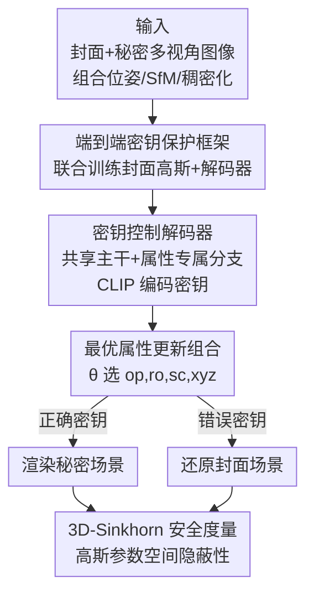

# All That Glitters Is Not Gold: Key-Secured 3D Secrets within 3D Gaussian Splatting

**会议**: ICLR2026  
**OpenReview**: [https://openreview.net/forum?id=CcxIDaTfLB](https://openreview.net/forum?id=CcxIDaTfLB)  
**代码**: https://github.com/RY-Paper/KeySS  
**领域**: 3D视觉 / 3D高斯泼溅 / 3D隐写 / 版权保护  
**关键词**: 3D高斯泼溅, 隐写术, 密钥控制, 最优传输, 多秘密隐藏

## 一句话总结
KeySS 把"在一个 3DGS 封面场景里藏多个 3DGS 秘密场景"做成端到端可训练框架：用 CLIP 编码的密钥控制一个解码器把封面高斯直接变换成秘密高斯，错误密钥只会还原封面；同时发现高斯的不同属性对藏秘贡献并不相等（不透明度有用、球谐几乎无用），并提出 3D-Sinkhorn 距离在高斯参数空间里度量隐写隐蔽性，最终在重建保真度与抗检测安全性上都超过 GS-Hider。

## 研究背景与动机
**领域现状**：3D 高斯泼溅（3DGS）让高质量场景重建变得又快又好，也顺势催生了"3D 隐写"——把一个秘密 3D 场景藏进一个看起来人畜无害的封面 3D 场景里，用于版权保护、安全分发等。和图像/音视频隐写一样，目标是让秘密的"存在"和"内容"都对未授权者不可见，同时授权者能可靠还原。

**现有痛点**：现有 3DGS 隐写方法都在标准 3DGS 管线上动刀。GS-Hider 用"耦合颜色特征"替换标准球谐系数、再换一个场景解码器来渲染，虽然保真度高，但改动会在 `.ply` 文件结构上留下肉眼/工具可察的异常，反而暴露了"这里藏了东西"。WaterGS 用分级球谐加密 + 自编码器映射不透明度来提升隐蔽性，但它把球谐和不透明度分开加密，整条管线是断开的、非端到端的，且复杂的嵌入过程使它无法在同一封面里藏多个秘密。

**核心矛盾**：隐写的根本张力是**隐蔽性 vs 保真度**。一个看似省事的做法是直接把某些高斯属性置零来"藏"秘密（比如把秘密高斯的不透明度设为 0），但这极不安全——攻击者只要把零值属性还原就能瞬间把秘密"显形"。也就是说，单纯依赖某一个属性既不安全，也没把高斯的表达能力用满。

**本文目标**：①让隐写后的封面场景在文件格式和渲染流程上都与标准 3DGS 完全一致（不留改动痕迹）；②支持同一封面藏多个秘密、且能凭密钥分别取出；③对未授权（错误密钥）访问有防御；④给 3D 隐写一个真正能在 3D 参数空间度量隐蔽性的指标。

**切入角度**：作者的关键观察是——**"金玉其外"，并非所有高斯属性都对藏秘有用**（all that glitters is not gold）。实验里，改不透明度能有效藏秘，而改球谐几乎没用甚至破坏训练稳定性。既然属性贡献不均，就应该系统地去找"哪几个属性组合"能在保真和安全间取得最好平衡，而不是盲目用全部属性或只用一个。

**核心 idea**：训练一个**密钥控制的解码器**，把封面高斯 $G_{cover}$ 直接变换成秘密高斯 $G_{secret}^s = D(G_{cover}, k_s)$，全程保持标准高斯属性格式与渲染；正确密钥取出秘密，错误密钥还原封面；再配一个**最优属性更新组合**搜索 + **3D-Sinkhorn** 安全度量。

## 方法详解

### 整体框架
KeySS 是一个**端到端、从零联合训练**的框架：输入是封面场景和若干秘密场景各自的多视角 2D 图像（带对齐相机位姿），输出是一套**标准格式**的封面高斯 $G_{cover}$ 外加一个密钥控制解码器 $D$。推理时，给定一个 16 位字符密钥 $k_s$，解码器把封面高斯就地变换成第 $s$ 个秘密高斯 $G_{secret}^s = D(G_{cover}, k_s)$，再用**标准 3DGS 渲染**得到该秘密场景的图像；若给的是错误密钥，解码器被训练成只还原封面场景，不泄露任何秘密。

关键之处在于：封面场景对外就是一份普普通通的 `.ply`，属性（不透明度 $\alpha$、旋转 $r$、缩放 $s$、位置 $\mu$、球谐 $c$）和渲染都和标准 3DGS 一模一样，秘密完全编码在"解码器 + 密钥"里，因此从文件和渲染层面都查不出端倪。整条管线由三类损失驱动：封面重建损失 $L_{cover}$、各秘密重建损失 $L_{secret}^s$、错误密钥损失 $L_{incorrect}$；并辅以"组合相机位姿 / 组合 SfM 初始化 / 组合稠密化"三个训练技巧来同时照顾封面与秘密两套场景。

### 关键设计

**1. 端到端密钥保护框架：让隐写后的封面与标准 3DGS 完全无差别**

针对 GS-Hider/WaterGS"改了管线就留痕迹、且非端到端"的痛点，KeySS 不去改高斯的属性定义或渲染方式，而是把"藏秘"完全转移到一个可学习的变换 $G_{secret}^s = D(G_{cover})$ 上。给定 $S+1$ 套带对齐位姿的 2D 图像（1 套封面 + $S$ 套秘密），框架同时从零学习：(1) 一个能重建封面场景的标准 3DGS 模型 $G_{cover}=\{G_i(x)\}_{i=1}^N$；(2) 把 $G_{cover}$ 解码成多个秘密 3DGS 模型 $G_{secret}^s$ 的变换。封面与秘密的重建都用 L1 + SSIM 的组合损失约束：

$$L_{cover} = (1-\lambda_{cover})L_1(I_{pred\ cover}, I_{gt\ cover}) + \lambda_{cover} L_{SSIM}(I_{pred\ cover}, I_{gt\ cover})$$

秘密侧 $L_{secret}^s$ 同理。因为封面始终是合法的标准高斯、用标准 alpha 合成渲染，未授权者拿到 `.ply` 看不出任何异常，这就从根上避免了"改管线留痕"的暴露风险，也让框架天然兼容后续 3DGS 的各种改进。

**2. 密钥控制解码器：用 CLIP 编码的密钥一把钥匙开一把锁，错钥只还原封面**

为了实现"多秘密 + 抗未授权"，解码器额外以一个用户密钥 $k_s$ 为条件：$G_{secret}^s = D(G_{cover}, k_s)$。密钥是 16 位大小写字母数字串，先 tokenize，再过 CLIP（ViT-L/14）的文本编码器 $E$ 并平均池化得到密钥嵌入 $k = \text{AvgPool}(E(k))$——用 CLIP 是因为它擅长把任意文本映射成语义嵌入，便于把"密钥空间"做得足够大且语义可分。该嵌入与归一化后的高斯属性拼接后送入解码器。解码器本身是"一个共享主干 + 多个属性专属分支"的解耦结构：把所有属性与密钥拼成 $f=\text{concat}(\alpha,r,s,\mu,c,k)$，过共享分支得公共特征 $h=\text{MLP}_{common}(f)$，再让 $h$ 与原封面属性分别进入各属性的专属 MLP，得到更新后的属性。

抗未授权靠 $L_{incorrect}$ 实现：训练时随机生成错误密钥，强制解码器在错钥下只重建封面：

$$L_{incorrect} = (1-\lambda_{incorrect})L_1(I_{pred\ incorrect}, I_{gt\ cover}) + \lambda_{incorrect} L_{SSIM}(I_{pred\ incorrect}, I_{gt\ cover})$$

这样错误密钥既看不到秘密、也不会暴露"这里有秘密"。多秘密则几乎零成本——只需再加一个秘密损失项 $L_{secret}^s$，不动任何架构，就能在同一封面里塞进 secret1、secret2，并凭不同密钥分别取出。

**3. 最优属性更新组合：承认"并非所有属性都是金子"，系统搜出 op+ro+sc+xyz 最佳**

这是论文标题点出的核心洞察。作者用一个二值向量 $\theta\in\mathbb{R}^5$ 来开关五个属性分支的更新，被更新属性等于"原属性 + 专属分支增量"，未被选中的属性保持不动：

$$[\alpha^*, r^*, s^*, \mu^*, c^*]^\top = [\alpha, r, s, \mu, c]^\top + \theta \circ [\text{MLP}_{op}(h), \text{MLP}_{ro}(h), \text{MLP}_{sc}(h), \text{MLP}_{po}(h), \text{MLP}_{sh}(h)]^\top$$

其中 $\circ$ 是 Hadamard 积。靠这个开关，作者系统遍历不同属性组合，发现：改不透明度（op）对藏秘最有效，改球谐（sh）影响极小甚至会破坏嵌入稳定性；但只靠不透明度又有致命安全漏洞——攻击者只要检测并还原零值不透明度就能显形秘密。最终结论是把不透明度与旋转、位置、缩放组合（op, ro, sc, xyz）能在安全性与保真度上都明显优于任何单属性方案。这个设计直接回应了"全用 / 单用都不对"的矛盾，把"该改哪些属性"从拍脑袋变成可搜索的工程问题。

**4. 3D-Sinkhorn 安全度量：在高斯参数空间里量隐蔽性，揪出 2D 指标看不见的统计指纹**

针对"传统 2D 图像指标（PSNR/StegExpose）测不出 3D 表征里的统计异常"这一盲区，作者引入基于 Sinkhorn 距离（带熵正则的最优传输）的安全指标，直接在高斯参数空间度量"隐写后封面"与"原始封面"的分布差异。评估时把两者的高斯归一化后投影成各属性的直方图 $g_i=\text{hist}(f_i)$、$g_i^{gt}=\text{hist}(f_i^{gt})$，再求和：

$$d = \sum_i \text{Sinkhorn}(g_i, g_i^{gt})$$

$d$ 越小，说明隐写封面与原封面在参数分布上越接近，越能同时抵抗肉眼检视和算法检测。Sinkhorn 距离的好处是熵正则带来计算效率、又保留了 3D 分析所需的几何对应。作者进一步把保真与隐蔽合成一个综合分用于选属性组合：

$$\text{score} = (\text{PSNR}_{cover} + \text{PSNR}_{secret}) \cdot (1 - d)$$

实验证明：只改不透明度的方案虽然渲染保真还行，却会在参数空间留下独特的统计签名——这种签名 2D 指标看不见，却被 3D-Sinkhorn 抓个正着，从而论证了"3D 隐写需要 3D 专属安全指标"。

### 损失函数 / 训练策略
总损失把三类目标加权求和：

$$L = \beta_{cover} L_{cover} + \sum_{s=1}^{S}\beta_{secret}^s L_{secret}^s + \beta_{incorrect} L_{incorrect}$$

训练用了四个配套技巧来同时照顾封面与多套秘密：**组合相机位姿**（合并封面与秘密的位姿，对某一方独有的位姿用预训练模型补出对应 GT 图像，扩充训练样本）、**组合 SfM 初始化**（用封面+秘密合并的点云初始化，保留两套场景的空间结构）、**三重损失反传**、**组合稠密化**（用封面与秘密两套视空间梯度共同指导高斯的克隆/分裂，兼顾秘密细节与封面完整）。实现细节：训练 30,000 次迭代、单张 24GB RTX 6000，封面高斯上限 50 万；$\lambda_{cover}/\lambda_{secret}/\lambda_{incorrect}$ 均取 0.5，$\beta_{cover}=\beta_{secret}=0.5$、$\beta_{incorrect}=0.01$；密钥用 16 位字母数字串经 CLIP ViT-L/14 编码。

## 实验关键数据

数据集沿用 GS-Hider 协议：Mip-NeRF360 的 9 个场景 + Deep Blending 的 1 个，组成 9 对封面-秘密；多秘密则构造（封面, secret1, secret2）三元组。评测在未见过的新视角上做，主指标 PSNR（SSIM/LPIPS 在附录）。

### 主实验

| 设置 | 类型 | 指标 | KeySS | GS-Hider | 说明 |
|------|------|------|-------|----------|------|
| 单秘密（avg） | 封面 | PSNR↑ | 25.980 | 25.817 | KeySS 封面保真更高 |
| 单秘密（avg） | 秘密 | PSNR↑ | 26.427 | 25.178 | KeySS 秘密还原 +4.9% |
| 保真损失 | 封面 | 距上界 dB↓ | 0.511 | 1.388 | KeySS 离自身 3DGS 上界更近 |
| 错误密钥 | vs 秘密 | PSNR↓ | 10.341 | — | 错钥下与秘密差异大=防御有效 |

注：3DGS-GT(KeySS) 封面上界为 26.518 dB，KeySS 只比上界低 0.511 dB；错误密钥下"vs 秘密"PSNR 仅 10.341（越低越好，说明几乎取不出秘密），而"vs 封面"高达 25.916（成功还原封面）。

### 多秘密与安全性

| 维度 | 数据 | 说明 |
|------|------|------|
| 多秘密 PSNR | 与单秘密相当（如 Bicycle 三元组 secret1=29.031） | 仅加一个损失项即可扩展，无需改架构 |
| StegExpose AUC | KeySS-best 0.45 / multi 0.38 vs GS-Hider 0.29 | 越接近 0.5（随机猜）越难检测，KeySS 显著更隐蔽 |
| 解码器参数量 | MLPs 仅 125.7k | 轻量，且首个开源、首个支持 3D-Sinkhorn |

### 关键发现
- **属性不等价**：改不透明度有效、改球谐近乎无用甚至破坏训练；op+ro+sc+xyz 组合在保真与安全上全面优于单属性，这是全文最核心的实证。
- **2D 指标的盲区**：不同属性组合在 StegExpose 上 AUC 相近，无法区分安全性，必须靠 3D-Sinkhorn 才能揭示参数空间里的统计差异——直接论证了新指标的必要性。
- **错钥防御稳健**：随机错误密钥下"vs 秘密"PSNR 仅约 10 dB，说明未授权者基本无法还原秘密内容。

## 亮点与洞察
- **"金玉其外"的洞察很扎实**：把"哪些高斯属性真正承载秘密"做成可开关搜索的问题，并给出 op+ro+sc+xyz 这一可复用结论——比"用全部属性"或"只置零某属性"都更有工程价值。
- **格式不变是安全性的根**：不改高斯属性定义、不改渲染，秘密全藏在"解码器+密钥"里，从文件层就查不出异常；这种"对外完全合规"的思路可迁移到其他 3D 资产保护场景。
- **3D-Sinkhorn 填了真空**：第一次在高斯参数空间而非渲染图像空间度量隐写安全，揭示了 2D 指标看不见的统计指纹，方法论上对"3D 隐写如何评测"是有贡献的。
- **多秘密近乎零成本扩展**：只加一个秘密损失项就能塞进第二个秘密、凭密钥分别取出，密钥控制方案天然支持多用户/选择性披露。

## 局限与展望
- **依赖对齐的多视角 GT**：训练需要封面与各秘密场景的对齐位姿与 GT 图像，对秘密独有位姿还得用预训练模型补图，数据准备成本不低。
- **对比受限于不开源基线**：WaterGS、SecureGS 未开源，论文只能在框架层面对比、或直接引用其论文数值，且各方所用 3DGS-GT 上界不同，PSNR 不完全可直比——横向结论需保留 caveat。
- **规模与密钥空间**：封面高斯上限 50 万、密钥 16 位字符，更大场景或更高安全需求下的可扩展性与密钥碰撞风险未充分探讨。
- **可改进方向**：θ 目前是离散开关 + 人工遍历，可探索可微/可学习的属性选择；密钥编码也可尝试比 CLIP 文本编码器更专为隐写设计的方案。

## 相关工作与启发
- **vs GS-Hider**：GS-Hider 用耦合颜色特征替换球谐 + 场景解码器，改了管线会留痕、且无法多秘密；KeySS 保持标准格式与渲染、端到端、支持多秘密，封面/秘密保真都更高（秘密 +4.9%），抗检测也更强（AUC 更接近 0.5）。
- **vs WaterGS**：WaterGS 把球谐与不透明度分开加密，管线断裂、非端到端、不支持多秘密；KeySS 用单个密钥控制解码器统一完成变换，端到端且可多秘密。
- **vs SecureGS**：SecureGS 端到端但不带显式安全密钥机制、无多秘密；KeySS 增加密钥可控 + 错钥防御 + 3D-Sinkhorn 评测。
- **启发**：用最优传输在表征空间度量"分布是否被篡改"的思路，可迁移到水印、对抗检测、模型指纹等需要"看不见的改动"的安全任务。

## 评分
- 新颖性: ⭐⭐⭐⭐ "属性不等价"洞察 + 密钥控制多秘密 + 3D-Sinkhorn 评测三点组合较新
- 实验充分度: ⭐⭐⭐⭐ 单/多秘密、StegExpose、错钥防御、属性消融齐全，但受基线不开源限制
- 写作质量: ⭐⭐⭐⭐ 动机与图示清晰，标题点睛，公式与方法叙述自洽
- 价值: ⭐⭐⭐⭐ 3D 资产版权/安全分发场景实用，且首个开源 + 提出 3D 专属安全指标

<!-- RELATED:START -->

## 相关论文

- [\[ICLR 2026\] CLoD-GS: Continuous Level-of-Detail via 3D Gaussian Splatting](clod-gs_continuous_level-of-detail_via_3d_gaussian_splatting.md)
- [\[ICLR 2026\] Learning Unified Representation of 3D Gaussian Splatting](learning_unified_representation_of_3d_gaussian_splatting.md)
- [\[ICCV 2025\] Not All Frame Features Are Equal: Video-to-4D Generation via Decoupling Dynamic-Static Features](../../ICCV2025/3d_vision/not_all_frame_features_are_equal_video-to-4d_generation_via_decoupling_dynamic-s.md)
- [\[ICLR 2026\] SSD-GS: Scattering and Shadow Decomposition for Relightable 3D Gaussian Splatting](ssd-gs_scattering_and_shadow_decomposition_for_relightable_3d_gaussian_splatting.md)
- [\[ICLR 2026\] Human3R: Everyone Everywhere All at Once](human3r_everyone_everywhere_all_at_once.md)

<!-- RELATED:END -->
