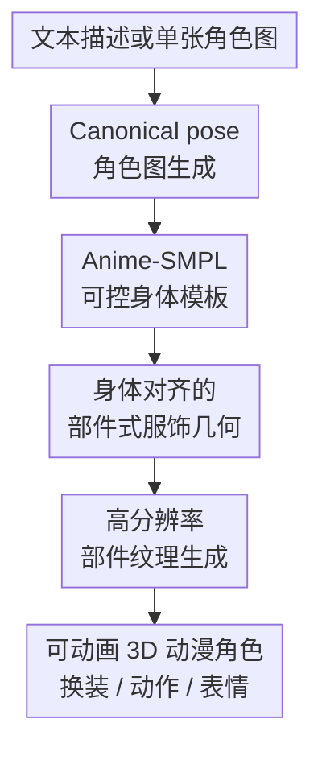

# Anime-Ready: Controllable 3D Anime Character Generation with Body-Aligned Component-Wise Garment Modeling

**会议**: ICLR 2026  
**OpenReview**: [https://openreview.net/forum?id=BRoAjhYWoQ](https://openreview.net/forum?id=BRoAjhYWoQ)  
**代码**: 待确认  
**领域**: 3D视觉  
**关键词**: 3D角色生成, 动漫角色, 可动画人体模型, 部件式服饰建模, 纹理生成  

## 一句话总结
Anime-Ready 把文本或单图先规范到 A-pose 动漫角色图，再用 Anime-SMPL、身体对齐的部件式服饰 DiT 和分组件纹理生成，把 3D 动漫角色从“看起来像”推进到带骨骼、可换装、可表情控制的动画可用资产。

## 研究背景与动机
**领域现状**：3D 角色生成已经从 SDS 优化、multi-view reconstruction、LRM/triplane 和 3D latent diffusion 等路线快速发展，真实人体方向也有 SMPL/SMPL-X 这类成熟参数化身体模型支撑动画、姿态控制和换装。动漫角色生成则更依赖大模型从单图或文本生成整个人物网格，代表性方法通常把角色当作一个整体 3D 对象来重建。

**现有痛点**：动漫角色不是普通人类模型换一层贴图。它们有夸张眼睛、非真实比例、复杂发型、层叠衣物和大量装饰件，直接整模生成容易在手部、头发、裙摆等细节处变糊，网格拓扑也不稳定。更关键的是，很多结果没有可靠骨骼、统一拓扑和 skinning 权重，只能当静态摆件，难以进入动画、游戏或虚拟主播管线。

**核心矛盾**：参数化人体模型能带来可控性和动画能力，但 SMPL 这类模板假设的是真实人体比例；3D 生成模型能生成风格化外观，却缺少和身体结构稳定对齐的约束。动漫角色生产真正需要的是“生成质量”和“工业可控性”同时成立：角色要好看，衣服不能穿模，身体要能驱动，脸和手还要能细粒度控制。

**本文目标**：作者把问题拆成三个具体子任务：先构建适合动漫比例且可绑定的身体模板；再把头发、上衣、下装、饰品作为独立组件生成，并让它们贴合身体；最后为身体和每个服饰组件生成清晰纹理，避免整图投影时常见的颜色串扰。

**切入角度**：论文的观察很直接：动漫角色的可用性不是由某个单一大模型决定，而是由“身体模板、服饰几何、纹理投影、动画控制”这几件事能否对齐决定。因此作者没有继续做端到端整模生成，而是把角色拆成 body + garment components，用统一身体模板作为几何锚点。

**核心 idea**：用 Anime-SMPL 提供可动画的动漫身体骨架，再用身体表面 latent token 约束部件式服饰生成，并对身体和服饰分别做高分辨率纹理生成，从而同时提升网格质量、贴图清晰度和动画可控性。

## 方法详解

### 整体框架
Anime-Ready 的输入可以是一段文本，也可以是一张任意姿态的角色图。系统先生成或规范化出一个正面 canonical pose 图像，再回归 Anime-SMPL 身体参数，得到带统一拓扑、关节和 LBS 权重的动漫身体；随后在身体表面采样点并编码成 body latent tokens，作为服饰生成的显式几何条件；最后分别生成身体 UV 纹理和各服饰组件纹理，组装成可动画的 3D 动漫角色。

这条 pipeline 的重点不是单纯“从图到 3D”，而是让每个阶段保留后续动画和编辑所需的结构信息。身体负责骨架、拓扑和表情控制，服饰作为独立组件负责细节和可替换性，纹理阶段则避免把整个人物直接烘成一张互相污染的贴图。

### 关键设计
**1. Anime-SMPL 可控身体模板：把动漫角色从静态网格变成可驱动身体**

原始 SMPL 的优势是拓扑、骨骼和 skinning 结构稳定，但它的平均人体和形状空间都是为真实人类设计的，放到动漫角色上会在脸型、耳朵、腿部比例和夸张眼睛等地方明显不贴合。Anime-Ready 不是直接把 SMPL 当作先验套上去，而是在 20,000 个对齐到统一模板的动漫角色上重新构建 Anime-SMPL，使所有角色共享 12,489 个顶点的同一拓扑、顶点顺序和面连接关系。

参数化上，Anime-SMPL 主要建模 canonical pose 下的形状变化。作者对这些角色网格做 PCA，保留前 98 个主成分，用形状参数 $\beta$ 表示不同动漫体型和脸部比例。关节回归矩阵 $J$ 通过非负最小二乘估计：给定顶点矩阵 $V \in \mathbb{R}^{N \times 3}$ 和目标关节位置 $B_V \in \mathbb{R}^{K \times 3}$，求解 $\min_{J \ge 0} \lVert JV - B_V \rVert_F^2$ 且 $J\mathbf{1}_N = \mathbf{1}_K$。这一步让生成结果天然带有关节、LBS 权重和统一 UV 布局，后面才能做动作、手指控制和 blendshape 表情控制。

**2. 身体对齐的部件式服饰几何：让头发和衣物按身体长出来，而不是事后硬贴上去**

旧的整模生成会把身体、衣服、头发和饰品混在一个表示里，结果一旦衣服层次复杂，模型既要决定“衣服是什么”，又要猜“它该贴在哪”，很容易出现裙摆穿进腿、紧身衣偏离身体、头发结构塌掉等问题。本文把非身体部分固定拆成四类：hairstyles、upper garments、lower garments 和 accessories，每一类都生成独立高分辨率 textured mesh，这样每个组件后续可以单独编辑、重定向和贴图。

几何约束来自 Anime-SMPL 本身。系统在估计出的 3D 身体表面采样点云，再用 VecSet VAE encoder 编成 body latent tokens；生成服饰时，把这些 body latent tokens 和 noised garment component tokens 拼接送入 VecSet Diffusion Model。论文中 garment token 长度为 3072，body latent token 用较低分辨率 512，以降低计算量但保留身体空间轮廓。这样模型不是只看一张 2D 条件图来猜服饰位置，而是在 3D latent 空间里直接看到身体表面，紧身泳装这类贴合身体的衣物尤其受益，穿模和错位明显减少。

**3. MoE-structured Multi-Shape DiT：一个生成器覆盖四类组件，同时保留类别专门性**

四类组件的形状差异很大：头发通常是复杂外轮廓和细碎簇状结构，上衣更贴近躯干，下装可能包含裙摆和腿部遮挡，饰品则尺度和位置都更不稳定。如果每类单独训练模型，成本高且数据利用不充分；如果完全共享一个 DiT，又容易把不同组件的形状先验混在一起。作者因此在 Multi-Shape DiT 中引入 Mixture-of-Experts，只让四个 MLP expert 分支按组件类别专门化，其余参数共享。

具体做法是用 DINOv2 编码 canonical-pose 图像作为条件 token，再加入 timestep、noised latent tokens、body latent tokens 和一个 learnable label token。label token 指示当前要生成哪一类组件，router 将信息送到对应 expert 分支。输出仍以 SDF 表示服饰组件，最后通过 marching cubes 提取 3D mesh。这个设计的价值在于，它把“共享的角色视觉语义”和“组件级几何规律”分开：共享主干学习整体角色外观，专家分支学习头发、上衣、下装、饰品各自的局部形状分布。

**4. 高分辨率部件纹理生成：先拆出组件外观，再做多视角投影**

纹理阶段如果直接用整张 canonical-pose 图和 normal map 去驱动 MVAdapter，某个组件会被相邻区域颜色污染，例如头发贴图沾到脸部颜色、衣物颜色串到饰品上。Anime-Ready 对身体和服饰分开处理：身体利用 Anime-SMPL 的统一 UV layout，在 UV 空间按 body skin、facial skin、left eye、right eye、eyebrows、eyelashes 六个语义区域生成纹理；服饰则先把整身图像分解成各组件的放大独立视图。

服饰纹理 pipeline 使用所有组件 normal maps 和 canonical-pose 图作为条件，通过 multi-component self-attention 在组件之间交换必要信息，再用 label embedding 和 timestep embedding 经过 cross-attention 融合。得到每个组件的独立图像后，再分别送入 MVAdapter 生成前、后、左、右、上、下六个 canonical view，并反投影到对应 3D 表面。由于每个组件单独分配纹理分辨率，遮挡也被拆散，最终贴图比整模投影更清晰，也更少颜色 bleeding。

### 一个完整示例
假设输入是一张侧身姿态的黄裙动漫角色图。系统首先用 image-to-image 模型把它规范到正面 A-pose，并在训练时通过光照、轮廓线粗细和上半身裁剪增强，让模型尽量不被原图姿态限制。接着 ResNet 形状预测网络从这张 canonical 图回归 Anime-SMPL 的 $\beta$，生成一个动漫比例的裸体身体模板，同时得到关节位置、LBS 权重和统一 UV。

然后模型在这个身体表面采样点云，编码成 512 个 body latent tokens。服饰生成阶段会分别以 label token 指定“头发”“上衣”“下装”“饰品”，同一个 MoE Multi-Shape DiT 依次生成四个 SDF 组件，再用 marching cubes 转成网格。对黄裙这种贴身但有裙摆的服装，body latent tokens 负责告诉模型腰部、腿部和躯干在哪里，MoE expert 则负责生成下装自己的形状风格。

纹理阶段，身体 UV 会分别生成皮肤、脸、眼睛、眉毛和睫毛区域；裙子、头发和饰品则先从整身图里拆成各自的放大组件图，再走 MVAdapter 生成六视图贴图。最终角色不仅有清晰面部和手部纹理，还能继承 Anime-SMPL 的骨骼做全身动作，脸部顶点也能通过 blend shapes 做表情控制。

### 损失函数 / 训练策略
Anime-SMPL 形状预测网络用前视 canonical 角色图预测形状参数 $\hat{\beta}$，训练目标是预测参数与真实参数 $\beta$ 的 MSE。身体模板的关节回归矩阵用带非负和行和约束的最小二乘求解，保证每个关节位置是身体顶点的稳定加权组合。

2D canonical pose 生成分为 text-to-image 和 image-to-image 两条入口。文本入口微调 PixArt-$\Sigma$，使用文本描述与正面 canonical pose 角色图配对训练；图像入口使用 ReferenceUNet 和 CLIP 提取参考图特征，并额外输入通用 A-pose skeleton image 作为姿态条件。训练数据来自不同视角、姿态和表情的渲染动漫角色，并加入光照变化、轮廓线变化和 pose-estimation 风格裁剪增强。

训练成本上，Anime-SMPL 形状预测网络在单张 NVIDIA L20 上约 4 小时；MoE-structured Multi-Shape DiT 使用 16 张 A100、AdamW 和 $1 \times 10^{-4}$ 学习率，约训练 10 天；2D canonical pose 生成、身体纹理和服饰组件纹理模块分别在 8 张 A100 上约训练 2 天。推理时间中，图像生成约 5 秒，Anime-SMPL 参数预测约 2 秒，MoE Multi-Shape DiT 约 40 秒，身体纹理约 10 秒，服饰纹理约 360 秒，说明瓶颈主要在高分辨率服饰贴图。

## 实验关键数据

### 主实验
论文用用户研究替代 PSNR/SSIM/LPIPS 等重建指标，原因是各方法训练数据不同：CharacterGen 和 StdGEN 使用 Anime3D，Hunyuan3D 2.0 使用包含 ObjaverseXL 的大规模数据，而本文使用私有 20k 对齐动漫角色数据。用户研究随机取 16 个来自互联网和合成数据的动漫角色，30 名参与者分别评价 mesh quality、texture quality 和 fidelity，分数范围为 1 到 5。

| 方法 | Mesh Quality↑ | Texture Quality↑ | Fidelity↑ |
|------|---------------|------------------|-----------|
| CharacterGen | 2.58 | 2.14 | 2.51 |
| StdGEN | 2.69 | 2.23 | 2.52 |
| Hunyuan3D 2.0 | 3.14 | 3.49 | 3.42 |
| Anime-Ready | 3.83 | 3.75 | 3.74 |

从表中看，本文在三项感知指标上都是最高。相对最强 baseline Hunyuan3D 2.0，mesh quality 从 3.14 提升到 3.83，说明 Anime-SMPL 和部件式服饰生成确实改善了网格结构；texture quality 从 3.49 到 3.75，提升幅度较小但仍领先；fidelity 从 3.42 到 3.74，说明分组件建模没有牺牲对输入角色的保真。

### 消融实验
| 配置 / 对比 | 观察指标 | 主要结论 |
|-------------|----------|----------|
| SMPL vs. Anime-SMPL | 耳朵形状、脸部轮廓、大腿与小腿比例 | Anime-SMPL 更贴合动漫角色夸张比例，SMPL 在这些部位明显偏真实人体 |
| 无 body latent tokens | 服饰贴合、穿模情况 | DiT 可大致猜出服饰布局，但紧身衣物和身体表面更容易错位或穿模 |
| 加 body latent tokens | 服饰贴合、穿模情况 | 显式身体几何让服饰沿身体表面生成，泳装等贴身服装改善尤其明显 |
| 无 MoE layers | 组件生成质量、图像-几何对齐 | 共享 DiT 容易混淆不同组件形状先验，上衣生成质量下降 |
| 加 MoE layers | 组件生成质量、图像-几何对齐 | 四个 expert 分支让不同组件保留专门几何规律，生成质量和对齐更好 |

### 关键发现
- Anime-SMPL 是整条 pipeline 的控制锚点。没有适合动漫比例的身体模板，后续服饰生成即使外观好，也难以稳定绑定骨骼和做表情、动作控制。
- body latent tokens 贡献集中在服饰-身体空间关系上。它不只是多一个条件，而是把 3D 身体表面直接放进生成器，让模型减少“从 2D 图猜深度位置”的不确定性。
- MoE 的作用不是扩大模型规模，而是把不同组件的形状分布隔开。对于头发、上衣、下装、饰品这种几何差异大的类别，少量专门 expert 比完全共享更合适。
- 服饰纹理生成是当前推理瓶颈。360 秒的 garment texturing 远高于其他阶段，说明高分辨率、六视图、多组件投影虽然提升质量，但还不是实时资产生成管线。

## 亮点与洞察
- **可动画优先的 3D 生成思路**：论文没有只追求单帧视觉质量，而是从一开始就把骨骼、统一拓扑、UV 和 skinning 纳入设计。这对游戏、动画和虚拟主播应用比单纯“长得像”的 3D mesh 更重要。
- **把身体当作服饰生成坐标系**：body latent tokens 是很实用的设计，因为服饰是否可用很大程度取决于它和身体表面的相对关系。这个思路可以迁移到鞋帽、装备、背包等可穿戴 3D asset 生成中。
- **组件式纹理缓解颜色串扰**：先从整身图中拆出每个组件，再独立做 MVAdapter 多视角生成，比直接对整模投影更符合角色资产制作流程。它也自然支持后续单独重绘衣服、头发或饰品。
- **Anime-SMPL 提供了生成与编辑之间的桥**：统一模板让 garment retargeting、motion control 和 facial expression control 都变得顺手，说明参数化模型和生成模型不是互斥路线，而可以形成互补。

## 局限与展望
- 论文使用 20k 私有对齐动漫角色数据，数据集不可公开会限制可复现性，也让与开源 baseline 的比较存在训练数据差异。用户研究能反映感知质量，但还缺少更细的几何穿模率、动画稳定性和拓扑质量量化指标。
- Pose canonicalization 对复杂姿态或多饰品角色仍会失败。若第一步规范姿态图已经扭曲，后续 Anime-SMPL 回归和服饰生成都会继承错误，因此这里可能需要更强的多视角或显式骨架约束。
- SDF 经 marching cubes 提取的服饰 mesh 会有 double-sided 问题，影响物理仿真。作者也指出未来可以考虑直接生成 vertices/faces 的 mesh 方法，减少双层面和后处理负担。
- 纹理仍存在多视角投影和几何之间的 misalignment，以及 cross-view inconsistency。更理想的方向是在 3D 空间或 UV 空间直接生成组件纹理，减少六视图反投影带来的接缝和不一致。

## 相关工作与启发
- **vs CharacterGen**: CharacterGen 从单图生成 3D 角色，并强调 multi-view pose canonicalization，但结果仍更接近静态角色重建。Anime-Ready 进一步引入 Anime-SMPL 和组件服饰建模，目标从“生成角色”扩展到“生成可动画角色资产”。
- **vs StdGEN**: StdGEN 也采用语义分解来改善 3D character generation，但本文的分解更贴近工业资产结构：身体、头发、上衣、下装、饰品各自独立，并且用身体 latent 约束几何贴合。
- **vs Hunyuan3D 2.0**: Hunyuan3D 2.0 是强通用 3D asset 生成 baseline，纹理质量很高，但它不专门解决动漫身体拓扑、骨骼绑定和服饰-身体对齐。Anime-Ready 的优势来自任务专门化和 animation-ready 约束。
- **vs SMPL/SMPL-X 人体路线**: SMPL/SMPL-X 的核心价值是可控身体参数化，但真实人体模板不适配动漫比例。Anime-SMPL 的启发是：面向强风格化角色时，参数化身体模型也应当按风格域重建，而不是强行套用真实人体先验。
- **vs body-aligned garment generation**: 现实服饰生成方法常依赖 sewing patterns 或 body-aligned wearable asset 表示，适合真实衣物但难覆盖动漫中的夸张服装和发型。本文把 body alignment 和 3D diffusion/MoE 结合，更适合风格化、非物理严格的角色资产。

## 评分
- 新颖性: ⭐⭐⭐⭐☆ 把 Anime-SMPL、body-aligned garment tokens、MoE 组件生成和组件式纹理串成 animation-ready pipeline，组合设计针对性很强，但不少模块建立在已有 DiT、MVAdapter 和参数化人体思想之上。
- 实验充分度: ⭐⭐⭐☆☆ 主实验和消融能支撑核心结论，但主要是用户研究和定性可视化，缺少穿模率、动画稳定性、纹理一致性等更可量化的工程指标。
- 写作质量: ⭐⭐⭐⭐☆ 方法结构清楚，pipeline 和应用展示完整；不足是私有数据和若干消融只有图示结论，读者难以完全复现或精确比较。
- 价值: ⭐⭐⭐⭐☆ 对动漫、游戏和虚拟角色生产很有现实价值，尤其是“生成即绑定可控”的方向值得继续推进。

<!-- RELATED:START -->

## 相关论文

- [\[CVPR 2025\] StdGEN: Semantic-Decomposed 3D Character Generation from Single Images](../../CVPR2025/3d_vision/stdgen_semantic-decomposed_3d_character_generation_from_single_images.md)
- [\[CVPR 2026\] ReWeaver: Towards Simulation-Ready and Topology-Accurate Garment Reconstruction](../../CVPR2026/3d_vision/reweaver_towards_simulation-ready_and_topology-accurate_garment_reconstruction.md)
- [\[ICLR 2026\] Color3D: Controllable and Consistent 3D Colorization with Personalized Colorizer](color3d_controllable_and_consistent_3d_colorization_with_personalized_colorizer.md)
- [\[CVPR 2026\] PartDiffuser: Part-wise 3D Mesh Generation via Discrete Diffusion](../../CVPR2026/3d_vision/partdiffuser_part-wise_3d_mesh_generation_via_discrete_diffusion.md)
- [\[CVPR 2026\] SwiftTailor: Efficient 3D Garment Generation with Geometry Image Representation](../../CVPR2026/3d_vision/swifttailor_efficient_3d_garment_generation_with_geometry_image_representation.md)

<!-- RELATED:END -->
