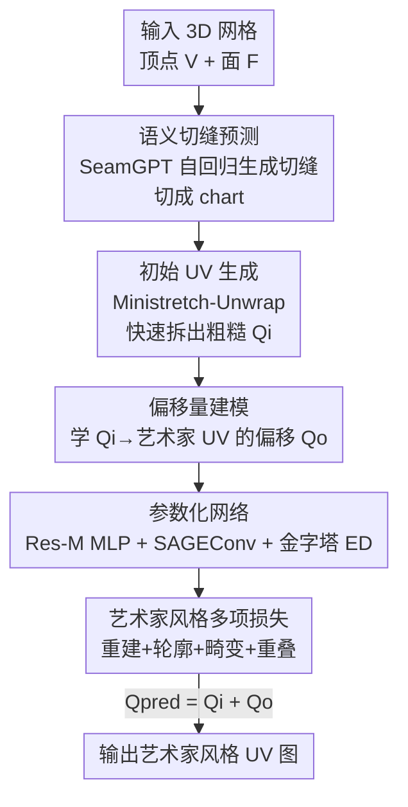

# ArtUV: Artist-style UV Unwrapping

**会议**: ICLR2026  
**OpenReview**: [https://openreview.net/forum?id=LN7VQ3ed1t](https://openreview.net/forum?id=LN7VQ3ed1t)  
**代码**: 待确认  
**领域**: 3D视觉  
**关键词**: UV 展开, 艺术家风格, 表面切缝, 自编码器, 网格参数化

## 一句话总结
ArtUV 把"专业美术师手工拆 UV"这件事自动化成端到端两阶段流程——先用 SeamGPT 预测语义切缝、再用一个图卷积+金字塔自编码器把传统软件拆出的"粗糙 UV"回归成偏移量、调成整洁低畸变的艺术家风格 UV 图，在畸变、利用率、速度上都超过 Blender/Maya 乃至人工手拆。

## 研究背景与动机
**领域现状**：UV 展开（UV unwrapping / 参数化）是把 3D 网格上每个顶点 $(x,y,z)$ 映射到 2D 平面坐标 $(u,v)$ 的基础任务，是纹理编辑、光照贴图等所有渲染下游环节的地基。主流做法分三类：自顶向下（先在 3D 表面找切缝把网格切成 chart，再逐 chart 低畸变展开、最后打包成完整 UV 图）、自底向上（把整个表面当离散三角形，按能量函数逐步合并直到收敛）、以及学习式（用一个循环映射网络做 3D→2D→3D 的往返，靠双射等物理约束无监督训练）。

**现有痛点**：合格的 UV 图不只要满足"无重叠、低畸变"这种基本盘，还要满足美术师级别的高阶标准——边界干净、空间利用率高、语义连贯（角色模型里四肢和躯干应该分开拆，方便后续刷纹理）。但三类方法各有硬伤：自顶向下要老练美术师手工定切缝、手工挪 UV 岛，耗时且难在畸变和整洁之间平衡；自底向上的离散-重聚类天然产出碎片化的 UV 图，单个 UV 岛不整洁；学习式方法每个模型都要长时间逐场景训练，且常依赖点云输入，破坏了顶点间的拓扑关系，产出混乱、严重重叠、几乎没法用的 UV。

**核心矛盾**：自底向上和学习式方法都缺乏语义感知，无法产出符合美术师直觉的拆法；而传统自顶向下方法的语义靠人工切缝补，整洁度靠人工挪岛补——本质上"自动化"和"艺术家级质量"之间存在断层，自动方法不够美、够美的方法不够自动。

**本文目标**：做一个全自动、端到端、几秒出图的 UV 展开方法，同时满足语义连贯 + 整洁 + 低畸变这套艺术家标准。作者把它拆成两个子问题：① 怎么自动产出语义合理的切缝；② 怎么把传统软件拆出的粗糙 UV 自动"修"成艺术家风格。

**切入角度**：与其让网络从零硬学 3D→2D 这个困难映射（作者实测即便有真值也很难学好），不如模仿美术师的真实工作流——先用现成优化方法快速拆个初始 UV，再让模型只学"美术师会怎么微调这张初始图"，也就是学初始 UV 与艺术家 UV 之间的**差异（偏移量）**。

**核心 idea**：把艺术家风格 UV 展开建模为"学初始 UV → 艺术家 UV 的逐顶点偏移"，并用 SeamGPT 提供语义切缝，组成"语义切缝 + 偏移回归"的端到端管线。

## 方法详解

### 整体框架
ArtUV 复刻了美术师拆 UV 的两阶段流程：**表面切缝预测**和**艺术家风格 UV 参数化**。输入是一个 3D 网格 $M$（顶点集 $V\in\mathbb{R}^{N\times3}$、三角面集 $F\in\mathbb{R}^{M\times3}$），输出是一张可直接 2D 编辑的艺术家风格 UV 图。

第一阶段，SeamGPT 在网格表面预测语义上有意义的切缝，沿切缝把网格切成若干 chart。第二阶段，每个 chart 先用 Ministretch-Unwrap 这类优化方法快速生成一张粗糙的初始 UV 图 $Q_i$；再把初始 UV 连同网格信息一起喂进 ArtUV 参数化模块（一个自编码器），模块不直接预测最终坐标，而是预测每个顶点需要的**偏移量** $Q_o$，最终 UV 为 $Q_{pred}=Q_i+Q_o$。整个过程保持拓扑结构、保证语义一致，产出可直接用于专业渲染管线的 UV 图。

### 关键设计

**1. SeamGPT 语义切缝预测：把"切哪里"做成自回归序列生成**

UV 展开的第一步是切缝，而碎片化、缺语义正是自动方法的老毛病——切得不对，后面拆得再好也是错的。ArtUV 复刻了 SeamGPT：把表面切割形式化为一个序列预测问题，对切缝顶点做空间排序和量化，每个 token 表示一个坐标值，连续六个 token 定义一段切缝。具体地，对输入网格先在顶点和边上采样点云、用点云编码器压成一个潜在形状条件；再用一个沙漏状（hourglass）的自回归解码器，每一层堆多个 Transformer，层间用保因果的下采样/上采样桥接，从 SOS 到 EOS 自回归地吐坐标 token，最后把离散 token 最近点投影回网格表面得到切缝顶点。相比把切缝当逐点二分类，自回归"下一个切点"的建模能模拟专业工作流，对美术师做的和 AI 生成的网格都能给出语义合理的切法。

**2. 偏移量建模：不学 3D→2D 映射，只学美术师的"微调"**

直接拿全部网格信息 $I_M=\{V,F,N,C,D\}$（顶点、面、法向、度、曲率）硬学 3D→2D 的映射 $M\to P\in[0,1]$ 很难——作者明确指出即便有真值，直接学这个映射也是个困难任务，而且简单投影也不是目标，目标是整洁低畸变的艺术家风格图。于是 ArtUV 借鉴自顶向下流程，用优化方法拆出的初始 UV 图 $Q_i$ 当初始化，把它并进输入 $I=I_M\cup Q_i$，让模型只去学"美术师手工调整时每个顶点该挪多少"，即预测偏移 $Q_o$，最终 $Q_{pred}=Q_i+Q_o$。这等于把一个困难的从零生成问题，降维成一个有良好初始解的残差回归问题，既稳定又能聚焦在"调成艺术家风格"这件真正难的事上。

**3. 参数化网络（Res-M MLP + SAGEConv + 金字塔 ED）：兼顾输入重要性、局部拓扑与全局结构**

要把初始 UV 调成艺术家风格，网络得同时照顾三件事：哪些输入更重要、相邻顶点的局部一致性、以及全局布局结构。网络分三段。**Res-M MLP**（残差 MLP）做基于重要性的自适应维度映射，按各输入在 UV 任务中经验观察到的重要性 $Q_i>V>C=N=D$ 动态分配特征维度（初始 UV、顶点、曲率/法向/度分别映到 128、62、32/32/32），残差结构在增强表示的同时保住关键输入信息。**SAGEConv**：以顶点为节点、面邻接为边构图，用图卷积在相邻节点间做局部特征传播，从而保持拓扑一致性——这正是点云方法做不到、会把拓扑搞乱的地方。**金字塔 ED**（Pyramid Encoder-Decoder）：编码器用堆叠注意力层做全局顶点交互，再接一个由粗到细（coarse-to-fine）的解码器，同时抽全局结构和局部细节，最终预测 UV 空间偏移 $Q_o$，加回 $Q_i$ 得到 $Q_{pred}$。

**4. 艺术家风格多项损失：把"整洁、低畸变、不重叠"写进目标函数**

艺术家标准是主观的，作者把它拆成四个可微项加权组合：$L_{total}=\omega_r L_{recon}+\omega_s L_{silhouette}+\omega_d L_{distortion}+\omega_o L_{overlap}$。**重建损失** $L_{recon}=\lVert Q_{gt}-Q_{pred}\rVert_1$ 直接度量预测与真值坐标的位置差，但计算前要先用 Horn 法把初始坐标 $Q_i$ 和真值 $Q_{gt}$ 在旋转空间对齐：算协方差矩阵 $W=\sum_{i=1}^{N}(q_i-\bar q)\cdot(p_i-\bar p)$，对 $W$ 做 SVD 得 $W=U\Sigma V^T$，构造 $S=\mathrm{diag}(1,\ \mathrm{sign}(\det(U)\det(V^T)))$，得到最优旋转 $R=USV^T$，避免因整体旋转差异误判损失。**轮廓损失** $L_{silhouette}=\lVert \text{Render}_{gt}-\text{Render}_{pred}\rVert_2$ 通过可微渲染 UV 轮廓、算 L2 距离，让模型盯住反映 UV 岛整洁度的边界信息。**畸变损失**对每个三角面算 3D→2D 映射的雅可比、SVD 取奇异值 $\sigma_1,\sigma_2$ 度量拉伸，$L_{distortion}=\frac{1}{\sum_{f\in F}|A_f|}\sum_{f\in F}|A_f|\,\lVert\sigma_1^f-\sigma_2^f\rVert_1$，理想共形映射下趋于 0。**重叠惩罚**抓住"重叠面在 UV 域里法向翻转"这个观察，对法向为负的面计数惩罚 $L_{overlap}=\sum_{f\in F}(n_f\cdot\vec z<0)$。

### 损失函数 / 训练策略
权重 $\omega_r,\omega_s,\omega_d,\omega_o$ 设为 $1.0,1.0,0.0001,0.01$。初始 UV 用 Blender 的 ministretch 算法；Res-M MLP 后接 5 层 SAGEConv 得 512 维图特征，再过 8 头 8 层、512 维的注意力编码器，由粗到细解码器以 1/2 和 1/4 下采样，最后输出层用 Tanh 把 UV 坐标压到 $[-1,1]$。模型在 24 张 H20（96 GB）上以 batch size 32 训 700K 步；推理对 1000 面以下的模型显存不超过 10 GB，消费级 GPU 即可跑。

## 实验关键数据

### 主实验
在 ArtUV-200K 基准（100 个含人工标注切缝的多样 3D 模型）上对比专业建模软件，统一用人工切缝以排除切缝质量干扰，畸变取所有三角面平均共形能量、利用率用 UVPackMaster 插件优化布局：

| 数据集 | 指标 | 本文 | 之前最好 | 说明 |
|--------|------|------|----------|------|
| ArtUV-200K | 畸变↓ | **9.52** | 9.66 (Maya) | 比所有软件和人工都低 |
| ArtUV-200K | 利用率(%)↑ | **72.57** | 70.08 (人工) | 显著超过软件，也超人工 |
| ArtUV-200K | 艺术家评分↑ | **4.22** | 4.12 (人工) | 30 位专业美术师 5 分制打分，略超人工 |

在 FAM 基准（无切缝信息，测完整端到端流程）上对比 XAtlas / Nuvo / FAM：

| 数据集 | 指标 | 本文 | 对比项 | 说明 |
|--------|------|------|--------|------|
| FAM | 畸变↓ | **8.91** | 9.44 (XAtlas) / 32.24 (Nuvo) / 76.28 (FAM) | 最低 |
| FAM | 运行时(s)↓ | **36** | 80.4 / 2925.8 / 5656.3 | Nuvo/FAM 要逐模型训练所以极慢 |
| FAM | 碎片数↓ | 14 | 1292 (XAtlas) | XAtlas 过度碎片、语义差 |

### 消融实验
四项损失逐一去掉：

| 配置 | 关键指标 | 说明 |
|------|---------|------|
| Full model | 畸变 9.52 / 重叠 0.0% / 利用率 72.57 / 艺术家 4.12 | 完整模型 |
| w/o 畸变损失 | 畸变 10.56 | 内部坐标位置不合理，畸变升高 |
| w/o 重叠损失 | 重叠 29.0% | 大量翻转重叠面，UV 杂乱 |
| w/o 轮廓损失 | 利用率 64.33 / 艺术家 3.67 | 边界不优化，利用率和艺术家分双降 |

### 关键发现
- 重叠损失最"立竿见影"：加上后翻转重叠面占比从 29.0% 直接压到 0.0%，说明"重叠面法向翻转"这个观察抓得很准。
- 轮廓损失同时管住利用率（64.33→72.57）和艺术家观感（3.67→4.12），印证边界整洁是"艺术家风格"的关键可感知信号。
- ArtUV 能在畸变和整洁之间取得连传统算法甚至人工都难达到的平衡：畸变比人工 10.90 还低到 9.52，利用率还更高。

## 亮点与洞察
- **"学偏移而非学映射"是核心提效点**：用现成优化解当初始化、只回归残差偏移，把困难的从零生成降成有良好先验的微调问题——这个思路可迁移到任何"已有不错的传统解、但要调成某种风格/标准"的任务（如布局优化、网格修复）。
- **用法向翻转当重叠检测信号很巧**：不需要昂贵的几何相交检测，只数"UV 域里法向为负的面"就能惩罚重叠，简单且可微。
- **图卷积保拓扑 vs 点云破拓扑**：用面邻接构图 + SAGEConv 做局部传播，针对性地解决了学习式方法依赖点云、破坏顶点拓扑导致混乱重叠的根因。
- **可微渲染轮廓损失把"整洁"量化**：边界整洁本来很主观，通过渲染 UV 轮廓再算 L2，把美术师的审美直觉变成可优化目标。

## 局限与展望
- **对切缝质量高度敏感**（作者承认）：切缝不完整或不准会在 UV 初始化时引入严重畸变，即便输出边界干净，内部仍可能严重变形——两阶段串行的代价。
- **不支持 UV 岛复用**（作者承认）：复用岛若对齐不完美会产生严重重叠伪影，且会给训练带来额外复杂度。
- 自己看：评测里艺术家评分依赖 30 位美术师对 10 个代表案例打分，样本偏小、主观性强，"略超人工"的结论需谨慎；FAM 基准上不同方法畸变差异巨大（8.91 vs 76.28），可能也反映这些 baseline 本身在该基准上崩坏，横向比绝对值要带 caveat。
- 作者展望：对高畸变区做二次分割提升切缝质量与稳定性；通过相似性合并优化后的岛来集成 UV 岛复用。

## 相关工作与启发
- **vs 优化式方法（LSCM / ABF++ / SLIM / SCAF / OptCuts）**: 它们靠最小化能量函数做参数化，要么需预定义切缝、要么联合优化切缝与参数化但常因过度碎片化或缺语义而不实用；ArtUV 用学习式偏移回归把"整洁+语义"直接学进来，且复用优化方法当初始化而非抛弃它。
- **vs 学习式方法（Nuvo / FAM）**: Nuvo 用多类别网络分别做分割与参数化，FAM 用物理启发的切割/形变/展开/打包子网络做双向循环映射；但二者都缺语义、要逐场景长时间训练，FAM 基于点云还破坏拓扑产生不可修复的重叠。ArtUV 一次训练通用、图卷积保拓扑、几秒出图。
- **vs SeamGPT**: ArtUV 直接复用 SeamGPT 做语义切缝预测，把它当第一阶段插件，自己的贡献集中在第二阶段的艺术家风格参数化。

## 评分
- 新颖性: ⭐⭐⭐⭐ "学偏移而非学映射"+ 切缝/参数化解耦的工程组合很扎实，单项组件多为已有技术的巧妙拼装
- 实验充分度: ⭐⭐⭐⭐ 对比专业软件、SOTA 算法、人工三条线 + 四项损失消融较全，唯艺术家评分样本偏小
- 写作质量: ⭐⭐⭐⭐ 动机-方法-实验链条清晰，公式与架构图齐全
- 价值: ⭐⭐⭐⭐⭐ UV 展开是渲染管线刚需且长期靠人工，端到端几秒出艺术家风格 UV 有很强落地价值

<!-- RELATED:START -->

## 相关论文

- [\[CVPR 2026\] Mesh-Pro: Asynchronous Advantage-guided Ranking Preference Optimization for Artist-style Quadrilateral Mesh Generation](../../CVPR2026/3d_vision/mesh-pro_asynchronous_advantage-guided_ranking_preference_optimization_for_artis.md)
- [\[ICCV 2025\] Tune-Your-Style: Intensity-Tunable 3D Style Transfer with Gaussian Splatting](../../ICCV2025/3d_vision/tune-your-style_intensity-tunable_3d_style_transfer_with_gaussian_splatting.md)
- [\[CVPR 2026\] MeshRipple: Structured Autoregressive Generation of Artist-Meshes](../../CVPR2026/3d_vision/meshripple_structured_autoregressive_generation_of_artist-meshes.md)
- [\[CVPR 2026\] PackUV: Packed Gaussian UV Maps for 4D Volumetric Video](../../CVPR2026/3d_vision/packuv_packed_gaussian_uv_maps_for_4d_volumetric_video.md)
- [\[CVPR 2026\] MV2UV: Generating High-quality UV Texture Maps with Multiview Prompts](../../CVPR2026/3d_vision/mv2uv_generating_high-quality_uv_texture_maps_with_multiview_prompts.md)

<!-- RELATED:END -->
