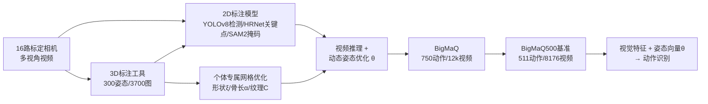

# BigMaQ: A Big Macaque Motion and Animation Dataset Bridging Image and 3D Pose Representations

**会议**: ICLR 2026  
**OpenReview**: [https://openreview.net/forum?id=n7viYE7Xbo](https://openreview.net/forum?id=n7viYE7Xbo)  
**代码/项目主页**: [https://martinivis.github.io/BigMaQ/](https://martinivis.github.io/BigMaQ/)  
**领域**: 3D 视觉 / 动物姿态与形状重建 / 行为识别  
**关键词**: 猕猴, 多视角动捕, 3D 表面网格, 关节旋转姿态, 动作识别, 非人灵长类  

## 一句话总结
BigMaQ 用 16 路标定相机对真实猕猴做无标记多视角动捕，把"个体专属带纹理 3D 表面网格 + 逐帧关节旋转姿态"和"民族行为学动作标签"绑在一起，构成首个面向非人灵长类、能把生成式 3D 姿态向量直接喂进动作识别的大规模数据集，并证明加入该姿态描述能稳定抬高各视觉骨干的 mAP。

## 研究背景与动机
- **领域现状**：人体已有 SMPL/AMASS 这类成熟的 3D 表面参数化模型与海量动捕数据，能精细刻画姿态、形状乃至个体解剖差异；动物侧则因缺乏精确 3D 数据，要么用 SMAL 这种"扫描玩具模型"得到的通用四足形状空间，要么针对单一物种定制，且行为研究大多停留在 2D 关键点。
- **现有痛点**：非人灵长类（尤其猕猴，是与人类亲缘最近、神经科学最关键的模式动物）的网格化追踪远落后于其他物种——已有猕猴数据集要么只给稀疏 2D/3D 关键点（OpenMonkeyStudio、MacaquePose），要么有动作标签却完全没有姿态（MacaqueMotionMonitor）。没有任何数据集把准确的 3D 体表形状与动作识别任务结合起来。
- **核心矛盾**：稀疏关键点无法捕捉动作动态的丰富性（手部旋转、社交互动中的细微体态），而把行为识别和姿态估计当成两个割裂的任务训练，丢掉了"姿态本身就是强行为线索"这一在人体动作识别里已被验证为 SOTA 的事实。
- **本文目标**：填补这个空白——为猕猴提供动态、真实、带个体差异的 3D 表面重建，并把这种生成式姿态表示**直接整合进**动作识别的学习任务中。
- **核心 idea**：**「数据集 + 表示」双贡献**——一方面扩展已有动物表面追踪方法，用艺术家制作的高精度猕猴模板网格适配每只猴子，做出比现有 SOTA 更准的逐帧姿态；另一方面把关节旋转向量 $\theta$ 作为额外特征拼到图像/视频编码器输出上，验证 **3D 生成式姿态参数（而非 2D/3D 关键点坐标）** 才是抬升识别性能的关键。

## 方法详解

### 整体框架
整条管线分四步：先用 16 路标定相机录制真实猕猴自发行为，再训练检测+关键点+分割模型生成 2D 标注，然后把个体专属模板网格通过可微渲染对齐到多视角视频上、优化出逐帧 3D 姿态与形状，最后把姿态向量与视觉特征拼接训练动作识别，并筛出高质量子集 BigMaQ500 作为基准。

### 关键设计

**1. 个体专属带刚架的表面网格：从通用模板到"这只猴"。** 不同于 SMAL 那种通用四足形状空间，本文用艺术家制作的高精度猕猴模板（高模 10632 顶点 / 低模 3625 顶点），底层由 $N_J=115$ 个关节通过线性混合蒙皮（LBS）驱动。姿态参数 $\theta\in\mathbb{R}^{3N_J}$ 以轴角形式定义每个关节相对父关节的旋转，最终顶点经全局旋转 $R$、缩放 $\gamma$、平移 $t$ 得到：

$$V_P = \gamma \cdot R \cdot \mathrm{LBS}(\theta; V, J, W) + t.$$

关键在于引入**可学习骨长 $\alpha$ 和顶点偏移 $\xi$**，把模板适配到每只猴子的个体解剖差异——这正是它比 MAMMAL 那种固定模板拟合更准、能区分不同个体的原因。

**2. 可微渲染下的复合对齐目标：关键点+轮廓双约束。** 把姿态后的网格通过可微渲染投影到各标定相机视角，得到预测关键点和轮廓，逐帧优化复合目标：

$$L(\Theta) = \lambda_P L_P + \lambda_b L_b + \lambda_{sm} L_{sm} + \sum_{\text{cam } c}\big(\lambda_{kp} L^c_{kp} + \lambda_{sil} L^c_{sil}\big),$$

其中 $L_P$ 惩罚极端关节旋转、$L_b$ 约束自适应骨长在合理范围、$L_{sm}$ 保证顶点形变平滑，$L_{kp}$/$L_{sil}$ 把网格对齐到各视角的关键点与 SAM 2 轮廓。实验观察到关键点比轮廓提供更强约束，因此关键点预测误差对最终对齐质量影响最大。

**3. 让大数据可处理的时序一致性 + 裁剪渲染。** 为把 12k 视频这种体量跑通，作者不在全分辨率帧上拟合，而是用 YOLOv8 裁出固定最大边长 100 像素的小图、按相机批处理。在此基础上加**时序损失**：旋转部分用轴角的角速度（而非欧氏距离）最小化，平移部分用欧氏空间的有限差分：

$$L_{ang} = \frac{1}{(T-1)J}\sum_{n=1}^{T-1}\sum_{j=1}^{J}\big\|\omega^{(n)}_j\big\|_2^2,\qquad L_T = L_{ang}(\theta_{:T}) + L_{ang}(r_{:T}) + \frac{1}{T-1}\sum_{n=1}^{T-1}\big\|t^{(n+1)}-t^{(n)}\big\|_2^2.$$

实操用 6 路相机、80 帧批次、10 帧重叠，配合纹理优化和加速流程，才把"个体网格→逐动作姿态"这套优化铺到整个数据集。

**4. 逐顶点光度纹理：让网格能任意视角重渲染。** 每个顶点配一个 RGB 颜色向量 $C\in\mathbb{R}^{N_V\times 3}$，通过可微渲染 $\hat I^{(c)}=\mathcal{R}(\Pi_c, V_P, F, C, \ell)$ 在前景掩码内最小化光度误差 $L_{phot}=\sum_{p\in\Omega} S^{(c)}(p)\big(\hat I^{(c)}(p)-I^{(c)}(p)\big)^2$，并用缩放 sigmoid 把颜色约束在 $[0,255]$。这使得每只猴都有可从任意视角渲染的彩色动画化身（BigMaQ-C），可服务于动画与神经科学的受控刺激生成。

## 实验关键数据

### 主实验：动作识别（Table 4，mAP）
在 BigMaQ500（511 动作 / 8176 视频）上，把姿态向量 $\theta$ 拼到各视觉骨干特征后，mAP 全面提升；纯姿态流本身已是强基线（43.5）。

| 视觉模型 | 特征 | mAP | mAP_L | mAP_OI | mAP_SI | mAP_O |
|---|---|---|---|---|---|---|
| — | Pose | 43.5±1.4 | 57.3 | 54.4 | 28.7 | 47.4 |
| ResNet50 | Vis | 34.3±0.5 | 50.9 | 38.6 | 22.2 | 35.9 |
| ResNet50 | Vis+Pose | **44.0±0.8** | 58.1 | 53.7 | 28.8 | 48.5 |
| ViT-base-cls | Vis | 32.9±0.7 | — | — | — | — |
| ViT-base-cls | Vis+Pose | **44.0±0.1** | 60.6 | 50.2 | 29.9 | 47.1 |
| DINOv2-base | Vis | 40.4±1.7 | — | — | — | — |
| DINOv2-base | Vis+Pose | 41.4±1.7 | 59.5 | 51.4 | 27.5 | 42.0 |
| TimeSformer | Vis | 31.9±1.2 | — | — | — | — |
| TimeSformer | Vis+Pose | 42.6±1.3 | 62.9 | 49.6 | 29.6 | 41.9 |
| VideoPrism-base | Vis | 38.3±0.2 | — | — | — | — |
| VideoPrism-base | Vis+Pose | 43.8±2.9 | 60.9 | 51.1 | 29.7 | 46.3 |

### 表面重建对比（Table 2/3）
本文方法在 IoU、MPJPE（mm）、MPJTD（mm/frame）上全面优于 MAMMAL 与 AniMer+。

| 指标 | BigMaQ(Ours) | MAMMAL | AniMer+ |
|---|---|---|---|
| 单帧 IoU↑（单主体动作均值，Table 3） | **0.844** | 0.714 | 0.591 |
| 单帧 MPJPE↓ [mm] | **26.907** | 31.661 | — |
| 序列级 MPJPE↓ [mm]（Table 2 Walk 例） | **20.402** | 23.493 | — |
| 序列级 MPJTD↓ [mm/frame]（Walk 例） | **6.875** | 9.961 | — |

AniMer+（SMAL 扩展）常把猕猴拟合成狮子/老虎般完全不同的物种；MAMMAL 对齐更合理但抓不到个体差异、整体质量更低。

### 消融：姿态表示形式（Table 5，overall mAP）
比较 2D/3D 关键点、网格顶点、关节旋转矩阵四种姿态描述，**旋转矩阵 (3D-Rot) 在纯姿态流和与各视觉特征结合时都最优**。

| 姿态特征 | Pose-only | ViT-base-cls | DINOv2-base | VideoPrism |
|---|---|---|---|---|
| 2D-KP | 35.6 | 35.5 | 40.2 | 40.0 |
| 3D-KP | 40.8 | 34.4 | 34.5 | 34.0 |
| 3D-M（网格顶点） | 35.2 | 34.4 | 36.6 | 36.0 |
| **3D-Rot（θ）** | **43.5** | **44.0** | **41.4** | **43.8** |

### 关键发现
- **不是"有 3D 信息就行"**：3D 关键点坐标（3D-KP）甚至常不如 2D-KP，而**构造 3D 结构的生成式参数（关节旋转）**才是真正驱动识别提升的因素——与神经科学中"把生成式方法引入识别模型"的主张一致。
- **社交互动最难**：mAP_SI 在所有模型中最低，恰恰最受益于姿态特征，凸显姿态对多个体行为建模的价值。

## 亮点与洞察
- **首个把生成式 3D 姿态-形状直接整合进动物动作识别学习任务的大规模数据集**：173k 帧真实录制、750+ 动作、16 视角、个体身份/掩码/关键点/动作标签一应俱全，且姿态是从真实视频动捕而非合成或手标得到。
- **"构造 vs 描述"的表示哲学**：消融把功劳精确归因到"用旋转参数生成式地构造身体结构"，而不是笼统的"3D 信息"，对后续动物/人体行为识别的姿态特征选型有直接指导。
- **工程上把动捕优化铺到 12k 视频规模**：裁剪渲染 + 角速度时序损失 + 纹理加速，是把"逐个体逐动作"这种昂贵优化变得可行的关键，可复用到其他物种。
- **个体专属带纹理化身**可任意视角重渲染、做受控动画，天然服务于神经科学的视觉感知与社交编码研究。

## 局限与展望
- **动作标签仅由两名研究者标注**，要扩展到野外猕猴或其他非人灵长类需要更广泛的行为学专家共识。
- **依赖多视角与标定相机**：优势主要在多视角场景验证，且关键点/轮廓标注误差（尤其多个体场景或猴子走出相机覆盖体积时）会直接损害重建质量；SAM 2 轮廓还可用专门的掩码质量判别器进一步改进。
- **单视角泛化未解**：作者明确指出下一步是从这份高质量 3D 数据中**导出姿态先验**去正则化单视角重建（类似狗上的做法），以推广到野外复杂姿态与图像。

## 相关工作与启发
- **动物形状姿态重建**：SMAL 通用四足形状空间及其在狗/熊/骆驼上的微调与扩展、鸟类模板网格、AniMer 用 transformer+合成数据扩到更多哺乳类——本文走"个体专属模板 + 真实多视角动捕"的另一条路，避开合成数据的保真度问题。
- **非人灵长类姿态与行为识别**：OpenMonkeyStudio/MacaquePose/ChimpACT 提供关键点或动作标签但二者割裂；人体侧 Rajasegaran et al. 已证明把模型化姿态送入动作识别能拿 SOTA，本文把这一思路首次系统化迁移到 NHP。
- **启发**：当数据集要同时服务"识别 + 生成/动画 + 神经科学刺激"时，选择**生成式参数化姿态（关节旋转）**而非坐标式表示，既统一了下游任务又拿到更好的识别性能；这对具身/动物行为/人体动作的表示设计是一个可直接借鉴的结论。

## 评分
- **新颖性**: ⭐⭐⭐⭐⭐ 首个把生成式 3D 表面-姿态与动作识别绑定的非人灵长类大规模动捕数据集，填补明确空白，且"构造 vs 描述"的表示洞察有普适价值。
- **实验充分度**: ⭐⭐⭐⭐ 表面重建对比（IoU/MPJPE/MPJTD）+ 8 个视觉骨干的动作识别 + 姿态表示消融三层验证扎实；略受限于多视角设定、单视角与野外泛化未实测。
- **写作质量**: ⭐⭐⭐⭐ 动机、管线、表示哲学叙述清晰，公式与表格自洽；附录承载大量细节，正文偶显信息密集。
- **价值**: ⭐⭐⭐⭐⭐ 数据集 + 代码 + 个体化身公开，对动物行为学、生态学、神经科学与 3D 视觉社区都是稀缺高价值资源，并指明了姿态先验正则化单视角重建的后续路径。

<!-- RELATED:START -->

## 相关论文

- [\[CVPR 2026\] RigMo: Unifying Rig and Motion Learning for Generative Animation](../../CVPR2026/3d_vision/rigmo_unifying_rig_and_motion_learning_for_generative_animation.md)
- [\[ICCV 2025\] Bridging Diffusion Models and 3D Representations: A 3D Consistent Super-Resolution Framework](../../ICCV2025/3d_vision/bridging_diffusion_models_and_3d_representations_a_3d_consistent_super-resolutio.md)
- [\[CVPR 2026\] Tracking-Guided 4D Generation: Foundation-Tracker Motion Priors for 3D Model Animation](../../CVPR2026/3d_vision/tracking-guided_4d_generation_foundation-tracker_motion_priors_for_3d_model_anim.md)
- [\[ICLR 2026\] FastGHA: Generalized Few-Shot 3D Gaussian Head Avatars with Real-Time Animation](fastgha_generalized_few-shot_3d_gaussian_head_avatars_with_real-time_animation.md)
- [\[ICLR 2026\] Parameterization-Based Dataset Distillation of 3D Point Clouds through Learnable Shape Morphing](parameterization-based_dataset_distillation_of_3d_point_clouds_through_learnable.md)

<!-- RELATED:END -->
