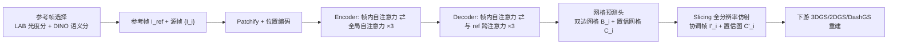

# CHROMA: Consistent Harmonization of Multi-View Appearance via Bilateral Grid Prediction

**会议**: ICLR 2026  
**OpenReview**: [https://openreview.net/forum?id=hgMsOJOm1c](https://openreview.net/forum?id=hgMsOJOm1c)  
**代码**: 待确认  
**领域**: 3D 视觉 / 新视角合成  
**关键词**: 外观协调, 双边网格, 多视角一致性, 3D 高斯泼溅, 前馈 Transformer, 自监督  

## 一句话总结
CHROMA 用一个多视角感知的 Transformer 一次性为整段图像序列预测逐帧 3D 双边网格仿射变换，把因相机 ISP/曝光差异造成的外观不一致前馈式地校正到同一参考帧，从而在不拖慢 3DGS 训练的前提下显著提升新视角合成质量。

## 研究背景与动机
- **领域现状**：3DGS/NeRF 类重建默认多视角图像满足光度一致性，但真实采集中相机的曝光、白平衡、色彩校正等 on-device ISP 处理会让同一场景的不同视角颜色/亮度对不齐，破坏一致性假设、产生 floater 与色偏。
- **现有痛点**：主流做法是给每张图学一个外观嵌入（NeRF-W、WildGaussians、GS-W、Luminance-GS、BilaRF 等），把外观建模和几何重建**绑在一起联合优化**。这在每一步优化里都加额外计算，训练时间动辄翻倍甚至到几小时，直接抵消了 3DGS「秒级拟合」的速度优势；而且去掉嵌入后恢复的外观不可控，往往收敛到所有视角的「平均外观」。
- **核心矛盾**：外观协调既要**多视角一致**（2D 单帧增强方法做不到），又要**便宜且可泛化**（不想为每个场景重训）；同时**真实配对数据几乎无法采集**——现实里的外观变化在时空上唯一，拿不到像素对齐的「干净/退化」标签。
- **本文目标**：把外观协调从场景优化里**解耦**出来，做成一个泛化的、前馈的预处理模块，处理几百帧只需一次前向，可无缝接到 3DGS/2DGS/DashGS 乃至前馈重建模型前面。
- **核心 idea**：**【前馈双边网格预测】**——不直接回归校正后图像，而是让一个多视角 Transformer 为每帧预测低分辨率 3D 双边网格（逐顶点仿射变换），通过跨帧注意力对齐到参考帧；再配合**【参考帧自动挑选】**与**【3D 基础模型自监督】**解决「对齐到谁」和「没有真实标签」两大难题。

## 方法详解

### 整体框架
输入一段多视角帧 $\{I_i\}$ 与一个定义目标外观的参考帧 $I_{ref}$，模型把每帧切成 patch token，经 encoder-decoder Transformer 输出逐帧的双边网格 $B_i$ 和置信网格 $C_i$；网格经 slicing（三线性插值）作用回全分辨率原图得到协调后帧 $I_i'$，再喂给任意下游 3DGS 类重建器。训练同时用合成 ISP 配对数据（监督）和真实无配对数据（3D 基础模型渲染自监督）。

### 关键设计

**1. 多视角双边网格 Transformer：用 patch token 直接预测逐顶点仿射，让校正天然跨视角一致。** 双边网格把图像升维到一个低分辨率的 $(H_s, W_s, D)$ 三维空间，每个顶点存一组 $3\times4$ 仿射参数（$3\times3$ 矩阵 $A$ 加偏置 $b$），像素 $d$ 的颜色按 $I'_d = A_d I_d + b_d$ 校正，其中 $\theta_d=\sum_{i,j,k} w_{ijk}(d)\theta_{ijk}$ 由邻近顶点三线性插值得到（即 slicing），guidance 维用像素亮度。作者抓住了「Transformer 的 patch 处理」和「双边网格的顶点局部仿射」之间的结构同构——每个 patch token 正好对应一个网格顶点，于是用一个小 MLP 从 token 直接预测该顶点的 $D\times12$ 仿射参数即可。架构借鉴 VGGT 的交替注意力：encoder 交替「帧内自注意力（建模单视角空间上下文）」和「全局自注意力（在相同 patch 位置跨视角交换信息）」各 3 层；decoder 把全局注意力换成「源帧 query、参考帧 key/value」的跨注意力，让每个源帧特征显式以参考帧为条件对齐，从而输出外观一致的多视角网格。由于网格分辨率远低于图像（224×224 输入、8×8 patch → 28×28×8 顶点），既省算力又天然只编码低频外观、不破坏高频细节。

**2. 不确定性感知的置信网格：用概率损失给难恢复区域降权，稳住训练。** 过曝/欠曝区域信息已丢失、真值本身也含光度噪声，硬拟合会带偏。作者额外预测一个低分辨率置信网格 $C_i\in\mathbb{R}^{H_s\times W_s\times D\times1}$，slicing 成全分辨率置信图 $C'_i$，把 L1 重建损失调制成 aleatoric 概率损失：$L_{conf}=\sum_i C'_i\odot\|\hat I_i - I'_i\|_1 - \beta\log(C'_i)$。这样模型可以在细节难以恢复的区域主动调低置信、减少其对损失的拉扯；再叠加一个全变差损失 $L_{TV}$ 约束网格在空间和 guidance 维上平滑，避免顶点参数突变。

**3. 参考帧自动选择：光度可靠 + 语义代表，避免对齐到坏帧。** 「把所有帧对齐到参考帧」的前提是参考帧本身得好——随便取第一帧/随机帧可能选到天空、欠曝或离群帧，导致整段漂移。作者用两路打分加权：语义上算各帧 DINOv2 嵌入的余弦相似度 $S_{DINO}$（偏好信息丰富的帧），但 DINO 对光照鲁棒、欠曝帧也可能拿高分，于是再用 CIE-LAB 的亮度通道算光度分 $S_{LAB}=\lambda_{ent}(-\sum_l p(l)\log p(l)) + \lambda_{ov}\frac{1}{|L|}\sum[L_{ij}\ge250] + \lambda_{un}\frac{1}{|L|}\sum[L_{ij}\le5]$，用亮度直方图熵奖励信息量、对过曝/欠曝像素比例（>250 或 <5）惩罚。最终 $S_i=\alpha S_{LAB,i}+(1-\alpha)S_{DINO,i}$（$\alpha=0.5$）取最高者为参考帧，兼顾可解释性、自动化与可手动指定。

**4. 3D 基础模型自监督 + 合成 ISP 数据：解决真实配对数据缺失。** 一路靠**合成监督**：在 DL3DV（10K 场景、每场景 300+ 帧）上用 unprocessing 反演相机管线得到线性 RGB，再随机加白平衡、曝光、增益、gamma、色彩校正矩阵扰动造配对；曝光用昼/夜双峰高斯混合 $e\sim\pi\mathcal{N}(\mu_{day},\sigma^2_{day})+(1-\pi)\mathcal{N}(\mu_{night},\sigma^2_{night})$ 模拟明暗。另一路靠**自监督**消除合成到真实的域差：拿一个预训练前馈 3D 重建模型 $h_\theta$（如 AnySplat），把参考帧和校正后帧一起预测相机位姿与高斯，再把非参考帧的高斯重投影到参考视角，对渲染图与原参考帧算 VGG 感知损失 $L_{ss}=\mathrm{VGG}(I_{ref}-\mathrm{Rasterizer}(p_{ref},\{G_i\}))$，迫使网络输出停在一致色彩空间里。总损失 $L=L_{conf}+\lambda_{tv}L_{TV}+\lambda_{ss}L_{ss}$，其中 $L_{conf}$ 只用于配对的 DL3DV，$L_{ss}$ 和 $L_{TV}$ 在 DL3DV 与真实无配对的 WildRGB-D 上联合优化，并用预测高斯不透明度 mask 掉重建不可靠的区域。

## 实验关键数据

### 主实验表格（接入不同 3DGS 后端，CC 为逐通道仿射色彩校正后指标）

| 数据集 | 方法 | PSNR↑ | PSNR-CC↑ | SSIM-CC↑ | LPIPS-CC↓ | 时间↓ |
|---|---|---|---|---|---|---|
| DL3DV (ISP变化) | DashGS | 23.35 | 28.17 | 0.9029 | 0.1782 | 3m12s |
| DL3DV | WildGaussians | 18.15 | 24.08 | 0.8188 | 0.2567 | 2h10m |
| DL3DV | Luminance-GS | 20.00 | 26.14 | 0.8466 | 0.2290 | 14m29s |
| DL3DV | **DashGS + Ours** | **26.45** | **28.92** | **0.9035** | **0.1703** | 3m27s |
| MipNeRF360-VE | GS-W | 15.66 | 25.81 | 0.7580 | 0.2912 | 48m45s |
| MipNeRF360-VE | Luminance-GS | 18.12 | 23.12 | 0.7352 | 0.2851 | 22m16s |
| MipNeRF360-VE | **2DGS + Ours** | 18.99 | **26.37** | **0.8125** | **0.2446** | 25m50s |
| BilaRF (真实夜景) | 3DGS-4DBAG | - | 24.90 | 0.774 | 0.256 | - |
| BilaRF | GS-W | - | 24.94 | 0.8056 | 0.2764 | 40m34s |
| BilaRF | **DashGS + Ours** | - | **26.25** | **0.8356** | **0.2158** | 3m50s |

要点：接上 CHROMA 后各后端在三个数据集上普遍超过把外观联合优化的 per-scene 方法，且训练时间几乎不变（DashGS+Ours 仅 3 分多钟，而 WildGaussians 要 2 小时）；300+ 帧单次前向，BilaRF 推理仅 2-3 秒。

### 消融实验表格（MipNeRF360-VE / BilaRF，PSNR-CC）

| 消融项 | PSNR-CC | SSIM-CC | LPIPS-CC |
|---|---|---|---|
| 单帧独立处理 | 26.19 | 0.8131 | 0.2435 |
| 随机参考帧 | 25.11 | 0.7559 | 0.3089 |
| 仅 DINO 选参考帧 | 25.95 | 0.7871 | 0.2758 |
| **完整模型** | **26.25** | **0.8149** | **0.2428** |
| w/o 自监督损失 (BilaRF) | 25.21 | 0.8245 | 0.2375 |
| L1 自监督损失 | 25.28 | 0.8227 | 0.2377 |
| **VGG 自监督损失** | **25.60** | 0.8240 | **0.2368** |

### 关键发现
- 跨视角联合处理优于单帧独立处理，证明 Transformer 跨视角信息确有增益。
- 参考帧选择影响最大：随机帧从 26.25 掉到 25.11；仅靠 DINO 也不够（25.95），光度分必须加。
- 自监督 $L_{ss}$ 让模型能用真实无配对数据训练，桥接合成→真实域差，BilaRF 上 PSNR-CC 从 25.21 提到 25.60；VGG 感知损失比像素 L1 更稳、更抗低层噪声/错位。
- 对比 2D 曝光校正方法（CoTF/MSEC/UEC 等）：它们单帧效果尚可但缺多视角一致性，CHROMA 在 PSNR-CC、motion smoothness、temporal flickering 上全面更优。

## 亮点与洞察
- **结构同构的巧思**：把「Transformer patch token」直接映射到「双边网格顶点仿射参数」，省去了双边网格学习里常见的笨重 dense 预测头，预测的是紧凑低频参数、slicing 几乎零成本作用回高分辨率原图。
- **解耦带来速度与可控**：外观协调从重建里拆出来后，重建器保持原速，且能显式指定参考帧控制最终外观，而非收敛到「平均外观」。
- **用前馈 3D 模型当 pretext task**：拿 AnySplat 的可微渲染当自监督信号来逼一致性，是绕开真实配对数据缺失的实用路子。

## 局限与展望
- 需要先单独训练一个协调网络（per-scene 方法无需），但训练一次即可场景无关复用、几百帧一次前向。
- 只处理 ISP 引起的光度不一致，**不显式建模镜面高光/反射**——双边网格变换天生平滑，无法拟合反射/强高光带来的高频变化。
- 未处理瞬态物体（行人/遮挡），展望把协调模块嵌入更大的前馈重建框架做真正「in-the-wild」无约束照片集重建。

## 相关工作与启发
- **双边网格谱系**：Chen 2007 的局部仿射双边网格 → HDRNet（Gharbi 2017）用网络预测算子 → BilaRF 把双边网格搬进 NeRF 建模 ISP；本文进一步扩到时空多视角并用 Transformer 预测，是这条线在「泛化+前馈」方向的延伸。
- **外观感知 NVS**：NeRF-W 开创每图外观嵌入，WildGaussians/GS-W/Luminance-GS/DAVIGS 等都走「联合优化嵌入」路线；本文反其道把外观处理前置解耦，启发是「能前馈解决的就别塞进 per-scene 优化」。
- **架构借鉴**：交替帧内/全局注意力来自 VGGT，自监督渲染信号来自 AnySplat 这类前馈 3D 基础模型——体现「大前馈重建模型可被复用为下游任务的监督来源」这一趋势。

## 评分
- **新颖性**: ⭐⭐⭐⭐ 把双边网格预测做成多视角前馈 Transformer、并用 patch-顶点同构 + 3D 基础模型自监督，组合新颖且切中外观协调与重建解耦的痛点。
- **实验充分度**: ⭐⭐⭐⭐ 三类数据集（合成 ISP/曝光/真实夜景）× 三种后端（2DGS/3DGS/DashGS）+ 对比 2D 校正与 per-scene 方法，消融覆盖参考帧选择、单/多帧、自监督损失，较为完整；缺少更大规模 in-the-wild 与瞬态物体场景。
- **写作质量**: ⭐⭐⭐⭐ 动机层层递进、方法与架构图清晰，公式与符号交代到位。
- **价值**: ⭐⭐⭐⭐ 即插即用、几乎不增训练时间又能提质，对真实采集下的 3DGS 重建工程实用性强。

<!-- RELATED:START -->

## 相关论文

- [\[CVPR 2026\] Multi-view Consistent 3D Gaussian Head Avatars 'without' Multi-view Generation](../../CVPR2026/3d_vision/multi-view_consistent_3d_gaussian_head_avatars_without_multi-view_generation.md)
- [\[ICCV 2025\] AR-1-to-3: Single Image to Consistent 3D Object Generation via Next-View Prediction](../../ICCV2025/3d_vision/ar1to3_single_image_to_consistent_3d_object_via_nextview_pre.md)
- [\[CVPR 2026\] SplatSuRe: Selective Super-Resolution for Multi-view Consistent 3D Gaussian Splatting](../../CVPR2026/3d_vision/splatsure_selective_super-resolution_for_multi-view_consistent_3d_gaussian_splat.md)
- [\[NeurIPS 2025\] WildCAT3D: Appearance-Aware Multi-View Diffusion in the Wild](../../NeurIPS2025/3d_vision/wildcat3d_appearance-aware_multi-view_diffusion_in_the_wild.md)
- [\[CVPR 2026\] Skullptor: High Fidelity 3D Head Reconstruction in Seconds with Multi-View Normal Prediction](../../CVPR2026/3d_vision/skullptor_high_fidelity_3d_head_reconstruction_in_seconds_with_multi-view_normal.md)

<!-- RELATED:END -->
