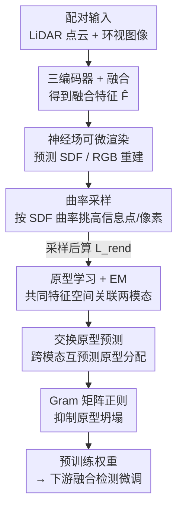

# CLAP: Unsupervised 3D Representation Learning for Fusion 3D Perception via Curvature Sampling and Prototype Learning

**会议**: ICLR2026  
**OpenReview**: [https://openreview.net/forum?id=3qF8HeAVAO](https://openreview.net/forum?id=3qF8HeAVAO)  
**代码**: 待确认  
**领域**: 3D视觉 / 自监督表示学习 / 自动驾驶感知  
**关键词**: 无监督预训练, 多模态融合, 可微渲染, 曲率采样, 原型学习

## 一句话总结
CLAP 提出首个面向「相机+LiDAR 融合感知」的无监督联合预训练方法：用**曲率采样**只挑场景里信息量大的点/像素来扛住可微渲染的显存开销，再用**可学习原型 + EM 训练**把两个模态拉到同一特征空间挖掘互补性，在 NuScenes / Waymo 上比此前 SOTA（UniPAD）多拿一倍的下游提升。

## 研究背景与动机
**领域现状**：自动驾驶的 3D 感知普遍同时挂相机（出 RGB 图像）和 LiDAR（出点云），融合两种模态比单模态效果更好。但 3D 标注极其昂贵，于是出现了无监督 3D 表示学习——先在无标签数据上预训练 backbone，再把权重拿去下游微调。在众多预训练范式里，**基于可微渲染的 mask-and-reconstruction**（以 UniPAD 为代表）目前最能打。

**现有痛点**：可微渲染要对大规模点云 + 图像同时编码、沿光线采样重建，显存开销巨大——如果用上点云和图像里的**所有**点和像素，即便最先进的 GPU 也只能塞下 batch size = 1。因此 UniPAD 这类方法被迫**对每个模态分开预训练**：LiDAR 编码器和相机编码器各练各的。

**核心矛盾**：分开预训练让每个编码器被锁死在自己的模态里。而从图像恢复 3D 是病态问题（缺几何），点云有几何线索却缺高层语义——两者本该互补，可一旦分开训，**图像语义和点云几何之间的互补性就完全没被利用**。问题的根本卡点是：联合预训练需要同时处理两个模态，但可微渲染的计算/显存成本不允许。

**本文目标**：拆成两个子问题——(1) 怎么在不爆显存的前提下让两个模态同时进可微渲染预训练；(2) 怎么显式建模并利用图像语义与 LiDAR 几何之间的互补。

**切入角度**：作者观察到，点云里**同一个平整表面上采多个点是信息冗余的**——路面这种低曲率区域信息密度低，而车体这种高曲率表面信息量大。既然渲染重建的采样预算 $N_L \ll N_P$，那就该把有限的采样配额砸到高信息量（高曲率）的地方，而不是均匀撒。

**核心 idea**：用「曲率采样」把可微渲染的算力压到可承受，从而**首次实现融合感知的联合可微渲染预训练**；再用「可学习原型 + EM + 交换预测」在共同特征空间里把图像和点云的互补性显式学出来。CLAP = **C**urvature samp**L**ing + le**A**rnable **P**rototype。

## 方法详解

### 整体框架
CLAP 要解决的是「在无标签下联合预训练 LiDAR、相机、融合三个编码器」。整体流程是：先把配对的点云 $\mathbf{P}$ 和环视图像 $\mathbf{I}$ 分别用 LiDAR 编码器 $f^{enc}_P$、相机编码器 $f^{enc}_I$（Swin Transformer，并用投影矩阵 $\mathbf{T}$ 把 2D 特征抬到 3D）编码，拼接后过融合编码器 $f^{enc}_{fusion}$ 得到融合特征 $\hat{\mathbf{F}}$。融合特征经一个浅层 3D 卷积 $f^{3D}$ 后，一路走**神经场可微渲染**做 mask-and-reconstruction（预测 SDF 和 RGB，沿 LiDAR/相机光线积分出 range 和颜色，和真值算 $L_{rend}$）；另一路把两个模态的 embedding 喂给**原型学习**模块，用 EM、交换预测、Gram 正则三个损失把模态互补性学进来。

要让上面这套同时跑两个模态而不爆显存，关键就靠**曲率采样**把重建的采样点数 $N_L, N_C$ 压到原始规模的约 1/100；要让联合预训练真正吃到模态互补的红利，关键就靠**原型学习**那一组损失。总损失为

$$\mathcal{L} = \omega_r \cdot \mathcal{L}_{rend}(\mathbf{P}, \tilde{\mathbf{F}}, \mathbf{I}) + \omega_{proto} \cdot \mathcal{L}_{proto}(\hat{\mathbf{P}}, \hat{\mathbf{I}}).$$

### 关键设计

**1. 曲率采样：把有限采样预算砸到高信息量区域**

可微渲染若用全部点/像素会让 GPU 只能跑 batch=1，所以必须让重建采样数远小于原始规模（$N_L \ll N_P$，$N_C \ll H\cdot W\cdot N_{cam}$）。最直接的均匀采样（即 UniPAD 的「Memory-friendly Ray Sampling」）因为采样比只有约 1/100，几乎不比分开预训练强——这和「联合应该更好」的动机自相矛盾。作者的观察是：高曲率表面（车体）比低曲率表面（路面）携带的信息多得多，于是按**曲率**给点加权采样。

具体地，对点云里每个点 $\mathbf{p}$，先对 SDF 函数求一阶导得到法向 $\mathbf{n} = \frac{\delta f^{SDF}([\mathbf{p}, f])}{\delta \mathbf{p}}$，归一化为 $\tilde{\mathbf{n}} = \mathbf{n}/\|\mathbf{n}\|_2$；再对法向求一次微分 $\mathbf{c} = \frac{\delta \tilde{\mathbf{n}}}{\delta \mathbf{p}}$，取其范数作为测地曲率，直接当采样权重 $\omega_n = \|\mathbf{c}_n\|_2$，用 PyTorch 的 Multinomial Sampler 抽 $N_L$ 个点。图像侧则把点云投影回像平面、把 $\omega_n$ 赋给对应像素并用大小为 $K_{gaus}$ 的高斯模糊核致密化，再抽 $N_C$ 个像素。因为前几个 epoch 曲率估计很噪，先用均匀采样热身 $N_{warmup}$ 个 epoch 再切到曲率采样。整个曲率估计放在 `torch.no_grad()` 里只算一次不存梯度，额外算力/显存开销 <1%，可忽略——这正是它能「白嫖」信息密度的关键：用近乎零成本的二阶几何量决定采样分布。

**2. 可学习原型 + EM 训练：把两个模态拉进共同特征空间**

曲率采样腾出了算力，但「联合」要真正有用，还得让模型以无监督方式理解「物体/物体部件」这种 objectness。作者引入 $N_K$ 个随机初始化的可学习原型 $\mathbf{K} \in \mathbb{R}^{N_K \times d_K}$，每个原型代表 3D 场景的一个片段，作为连接两模态的共享空间锚点。把 LiDAR、相机的 3D embedding $\hat{\mathbf{P}}, \hat{\mathbf{I}}$ 各过一个投影头 $f^{proj}$ 对齐到 $d_K$ 维并归一化后，算它们与原型的相似度矩阵 $\mathbf{S}_P = \dot{\mathbf{P}} \cdot \mathbf{K}^\top$、$\mathbf{S}_I = \dot{\mathbf{I}} \cdot \mathbf{K}^\top$。

用 EM 来优化原型让它代表场景片段：E 步对 $\mathbf{S}_{P/I}$ 做 softmax 得到每个原型分配到每个 embedding 的概率 $\hat{\mathbf{S}}_{P/I}$；M 步希望「一个原型确定地对应场景某一片段」，等价于最小化相似度矩阵的熵，于是

$$\mathcal{L}_{EM} = -\frac{1}{N_{3D}N_K}\sum_{n}\sum_{m}\{\hat{S}^{n,m}_P \log \hat{S}^{n,m}_P + \hat{S}^{n,m}_I \log \hat{S}^{n,m}_I\}.$$

这一步让原型从随机向量收敛成「有语义含义的场景部件代表」，且 LiDAR 与相机共用同一组原型，天然搭起了跨模态的桥。

**3. 交换原型预测：用对方模态来监督本模态的原型分配**

光让两模态各自靠近原型还不够「互动」。借鉴 SwAV，作者 detach 掉 $\mathbf{S}_{P/I}$ 后用 Sinkhorn 算法迭代 $N_{sink}$ 次把它逼近成双随机矩阵，得到 code $\mathbf{Q}_{P/I}$，然后**让 LiDAR 的原型分配去预测相机算出的 code、反之亦然**（带温度 $\tau$）：

$$\mathcal{L}_{SwAV} = -\frac{1}{N_{3D}N_K}\sum_{n}\sum_{m}\Big\{Q^{n,m}_I \log \frac{\exp(S^{n,m}_P)/\tau}{\sum_k \exp(S^{n,k}_P)/\tau} + Q^{n,m}_P \log \frac{\exp(S^{n,m}_I)/\tau}{\sum_k \exp(S^{n,k}_I)/\tau}\Big\}.$$

和 SwAV 的本质区别在于：SwAV 的原型代表「同一模态（图像）里的不同类别」、交换发生在同一图像的不同增广视图之间；而 CLAP 的原型代表「3D 场景的片段」、交换发生在**两个不同模态之间**——正是这个跨模态交换把「点云几何 ↔ 图像语义」的互补性显式灌进预训练。

**4. Gram 矩阵正则：防止原型坍塌成同一个向量**

随机初始化的原型在朴素训练下容易学到捷径——所有原型坍塌成同一个向量。作者用原型的 Gram 矩阵 $\mathbf{G} = \mathbf{K}\mathbf{K}^\top$ 度量原型两两相似度，最小化其非对角元素的均值

$$\mathcal{L}_{GMM} = \frac{1}{N_K(N_K-1)}\sum_{n}\sum_{m \neq n} G_{n,m}$$

逼原型彼此正交、保持多样，从而稳住训练。三个原型损失按权重合成 $\mathcal{L}_{proto} = \omega_{SwAV}\mathcal{L}_{SwAV} + \omega_{EM}\mathcal{L}_{EM} + \omega_{GMM}\mathcal{L}_{GMM}$。

### 损失函数 / 训练策略
重建侧 $\mathcal{L}_{rend}$ 在 UniPAD 基础上额外加了**表面 SDF 损失**（观测 LiDAR 点上 SDF 应为 0）来更好优化几何，由 surface SDF、range、color 三项 L1 损失组成：

$$\mathcal{L}_{rend} = \frac{1}{N_L}\sum_i (|r_i - \tilde{r}_i| + \omega_{sur}|s_i|) + \frac{\omega_C}{3 N_C}\sum_i \sum_j |c^j_i - \tilde{c}^j_i|.$$

光线沿途的占用值 $\alpha_n = \max(\frac{\Phi_h(s_n) - \Phi_h(s_{n+1})}{\Phi_h(s_n)}, 0)$（$\Phi_h$ 为带可学习尺度 $h$ 的 sigmoid），透射率 $t_n = \prod_{i<n}(1-\alpha_i)$，权重 $w_n = t_n \alpha_n$，最终积分出 range $\tilde{r} = \sum_n w_n r_n$ 与颜色 $\tilde{c} = \sum_n w_n c_n$。关键超参：$N_L=8192$，$N_C = 1024 \times N_{cam}$，$N_{ray}=96$，$N_{warmup}=4$，$N_K=512$，$N_{sink}=3$，$\tau=1.0$；损失权重 $\omega_r=2.0, \omega_{proto}=1.0, \omega_{sur}=\omega_C=0.05, \omega_{SwAV}=1.0, \omega_{EM}=\omega_{GMM}=0.1$。下游 NuScenes 用 BEVFusion、Waymo 用 CenterPoint（均基于 OpenPCDet）。

## 实验关键数据

### 主实验
评估协议很讲究：先把 from-scratch 模型的训练迭代加到收敛（再加迭代也不涨点），然后**固定迭代数**给所有预训练模型微调——这样排除了「预训练只是加速收敛」的假象，证明的是真正的样本效率提升。下游用 few-shot（NuScenes 5%、Waymo 1%）。

NuScenes 微调 5% 训练集结果：

| Init. | mAP | NDS |
|-------|-----|-----|
| Random | 48.69 | 55.28 |
| SLidR | 47.23 (−1.46) | 52.77 |
| PPKT | 49.58 (+0.89) | 55.85 |
| UniPAD (前 SOTA) | 49.81 (+1.12) | 55.29 |
| **CLAP** | **51.17 (+2.48)** | **57.04 (+1.76)** |

CLAP 的 mAP 提升 +2.48% 是 UniPAD（+1.12%）的两倍多（论文称「100% more improvement」）；NDS 上 UniPAD 几乎没涨（+0.01），CLAP 涨 +1.76。Construction Vehicle、Bus、Barrier、Motorcycle、Bicycle 等类别提升均 >2% AP。Waymo（微调 1%）上 CLAP 平均提升 +1.28，约为最好基线 OCC-MAE（+0.74）的两倍；值得注意的是 UniPAD 在 Waymo 上几乎失效（+0.02）。

**潜在 scaling 性质**（Table 3）：固定预训练数据、逐步减小微调数据（5%→0.5%），预训练/微调数据比越大，CLAP 增益越明显——0.5% 微调时 mAP 提升高达 +7.22%、NDS +4.71%。

### 消融实验

| 配置 | mAP | 说明 |
|------|-----|------|
| 分开预训练 (UniPAD) | 49.81 | 基线，各模态各练 |
| 联合 + 均匀采样 | 49.55 | 简单采样反而略降，印证动机 |
| 联合 + 曲率采样 | 50.81 | 曲率采样带来 +1.0 |
| 联合 + 曲率采样 + 原型学习 (Full) | **51.17** | 完整模型 |

### 关键发现
- **均匀采样的联合预训练（49.55）甚至低于分开预训练（49.81）**——直接印证了动机：采样比只有约 1/100 时，不挑信息量的联合是无效的，曲率采样才是让联合「转正」的钥匙（+1.0 mAP）。
- 原型学习在曲率采样基础上再加 +0.36 mAP，说明显式建模跨模态互补确实有额外收益。
- 可视化显示曲率估计能把高权重打到车辆等高信息区、低权重给背景路面；原型分配能把同帧路面归到同一原型、前景车辆归到另一原型，证明无监督下确实学到了「场景部件」语义（也有少量噪声，因为全程无标签）。

## 亮点与洞察
- **用「二阶几何量」当采样器**：把法向对位置再求一次导得到曲率作采样权重，放在 `no_grad` 里几乎零成本，却精准地把渲染预算导向信息密集区——这个「便宜的物理先验决定昂贵的采样」思路可迁移到任何受显存制约的点云/体素渲染任务。
- **把 SwAV 从「单模态多视图」改造成「跨模态」**：原型不再代表类别而代表场景片段，交换预测发生在 LiDAR↔相机之间，是一种很自然地把对比自监督迁移到多模态融合的范式。
- **诚实的评估协议**：固定迭代到收敛再比，避免「只是加速收敛」的虚假提升，这一点比单纯刷 SOTA 数字更有说服力。

## 局限与展望
- **作者承认的局限**：无监督导致曲率估计和原型分配都有噪声（部分路面点被错分到其他原型）；scaling 实验是靠「缩小微调数据」间接模拟的，作者目前无法真正放大预训练数据集，真实 scaling 红利尚未验证。
- **自己发现的局限**：实验只在自动驾驶 LiDAR+相机融合、且只测 3D 检测下游；曲率采样依赖 SDF 法向的可导性，对稀疏/低线束 LiDAR 或更一般的室内点云是否成立未知。原型数 $N_K=512$、权重等超参较多，跨数据集的鲁棒性没充分给出。
- **改进思路**：把预训练数据真正放大以兑现 scaling 承诺；把曲率采样推广到分割/跟踪等更多下游；探索自适应原型数。

## 相关工作与启发
- **vs UniPAD**：UniPAD 同样用可微渲染做 mask-and-reconstruction，但因显存只能**分开**预训练两个模态、无法利用互补；CLAP 用曲率采样压算力实现**联合**预训练，并额外加表面 SDF 损失优化几何，下游提升翻倍。
- **vs SwAV**：SwAV 的原型代表同一图像模态内的类别、交换发生在同图不同增广视图；CLAP 的原型代表 3D 场景片段、交换发生在 LiDAR 与相机两个模态之间，并新增 EM 训练和 Gram 矩阵正则防坍塌。
- **vs 对比式融合预训练（如把相机/LiDAR 当不同视图做对比的工作）**：它们用对比损失对齐两模态，CLAP 则走可微渲染重建 + 原型共享空间路线，把几何重建和语义互补统一在一套框架里。

## 评分
- 新颖性: ⭐⭐⭐⭐⭐ 首个融合感知的联合可微渲染预训练，曲率采样和跨模态原型都是有针对性的新设计
- 实验充分度: ⭐⭐⭐⭐ NuScenes/Waymo 双数据集 + 消融 + 可视化扎实，但下游任务较单一、真 scaling 未验证
- 写作质量: ⭐⭐⭐⭐ 动机—方法—实验逻辑清晰，公式完整；少数符号略密集
- 价值: ⭐⭐⭐⭐ 显著降低 3D 标注负担、提升样本效率，对自动驾驶感知预训练有实用价值

<!-- RELATED:START -->

## 相关论文

- [\[CVPR 2026\] Adaptive 3D Perception for Small Aerial Targets Under Sparse Sampling via Reinforcement Learning](../../CVPR2026/3d_vision/adaptive_3d_perception_for_small_aerial_targets_under_sparse_sampling_via_reinfo.md)
- [\[ICLR 2026\] Learning Unified Representation of 3D Gaussian Splatting](learning_unified_representation_of_3d_gaussian_splatting.md)
- [\[CVPR 2026\] GM-R²: Generative Matching Learning for Unsupervised Geometric Representation and Registration](../../CVPR2026/3d_vision/gm-r2_generative_matching_learning_for_unsupervised_geometric_representation_and.md)
- [\[ICLR 2026\] CloDS: Visual-Only Unsupervised Cloth Dynamics Learning in Unknown Conditions](clods_visual-only_unsupervised_cloth_dynamics_learning_in_unknown_conditions.md)
- [\[AAAI 2026\] Point-SRA: Self-Representation Alignment for 3D Representation Learning](../../AAAI2026/3d_vision/point-sra_self-representation_alignment_for_3d_representation_learning.md)

<!-- RELATED:END -->
