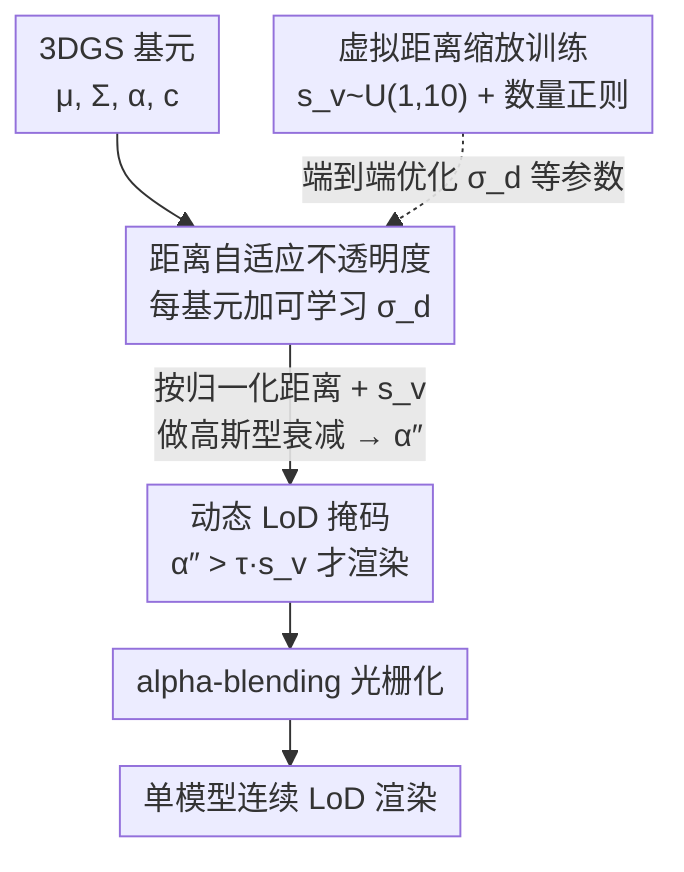

# CLoD-GS: Continuous Level-of-Detail via 3D Gaussian Splatting

**会议**: ICLR2026  
**OpenReview**: [https://openreview.net/forum?id=zgs0L72R4c](https://openreview.net/forum?id=zgs0L72R4c)  
**代码**: 待确认  
**领域**: 3D视觉  
**关键词**: 3D高斯泼溅, 连续细节层次, 实时渲染, 距离自适应不透明度, LoD  

## 一句话总结
CLoD-GS 给每个 3D 高斯加一个可学习的"距离衰减因子"，让基元的不透明度随观察距离平滑下降，从而在**单个模型**里实现连续可调的细节层次（CLoD），既消除了传统离散 LoD 的多份存储与切换"跳变"，又顺带把基元数量和显存压了下来。

## 研究背景与动机

**领域现状**：细节层次（Level of Detail, LoD）是实时图形学控制渲染开销的基本手段——离物体越远就用越粗糙的版本来画，省下算力维持帧率。主流做法是离散 LoD（DLoD）：美术或算法预先生成同一物体的多个不同精度版本，运行时根据距离/屏幕投影大小切换。3DGS（3D Gaussian Splatting）凭显式基元 + 高度优化的光栅化拿下了实时新视角合成的 SOTA 画质，但它的渲染开销同样随高斯基元数量线性增长，因此也躲不开对 LoD 的需求。

**现有痛点**：把 DLoD 直接搬到 3DGS 上（如 LODGE、Octree-GS、Hierarchical-3DGS），会原封不动地继承 DLoD 的两个老毛病。其一，每个资产要存多份高斯点云，存储和显存开销大、限制场景规模；其二，在不同精度模型之间瞬时切换会产生刺眼的"跳变"（popping）伪影，体验割裂。这些方法还依赖刚性的显式层级数据结构（八叉树、流式分块），带来额外的算法与内存负担。

**核心矛盾**：DLoD 的本质问题是"离散"——它把连续变化的感知重要性硬切成几档，于是在档与档之间必然出现存储冗余和视觉断点。而要做真正的连续 LoD（CLoD），传统网格表示又得靠边坍缩、顶点分裂这种离散拓扑操作和复杂的运行时层级遍历，把复杂度从资产侧转嫁到 CPU 上。

**切入角度**：作者指出 3DGS 天生适合 CLoD。每个高斯不是离散点，而是一个有"软"足迹的连续体素分布，调节它对画面的贡献（比如调不透明度）本就是平滑连续的操作；每个基元由一组连续参数定义，可以做逐基元的精细过滤而非整块几何的突然删除；整个表示端到端可微，意味着 LoD 机制本身可以被学习——直接引入新的可学习参数、在主训练流程里一起优化。

**核心 idea**：给每个高斯基元增设一个**可学习的距离衰减因子**，让它的不透明度随视点距离自动平滑衰减，在一个统一模型内部生成"连续的细节谱"，从而绕开 DLoD 的存储与跳变难题。

## 方法详解

### 整体框架
CLoD-GS 在标准 3DGS 表示之上做最小侵入式扩展：除了高斯原有的位置 $\mu_i$、协方差 $\Sigma_i$、基础不透明度 $\alpha_i$、球谐颜色 $c_i$ 之外，只额外给每个基元 $i$ 加**一个浮点参数**——距离衰减因子 $\sigma_{d,i}$。渲染时，根据相机到高斯的归一化距离和一个用户可调的"虚拟距离缩放因子" $s_v$，把每个高斯的不透明度按高斯型衰减压低，再用一个随 $s_v$ 收紧的阈值做动态掩码，决定哪些基元真正送进光栅化器。这样，调一个标量 $s_v$ 就能在画质和速度之间连续滑动：$s_v=1$ 是满精度，$s_v$ 越大模拟越远、过滤掉越多次要基元。

为了让单个模型在整个细节谱上都好用，训练阶段引入**虚拟距离缩放策略**：每次迭代随机采一个 $s_v \sim U(1,10)$，逼模型不只对真实视角（$s_v=1$）优化，也对模拟的远视角优化；再配一个**基元数量正则项**，显式要求远视角下用更少的基元。整条管线如下图：

### 关键设计

**1. 距离自适应不透明度：用可学习衰减因子让基元随距离"渐隐"而非"硬删"**

针对 DLoD"硬切档导致跳变"的痛点，作者不去离散地删基元，而是平滑地压它的不透明度，让它优雅淡出。具体做法是给每个高斯 $i$ 加一个可学习标量 $\sigma_{d,i}$，它和其余高斯属性一起被优化，学到"这个基元的可见度该随距离多快下降"。渲染时先算相机中心 $c$ 到高斯均值的欧氏距离 $d_i=\|\mu_i-c\|$，并用当前视锥内所有高斯的最大距离做归一化 $d'_i = d_i/\max_{j\in N_{view}} d_j$，以保证衰减效果跨场景、跨视角一致；再结合用户可控的虚拟距离缩放 $s_v$ 算出衰减后的不透明度：

$$\alpha''_i = \alpha_i \cdot \exp\!\left(-\frac{(d'_i \cdot s_v)^2}{2\,(\mathrm{ReLU}(\sigma_{d,i}))^2 + \epsilon}\right)$$

其中 $s_v\ge 1$ 让用户模拟"从更远处看"、从而放大衰减；$\mathrm{ReLU}(\cdot)$ 保证学到的衰减参数非负，$\epsilon$ 是数值稳定常数。这等于用一个**方差逐基元可学习**的高斯型衰减去加权原始不透明度——衰减快（$\sigma_{d,i}$ 小）的基元一拉远就消失，衰减慢（$\sigma_{d,i}$ 大）的基元被模型自动判定为"感知更重要"而保留更久。整个操作天然嵌进 alpha-blending 流程，不破坏 3DGS 的可微光栅化。

**2. 动态 LoD 掩码：按虚拟距离收紧阈值，把渲染的基元数真正减下来**

光是压低不透明度还不够省算力——基元仍会被送进光栅化。于是在算完 $\alpha''_i$ 后，加一个动态阈值生成布尔掩码 $M_i = (\alpha''_i > \tau \cdot s_v)$，只有 $M_i=1$ 的高斯才进光栅化器。关键在于阈值随 $s_v$ 一起放大：模拟越远的视角（$s_v$ 越大），剔除标准越严，渲染的基元越少，FPS 越高。这把"连续画质-性能折中"压缩成了**只调一个标量 $s_v$**的逐基元廉价计算，既是渲染期的实际加速来源，又为训练期的数量正则提供了可数的 $\sum_i M_i$。

**3. 虚拟距离缩放训练 + 数量正则：逼单模型在整个细节谱上都站得住**

只对高质量视角训练的模型学不到有意义的简化行为。作者让每次迭代随机采 $s_v\sim U(1,10)$，强制模型既优化真实视角又优化模拟远视角。但只靠"从虚拟距离渲染"模型会收敛到平凡解，于是再加一个**基元数量正则损失**直接监督"远视角就该少用基元"。先定义目标基元比例，让它随虚拟距离反比下降：

$$\eta_{target} = 1/s_v^{1.5}$$

指数 1.5 是经验值，控制几何简化的速率。再用正则项惩罚"实际渲染比例 $\eta_{actual}=(\sum_i M_i)/N_{total}$ 超过目标"的情况：

$$L_{reg} = (s_v-1.0)^2 \cdot (\mathrm{ReLU}(\eta_{actual}-\eta_{target}))^2$$

其中二次权重 $(s_v-1.0)^2$ 保证这个惩罚只对远视角（$s_v>1$）生效且随距离增强。最终目标把标准 3DGS 渲染损失 $L_{render}$（$L_1$ 与 D-SSIM 的加权和）和正则项合起来：

$$L_{total} = w_s\,(L_{render} + \lambda_{reg} L_{reg})$$

自适应权重 $w_s=(1-0.5\,s_v/\max(s_v))^2$ 对越远的虚拟距离施加越弱的监督，防止为了稀疏而过度剪枝、把画质做崩；$\lambda_{reg}$ 平衡重建保真与稀疏约束。三件套——多尺度虚拟距离采样、数量正则、自适应权重——共同让单个模型学到高效的视角相关表示，具备可控连续的 LoD 能力。

### 损失函数 / 训练策略
训练 30,000 步，从第 5,000 步起启用本文机制；衰减因子 $\sigma_{d,i}$ 学习率 1e-2，$\lambda_{reg}=1.0$；所有数据集共用同一套超参。$s_v$ 训练上界（scale）取 1/3/5/7。每个高斯只多存一个 float，约 1.6% 的额外存储（标准 3DGS 每高斯约 248 字节）。

## 实验关键数据

### 主实验
在 BungeeNeRF（8 场景）、Tanks&Temples（2）、Deep Blending（2）、MipNeRF360 共 12 个真实场景上评测，指标用 PSNR / SSIM / LPIPS / #GS / 显存 / FPS，沿用原始 3DGS 的训练/测试划分。

| 数据集 | 方法 | PSNR↑ | SSIM↑ | LPIPS↓ | #GS(k)↓ | 显存(MB)↓ |
|--------|------|-------|-------|--------|---------|-----------|
| BungeeNeRF | 3DGS | 27.91 | 0.917 | 0.096 | 6733 | 1592.5 |
| BungeeNeRF | MaskGaussian | 27.76 | 0.916 | 0.098 | 5298 | 1253.1 |
| BungeeNeRF | **Ours (scale=1)** | **28.05** | **0.919** | 0.100 | **4185** | **1005.9** |
| BungeeNeRF | Ours (scale=7) | 27.09 | 0.885 | 0.150 | 1855 | 445.7 |
| Deep Blending | 3DGS | 29.84 | 0.907 | 0.238 | 2486 | 588.0 |
| Deep Blending | **Ours (scale=1)** | **29.93** | **0.908** | **0.239** | 1697 | 407.7 |

在最高质量设置下，CLoD-GS（scale=1）常常**反超**原始 3DGS 的 PSNR/SSIM，同时基元数大幅减少（BungeeNeRF 上 -38%），说明正则策略本身就产出了更紧凑高效的表示。把 scale 调大则换来更快的速度：FPS 上 Ours(scale=7) 在 Tanks&Temples 达 199.1、Deep Blending 达 187.5，全面优于 H-3DGS 等离散 LoD。在深度跨度大、焦距变化剧烈的 BungeeNeRF 上优势尤其明显。

### 消融实验
固定 $s_v$ 训练上界为 5，逐个去掉训练组件：

| 配置 | PSNR↑(Bungee) | SSIM↑ | LPIPS↓ | 说明 |
|------|---------------|-------|--------|------|
| Full Model | 27.59 | 0.902 | 0.123 | 完整模型 |
| w/o 自适应权重 $w_s$ | 27.39 | 0.894 | 0.127 | 去权重明显掉点 |
| w/o 正则 $L_{reg}$ | 27.56 | 0.902 | 0.123 | 仅去正则影响较小 |
| w/o 权重 & 正则 | 26.71 | 0.871 | 0.169 | 两者都去崩得最狠 |

### 关键发现
- 自适应权重 $w_s$ 与正则 $L_{reg}$ 同时移除时掉点最大（PSNR 27.59→26.71），说明两者协同——权重防过剪、正则促稀疏，缺一则要么过度剪枝伤画质、要么学不到有意义的简化。
- 训练时把虚拟距离范围拉大（如 $s_v\in[1,3]\to[1,5]$）能让模型对简化更鲁棒、低细节端退化更平缓，而峰值画质几乎不变——印证"单模型覆盖全画质谱"的目标。
- DLoD vs CLoD 对照实验里，把画面分成竖直四区、左侧用低质模型右侧用高质模型，边界出现明显跳变；CLoD 用单模型按 $s_v$ 渐变则平滑无伪影，且只需训一个模型、约为 DLoD 训两个模型的一半时间。
- 把 CLoD-GS 训练策略套到已压缩的 MaskGaussian 模型上仍生效，说明该机制与现有压缩方法**正交可叠加**。

## 亮点与洞察
- **最小侵入式扩展**：只给每高斯加一个 float（+1.6% 存储）就把"连续 LoD"焊进 3DGS，且完全嵌进原可微光栅化，不改渲染管线——这是它能即插现有 3DGS 代码库的关键。
- **"虚拟距离"是个聪明的训练杠杆**：用 $s_v$ 在训练期模拟"站远看"，把运行时才发生的简化行为提前喂给模型，让单模型一次性学会全画质谱，避免了 DLoD 训多套模型。
- **衰减慢=重要**这一涌现行为很优雅：模型无需任何人工监督就自动给感知重要的基元学到更大的 $\sigma_{d,i}$（更慢衰减），把"哪些细节该保留"交给端到端优化。
- 正交性意味着它能给大规模 DLoD/分块流式系统当"每块内部的细粒度画质旋钮"，而不是替代它们——定位务实。

## 局限与展望
- 作者承认 LoD 完全由**距离**驱动，未引入更复杂的感知度量（如显著性、语义重要性），远处的关键物体可能被一视同仁地衰减。
- 面向静态场景，动态/可形变场景下衰减因子是否仍稳定未验证。
- 数量正则的目标比例 $\eta_{target}=1/s_v^{1.5}$ 中指数 1.5 是经验值，跨场景是否最优、是否需自适应未深究；过激的 scale（如 7）在部分数据集上 PSNR 下滑可见（BungeeNeRF 28.05→27.09）。
- 展望：把基于距离的衰减升级为感知度量驱动，或与分块加载结合去渲染超大场景。

## 相关工作与启发
- **vs DLoD（Octree-GS / Hierarchical-3DGS / LODGE）**：它们靠八叉树/层级结构存多档离散高斯集，画质分档控制但有存储冗余、切换跳变和刚性数据结构开销；CLoD-GS 用单模型连续调，省存储、无跳变，且能反过来给这些系统当块内细粒度旋钮。
- **vs Fast Rendering（Milef et al. 2025，CLoD）**：它在初始 3DGS 训完后**另起一个训练阶段**学静态的 splat 重要性排序；本文把 LoD 参数直接焊进主训练、端到端学逐基元衰减，无需额外阶段。
- **vs MaskGaussian / LightGaussian 等压缩**：那些是产出单个更小模型的**静态压缩**（运行时不再变），本文是**运行时动态**的性能伸缩；二者正交，CLoD-GS 还能叠加在 MaskGaussian 之上。

## 评分
- 新颖性: ⭐⭐⭐⭐ 把"连续 LoD"以最小可学习参数 + 虚拟距离训练焊进 3DGS，角度干净。
- 实验充分度: ⭐⭐⭐⭐ 12 场景 4 数据集、含 DLoD vs CLoD 专设对照与正交性验证，消融到位。
- 写作质量: ⭐⭐⭐⭐ 动机推导清晰，公式与机制讲得明白。
- 价值: ⭐⭐⭐⭐ 即插现有 3DGS、省存储无跳变、可叠加压缩，工程落地价值高。

<!-- RELATED:START -->

## 相关论文

- [\[ICLR 2026\] PD²GS: Part-Level Decoupling and Continuous Deformation of Articulated Objects via Gaussian Splatting](pd2gs_part-level_decoupling_and_continuous_deformation_of_articulated_objects_vi.md)
- [\[ICCV 2025\] VertexRegen: Mesh Generation with Continuous Level of Detail](../../ICCV2025/3d_vision/vertexregen_mesh_generation_with_continuous_level_of_detail.md)
- [\[ICLR 2026\] D²GS: Depth-and-Density Guided Gaussian Splatting for Stable and Accurate Sparse-View Reconstruction](d2gs_depth-and-density_guided_gaussian_splatting_for_stable_and_accurate_sparse-.md)
- [\[NeurIPS 2025\] LODGE: Level-of-Detail Large-Scale Gaussian Splatting with Efficient Rendering](../../NeurIPS2025/3d_vision/lodge_level-of-detail_large-scale_gaussian_splatting_with_efficient_rendering.md)
- [\[ICLR 2026\] SSD-GS: Scattering and Shadow Decomposition for Relightable 3D Gaussian Splatting](ssd-gs_scattering_and_shadow_decomposition_for_relightable_3d_gaussian_splatting.md)

<!-- RELATED:END -->
