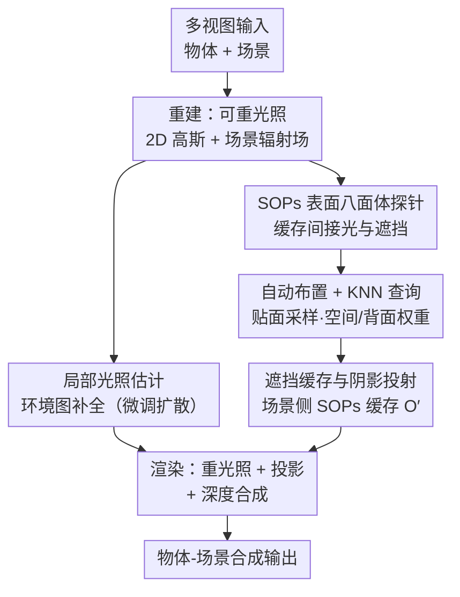

# ComGS: Efficient 3D Object-Scene Composition via Surface Octahedral Probes

**会议**: ICLR2026  
**OpenReview**: [https://openreview.net/forum?id=yXiSPBMrTT](https://openreview.net/forum?id=yXiSPBMrTT)  
**代码**: https://nju-3dv.github.io/projects/ComGS/ （含数据集）  
**领域**: 3D视觉  
**关键词**: 高斯泼溅, 物体-场景合成, 逆向渲染, 光照估计, 实时阴影

## 一句话总结
ComGS 用"表面八面体探针（SOPs）"把间接光照与遮挡缓存成贴在物体/场景表面的八面体纹理，靠 KNN 插值代替逐次光线追踪，再把复杂场景测光简化为"放置点局部环境图补全"，从而以约 26 FPS、36 秒编辑时间完成既和谐又带真实阴影的 3D 物体-场景合成，PSNR 比现有方法高 +1.4 dB。

## 研究背景与动机
**领域现状**：高斯泼溅（Gaussian Splatting, GS）已成为从多视图重建、实时渲染的主流表示。要把一个新物体"插"进一个已重建的高斯场景里、看起来自然且投下合理的影子，需要两件事：一是把物体重建成**可重光照（relightable）**的形式（解耦出材质与光照），二是估计**场景光照**好给物体重新打光、生成阴影。

**现有痛点**：GS 的辐射场天生把外观和阴影都"烤"进了颜色里（baked），物体和场景直接拼在一起就会光照、阴影不一致。可重光照的高斯逆向渲染方法（如 IRGS、R3DG）为了算遮挡和间接光，往往要在高斯点云上做**光线追踪**，每次优化迭代都追一遍，极慢，是实时合成的最大瓶颈。光照估计这边同样难：高斯逆向渲染在复杂场景里很难建模精细的光传输，常常失败；而基于学习的方法（如 DiffusionLight）从单张图预测光照，**对视角敏感**、多视图之间不一致。

**核心矛盾**：精度/真实感与效率之间的 trade-off——想要准就得光追，想要快就得牺牲遮挡和间接光；而"准确解耦整个场景光照"本身又是个几乎做不动的硬问题。

**本文目标**：(1) 让可重光照物体重建摆脱逐迭代光追，做到至少 2× 提速；(2) 在复杂场景里拿到可靠、多视图一致的光照，用于物体重光照和阴影。

**切入角度**：作者两个关键观察——其一，光追之所以贵是因为每个着色点都要现场追射线问遮挡/间接光，但这些信息**空间上是连续的**，完全可以预先缓存、用插值取；其二，物体-场景合成真正在意的只是**物体本身的外观和它附近的阴影**，根本不需要把整个场景的光照精确解耦出来。

**核心 idea**：用"表面八面体探针 + KNN 插值"取代光线追踪来缓存/查询遮挡与间接光；同时把"场景光照估计"这个难题改写成"放置点处的局部环境图补全"，交给微调的扩散模型去填。

## 方法详解

### 整体框架
ComGS 是一个三阶段的物体-场景合成框架：**重建（Reconstruction）→ 编辑（Editing）→ 渲染（Rendering）**。重建阶段从多视图把物体重建成带材质参数的可重光照 2D 高斯、把场景重建成高斯辐射场，并在物体的逆向渲染里引入表面八面体探针（SOPs）缓存间接光与自遮挡；编辑阶段做两件离线预计算——在放置点估计场景环境光照、用场景侧的 SOPs 缓存物体新引入的遮挡；渲染阶段则用估计的环境图给物体重光照、用缓存的遮挡算投影阴影，最后做深度合成得到最终画面。把昂贵的光追全部挪到"重建初始化"和"编辑预计算"里，渲染时只剩查表与积分，因此能跑到约 26 FPS、编辑只需 36 秒。

### 关键设计

**1. SOPs 表面八面体探针：用缓存+插值替掉逐迭代光线追踪**

这是全文的核心创新，针对的就是"可重光照重建因为逐次光追而慢"的痛点。物体逆向渲染要在每个着色点 $\mathbf{x}$ 求渲染方程 $L_o(\omega_o,\mathbf{x})=\int_\Omega f(\omega_o,\omega_i,\mathbf{x})L_i(\omega_i)(\omega_i\cdot\mathbf{n})\,d\omega_i$，其中入射光被拆成直接光、间接光与遮挡：$L_i(\omega_i)=(1-O(\omega_i))L_{dir}(\omega_i)+L_{in}(\omega_i)$。直接光 $L_{dir}$ 设成一张可学习的环境图，麻烦的是间接光 $L_{in}$ 和遮挡 $O$——传统做法（如 IRGS）每次迭代都在高斯点云上现场追射线，极贵。ComGS 改为在物体表面附近布一组探针，把每个探针处的 $\{L_{in},O\}$ 存成**八面体纹理**（octahedral texture，相比立方体/球面贴图内存小、畸变小），并且只在**初始化时用光追填一次**，之后用渲染损失在其引导下优化。这样把"每迭代都追光"摊薄成"一次性初始化 + 查表"，重建提速至少 2×，精度基本不掉。

**2. SOPs 的自动布置与高效查询：贴面采样 + KNN 空间/背面加权插值**

探针怎么放、怎么取，直接决定有没有漏光和插值准不准，所以单独作为一个设计。**布置**上，随手撒会让探针混进高斯点里造成漏光（light leaking），作者先渲染所有视角的几何缓存、做多视图深度融合得到带法线的稠密表面点云，再用最远点采样（FPS）均匀下采，最后让这些点沿法线方向**微偏移**（实验中取物体尺寸的 1%）贴在表面外侧。**查询**上，着色点 $\mathbf{x}$ 处用固定半径近邻（FRNN）找到邻近探针，再做 KNN 插值：$L_{in}(\mathbf{x})=\frac{\sum_k w_s(k)w_b(k)L_{in}(k)}{\sum_k w_s(k)w_b(k)}$。两个权重各管一件事：空间权重 $w_s=\frac{1}{\Vert\mathbf{d}_k\Vert}$ 让越近的探针越有发言权（$\mathbf{d}_k=\mathbf{p}_k-\mathbf{x}$）；背面权重 $w_b=0.5\cdot(1+\frac{\mathbf{d}_k}{\Vert\mathbf{d}_k\Vert}\cdot\mathbf{n}_p)+0.01$ 让方向和探针法线 $\mathbf{n}_p$ 越一致的探针贡献越大，从而抑制把"背面"探针的光错误地插过来。

**3. 局部光照估计：把"场景测光"难题改写成"环境图补全"**

针对"复杂场景全局光照估计做不动 / 单图学习视角不一致"的痛点，作者基于一个务实假设：插入物体相对场景很小，只影响自身及附近区域，于是把"估计整个场景光照"降级为"在放置点补全一张环境图"。具体地，在放置点对已重建的高斯场景做 **360° 环视扫一圈**，得到一张**不完整**的 RGB 全景、一张部分法线图、一张已重建区域的 alpha mask，把这三者喂给**微调过的 Stable Diffusion 2.1** 去补全成完整环境图。因为输入来自真实重建的辐射场而非单张照片，结果天然多视图一致、更贴合场景真实光照。为拿到 HDR，沿用 DiffusionLight 的曝光值（EV）条件化提示：基模型在 $EV=0$ 训练，再用插值嵌入微调出不同曝光档，推理时生成 $EV=\{-5,-2.5,0\}$ 三张再融合成 HDR 环境图，最后转成八面体纹理供重光照与阴影使用。

**4. 遮挡缓存与阴影投射：用场景侧 SOPs 缓存物体新引入的遮挡**

物体投在地上的影子，本质是它给场景**新引入的遮挡** $O'$。每帧都用光追算 $O'$ 同样太贵，于是作者复用 SOPs 把它缓存下来——注意这里的 $O'$ 是物体落到场景里产生的遮挡，和设计 1 里物体的自遮挡 $O$ 是两码事。在朗伯（Lambertian）场景假设下，无物体时场景渲染近似 $L_o\approx f_d\int L_i(\omega_i)(\omega_i\cdot\mathbf{n})\,d_{\omega_i}$，放入物体后变成 $L_o'=f_d\int L_i(\omega_i)(1-O'(\omega_i))(\omega_i\cdot\mathbf{n})\,d_{\omega_i}$，于是投影阴影直接由二者之比给出：$\mathcal{S}=\frac{L_o'}{L_o}$。实现时在放置点周围划一块"潜在阴影区"（大小取物体尺寸的若干倍，实验里是 6 倍），按设计 2 的自动布置策略在区内撒约 1 万个 SOPs，预先用光追算好它们的遮挡纹理，渲染时插值取用即可实时算阴影。

### 损失函数 / 训练策略
重建分两步。**第一步（辐射与几何）**用渲染损失 $\mathcal{L}_{rgb}=L_1(\mathcal{C},\hat{\mathcal{C}}_{gt})+0.2(1-\text{SSIM})$，加深度-法线一致正则 $\mathcal{L}_{d2n}=1-(\mathcal{N}\cdot\mathcal{N}_d)$，物体再加掩码约束 $\mathcal{L}_{mask}$，总损失 $\mathcal{L}=\mathcal{L}_{rgb}+\lambda_{d2n}\mathcal{L}_{d2n}+\lambda_{mask}\mathcal{L}_{mask}$（$\lambda_{d2n}=\lambda_{mask}=0.05$，训练 30k 步）。**第二步（材质与光照解耦）**在 PBR 图上用 $\mathcal{L}_{pbr}$，加朗伯材质正则 $\mathcal{L}_{lam}=L_1(\mathcal{R},1)+L_1(\mathcal{M},0)$（倾向高粗糙、低金属），并用光追得到的 $L_{tr},O_{tr}$ 监督探针纹理 $\mathcal{L}_{sops}=L_1(L_{in},L_{tr})+L_1(O,O_{tr})$，总损失再叠加 $\lambda_{lam}=0.001$、$\lambda_{sops}=1$，仅训练 2k 步。SOPs 数 5k、纹理分辨率 $16\times16$、128 条采样射线。

## 实验关键数据

### 主实验：SynCom 合成数据集上的合成质量与效率
作者用 Blender Cycles 渲了 4 物体 × 4 场景共 16 组合成的 SynCom 数据集，比较图像合成类（DiffHarmony、ZeroComp、MV-CoLight）、高斯逆向渲染类（GS-IR、GI-GS、IRGS）和自家变体（DiffusionLight 测光、Ours-Trace 纯光追、Ours-SOPs）。客观用 PSNR/SSIM，主观由 40 人打 3D 一致性（Con.）与和谐度（Harm.，1–5 分）。

| 方法 | PSNR↑ | SSIM↑ | 一致性↑ | 和谐度↑ | FPS↑ | 编辑(s)↓ |
|------|------|------|------|------|------|------|
| DiffHarmony | 22.44 | 0.825 | 3.13 | 2.93 | 0.01 | - |
| GS-IR | 22.42 | 0.824 | 3.28 | 2.13 | 2.11 | - |
| IRGS | 22.42 | 0.799 | 3.50 | 2.88 | 0.03 | - |
| DiffusionLight | 21.84 | 0.841 | 1.91 | 2.17 | 0.02 | - |
| **Ours (Trace)** | **24.57** | **0.870** | **4.75** | **4.60** | 4.02 | 14.59 |
| **Ours (SOPs)** | 24.28 | 0.868 | 4.56 | 4.59 | **26.14** | 36.12 |

可见两个变体在 PSNR/主观分上都明显领先（+1.4 dB PSNR、~21% 更高一致性、~56% 更高和谐度）；Trace 版画质略高但只有 4 FPS，SOPs 版质量几乎持平却把帧率拉到 26 FPS——这正是 SOPs 的价值所在。

### 重建实验：TensoIR 上精度持平、速度最快

| 方法 | NVS PSNR↑ | Albedo PSNR↑ | Relight PSNR↑ | 训练时间↓ |
|------|------|------|------|------|
| TensoIR | 35.09 | 29.28 | 28.58 | 5 h |
| GS-IR | 35.33 | 30.29 | 24.37 | 16.40 min |
| IRGS | 35.75 | 31.66 | 30.25 | 21.45 min |
| **Ours** | 35.82 | 31.68 | **30.47** | **7.93 min** |

重光照精度达到/略超 SOTA，而训练只要 7.93 分钟（IRGS 的约 1/3），印证"KNN 插值替光追 + 全图训练替随机像素采样"带来的提速。

### 关键发现
- **SOPs 是效率主力**：Ours-Trace → Ours-SOPs 几乎不掉画质（PSNR 24.57→24.28），帧率却从 4.02 提到 26.14 FPS，说明把光追换成探针缓存几乎是"免费午餐"。
- **基于重建辐射场的测光更稳**：GS-IR/IRGS 在复杂场景测不准、DiffusionLight 单图估计跨视角抖动，ComGS 因为从重建场景采全景补全，环境图更准且多视图一致（图 6）。
- **探针数量/分辨率越高阴影越好**（图 15、表 5），1% 法线偏移在所有实验里都没观察到明显漏光。

## 亮点与洞察
- **"缓存换光追"的思路很通用**：把空间上连续的间接光/遮挡预存成贴面探针纹理、用 KNN 插值取，是图形学 light probe 思想嫁接到高斯逆向渲染的漂亮一手，可迁移到任何"每迭代/每帧都要现场光追"的可重光照管线。
- **把难问题"降级"而非"硬解"**：意识到合成只在意物体附近，于是把"全场景光照解耦"改写成"放置点环境图补全"，绕开了几乎不可解的硬骨头——这种"重新定义任务边界"的取巧值得学。
- **自遮挡 $O$ 与物体引入遮挡 $O'$ 分开建模**，且阴影用简洁的 $\mathcal{S}=L_o'/L_o$ 比值得到，物理直觉清晰、实现轻量。

## 局限与展望
- **强依赖两条假设**：物体相对场景小、只影响局部；场景近似朗伯。作者自己给了两个失败案例——远处阴影投不出来（违反"局部影响"假设）、镜面/高光场景重建和反射都失效（违反朗伯假设 + 2DGS 对反射场景重建本就吃力）。
- **物体一动就得重算 SOPs**：探针缓存在场景空间、视角移动可复用，但插入物体移动会改变可见性与光照，需要重算遮挡探针；高效的增量更新仍是开放问题。
- **只吃多视图输入**：依赖多视图 3D 重建，扩展到单图输入尚未解决。
- 个人观察：编辑 36 秒虽快，但其中"光照估计 ~15 s + 遮挡缓存 ~20 s"都是预计算，物体一换位置就要重来，交互式编辑体验仍有瓶颈；SOPs 数量（场景侧 1 万个）也带来一定内存开销。

## 相关工作与启发
- **vs IRGS / R3DG（高斯逆向渲染）**：它们靠逐点光追算遮挡与间接光，慢且在复杂场景测光易失败；ComGS 用 SOPs 缓存 + KNN 插值替光追，重建快 2× 以上、合成可实时，代价是引入朗伯/局部假设。
- **vs DiffusionLight（单图测光）**：DiffusionLight 用扩散模型从单图"画铬球"估光，泛化好但视角不一致；ComGS 同样用微调扩散，但输入是从重建辐射场扫出的局部全景，天然多视图一致。
- **vs DiffHarmony / ZeroComp（图像级合成）**：它们在 2D 图像层做和谐化/合成，处理不了物体-场景遮挡与真实 3D 阴影；ComGS 在 3D 物理重光照层面解决，阴影可信度高得多。

## 评分
- 新颖性: ⭐⭐⭐⭐⭐ SOPs 把 light probe 引入高斯逆向渲染、并把测光重定义为局部环境图补全，两个想法都很巧。
- 实验充分度: ⭐⭐⭐⭐ 合成/公开/手机拍摄三类数据 + 主客观指标 + 重建对比齐全，但主表消融主要靠 Trace/SOPs 两变体，模块级消融偏少。
- 写作质量: ⭐⭐⭐⭐⭐ 三阶段管线和两大创新讲得清楚，图 2/3 配合到位。
- 价值: ⭐⭐⭐⭐⭐ 把真实感 3D 物体-场景合成做到约 26 FPS + 36 秒编辑，对沉浸式/AR 应用有直接落地价值。

<!-- RELATED:START -->

## 相关论文

- [\[ICLR 2026\] A²TG: Adaptive Anisotropic Textured Gaussians for Efficient 3D Scene Representation](a2tg_adaptive_anisotropic_textured_gaussians_for_efficient_3d_scene_representati.md)
- [\[CVPR 2025\] ProbeSDF: Light Field Probes for Neural Surface Reconstruction](../../CVPR2025/3d_vision/probesdf_light_field_probes_for_neural_surface_reconstruction.md)
- [\[ICLR 2026\] LiTo: Surface Light Field Tokenization](lito_surface_light_field_tokenization.md)
- [\[CVPR 2026\] Zoo3D: Zero-Shot 3D Object Detection at Scene Level](../../CVPR2026/3d_vision/zoo3d_zero-shot_3d_object_detection_at_scene_level.md)
- [\[ICLR 2026\] Efficient-LVSM: Faster, Cheaper, and Better Large View Synthesis Model via Decoupled Co-Refinement Attention](efficient-lvsm_faster_cheaper_and_better_large_view_synthesis_model_via_decouple.md)

<!-- RELATED:END -->
