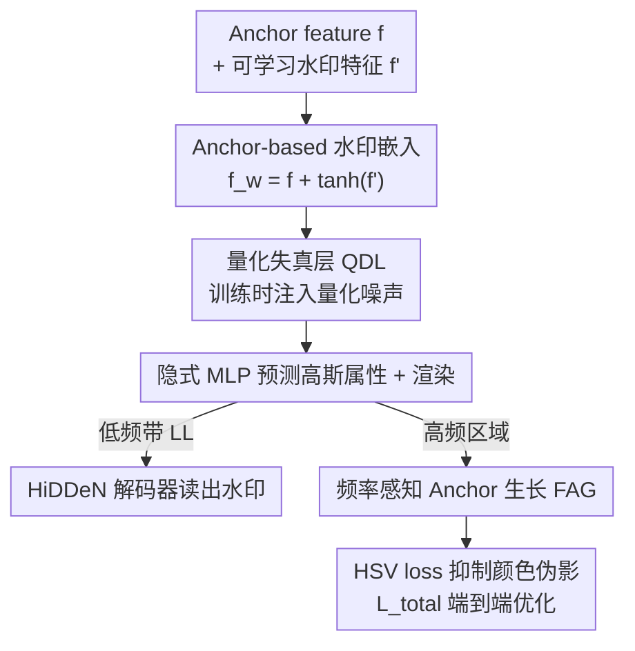

# CompMarkGS: Robust Watermarking for Compressed 3D Gaussian Splatting

**会议**: ICLR 2026  
**OpenReview**: [https://openreview.net/forum?id=NXQvejGBFx](https://openreview.net/forum?id=NXQvejGBFx)  
**领域**: 3D视觉  
**关键词**: 3DGS水印, 版权保护, 抗压缩鲁棒性, anchor-based 3DGS, 量化失真层  

## 一句话总结
针对现有 3DGS 水印在量化压缩后被冲毁的问题，本文把水印嵌进 anchor-based 3DGS 的 anchor feature、再用「量化失真层」在训练时模拟压缩噪声，使水印在 HAC/ContextGS 压缩前后都能保持 ~94% 比特准确率，同时靠频率感知 anchor 生长和 HSV loss 维持渲染质量。

## 研究背景与动机

**领域现状**：3D Gaussian Splatting（3DGS）凭实时、高保真渲染被学术界和商业（数字孪生、AR/VR）大量采用，随之而来的是两件事：一是模型体积巨大（动辄上百万个高斯），必须**压缩**才能存储和传输；二是训练好的 3DGS 资产值钱，需要**水印**来做版权保护。现有 3DGS 水印（GaussianMarker、3D-GSW、GuardSplat 等）的做法是直接改高斯属性——位置、SH 系数、或者干脆增删高斯来藏信息。

**现有痛点**：这些方法只考虑了图像域的传统失真（裁剪、JPEG、加噪），**完全没考虑模型压缩**。而真实部署里压缩几乎是必经环节，尤其是基于量化的压缩（HAC、ContextGS）。量化会整体平移模型参数的分布，把藏在高斯属性里的水印信号一起冲掉。论文实测：WateRF/GaussianMarker/3D-GSW 压缩前比特准确率都能上 90%，压缩后（HAC 方案）直接掉到 53–58%——几乎等于随机猜，版权根本验不出来。

**核心矛盾**：水印是嵌在「会被量化直接改写」的显式属性上，量化误差与水印信号正面冲突；而且基于 anchor 的压缩（HAC）还有 anchor→高斯的插值步骤，误差会叠加放大。另一层矛盾在渲染侧：水印解码要从图像低频带读信息，但重建 loss 又把低频里的水印当成误差去抹掉，于是「保水印」和「保画质」互相打架。

**本文目标**：做一个压缩后仍能可靠检出的 3DGS 水印，同时不牺牲渲染质量——这要求同时解决「抗量化」和「水印↔画质 trade-off」两个子问题。

**切入角度**：作者注意到 anchor-based 3DGS（Scaffold-GS）有个天然优势——它的高斯属性是由 anchor feature 经隐式 MLP **动态预测**出来的，而不是显式存的。把水印藏进 anchor feature，攻击者既难直接从点云/高斯属性里发现水印，水印也只通过 MLP 间接影响渲染、不直接扰动几何。这正好是个理想的藏身之处。

**核心 idea**：把水印嵌进 anchor feature（而非显式几何属性），再在训练时用一个「量化失真层」主动注入量化噪声当数据增强，逼水印学会扛住压缩。

## 方法详解

### 整体框架
CompMarkGS 建在 Scaffold-GS 这类 anchor-based 3DGS 之上。每个 anchor 携带 anchor feature $f$、scaling $l$、offsets $O$ 等属性，可见 anchor 经多个隐式 MLP 动态生成 $K$ 个高斯再渲染。本文在这条管线上做四处改动：(1) 把一个可学习的水印嵌入特征 $f'$ 加到 anchor feature $f$ 上得到带水印特征 $f^w$；(2) $f^w$ 先过**量化失真层（QDL）**注入量化噪声，再喂给 MLP 预测高斯属性；(3) 渲染出图后，取低频带送进预训练好的 HiDDeN 解码器读出水印消息；(4) 同时用**频率感知 anchor 生长（FAG）**只在高频区域加密 anchor、并用 **HSV loss** 抑制颜色伪影，二者共同保画质。整套用 $\mathcal{L}_\text{total}$ 端到端训练。

### 关键设计

**1. Anchor feature 水印嵌入：把信息藏进隐式特征而非显式几何**

针对「水印嵌在显式属性上、量化一改就丢、还容易被攻击者发现」的痛点，本文不去碰位置、scaling、offsets 这些直接决定高斯位姿和形状的属性，而是把水印加到 anchor feature 上——这个特征只通过 MLP **间接**影响渲染，改它不会在图像上留下明显几何畸变。具体地引入一个与 $f$ 同维的可学习水印嵌入特征 $f'\in\mathbb{R}^d$，带水印特征为

$$f^w = f + \tanh(f'),\quad f, f'\in\mathbb{R}^d$$

这里 $\tanh(\cdot)$ 把 $f'$ 压到 $[-1,1]$ 是个关键细节：well-trained anchor 属性近似服从正态分布，直接加一个无界特征会撑大方差、导致梯度不稳、收敛变慢、画质变差；而若用 sigmoid 压到 $[0,1]$ 则只能往正方向加、引入方向偏置。对称的 $[-1,1]$ 既稳定梯度又让水印以一致幅度注入。消融（Tab.4）直接印证了藏身之处的重要性：嵌到 position/scaling 压缩后比特准确率只有 65–68%、PSNR 掉到 12–19，嵌到 anchor feature 则同时拿到 95.9% 准确率和 27.65 PSNR。

**2. 量化失真层 QDL：训练时模拟压缩噪声，让水印学会抗量化**

这是全文最核心、消融里掉点最狠的模块，针对的正是「量化平移参数分布、冲毁水印」这一核心痛点。传统水印早就用可微失真层在训练时模拟 JPEG、裁剪来增强鲁棒性，但没人把这套思路用到「模型压缩」上。QDL 借用 HAC 的量化机制，但**首次把它当成数据增强**来训水印：训练时给带水印特征 $f^w$ 注入随机量化噪声，第 $i$ 个 anchor 的量化后特征为

$$\tilde f^w_i = f^w_i + \mathcal{U}\!\left(-\tfrac12, \tfrac12\right)\cdot q_i,\quad q_i = Q_0\cdot\big(1+\tanh(r_i)\big),\ r_i = \text{MLP}_q(f^w_i)$$

其中均匀噪声 $\mathcal{U}(-\frac12,\frac12)$ 模拟量化的舍入误差，量化尺度 $q_i\in[0,2Q_0]$ 不是固定的，而是由一个 $\text{MLP}_q$ 读 $f^w_i$ 自适应输出 $r_i$ 来微调初始尺度 $Q_0$。这样水印在训练阶段就反复经历它将来在真实压缩攻击里要遇到的扰动，自然学会扛住量化。Tab.5 显示去掉 QDL 时比特准确率掉得最多（HAC 下 95.92→90.75），坐实它是抗压缩的命门。

**3. 频率感知 anchor 生长 FAG：化解「保水印」与「保画质」的频域冲突**

水印解码读的是渲染图经 DWT 得到的低频 LL 子带 $M'=D(I_\text{LL})$，把水印嵌在低频保证了鲁棒性；但重建 loss $\mathcal{L}_\text{scaffold}$ 是在整图上算的，会把 LL 带里的水印信号当成相对 GT 的误差去抹——于是提画质就削弱水印、保水印就降画质。FAG 的思路是：让画质增强**避开**水印所在的低频，只去高频区域加密。具体先用 DFT + 高通滤波 + IDFT 取出渲染图 $I'$ 与 GT $I$ 的高频图 $I'_\text{hf}, I_\text{hf}$，再构造基于 SSIM 的误差图

$$P_\text{error}(p) = 1 - \text{SSIM}\big(N(I_\text{hf},p),\, N(I'_\text{hf},p)\big)$$

取所有误差的中位数 $\tilde P_\text{error}$，选落在 $[\tilde P_\text{error}-\epsilon,\ \tilde P_\text{error}+\epsilon]$ 的像素做二值 mask，得到高频区域的 2D 坐标；再把每个 3D 高斯投影到图像平面、坐标取整，与高频像素坐标匹配，生成布尔 mask $F_\text{mask}$，**只有被 $F_\text{mask}$ 选中的高斯**才参与 anchor 生长。这样加密只发生在细节丰富的高频区，不去搅扰低频里的水印，二者得以兼得。这张 SSIM 误差图同时也被频率 loss $\mathcal{L}_\text{freq}$ 复用。

**4. HSV loss：在更贴近人眼的色彩空间里压掉颜色伪影**

嵌水印常带来局部颜色伪影。以往方法在 RGB 空间算图像 loss，但 RGB 按独立像素的通道值算误差，不符合人眼视觉系统。本文改到 HSV 空间算 loss：先按色相范围为红/绿/蓝各构造二值 mask $M_c(p)$（$\text{Hue}(p)\in H_c$ 时为 1），把 loss 聚焦在出现明显色彩伪影的区域，

$$\mathcal{L}_\text{hsv} = \frac{1}{|C||\Omega|}\sum_{c\in C}\sum_{p\in\Omega}\big\|M_c(p)\cdot(I(p)-I_\text{gt}(p))\big\|^2$$

只惩罚 mask 命中的像素。消融显示去掉它会让 LPIPS 变差并引入细微色偏，说明它能补 RGB-space loss 处理不了的颜色伪影。

### 损失函数 / 训练策略
水印消息 loss 用二值交叉熵 $\mathcal{L}_\text{msg}=-\sum_i[M_i\log\sigma(M'_i)+(1-M_i)\log(1-\sigma(M'_i))]$。总损失为

$$\mathcal{L}_\text{total} = \lambda_\text{img}\big(\mathcal{L}_\text{scaffold} + \lambda_\text{hsv}\mathcal{L}_\text{hsv} + \lambda_\text{freq}\mathcal{L}_\text{freq}\big) + \lambda_\text{msg}\mathcal{L}_\text{msg}$$

其中 $\mathcal{L}_\text{scaffold}$ 是 Scaffold-GS 的重建 loss（含 1 项 scale 正则 + 2 项渲染保真），$\mathcal{L}_\text{freq}$ 是 SSIM 误差图的均值。超参 $\lambda_\text{img}=10,\ \lambda_\text{hsv}=0.6,\ \lambda_\text{freq}=0.1,\ \lambda_\text{msg}=0.45$，量化尺度 $Q_0=1$，高频生长范围 $\epsilon=0.3$。单卡 A6000 端到端训练，主实验用 48-bit 消息。

## 实验关键数据

数据集：Blender（8 合成场景）、LLFF（8 前向真实场景）、Mip-NeRF 360（9 真实场景），共 25 个场景；解码器用各比特长度对应的预训练 HiDDeN（训练时冻结）。压缩用 HAC 和 ContextGS 两套量化方案。

### 主实验

48-bit、三数据集平均，压缩前 / 压缩后（核心看压缩后是否崩）：

| 方法 | 比特准确率(%) ↑ | PSNR ↑ | Size(MB) ↓ |
|------|------|------|------|
| HAC + WateRF | 91.02 / **54.40** | 27.36 / 13.63 | 207.72 / 13.66 |
| HAC + GaussianMarker | 92.00 / **58.34** | 27.05 / 13.54 | 341.30 / 24.33 |
| HAC + 3D-GSW | 90.96 / **53.48** | 19.57 / 13.13 | 173.64 / 12.93 |
| HAC + GuardSplat | 79.77 / **52.72** | 16.29 / 12.28 | 215.69 / 13.15 |
| **HAC + CompMarkGS** | **95.95 / 95.92** | **27.68 / 27.65** | 208.96 / **12.23** |
| ContextGS + WateRF | 92.01 / 90.36 | 26.64 / 26.47 | 219.48 / 9.88 |
| **ContextGS + CompMarkGS** | **94.36 / 94.03** | **27.60 / 27.55** | 73.39 / **5.72** |

关键对比：HAC 压缩下，所有 baseline 压缩后比特准确率塌到 52–58%（基本失效），CompMarkGS 几乎零衰减（95.95→95.92），PSNR 也从 baseline 的 12–13 稳在 27.65。ContextGS 由于不带 anchor-高斯插值，baseline 衰减没那么夸张，但 CompMarkGS 仍是准确率和画质双优。

容量（压缩前，三数据集 + 两压缩方案平均）：

| 方法 | 32 bits | 48 bits | 64 bits |
|------|------|------|------|
| GaussianMarker | 95.07 | 91.62 | 79.81 |
| 3D-GSW | 93.00 | 89.62 | 86.31 |
| **CompMarkGS** | **96.52** | **95.16** | **91.29** |

消息越长每比特预算越少、越脆弱，但 CompMarkGS 在 64-bit 仍保 91.29%，而 GaussianMarker 已跌到 79.81%。

### 消融实验

三大组件消融（48-bit，HAC 压缩后）：

| FAG | QDL | $\mathcal{L}_\text{hsv}$ | 比特准确率(%) | PSNR | LPIPS | 说明 |
|------|------|------|------|------|------|------|
| – | – | – | 90.67 | 26.44 | 0.196 | 全去掉 |
| ✓ | – | ✓ | 90.75 | 26.75 | 0.182 | 去 QDL：准确率掉最多 |
| – | ✓ | ✓ | 93.95 | 27.54 | 0.178 | 去 FAG：画质+准确率双降 |
| ✓ | ✓ | – | 92.57 | 27.49 | 0.179 | 去 HSV：LPIPS 变差 |
| ✓ | ✓ | ✓ | **95.92** | **27.65** | **0.177** | 完整模型 |

嵌入目标消融（48-bit，HAC 压缩后）：

| 嵌入属性 | 比特准确率(%) | PSNR | 说明 |
|------|------|------|------|
| Position | 67.91 | 12.05 | 直接改几何，画质崩 |
| Scaling | 65.06 | 19.35 | 同上 |
| Offsets | 94.88 | 24.61 | 尚可但画质次于本文 |
| Anchor Feature (本文) | **95.92** | **27.65** | 隐式藏身，双优 |

### 关键发现
- **QDL 是抗压缩命门**：三组件里去掉 QDL 比特准确率掉得最多，证明「训练时模拟量化噪声」才是水印扛住压缩的根本，单靠把水印藏好不够。
- **嵌入位置决定一切**：嵌到 position/scaling 这类显式几何属性，压缩后准确率 65–68%、PSNR 12–19，几乎不可用；嵌到 anchor feature 才能准确率画质双高——验证了「藏进隐式特征」的核心假设。
- **HAC 比 ContextGS 更难扛**：因为 HAC 多了 anchor-高斯插值步骤，量化误差与插值误差叠加放大，baseline 在 HAC 下塌得更惨，更凸显 CompMarkGS 的鲁棒性。
- **FAG 解的是频域冲突**：只在高频区生长 anchor，避开低频里的水印，让画质增强和水印鲁棒不再互相拆台。

## 亮点与洞察
- **把压缩机制反过来当数据增强**：QDL 直接借用 HAC 的量化机制，但不是用来压缩，而是在训练里注入量化噪声当增强——「攻击什么就在训练里喂什么」的对抗式思路用得很干净，是可直接迁移到其他抗压缩任务的范式。
- **隐式表示天然是好藏身处**：anchor feature 经 MLP 间接影响渲染，既难被攻击者从点云直接发现，又不会扰动几何——选对「藏哪」比设计「怎么藏」更关键，这点对其他隐式 3D 表示（如 triplane/NeRF）的水印也有借鉴意义。
- **$\tanh$ 而非 sigmoid 的细节考究**：从「保持 anchor 属性正态分布、避免方向偏置」推出对称有界激活，是个容易被忽略但有理有据的小设计。
- **用频域 mask 把两个互斥目标在空间上解耦**：水印占低频、画质增强占高频，FAG 用频率把冲突双方在空间上分开——这种「频域分工」思路很巧。

## 局限与展望
- 方法强绑定 anchor-based 3DGS（Scaffold-GS 系），对原始显式 3DGS 不直接适用；QDL 也针对量化类压缩设计，对其他压缩范式（如纯剪枝、码本 VQ）的泛化未充分验证。
- 鲁棒性评测里 baseline 都是「移植到 anchor-based 框架」后再比，GuardSplat 还因架构不兼容做了改动，移植本身可能不是各方法的最优形态，横向比较需带这个 caveat。
- 比特准确率虽高但非 100%，长消息（64-bit）仍有约 9% 误码；论文未深入讨论纠错编码或多视角投票等进一步提纯手段。
- QDL 的量化尺度由 $\text{MLP}_q$ 自适应预测，但与真实压缩器（HAC/ContextGS）实际量化步长的匹配程度、是否对未见过的压缩方案泛化，值得更系统地分析。

## 相关工作与启发
- **vs GaussianMarker / 3D-GSW / GuardSplat**：它们把水印嵌进显式高斯属性（不确定性高斯、删高斯、SH 系数），只抗图像域失真；本文嵌进 anchor feature 并显式针对模型量化压缩，压缩后准确率从 ~53–58% 提到 ~94%，是首个抗压缩的 3DGS 水印框架。
- **vs WateRF**：WateRF 在 NeRF 上用频域（DWT）做即插即用水印，本文同样用低频带做解码，但把场景搬到 anchor-based 3DGS 并补上 QDL 抗量化，压缩鲁棒性显著更强。
- **vs HAC / ContextGS（压缩方法）**：本文不和它们竞争，而是把它们当作要抵御的压缩攻击、并借用其量化机制做训练增强——是「压缩」与「水印」两条线的一次结合。

## 评分
- 新颖性: ⭐⭐⭐⭐⭐ 首个面向模型压缩的 3DGS 水印，QDL「把压缩当增强」的思路干净有效。
- 实验充分度: ⭐⭐⭐⭐⭐ 两压缩方案 × 三数据集 × 多比特长度 × 图像/模型双失真攻击 + 完整消融。
- 写作质量: ⭐⭐⭐⭐ 动机推导清楚、图表充分；部分实现细节挪到附录，主文略紧凑。
- 价值: ⭐⭐⭐⭐⭐ 直击「压缩+版权」这一真实部署刚需，对 3D 资产保护有实际意义。

<!-- RELATED:START -->

## 相关论文

- [\[ICLR 2026\] NGS-Marker: Robust Native Watermarking for 3D Gaussian Splatting](ngs-marker_robust_native_watermarking_for_3d_gaussian_splatting.md)
- [\[CVPR 2026\] Robust3DGSW: Toward Robust Watermarking for Quantization-Aware 3D Gaussian Splatting](../../CVPR2026/3d_vision/robust3dgsw_toward_robust_watermarking_for_quantization-aware_3d_gaussian_splatt.md)
- [\[CVPR 2025\] 3D-GSW: 3D Gaussian Splatting for Robust Watermarking](../../CVPR2025/3d_vision/3d-gsw_3d_gaussian_splatting_for_robust_watermarking.md)
- [\[CVPR 2025\] GuardSplat: Efficient and Robust Watermarking for 3D Gaussian Splatting](../../CVPR2025/3d_vision/guardsplat_efficient_and_robust_watermarking_for_3d_gaussian_splatting.md)
- [\[AAAI 2026\] Splats in Splats: Robust and Effective 3D Steganography towards Gaussian Splatting](../../AAAI2026/3d_vision/splats_in_splats_robust_and_effective_3d_steganography_towards_gaussian_splattin.md)

<!-- RELATED:END -->
