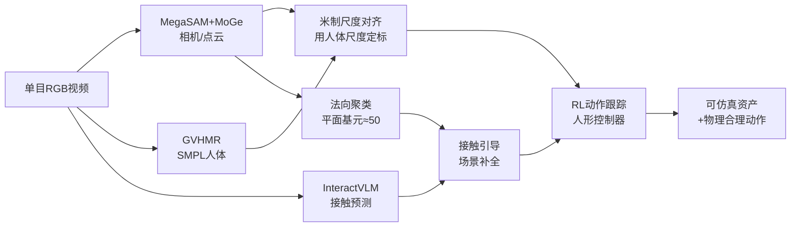

# Contact-guided Real2Sim from Monocular Video with Planar Scene Primitives

**会议**: ICLR 2026  
**OpenReview**: [https://openreview.net/forum?id=xlr3NqxUqY](https://openreview.net/forum?id=xlr3NqxUqY)  
**代码**: [crisp-real2sim.github.io/CRISP-Real2Sim](https://crisp-real2sim.github.io/CRISP-Real2Sim)  
**领域**: 3D 视觉 / Real2Sim / 人体-场景交互  
**关键词**: 单目视频, 平面基元, 人体动作重建, 接触建模, 物理仿真, 强化学习  

## 一句话总结
CRISP 从单目视频中重建"可仿真"的人体动作与场景几何——核心是把点云聚类成约 50 个干净凸的平面基元、并用人-场景接触线索补全被遮挡的支撑面，再用 RL 驱动人形控制器验证物理合理性，把动作跟踪失败率从 55.2% 降到 6.9%（8 倍）。

## 研究背景与动机
**领域现状**：从单目视频"理解人"已在时空重建、动作识别上取得长足进步，而把视频变成可仿真资产（vid2sim / real2sim）能为具身智能、角色动画、AR/VR 提供可扩展的训练数据。理想的重建要能让仿真器忠实复现人、环境及其交互，同时遵守物理定律（不穿模、脚不打滑、几何不悬空）。

**现有痛点**：联合的人-场景重建工作大多依赖数据驱动先验做联合优化、回路里没有物理，产出的是带噪声、非水密的 2.5D 几何，常有重复结构或缺失区域。更关键的是——**物理仿真对几何精度的要求远高于视觉重建**：地面上一点点噪声就能让人形仿真真的"绊倒"。此外稠密 mesh（TSDF + Marching Cubes）动辄几十万三角面，碰撞检测昂贵，且过度平滑/伪影会让 RL 策略反复失败。

**核心矛盾**：视觉重建追求"看起来对"，而物理仿真需要"凸、干净、水密、轻量"的几何；二者对几何的诉求并不一致，导致直接拿重建结果驱动仿真器极易崩溃。

**本文目标**：给定随手拍的单目交互视频（爬楼梯、坐沙发、跑酷等），重建出能在仿真器里稳定驱动人形、且接触忠实的人体动作 + 场景几何。

**核心 idea**：
- **平面基元假设**：很多人-场景交互（坐、躺、跑酷、爬梯）本质都是与平面的交互，于是把场景点云聚类成 ≈50 个凸的平面长方体基元，既轻量高效又对低层噪声鲁棒。
- **接触即补全线索**：用人体姿态 + 接触预测推断被身体遮挡的支撑面（如被坐住的椅面）。
- **物理在回路**：用 RL 驱动人形跟踪重建动作，反过来用"能否仿真成功"来筛选/约束重建质量。

## 方法详解

### 整体框架
CRISP 是一条把单目 RGB 视频转成仿真资产的流水线：先用视觉 SLAM 恢复相机内参/位姿与全局点云、并把 HMR 人体提到世界系且对齐到米制尺度；再把点云聚类拟合成平面基元得到可仿真场景；接着用接触预测补全遮挡支撑面；最后用 RL 训练人形控制器跟踪重建动作以验证物理合理性。

### 关键设计

**1. 人-场景-相机初始化与米制对齐：先把所有东西放进同一个真实尺度的世界系。** CRISP 用 MegaSAM 联合恢复相机内参 $K$、逐帧位姿 $T_i=[R_i|t_i]\in SE(3)$ 和稠密深度，并把优化阶段的深度估计器换成 MoGe 以提升几何质量，得到尺度未知的稠密点云 $P$。人体侧把 $K$ 喂给 GVHMR 拿到相机系 SMPL mesh，再用 $T_i$ 提到世界系。由于 MegaSAM 只能恢复到未知尺度，作者用"人的尺寸是已知的"这一线索：缩放 $P$ 使缩放后点云中人的深度与 GVHMR 的 3D SMPL mesh 深度匹配，从而得到米制点云 $\tilde P$，保证人、场景、相机共享单一真实坐标系——这是后续接触判断和物理仿真能成立的前提。

**2. 基于法向的平面基元拟合：把噪声点云压成约 50 个凸长方体。** 物理仿真器（Isaac Gym）需要 mesh 做碰撞检测，而 TSDF+Marching Cubes 产出的稠密 mesh 又大又脏，会让人形撞上伪影、接触力不稳而失败。CRISP 的洞见是把场景拆成少量凸基元同时解决"昂贵"和"噪声"两个问题。具体三步聚类（见原文 Fig.3）：(1) 在法向图上跑 K-means 产生候选平面段（法向由点图有限差分得到）；(2) 用 DBSCAN 对每段内的 3D 点做空间切分；(3) 跨帧把平面拟合相近、且有足够光流对应的段做时序合并——这样同一物理平面在不同帧里被切成多段时能合回单一时序一致的平面区域。最后对每个合并区域用 RANSAC 拟合平面，并赋予默认 0.05m 厚度构成平面长方体。整套流程无需逐场景优化，轻量且"开箱即仿真"。

**3. 接触作为场景补全线索：用人的姿态"幻想"出被遮挡的支撑面。** 单目视频里关键交互面常被人体挡住（站立的地面、被坐住的沙发面）。CRISP 对每帧的 SMPL mesh $M_t$ 估计 per-vertex 接触 $c_t(v)\in\{0,1\}$（用 InteractVLM 预测与场景接触的 SMPL 顶点掩码），用接触点反推应该存在的支撑几何。难点是 InteractVLM 在"接近接触"帧上会过预测假阳性，于是作者做**时序-运动学过滤**：对接触预测沿时间做非极大抑制，只保留连续 $L$ 帧高置信的预测，并取人体运动 $v_t$ 最小的那一帧
$$t^* = \arg\min_{t\in\{i,\,i+L\}} v_t$$
即在"人最静止、最稳地压在表面上"的瞬间确定接触，从而稳健地补出被遮挡的椅面/台阶平台。

**4. 物理动作跟踪：用 RL 把重建动作"跑"出来以验证并精修物理合理性。** 沿用 DeepMimic 范式训练全约束动作跟踪策略 $\pi_{FC}$ 模仿流水线提取的全身动作。策略输入角色状态 $s_t$ 与未来 $K$ 个目标姿态 $g_t=[\hat f_{t+1},\dots,\hat f_{t+K}]$，状态由关节朝向/位置/速度相对根关节表示
$$s_t = \big(\theta_t\ominus\theta_t^{root},\ (p_t-p_t^{root})\ominus\theta_t^{root},\ v_t\ominus\theta_t^{root}\big)$$
动作被参数化为 PD 控制器的目标关节角，策略为固定对角协方差（$\sigma_\pi=0.055$）的高斯。奖励鼓励模仿参考动作的位置/旋转/线速度/角速度/根高，并加能量惩罚抑制抖动：
$$r_t = w_p e^{-\alpha_p\|\hat p_t-p_t\|} + w_r e^{-\alpha_r\|\hat q_t\ominus q_t\|} + w_v e^{-\alpha_v\|\hat{\dot p}_t-\dot p_t\|} + \cdots + w_e\sum_j\|\tau_j\dot q_j\|$$
训练沿用 MaskedMimic 的 transformer encoder 策略 + MLP critic，并用 DeepMimic 的参考状态初始化（RSI）与早停（ET，关节偏离参考 >0.5m 即终止），在 Isaac Gym 中以 120Hz 仿真、30Hz 控制、PPO+GAE 优化。每个动作片段单独训一个策略以公平比较不同重建资产的仿真表现。

## 实验关键数据

### 主实验表格（Table 1：整体 real-to-sim）

| 方法 | RL | Success↑ | FPS↑ | PROX CD$_{bi}$↓ | CD$_{one}$↓ | Non-Pene↑ | EMDB Success↑ | W-MPJPE100↓ |
|------|----|---------:|-----:|---------:|------:|------:|------:|------:|
| VideoMimic | ✓ | 44.8% | 16K | 0.337 | 0.311 | 0.906 | 50.0% | 505.31 |
| Ours (TSDF) | ✓ | 75.9% | 15K | 0.178 | 0.222 | 0.925 | 77.8% | 197.77 |
| Ours (NKSR) | ✓ | 79.3% | 16K | 0.163 | 0.187 | 0.937 | 75.0% | 185.00 |
| **Ours (Planar)** | ✓ | **93.1%** | **23K** | 0.187 | **0.174** | **0.947** | **93.8%** | **175.93** |

平面基元相比并发工作 VideoMimic：RL 成功率 44.8%→93.1%、吞吐 16K→23K FPS（+43%）、HMR 误差近乎减半。

### 消融实验表格（几何表示 + 接触补全）

| 维度 | 设置 | 关键结论 |
|------|------|----------|
| 几何表示 | VideoMimic 稠密 mesh | 过平滑/重复结构/伪影，仿真常灾难性失败 |
| 几何表示 | TSDF | 成功率提升但仍过平滑、接触精度低 |
| 几何表示 | NKSR | 表面更锐、非穿模与 CD 更好 |
| 几何表示 | **Planar（本文）** | CD$_{one}$ 最低、Non-Pene 最高、FPS 最高；CD$_{bi}$ 略差（缺非接触细节，仿真无害） |
| 接触补全 | w/o contact | 漏掉被遮挡支撑面（如台阶平台），人形跌倒/动作失真 |
| 接触补全 | **w/ contact** | 补出支撑几何，仿真稳定、动作更贴参考 |

### 关键发现
- **物理仿真对几何"精度"比"完整度"更敏感**：平面基元 CD$_{bi}$ 略逊 NKSR（缺细小非接触结构），但单向 CD$_{one}$（Recon→GT）最低，说明它"存在的地方都贴着真值"；仿真里缺非接触细节无害，多出噪声几何才会破坏接触、让策略崩。
- **物理推理反过来改善人/场景重建质量**：把物理放进回路不仅稳，还提升了 HMR 与几何的最终质量。
- 在 EMDB 世界系 HMR 上经 RL 精修后全面超越 WHAM/TRAM/GVHMR。
- 在野外视频（随手拍、互联网视频，甚至 Sora 生成视频）上均验证有效。

## 亮点与洞察
- **"为仿真而重建"而非"为视觉而重建"**：明确指出物理仿真与视觉重建对几何的诉求不同，并据此选择凸、干净、水密、轻量的平面基元——这是本文最值得借鉴的视角转换。
- **接触不仅是观测约束，更是补全线索**：把人体姿态当成"X 光"去推断被遮挡的支撑面，简洁却有效。
- **用"能否仿真成功"做质量信号**：物理在回路既验证又精修，把下游 RL 成功率当成几何质量的间接度量。
- 概念简单（聚类 + 拟合）但工程效果显著：8 倍失败率下降 + 43% 吞吐提升。

## 局限与展望
- **平面世界假设**：曲面、不规则物体（球、复杂家具）难以用平面长方体很好近似，CD$_{bi}$ 偏高已反映完整度不足。
- **依赖多个外部先验**：MegaSAM/MoGe/GVHMR/InteractVLM 任一失效都会传导到下游；InteractVLM 在近接触帧的假阳性需靠启发式过滤压制。
- **每个动作片段单训一个策略**：便于公平比较但不利于规模化，缺少统一/可泛化控制器。
- **静态场景假设**：只处理人与静态场景交互，动态物体、多人交互未涉及。
- 未来可扩展到非平面基元（凸分解、超二次曲面）、统一控制器、以及 real2sim2real 闭环。

## 相关工作与启发
- **VideoMimic（Allshire et al., 2025）** 是最直接的并发对手：同样做 real2sim2real、联合重建人与环境，但稠密 mesh 导致仿真不稳；CRISP 用平面基元 + 接触补全在稳定性、效率、RL 成功率上全面胜出。
- **世界系 HMR**：TRAM/WHAM/GVHMR 提供人体动作先验；CRISP 把它们的输出放进物理回路精修。
- **物理角色控制**：DeepMimic / MaskedMimic / MaskedMimic 系列提供动作跟踪框架。
- **启发**：当重建服务于下游物理任务时，"度量该任务真正关心什么"（这里是接触面精度而非全局完整度）往往比盲目追求重建精度更重要——这个"任务对齐的几何表示"思路可迁移到机器人抓取、导航等需要仿真的 real2sim 场景。

## 评分
- **新颖性**: ⭐⭐⭐⭐ — 平面基元 + 接触补全 + 物理回路的组合在 vid2sim 场景下是清晰的视角转换，虽各组件多为现成模块，但"为仿真选几何表示"的 insight 有价值。
- **实验充分度**: ⭐⭐⭐⭐ — EMDB/PROX 标准基准 + 几何表示消融 + 接触消融 + 野外/Sora 视频验证，metric 覆盖 HMR/几何/RL 三维度，较完整。
- **写作质量**: ⭐⭐⭐⭐ — 动机递进清晰（"几何噪声会绊倒仿真人"很有画面感），图示到位，方法易懂。
- **价值**: ⭐⭐⭐⭐ — 为具身智能/角色动画提供可扩展的 real2sim 资产生成路径，8 倍失败率下降 + 43% 提速有实用意义。

<!-- RELATED:START -->

## 相关论文

- [\[CVPR 2026\] Illumination-Consistent Human-Scene Reconstruction from Monocular Video](../../CVPR2026/3d_vision/illumination-consistent_human-scene_reconstruction_from_monocular_video.md)
- [\[ICLR 2026\] WorldTree: Towards 4D Dynamic Worlds from Monocular Video Using Tree-Chains](worldtree_towards_4d_dynamic_worlds_from_monocular_video_using_tree-chains.md)
- [\[CVPR 2026\] 4D Primitive-Mâché: Glueing Primitives for Persistent 4D Scene Reconstruction](../../CVPR2026/3d_vision/4d_primitive-mache_glueing_primitives_for_persistent_4d_scene_reconstruction.md)
- [\[CVPR 2026\] Real-Time Dynamic Scene Rendering with Controlled Compressibility and Contact Awareness](../../CVPR2026/3d_vision/real-time_dynamic_scene_rendering_with_controlled_compressibility_and_contact_aw.md)
- [\[ICLR 2026\] Splat the Net: Radiance Fields with Splattable Neural Primitives](splat_the_net_radiance_fields_with_splattable_neural_primitives.md)

<!-- RELATED:END -->
