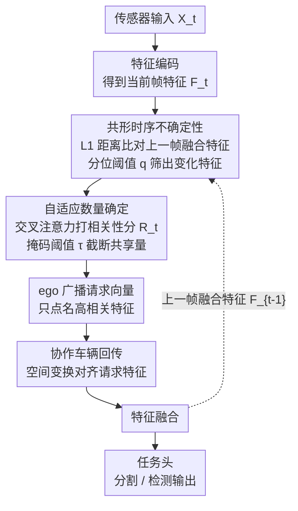

# COOPERTRIM: Adaptive Data Selection for Uncertainty-Aware Cooperative Perception

**会议**: ICLR 2026  
**arXiv**: [2602.13287](https://arxiv.org/abs/2602.13287)  
**代码**: [https://cisl.ucr.edu/CooperTrim](https://cisl.ucr.edu/CooperTrim)  
**领域**: 3D视觉  
**关键词**: 协同感知, 带宽优化, 时序不确定性, 特征选择, 共形预测

## 一句话总结
提出 CooperTrim 自适应特征选择框架，通过共形时序不确定性度量评估特征相关性，并用数据驱动机制动态决定共享数量，在协同语义分割中实现 80.28% 带宽降低且性能可比，首次将选择性共享应用于协同分割任务。

## 研究背景与动机

**领域现状**：协同感知使自动驾驶车辆共享编码表示以增强态势感知。中间融合方案是主流，但传输的特征量仍然压迫无线带宽（通常 ~40 Mbps）。现有带宽优化方法包括压缩（信息有损）、选择（固定阈值）和混合策略。

**现有痛点**：(a) Where2Comm 用固定阈值的置信度图选择特征，忽略时序上下文，带宽仍高（39.6 Mbps）；(b) SwissCheese 用固定阈值做通道/空间选择，缺乏环境自适应；(c) 所有方法逐帧独立决策，重复传输静态信息。

**核心矛盾**：有限带宽与丰富传感器信息的根本矛盾——现有方法只是"每帧少传"，未利用时序连续性来"按需传"。

**本文目标** (a) 利用时序上下文识别真正需要更新的动态特征；(b) 根据环境复杂度自适应调整共享量。

**切入角度**：接收方（ego vehicle）可以用自身的时序记忆判断哪些特征是"新信息"（时序不确定性高），只请求那些有变化的特征。简单场景少传，复杂场景多传。

**核心 idea**：用时序不确定性而非静态置信度来衡量特征相关性，实现环境自适应的按需共享。

## 方法详解

### 整体框架
CooperTrim 想解决的是协同感知里"每帧都把全部特征传一遍"的浪费：静态场景帧间几乎不变，重复传输纯属冗余。它把决策权交给接收方（ego 车辆）——ego 先对自身传感器输入编码得到当前帧特征 $F_t$，与上一帧融合后的特征 $F_{t-1}^{\text{fused}}$ 比对，算出哪些特征相对时序记忆是"新信息"（**共形时序不确定性**），再对这些不确定特征用交叉注意力打相关性分、按掩码阈值截断决定**共享数量**，只把过阈值的特征打包成请求向量广播出去；协作车辆收到请求后做空间变换对齐、只回传被点名的特征子集，ego 融合后送任务头。共享多少不是固定的，而是随场景复杂度自动伸缩；训练侧再用 $\epsilon$-greedy 策略让稀疏特征下的优化更稳。

### 关键设计

**1. 共形时序不确定性：用"帧间变化"代替静态置信度来判断哪些特征值得传**

现有方法（如 Where2Comm）逐帧独立地用置信度图选特征，完全无视上一帧已经传过什么，于是静态背景被一遍遍重复发送。CooperTrim 换了个度量：直接算当前帧与上一融合帧的 L1 距离 $S_t = |F_t - F_{t-1}^{\text{fused}}|$ 作为时序不确定性，变化大的通道才算"不确定、需要更新"。门控阈值不是手调的固定值，而是受共形预测启发的可学习分位阈值 $q$——只保留 $S_t$ 超过 $q$ 的特征。这样静态场景里绝大多数帧间不变的特征会被自然滤掉，省下的带宽全留给真正变化的区域。

**2. 自适应数量确定：让共享量随环境复杂度伸缩，而不是卡一个固定阈值**

固定阈值方法（如 SwissCheese）对简单和复杂场景一视同仁，既可能在路口漏传关键信息，又可能在空旷直道上浪费带宽。CooperTrim 对前一步筛出的不确定特征再施加交叉注意力加权，得到每个特征的相关性分数，然后用可学习掩码阈值 $\tau$ 截断。机制本身带来了想要的自适应：多交叉路口这类复杂场景会产生更高的相关性分数，于是更多特征越过 $\tau$、传得更多；空旷直行场景分数普遍偏低，超阈值的特征寥寥无几、传得极少。"简单少传、复杂多传"由数据驱动地涌现，无需为不同场景预设规则。

**3. $\epsilon$-Greedy 训练策略：避免只用选中的特征训练导致梯度不稳**

如果训练时一直只喂被选中的那部分特征，梯度会因为输入稀疏而噪声偏大、收敛不稳。CooperTrim 借了强化学习里探索-利用的思路：以 $\epsilon$ 概率用全部特征训练（exploration），以 $1-\epsilon$ 概率用选择后的特征训练（exploitation）。论文给出了理论分析，证明这种混合采样能同时压低梯度估计器的偏差和方差，让稀疏特征下的训练更稳。

### 损失函数 / 训练策略

整体目标写成带拉格朗日乘子的约束优化：

$$\theta^* = \arg\min_\theta L(C(\theta)) + \lambda \cdot (P(C(\theta)) - C_{1.6})$$

其中 $L$ 是任务损失、$P(C(\theta))$ 是当前选择策略产生的带宽开销、$C_{1.6}$ 是 1.6 Mbps 的带宽预算，$\lambda$ 在训练中动态调整。直观说就是：在不超过带宽约束的前提下最大化分割/检测性能，乘子 $\lambda$ 负责在"传得太多"时加大惩罚、把开销压回预算内。

## 实验关键数据

### 主实验

协同语义分割（OPV2V 数据集，应用于 CoBEVT/AttFuse/DiscoNet）：

| 配置 | 动态 IoU | 带宽使用率 | 带宽降低 |
|------|---------|----------|---------|
| CoBEVT 原版 | 基线 | 100% (40Mbps) | — |
| CooperTrim-CoBEVT | **可比** | **27.9%** | **72.1%** |
| CooperTrim-AttFuse | 可比 | 21.07% | 78.93% |
| CooperTrim-DiscoNet | 可比 | 10.18% | 89.82% |

vs 其他选择策略：

| 方法 | 动态 IoU | 带宽 (Mbps) |
|------|---------|------------|
| Where2Comm | 8.62 | 39.6 |
| SwissCheese | 35.71 | 10.0 |
| **CooperTrim** | **54.03** | **11.16** |

### 消融实验

| 分析 | 关键发现 |
|------|---------|
| +压缩（32x）| 带宽降至 1.46% 且 IoU 不降 |
| 定位误差鲁棒性 | 在位置噪声下性能优雅退化 |
| 通信延迟鲁棒性 | 对延迟保持稳定 |
| 帧级分析 | 动态场景自动分配更多带宽，静态场景带宽极低 |

### 关键发现
- 平均带宽降低 80.28%（分割）和 72.52%（检测）且性能可比
- CooperTrim 比 Where2Comm IoU 高 45.41%，带宽低 72%
- 与压缩方法正交——叠加后可降至 1.46% 带宽
- 定性分析证实自适应行为：车辆通过交叉路口时带宽使用增加，直行时降低

## 亮点与洞察
- **时序信息的巧妙利用**：将"帧间变化"直接作为不确定性度量——简单但高效，避免了复杂的不确定性建模
- **首个协同分割的选择性感知**：分割需要像素级精度，比检测更挑战带宽——能实现 80%+ 降低非常impressive
- **与压缩的正交性**：选择+压缩叠加可达 1.46% 带宽，说明两种策略互补
- **$\epsilon$-Greedy 训练的理论保证**：对稀疏特征训练的梯度偏差给出了严格的缩放分析

## 局限与展望
- 假设精确位姿——实际中 GPS/定位误差可能影响空间变换
- 仅在 2 个数据集（OPV2V + V2V4Real）上验证，场景多样性有限
- 共形时序不确定性仅用 L1 距离，未考虑语义级别的变化
- 可学习阈值 $q$ 和 $\tau$ 可能在域迁移时需要重新调整
- 未考虑多跳通信和异构传感器配置

## 相关工作与启发
- **vs Where2Comm**: Where2Comm 用静态置信度图+固定阈值，忽略时序。CooperTrim 用时序不确定性+自适应阈值，IoU 高 45%+，带宽低 72%
- **vs SwissCheese**: SwissCheese 用固定阈值做通道/空间选择。CooperTrim 的自适应机制在相近带宽下 IoU 高 18%+
- **vs UniSense**: UniSense 用不确定性驱动选择但逐帧独立，CooperTrim 用时序对比减少冗余传输
- **对边缘AI的启发**：时序差异驱动的按需传输思路可迁移到任何带宽受限的分布式感知场景

## 评分
- 新颖性: ⭐⭐⭐⭐ 时序不确定性+自适应量的组合新颖，但各组件不是全新的
- 实验充分度: ⭐⭐⭐⭐⭐ 多模型/多任务/多策略对比+压缩兼容性+鲁棒性分析
- 写作质量: ⭐⭐⭐⭐ 问题定义清晰，但部分公式可以更简洁
- 价值: ⭐⭐⭐⭐ 对协同感知实际部署有显著推动

<!-- RELATED:START -->

## 相关论文

- [\[ICLR 2026\] Peering into the Unknown: Active View Selection with Neural Uncertainty Maps for 3D Reconstruction](peering_into_the_unknown_active_view_selection_with_neural_uncertainty_maps_for_.md)
- [\[CVPR 2026\] Long-SCOPE: Fully Sparse Long-Range Cooperative 3D Perception](../../CVPR2026/3d_vision/long_scope_fully_sparse_long_range_cooperative_3d_perception.md)
- [\[ICLR 2026\] Uncertainty-Aware 3D Reconstruction for Dynamic Underwater Scenes](uncertainty-aware_3d_reconstruction_for_dynamic_underwater_scenes.md)
- [\[CVPR 2026\] GSV2X: Geometry-Aware Uncertainty Modeling and Orthogonal Fusion for Robust Roadside Perception](../../CVPR2026/3d_vision/gsv2x_geometry-aware_uncertainty_modeling_and_orthogonal_fusion_for_robust_roads.md)
- [\[AAAI 2026\] Domain Generalized Stereo Matching with Uncertainty-guided Data Augmentation](../../AAAI2026/3d_vision/domain_generalized_stereo_matching_with_uncertainty-guided_data_augmentation.md)

<!-- RELATED:END -->
