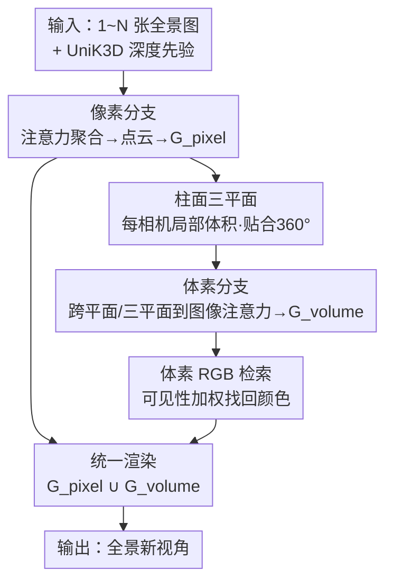

# CylinderSplat: 3D Gaussian Splatting with Cylindrical Triplanes for Panoramic Novel View Synthesis

**会议**: ICLR2026  
**OpenReview**: [https://openreview.net/forum?id=lEzkct87Uy](https://openreview.net/forum?id=lEzkct87Uy)  
**代码**: https://github.com/wangqww/CylinderSplat  
**领域**: 3D视觉  
**关键词**: 全景新视角合成, 前馈式3DGS, 柱面三平面, 双分支架构, 遮挡补全

## 一句话总结
CylinderSplat 用一套"像素分支 + 体素分支"的前馈式 3D 高斯泼溅框架做全景（360°）新视角合成，核心是把传统的笛卡尔三平面换成贴合全景几何与曼哈顿世界假设的**柱面三平面**，用体素分支去补像素分支补不出的遮挡/稀疏区域，在单视角和多视角全景 NVS 上都取得了 SOTA。

## 研究背景与动机
**领域现状**：3D Gaussian Splatting（3DGS）已经成为实时高保真新视角合成的主流，其中前馈式（feed-forward）方法用预训练网络一次前向就预测出所有高斯参数，相比逐场景优化能跨场景泛化、近实时重建。但这套技术几乎都是为针孔相机设计的。随着 360° 相机和 VR 的普及，把前馈式 3DGS 搬到全景图像上成了刚需。

**现有痛点**：现有前馈式全景方法（PanSplat、Splatter360 等）有两个硬伤。其一，它们沿用针孔域的套路——先用深度基础模型出一个深度先验，再用**多视图代价体（cost volume）**做几何细化。代价体计算昂贵、且**视角数固定**（通常只支持两视角），换输入视角数就得重训；更要命的是在大基线、稀疏视角下，代价体无法解决遮挡，重建结果出现空洞和畸变。其二，被遮挡或观测不足的区域根本没有点云覆盖，像素级方法天然补不出来。

**核心矛盾**：标准的体积表示（如笛卡尔三平面）与 360° 场景的几何**天生不匹配**。全景图像是在以相机为中心的球/柱面空间里采样的，用轴对齐的笛卡尔平面去切，会带来畸变和走样；而 OmniScene 那种针孔域的笛卡尔三平面既不支持多帧输入，渲染又过度平滑。

**本文目标**：(1) 找一个真正贴合全景几何的体积表示；(2) 让框架能灵活吃 1 到多个全景输入；(3) 把遮挡/稀疏区域的几何补全做扎实。

**切入角度**：作者从物理学里"选对坐标系能简化对称问题"的直觉出发——既然要在以相机为中心的 360° 空间里优化高斯，柱面坐标系就是天然之选。而且真实世界大多服从**曼哈顿世界假设**（正交平面主导室内外环境），柱面三平面的 $ZR$ 平面对齐竖直墙面、$R\Theta$ 平面对齐水平地板/天花板，比球面三平面更能刻画这些平面结构。

**核心 idea**：用一个**双分支前馈框架**——像素分支用注意力（而非代价体）重建观测良好的区域并支持任意视角数，体素分支用**柱面三平面**为每个相机构建局部体积、专门补遮挡区域，两者输出的高斯拼起来一起渲染。

## 方法详解

### 整体框架
CylinderSplat 输入 1 到多张全景图，输出一组 3D 高斯，渲染出任意新视角。整体是**双分支**结构，用**三阶段课程式训练**串起来：像素分支（pixel branch）先建立观测良好区域的高质量基线；体素分支（volume branch）借柱面三平面补遮挡区域；最后两分支联合微调，把像素分支的细节和体素分支的完整性融成一个场景。

具体而言：像素分支先用 UniK3D 出一个深度先验，再用 ResNet + 6 层注意力聚合多视图上下文，预测精修深度图 $D_{pano}$ 和特征图 $F_{pano}$，把每个像素反投影成带特征的点云 $P_{feat}$，解码出像素高斯 $G_{pixel}$。体素分支为**每个相机位置**初始化一个独立的局部柱面三平面，用落在该体积内的像素分支点云特征去填充三平面，经"跨平面注意力 + 三平面到图像注意力"精修后解码出体素高斯 $G_{volume}$，并用 RGB 检索找回高频颜色。最后 $G_{pixel} \cup G_{volume}$ 统一渲染。

### 关键设计

**1. 像素分支：用注意力替代代价体，吃任意数量输入视角**

针对"代价体昂贵且视角数固定"的痛点，像素分支彻底丢掉多视图代价体。它先借 UniK3D 拿一个初始深度先验，然后用一个 ResNet 加 $L=6$ 层注意力（帧内 self-attention 聚合单帧上下文、帧间 cross-attention 聚合多视图信息）来做几何细化，输出精修深度图 $D_{pano}$ 和特征图 $F_{pano}$。用精修深度把每个像素反投影到 3D，得到带特征的点云 $P_{feat}$，再解码成完整的高斯参数 $G_{pixel}$。这个过程是**相机无关**的：注意力机制对视角数没有结构性约束，所以同一个网络可以从单张一直吃到多张全景，而代价体方法必须固定视角数、换数量就要重训。代价是它只在观测良好的区域质量高——大基线下被遮挡的区域没有点云覆盖，会留下空洞和不均匀，这正是体素分支要补的。

**2. 柱面三平面：贴合 360° 几何与曼哈顿世界的体积表示**

这是全文的灵魂。三平面（triplane）本身是把稠密 3D 特征网格压缩到三个正交 2D 平面的技巧，把存储复杂度从 $O(\Theta \cdot Z \cdot R)$ 降到 $O(\Theta \cdot Z + Z \cdot R + R \cdot \Theta)$，即从 $O(N^3)$ 降到 $O(N^2)$。本文的创新在于**坐标系的选择**：不用前人那种轴对齐的笛卡尔平面，而是在以相机为中心、按 $(R_0, \Theta_0, Z_0)$ 划定的柱面体积里建三平面。直觉来自物理学——在 360° 空间里优化高斯本就具备旋转对称性，柱/球面坐标天然简化这类问题；而真实场景大多服从曼哈顿世界假设，柱面三平面的 $F_{zr}$（$ZR$ 平面）对齐竖直墙面、$F_{r\theta}$（$R\Theta$ 平面）对齐水平地板天花板，能很好地刻画人造环境里的正交平面，球面三平面反而难以建模这些简单平面。每个输入相机各起一个**独立的局部柱面三平面**（多三平面策略），三个正交特征平面先用可学习网格嵌入初始化，再用落入该体积的像素分支点云特征去填充。

**3. 体素分支：三平面注意力精修 + 柱面到笛卡尔的高斯解码**

体素分支负责"补"，它要把初始化好的柱面三平面精修成有用的几何，再解码出高斯。精修分两步注意力。第一步是**跨平面注意力（Cross-Plane Attention）**：让同一柱体里的三个平面互相交换信息。以更新 $F_{\theta z}$ 上的特征 $f_{\theta z}(i,j)$ 为例，沿正交的径向轴采 $N_r$ 个点、去另两个平面取键值做注意力加权：

$$f'_{\theta z}(i, j) = f_{\theta z}(i, j) + \sum_{k=0}^{N_r-1}\left(w^{(ijk)}_{zr}\, f_{zr}(j, k) + w^{(ijk)}_{r\theta}\, f_{r\theta}(k, i)\right)$$

第二步是**三平面到图像注意力（Triplane-to-Image Attention）**：用融合后的三平面特征当 query，去查像素分支的全景特征 $F_{pano}$，把 3D 点 $(\theta_i, z_j, r'_k)$ 投影回全景图取对应像素特征 $f^{(ijk)}_{pano}$ 当键值，注入视觉证据，让 3D 表示对齐 2D 输入。解码时在柱面体积里均匀采 $N_r \times N_\theta \times N_z$ 的稠密网格，每点把三个平面的特征相加查询、过 MLP 预测局部归一化参数 $\{\delta_{local}, S_{local}, R, \alpha\}$。关键的工程细节是：3DGS 的投影仍在笛卡尔系，所以位置要做柱→笛卡尔变换 $(x', y', z') = (-(r+\delta_r)\sin(\theta+\delta_\theta),\ z+\delta_z,\ -(r+\delta_r)\cos(\theta+\delta_\theta))$；而各向异性的缩放 $S_{local}$ 必须用变换的**雅可比矩阵** $J$ 修正才能在笛卡尔空间正确表示高斯形状，$S' = |J| \cdot S_{local}$。这一步保证了在柱面坐标里定义的高斯放回世界坐标后形状不失真。

**4. 体素 RGB 检索：可见性加权找回高频颜色**

三平面特征是高层语义的，缺少照片级真实感所需的高频细节，直接解码颜色会偏糊（OmniScene 的过度平滑就是这毛病）。本文为每个体素高斯设计了 **RGB 检索**机制，直接从源图取色。把高斯中心 $x'$ 投影到全部 $N_v$ 个源视角取像素颜色 $\{C_v\}$；为处理遮挡，给每个视角算一个可见性分数 $s_v = d_g - d_o$（$d_g$ 是高斯到该相机的距离、$d_o$ 是 UniK3D 在该像素的参考深度，分数越小越可见），再用 MLP 对可见性加权聚合的颜色预测最终色：

$$C = \text{MLP}\!\left(\sum_{v=1}^{N_v} w_v \cdot C_v\right),\quad w_v = \text{softmax}(-s_v)$$

这样模型从最可靠、未遮挡的视角学颜色，同时这个可见性权重还隐式地督促高斯几何对齐深度先验。每个三平面高斯的完整参数因此是 $\{x', S', R, C, \alpha\}_{volume}$。

### 损失函数 / 训练策略
全程用同一个复合渲染损失 $L_{render}$（光度 + 感知 + 几何）：

$$L_{render} = \|\hat{I} - I_{gt}\|_1 + 0.05 \cdot \text{LPIPS}(\hat{I}, I_{gt}) + 0.1 \cdot \|\hat{D} - D_{ref}\|_1$$

其中 $D_{ref}$ 是 UniK3D 的参考深度。训练采用**三阶段课程**：① 只用像素分支高斯 $G_{pixel}$ 渲染，先把观测良好区域的基线打好；② 冻结像素分支，只用体素分支高斯 $G_{volume}$，训练柱面三平面做稀疏/遮挡区域的几何补全；③ 解冻两分支用 $G_{pixel} \cup G_{volume}$ 联合微调，把细节和完整性融成一个高保真场景。消融显示这个课程很关键——端到端直接训（Full end-to-end）反而比课程式掉点。

## 实验关键数据

### 主实验
数据集：合成集 Matterport3D / Replica / Residential + 真实集 360Loc，分辨率 $512 \times 1024$。指标：WS-PSNR（对全景畸变鲁棒）、SSIM、LPIPS（图像质量）+ PCC（相对 DepthAnywhere 参考深度的几何精度）。

两视角重建（Matterport3D 2.0m 大基线，最难配置）：

| 方法 | PCC↑ | WS-PSNR↑ | SSIM↑ | LPIPS↓ |
|------|------|----------|-------|--------|
| PanoGRF (NeRF) | — | 20.96 | 0.701 | 0.352 |
| OmniScene* (笛卡尔三平面) | 0.732 | 22.75 | 0.707 | 0.241 |
| Splatter360* | 0.684 | 21.31 | 0.741 | 0.285 |
| PanSplat | 0.716 | 20.56 | 0.777 | 0.265 |
| **Ours** | **0.851** | **23.76** | **0.835** | **0.175** |

单视角重建更能拉开差距——代价体方法（PanSplat/Splatter360）因架构限制在单视角下严重失效，而 CylinderSplat 在 Matterport3D 2.0m 上仍有 PCC 0.821 / WS-PSNR 23.75，远超对手。真实集 360Loc 两视角上 PCC 0.884 / WS-PSNR 28.35 / LPIPS 0.095 也全面领先。

### 消融实验
（Matterport3D 2.0m，两视角输入）

| 配置 | PCC | WS-PSNR | SSIM | LPIPS | 说明 |
|------|-----|---------|------|-------|------|
| Only Pixel Branch | 0.813 | 23.21 | 0.817 | 0.179 | 只像素分支，缺遮挡补全 |
| Only Cylindrical Volume | 0.782 | 22.17 | 0.782 | 0.210 | 只体素分支（柱面） |
| Only Spherical Volume | 0.581 | 19.22 | 0.633 | 0.398 | 换球面三平面，大跌 |
| Only Cartesian Volume | 0.564 | 16.77 | 0.495 | 0.545 | 换笛卡尔三平面，崩 |
| Cylindrical (w/o RGB) | 0.703 | 20.16 | 0.661 | 0.409 | 去 RGB 检索 |
| Full (w/o Multi Triplane) | 0.826 | 23.47 | 0.805 | 0.194 | 单三平面代替多三平面 |
| Full (end to end) | 0.809 | 23.25 | 0.791 | 0.185 | 去课程式训练 |
| **Full** | **0.851** | **23.76** | **0.835** | **0.175** | 完整模型 |

### 关键发现
- **柱面 ≫ 球面 ≫ 笛卡尔**：把柱面三平面换成球面，WS-PSNR 从 22.17 跌到 19.22；换笛卡尔直接崩到 16.77。这是全文最有力的证据——坐标系选择本身就是巨大增益，验证了曼哈顿世界假设的契合度。
- **RGB 检索贡献显著**：去掉后 WS-PSNR 掉 2 个点（22.17→20.16）、LPIPS 几乎翻倍，证明高频颜色找回对真实感至关重要。
- **多三平面 / 课程式都有正贡献**：单三平面、端到端训练都比完整模型差，说明"每相机一个局部三平面"和"分阶段训练"都不是花架子。
- **效率优势明显**：CylinderSplat 仅 13.6M 参数、单次前向 0.29s，比 PanSplat（20.5M/0.32s）、Splatter360（38.7M/0.54s）、OmniScene（76.9M/0.48s）都更轻更快。多视角可平滑扩展（2→3→4 视角，PCC 0.884→0.896，显存 7→20GB）。

## 亮点与洞察
- **"换坐标系"这个 idea 又简单又强**：不动网络主干，只把三平面从笛卡尔换成柱面，就靠几何先验吃到大幅提升。这种"用对的表示替代复杂的细化模块"的思路非常优雅，也可迁移到任何带强对称性/结构先验的 3D 任务。
- **雅可比修正缩放的细节很扎实**：很多人会忽略柱→笛卡尔变换会改变各向异性高斯的形状，本文用 $S' = |J| \cdot S_{local}$ 显式修正，是值得复用的工程 trick。
- **双分支分工明确**：像素分支管"看得见的"、体素分支管"看不见的"，用注意力替代代价体顺手解决了视角数固定的老问题，最让人"啊哈"的是这两件事是一套架构同时拿下的。
- **可见性加权 RGB 检索一举两得**：既找回高频颜色，又作为隐式监督把几何往深度先验上拉。

## 局限与展望
- **强依赖深度基础模型**：初始深度先验和 PCC 参考深度都来自 UniK3D / DepthAnywhere，先验质量差时（如反光、无纹理区）几何补全可能受限，论文未充分讨论这种失败模式。
- **曼哈顿世界假设的边界**：柱面三平面的优势建立在"正交平面主导"上；对大量曲面/自然场景（森林、洞穴），柱面对齐红利会衰减，球面甚至自适应坐标系可能更合适。
- **显存随视角线性增长**：每相机一个三平面带来多三平面开销，4 视角已需 20GB，更多视角的扩展性存疑。
- **改进方向**：可探索按场景内容自适应选择/混合坐标系，或把三平面分辨率做成各向异性（地板天花板用更密的 $R\Theta$ 网格）。

## 相关工作与启发
- **vs PanSplat / Splatter360**：它们是前馈式全景 3DGS 的直接对手，靠深度先验 + 多视图代价体细化，但代价体昂贵、视角数固定、遮挡处出空洞。本文用注意力替代代价体支持任意视角数，用柱面三平面显式补遮挡，在单/多视角和几何精度上都更好。
- **vs OmniScene**：同样用三平面做前馈重建，但 OmniScene 是针孔域的**单个中心笛卡尔三平面**、独立处理各视角，搬到全景上有畸变、不支持多帧、渲染偏糊。本文用**多个每相机柱面三平面** + RGB 检索，几何贴合度和多视图融合都更强。
- **vs PanoGRF（NeRF）**：代表了全景 NVS 从慢速 NeRF 向实时 3DGS 的迁移；本文是这条线上前馈 + 直接全景表示的更优解。

## 评分
- 新颖性: ⭐⭐⭐⭐ 柱面三平面是个简洁但有效的几何先验创新，双分支与代价体替代也很合理，但各组件多为已有技术的巧妙组合
- 实验充分度: ⭐⭐⭐⭐⭐ 四个数据集、单/多视角、坐标系消融、效率对比一应俱全，坐标系消融尤其有说服力
- 写作质量: ⭐⭐⭐⭐ 动机清晰、图文配合好，部分注意力公式偏简略（标注以原文为准）
- 价值: ⭐⭐⭐⭐ 轻量高效、即插即用的全景前馈 3DGS，对 VR/全景重建有实用价值

<!-- RELATED:START -->

## 相关论文

- [\[CVPR 2026\] Physically Inspired Gaussian Splatting for HDR Novel View Synthesis](../../CVPR2026/3d_vision/physically_inspired_gaussian_splatting_for_hdr_novel_view_synthesis.md)
- [\[ICLR 2026\] Dynamic Novel View Synthesis in High Dynamic Range](dynamic_novel_view_synthesis_in_high_dynamic_range.md)
- [\[ICLR 2026\] EA3D: Event-Augmented 3D Diffusion for Generalizable Novel View Synthesis](ea3d_event-augmented_3d_diffusion_for_generalizable_novel_view_synthesis.md)
- [\[CVPR 2026\] Splatent: Splatting Diffusion Latents for Novel View Synthesis](../../CVPR2026/3d_vision/splatent_splatting_diffusion_latents_for_novel_view_synthesis.md)
- [\[ICLR 2026\] True Self-Supervised Novel View Synthesis is Transferable](true_self-supervised_novel_view_synthesis_is_transferable.md)

<!-- RELATED:END -->
