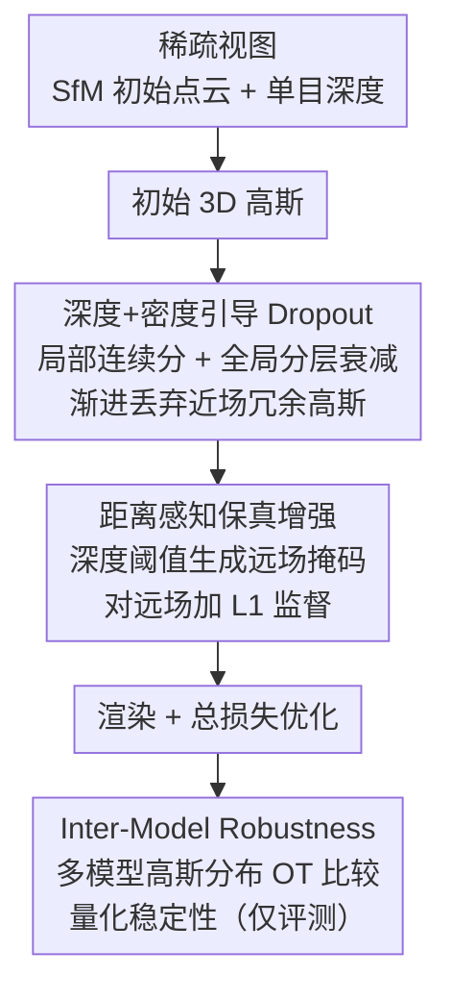

# D²GS: Depth-and-Density Guided Gaussian Splatting for Stable and Accurate Sparse-View Reconstruction

**会议**: ICLR2026  
**OpenReview**: [https://openreview.net/forum?id=7yvz93kBw9](https://openreview.net/forum?id=7yvz93kBw9)  
**代码**: [项目页](https://insta360-research-team.github.io/DDGS-website/)  
**领域**: 3D视觉  
**关键词**: 稀疏视图重建, 3D高斯泼溅, 深度先验, 自适应 Dropout, 鲁棒性度量

## 一句话总结
D²GS 针对稀疏视图下 3DGS 的「近处过拟合、远处欠拟合」两大失效模式，用「深度+密度引导的 Dropout」抑制近场冗余高斯、用「距离感知保真增强」补强远场监督，并提出基于最优传输的 Inter-Model Robustness 指标量化重建稳定性，在 LLFF / MipNeRF360 上同时刷新画质与鲁棒性。

## 研究背景与动机
**领域现状**：3D Gaussian Splatting（3DGS）用显式高斯基元 + 可微泼溅渲染，在质量与速度之间取得了很好的平衡，已成为新视角合成（NVS）的主流表示。但它的好表现建立在「密集多视角输入」的前提上，而现实中往往只能拿到三五张图。

**现有痛点**：稀疏视图下 3DGS 性能急剧下降且训练不稳定。已有工作（如 DropGaussian）发现稀疏训练会让模型过拟合到一小撮高斯上，于是采用「均匀 Dropout」——训练时随机、无差别地丢弃高斯来缓解过度重建。但作者观察到，均匀丢弃会**误伤本来就拟合得好或欠拟合的区域**，反而拉低关键区域的画质。

**核心矛盾**：作者把失效归结为一个**空间不均衡**问题。把密集视图（55 张）和稀疏视图（3 张）下训出的高斯分布拿来对比，可以清楚看到两类相反的病灶：① **近场过拟合**——纹理丰富、靠近相机的区域堆出过多高斯（稀疏下 11,450 个 vs 密集下 6,112 个），产生混叠与伪影，且近场的局部过度重建会全局传播、污染整张渲染图；② **远场欠拟合**——远处区域因可见性低、又常被近场密集高斯遮挡，高斯严重不足（稀疏下 3,082 个 vs 密集下 5,224 个），细节模糊、结构断裂。**均匀 Dropout 之所以失败，正是因为它对这两种相反的病灶一视同仁。**

**本文目标**：① 让正则化「认得出」哪些高斯该丢、哪些该留；② 主动补强欠拟合的远场；③ 给稀疏 3DGS 一个能量化「重建稳不稳」的指标。

**切入角度**：既然失效模式是沿**深度**和**密度**两个轴空间分布的，那正则化也应该沿这两个轴自适应，而不是均匀随机。

**核心 idea**：用「深度+密度引导的自适应 Dropout」替代「均匀 Dropout」来精准抑制近场过拟合，再用「距离感知的额外监督」补强远场欠拟合，双管齐下治理空间不均衡。

## 方法详解

### 整体框架
D²GS 输入稀疏视图，先用 SfM 得到初始点云与相机位姿、用单目深度估计器为每张图生成深度图，初始化高斯。训练阶段插入两个互补模块：**DD-Drop**（Depth-and-Density Guided Dropout）按深度与密度自适应丢弃近场冗余高斯，治「过拟合」；**DAFE**（Distance-Aware Fidelity Enhancement）用深度阈值生成远场掩码、对远场施加专门的损失，治「欠拟合」。两者一个做「减法」（丢冗余）、一个做「加法」（补监督），共同把高斯的空间分布拉回均衡。此外，作者还提出 **IMR** 指标，对多个独立训练的模型做高斯分布层面的一致性比较，量化鲁棒性（它是评测工具，不参与训练）。

### 关键设计

**1. 深度与密度引导的 Dropout（DD-Drop）：让丢弃「认得出」近场冗余**

针对近场过拟合，作者不再均匀随机丢，而是给每个高斯算一个「该不该丢」的分数，并从**局部连续**和**全局离散**两个视角联合约束。局部机制对每个高斯 $i$ 取它到相机的欧氏距离 $d_i$（深度）和由 k 近邻估计的局部密度 $\rho_i$，各自做 min–max 归一化得到深度分 $\tilde d_i$、密度分 $\tilde\rho_i$，加权合成 dropout 分数：

$$S_i = \omega_{\text{depth}}\,\tilde d_i + \omega_{\text{density}}\,\tilde\rho_i,\quad \omega_{\text{depth}}+\omega_{\text{density}}=1.$$

直觉是「越近、越密」的高斯越可能在过拟合，分数越高、越该被丢。但局部分数刻画不了整个场景的全局模式，于是再叠一层全局机制：按深度分布的两个三分位 $D_{\text{near}}, D_{\text{middle}}$ 把点云切成近/中/远三层，对不同层施加不同衰减因子（近层不衰减，$0<\lambda_{\text{far}}<\lambda_{\text{middle}}<1$，实测取 $\lambda_{\text{far}}=0.3,\ \lambda_{\text{middle}}=0.7$），最终的逐高斯丢弃概率为：

$$P_i = \begin{cases} S_i, & d_i \le D_{\text{near}},\\ \lambda_{\text{middle}}\,S_i, & D_{\text{near}} < d_i \le D_{\text{middle}},\\ \lambda_{\text{far}}\,S_i, & d_i > D_{\text{middle}}.\end{cases}$$

这样近场高分高斯被大概率丢、远场即便分数偏高也被衰减保护——精准地只压近场过拟合，而不误伤远场。此外考虑到训练中高斯数量会随优化不断增长，作者用一个随训练步 $t$ 线性上升的全局丢弃率 $r(t) = r_{\min} + (r_{\max}-r_{\min})\cdot \min(t,T)/T$（取 $r_{\min}=0.05, r_{\max}=0.3$）：早期轻丢以保住基础几何，后期加大力度强化正则。这套「局部连续 + 全局离散 + 渐进式」的组合，正是均匀 Dropout 所缺的空间与时间自适应。

**2. 距离感知保真增强（DAFE）：给欠拟合的远场「加监督」**

DD-Drop 解决了「丢得太多/太均匀」，但远场欠拟合是「监督太弱」，需要反向补强。DAFE 先用单目深度估计模型为每张输入图生成深度图，再用深度阈值切出一个二值远场掩码——只保留最远的一小部分像素：

$$M_{\text{dis}}(x,y) = \begin{cases} 1, & D(x,y) > \tau D_{\max},\\ 0, & \text{otherwise},\end{cases}$$

其中 $D_{\max}$ 是最大深度、$\tau$ 是阈值（实测取 top 5% 最远像素效果最好）。然后把这个掩码同时作用在渲染图 $\hat I$ 和真值图 $I$ 上，只在远场区域计算一个专门的 L1 监督：

$$L_{\text{DAFE}} = \frac{1}{\sum M_{\text{dis}}}\sum_{x,y} M_{\text{dis}}(x,y)\cdot \big|\hat I(x,y) - I(x,y)\big|_1.$$

由于损失对远场误差「放大」，优化器被迫在远处分配更多注意力，从而**鼓励在远场长出更密的高斯**、补上原本缺失的几何与纹理细节。总训练目标在 3DGS 原有 L1 + D-SSIM 颜色损失上加这一项：

$$L_{\text{total}} = L_1(\hat I, I) + \lambda_{\text{SSIM}} L_{\text{D-SSIM}}(\hat I, I) + \lambda_{\text{DAFE}} L_{\text{DAFE}}(\hat I, I).$$

它和 DD-Drop 是一对镜像操作：一个在近场做减法、一个在远场做加法。

**3. Inter-Model Robustness（IMR）：用最优传输量化「重建稳不稳」**

作者发现同一算法、同一配置重复训练多次，PSNR 在不同轮次间剧烈波动（实测在 13~18 之间跳），说明稀疏 3DGS 对初始化和训练噪声极不鲁棒，而传统的 PSNR/SSIM 是图像空间指标，刻画不了「3D 高斯分布本身稳不稳」。IMR 直接在高斯分布层面比较 $N$ 个独立训练模型。每个模型被抽象成高斯混合分布 $\mathcal G_i = \sum_j w_{i,j}\,\mathcal N(m_{i,j}, \Sigma_{i,j})$，权重按渲染不透明度归一 $w_{i,j} = \alpha_{i,j}/\sum_k \alpha_{i,k}$（用不透明度当「该高斯在最终渲染中的重要性」代理）。

两个动辄上万基元的高斯混合无法逐一配对，作者用 2-Wasserstein 距离 + 最优传输（OT）做软匹配。单对高斯的 Wasserstein 距离有 Bures 闭式解 $W_2^2 = \|m_1-m_2\|^2 + \mathrm{tr}(\Sigma_1+\Sigma_2 - 2(\Sigma_2^{1/2}\Sigma_1\Sigma_2^{1/2})^{1/2})$，但矩阵平方根昂贵且数值不稳，于是用一阶 Taylor 展开近似形状项得到 $\tilde W_2^2 = \|m_1-m_2\|^2 + \tfrac14 \mathrm{tr}\big((\Sigma_1-\Sigma_2)\Sigma_2^{-1}(\Sigma_1-\Sigma_2)\big)$（⚠️ 推导以原文附录 A 为准）。两模型间的混合 Wasserstein 距离写成 OT 问题 $\mathrm{MW}_2^2(\mathcal G_1,\mathcal G_2) = \min_{\gamma\ge0}\sum_{i,j}\gamma_{ij}\tilde W_2^2$（边际约束为各自的 $w$），并加熵正则用 Sinkhorn 求解；为可计算性还做深度分层重要性采样、约取 1 万个高斯（远场更易不稳，过采样）。最后定义

$$\mathrm{IMR} = \ln\!\left(\frac{\sum_{i<j} S_{ij}^2}{\sum_{i<j} S_{ij}}\right),$$

其中 $S_{ij}$ 是模型对间距离，平方加权用来放大那些「差异特别大」的不一致模型对——IMR 越低，说明独立训练得到的高斯分布越一致、越鲁棒。

### 损失函数 / 训练策略
颜色损失沿用 3DGS 的 L1 + D-SSIM，额外加 DAFE 的远场 L1，三项加权（见上式）。实现基于 DropGaussian，每个数据集训练 10k 迭代，单张 H20 GPU。关键超参：$\lambda_{\text{far}}=0.3,\lambda_{\text{middle}}=0.7$、$r_{\min}=0.05,r_{\max}=0.3$、$\omega_{\text{depth}}=\omega_{\text{density}}=0.5$、$\tau$ 取 top 5%、$\lambda_{\text{DAFE}}=1.0$。

## 实验关键数据

### 主实验
LLFF（3-view）与 MipNeRF360（3-view），对比 NeRF 系与 3DGS 系方法，D²GS 全面领先。

| 数据集 | 指标 | D²GS（本文） | DropGaussian | CoR-GS | 提升 |
|--------|------|------|----------|------|------|
| LLFF 1/8 | PSNR↑ | **21.35** | 20.76 | 20.45 | +0.59 / +0.90 dB |
| LLFF 1/8 | SSIM↑ | **0.746** | 0.713 | 0.712 | — |
| LLFF 1/8 | LPIPS↓ | **0.179** | 0.200 | 0.196 | — |
| LLFF 1/4 | PSNR↑ | **20.56** | 20.01 | 19.96 | +0.55 dB |
| MipNeRF360 | PSNR↑ | **20.09** | 19.74 | 19.52 | +0.35 / +0.57 dB |

鲁棒性指标 IMR（10 个独立训练模型上测，越低越稳）：

| 方法 | LLFF 3-view IMR↓ | LLFF 6-view IMR↓ |
|------|------|------|
| 3DGS | 3.162 | 3.234 |
| CoR-GS | 3.136 | 3.270 |
| DropGaussian | 3.205 | 3.143 |
| **D²GS** | **3.039** | **3.109** |

### 消融实验
组件逐步叠加（LLFF，PSNR/LPIPS/IMR）：

| 配置 | PSNR↑ | LPIPS↓ | IMR↓ | 说明 |
|------|---------|------|------|------|
| Baseline | 19.22 | 0.229 | 3.162 | 无任何组件 |
| + 密度分 | 21.02 | 0.191 | 3.119 | 密度引导丢弃 |
| + 深度分（替密度） | 20.92 | 0.200 | 3.155 | 仅深度分 |
| 密度+深度分 | 21.10 | 0.187 | 3.111 | 局部分数 |
| + 深度分层 | 21.17 | 0.181 | 3.088 | 全局离散机制 |
| Full（+ DAFE） | **21.35** | **0.179** | **3.039** | 完整模型 |

### 关键发现
- **从 baseline 加上密度分一步就涨 1.8 dB PSNR**（19.22→21.02），说明「按密度判断该丢谁」是治近场过拟合的最大功臣；深度分层与 DAFE 各再贡献稳定增益，且每步 IMR 同步下降，证明画质与鲁棒性同向改善。
- **深度/密度权重平衡最好**：$\omega_{\text{depth}}=\omega_{\text{density}}=0.5$ 时 PSNR 最高（21.16），偏向任一侧都掉点——两类信息互补、缺一不可。
- **远场掩码越「狠」越好**：只取最远 top 5% 像素加监督效果最佳，说明欠拟合集中在极远处，监督要打在刀刃上；$\lambda_{\text{DAFE}}=1.0$ 为画质最优折中。
- 早期轻丢（$r_{\min}=0.05$）保住基础几何、后期加大丢弃强化正则的渐进策略，比固定丢弃率更优。

## 亮点与洞察
- **把「失效模式诊断」做成方法设计的出发点**：先用密集 vs 稀疏的高斯计数把「近场过拟合 / 远场欠拟合」量化坐实，再让 DD-Drop 和 DAFE 一减一加对症下药——方法的每个模块都能追溯到一个具体病灶，而非堆砌 trick。
- **自适应 Dropout 的「局部连续 + 全局离散」拆法很巧**：连续分数抓细粒度局部变化、离散分层注入全局深度先验且不强依赖切分，两者叠加比单一视角更稳，是可迁移到其他「需要空间感知正则化」任务的思路。
- **IMR 填了一个评测空白**：稀疏 3DGS 一直被「同配置多次训练结果飘」困扰，但社区只看单次 PSNR。把模型抽象成高斯混合、用 OT/Sinkhorn 在 3D 分布层面比一致性，给「重建稳不稳」一个可量化的数字，这套度量思路对任何随机性强的 3D 表示都有借鉴价值。

## 局限与展望
- **依赖单目深度估计器的质量**：DD-Drop 的分层和 DAFE 的远场掩码都建立在深度图上，深度估计在无纹理/反光区域出错会直接误导丢弃与监督；论文也做了 MiDaS vs DPT 的对比（DPT 略好），但未深究深度误差的传播。
- **超参较多且偏经验**：$\lambda_{\text{far}}/\lambda_{\text{middle}}$、$r_{\min}/r_{\max}$、$\tau$、$\lambda_{\text{DAFE}}$ 多为实测设定，跨数据集/场景的自适应性未充分验证。
- **IMR 计算成本**：需训练 10 个独立模型并做 OT，评测开销不小，作者靠重要性采样降到约 1 万高斯近似，规模化评测的精度-成本权衡值得进一步分析。
- **评测集中在前向/有界场景**（LLFF、MipNeRF360），对大尺度、360° 无界或动态场景的稀疏重建尚未验证。

## 相关工作与启发
- **vs DropGaussian**：同样用 Dropout 抑制稀疏过拟合，但 DropGaussian 是**均匀随机**丢弃，会误伤好/欠拟合区域；D²GS 改为**深度+密度自适应**丢弃，只压近场冗余，并额外用 DAFE 补远场——既治过拟合又治欠拟合，PSNR/IMR 双双领先。
- **vs CoR-GS / LoopSparseGS / FSGS**：这些方法靠伪视图生成、额外先验或协同正则缓解稀疏问题；D²GS 不引入额外视图，而是直接从「高斯空间分布不均衡」入手做正则化与监督重分配，且首次给出分布层面的鲁棒性指标。
- **vs 前馈式（PixelSplat / MVSplat / HiSplat）**：前馈方法从图像直接回归高斯参数；D²GS 属于逐场景优化路线，互为补充——其 DD-Drop/DAFE 的「空间自适应正则化」思想也可能反哺前馈模型的训练。

## 评分
- 新颖性: ⭐⭐⭐⭐ 失效模式诊断 + 双向治理 + OT 鲁棒性指标，思路成体系且 IMR 有独立价值。
- 实验充分度: ⭐⭐⭐⭐ 两数据集 + 多基线 + 细致超参消融 + 10 模型 IMR，较扎实；场景多样性偏窄。
- 写作质量: ⭐⭐⭐⭐ 动机由观察驱动、公式清晰、模块对应病灶讲得透。
- 价值: ⭐⭐⭐⭐ 稀疏 3DGS 实用增量明显，IMR 指标对社区评测有外溢价值。

<!-- RELATED:START -->

## 相关论文

- [\[CVPR 2026\] Confidence-Guided Multi-Scale Aggregation for Sparse-View High-Resolution 3D Gaussian Splatting](../../CVPR2026/3d_vision/confidence-guided_multi-scale_aggregation_for_sparse-view_high-resolution_3d_gau.md)
- [\[CVPR 2026\] SV-GS: Sparse View 4D Reconstruction with Skeleton-Driven Gaussian Splatting](../../CVPR2026/3d_vision/sv-gs_sparse_view_4d_reconstruction_with_skeleton-driven_gaussian_splatting.md)
- [\[ICLR 2026\] CLoD-GS: Continuous Level-of-Detail via 3D Gaussian Splatting](clod-gs_continuous_level-of-detail_via_3d_gaussian_splatting.md)
- [\[CVPR 2026\] FSFSplatter: Geometrically Accurate Reconstruction with Free Sparse-view Images within 2 minutes](../../CVPR2026/3d_vision/fsfsplatter_geometrically_accurate_reconstruction_with_free_sparse-view_images_w.md)
- [\[CVPR 2026\] Exact-GS: Mathematically Rigorous and Accurate 3D Gaussian Splatting for 3D X-ray Reconstruction](../../CVPR2026/3d_vision/exact-gs_mathematically_rigorous_and_accurate_3d_gaussian_splatting_for_3d_x-ray.md)

<!-- RELATED:END -->
