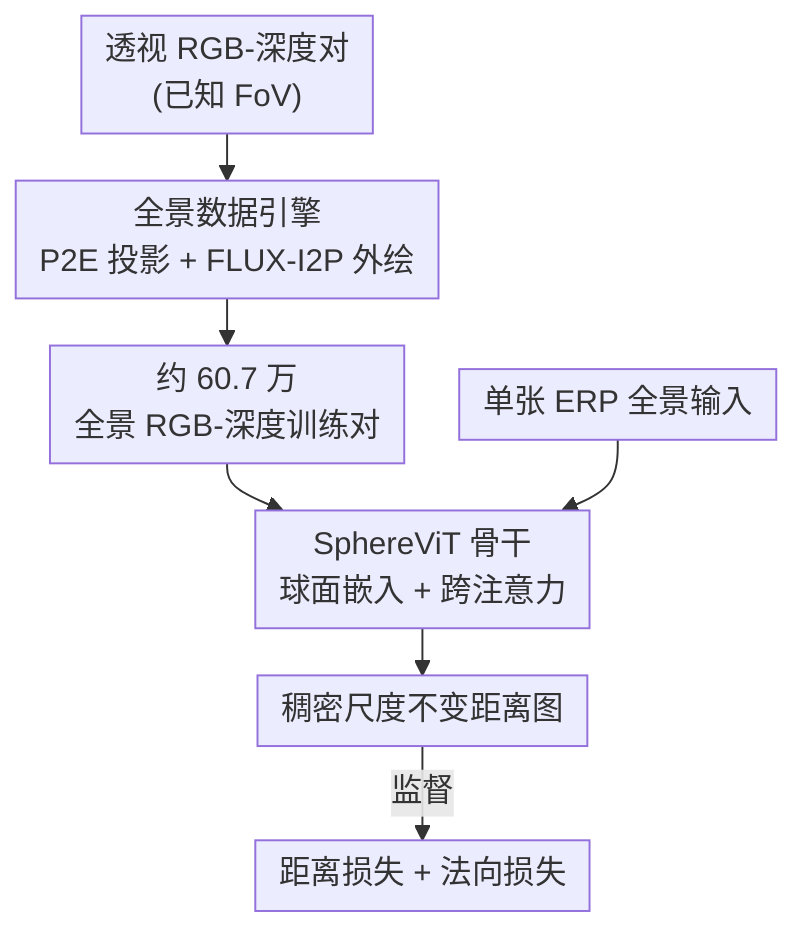

# DA$^{2}$: Depth Anything in Any Direction

**会议**: ICLR2026  
**OpenReview**: [https://openreview.net/forum?id=323ximYcsk](https://openreview.net/forum?id=323ximYcsk)  
**代码**: https://depth-any-in-any-dir.github.io/ （有，项目页含代码与数据）  
**领域**: 3D视觉 / 全景深度估计  
**关键词**: 全景深度估计, 零样本泛化, 球面畸变, 数据引擎, 跨注意力

## 一句话总结
DA2 用一个「透视→全景」数据引擎把约 54 万张透视 RGB-深度对转成全景训练数据（总量提到约 60.7 万），再配上显式注入球面坐标的 SphereViT 骨干，做到端到端、单张 360° 全景直接预测尺度不变距离，在零样本设定下 AbsRel 比最强基线平均提升约 38%，甚至反超此前的 in-domain 方法。

## 研究背景与动机
**领域现状**：全景图（360°×180° 全视场）比透视图能一次性看到整个场景，对 AR/VR、3D 场景生成、机器人仿真等需要完整空间感知的应用极有价值，因此「单张全景估计每个像素到球心的距离」这件事越来越受关注。深度模型主流都已经走到大规模数据 + ViT 骨干（DepthAnything、UniDepth、MoGe 这些透视模型靠堆数据拿到很强结果）。

**现有痛点**：全景方向卡在两个地方。其一是**数据稀缺**——拍摄或渲染全景比透视难得多，可用的标注全景深度数据又少又缺乏多样性（PanDA 约 2 万标注、UniK3D 约 2.9 万），导致早期方法几乎都只能 in-domain 训练和测试，零样本泛化极差。其二是**球面畸变**——全景普遍用等距柱状投影（ERP）把球面摊成平面，但 3D 球面无法无损投到 2D 平面，两极附近会被严重拉伸；为了缓解这一点，很多方法把全景切成 cubemap（6 个透视面）再融合，或者引入球面网格、球谐等额外模块，既复杂又低效。

**核心矛盾**：想要强泛化就得喂大规模多样数据，但原生全景数据天花板太低；想要消畸变又往往要把端到端的单图推理拆成「多视角切分 + 融合」，牺牲了效率。两个诉求都被「全景本身的稀缺与畸变」这一根本属性拖住。

**本文目标**：做一个**准确、零样本可泛化、完全端到端**的全景深度估计器，拆成两个子问题——(1) 怎么把丰富的透视深度数据「变成」可用的全景训练数据；(2) 怎么在不加额外融合模块的前提下，让单一骨干网络感知并补偿球面畸变。

**切入角度**：作者注意到透视深度数据极其丰富，于是反过来想「能不能把透视样本投到球面再补全成全景」；同时观察到所有全景都共享同一个固定的 360°×180° 视场，意味着每个像素的球面角度场是**固定可复用**的，可以当成一种几何先验显式喂给网络，而不必让网络从畸变图像里硬学。

**核心 idea**：用「数据引擎造全景 + SphereViT 显式注入球面坐标」两步，把透视世界的数据红利和端到端的简洁性同时搬到全景深度估计上。

## 方法详解

### 整体框架
DA2 由两块组成：一块是**离线的全景数据引擎**，负责把海量透视 RGB-深度对转成全景 RGB-深度对，解决「没数据」；一块是**在线的 SphereViT 模型 + 训练损失**，输入单张 ERP 全景 $I\in\mathbb{R}^{H\times W\times 3}$，端到端输出稠密的尺度不变距离图 $\hat{D}\in\mathbb{R}^{H\times W}$，解决「有畸变」。数据引擎先用透视到等距柱状（P2E）投影把透视图映到球面得到「残缺全景」，再用 LoRA 微调的 FLUX-I2P 把它外绘补全成「完整全景」；而对应的 GT 深度只做 P2E 投影、不外绘（外绘深度的绝对精度不可靠）。训练时，模型主干 SphereViT 从 ERP 布局算出每个像素的球面角度场，展开成固定的球面嵌入，让 ViT 图像特征通过跨注意力去「关注」这个嵌入，得到畸变感知表示，最后回归距离，并辅以法向监督。

### 关键设计

**1. 全景数据引擎：把丰富的透视数据「投+绘」成全景，破解数据稀缺**

这一步直接针对「原生全景数据又少又缺乏多样性」的痛点。给定一张已知水平/垂直视场（XFoV、YFoV）的透视图，先由焦距 $f_x=\frac{W_{per}}{2\tan(\text{FoV}_x/2)}$、$f_y=\frac{H_{per}}{2\tan(\text{FoV}_y/2)}$ 把每个像素反算出相机坐标系下的单位方向向量 $\hat{d}$，再取它的方位角 $\phi=\text{atan2}(\hat{d}_x,\hat{d}_z)+\phi_c$ 和极角 $\theta=\arccos(\hat{d}_y)+\theta_c$（$\phi_c,\theta_c$ 是该透视图光心的球面坐标偏移），最后映到 ERP 平面位置 $u=\frac{\phi}{2\pi}W_{pano}$、$v=\frac{\theta}{\pi}H_{pano}$，完成 P2E 投影。但透视图视场通常只有 70°–90°，投到球面后只能覆盖一小块、相当于「残缺全景」，模型既看不到完整全景上下文、也学不到两极的强畸变。于是第二步用一个 LoRA 微调的 FLUX 模型 FLUX-I2P 做**全景外绘**，把残缺全景补成完整全景；为缓解早期外绘方法在两极和左右接缝处的不一致，FLUX-I2P 在送入 DiT 前把图像特征和球面坐标 $(\phi,\theta)$ 沿通道拼接，增强空间连贯性。关键的取舍是：**GT 深度只做 P2E 投影、绝不外绘**，因为外绘出来的深度绝对精度无法保证，宁可让监督只覆盖球面上真实存在的那部分。整套引擎造出约 54.3 万全景样本，把总量从约 6.3 万拉到约 60.7 万（约 10 倍），消融显示外绘比单纯堆未外绘的透视数据多带来约 3 倍的 AbsRel 增益。

**2. SphereViT 的球面嵌入：把固定可复用的球面几何当先验显式喂进特征**

针对「2D 位置编码无法表达球面非均匀畸变」的痛点。标准 ViT 的位置编码来自像素 $(x,y)$，但全景像素 $(u,v)$ 对应的是经纬 $(\phi,\theta)$，高纬被拉伸、低纬被压缩，普通 PE 表达不了这种各向异性。作者从 ERP 布局先算每个像素角度 $\phi=2\pi\frac{u}{W}$、$\theta=\pi\frac{v}{H}$，得到两通道角度场 $A\in\mathbb{R}^{H\times W\times 2}$，resize/flatten 成 $A'\in\mathbb{R}^{(H'\times W')\times 2}$。然后仿照 ViT 的正余弦编码，把 2 通道扩张到图像特征维 $D$：定义一组系数 $\{2^{d_n}\}_{n=1}^{D'}$（$D'=D/4$，$d_n=(n-1)\frac{\log_2 H'}{D'}$），把每个单元 $[\phi_i,\theta_j]$ 与系数外积后再逐元素取 $\sin/\cos$，flatten 成维度 $2\times D'\times 2=D$ 的单元，拼成球面嵌入 $E_{sphere}\in\mathbb{R}^{(H'\times W')\times D}$。**关键洞察是所有全景共享同一固定全视场，所以 $E_{sphere}$ 是固定、可复用、不需要再被网络细化的**——这把球面几何从「要从畸变图里学」变成「直接当已知先验注入」。

**3. 跨注意力注入：图像特征单向「关注」球面嵌入，而非两者相加**

承接设计 2 的洞察：既然球面嵌入固定且不需更新，那就没必要像标准 ViT 那样把位置编码加到特征上再做自注意力（$Z+E_{sphere}$），因为相加会让二者在自注意力里互相影响、也等于要求嵌入被进一步精炼。SphereViT 改用**跨注意力**，让图像特征 $Z$ 作 query、球面嵌入 $E_{sphere}$ 同时作 key 和 value：

$$\text{CrossAttn}(Z,E_{sphere})=\text{SoftMax}\!\left(\frac{ZW_Q(E_{sphere}W_K)^\top}{\sqrt{D_k}}\right)(E_{sphere}W_V)$$

这样信息单向流动——图像特征去「读取」全景的球面结构，而嵌入本身不被改写，得到畸变感知表示。消融里去掉 $E_{sphere}$ 会出现明显的弯曲墙面等几何畸变，说明这个显式几何注入确实在补偿球面失真，而且全程无需 cubemap 切分或额外融合模块，保持了端到端与高效率。

### 损失函数 / 训练策略
模型端到端回归尺度不变距离，损失计算前先对预测做中值对齐 $\hat{D}_{med}=\hat{D}\times\frac{\text{Median}(D^\star)}{\text{Median}(\hat{D})}$。监督由两项 L1 组成：**距离损失** $\mathcal{L}_{dis}=\frac{1}{|\Omega|}\sum_{p\in\Omega}|\hat{D}^{med}_p-D^\star_p|$ 保证全局距离准确；**法向损失** $\mathcal{L}_{nor}=\frac{1}{|\Omega|}\sum_{p\in\Omega}|\hat{N}_p-N^\star_p|$ 让局部表面平滑锐利，其中法向由距离-法向算子 $\text{D2N}$ 从距离图导出（无 GT 法向时同样对 GT 距离求）。作者特意用 L1 而非常见的角度差 $1-\langle\hat{N}_p,N_p\rangle$，因为后者可能导致梯度坍缩、训练不稳。总损失为加权和 $\mathcal{L}=\lambda_d\mathcal{L}_{dis}+\lambda_n\mathcal{L}_{nor}$。训练分辨率 1024×512，用 7 个数据集（6 个透视 + 1 个原生全景 Structured3D）。

## 实验关键数据

### 主实验
在 Stanford2D3D、Matterport3D、PanoSUNCG 三个公认全景基准上，对比零样本/in-domain、全景/透视各路方法（默认中值对齐，尺度不变）：

| 设定 | 方法 | Stanford2D3D AbsRel↓ | Matterport3D AbsRel↓ | PanoSUNCG AbsRel↓ | 零样本 Rank↓ |
|------|------|------|------|------|------|
| 零样本(end2end) | UniK3D | 11.31 | 9.66 | 11.46 | 4.58 |
| 零样本(fusion) | MoGev2 | 14.69 | 10.34 | 8.26 | 5.58 |
| 零样本(end2end) | **DA2 (本文)** | **7.23** | **6.67** | **5.96** | **1.00** |
| in-domain(最佳) | HUSH | 7.82 | 8.38 | – | – |

DA2 在零样本三个基准上全部第一（Rank 1.00），相比次优零样本方法 AbsRel 平均降约 38%、RMSE 平均降约 22%，平均 $\delta_1=95.73\%$、$\delta_2=98.51\%$；作为零样本模型甚至反超了 HUSH 等 in-domain 方法。效率上 DA2 单图约 0.1s，与基于融合的 MoGev2（约 28s）相比快两个数量级。

### 消融实验

| 配置 | AbsRel↓ | RMSE↓ | δ1↑ | 说明 |
|------|---------|-------|-----|------|
| 仅原生全景 S3D (6.3万) | 8.07 | 25.13 | 92.91 | 数据稀缺基线 |
| 全量引擎数据 (60.7万) | 6.62 | 20.63 | 95.73 | 数据规模化后 |
| w/o 全景外绘 | 7.59 | 23.80 | 94.12 | 去掉外绘掉点最多 |
| w/o 球面嵌入 $E_{sphere}$ | 6.84 | 20.87 | 95.26 | 出现弯曲畸变几何 |
| w/o 法向损失 $\mathcal{L}_{nor}$ | 6.99 | 21.53 | 95.25 | 表面更粗糙多伪影 |
| Full model | 6.62 | 20.63 | 95.73 | 完整模型 |

### 关键发现
- **数据引擎里「外绘」才是真正的杠杆**：单纯堆未外绘的透视数据 AbsRel 只升 0.48，而引入外绘带来约 1.45 的增益（约 3 倍），说明补全完整全景上下文、尤其是两极区域，比单纯加量更重要。
- **三个设计各司其职**：去掉球面嵌入会让墙面等几何弯曲（畸变没被补偿）；去掉法向损失会让角落、边缘、两极等「距离相近但法向差异大」的区域变粗糙多伪影；外绘则是数据侧贡献最大的一环。
- **数据规模化呈现 scaling-law 趋势**：随着越来越多透视数据被转成全景，性能稳定上升并逐渐收敛，但作者认为接近收敛后继续加数据仍有提升空间。

## 亮点与洞察
- **「逆向用数据」很聪明**：别人苦于全景数据少，DA2 直接把丰富的透视数据投到球面再外绘补全，把透视世界的数据红利搬过来——而且只外绘 RGB 不外绘 GT 深度，规避了外绘深度不可信的陷阱，这个取舍体现了对监督质量的克制。
- **「固定先验单向注入」是可迁移的设计范式**：抓住「所有全景共享固定全视场→球面嵌入固定可复用→不需要细化」这条逻辑，从而用跨注意力让特征单向读取几何、而非相加自注意力。这种「把已知的、固定的几何/物理量当 key-value 让特征去 attend」的思路，可迁移到任何输入域有固定结构先验的任务（如固定相机内参、固定网格布局）。
- **端到端打败融合式还更快**：通常消畸变要靠 cubemap 切分 + 融合，DA2 证明显式几何注入能在单骨干里把畸变处理好，既省掉模块又快两个数量级，是「简洁反而更强」的范例。

## 局限与展望
- 作者承认的局限：训练分辨率 1024×512 低于 2K/4K，加上 curated 透视数据只在球面上提供部分 GT 深度，导致偶尔丢失细节（如把白色台灯距离错误对齐到桌面），以及全景左右边界处出现可见接缝（理想应无缝衔接）。
- 自己发现的局限：数据引擎的全景外绘依赖 FLUX-I2P 的生成质量，外绘 RGB 与未外绘 GT 深度之间存在「RGB 全、深度半」的监督不对称，长尾/室外场景的外绘可信度难以保证；评测仍集中在室内基准（Stanford2D3D/Matterport3D/PanoSUNCG），室外全景泛化未充分验证。
- 改进思路：提高训练分辨率并对左右接缝做循环一致性约束（如把经度方向做成可循环的位置编码 / 接缝处加 wrap-around loss）；为外绘区域引入置信度或自监督深度，缓解监督不对称。

## 相关工作与启发
- **vs 透视零样本深度模型（DepthAnything / UniDepth / MoGe）**：它们靠大规模透视数据很强，但受限于有限视场、无法一次估计全方向深度；DA2 把它们的数据红利通过引擎引入全景，并直接面向全视场。
- **vs 融合式全景方法（BiFuse / UniFuse / MoGev2 等 ERP+cubemap 融合）**：它们用多投影融合消畸变，但要额外模块、且融合带来多视角不一致（墙面不规则、建筑碎裂）；DA2 用 SphereViT 端到端处理畸变，无额外模块、推理快约两个数量级。
- **vs 全景零样本方法（PanDA / UniK3D / DepthAnyCamera）**：它们也想做零样本，但仍受全景数据量限制（PanDA 约 2 万、UniK3D 约 2.9 万）或视场不完整（DepthAnyCamera 仅 20°–124°）；DA2 用约 21× 于 UniK3D 的全景数据训练，泛化明显更强。

## 评分
- 新颖性: ⭐⭐⭐⭐ 数据引擎 + 固定球面嵌入跨注意力的组合务实而巧妙，单点都不算颠覆但合在一起解决了真问题
- 实验充分度: ⭐⭐⭐⭐⭐ 三基准、零样本/in-domain、全景/透视全面对比 + 三项设计逐一消融 + scaling-law 曲线
- 写作质量: ⭐⭐⭐⭐ 动机与方法推导清晰，公式完整，图示到位
- 价值: ⭐⭐⭐⭐⭐ 端到端零样本全景深度 SoTA 且开源数据与代码，对全景 3D 应用直接可用

<!-- RELATED:START -->

## 相关论文

- [\[ICLR 2026\] Depth Anything with Any Prior](depth_anything_with_any_prior.md)
- [\[CVPR 2026\] Depth Any Panoramas: A Foundation Model for Panoramic Depth Estimation](../../CVPR2026/3d_vision/depth_any_panoramas_a_foundation_model_for_panoramic_depth_estimation.md)
- [\[CVPR 2025\] Depth Any Camera: Zero-Shot Metric Depth Estimation from Any Camera](../../CVPR2025/3d_vision/depth_any_camera_zero-shot_metric_depth_estimation_from_any_camera.md)
- [\[ICCV 2025\] Find Any Part in 3D](../../ICCV2025/3d_vision/find_any_part_in_3d.md)
- [\[CVPR 2026\] SAM 3D: 3Dfy Anything in Images](../../CVPR2026/3d_vision/sam_3d_3dfy_anything_in_images.md)

<!-- RELATED:END -->
