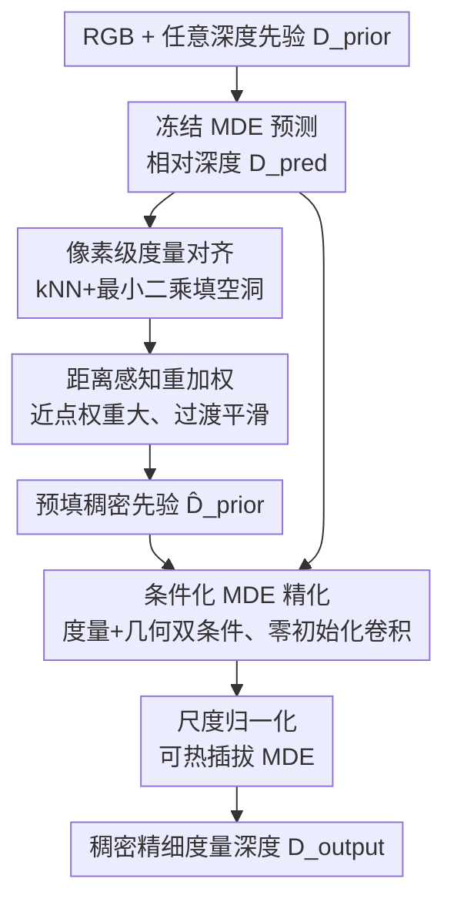

# Depth Anything with Any Prior

**会议**: ICLR2026  
**OpenReview**: [https://openreview.net/forum?id=IROtFft9Q4](https://openreview.net/forum?id=IROtFft9Q4)  
**项目页**: https://prior-depth-anything.github.io/  
**代码**: 待确认  
**领域**: 3D视觉  
**关键词**: 单目深度估计, 度量深度, 深度补全, 深度超分, 深度先验

## 一句话总结
Prior Depth Anything 用"先粗后细"的两段式流程，把传感器测出来的**精确但稀疏**的度量深度先验，和单目深度模型预测出来的**完整但相对**的几何结构融合起来，单个模型零样本统一了深度补全、超分、修复三类任务，在 7 个真实数据集上追平甚至超过各自的专用 SOTA。

## 研究背景与动机
**领域现状**：稠密、精细的度量深度图是 3D 重建、自动驾驶、AR/VR 的基础需求。两条技术路线各有所长：单目深度估计（MDE）基础模型（如 Depth Anything v2、Depth Pro）能为任意图像预测出**完整、细节丰富**的深度，但输出是**相对深度**，缺少真实尺度；而 SfM、LiDAR、ToF 等**测量手段**能给出**精确的度量值**，却往往**稀疏、不完整、带噪**。

**现有痛点**：把测量深度当作"先验"喂给 MDE 来补全的工作（depth completion / super-resolution / inpainting）已经不少，但它们各自只盯着**一种**先验形态——Omni-DC/Marigold-DC 只做稀疏点补全、PromptDA 只做低分辨率超分、DepthLab 只做缺失区域修复。换一种先验模式（比如先验里同时混了稀疏点 + 低分辨率 + 缺失区域）就跨不过去。作者在 Table 1 里把这点摊开：现有方法每个只覆盖几列，没有一个是"全能选手"。

**核心矛盾**：这些方法的两大通病是——① 先验极度有限时性能崩（缺乏显式的场景几何引导，100 个点这种极稀疏情形下补不出来）；② 难以泛化到训练时没见过的先验模式。根因在于它们没有把"预测深度里的几何结构"显式利用起来，而是让网络在某种固定输入模式上硬学。

**本文目标**：做一个对**任意图像 + 任意先验**都鲁棒的统一框架，输出稠密、精细、度量准确的深度图。

**切入角度**：预测深度和测量深度是**天然互补**的——一个有完整结构没尺度，一个有尺度没完整结构。与其针对每种先验单独设计网络，不如设计一个流程把这两种深度源**渐进式**地拼到一起。

**核心 idea**：用一条 coarse-to-fine 流水线，先用预测深度把任意稀疏先验"填满"成统一中间形态（显式融合），再用一个条件化 MDE 模型对填出来的噪声做精化（隐式融合），从而统一三类任务。

## 方法详解

### 整体框架
输入是 RGB 图像 $I \in \mathbb{R}^{3\times H\times W}$、任意形态的度量深度先验 $D_{prior} \in \mathbb{R}^{H\times W}$（有效像素集合记为 $P=\{x_i,y_i\}_{i=0}^N$），以及一个**冻结的 MDE 模型**对该图像产出的相对深度预测 $D_{pred}$。目标是输出稠密、精细、度量准确的 $D_{output}$。

整条流水线分两步走。第一步 **Coarse Metric Alignment（粗度量对齐，显式融合）**：用 $D_{pred}$ 的几何结构把 $D_{prior}$ 的空洞逐像素填满，得到一张稠密的预填先验 $\hat{D}_{prior}$——这一步把各种千奇百怪的先验模式统一收敛到一个**共享的中间域**，无论原先是稀疏点、低分辨率网格还是不规则缺失，填完后长得都差不多。第二步 **Fine Structure Refinement（精结构精化，隐式融合）**：把预填先验 $\hat{D}_{prior}$ 和原始预测 $D_{pred}$ 作为额外条件，喂进一个**条件化 MDE 模型**，在 RGB 引导下纠正预填阶段残留的噪声，输出最终度量深度。

### 关键设计

**1. 任意先验统一抽象 + 像素级度量对齐：把所有先验填成同一种东西**

这一步直接针对"换种先验就跨不过去"的痛点。作者先把 LiDAR/SfM 稀疏点、低分辨率网格、缺失区域统统抽象成"度量先验 $D_{prior}$"，再用预测深度把空洞填满。有效位置直接保留原始测量值：$\hat{D}_{prior}(x,y)=D_{pred}(x,y)$ 仅当 $(x,y)\in P$（注：原文公式 1 此处保留的是有效像素的先验度量值，预测值仅用于填补无效区域）。对每个缺失像素 $(\hat{x},\hat{y})$，先找它在有效点集 $P$ 里的 $k$ 近邻（kNN，$k=5$），然后求一组最优的尺度 $s$ 和平移 $t$，让预测深度在这 $K$ 个支撑点上线性对齐到度量先验：

$$s,t = \arg\min_{s,t}\sum_{k=1}^{K}\lVert s\cdot D_{pred}(x_k,y_k)+t-D_{prior}(x_k,y_k)\rVert^2$$

再用这组 $s,t$ 把预测值线性映射成度量值填进空洞：$\hat{D}_{prior}(\hat{x},\hat{y})=s\cdot D_{pred}(\hat{x},\hat{y})+t$。这样做的妙处有二：其一**模式趋同**，填满后不同先验类型的差异被抹平，泛化大幅提升；其二**几何天然保真**，填出来的区域是预测深度的线性变换，原生继承了精细几何结构，所以即使先验极稀疏也能补出合理形状。

**2. 距离感知重加权：让填补在区域边界平滑过渡**

纯像素级对齐有两个隐患：相邻缺失像素可能选到不同的 kNN，导致填补值**突变**（不连续）；而最小二乘里所有支撑点等权，但近处的点显然比远处的更可信。作者用一个简单到位的修改解决——在对齐目标里按支撑点到查询像素的距离做倒数加权：

$$s,t = \arg\min_{s,t}\sum_{k=1}^{K}\frac{\lVert s\cdot D_{pred}(x_k,y_k)+t-D_{prior}(x_k,y_k)\rVert^2}{\lVert(\hat{x},\hat{y})-(x_k,y_k)\rVert^2}$$

离查询点越近的支撑点权重越大，于是相邻像素的对齐参数变化更连续，区域之间过渡更平滑，对噪声也更鲁棒。消融里这一项在多数设置下都带来小幅但稳定的增益（Table 6/9）。

**3. 条件化 MDE 精化：用网络隐式融合，纠正预填的噪声**

第一步是无参数的几何拼接，对先验里的噪声很敏感——边界上一个噪声像素，会污染所有把它当支撑点的填补区域。第二步就让 MDE 模型用它捕捉 RGB 几何结构的能力来"擦掉"这些噪声。具体做法是给预训练 MDE 加两路条件：**度量条件**（预填先验 $\hat{D}_{prior}$，带准确度量）和**几何条件**（冻结 MDE 的预测 $D_{pred}$，带精细结构），两路都通过**与 RGB 输入层并行的、零初始化的卷积层**注入。零初始化是关键——训练开始时条件支路输出为 0，模型原生继承预训练 MDE 的全部能力，再逐步学会用条件修正先验。消融（Table 7）证明两路条件缺一不可：只用几何条件 AbsRel 直接崩到 5.x，度量+几何双条件最优。

**4. 尺度归一化 + 可热插拔 MDE：跨场景泛化与测试时升级**

度量条件和几何条件喂进网络前都被归一化到 $[0,1]$。这带来两个好处：一是**跨场景泛化**，室内外深度尺度差异巨大，归一化抹掉尺度方差让模型在不同场景都稳；二是**跨 MDE 泛化**，不同冻结 MDE 给出的预测尺度也不同，归一化 $D_{pred}$ 之后，推理时可以**任意更换**冻结 MDE 模型——这正是本文最实用的卖点：训练时用 Depth Anything v2 ViT-B 当冻结 MDE，推理时换成更强的 Depth Pro 或更大的 ViT-G，性能随之提升（Table 8：ViT-S→ViT-G，AbsRel 从 2.15 一路降到 1.87），从而提供灵活的精度-效率权衡，并能随 MDE 社区的进步而"白嫖"升级。

### 损失函数 / 训练策略
训练只动条件化 MDE 模型。为避免真实深度数据的边界模糊和缺失问题，作者用合成数据集 Hypersim 和 vKITTI（有精确 GT）训练：从 GT 里随机采样稀疏点、挖方形缺失区、做降采样，构造各种合成先验，并按 Omni-DC 的做法加入离群点和边界噪声来模拟真实测量噪声。由于两路条件都归一化过，输出需做去归一化还原到 GT 尺度，监督用 ZoeDepth 的尺度不变 log loss。训练 200K 步、batch 64、8 GPU；编码器 lr 5e-6、解码器 lr 5e-5，AdamW + cosine 调度，kNN 的 $k=5$。

## 实验关键数据

### 主实验
在 7 个未见真实数据集上零样本评测，覆盖室内（NYUv2/ScanNet）、室内外（ETH3D/DIODE）、室外（KITTI）及低分辨率采集（ARKitScenes/RGB-D-D）。指标为 AbsRel↓。下表为**混合先验**设置（同时含稀疏点 S + 低分辨率 L + 缺失区域 M），最能体现"全能"价值：

| 方法 | 编码器 | NYUv2 (S+M) | ETH-3D (S+M) | KITTI (S+M) | 平均 Rank↓ |
|------|--------|-------------|--------------|-------------|-----------|
| Omni-DC | - | 2.86 | 2.09 | 4.36 | 4.2 |
| Marigold-DC | SDv2 | 2.26 | 2.15 | 5.82 | 5.1 |
| PromptDA | ViT-L | 17.00 | 18.34 | 21.61 | 8.4 |
| **PriorDA (ours)** | DAv2-B+ViT-B | **2.04** | **1.56** | **3.86** | **2.0** |
| **PriorDA (ours)** | Depth Pro+ViT-B | **2.01** | 1.61 | **3.37** | **1.1** |

不仅绝对性能全面领先，更关键的是**对额外先验模式更不敏感**：相比只用稀疏点（Table 3），加上缺失区域或低分辨率后 PriorDA 在 NYUv2 上只从 1.96 微涨到 2.01/3.08，而 Omni-DC（2.63→2.86/3.81）、Marigold-DC（2.13→2.26/3.82）退化明显更大。

在三个单独任务上，PriorDA 用单个模型追平甚至超过各自专用 SOTA：深度补全（Table 3，平均 Rank 1.7）、深度超分（Table 4，在真实低功耗采集的 ARKitScenes/RGB-D-D 上显著领先）、深度修复（Table 5，尤其在实用的 "Range" 超距缺失设置上优势明显）。

### 消融实验

| 配置 | 关键指标 (NYUv2 等平均) | 说明 |
|------|------------------------|------|
| 双条件（度量+几何） | 最优（S=1.96） | 完整模型 |
| 仅几何条件 | S=5.46 | 去掉度量条件后几乎崩溃 |
| 仅度量条件 | S=2.10 | 缺几何引导，细节变差 |
| 预填 w/o re-weight | S=2.92（Table 6） | 去掉距离重加权，多数设置变差 |
| 插值填补（替代对齐） | S=7.93（Table 6） | 朴素插值远不如用预测对齐 |

### 关键发现
- **度量条件是命门**：Table 7 中只给几何条件、不给度量条件时 AbsRel 从 ~1.96 暴涨到 5.46，说明把精确度量值显式喂进去不可或缺；两路条件互补，都保留才最优。
- **预填策略决定泛化**：Table 9 显示只用稀疏点训练、再测未见先验类型时，"None"（不预填）在缺失区域 M 上 AbsRel 高达 46.07，而本文的对齐预填降到 2.26——预填把先验统一成中间域这一步，正是跨先验泛化的关键。
- **换更强的冻结 MDE 就免费涨点**：Table 8 中冻结 MDE 从 ViT-S 升到 ViT-G，AbsRel 单调下降（2.15→1.87），印证了归一化设计带来的"可热插拔、随社区进步升级"特性。
- **真实 GT 本身有噪**：误差分析（Fig 4）发现模型误差主要集中在 NYUv2/ScanNet 等数据集"GT"的模糊边界上——即模型其实在纠正标注噪声，这也是超分在降采样数据集上看似不如直接复刻 GT 噪声的原因，所以作者强调 ARKitScenes/RGB-D-D 这类真实采集基准更有代表性。

## 亮点与洞察
- **"填满再精化"的两段式拆解很干净**：先用无参数几何对齐把任意先验统一成中间域（解决泛化），再用条件网络擦噪声（解决精度），把"显式融合"和"隐式融合"的职责分得很清楚，每一步都能单独消融验证，方法论上很可复用。
- **零初始化条件卷积**是个值得迁移的 trick：让新增的条件支路从恒等映射出发，训练开始时完全不破坏预训练模型能力，再渐进学习——这和 ControlNet 的思路一脉相承，凡是想给冻结基础模型加额外输入的任务都能借鉴。
- **归一化换来"可热插拔基础模型"**最让人"啊哈"：把冻结 MDE 的预测归一化后，推理时可以任意替换更强的 MDE，性能跟着涨，相当于把自己的方法挂在整个 MDE 社区的进步列车上，提供天然的精度-效率旋钮。
- **用合成数据训练去纠正真实数据的噪声**：作者反过来利用合成 GT 的精确性来教模型修正真实测量噪声，绕开了真实深度标注本身模糊/缺失的难题。

## 局限与展望
- **依赖冻结 MDE 的质量**：整套方法建立在"预测深度几何结构足够准"的假设上，若底层 MDE 在某些场景（反光、透明、极端室外）失准，预填和精化都会受连累。
- **kNN + 最小二乘对极端噪声仍敏感**：第一步是无参数的，论文自己也指出边界噪声点会污染填补区域，虽然第二步在补救，但当先验本身噪声极大时上限受限。
- **度量精度天花板仍是测量先验**：方法本质是"用预测补全测量"，最终度量精度仍受限于先验测量值的密度和准确度，对完全无先验的纯单目度量估计无能为力。
- **可改进方向**：把第一步的无参数对齐也做成可学习的、对噪声更鲁棒的模块；或探索把多帧/多视角先验也纳入同一"任意先验"抽象。

## 相关工作与启发
- **vs Omni-DC / Marigold-DC（深度补全）**：它们为稀疏点补全设计了复杂耗时的结构，但缺显式场景几何引导，极稀疏时崩。本文用预测深度显式提供几何、流程更简单更高效，且不局限于稀疏点一种先验。
- **vs PromptDA（深度超分）**：PromptDA 把低分辨率图当 prompt 喂给深度基础模型，只能处理低分辨率先验。本文把低分辨率只当"任意先验"的一种，同一模型还能处理稀疏点和缺失区域。
- **vs DepthLab（深度修复）**：DepthLab 先插值填洞再用扩散模型精化，但插值误差在大面积缺失或深度范围不全时拖后腿。本文用预测深度的线性对齐替代插值，几何保真度更高，大缺失区表现更稳。
- **vs Depth Anything v2 / Depth Pro（纯 MDE）**：它们产出相对深度或精度有限的度量深度，本文把它们当作"冻结几何提供者"，再叠加测量先验把相对变绝对、把粗变细。

## 评分
- 新颖性: ⭐⭐⭐⭐ 用 coarse-to-fine 显式+隐式融合把三类深度先验任务统一，框架简洁但角度新。
- 实验充分度: ⭐⭐⭐⭐⭐ 7 数据集 × 9 种先验模式 + 混合先验，主表消融齐全，可热插拔特性也做了验证。
- 写作质量: ⭐⭐⭐⭐ 动机（互补性）一以贯之，图 2 把两段式流程讲得很清楚。
- 价值: ⭐⭐⭐⭐⭐ 单模型零样本统一补全/超分/修复并追平专用 SOTA，且能随 MDE 社区进步升级，实用价值高。

<!-- RELATED:START -->

## 相关论文

- [\[ICLR 2026\] DA$^{2}$: Depth Anything in Any Direction](da2_depth_anything_in_any_direction.md)
- [\[CVPR 2026\] Depth Any Panoramas: A Foundation Model for Panoramic Depth Estimation](../../CVPR2026/3d_vision/depth_any_panoramas_a_foundation_model_for_panoramic_depth_estimation.md)
- [\[ICLR 2026\] D²GS: Depth-and-Density Guided Gaussian Splatting for Stable and Accurate Sparse-View Reconstruction](d2gs_depth-and-density_guided_gaussian_splatting_for_stable_and_accurate_sparse-.md)
- [\[CVPR 2026\] The Midas Touch for Metric Depth](../../CVPR2026/3d_vision/the_midas_touch_for_metric_depth.md)
- [\[CVPR 2026\] UniDAC: Universal Metric Depth Estimation for Any Camera](../../CVPR2026/3d_vision/unidac_universal_metric_depth_estimation_for_any_camera.md)

<!-- RELATED:END -->
