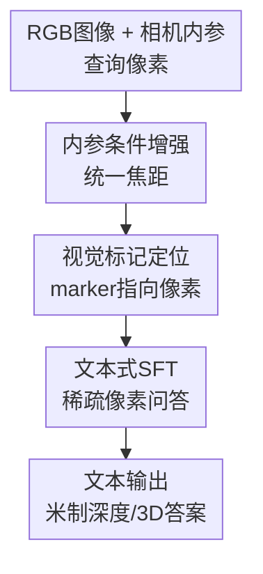

# DepthLM: Metric Depth from Vision Language Models

**会议**: ICLR2026  
**OpenReview**: [https://openreview.net/forum?id=ObFVZGnSFN](https://openreview.net/forum?id=ObFVZGnSFN)  
**代码**: https://github.com/facebookresearch/DepthLM_Official  
**领域**: 3D视觉 / 多模态VLM  
**关键词**: metric depth, VLM, 视觉提示, 相机内参, 3D理解  

## 一句话总结
DepthLM 证明标准 VLM 不需要 dense prediction head 或专门深度损失，只靠视觉标记、相机内参条件的数据增强和文本式 SFT，就能在像素级 metric depth 上首次接近甚至超过多种专家型纯视觉深度模型。

## 研究背景与动机
**领域现状**：单目 metric depth estimation 的主流强方法通常是纯视觉模型，例如 ZoeDepth、Metric3D、Depth Pro、UniDepth 系列。它们把输入图像映射成稠密深度图，通过专门的深度预测头、尺度归一、几何约束和回归/正则损失来学习以米为单位的深度，任务定义清楚、输出稳定，在自动驾驶、机器人和三维重建里已经非常成熟。

**现有痛点**：这些专家模型的准确率高，但灵活性有限。换成两点距离、相机位姿、给定速度求时间这类更自然的 3D 问答任务时，往往又需要重新设计输出头、训练目标或额外模块。另一边，VLM 可以通过文本交互处理多种视觉任务，却在 3D 几何上明显掉队：即使是 GPT-5、Gemini-2.5-Pro 这样的强 VLM，在像素级 metric depth 上也远低于纯视觉模型。

**核心矛盾**：VLM 的优势是统一接口和语言交互，但 metric depth 需要精确地知道“图上哪个像素”和“这个像素对应的真实尺度”。如果像素定位和相机尺度这两件事没有解决，模型再大也只能给出语义上合理、几何上不可靠的数字；如果为它加 dense head 和专门损失，又会丢掉 VLM 作为统一模型的简洁性。

**本文目标**：作者把像素级 metric depth estimation 当作代表性 3D 理解任务，追问一个很直接的问题：标准 VLM 在不改架构、不加回归头、不改训练范式的情况下，能不能达到专家深度模型级别的几何精度？为回答这个问题，论文系统分析 prompt、训练损失和混合数据训练中的相机歧义，并构建 DepthLMBench 让 VLM 能和纯视觉模型在同一类指标上比较。

**切入角度**：论文的关键观察是，VLM 失败不一定是因为“不会回归连续深度”，而可能是输入表示让它找不到像素、混合数据让它分不清相机尺度。也就是说，瓶颈可能不在模型架构和损失形式，而在把几何问题翻译成 VLM 能稳定理解的视觉-文本交互。

**核心 idea**：用图像上的视觉标记代替文本坐标来指向目标像素，再用相机内参条件的数据增强统一焦距，让标准 VLM 通过稀疏文本 SFT 学会以米为单位的深度。

## 方法详解
DepthLM 的方法很克制：它没有把 VLM 改造成一个深度估计网络，而是把 metric depth 重新包装成 VLM 能做的视觉问答。给定一张图和一个查询像素，系统先按相机内参把图像缩放到统一焦距，再在图上画一个指向查询点的 marker，最后用文本问题询问该点离相机多少米，答案也以普通文本形式给出。训练时仍然是标准 next-token prediction，模型学习输出类似 “The point is around X meters away from the camera.” 的回答。

### 整体框架
DepthLM 的输入是一张带相机内参的 RGB 图像和一个或多个查询点，输出是文本形式的 metric depth 或其他 3D 数值答案。完整 pipeline 可以看成三步：先通过 intrinsic-conditioned augmentation 消除不同相机焦距带来的尺度歧义，再用 visual prompting 把抽象像素坐标变成 VLM 直接可见的图像标记，最后用稀疏标注样本做 SFT，让模型在普通语言接口中学习 3D 数值预测。

这张图里真正的贡献节点对应下面三个关键设计：内参条件增强解决相机尺度歧义，视觉标记定位解决 VLM 对像素位置不敏感的问题，文本式 SFT 则说明不需要额外 dense head 或复杂回归损失。DepthLMBench 是支撑训练和评测的数据基准，不是模型推理时的一个模块，但它决定了这些设计能否被系统验证。

### 关键设计
**1. 视觉标记定位：把像素坐标从文本问题变成图像中的可见目标**

传统 VLM 做像素级任务时常用文本坐标，例如问 “pixel at $(X, Y)$ is how far from the camera?”。论文发现这种方式对 VLM 很不友好：模型必须先把语言中的坐标映射回图像网格，再在复杂场景里定位到具体物体边界，误差一点就可能从桌面跳到墙面，深度数值会完全错位。DepthLM 直接在图像上渲染小箭头等 marker，让 marker 指向查询像素，然后用自然语言问“这个点离相机多少米”。

这个设计的好处不是 prompt 更花哨，而是把 VLM 擅长的“看图理解可见对象”拿来替代它不擅长的“从文本坐标恢复像素位置”。实验里 marker-based pixel reference 在室内外数据上都优于文本坐标，室内 ScanNet++ 的差距尤其明显，因为室内物体密集、遮挡和边界更多，坐标定位错误更容易落到另一个物体上。更有意思的是，不同 marker 形状对结果影响不大，说明关键不是某个特定图案，而是把查询点显式画到视觉输入中。

**2. 内参条件增强：统一焦距来消除混合数据中的相机歧义**

metric depth 的难点不只是“看起来远不远”，还包括相机本身的尺度。两张视觉上相似的图片，如果焦距不同，同一个像素投射出的真实距离分布可以差很多。纯视觉 metric depth 模型长期会处理这个问题，但 VLM 如果只把多数据集样本直接混在一起训练，很容易学到模糊的平均尺度，导致跨数据集泛化失败。

DepthLM 的做法是先把图像按相机焦距缩放到统一焦距 $f_{uni}$。如果原图尺寸是 $W \times H$，焦距参数是 $f_x, f_y$，则增强后的尺寸为 $W' = \frac{f_{uni}}{f_x} W$、$H' = \frac{f_{uni}}{f_y} H$。论文默认 $f_{uni}=1000$ pixels，并在训练时随机裁剪不同大小的图像；评测时不再裁剪，只要焦距已经被统一，模型就不必从文字里的内参数字或隐含视觉线索中猜相机尺度。

这个选择来自一组对比：直接混合不同焦距训练、把内参写进文本 prompt、让模型先预测 camera ray direction，再输出深度，都不如直接通过图像增强统一焦距。对 VLM 来说，显式文本内参并没有真正解决问题，反而是把相机差异体现在视觉输入的几何尺度中更有效。

**3. 稀疏文本式 SFT：用普通 token 预测学习连续深度**

很多人直觉上会认为，像素级深度估计必须要 dense prediction head、回归损失或者深度图级正则。DepthLM 的反直觉结论是：标准文本 SFT 已经够用。训练样本被构造成图像加问题，答案是保留两位小数的文本深度，例如 “The point is around 3.42 meters away from the camera.”；模型仍然用 cross-entropy 做 next-token prediction，而不是对深度值施加 L1、L2 或尺度正则。

论文还比较了 SFT 和 GRPO 式 RL。RL 可以把 negative L1、negative AbsRel、$\delta_1$ 等指标作为 reward，最终也能学到合理的 3D 预测，但每个样本的计算成本明显更高，实际训练会慢 $8$ 到 $16$ 倍。由于在相同训练样本数下 SFT 和 GRPO 准确率相近，DepthLM 选择 SFT 作为可扩展方案。更重要的是，作者发现每张图只用极少数标注点也能学得很好：在 16M 图像、每图 1 个标注像素的阶段，模型已经超过 $0.8$ 的 $\delta_1$。这说明对 VLM 来说，图像多样性比单图上的密集标签更关键。

**4. DepthLMBench：让 VLM 和专家深度模型在同一几何任务上对齐比较**

为了避免只在对象级空间问答上评估 VLM，论文把多个公开 3D/深度数据集整理成 DepthLMBench。训练数据混合 Argoverse2、Waymo、NuScenes、ScanNet++、Taskonomy、HM3D、Matterport3D，覆盖室内和室外场景；评测数据则包含 Argoverse2、DDAD、NuScenes、ETH3D、ScanNet++、sunRGBD、iBims1、NYUv2，并尽量和训练场景不重叠。

这个 benchmark 的意义在于把 VLM 拉回到纯视觉模型长期使用的 metric depth 评价体系中，例如 $\delta_1$。$\delta_1$ 表示预测值和真实值相差不超过 $25\%$ 的比例，越高说明 metric scale 越可靠。只有这样比较，才能回答“VLM 到底离专家深度模型有多远”，而不是只看语言回答是否听起来合理。

### 一个完整示例
假设输入是一张室内客厅照片，查询点落在桌角边缘。传统文本坐标方案会把问题写成“图像大小为 $W \times H$，像素 $(X,Y)$ 离相机多远”，VLM 需要自己把坐标对应回桌角；如果它稍微偏到背景墙或地板，输出深度就会失真。DepthLM 会先根据相机内参把图片缩放到统一焦距，再在桌角位置画一个小箭头，然后问“这个点离相机多少米”。

训练时，这个样本的答案可能是 “The point is around 1.85 meters away from the camera.”。模型不需要输出整张深度图，只需要在这个被 marker 指向的位置上预测一个文本数字。如果要生成点云，可以在评测时对 10K 个均匀采样像素分别查询深度，再把这些深度和相机几何组合成点云。论文的可视化显示，DepthLM 虽然没有 dense head，却能得到尺度接近 GT 的点云，并且在物体边界处比一些纯视觉模型更少出现过平滑造成的 flying points。

### 损失函数 / 训练策略
DepthLM 默认从预训练 VLM 继续 finetune，使用标准 SFT 和文本 token 上的交叉熵损失。主实验使用 Bai et al. 2025 的 3B 和 7B VLM，也用 Pixtral 12B 做跨架构验证。训练样本来自 DepthLMBench，规模约 23M 到 60M 个问答样本，相当于每张训练图大约 2 到 4 个标注像素；3B/7B 训练时统一焦距设为 1000 pixels，12B 因显存限制设为 750 pixels。

训练时，图像先做焦距统一，再随机裁剪，宽度从 1000 到 1400 pixels，高度从 700 到 1200 pixels 采样；评测时不裁剪。模型输出深度文本时将数值四舍五入到两位小数，避免很长的小数 token，同时对常见 3D 任务已足够。GRPO 实验中 negative L1 是较好的 reward，但由于效率低且没有明显精度优势，最终方法不采用 RL。

## 实验关键数据

### 主实验
论文首先把 DepthLM 和通用 VLM、空间 VLM、已经训练过 metric depth 的 VLM 做比较。结果很清楚：大模型会“会说”，但不会稳定给出米制几何；DepthLM 3B/7B 反而在 $\delta_1$ 上大幅领先。

| 方法 | 模型类型 | 平均 $\delta_1$ | 关键结论 | 提升 |
|------|----------|----------------|----------|------|
| Qwen2.5-VL 3B | 通用 VLM | 0.106 | 基础 VLM 几乎不会 metric depth | DepthLM 3B 约 7.8x |
| GPT-5 | 通用 VLM | 0.370 | 强闭源 VLM 仍低于 0.4 | DepthLM 7B 约 2.3x |
| SpatialRGPT 8B | 空间 VLM | 0.205 | 对象级空间训练不等于像素级深度能力 | DepthLM 7B 约 4.1x |
| Seed1.5-VL (our prompt) | 深度 VLM | 0.400 | 换成 marker prompt 后明显改善但仍不足 | DepthLM 7B 约 2.1x |
| DepthLM 3B | 本文 | 0.824 | 小模型已达到专家级 VLM depth | - |
| DepthLM 7B | 本文 | 0.838 | 相比 3B 略有提升，iBims1/NYUv2 超过 0.9 | - |

和纯视觉模型比较时，DepthLM 也不只是“比 VLM 好”，而是进入了专家 metric depth 模型的精度区间。论文报告 DepthLM 7B 在 DDAD、NuScenes、ETH3D、sunRGBD、iBims1 上的结果，整体超过 ZoeDepth、Depth Pro、Metric3Dv2 等多种方法，只比 UniDepthV2 的平均水平低约 $9.2\%$。

| 方法 | DDAD | NuScenes | ETH3D | sunRGBD | iBims1 | 相对 DepthLM 7B |
|------|------|----------|-------|---------|--------|------------------|
| ZoeDepth | 0.272 | 0.283 | 0.350 | 0.867 | 0.580 | -42.8% |
| Depth Pro | 0.299 | 0.566 | 0.397 | 0.831 | 0.823 | -29.1% |
| Metric3Dv2 | - | 0.841 | 0.900 | 0.812 | 0.684 | -3.8% |
| UniDepthV2 | 0.882 | 0.870 | 0.852 | 0.964 | 0.945 | +9.2% |
| DepthLM 7B | 0.747 | 0.865 | 0.718 | 0.859 | 0.920 | - |

### 消融实验
论文的分析实验回答了 DepthLM 为什么有效。最关键的消融不是某个大模块是否存在，而是 VLM 到底需要什么输入表示和训练方式。

| 配置 / 问题 | 关键指标或现象 | 说明 |
|-------------|----------------|------|
| 文本坐标 vs 视觉 marker | marker 在室内外均更好，ScanNet++ 差距约 0.15 | VLM 更容易理解图上可见的指示物，而不是文本坐标 |
| SFT vs GRPO | 同样样本数下精度相近 | GRPO 每样本计算慢 $8$-$16$ 倍，SFT 更适合扩展 |
| 相机歧义处理 | 统一焦距精度约为其他策略的 2 倍 | 把内参写进文本或让模型预测 ray direction 都不如图像级增强 |
| 统一焦距大小 | $f_{uni}$ 增至 1000 pixels 前持续受益 | 一定范围内稳定，说明增强方法不脆弱 |
| 每图标注点数 | 1 点/图已可超过 0.8 $\delta_1$ | 图像多样性比单图密集标注更重要 |
| 固定 80K 样本下增大 label density | 1点/图优于10点/图，10点/图优于100点/图 | 样本数固定时，减少图像数量会伤害泛化 |

### 关键发现
- DepthLM 的主要瓶颈诊断很有价值：VLM 不是天生不能做连续几何数值，而是原先的像素引用和相机尺度表达方式不适合它。
- marker prompt 不只提升本文模型，也能显著改善 Seed1.5-VL 的表现，说明这个结论有一定跨模型泛化性。
- SFT 足以训练 3D 理解，这对后续 VLM 几何任务很重要，因为它避免了昂贵 RL 和任务专用回归头。
- 点云可视化显示 DepthLM 的边界更少过平滑，虽然平滑区域会比纯视觉模型噪一些，但对机器人通行、物体间隙判断等边界敏感任务可能是优势。
- 多任务实验中，统一 DepthLM 7B 在 distance、principal axis distance、speed、time、two point distance、pose 六类任务平均 $\delta_1=0.804$，而 GPT-5 平均只有 0.210，说明方法价值不止于单点深度。

## 亮点与洞察
- **把问题归因到输入接口而不是模型能力上**：论文没有直接加更大的模型或更复杂 head，而是问 VLM 为什么看不准像素、为什么学不准尺度。这种诊断让方法很简单，却击中了 VLM 做 3D 的关键障碍。
- **视觉标记是一个低成本但高杠杆的 trick**：marker prompt 本质上把坐标绑定到视觉空间里，对任何需要点、区域、边界级别定位的 VLM 任务都有启发。它也说明“文本能表达一切”并不等于文本是最好的视觉定位接口。
- **相机内参最好在视觉几何中处理，而不是塞进 prompt**：把 $f_x, f_y, c_x, c_y$ 写给 VLM 并不等于模型会用这些数字做几何推理。DepthLM 用图像缩放把内参影响前置到输入分布里，等于替模型做掉一部分确定性几何变换。
- **稀疏监督足以激活 VLM 的 3D 能力**：每图 1 个标注点也能学出强泛化，说明 VLM 训练可能更依赖跨场景统计和语义-几何关联，而不是像纯视觉模型那样依赖每张图上的密集像素监督。
- **VLM 的点云形态和纯视觉模型不同**：DepthLM 独立查询像素会更 noisy，但边界更清楚；纯视觉模型表面更平滑，却可能把不同物体之间的边界抹平。这提示未来可以把 VLM 的边界敏感性和纯视觉模型的局部平滑性结合起来。

## 局限与展望
- DepthLM 依赖相机内参或至少需要能进行内参条件增强；在真实开放互联网图像中，内参未知或不可靠会限制直接应用。
- 当前方法逐点查询才能生成点云，虽然概念上简单，但如果要对整图高分辨率稠密预测，推理成本会比 dense head 深度模型高很多。
- 训练仍然需要大规模带几何标签的数据和大量 H100 资源，论文中的 3B/7B 主模型训练到数千万样本，并不是轻量微调即可复现。
- DepthLM 在平滑区域的点云噪声比一些纯视觉模型更明显，说明仅用独立点问答缺少局部一致性约束；未来可以考虑在不破坏 VLM 接口的前提下加入多点一致性训练或后处理。
- 多任务实验是很好的概念验证，但任务集合仍围绕几何数值预测，距离真实机器人规划、交互式空间推理和长时序 3D 理解还有距离。
- 作者也指出未来可以做更细的数据过滤、加入更多互补任务和更强的训练策略，让 VLM 不只是接近纯视觉模型，而是在泛化和多任务上形成优势。

## 相关工作与启发
- **vs Metric3D / Metric3Dv2**: Metric3D 系列通过纯视觉架构和相机内参归一来学习统一 metric scale，DepthLM 借鉴了处理相机歧义的思想，但把它放进 VLM 图像增强流程里，并用文本 SFT 输出深度。
- **vs Depth Pro / UniDepthV2**: 这些模型是强专家 depth model，稠密输出、速度和表面平滑性更适合直接深度图应用；DepthLM 的优势是接口统一，可以扩展到速度、时间、两点距离、位姿等语言定义任务。
- **vs SpatialVLM / SpatialRGPT**: 这些工作让 VLM 具备对象级空间理解，但往往依赖模板、LLM 生成问题或外部视觉模型蒸馏，且难以和纯视觉深度模型直接比较。DepthLM 直接选择像素级 metric depth，用标准指标量化 VLM 的 3D 精度。
- **vs SpatialBot / Seed1.5-VL**: 这类方法更接近像素级 3D VLM，但可能使用额外深度模块、文本坐标或没有充分处理相机歧义。DepthLM 的差异在于用 marker 定位和焦距统一这两个简单机制，把 VLM 的 depth 能力推到专家模型附近。
- **对后续工作的启发**: 很多几何任务可以先拆成“确定性几何预处理 + 可视化 prompt + 文本数值监督”，而不是急着改 VLM 架构。对于机器人、自动驾驶和 AR 场景，DepthLM 提供了一条把 VLM 变成可交互几何估计器的路线。

## 评分
- 新颖性: ⭐⭐⭐⭐⭐ 把 metric depth 作为 VLM 3D 能力的硬核检验，并证明不改架构也能接近专家模型，观点和结果都很有冲击力。
- 实验充分度: ⭐⭐⭐⭐⭐ 有 prompt、loss、相机歧义、稀疏标签、多任务和纯视觉模型对比，实验链条完整且结论互相支撑。
- 写作质量: ⭐⭐⭐⭐☆ 论文逻辑清楚，分析到最终方法的推导自然；少数附录和图中细节需要读者来回查表。
- 价值: ⭐⭐⭐⭐⭐ 对 VLM 做 3D/机器人任务非常有参考价值，尤其是 visual prompting 和 intrinsic-conditioned augmentation 两个设计容易迁移。

<!-- RELATED:START -->

## 相关论文

- [\[CVPR 2026\] Zero-Shot Depth Completion with Vision-Language Model](../../CVPR2026/3d_vision/zero-shot_depth_completion_with_vision-language_model.md)
- [\[CVPR 2026\] MonoVLM: Monocular 3D Visual Grounding with Vision Language Models](../../CVPR2026/3d_vision/monovlm_monocular_3d_visual_grounding_with_vision_language_models.md)
- [\[CVPR 2025\] Vision-Language Embodiment for Monocular Depth Estimation](../../CVPR2025/3d_vision/vision-language_embodiment_for_monocular_depth_estimation.md)
- [\[CVPR 2026\] The Midas Touch for Metric Depth](../../CVPR2026/3d_vision/the_midas_touch_for_metric_depth.md)
- [\[CVPR 2026\] TR2M: Transferring Monocular Relative Depth to Metric Depth with Language Descriptions and Dual-Level Scale-Oriented Contrast](../../CVPR2026/3d_vision/tr2m_transferring_monocular_relative_depth_to_metric_depth_with_language_descrip.md)

<!-- RELATED:END -->
