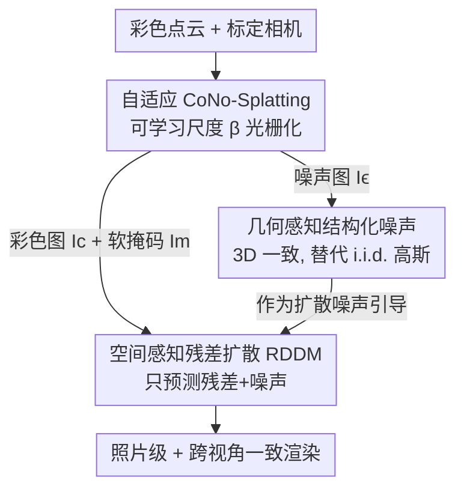

# DiffPBR: Point-Based Rendering via Spatial-Aware Residual Diffusion

**会议**: ICLR2026  
**OpenReview**: [https://openreview.net/forum?id=tqOBZbW6j8](https://openreview.net/forum?id=tqOBZbW6j8)  
**代码**: 待确认  
**领域**: 3D视觉 / 神经渲染 / 扩散模型  
**关键词**: 点云渲染, 新视角合成, 残差扩散, 几何一致噪声, 自适应光栅化

## 一句话总结
DiffPBR 把彩色点云直接渲染成照片级、跨视角一致的图像：先用自适应 CoNo-Splatting 把稀疏点云光栅化成"恰到好处"的初始彩色图与几何感知噪声图，再用空间感知残差扩散（RDDM）只补缺失的高频细节，在三个数据集上 PSNR 比 SOTA 高 3∼5 dB，训练从 41 降到 8 GPU 小时、渲染从 3.6 提到 10 FPS。

## 研究背景与动机
**领域现状**：从彩色点云直接渲染照片级图像，是图形学的老问题，在 VR、影视、机器人、自动驾驶里都有需求。传统做法把 3D 点投影到 2D、再做 z-buffer 光栅化（如 PyTorch3D），高效但点云一稀疏就出现空洞、走样、表面断裂。神经点渲染（NPBG、RPBG）在此基础上给每个点挂一个可学习的神经描述子，光栅化后用 CNN 精修，质量大幅提升；NPBG++ 进一步用在线聚合让描述子能跨场景；PFGS 则把点表示成自适应高斯、靠可微 splatting 学描述子来改善视角一致性。

**现有痛点**：这一类"学描述子"的范式有两个绕不开的问题。其一，多视角图像本身就不一致，直接聚合特征会糊；就算用多视角图像 finetune 描述子，离散空间里的光栅化仍然逃不掉点云稀疏导致的伪影。其二，为了缓解伪影，主流方法不得不引入额外表示（NPCR 的 3D CNN、PFGS 的 3D 高斯），这让 pipeline 变重、还依赖耗时的逐场景或逐描述子优化。

**核心矛盾**：纯点云 pipeline 的根本难点是——既要修掉光栅化伪影、又要保证多视角一致，而点云没有显式的表面连通性，对每点尺度这种参数极其敏感，单靠扩大点尺寸根本补不回缺失区域。

**本文目标**：作者直接追问一个反方向的问题——点真的是"差"的渲染图元吗？随着深度传感与 3D/4D 重建普及，点云已成为和 RGB 并列的常见模态。能不能不引入任何其它表示，做一个纯点云、可泛化、跨视角一致的渲染器？

**切入角度**：图像修复里的扩散模型泛化强、出图质量高，是天然的"通用渲染器"候选。但直接把图像扩散搬过来有三个硬伤：(1) 标准修复逐图独立处理，没有视角约束，相邻视角会发散、闪烁；(2) 扩散假设输入是纯噪声，可点云退化渲染里其实已保留大量结构与颜色，从零重建既没必要又费算力；(3) 点云对尺度等逐点参数敏感，参数没选好会引入更多伪影、给出不可靠监督。

**核心 idea**：用"被场景几何与可见性显式约束的、视角投影噪声"去引导扩散——让噪声本身携带 3D 一致的几何线索，扩散在 camera motion 下自然就跨视角一致；同时把扩散从"纯噪声重建"改成"残差细化"，只补缺失细节而不重画整图。

## 方法详解

### 整体框架
给定彩色点云 $P=\{(x_i, c_i)\}$ 和标定相机，DiffPBR 分两步把它渲染成照片级、跨视角一致的图像。第一步 **自适应 CoNo-Splatting**：把每个点额外挂上一个零均值高斯噪声向量 $\epsilon_i$ 和一个各向同性尺度 $s_i$，用可微光栅化同时投影出彩色图 $I_c$、噪声图 $I_\epsilon$ 和软掩码 $I_m$（标记哪些像素是空洞）——关键是用一个可学习的全局尺度乘子 $\beta$ 把稀疏点投得"既不糊成一团、也不留太多空洞"，给下游扩散一个好用的初值。第二步 **空间感知残差扩散（RDDM）**：把 $I_c$、$I_m$ 当条件、把 3D 一致的 $I_\epsilon$ 拿来构造监督目标，让网络只预测"渲染图与真值之间的残差 + 噪声"，从信息丰富的渲染图（而非纯噪声）出发反向去噪，几步就能补齐高频细节并保证视角一致。整个框架端到端训练，不需要分阶段预训练。

### 关键设计

**1. 自适应 CoNo-Splatting：用可学习全局尺度把稀疏点投成"恰到好处"的初值**

点云稀疏，splat 太小留空洞、太大糊成片，而最佳尺度因场景密度而异。作者先用 KNN 给每个点算一个启发式尺度 $\bar s_i = \frac{1}{k}\sum_{x_j\in K_i}\|x_i-x_j\|_2$（近邻越密、尺度越小），再用一个**可学习**的全局乘子 $\beta$ 配合中位数做上界裁剪：$s_i = \mathrm{clamp\_max}(\bar s_i,\ \beta\cdot\mathrm{median}(\{\bar s_j\}))$。这比 PFGS 用 CNN 逐点预测尺度（还要两阶段训练）轻得多——作者的目标不是直接 splat 出照片级图，而是给扩散一个"信息保真又不引入虚假伪影"的输入。$\beta$ 怎么学是关键：定义软掩码 $I_m=\alpha(I_c)$（取每像素不透明度）和空间分布 $p(i,j)=I_m(i,j)/(\sum I_m+\delta)$，再用两个对抗式正则一起调 $\beta$——

$$L_{cov}=\mathbb{E}_{(i,j)\sim p}\big[\|I_c-I_0\|_1\big],\qquad L_{cmp}=\mathbb{E}_{(i,j)\sim p}\big[-\log(p(i,j)+\delta)\big]$$

覆盖损失 $L_{cov}$ 把重建误差摊到有效区域、鼓励更大的空间覆盖（防止图像塌成一堆空洞）；紧致损失 $L_{cmp}$ 反过来惩罚过度铺开的掩码。两者拉锯（$L_{cmp}$ 单独会把 $\beta$ 压到掩码过小、$L_{cov}$ 则把它撑大），最终把 $\beta$ 稳定到一个结构良好的解。消融显示这套自适应正则比纯 KNN 初值在 splatting 阶段直接把 PSNR 从 13.43 提到 15.14。

**2. 几何感知结构化噪声：用 3D 一致噪声替代 i.i.d. 高斯**

标准扩散从逐像素独立的高斯噪声起步，相邻视角各自随机初始化，预测就会发散、出现帧间闪烁，这对没有表面连通性的点云尤其致命。作者的做法是：让噪声也"被点云渲染出来"。每个点带的噪声 $\epsilon_i$ 跟颜色 $c_i$ 走同一套可微 splatting 公式，按深度和可见性加权——离相机近的点贡献强、远的或被遮挡的点贡献弱甚至被压制：

$$F(p)=\frac{\sum_i \kappa\big((p-\pi(K_v,M_v,x_i))/s_i\big)\,v(z_i)\,f_i}{\sum_j \kappa(\cdots)\,v(z_j)+\delta},\qquad I_c=[F]_{1:3},\ I_\epsilon=[F]_{4:6}$$

由于 $I_\epsilon$ 来自同一份 3D 点云，它天然在不同视角和时间步之间保持几何一致；扩散要预测残差噪声，就必须去解码这些几何线索，于是无需任何显式深度监督就获得了空间感知。消融里把"2D 随机噪声"换成"3D 一致噪声"额外带来约 0.75 dB PSNR 并明显加快收敛。

**3. 空间感知残差扩散 RDDM：只预测残差+噪声，不从纯噪声重画**

退化的点云渲染图其实已经有大量正确结构，从纯高斯噪声重建整图既慢又没必要。RDDM 把扩散目标改成预测"残差 + 噪声"的加权组合：记 $I_r=I_c-I_0$ 为渲染图与真值之差，监督目标为 $\mathrm{res}_\epsilon = I_\epsilon + \frac{\gamma_t}{\beta_t}I_r$，网络以 $I_c$、$I_m$ 为条件去拟合它：

$$L_{rdm}=\mathbb{E}_{I_0,I_\epsilon,t}\big[\|\mathrm{res}_\epsilon-F_\theta(\hat I_t, I_c, I_m, t)\|^2\big]$$

这样网络只需补回缺失的高频细节或纠正细微畸变，学习目标被大幅简化，跨场景泛化更好；推理时从信息丰富的渲染图（而非随机噪声）起步，把去噪步数从 DDPM 的 50+ 步压到 5 步甚至 1 步。消融表显示 RDDM 相比 DDPM 平均涨 2 dB、收敛迭代数从 92k–104k 降到 37k–44k。作者据此提供两个变体：DiffPBR-Q（5 步采样，重质量）和 DiffPBR-E（单步采样，重效率）。

### 损失函数 / 训练策略
端到端联合优化两项：CoNo-Splatting 阶段的 $L_{cns}=\lambda_{cov}L_{cov}+\lambda_{cmp}L_{cmp}$（调 $\beta$）与残差扩散损失 $L_{dm}$（即 $L_{rdm}$），梯度同时回传到网络参数 $\theta$ 和尺度乘子 $\beta$。训练用 8 张 RTX 3090，图像随机裁到 $256\times256$，无分阶段预训练；推理在单卡上、保留原分辨率。采样步数选取用 $T'=\arg\min_T|\sum\sqrt{\bar\alpha_i}-\frac12|$ 自动确定起始步。

## 实验关键数据

### 主实验
在 ScanNet（室内场景级）、DTU（物体级）、THuman2.0（人体）三个数据集上，用 PSNR/SSIM/LPIPS 对比传统渲染（PyTorch3D）、点渲染（NPBG、NPBG++）、NeRF 类（TriVol）、高斯类（PFGS）。

| 数据集 | 指标 | DiffPBR-Q | 之前最好(PFGS) | 提升 |
|--------|------|-----------|----------------|------|
| ScanNet | PSNR↑ | 23.28 | 19.86 | +3.42 dB |
| DTU | PSNR↑ | 28.45 | 25.44 | +3.01 dB |
| THuman2.0 | PSNR↑ | 41.27 | 35.88† | +5.39 dB |
| THuman2.0 | LPIPS↓ | 0.003 | 0.006† | 减半 |

DiffPBR-E（单步）与 DiffPBR-Q（5 步）差距很小，说明残差扩散即便单步也能出高质量结果。效率上（THuman2.0，80k 点，单 RTX 3090）：训练从 PFGS 的 41 GPU 小时降到约 8 小时，单步变体推理 10 FPS（PFGS 仅 3.6 FPS），约 3× 加速。

### 消融实验

| 配置 | 关键指标 | 说明 |
|------|---------|------|
| KNN 尺度（仅启发式） | 22.05 (ScanNet PSNR) | splatting 阶段仅 13.43 |
| + 自适应尺度正则 (Full β) | 23.28 | splatting 阶段 15.14，最终最佳 |
| MLP / CNN 预测尺度 | 21.47 / 21.08 | splatting 阶段更高(18.77/19.42)但精修反而更低 |
| DDPM + 2D 随机噪声 | 19.22, 收敛 104k | 基线扩散 |
| RDDM + 3D 一致噪声 | 22.15, 收敛 37k | 残差 +约2 dB，3D 噪声再 +0.75 dB |

### 关键发现
- **"好的初值"反而坑扩散**：CNN 预测尺度让 splatting 阶段 PSNR 高达 19.42，但精修只涨 1.66 dB；而较弱的 KNN 初值因梯度更强，反逼模型学到更丰富的几何与纹理，最终更好——强输入是把双刃剑。
- **$L_{cov}$ 与 $L_{cmp}$ 是对抗关系**：单用扩散损失调 $\beta$ 几乎无效（仅 +0.26 dB）；$L_{cmp}$ 制造空洞、驱使扩散学细节，$L_{cov}$ 防止塌缩，二者的对抗平衡是稳定收敛的关键。
- **效率来源**：KNN+自适应正则直接解析算尺度，处理 100k 点比 MLP 快约 100×、比 CNN 快约 20×，显存也低得多（0.097 GB vs CNN 0.911 GB）。
- **跨数据集泛化**：DTU 上训练、直接测 THuman2.0，DiffPBR 仍保留细节，而 PFGS 依赖耗时预训练学点云先验，泛化受限。

## 亮点与洞察
- **把"噪声"当成几何载体**是最巧的一步：别人想方设法加时序/几何约束，作者直接让噪声从同一份点云渲染出来，3D 一致性"免费"获得，无需显式深度或时序监督——这个思路可迁移到任何需要多视角一致的扩散任务。
- **残差扩散用于点渲染是首次**：从渲染图而非纯噪声起步，本质上把"生成"问题降级为"修复"问题，既省步数又涨泛化，且单步即可用。
- **反直觉的"弱初值更好"**：刻意不追求 splatting 阶段的高 PSNR，把纠错任务留给扩散，反而整体更优——提示我们在两阶段 pipeline 里不该贪图前一阶段的局部最优。
- **纯点云、无额外表示**：抛掉 3D CNN/高斯等辅助表示，pipeline 更简洁，端到端可训，对点云日益普及的当下很实用。

## 局限与展望
- 仍依赖输入点云本身的质量与密度：表 3 显示点数越多越好（60k→120k 持续涨点），极稀疏或噪声点云下的表现未充分探讨。
- 评测集中在三个相对规整的数据集（室内、单物体、人体），大规模室外/自动驾驶等真实复杂场景的泛化未验证。
- $\beta$ 是全局单一乘子，对密度高度不均的场景可能不够细——局部自适应尺度也许还有空间，但作者刻意避开逐点网络以保效率。
- 残差扩散监督依赖配对真值图像训练，对只有点云、缺多视角真值的场景如何用仍待探索。

## 相关工作与启发
- **vs PFGS（高斯类点渲染）**：PFGS 把点表示成自适应高斯、用 CNN 逐点预测属性并两阶段训练；DiffPBR 不引入高斯、用解析尺度 + 残差扩散，端到端训练、训练快约 5×、推理快约 3×、PSNR 高 3∼5 dB，且跨数据集泛化更强。
- **vs NPBG / NPBG++ / RPBG（学描述子范式）**：它们给每点学神经描述子、靠 CNN 精修，离散空间光栅化仍受稀疏性困扰、易糊；DiffPBR 直接在原始点空间和原始颜色上工作，用扩散补细节、用结构化噪声保一致。
- **vs DDPM 类标准扩散修复**：标准扩散逐图独立、从纯噪声重建，多视角易闪烁；RDDM 从渲染图起步预测残差、用 3D 一致噪声引导，既快又一致。

## 评分
- 新颖性: ⭐⭐⭐⭐⭐ 首次把残差扩散用于点云渲染，并用"渲染出来的 3D 一致噪声"巧解多视角一致问题。
- 实验充分度: ⭐⭐⭐⭐ 三数据集 + 效率/密度/跨域 + 多组消融充分，但场景多样性偏规整。
- 写作质量: ⭐⭐⭐⭐ 动机三连击清晰，方法与公式完整，框架图易读。
- 价值: ⭐⭐⭐⭐⭐ 纯点云、可泛化、又快又好，对点云普及的渲染落地很有吸引力。

<!-- RELATED:START -->

## 相关论文

- [\[ICLR 2026\] ReSplat: Degradation-agnostic Feed-forward Gaussian Splatting via Self-guided Residual Diffusion](resplat_degradation-agnostic_feed-forward_gaussian_splatting_via_self-guided_res.md)
- [\[ICCV 2025\] Spatial-Temporal Aware Visuomotor Diffusion Policy Learning](../../ICCV2025/3d_vision/spatial-temporal_aware_visuomotor_diffusion_policy_learning.md)
- [\[CVPR 2025\] Sparse Point Cloud Patches Rendering via Splitting 2D Gaussians](../../CVPR2025/3d_vision/sparse_point_cloud_patches_rendering_via_splitting_2d_gaussians.md)
- [\[ICLR 2026\] TIGaussian: Disentangle Gaussians for Spatial-Aware Text-Image-3D Alignment](tigaussian_disentangle_gaussians_for_spatial-awared_text-image-3d_alignment.md)
- [\[CVPR 2026\] PARSE: Part-Aware Relational Spatial Modeling](../../CVPR2026/3d_vision/parse_part-aware_relational_spatial_modeling.md)

<!-- RELATED:END -->
