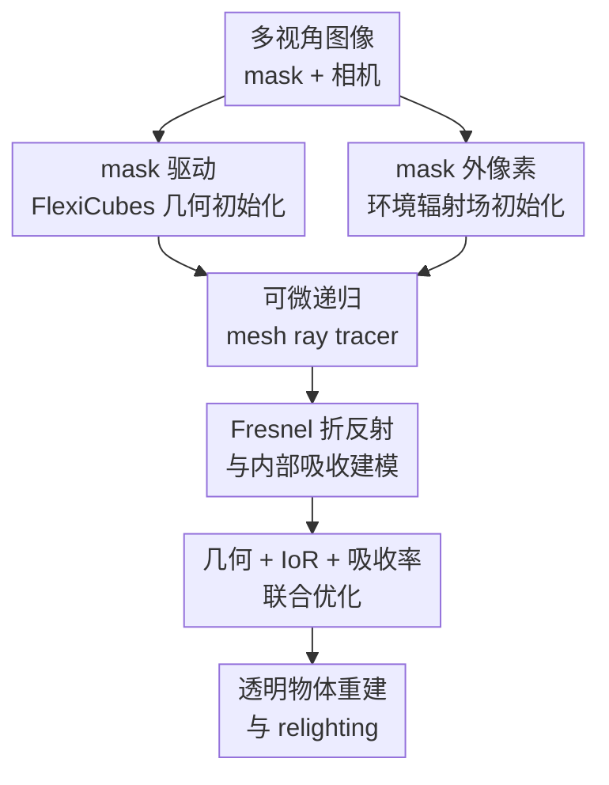

# DiffTrans: Differentiable Geometry-Materials Decomposition for Reconstructing Transparent Objects

**会议**: ICLR2026  
**OpenReview**: [https://openreview.net/forum?id=H4VySIfvZE](https://openreview.net/forum?id=H4VySIfvZE)  
**代码**: 待确认  
**领域**: 3D视觉  
**关键词**: 透明物体重建, 可微渲染, 折射率估计, 吸收材质, 多视角重建

## 一句话总结
DiffTrans 面向复杂拓扑和内部吸收纹理的透明物体，从多视角图像与 mask 中先初始化几何和环境光，再用可微递归 mesh ray tracer 端到端联合优化几何、折射率和吸收率，在合成与真实场景中取得更好的几何重建和 relighting 效果。

## 研究背景与动机
**领域现状**：透明物体重建一直是 3D 视觉里很难的一类 inverse rendering 问题。
不透明物体的外观主要由表面几何、反射材质和光照共同决定，而透明物体还会发生折射、反射、全内反射以及介质内部吸收。
多视角图像中的一个像素可能不是物体表面本身的颜色，而是环境光经过透明介质弯折、衰减、混合之后的结果。

**现有痛点**：已有方法大致可以分为 eikonal / neural field 路线和 surface / mesh 路线。
前者能描述折射路径，但由于缺少强几何约束，常常很难导出可靠 mesh，尤其面对孔洞、细节或复杂拓扑时容易产生不稳定形状。
后者更接近可编辑的显式几何，但很多方法假设透明物体只有理想透射、表面高光或表面材质，不能建模真实玻璃、树脂、宝石这类物体内部的有色吸收纹理。

**核心矛盾**：透明物体的外观同时受几何、环境和材料影响，三者高度耦合。
如果只优化几何，内部纹理会被错误解释成形状噪声；如果只优化表面材质，光在物体内部传播时的颜色衰减又无法表达；如果直接端到端从随机状态优化所有变量，透明渲染的不适定性会让训练很容易崩到局部最优。

**本文目标**：作者希望从多视角 RGB 图像、物体 mask 和相机参数中恢复透明物体的显式几何 mesh、整体折射率 IoR，以及空间变化的吸收率场。
恢复这些量之后，模型不只是能做 novel view synthesis，还能在新环境光下进行 relighting，说明它确实分解出了几何、材料和环境，而不是单纯记住训练视角外观。

**切入角度**：DiffTrans 采用 progressive training。
它先用 mask 和可微 rasterization 得到一个足够稳定的初始 mesh，同时用 mask 外区域学习环境辐射场；再用物理规则更强的递归 ray tracer，把折射、反射、介质吸收和环境采样串起来，对几何与材料做联合精修。
这个切入点的关键不是把所有物理现象都建到最复杂，而是在透明物体常见场景下保留最重要的折射和吸收，并用显式 mesh 保证结果可导出、可编辑。

**核心 idea**：用“mask 初始化几何与环境 + 可微递归光线追踪联合分解材质”的两阶段框架，替代只做表面重建或只做神经辐射场拟合的透明物体重建路线。

## 方法详解
DiffTrans 的输入是多视角图像、透明物体 mask 和相机参数，输出是透明物体的 mesh、全局折射率、空间变化吸收率，以及一个可用于背景/环境采样的环境辐射场。
论文显式做了三个简化假设：物体内部每一点使用一致的折射率，因此光线在物体内部直线传播；透明材质只由折射率和吸收率描述；表面为镜面透明表面，不建模 rough transparent surface。
这些假设限制了适用范围，但也让可微递归光追可以高效实现，并避免 eikonal 渲染带来的复杂路径求解。

### 整体框架
整个流程分成初始化阶段和精修阶段。
初始化阶段用多视角 mask 监督 FlexiCubes 提取初始透明物体 mesh，并用 mask 外像素训练环境光辐射场。
精修阶段把这个 mesh 放入一个递归 ray tracer 中：每条相机光线遇到物体表面时按 Fresnel 方程分成反射和折射分支，在物体内部按吸收率场累积光衰减，在物体外部从环境辐射场查询颜色，最后通过渲染误差反传来同时更新 mesh、IoR 和吸收率。

### 关键设计
**1. mask 驱动 FlexiCubes 几何初始化：先用轮廓约束给透明物体一个稳定可优化的显式起点**

透明物体的 RGB 外观太不可靠，直接从颜色监督开始优化几何会把环境纹理、折射失真和物体形状混在一起。
DiffTrans 因此先只用物体 mask 做几何初始化：把 FlexiCubes 作为 iso-surface 表示，通过可微 rasterizer 将 3D mesh 投影到 2D 图像平面，用渲染 mask $\hat{M}_i$ 和真实 mask $M_i$ 的 $L_1$ 损失监督初始形状。
这一阶段的主损失可以理解为 $L_{geo-init}=\frac{1}{N}\sum_{i\in B}\|\hat{M}_i-M_i\|_1$。

只靠 mask 会带来两个问题：一是 mask 内部没有直接几何梯度，mesh 容易出现裂缝和悬浮碎片；二是透明物体的孔洞、遮挡区域需要合理插值。
作者加入 dilation regularization，让随机采样点的 SDF 值整体向表面膨胀方向移动，帮助填补裂缝；再用深度图和法线图的一阶/二阶屏幕空间梯度做 smoothness regularization，压制高频噪声。
附录中还提到 BCE、表面积、developability、边法线等正则与 remeshing，用来让初始 mesh 既能适应复杂拓扑，又不至于变成破碎噪声。

**2. mask 外环境辐射场初始化：先把背景光照学出来，避免把环境误吸收到物体材质里**

透明物体看到的颜色很大一部分来自环境，物体本身只是改变了光的方向和强度。
如果环境没有被建模，优化器很容易把背景中的颜色变化错塞进吸收率或几何里，导致材质解释不可信。
DiffTrans 因此在初始化阶段并行训练一个 environment light radiance field，用粗 dense grid、细 triplane 和 proposal grids 表示环境，只使用 mask 外像素进行 NeRF-like 监督。

这个环境初始化的损失写作 $L_{env-init}=\sum_i \| (\hat{I}_i-I_i)\circ(1-M_i)\|_1$。
这里 $1-M_i$ 明确把透明物体区域排除掉，只让模型学习没有经过物体折射和吸收的背景外观。
后续 ray tracer 中，未击中物体的光线直接查询这个环境场；击中物体的光线在反射/折射递归结束后也会回到环境场采样，因此环境场是透明物体 appearance decomposition 的基准参照。

**3. Fresnel 折反射与内部吸收建模：把透明外观拆成方向改变和介质衰减两件事**

DiffTrans 的核心材质分解不是给表面贴一个颜色，而是把透明物体的成像过程拆成表面折反射和内部吸收。
当光线到达透明表面时，反射方向 $\omega_r$ 由入射方向和法线确定，折射方向 $\omega_t$ 由折射率比 $\eta$ 和 Snell/Fresnel 关系确定；如果 $\eta^2-\sin^2\theta_i<0$，就发生全内反射，只保留反射分支。
反射率 $R$ 与透射率 $T=1-R$ 由 Fresnel 方程给出，决定反射光和折射光如何混合。

物体内部的颜色变化则由吸收率场 $\mu_t(x)$ 控制。
论文把辐射传输简化为无散射的吸收模型：沿路径从 $x_0$ 到 $x$ 的辐射满足 $L(x,\omega)=L(x_0,\omega)\exp(-\int_{x_0}^{x}\mu_t(s)ds)$，离散实现为 $L(x,\omega)=L(x_0,\omega)\exp(-\sum_i\mu_t(x_i)\Delta x_i)$。
这一步使复杂内部有色纹理不再被硬塞到表面反射或几何凹凸里，而是作为体内吸收率被显式优化。

**4. 可微递归 mesh ray tracer：用物理渲染误差同时更新 mesh、IoR 和吸收率**

在精修阶段，每条相机光线被递归追踪，直到不再与透明物体相交或达到最大递归深度 $D_{max}$。
如果光线不击中物体，颜色来自环境辐射场；如果从外部击中物体，就在交点发出反射和折射两条递归光线，并用 Fresnel 权重混合；如果光线从物体内部击中表面，则在继续递归之前先根据内部路径上累积的吸收率衰减辐射。
这个过程把“看到什么颜色”明确连接到交点、法线、IoR、吸收率和环境光。

为了让 mesh 也能被颜色误差更新，论文对 ray-mesh intersection 做可微处理。
交点法线由三角形顶点法线按重心坐标插值，顶点法线又由相邻面法线平均得到；交点位置同样由顶点位置插值提供梯度。
因此，当渲染颜色偏离真实图像时，梯度不只会更新材质场，也能推回 mesh 顶点位置。
作者还把 ray tracer 实现在 OptiX 和 CUDA 中，降低递归光追的计算开销，这是让这套 analysis-by-synthesis 训练可用的重要工程点。

### 一个完整示例
假设输入是一组绕透明树脂摆件拍摄的多视角照片，照片中物体内部有红色或蓝色的吸收纹理，背景是室内环境。
第一阶段，DiffTrans 先从每张图的物体 mask 中得到大致轮廓：正面看到的外轮廓、侧面看到的厚度、部分孔洞都会通过 FlexiCubes 汇成一个初始 mesh。
与此同时，mask 外的桌面、墙面和光源区域被环境辐射场拟合，形成“如果没有透明物体遮挡，环境本来长什么样”的可查询表示。

第二阶段，从某个相机像素发出一条光线。
如果它先碰到透明表面，ray tracer 根据当前 mesh 法线和 IoR 计算一条反射光线和一条进入物体的折射光线。
折射光线在物体内部传播时，会在材质场中采样多个点，例如经过红色纹理区域时累积较大的红/绿/蓝通道不均衡吸收，辐射被按指数项衰减。
当这条光线从另一侧表面射出后，再去环境场中查询背景颜色。
最终像素颜色是反射分支、折射分支、内部吸收和环境颜色的合成结果；如果它与真实照片不一致，误差会反向推动 mesh 形状、IoR 和吸收率同时调整。

### 损失函数 / 训练策略
训练分为几何/环境初始化和 ray tracing 精修两大阶段。
初始化阶段的几何部分使用 mask 损失、SDF dilation、屏幕空间 smoothness、BCE、表面积和 developability 等正则，训练约 1000 iterations，并在后处理时对 FlexiCubes 提取的 mesh 做 remeshing 与进一步 mask 优化。
环境部分只用 mask 外像素训练环境辐射场，避免透明物体区域污染背景建模。

精修阶段联合优化 mesh 顶点、物体折射率和吸收率场。
颜色监督不是简单的 $\|\hat{c}-c\|_2^2$，而是使用 $L_{color}=\frac{1}{|B|}\sum_{i\in B}\| (\hat{c}_i-c_i)\cdot c_i\|_2^2$，用真实颜色对误差加权，减少过吸收像素带来的影响。
作者还加入 tone regularization：$L_{tone}=(1-\frac{\hat{c}\cdot c}{\|\hat{c}\|\|c\|})^2-var(c)$，约束预测颜色和真实颜色的通道比例，缓解错误背景导致的吸收率梯度偏差。
吸收率使用局部平滑正则 $L_{mat-smooth}=\frac{1}{N}\sum_{v_i}|\mu_t(v_i)-\mu_t(v_i+\xi_i)|$，总损失主项为 $L_{total}=\lambda_1L_{color}+\lambda_2L_{tone}+\lambda_3L_{mat-smooth}$。
附录中还加入体密度 $L_2$、mask consistency、edge normal 和 Laplacian 等周期性正则，用来稳定几何和材料。

## 实验关键数据

### 主实验
论文在 6 个合成场景上评估几何重建质量，其中 bunny/cow 来自 NEMTO 配置，monkey/horse/hand/mouse 来自透明物体重建数据；真实数据则由 iPhone 视频、COLMAP 相机位姿和 SAM 辅助 mask 构建。
几何指标使用 Chamfer Distance 和 F1-score，relighting 使用 PSNR、SSIM 和 LPIPS。

| 任务 | 指标 | DiffTrans | 之前SOTA / 对比方法 | 提升 |
|------|------|-----------|----------------------|------|
| 6 个合成场景几何重建平均 | CD $\times 10^{-4}$ ↓ | 3.264 | NU-NeRF 7.891 / NeRRF 13.341 / NeRO 36.022 | 相比最佳 baseline CD 约下降 58.6% |
| 6 个合成场景几何重建平均 | F1 $\times 10^{-1}$ ↑ | 8.386 | Ours(S1) 8.088 / NU-NeRF 8.026 / NeRRF 6.916 | 精修后比初始化阶段继续提高 0.298 |
| 合成场景 relighting 平均 | PSNR ↑ | 23.17 | NeRO 19.64 / NeRRF 19.25 | 比最佳 baseline 高 3.53 dB |
| 合成场景 relighting 平均 | LPIPS ↓ | 0.0678 | NeRRF 0.0812 / NeRO 0.0856 | 感知误差最低 |

IoR 估计也说明本文不是只做外观拟合。
在 horse、monkey、bunny、cow、hand、mouse 六个合成场景中，预测 IoR 分别为 1.540、1.577、1.471、1.472、1.484、1.462，对应 GT 为 1.450、1.600、1.485、1.472、1.485、1.375。
除了 horse 和 mouse 偏差略大，其余场景都非常接近真实折射率。

### 消融实验
论文主文重点消融 tone regularization，并报告 novel view synthesis 的 PSNR / SSIM / LPIPS。
这个正则的作用不是让每个数值都大幅提升，而是约束颜色通道比例，避免折射背景亮暗差异被错误解释为吸收率。

| 配置 | 场景 | PSNR ↑ | SSIM ↑ | LPIPS ↓ | 说明 |
|------|------|--------|--------|---------|------|
| w/o $L_{tone}$ | horse | 27.00 | 0.9208 | 0.0514 | 去掉色调约束后感知误差更高 |
| Full | horse | 27.03 | 0.9278 | 0.0457 | 三项均改善，尤其 LPIPS 更明显 |
| w/o $L_{tone}$ | monkey | 24.15 | 0.8942 | 0.0663 | SSIM 略高但 PSNR/LPIPS 更差 |
| Full | monkey | 24.62 | 0.8935 | 0.0631 | 颜色重建更稳，SSIM 小幅下降 |
| w/o $L_{tone}$ | hand | 22.37 | 0.8719 | 0.1481 | 去掉后 PSNR 和 LPIPS 都明显变差 |
| Full | hand | 23.39 | 0.8736 | 0.1420 | 对复杂纹理手部场景帮助较大 |

### 关键发现
- 只做第一阶段几何初始化已经能达到 CD 4.666、F1 8.088，但完整 DiffTrans 进一步达到 CD 3.264、F1 8.386，说明递归 ray tracer 的颜色监督确实能反过来精修几何。
- 对比 NeRRF、NeRO、NU-NeRF 时，DiffTrans 的优势主要出现在复杂拓扑和内部吸收纹理场景；baseline 容易出现表面粗糙、孔洞被填错、结构不准等问题。
- relighting 结果上，NeRRF 因为不恢复透明物体材质，NeRO 因为更偏反射物体且不能真实模拟折射，所以新光照下外观不可信；DiffTrans 恢复了吸收率和 IoR，因此更适合做场景编辑。
- tone regularization 的收益不是所有指标同向绝对提升，monkey 的 SSIM 有轻微下降；但大多数场景的 PSNR 或 LPIPS 改善，说明它更多是在稳定颜色比例和感知质量。
- 论文还展示不同 IoR 设置下 monkey 场景的重建结果，强调方法对 IoR 初始化或设置具有一定鲁棒性。

## 亮点与洞察
- 最大亮点是把“透明物体内部纹理”从表面材质里拿出来，显式建成吸收率场。很多透明重建方法只能处理清玻璃或表面反射，DiffTrans 对树脂、宝石、带内部颜色的装饰物更贴近真实需求。
- FlexiCubes 初始化很实用：透明物体 RGB 监督太混乱，但 mask 仍能提供强轮廓约束。先用轮廓得到可用 mesh，再让物理渲染精修，是一个很稳的 coarse-to-fine 思路。
- 环境场只用 mask 外像素训练这一点很关键。透明物体成像其实是在“看背景”，如果没有先把背景表示固定住，后续材质分解会缺少参照系。
- 可微递归 mesh ray tracer 让透明物体的物理路径和显式几何优化接在一起。相比纯 neural field，它的结果更可导出、更利于 relighting；相比传统 mesh optimization，它又能联合学习 IoR 和空间吸收。
- OptiX / CUDA 实现说明这篇论文不只是概念上可行，也考虑了递归光追训练的速度瓶颈。透明物体 reconstruction 如果每次反传都极慢，很难真正扩展到复杂场景。
- 这个框架的思想可以迁移到其他“外观由环境强耦合决定”的物体，例如半透明材料、折射液体容器、镜面混合透明物体，核心都是先拆环境，再用物理可微渲染解释物体本身。

## 局限与展望
- 论文假设每个透明物体内部折射率一致，因此光线在介质中直线传播。这对均质玻璃或树脂比较合理，但对折射率空间变化、分层材料、气泡或非均质介质会不够准确。
- 材质模型只包含 IoR 和吸收率，不包含散射、粗糙透明表面、微表面模型或偏振等现象。磨砂玻璃、浑浊液体、半透明蜡质材料可能不满足这个简化。
- 表面被假设为镜面透明表面，rough transparent object 的 inverse rendering 仍然没有解决。真实日用品常常有划痕、磨损、微小 roughness，这会影响 relighting 和材质分解。
- 方法依赖高质量多视角 mask、相机参数和比较完整的环境观测。真实采集时如果 mask 错、背景区域不足、COLMAP 位姿不准，环境场和几何初始化都会被连带影响。
- 实验的主消融在主文里相对集中于 tone regularization，其他组件如 dilation、环境初始化、吸收率平滑、周期性几何正则主要放在附录或定性分析中。若要更清楚地判断各组件贡献，还可以增加系统性 ablation 表。
- 未来可以考虑放宽均质 IoR 假设，建模空间变化折射率或多层透明结构；也可以加入 roughness / scattering，把可处理对象从“清透带吸收”扩展到更广泛的半透明材质。

## 相关工作与启发
- **vs NeRRF**: NeRRF 使用 neural refractive-reflective fields 做透明/高光物体的 3D 重建和视图合成，但它对显式 mesh 与内部吸收纹理的表达有限。DiffTrans 用 mesh ray tracing 和吸收率场把几何、IoR、内部材质同时恢复出来，因此在复杂纹理透明物体和 relighting 上更强。
- **vs NU-NeRF**: NU-NeRF 关注 uncontrolled capture environment 下的 nested transparent objects，并能处理嵌套透明结构，但它主要建模表面相关材质。DiffTrans 的重点是内部 absorptive texture，适合带体内颜色衰减的透明物体。
- **vs NeRO**: NeRO 是反射物体的 neural geometry and BRDF reconstruction，适合镜面反射类对象；透明物体的关键是折射和内部传播，NeRO 不模拟完整折射过程，所以 relighting 结果不够真实。
- **vs TransparentGS**: TransparentGS 用 3D Gaussian Splatting 做快速透明物体 inverse rendering，更偏高效点表示和表面/光照建模。DiffTrans 选择显式 mesh 与递归光追，训练可能更重，但更直接服务于几何导出和物理可解释材质分解。
- **启发**: 对高度不适定的 inverse rendering 问题，可以先用可靠弱监督得到稳定结构，再让更物理的 differentiable renderer 细化难变量。这个策略比从头端到端优化所有变量更容易收敛，也更适合复杂透明、反射、半透明等强环境耦合对象。

## 评分
- 新颖性: ⭐⭐⭐⭐⭐ 将 FlexiCubes 初始化、环境辐射场和可微递归 mesh ray tracer 组合起来恢复透明物体几何、IoR 与内部吸收率，问题设定和系统整合都很有辨识度。
- 实验充分度: ⭐⭐⭐⭐☆ 合成与真实数据、几何和 relighting 都覆盖到了，关键数字清楚；但主文中部分组件消融还可以更系统。
- 写作质量: ⭐⭐⭐⭐☆ 方法链路从初始化到光线追踪比较完整，公式也给得足；附录细节较多，读者需要来回对照才能完全复现训练策略。
- 价值: ⭐⭐⭐⭐⭐ 透明物体重建长期难做，DiffTrans 给出了可导出 mesh、可解释材质和可 relighting 的统一方案，对 3D 重建、可编辑资产生成和物理可微渲染都有参考价值。

<!-- RELATED:START -->

## 相关论文

- [\[CVPR 2026\] Opti-NeuS: Neural Reconstruction for Dual-Layered Transparent and Opaque Objects](../../CVPR2026/3d_vision/opti-neus_neural_reconstruction_for_dual-layered_transparent_and_opaque_objects.md)
- [\[CVPR 2026\] RHINO: Reconstructing Human Interactions with Novel Objects from Monocular Videos](../../CVPR2026/3d_vision/rhino_reconstructing_human_interactions_with_novel_objects_from_monocular_videos.md)
- [\[CVPR 2025\] PICO: Reconstructing 3D People In Contact with Objects](../../CVPR2025/3d_vision/pico_reconstructing_3d_people_in_contact_with_objects.md)
- [\[CVPR 2026\] 3DReflecNet: A Large-Scale Dataset for 3D Reconstruction of Reflective, Transparent, and Low-Texture Objects](../../CVPR2026/3d_vision/3dreflecnet_a_large-scale_dataset_for_3d_reconstruction_of_reflective_transparen.md)
- [\[ICLR 2026\] MultiMat: Multimodal Program Synthesis for Procedural Materials using Large Multimodal Models](multimat_multimodal_program_synthesis_for_procedural_materials_using_large_multi.md)

<!-- RELATED:END -->
