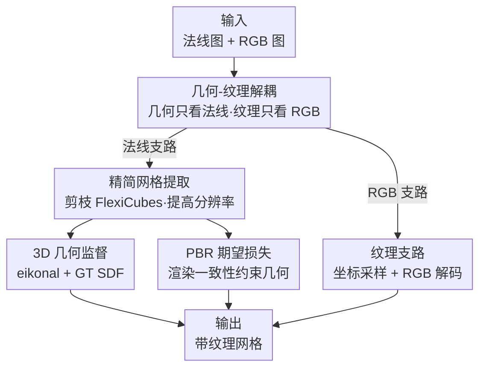

# DiMeR: Disentangled Mesh Reconstruction Model with Normal-only Geometry Training

**会议**: ICLR2026  
**OpenReview**: [https://openreview.net/forum?id=fK2pCgoavb](https://openreview.net/forum?id=fK2pCgoavb)  
**代码**: 有（项目页公开，论文标注 Project Page）  
**领域**: 3D视觉  
**关键词**: 网格重建, 几何纹理解耦, 法线图, 前馈式 LRM, 3D 监督

## 一句话总结
DiMeR 把"从稀疏视图前馈重建网格"拆成两条互不干扰的支路——几何只看法线图、纹理只看 RGB 图，再给几何支路配上精简版 FlexiCubes 提取器和真正的 3D 监督（eikonal + GT SDF + PBR 期望损失），在 GSO / OmniObject3D 上把 Chamfer Distance 降低 30% 以上。

## 研究背景与动机

**领域现状**：自 LRM 把"单图前馈生成 NeRF"跑通后，一大批工作（InstantMesh、MeshLRM、PRM 等）把这条路从 NeRF 表示扩展到网格表示，做法基本是：ViT 编码多视图 RGB → Triplane 解码出特征 → 提取 SDF grid → 用 FlexiCubes 这类可微等值面算法抽出网格 → 用可微光栅化渲染做监督。这套"前馈 + RGB 输入 + FlexiCubes"的范式已成主流。

**现有痛点**：作者指出这套范式有两个顽疾。第一，**纹理会掩盖几何**——视觉上看起来很合理的渲染图，背后可能是错误的几何配上"凑出来"的纹理。也就是说，同一张 RGB 图在"几何-纹理联合解空间"里对应着多个等价可行解，网络学到的是这些解的过度平滑平均值。第二，**FlexiCubes 这条提取链既冗余又不稳**：它定义的 SDF grid 只保证符号正负有意义（用于抽面），并不是真正的 SDF，因此很难施加 3D 监督；它的两个 MLP（顶点/边权重网络、网格形变网络）算力开销巨大却收益甚微；它自带的正则损失会让训练在万次迭代左右就崩。

**核心矛盾**：根子在于用 RGB 作为几何的输入信号本身就带歧义——RGB 同时编码了几何和外观，网络无从分辨一处明暗变化到底是形状起伏还是材质花纹，于是几何和纹理的优化目标在同一个解空间里互相打架（one-to-many 的病态映射）。

**本文目标**：(1) 消除几何重建时的输入歧义；(2) 把网格提取链做轻、做稳，并让它能吃 3D 监督。

**切入角度**：作者抓住一个朴素但关键的归纳偏置——**法线图与几何严格一致**。法线由表面唯一决定、忠实编码局部曲面朝向变化，不像 RGB 那样混入外观。基于奥卡姆剃刀，既然法线能无歧义地决定几何，就该只拿法线喂几何支路。

**核心 idea**：把纠缠的几何-纹理联合解空间**解耦**成两个独立空间——几何只由法线图预测、纹理只由 RGB 图预测，各自配专属监督；同时精简 FlexiCubes 并换上真正基于 3D 的正则与监督。借助现成的法线预测基础模型（Lotus / StableNormal，200ms 即可出图），DiMeR 对外仍然只需 RGB 输入，与基线接口一致。

## 方法详解

### 整体框架
DiMeR 是一个双支路的前馈网格重建模型：上面是**几何支路**，只吃法线图，负责把形状重建出来；下面是**纹理支路**，只吃 RGB 图，负责给已重建的形状刷色。两条支路结构对称（都是 ViT 编码 → Triplane 解码），但输入、监督、产物完全分离，最后合成一个带纹理的网格。

几何支路：$K$ 个随机视角的法线图 $N \in \mathbb{R}^{K\times H\times W\times 3}$ 加上相机嵌入 $\zeta$，经 ViT 法线编码器得到 patch 特征，再用 Triplane 解码器汇聚成三平面特征 $F_g$，从中抽出 SDF grid，交给精简版 FlexiCubes 提取出网格的顶点与面。重建出的（无纹理）网格可被光栅化成任意视角的法线/深度/掩码图，还能在随机环境光与随机材质下做 PBR 渲染出高光/漫反射光照图，用于施加监督。纹理支路：RGB 图 $I$ 同样经 ViT 图像编码器 + Triplane 解码器得到三平面特征 $F_c$；拿几何支路给出的网格顶点光栅化出每像素的全局坐标 $\text{Coord}_I$，在 $F_c$ 上按坐标采样得到逐像素纹理特征 $F_I$，最后用 RGB 解码器解出颜色。

### 关键设计

**1. 几何-纹理解耦：让几何只看法线，斩断 RGB 带来的歧义**

这是全文的灵魂，直接对治"纹理掩盖几何"和"训练目标冲突"两大痛点。既然同一张 RGB 在联合解空间里对应多个可行解、逼网络学平均值，作者干脆把联合解空间一刀切成两个独立空间：几何支路**只**接收法线图作为输入，纹理支路只接收 RGB。法线由表面唯一决定、无外观歧义，几何输入到输出的对应关系因此变得清晰，训练复杂度下降。监督也随之解耦——几何支路只用几何相关损失（法线、深度、掩码、SDF、PBR），彻底丢掉会引入歧义的 RGB 渲染项；纹理支路只用 RGB 损失 $L_t = (\hat I - I_{GT})^2 + \text{LPIPS}(\hat I, I_{GT})$。消融（表 3）直接印证：从"RGB+法线→几何"换成"仅法线→几何"，CD 从 0.041 骤降到 0.028，证明丢掉 RGB 输入与监督反而带来巨大增益。

**2. 精简网格提取：剪掉 FlexiCubes 里性价比最低的两个 MLP**

原版 FlexiCubes 需要两个 MLP：一个输出每条边/每个顶点的权重，一个输出网格的形变量。对 $N^3$ 的网格而言，这意味着要算 $N^3$ 个顶点形变、$12N^3$ 条边和 $8N^3$ 个顶点的权重，算力和显存开销极大。作者通过实验（表 5）发现：从预训练模型里**直接移除**这两个网络，CD/F1 几乎不掉（0.045/0.964 → 0.045/0.963），但显存从 73GB 降到 48GB、推理从 0.5s 降到 0.2s（约 2.5× 算力、1.5× 显存的节省）。省下来的预算被用于**提高提取分辨率**，从而重建更精细的细节。这是典型的"用性价比分析做减法"——对本任务而言冗余的组件就该砍掉。

**3. 3D 几何监督：用 eikonal 损失 + GT SDF 把伪 SDF 变成真 SDF**

FlexiCubes 的 SDF grid 只保证符号有意义，并非真正的距离场，且自带的三个正则损失会让训练在万次迭代左右崩溃。作者换上 **eikonal 损失**把整个空间正则成真正的 SDF 场——要求 SDF 对坐标的梯度模长归一化为 1：

$$L_{eik} = \mathbb{E}_x\big(\|\nabla_x \text{SDF}(x)\|_2 - 1\big)^2,\quad x \sim \text{Uniform}(-1,1)$$

直接对 $N^3$ 个 grid 点求导既贵又易在特定位置过拟合，于是作者改成**随机采样**位置算期望（每次迭代采 200K 个点）来近似。同时用 GT 网格算出的 SDF 真值直接监督 grid 顶点：$L_{sdf} = \|\text{SDF}(v) - \text{SDF}_{GT}(v)\|_2^2$（并缓存每个物体的 SDF 真值以省开销）。换上这套后训练才能稳定跑过 10000 次迭代收敛，这是"让几何提取链能吃 3D 监督"的关键一步。

**4. PBR 期望损失：用"任意光照下都渲染正确"来反推几何正确**

灵感来自光度立体（Photometric Stereo）：如果一个网格在各种环境光、各种材质下渲染出的高光图与漫反射图都能对上真值，那它的几何就必然是对的。作者据此引入 PBR 期望损失，把预测网格 $\hat O$ 放进随机采样的环境 $e$、金属度 $m$、粗糙度 $r$ 下渲染，约束其与真值网格 $O$ 的渲染结果一致：

$$L_{spec} = \mathbb{E}_{e,m,r}\Big[\|\text{Spec}(\hat O,e,m,r) - \text{Spec}(O,e,m,r)\|^2 + \text{LPIPS}(\cdot)\Big]$$

漫反射项 $L_{diff}$ 同理。这等于给几何加了一层"统计期望"约束——单一光照下错误几何或许能蒙混过关，但要在随机采样的多种光照/材质下都渲染一致，几何就没有作弊空间。几何支路的总损失为 $L_g = L_{eik} + L_{sdf} + L_{spec} + L_{diff} + L_{nor} + L_{dep} + L_{mask}$。

### 损失函数 / 训练策略
几何支路用法线损失 $L_{nor} = M_{GT}\otimes(1 - \hat N\cdot N_{GT})$、深度损失 $L_{dep} = M_{GT}\otimes|\hat D - D_{GT}|$、掩码损失 $L_{mask} = (\hat M - M_{GT})^2$，加上上文的 eikonal、GT SDF、PBR 期望损失共同监督；纹理支路只用 RGB + LPIPS 损失。训练数据为按网格质量过滤后的 Objaverse 共 98,526 个物体，输入视角随机采样并对相机嵌入加轻微噪声以增强对任意视向的鲁棒性，训练时还对输入法线图注入噪声以适配推理时基础模型预测法线的误差。

## 实验关键数据

### 主实验
GSO / OmniObject3D 稀疏视图重建（6 个随机视角输入），CD 越低越好：

| 数据集 | 方法 | CD ↓ | F1 ↑ | PSNR ↑ | LPIPS ↓ |
|--------|------|------|------|--------|---------|
| GSO | InstantMesh | 0.045 | 0.964 | 18.51 | 0.150 |
| GSO | PRM | 0.041 | 0.977 | 21.68 | 0.126 |
| GSO | DiMeR (StableNormal) | 0.032 | 0.988 | 22.89 | 0.103 |
| GSO | **DiMeR (GT 法线)** | **0.028** | **0.992** | **23.40** | **0.095** |
| OmniObject3D | PRM | 0.034 | 0.991 | 21.65 | 0.135 |
| OmniObject3D | **DiMeR (GT 法线)** | **0.024** | **0.996** | **23.04** | **0.112** |

用 GT 法线时 GSO 上 CD 较 PRM 降低约 31.7%，即便用预测法线也有约 22% 增益；单图到 3D 任务（表 2）DiMeR CD 0.052 同样优于 PRM 0.059。

### 消融实验

| 配置 | CD ↓ | F1 ↑ | 说明 |
|------|------|------|------|
| RGB+法线 → 几何+纹理 | 0.043 | 0.976 | 完全纠缠 |
| RGB+法线 → 几何 | 0.041 | 0.981 | 几何纹理输出分开 |
| **仅法线 → 几何（本文）** | **0.028** | **0.992** | 输入也解耦 |
| w/o 3D 正则（Eq.1-2） | 0.037 | 0.975 | 去掉 eikonal+GT SDF |
| w/o PBR 期望（Eq.3-4） | 0.039 | 0.973 | 去掉 PBR 损失 |
| 完整模型 | 0.028 | 0.992 | — |

FlexiCubes 两个 MLP 的消融（表 5）：移除后 CD/F1 几乎不变（0.045→0.045 / 0.964→0.963），但显存 73GB→48GB、推理 0.5s→0.2s。

### 关键发现
- **解耦的增益主要来自"丢掉 RGB 输入"**：几何/纹理输出分开只把 CD 从 0.043 拉到 0.041，而进一步把几何输入也限制为仅法线，才让 CD 跳到 0.028——说明真正治本的是输入端的歧义消除，而非单纯拆输出头。
- **3D 监督与 PBR 损失各自都不可省**：去掉任一项 CD 都明显回升（0.037 / 0.039），二者从"距离场正确性"和"光照渲染一致性"两个互补角度约束几何。
- **FlexiCubes 的两个 MLP 是纯负担**：对前馈重建任务而言性价比极低，剪掉后省下的预算换更高分辨率反而更划算。

## 亮点与洞察
- **"换输入信号"比"改网络结构"更治本**：DiMeR 没有发明新的几何骨干，只是把几何支路的输入从 RGB 换成法线，就消掉了困扰整个前馈重建范式的解空间歧义。这种"从问题定义层面解耦，而非在病态映射上硬怼容量"的思路可迁移到任何输入信号天然带歧义的重建任务。
- **用 PBR 渲染一致性当几何监督很巧**：把"几何对不对"转化为"任意光照材质下渲染对不对"，相当于用物理可微渲染构造了一个无法作弊的几何检验器，比单视角法线监督更强。
- **对既有组件做性价比审计**：直接把 FlexiCubes 的两个 MLP 砍掉换分辨率，是很实用的工程洞察——不是所有"通用强力"的模块在特定任务里都值得保留。
- **接口向后兼容**：靠现成法线基础模型补齐法线，DiMeR 对外仍只需 RGB，既享受法线输入的红利又不增加用户负担，且会随法线模型进步而持续受益。

## 局限与展望
- **强依赖法线预测质量**：DiMeR (GT) 与 DiMeR (预测法线) 之间存在可见差距（GSO CD 0.028 vs 0.032），几何上限被外部法线基础模型卡住；法线模型在反光/透明/复杂材质上失准时几何会跟着退化。
- **单图到 3D 仍受多视图扩散制约**：该任务先用 zero123++/Era3D 生成多视图，再预测法线，误差会沿管线累积；论文也只挑了 500 个"相对清晰"的样本评测，说明病态视角下表现存疑。
- **未充分讨论拓扑复杂物体**：定性比较里强调了孔洞、环状结构的优势，但对极薄结构、高亏格物体缺乏定量分析。
- **改进方向**：可探索几何支路端到端联合训练法线预测器以闭合误差回路，或引入不确定性估计在法线不可靠区域回退到 RGB 弱监督。

## 相关工作与启发
- **vs InstantMesh / PRM / MeshLRM**：它们都用 RGB 多视图直接喂前馈网络抽网格，受困于几何-纹理纠缠与 FlexiCubes 不稳定；DiMeR 在输入端解耦（仅法线做几何）+ 提取链做减法 + 3D 监督，CD 大幅领先。
- **vs Hi3DGen**：同样发现"只用法线能提升几何质量"，但 Hi3DGen 走的是扩散模型路线、慢；DiMeR 是前馈式，几百毫秒级且支持动态视图数。
- **vs Trellis（3D 扩散）**：Trellis 质量高但常与输入图不一致（孔洞数/柱子数对不上）；DiMeR 作为重建模型对输入对齐更好。
- **vs FlexiCubes 原版**：DiMeR 保留其可微等值面提取能力，但剪掉权重/形变 MLP、换 eikonal + GT SDF 正则，把"伪 SDF + 易崩训练"修成"真 SDF + 稳定可监督"。

## 评分
- 新颖性: ⭐⭐⭐⭐ 从解空间歧义的根因出发做几何-纹理解耦，视角新颖且有说服力
- 实验充分度: ⭐⭐⭐⭐ 三类任务全覆盖 + 多组关键消融，但单图任务仅挑选样本评测略有保留
- 写作质量: ⭐⭐⭐⭐ 动机推导清晰，图 2 把痛点讲得很直观
- 价值: ⭐⭐⭐⭐ 30%+ 的 CD 降幅 + 即插即用的法线接口，对前馈网格重建有实用参考价值

<!-- RELATED:START -->

## 相关论文

- [\[ICLR 2026\] YoNoSplat: You Only Need One Model for Feedforward 3D Gaussian Splatting](yonosplat_you_only_need_one_model_for_feedforward_3d_gaussian_splatting.md)
- [\[ICLR 2026\] PAGE-4D: VGGT-4D Perception via Disentangled Pose and Geometry Estimation](page-4d_vggt-4d_perception_via_disentangled_pose_and_geometry_estimation.md)
- [\[ICML 2026\] Future Dynamic 3D Reconstruction: A 3D World Model with Disentangled Ego-Motion](../../ICML2026/3d_vision/future_dynamic_3d_reconstruction_a_3d_world_model_with_disentangled_ego-motion.md)
- [\[CVPR 2025\] Feature-Preserving Mesh Decimation for Normal Integration](../../CVPR2025/3d_vision/feature-preserving_mesh_decimation_for_normal_integration.md)
- [\[ICLR 2026\] ReLi3D: Relightable Multi-View 3D Reconstruction with Disentangled Illumination](reli3d_relightable_multi-view_3d_reconstruction_with_disentangled_illumination.md)

<!-- RELATED:END -->
