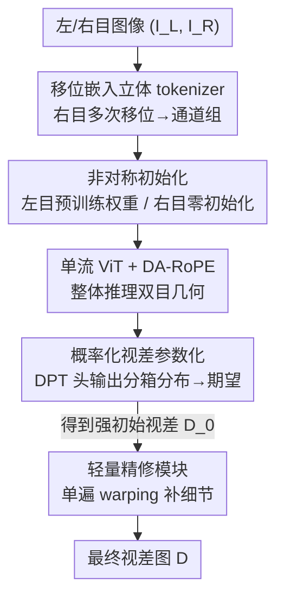

# DispViT: Direct Stereo Disparity Regression with a Single-Stream Vision Transformer

**会议**: ICLR2026  
**OpenReview**: [https://openreview.net/forum?id=c21yqwf02V](https://openreview.net/forum?id=c21yqwf02V)  
**代码**: https://github.com/aeolusguan/DispViT  
**领域**: 3D视觉 / 立体匹配  
**关键词**: 立体视差估计, 单流 ViT, 直接回归, 立体 tokenization, 相对位置编码

## 一句话总结
DispViT 抛弃立体匹配领域几十年的"构造代价体 + 迭代精修"范式，改用一个单流 ViT 把左右目图像 token 化成同一序列后**直接回归视差**，靠移位嵌入 tokenizer、非对称初始化、概率化视差参数化和视差感知 RoPE 这几个轻量设计撑起来，在 Scene Flow 等基准上达到 SOTA 精度，且对遮挡、反光、透明等匹配歧义场景明显更鲁棒、更快。

## 研究背景与动机
**领域现状**：深度立体视差估计长期被"匹配中心（matching-centric）"范式统治。主流做法（GC-Net、PSMNet、RAFT-Stereo、IGEV 等）都是先分别提取左右目特征，再显式建立像素级对应——要么构造 3D/4D 代价体（cost volume）用 3D 卷积聚合，要么用循环解码器在多尺度相关空间里迭代精修视差。

**现有痛点**：匹配本身在视觉歧义场景下是**病态**的。遇到透明、遮挡、重复纹理、非朗伯表面（反光）时，左右目根本找不到可靠对应，会产生错误匹配；更糟的是，这些错误匹配很难靠后续的局部精修救回来，导致整条管线在最需要鲁棒性的场景里反而最脆弱。

**核心矛盾**：问题的根子在"显式匹配"这个动作本身——只要还在做像素级相关搜索，就绕不开歧义区的错误对应。而近期一批混合方法（DEFOM-Stereo、Monster、BridgeDepth）已经隐约指明出路：它们用**单目深度回归**给迭代精修做初始化，单目回归天然不依赖匹配、因此对歧义免疫，能大幅提升鲁棒性。这说明"回归"这条路比"匹配"更抗歧义。

**本文目标**：能不能干脆把匹配整个环节去掉，直接从双目输入回归视差？这需要解决两个子问题：(1) 怎么把左右目图像 token 化喂给 ViT，才能让单流网络有效推理双目几何；(2) 怎么让直接回归这件"传统上被认为病态"的事训练得稳、精度够。

**切入角度**：ViT 的全局注意力在单目深度、前馈 3D 重建这类几何回归任务上已经很能打，但在立体网络里 ViT 一直只被当成特征提取器塞进匹配管线，它"直接回归视差"的潜力没人挖。早年 DispNetS 试过把左右目沿通道拼接让 CNN 回归视差，思路优雅但被卷积的局部感受野卡死，推不动大视差和复杂全局上下文。ViT 的全局注意力恰好能补上这个短板。

**核心 idea**：用一个**单流 ViT 直接回归视差**取代"代价体 + 迭代匹配"，把立体匹配重新表述为整体回归（holistic regression）问题——单流主干给出强初始视差，再用一个轻量精修模块补细节。

## 方法详解

### 整体框架
给定校正后的双目对 $(I_L, I_R) \in \mathbb{R}^{H\times W\times 3}$，目标是预测左视图视差图 $D \in \mathbb{R}^{H\times W}$。DispViT 把整条流程写成 $\hat{D}_0 = \text{DPT}\big(\Phi \circ \mathcal{T}(I_L, I_R)\big)$：先用立体 tokenizer $\mathcal{T}$ 把双目输入融合成**一条** token 序列，再用带视差感知 RoPE 的单流 ViT $\Phi$ 做全局推理，最后 DPT 头融合多尺度特征回归出初始视差 $\hat{D}_0$，再交给轻量精修模块锐化成最终 $\hat{D}$。

整条管线分四步：① 立体 tokenization——左视图用预训练 PatchEmbed、右视图用移位嵌入 + 非对称初始化，逐像素相加成单序列；② 单流 ViT 主干（DINOv2/DAv2 初始化）配 DA-RoPE 做整体推理；③ DPT 头 + 概率化参数化输出初始视差；④ 单遍几何 warping 的轻量精修补细节。整个过程**没有任何显式代价体或相关搜索**，匹配这一步被彻底跳过。

### 关键设计

**1. 移位嵌入立体 tokenizer：把对齐线索编进通道、又不退化成代价体**

直接把左右目沿通道拼接喂给 ViT 有个致命问题：大视差会造成 token 级的**预注意力错位**——同一个 token 位置上，左目和右目其实来自图像里毫不相关的区域，拼起来等于混入噪声，ViT 看到的输入本身就是坏的。作者的解法是给右图预设一组水平移位偏移 $\{s_k\}_{k=1}^K$，每个偏移量 $s_k$ 把右图平移后过一个专属卷积 $E_R^k$，得到一组通道：$T_R^{(k)} = E_R^k\big(\text{Shift}(I_R, s_k)\big)$。这些通道沿通道维拼成右视图嵌入 $T_R = \text{Concat}(\{T_R^{(k)}\})$，左视图照常用预训练 PatchEmbed $E$ 得到 $T_L$，最后逐像素相加 $T = T_L + T_R$。这样每个空间 token 就内嵌了"一谱系的潜在对齐假设"，让 ViT 在大位移下也有迹可循。实现上 $T_R$ 用分组卷积一次算完，开销几乎可忽略。关键澄清：移位嵌入**既不构造也不近似代价体**——它不做任何 pairwise 特征相似度计算、不做相关聚合，只是把粗粒度对齐线索编进通道组当作"对齐先验"，视差仍由 ViT 直接回归出来。实验里 $K=8$、每次移 24 像素，每个移位视图占 $d/8$ 通道。

**2. 非对称初始化：让模型从第一层就把左右目区分开**

把单视图 PatchEmbed 改成处理双目输入时，最自然的做法（如 Marigold 适配 Stable Diffusion 那样）是复制卷积权重再乘 1/2。但作者发现这种对称初始化效果明显差。他们改用"半零"初始化：新卷积核由**原预训练权重拼接一个等形状的零张量**构成，而不是复制减半。直觉是这给了一个关键的归纳偏置——预训练那一支把左视图当成清晰稳定的参考，零初始化那一支被迫去学习"补充参考的右视图专属特征"。这种不对称迫使模型从训练第一层就区分两个视图，避免早期退化；对称初始化天生缺这个性质。在移位 tokenizer 里同样沿用：左目 $E$ 保留预训练权重，右目 $\{E_R^k\}$ 全部零初始化。消融显示去掉它 EPE 从 0.89 涨到 0.97（约 +10%）。

**3. 概率化视差参数化：把回归变成分箱分布、稳住训练**

直接回归一个标量视差值训练不稳。作者把视差范围离散成均匀分箱，让 DPT 头输出**分箱上的概率分布**（受 Zholus 等启发），最终视差取峰值概率附近局部窗口内的期望。这么做有两个好处：一是天然契合"视差有界"的事实，给了结构良好的输出空间；二是能在歧义区表达不确定性，而不是硬塌缩成一个标量。训练用组合损失：离散分布的交叉熵 + 连续估计的 L1，$L_{regress} = \text{CE}\big(P, \text{bilinear}(D^*)\big) + \lambda_1 L_1(\hat{D}_0, D^*)$，其中 $\text{bilinear}(D^*)$ 把真值视差双线性分配到离散箱。实现用 128 个箱均匀划分 $[0, 381]$、$\lambda_1=0.1$。作者明确指出这是整个架构里**最重要的组件之一**：消融里去掉它 EPE 从 0.89 暴涨到 1.07（约 +17% 退化），代价是约 30% 延迟开销。

**4. 视差感知 RoPE（DA-RoPE）：把平移等变性灌进 value 通路**

DINOv2 默认用可学习的绝对位置编码（APE），但作者发现 APE 不适合视差回归——视差本质是一个**相对偏移**，而 APE 只编码绝对坐标、缺乏捕捉相对位移的机制（缺平移等变性）。换成 RoPE 后注意力依赖相对偏移而非绝对坐标，天然契合"视差表现为水平平移"的立体几何，单这一换就带来显著增益。但标准 RoPE 只让注意力权重平移等变，**value 向量仍对相对位置无感**。而对视差估计来说，一个特征的语义本就和它相对观察者的位置绑定。于是作者提出 DA-RoPE，把相对位置也注入 value：每个 $v_j$ 先按其位置 $R(p_j)$ 旋转、按注意力权重聚合、再按 query 位置反旋 $R(-p_i)$，

$$\tilde{z}_i = R(-p_i)\Big(\sum_j \alpha_{ij}R(p_j)v_j\Big) = \sum_j \alpha_{ij}R(p_j - p_i)v_j$$

等价于聚合前先把每个 $v_j$ 按相对位置 $p_j - p_i$ 旋转——相当于在 query 的局部参考系里重新表达特征再聚合，让注意力权重和聚合特征**双双视差感知**。配合非对称频率（水平方向用 1000、垂直方向用 100）更好编码水平位移，addition 消融里 +DA-RoPE、+非对称频率把 EPE 从 0.84 一路降到 0.76。

### 损失函数 / 训练策略
单流回归主干先用组合损失（式 4，交叉熵 + L1）在 FSD、Scene Flow、TartanAir、CREStereo、InStereo2K 等混合数据集上预训练，得到一个鲁棒的直接视差回归器；随后**冻结 ViT 回归器**、按 NMRF 协议单独训练精修模块（解耦两阶段训练）。这种解耦让 ViT 回归器既能作为独立模型直接部署到对效率敏感的场景，也能无缝接外部精修补细节。精修模块借自 NMRF，但只保留其特征提取器和精修网络，丢掉视差提议网络和多假设推理，专注"单遍 warping 锐化"而非 RAFT 式的迭代代价体索引。

## 实验关键数据

### 主实验
Scene Flow 测试集（限制真值视差 ≤ 192 像素）：单流 DispViT 已能和领先匹配方法掰手腕，接上约 25ms 的轻量精修后 DispViT+ 全面超越。

| 方法 | 类型 | EPE ↓ | BP-1 ↓ | 时间(s) |
|------|------|------|--------|---------|
| RAFT-Stereo | 匹配 | 0.56 | 6.63 | 0.40 |
| Selective-IGEV | 匹配 | 0.44 | 4.98 | 0.25 |
| NMRF | 匹配 | 0.45 | 4.50 | 0.10 |
| DEFOM-Stereo | 混合 | 0.42 | 5.10 | 0.63 |
| BridgeDepth | 混合 | 0.37 | 3.67 | 0.14 |
| **DispViT** | 回归 | 0.53 | 5.30 | **0.092** |
| **DispViT+** | 回归+精修 | **0.34** | **3.50** | 0.118 |

关键点：精修模块直接借自 NMRF，但 DispViT+ 比 NMRF 整整高 +24%，说明增益来自 DispViT 作为可靠回归先验的**鲁棒性**，而非精修架构本身。

零样本跨域泛化（在四个真实数据集训练集上直接评测，无 dataset-specific 微调）：

| 方法 | KITTI-12 (D1) | KITTI-15 (D1) | Middlebury (BP-2) | ETH3D (BP-1) |
|------|---------------|---------------|-------------------|--------------|
| NMRF | 4.2 | 5.1 | 7.5 | 3.8 |
| DEFOM-Stereo | 3.8 | 5.0 | 5.7 | 2.4 |
| BridgeDepth | 3.6 | 4.5 | 4.3 | 1.3 |
| DispViT | 3.9 | 4.1 | 5.5 | 4.9 |
| **DispViT+** | 3.2 | 3.5 | 2.4 | 2.3 |

DispViT+ 在 KITTI 和 Middlebury 上很有竞争力；ETH3D 上略弱（注：ETH3D 对非朗伯表面缺真值，恰是鲁棒性最关键处）。

### 消融实验
ViT-B 主干、Scene Flow 训练，分"移除研究"（从含 DAv2+概率参数化+RoPE+非对称初始化的 baseline 里逐一拿掉）和"添加研究"（往 baseline 逐步加）。

| 配置 | EPE ↓ | BP-1 ↓ | 说明 |
|------|-------|--------|------|
| Baseline (ViT-B) | 0.89 | 10.05 | 含 DAv2+概率+RoPE+非对称初始化 |
| - 从零训练 (无 DAv2) | 1.81 | 20.13 | 退化最惨，明显过拟合 |
| - 无概率参数化 | 1.07 | 15.56 | 掉约 17%，最重要组件之一 |
| - 无非对称初始化 | 0.97 | 11.88 | 掉约 10% |
| - 无 RoPE（用 APE） | 0.96 | 13.34 | 掉约 10% |
| + shift-embedding | 0.84 | 9.22 | 逐步添加，改善大视差 |
| + DA-RoPE | 0.82 | 8.84 | 同上 |
| + 非对称频率 | 0.76 | 8.27 | 三者累计 +15% |

### 关键发现
- **大规模预训练是基石**：从零训练 EPE 直接从 0.89 飙到 1.81，预训练不仅帮收敛，更是强力正则；DAv2 初始化比 DINOv2 略好，说明几何感知预训练对立体视差更有利。
- **概率化参数化贡献最大**：去掉它退化约 17%（最严重的单组件），代价是约 30% 延迟。
- **移位嵌入有小 trade-off**：它显著改善大视差，但在小视差（< 32 像素）上略掉精度——因为每个移位视图分到的通道容量变小，损了小位移所需的细粒度细节。
- **残留失败模式**：DispViT 对玻璃反射造成的强镜面视觉错觉仍会失败，这类样本在现有合成数据集里很罕见。

## 亮点与洞察
- **范式级转身**：把"匹配 vs 回归"这条立体匹配的隐含主线挑明，并第一次证明纯回归的单流 ViT 能在精度上追平甚至超过精心设计的匹配管线——这比某个 trick 涨点更有意义。
- **移位嵌入的克制**：它把"对齐假设"编进通道当先验，但刻意不做相关计算、不退化成代价体，从而既保留几何线索又不引入匹配范式的歧义脆弱性。这种"借匹配之形、不入匹配之实"的思路很可迁移。
- **DA-RoPE 把相对位置注入 value 通路**，是对 RoPE 的一个干净扩展——凡是任务语义和"相对几何位置"强绑定的（光流、对应场、跨视图回归）都可能受益。
- **解耦训练 + 单遍 warping 精修**：回归器可冻结独立部署，精修按需挂载；精修用单遍 warping 而非 RAFT 式迭代代价体，兼顾了效率（DispViT 0.092s vs RAFT 0.40s）。

## 局限与展望
- **作者承认的局限**：对玻璃镜面反射等极端视觉错觉仍会失败，根因是这类场景在当前合成训练数据里太少；移位嵌入在小视差区会因通道容量分摊而略掉精度。
- **公平性 caveat**：DispViT（ViT-L + 大规模预训练）的训练 regime 和对比方法不同，零样本表对比不能直接当"同等条件"比大小；作者也坦承列全量结果只为透明参考。
- **效率代价**：概率化参数化虽是最关键组件，但带来约 30% 延迟开销。
- **改进思路**：作者建议扩大立体预训练数据的多样性和真实性，或把单目深度模型的强先验以仿射不变监督蒸馏到立体，以进一步提升对非朗伯表面的鲁棒性。

## 相关工作与启发
- **vs RAFT-Stereo / IGEV / NMRF（匹配中心）**：它们构造代价体/相关空间后迭代精修局部对应，DispViT 完全跳过显式匹配、用单流 ViT 整体回归；优势是抗歧义、更快，劣势是细粒度细节需另挂精修补。
- **vs DEFOM-Stereo / Monster / BridgeDepth（混合）**：这些方法用单目深度初始化 RAFT 式迭代精修，借单目回归的抗歧义性；但其精修内核仍是匹配驱动，鲁棒性没完全保住。DispViT 把"回归免疫匹配歧义"这一优势推到极致——直接从双目输入回归、连匹配初始化都不要。
- **vs FoundationStereo / CrocoV2 / VGGT（ViT 用于对应）**：它们都是 encoder-aggregator 架构、本质仍在做跨图特征对齐（匹配中心），DispViT 抛弃 aggregator、用单流 ViT 把立体匹配重述为回归而非对应搜索。
- **vs DispNetS（早期回归中心）**：DispNetS 用 CNN 沿通道拼接回归视差，思路同源但被卷积局部感受野卡死；DispViT 用 ViT 全局注意力解掉了这个瓶颈。

## 评分
- 新颖性: ⭐⭐⭐⭐⭐ 第一个证明单流 ViT 纯回归能挑战立体匹配统治范式，是范式级而非增量贡献。
- 实验充分度: ⭐⭐⭐⭐⭐ 五个数据集 + 移除/添加双向消融 + 大视差分段分析，论证扎实且诚实标注 caveat。
- 写作质量: ⭐⭐⭐⭐⭐ 动机链清晰、设计与消融一一对应，移位嵌入"不是代价体"的澄清尤其到位。
- 价值: ⭐⭐⭐⭐⭐ 给立体视差提供了高效鲁棒的回归式新基线，且 DA-RoPE、移位嵌入等设计可迁移到更广的跨视图几何任务。

<!-- RELATED:START -->

## 相关论文

- [\[CVPR 2026\] 240FPS Stereo Vision from Monocular Mixed Spikes](../../CVPR2026/3d_vision/240fps_stereo_vision_from_monocular_mixed_spikes.md)
- [\[ICLR 2026\] Reducing Class-Wise Performance Disparity via Margin Regularization](reducing_class-wise_performance_disparity_via_margin_regularization.md)
- [\[ICLR 2026\] Fast Estimation of Wasserstein Distances via Regression on Sliced Wasserstein Distances](fast_estimation_of_wasserstein_distances_via_regression_on_sliced_wasserstein_di.md)
- [\[ECCV 2024\] BeNeRF: Neural Radiance Fields from a Single Blurry Image and Event Stream](../../ECCV2024/3d_vision/benerf_neural_radiance_fields_from_a_single_blurry_image_and_event_stream.md)
- [\[ICCV 2025\] Fish2Mesh Transformer: 3D Human Mesh Recovery from Egocentric Vision](../../ICCV2025/3d_vision/fish2mesh_transformer_3d_human_mesh_recovery_from_egocentric_vision.md)

<!-- RELATED:END -->
