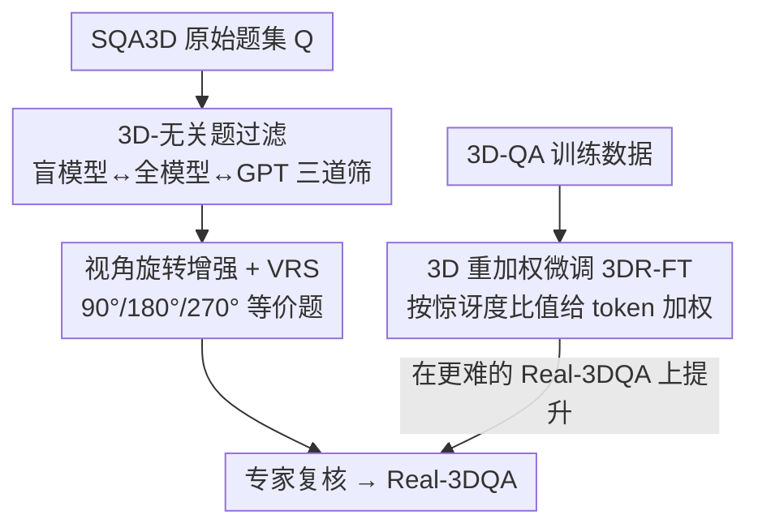

# Do 3D Large Language Models Really Understand 3D Spatial Relationships?

**会议**: ICLR2026  
**OpenReview**: [https://openreview.net/forum?id=3vlMiJwo8b](https://openreview.net/forum?id=3vlMiJwo8b)  
**代码**: https://real-3dqa.github.io/ （Code & Dataset 项目页）  
**领域**: 3D视觉 / 3D-LLM / 评测基准  
**关键词**: 3D-LLM、空间推理、语言捷径、诊断基准、视角旋转

## 一句话总结
作者发现现有 3D 大语言模型（3D-LLM）在 SQA3D 等基准上的高分很大程度是"语言捷径"刷出来的——一个**完全不看 3D 输入、只在文本问答对上微调的"盲模型"**就能打平甚至超过 SOTA；为此他们构造了更严苛的 Real-3DQA 基准（过滤掉不依赖 3D 就能猜对的题 + 引入视角旋转一致性评测），并提出 3D 重加权微调（3DR-FT）逼模型真正用上 3D 线索。

## 研究背景与动机

**领域现状**：3D-LLM 把点云等 3D 表征 token 与文本 token 拼接后送进 LLM，用来做 3D caption、grounding、问答（3D-QA），尤其是带第一人称视角的"情境问答"（Situated QA，SQA）。最常用的评测是 SQA3D，近年准确率从 30% 一路涨到 50%+，被普遍当作 3D 空间推理能力进步的证据。

**现有痛点**：作者把这个"进步"戳破了——他们拿掉 3D 输入、只用文本问答对微调出一个"盲模型"，结果这个盲模型在 SQA3D / ScanQA / MSR3D 上都能打平甚至反超真正吃 3D 输入的 3D-LLM（图 2）。这说明大量题目靠语言先验就能答对，分数高根本不代表模型理解了 3D。

**核心矛盾**：问题出在**数据偏置**。3D-QA 数据无论是人工标注还是 LLM 半自动生成，都会embed进语言/常识先验（例如"墙上黑色长方形物体"几乎必是 TV，与空间无关）。SQA3D 试图通过平衡答案分布缓解，但这种表层修补消不掉更深的偏置（对显著物体的偏好、典型布局、易猜答案）。于是模型学到的是**捷径学习**而非真正的 3D 理解。

**本文目标**：拆成三个子问题——(1) 怎么造一个能真正考验 3D 推理的基准；(2) 怎么验证模型是否真的"理解"而非记住表层模式；(3) 怎么在训练端逼模型用上 3D。

**切入角度**：与其逐条人工排查偏置，不如用**模型对比**自动识别——如果一道题"看 3D 的模型"和"不看 3D 的盲模型"都能答对，那它八成不依赖 3D，删掉即可。这是一种无需细粒度人工干预的去偏。

**核心 idea**：用"盲模型 vs 全模型"的一致性来过滤掉不依赖 3D 的题，再用"同一问题在不同视角下是否答得一致"来检验真理解，最后用 token 级重加权把训练注意力推向真正需要 3D 的样本。

## 方法详解

### 整体框架
论文有两条主线：一条是**构造 Real-3DQA 基准**（评测端），一条是**3D 重加权微调 3DR-FT**（训练端）。

基准构造从 SQA3D 原始题集 $Q$ 出发，分两步走：① **过滤 3D-无关题**——用三个 3D-LLM 各自的"全模型 + 盲模型"以及 GPT-4o-mini 三道筛子，把"不看 3D 也能答对"的题剔掉；② **视角旋转增强**——对剩下的高质量题做 90°/180°/270° 视角旋转，生成逻辑等价但参照系不同的题，并配套定义视角旋转得分（VRS）。中间还有专家复核保证质量。训练端则在标准 SFT 的交叉熵上，按"盲模型 vs 当前模型"的惊讶度比值给每个 token 重加权，把损失推向 3D 依赖更强的 token。

### 关键设计

**1. 3D-无关题过滤：用"盲模型一致性"自动去偏**

针对"语言先验刷分"的痛点，作者不靠人工逐条排雷，而是用模型自身的行为来判定一道题是否真依赖 3D。对每个 3D-LLM $M_X$（取 $X\in\{A,B,C\}$ 三个代表模型：3D-LLM、LEO、Chat-Scene），先训出它的盲版本 $M_X^{blind}$——同样的模型、同样的文本问答对，但**完全不喂 3D 上下文**。然后定义：若某题 $q$ 被全模型和盲模型**同时答对**（$M_X(q)=M_X^{blind}(q)=\text{correct}$），就认为它不依赖 3D。把三个模型各自的这类题取并集 $Q_{\text{3D-filtered}}=Q_A\cup Q_B\cup Q_C$ 全部删掉，得到 $Q'=Q\setminus Q_{\text{3D-filtered}}$。

为进一步把"纯靠文字常识就能蒙对"的题也清掉，再用 GPT-4o-mini 只读情境描述和问题（无 3D）作答，能答对的集合 $Q_{GPT}$ 也删掉，最终 $Q_{final}=Q'\setminus Q_{GPT}$。这一步的妙处在于：用"是否能在无 3D 条件下答对"这个统一信号，一次性隐式地缓解了显著物体偏好、典型布局、易猜答案等多种偏置，而不需要为每种偏置单独设计规则。

**2. 视角旋转增强与 VRS：把"换个视角还答得对吗"做成硬指标**

光删题不等于剩下的题就考验真理解，所以作者补了一个**跨问题一致性**测试。核心假设是：若模型真懂这个 3D 场景，那么固定智能体位置、只旋转其朝向时，它应该对"逻辑等价"的同一问题都答对。具体做法是保持位置和问题不变、旋转视角，并相应调整情境描述与标准答案里的方向词（如"右边"在旋转后指向不同物体），用 GPT 配合 SQA3D 的场景图与模板生成 90°/180°/270° 三个变体。图 4 的例子里，"我直右方是什么"这一问，原视角答"白板"，旋转后答案动态变成"窗户/桌子/垃圾桶"，而场景里物体的空间关系始终不变。

为量化，定义**视角旋转得分 VRS**：每个 batch 含 4 道关联题（原始 + 三个旋转），统计"至少答对 $k$ 道"的实例比例 $P_k=\frac{N_k}{N_{total}}\times100$（$k\in\{1,2,3,4\}$），最终取 $\text{VRS}=\frac{1}{4}\sum_{k=1}^{4}P_k$。要拿高分，模型必须把同一问题的所有视角变体都答对，单靠某个视角蒙对会被平均拉下来——这比逐题准确率严苛得多，专门惩罚"换个参照系就崩"的模型。

**3. 3D 重加权微调（3DR-FT）：用惊讶度比值把训练推向 3D 依赖**

评测端能诊断问题，但解决不了训练端的捷径学习——标准 SFT 仍鼓励模型抄语言模式。作者的思路是：每个 token 该被重视的程度，取决于"它有多难被纯文本猜到"。他们先训一个盲模型 $p_\phi$，再用它和当前训练模型 $p_\theta$ 的**惊讶度（surprise）比值**给每个 ground-truth token $y_j$ 定权重：

$$w_j(y, x_{text}) := \frac{S_\phi(y, x_{text})}{S_\theta(y, x_{text})} = \frac{\log p_\phi(y_j \mid y_{<j}, x_{text})}{\log p_\theta(y_j \mid y_{<j}, x_{text})}$$

直觉是：若盲模型对某 token 比当前模型"更惊讶"（更难只靠文本猜对），说明这个 token 需要真 3D 信息，就该在损失里被放大。最终的 3DR-FT 损失在标准交叉熵基础上乘上该权重，并且此时**喂入完整的 3D 上下文** $x_{3D}$：

$$\mathcal{L}_{\text{3DR-FT}}(\theta) := \mathbb{E}_D\Big[-\sum_{j=1}^{T} w_j(y, x_{text})\log p_\theta(y_j \mid y_{<j}, x_{text}, x_{3D})\Big]$$

这样模型被自适应地推去"啃"那些靠语言蒙不出来、必须看 3D 的样本，从而提升对 3D 上下文的实际依赖。

## 实验关键数据

作者在 SQA3D 与 Real-3DQA 上评测了五个代表性 3D-LLM（3D-LLM、Chat-3D v2、LEO、Chat-Scene、GPT4Scene），并把训练策略用在 LEO 和 Chat-Scene 上。

### 主实验

新基准让所有模型大幅掉分，且原本在 SQA3D 上分数接近的模型在这里被拉开差距：

| 3D-LLM | SQA3D EM | SQA3D EM_R | Real-3DQA EM | Real-3DQA EM_R |
|--------|----------|-----------|--------------|----------------|
| 3D-LLM (NeurIPS'23) | 47.8 | 49.6 | 7.5 | 10.4 |
| Chat-3D v2 (Arxiv'24) | 45.0 | 48.1 | 3.4 | 9.7 |
| LEO (ICML'24) | 49.4 | 52.2 | 14.3 | 19.1 |
| Chat-Scene (NeurIPS'24) | 54.4 | 57.2 | 17.0 | 22.1 |
| GPT4Scene (ICLR'26) | 60.6 | 63.3 | 33.1 | 36.9 |

EM 绝对下降幅度从 27.5（GPT4Scene）到 41.6（Chat-3D v2）不等，掉幅普遍超过 60%，说明现有 3D-LLM 一旦去掉简单线索就相当脆弱。

视角旋转测试（表 3，refined EM）更触目惊心——随着要求答对的旋转数从 1 增到 4，所有模型几乎崩到零：

| 3D-LLM | 1次对 | 2次 | 3次 | 4次 | VRS% |
|--------|------|-----|-----|-----|------|
| 3D-LLM | 33.2 | 4.1 | 1.1 | 0.1 | 9.6 |
| Chat-3D v2 | 23.2 | 2.7 | 0.5 | 0.0 | 6.6 |
| LEO | 46.9 | 8.1 | 1.6 | 0.4 | 14.3 |
| Chat-Scene | 43.3 | 7.1 | 1.2 | 0.1 | 12.9 |
| GPT4Scene | 55.5 | 14.3 | 2.5 | 0.5 | 18.2 |

最强的 GPT4Scene 从单次 55.5% 跌到四次全对 0.5%，整体 VRS 仅 18.2%；这种崩塌与架构无关（点级编码 vs 物体中心表征都崩），是系统性缺陷。

### 消融实验（训练策略）

| 训练策略 | LEO ScanQA | LEO Real-ScanQA | LEO SQA3D | LEO Real-3DQA | Chat-Scene SQA3D | Chat-Scene Real-3DQA |
|---------|-----------|-----------------|-----------|---------------|------------------|----------------------|
| Supervised FT | 32.3 | 6.1 | 52.2 | 19.1 | 57.2 | 22.1 |
| Blind FT | 33.0 | 5.9 | 50.6 | 13.6 | 51.4 | 14.4 |
| 3D-reweighted FT | 31.3 | **13.9** | 48.2 | **29.3** | 48.9 | **33.9** |

3DR-FT 在 3D 依赖更强的 Real-3DQA / Real-ScanQA 上提升最大（LEO 19.1→29.3、Chat-Scene 22.1→33.9、Real-ScanQA 6.1→13.9），但代价是在原始 SQA3D 上略降。

### 关键发现
- **盲模型打平 SOTA 是核心证据**：不看 3D 的盲模型能在 SQA3D 上匹敌甚至反超真 3D-LLM，直接证明现有基准无法甄别"语言捷径"。
- **方向/距离题最难**：按推理技能拆成距离/方向/计数/存在四类后，距离与方向题在所有架构上都持续偏低，说明模型普遍缺乏视角不变的空间表征。
- **3DR-FT 真的提升了 3D 依赖**：注意力分析（图 5）显示微调后模型对 3D token 的平均注意力显著上升，与 Real-3DQA 上的涨点一致。
- **为何 SQA3D 反而掉分**：Chat-Scene 有 591 题从对变错，其中 441 来自被过滤的"3D-无关"子集——因为 SQA3D 混入了大量靠语言就能答的题，强迫模型用 3D 反而在这些题上吃亏，这恰恰反证了原基准的偏置。

## 亮点与洞察
- **用"盲模型一致性"自动去偏**很巧：不需要逐条人工排查偏置，让"看不看 3D 都能答对"这个统一信号一次性过滤多种偏置，可迁移到任意多模态 QA 的偏置诊断。
- **VRS 把"理解"操作化成"换视角还一致吗"**：用旋转等价题 + 取多档命中率的平均，避免了单视角蒙对带来的虚高，是一个干净且严苛的一致性度量。
- **惊讶度比值重加权**是把"难度"细到 token 级的实用 trick：用盲模型当参照衡量每个 token 的 3D 依赖度，思路可迁移到任何"想压制某条捷径模态"的训练场景（如 2D-VQA 压语言偏置）。
- 最"啊哈"的点是：领域多年涨的分可能大半是幻象——一个简单的对照实验就揭穿了 benchmark 的系统性盲区。

## 局限与展望
- **基准衍生自 SQA3D**：过滤和增强都建立在 SQA3D 的场景图与题目上，场景多样性受原数据集约束；ScanQA 上验证了流程可迁移，但仍是室内场景为主。
- **过滤依赖具体模型**：3D-无关题的判定取决于所选的三个 3D-LLM 和 GPT-4o-mini，换一批参照模型，过滤出的题集可能不同；"盲模型答对"也可能误删少量其实需要 3D 但答案恰好高频的题。
- **GPT 增强需大量质控**：视角旋转题由 GPT 生成，作者用多阶段专家复核 + 多模型交叉验证来压幻觉，成本不低，规模化扩展有摩擦。
- **3DR-FT 有取舍**：提升 Real-3DQA 的同时牺牲了原 SQA3D 分数，如何在"真 3D 推理"和"覆盖全部题型"间平衡仍待解。

## 相关工作与启发
- **vs SQA3D（情境问答基准）**: SQA3D 靠平衡答案分布去偏，但消不掉深层标注偏置；本文用模型级对比过滤 + 视角旋转一致性，能更鲁棒地暴露语言捷径，本质是把"per-item 准确率"升级为"跨问题一致性"。
- **vs Beacon3D（诊断基准）**: Beacon3D 用**跨任务一致性**（QA 与 grounding 答案是否一致）诊断 3D 理解；本文用**跨问题一致性**（同题不同视角是否一致），两者互补，后者更直接考验视角不变的空间表征。
- **vs 2D-VLM 去偏工作**: 2D-VQA 的语言偏置已被广泛研究（更公平基准 + 集成/数据增强/对比学习等缓解策略），但 3D-QA 的同类问题此前几乎空白；本文把这套"诊断 + 缓解"范式首次系统搬到 3D-LLM。

## 评分
- 新颖性: ⭐⭐⭐⭐⭐ 用盲模型对照戳破"虚假进步"并配套 VRS + 3DR-FT，视角独到且自洽。
- 实验充分度: ⭐⭐⭐⭐ 覆盖五个代表模型、两套数据集、训练策略消融与注意力分析，但场景仍以 SQA3D/ScanQA 室内为主。
- 写作质量: ⭐⭐⭐⭐⭐ 问题动机清晰、图表（盲模型对照、旋转崩塌、翻转分析）极有说服力。
- 价值: ⭐⭐⭐⭐⭐ 对整个 3D-LLM 评测范式是一记警钟，基准与训练策略都可直接复用。

<!-- RELATED:START -->

## 相关论文

- [\[ECCV 2024\] PointLLM: Empowering Large Language Models to Understand Point Clouds](../../ECCV2024/3d_vision/pointllm_empowering_large_language_models_to_understand_point_clouds.md)
- [\[CVPR 2026\] Scalable Object Relation Encoding for Better 3D Spatial Reasoning in Large Language Models](../../CVPR2026/3d_vision/scalable_object_relation_encoding_for_better_3d_spatial_reasoning_in_large_langu.md)
- [\[ICCV 2025\] Learning 3D Object Spatial Relationships from Pre-trained 2D Diffusion Models](../../ICCV2025/3d_vision/learning_3d_object_spatial_relationships_from_pre-trained_2d_diffusion_models.md)
- [\[ICLR 2026\] Part-X-MLLM: Part-aware 3D Multimodal Large Language Model](part-x-mllm_part-aware_3d_multimodal_large_language_model.md)
- [\[CVPR 2025\] Empowering Large Language Models with 3D Situation Awareness](../../CVPR2025/3d_vision/empowering_large_language_models_with_3d_situation_awareness.md)

<!-- RELATED:END -->
