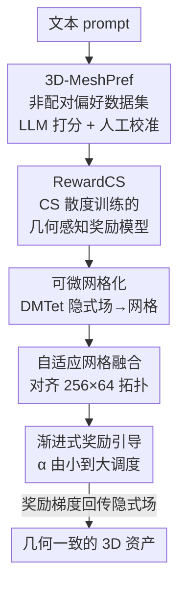

# DreamCS: Geometry-Aware Text-to-3D Generation with Unpaired 3D Reward Supervision

**会议**: ICLR2026  
**OpenReview**: [https://openreview.net/forum?id=PoU33ZdtCP](https://openreview.net/forum?id=PoU33ZdtCP)  
**代码**: 待确认  
**领域**: 3D视觉 / 文本到3D生成  
**关键词**: 文本到3D、偏好对齐、3D奖励模型、非配对学习、Cauchy-Schwarz 散度

## 一句话总结
DreamCS 提出第一个**直接在 3D 几何上做监督**的偏好对齐框架：先用 LLM + 人工标注造出 3 万条非配对 3D 网格偏好数据集 3D-MeshPref，再用 Cauchy-Schwarz 散度训练一个不需要成对样本的几何感知奖励模型 RewardCS，最后通过可微网格化 + 自适应网格融合 + 渐进式奖励引导把它插进 SDS 文本到 3D 管线，显著缓解 Janus 多脸和几何残缺问题。

## 研究背景与动机

**领域现状**：文本到 3D 生成（DreamFusion、MVDream、Magic3D 等）主要靠预训练的 2D 扩散模型，通过 Score Distillation Sampling（SDS）把 2D 去噪梯度蒸馏到 NeRF/SDF 这类隐式 3D 表示上。为了让结果更符合人类偏好，最近的工作（DreamReward、DreamDPO）把 RLHF/DPO 那套搬了过来，用奖励模型来引导生成。

**现有痛点**：现有 3D 偏好对齐有两个硬伤。第一，依赖**成对**的偏好标注：对每个 prompt 要渲染多个 3D 资产、从多视角出图、再人工标注「哪张更好/更差」，既贵又难扩展——而且实际中差距明显的成对样本本来就稀少。第二，它们给的全是 **2D 视角相关**的监督：奖励来自渲染图（如 ImageReward），只要某些视角看着顺眼就给高分，完全可能忽略其他视角下的结构缺陷，于是经常生成 Janus 多脸、几何残缺、漂浮物这类伪影。

**核心矛盾**：根子在于**缺少 3D 感知的奖励信号**。2D 提升管线擅长语义对齐，但没有显式的全局几何监督，无法保证 3D 结构本身一致、合理。论文里举的例子很说明问题：2D 奖励模型 ImageReward 会给一个几何明明有缺陷的资产打高分，而真正懂 3D 几何的奖励才能和人类判断对齐。

**本文目标**：要造一个直接在 3D 几何层面给反馈、且**不需要成对数据**的奖励引导框架，分解成三个子问题——(1) 哪来的 3D 偏好数据？(2) 没有成对样本怎么训奖励模型？(3) 奖励模型怎么塞进现有文本到 3D 管线还能端到端回传梯度？

**切入角度**：作者的关键观察是，偏好学习不一定要逐对比较。如果把「被偏好的网格」和「不被偏好的网格」分别看成两个**分布**的采样，那么训练目标就从「让 $m^+$ 比 $m^-$ 得分高」变成「在嵌入空间里把这两个分布推开」，天然就不需要配对。

**核心 idea**：用 Cauchy-Schwarz 散度做分布级偏好学习，从非配对的 3D 网格数据里学出几何感知奖励，再以可微方式注入 SDS 管线，用 3D 几何先验去校正生成。

## 方法详解

### 整体框架
DreamCS 的全流程可以拆成三段：**先造数据 → 再训奖励 → 最后引导生成**。第一段构建 3D-MeshPref，一个 3 万+ 样本的非配对 3D 网格偏好数据集，每条含「文本 prompt + 3D 资产 + 偏好分数」；第二段在它上面训练 RewardCS，用 CS 散度把高质量/低质量网格在嵌入空间分开，得到一个把「网格 + 文本」映射到标量奖励的几何感知奖励模型；第三段是 DreamCS 本体，把 RewardCS 插进 SDS 文本到 3D 管线，靠可微网格化把隐式场转成网格、自适应网格融合把拓扑对齐到奖励模型要求、渐进式引导调度奖励权重，从而端到端地用 3D 奖励梯度去优化隐式 3D 表示。

### 关键设计

**1. 3D-MeshPref：用 LLM 打分 + 人工校准造出第一个大规模非配对 3D 偏好数据集**

3D 偏好对齐没数据可用，而成对标注又因为 3D 表示复杂、生成/标注成本高几乎做不出来。作者干脆放弃配对，只造**非配对**数据。具体来说：从 Cap3D（覆盖 Objaverse、ABO）里挑 8000 个 ABO + 15000 个 Objaverse 样本，用 MeshAnythingV2 转成高质量网格，再用 QEM 简化算法把每个网格压到最多 16384 个三角面，过滤后得到 20000+ 网格；为了让奖励模型也能评判 SDS 优化**中间态**的几何，又额外用 DreamFusion/MVDream 在优化早期采样补了 10000+ 个网格。打分上用 Llama-Mesh 在 prompt 对齐、结构真实性、视觉保真三个维度上按 0–5 Likert 打分，但作者发现 LLM 倾向于高估质量，于是再加人工复核。最后用一个阈值区间（3.5–4.0）划分：得分 ≥4.0 标为 preferred（占 47%），≤3.5 标为 dispreferred（占 53%），中间模糊区直接排除以保证标签干净。这种「保留清晰边界、丢掉模糊样本」的做法让两类信号区分度高，同时天然给了 RewardCS 类别均衡的训练材料。

**2. RewardCS 的 CS 散度目标：把偏好学习改写成分布匹配，绕开成对监督**

传统偏好对齐（DPO 及其变体、Reward3D）都要 $\{m_i^+, m_i^-, c_i\}$ 这种成对元组，在非配对场景直接失效。RewardCS 的核心改动是：把 preferred 集合 $\{n_i^+\}$ 和 dispreferred 集合 $\{n_j^-\}$ 各自看成两个分布 $p^+(\cdot|c)$、$p^-(\cdot|c)$ 的采样，用编码器 $r_{\theta_e}$ 把它们映射成嵌入 $\{x_i\}\sim p(x)$、$\{y_j\}\sim p(y)$，然后训练目标变成「在嵌入空间里把 $p(x)$ 和 $p(y)$ 推开」。度量两个分布差异用 Cauchy-Schwarz 散度：

$$D_{CS}(p \parallel q) = -\log \frac{\left(\int p(\omega)q(\omega)\,d\omega\right)^2}{\int p(\omega)^2 d\omega \int q(\omega)^2 d\omega}.$$

由于真实密度未知，用核密度估计（KDE）得到经验版本，里面只出现核函数 $\kappa(x_i, x_j)$、$\kappa(y_i, y_j)$、$\kappa(x_i, y_j)$ 这些两两核值的求和，关键是它**对称、可微、且允许 $m \neq n$**——也就是 preferred 和 dispreferred 数量不等也能算，正好适配非配对设定。相比 KL 散度，CS 散度有更紧的泛化界；相比 JS 散度，它对高斯有闭式、更稳。直觉上，最大化 CS 散度就是逼着模型去捕捉那些能区分好坏资产的语义和几何线索，而不需要对每个 prompt 都给配对监督。论文还用 t-SNE 验证：加了 $L_{div}$（$\lambda=1$）后，preferred 和 dispreferred 的嵌入在空间里明显分开，$\lambda=0$ 时则混在一起。

**3. 非配对 ≈ 配对的理论保证：CS 散度在 RKHS 里渐近等价于成对监督**

作者没有止步于「能跑」，还证明了非配对训练并不是退而求其次。把 CS 散度改写到再生核希尔伯特空间（RKHS）里，它等价于两个核均值嵌入 $\mu_x$、$\mu_y$ 之间的一个量（$-2\log \frac{\langle\mu_x,\mu_y\rangle}{\|\mu_x\|\|\mu_y\|}$）。在「核有界且 characteristic、均值嵌入非零」这些核方法标准假设下，论文证明了 Theorem 1：成对数据算出的 $\hat{D}_{CS}^{paired}$ 和非配对算出的 $\hat{D}_{CS}^{unpaired}$ 之差满足

$$\hat{D}_{CS}^{paired} - \hat{D}_{CS}^{unpaired} \le C \cdot \left(\frac{1}{\sqrt{m}} + \frac{1}{\sqrt{n}}\right) \xrightarrow{p} 0,$$

即随样本量增大以 $O(1/\sqrt{m} + 1/\sqrt{n})$ 速率收敛到零。这说明用非配对数据最大化 CS 散度，渐近上能得到和成对偏好监督一样的奖励分离效果——给了「为什么可以不要配对」一个干净的理论交代。

**4. DreamCS 三件套：把奖励模型可微地接进 SDS 管线**

奖励模型训好了，但要插进文本到 3D 管线还有两道坎：现有奖励是给 2D 配对设计的、处理不了显式 3D 网格；训练中生成的网格又往往不满足奖励模型对拓扑的要求（256 个非重叠 patch、每 patch 64 面）。DreamCS 用三个模块逐一解决，并保证整条链路可微：

- **可微网格化（Differentiable Meshization）**：SDS 管线优化的是 NeRF/SDF 隐式场，必须转成显式网格才能喂给 RewardCS。作者用 DMTet 可微地抽取等值面，比 Marching Cubes 保真度更高，关键是保住了奖励信号回传到隐式参数的梯度流；若管线本来就优化显式网格，这步直接跳过。
- **自适应网格融合（Adaptive Mesh Fusion）**：抽出来的网格拓扑往往和奖励模型期望的不匹配，于是用一个可微的融合算法在保几何细节的前提下简化、重组拓扑。它按两个准则迭代合并相邻面——面法向相似 + 拓扑相邻（共享顶点/边）：两面共顶点且法向相近时，用共享顶点加各取一个顶点构出新面；共边且法向高度对齐时，用该边加任一面的第三顶点构新面。整个融合可微且嵌进训练循环，不打断梯度。
- **渐进式奖励引导（Progressive Reward Guidance）**：每步优化时，当前可微网格 $d(\psi_t)$ 由 RewardCS 评分，作为反映几何合理性和 prompt 对齐度的梯度信号回传隐式场。优化目标为 $L(\psi_t) = L_{SDS}(\psi_t) - \alpha(t)\cdot r_\theta(d(\psi_t)|c)$，其中权重 $\alpha(t) = \alpha_{min} + (\alpha_{max}-\alpha_{min})\cdot t/T$ 随步数线性增大。早期 $\alpha$ 小，让 SDS 主导、充分探索形状空间；后期 $\alpha$ 变大、奖励引导才发力，从而实现「先粗后细」——等几何稳定下来再用 3D 结构先验去精修，避免一上来就被奖励带偏。

### 损失函数 / 训练策略
RewardCS 的训练目标是回归损失 + CS 散度损失：$L_{RewardCS}(\theta) = L_{MSE}(\theta) + \lambda L_{div}(\theta)$，其中 $L_{MSE}$ 是奖励预测的均方误差，$L_{div} = -\hat{D}_{CS}(p(x); p(y))$ 鼓励两类嵌入分离，$\lambda$ 为权衡系数（实验主用 $\lambda=1$）。网络方面，编码器 $r_{\theta_e}$ 含三块：3D 网格编码器用 MeshMAE（把网格切成 256 个 patch、每 patch 64 面、每面 10 维几何特征如面积/角度/法向），文本编码器用 MeshCLIP（训练时冻结），再用交叉注意力融合——以网格 token 加一个 128 维可学习 class token 作 query、文本 token 作 key/value，把语义注入网格表示，最后 class token 过 MLP 投影头出标量奖励。生成端在 ShapeNet 预训练初始化后于 3D-MeshPref 上微调，全程 20000 步（纹理/几何感知 baseline 再加 10000 步精修），渲染分辨率粗到细（前 5000 步 64×64，之后 256×256），$\alpha_{min}=10$、$\alpha_{max}=20$。

## 实验关键数据

### 主实验
在 GPTEval3D 的 110 个 prompt 上评测，覆盖一阶段（DreamFusion、MVDream）和两阶段（Magic3D、Fantasia3D）管线，对比 2D 引导（Reward3D、DreamDPO）与本文 3D 引导（RewardCS）。指标：CP = CLIP 相似度，VR = VisionReward，GA = 作者自提的 3D Geometry-Asset Alignment Reward（用不同训练配置的 RewardCS 作独立评测器）。

| 管线 | 变体 | CP ↑ | VR ↑ | GA ↑ |
|------|------|------|------|------|
| DreamFusion | 原始 | 0.22 | -3.21 | 2.53 |
| DreamFusion | +Reward3D (2D) | 0.23 | -3.11 | 2.77 |
| DreamFusion | +RewardCS (本文) | 0.25 | -2.11 | 2.96 |
| DreamFusion | +Reward3D+RewardCS | 0.25 | -2.77 | **3.22** |
| MVDream | 原始 | 0.24 | -3.31 | 2.79 |
| MVDream | +Reward3D (2D) | 0.27 | -3.12 | 2.87 |
| MVDream | +RewardCS (本文) | **0.29** | -2.11 | 2.96 |
| Fantasia3D | 原始 | 0.22 | -3.03 | 2.95 |
| Fantasia3D | +RewardCS (本文) | 0.25 | **-1.01** | **3.33** |

三个关键发现：(1) RewardCS 在所有原始 baseline 上都涨，且在 CP/GA/VR 上普遍超过 2D 引导变体——如 Magic3D Stage2+RewardCS 把 GA 从 2.55（Reward3D）拉到 3.22，VR 从 -3.32 拉到 -1.58；(2) 它对各种 backbone 兼容性强，隐式优化（MVDream 把 VR 从 -3.31 提到 -2.11）和显式网格渲染（Fantasia3D 把 VR 从 -3.03 提到 -1.01）都能用；(3) 3D 和 2D 引导互补，DreamFusion 上二者结合拿到峰值 GA 3.22，说明 Reward3D 管多视角一致、RewardCS 管几何对齐。

### MiniCPM-o 评测 + 用户研究
用多模态 VLM MiniCPM-o（110 prompt）和 30 人用户研究（60 prompt）打分，指标 T-A = 文本-资产对齐，3DP = 3D 合理性，G-T = 几何-纹理一致性：

| 评测 | 方法 | T-A ↑ | 3DP ↑ | G-T ↑ |
|------|------|-------|-------|-------|
| MiniCPM-o | MVDream | 2.97 | 3.12 | 3.08 |
| MiniCPM-o | +Reward3D | 3.38 | 3.35 | 3.22 |
| MiniCPM-o | +RewardCS | 3.59 | **4.05** | **3.95** |
| 用户研究 | MVDream | 2.90 | 2.87 | 2.91 |
| 用户研究 | +DreamDPO | 3.15 | 3.19 | 3.00 |
| 用户研究 | +RewardCS | 3.21 | **3.72** | **3.59** |

RewardCS 在 3DP 和 G-T 上提升最明显（MiniCPM-o 上 3DP 从 3.12→4.05），印证它主要在补全局几何这块短板。

### Janus 伪影比例
60 prompt 的用户研究统计带 Janus 多脸伪影的资产占比（越低越好）：

| backbone | 方法 | Janus 比例 ↓ |
|----------|------|--------------|
| MVDream | 原始 | 0.52 |
| MVDream | +Reward3D | 0.44 |
| MVDream | +RewardCS | **0.30** |
| DreamFusion | 原始 | 0.61 |
| DreamFusion | +RewardCS | **0.41** |
| DreamFusion | +Reward3D+RewardCS | **0.39** |

### 关键发现
- **几何指标提升远大于纹理指标**：CP（偏纹理/语义）涨幅有限，而 GA、VR、3DP 这些几何相关指标涨得最猛——正好对应「2D 奖励管语义、3D 奖励管几何」的分工假设。
- **$L_{div}$ 是 RewardCS 的灵魂**：t-SNE 显示去掉 CS 散度项（$\lambda=0$）后好坏网格嵌入混在一起，加上后才分得开，奖励才有判别力。
- **2D + 3D 互补而非替代**：两者叠加常拿到最优 GA / 最低 Janus 比例，说明全局几何监督和多视角一致监督解决的是不同维度的问题。

## 亮点与洞察
- **把偏好学习从「逐对比较」改写成「分布分离」**：这是最巧妙的一步——一旦不要求成对，3D 偏好数据的采集成本就从「渲多视角 + 人工配对」降到「单网格打分」，可扩展性完全不同。这个思路其实可以迁移到任何配对标注昂贵的偏好对齐场景（视频、长文档生成）。
- **理论 + 实践都补齐**：CS 散度不只是工程 trick，作者证了它渐近等价于成对监督（Theorem 1），让「丢掉配对」有了底气，而不是「能用就行」。
- **在 3D 几何层面而非渲染图层面给奖励**：直接对网格做监督，从源头上避免了 2D 奖励「某视角好看就给高分」的视角偏差，这是缓解 Janus/几何残缺的根本原因。
- **可微贯穿全链路**：DMTet 可微网格化 + 可微网格融合让 3D 奖励梯度能一路回传到隐式场，是「即插即用到现有 SDS 管线」的工程关键。

## 局限与展望
- **奖励模型质量受限于标注链路**：3D-MeshPref 的标签来自 Llama-Mesh 初打分 + 人工校准，论文自己也承认 LLM 倾向高估质量；奖励上限本质上被这条标注链路的可靠性卡住。
- **依赖网格表示和固定拓扑约束**：RewardCS 期望 256×64 的网格 patch 结构，要靠自适应网格融合硬对齐；对拓扑非常复杂或开放表面的资产，这种简化是否丢关键几何，论文未充分探讨。
- **评测指标部分自指**：GA 指标本身基于 RewardCS（换训练配置）构建，用它来评 RewardCS 引导的生成，存在一定循环验证嫌疑，好在还有 MiniCPM-o 和真人用户研究佐证。
- **计算成本**：每步优化都要可微网格化 + 网格融合 + 奖励前向，引入了额外开销（论文放在附录讨论），实际部署时的速度代价值得关注。

## 相关工作与启发
- **vs Reward3D / DreamReward（2D 奖励）**：DreamReward 从多视角渲染图训 2D 奖励模型，只对齐视角相关的外观，留不住全局 3D 结构；本文直接在 3D 网格上训奖励，从几何层面监督，实验中 GA/VR/Janus 比例全面更优，且二者还能互补叠加。
- **vs DreamDPO（成对 DPO）**：DreamDPO 用多视角比较的人类偏好做 DPO，仍需成对数据且仍是 2D 监督；本文用 CS 散度做分布级非配对学习，彻底摆脱配对约束，标注成本大幅下降。
- **vs 普通 SDS（DreamFusion/SJC）**：原始 SDS 只有 2D 扩散去噪梯度作监督，受 view inconsistency、Janus、结构保真差困扰；DreamCS 在其上叠加 3D 几何先验，作为结构正则去校正生成。

## 评分
- 新颖性: ⭐⭐⭐⭐⭐ 第一个非配对 3D 偏好数据集 + 第一个 CS 散度 3D 奖励模型 + 第一个 3D 奖励引导文本到 3D 框架，三个「first」环环相扣且有理论支撑。
- 实验充分度: ⭐⭐⭐⭐ 覆盖一/两阶段四种 backbone、自动指标 + VLM 评测 + 两次真人用户研究，较完整；GA 指标自指略减分。
- 写作质量: ⭐⭐⭐⭐ 三个挑战对应三个贡献，逻辑清晰，理论与方法衔接顺畅。
- 价值: ⭐⭐⭐⭐⭐ 把「非配对分布对齐」引入 3D 偏好学习，既降标注成本又抓住几何这一真痛点，思路可迁移到其他高成本偏好对齐场景。

<!-- RELATED:START -->

## 相关论文

- [\[CVPR 2026\] GaussianGrow: Geometry-aware Gaussian Growing from 3D Point Clouds with Text Guidance](../../CVPR2026/3d_vision/gaussiangrow_geometry-aware_gaussian_growing_from_3d_point_clouds_with_text_guid.md)
- [\[ICLR 2026\] PAT3D: Physics-Augmented Text-to-3D Scene Generation](pat3d_physics-augmented_text-to-3d_scene_generation.md)
- [\[CVPR 2026\] Text–Image Conditioned 3D Generation](../../CVPR2026/3d_vision/text-image_conditioned_3d_generation.md)
- [\[ICLR 2026\] TIGaussian: Disentangle Gaussians for Spatial-Aware Text-Image-3D Alignment](tigaussian_disentangle_gaussians_for_spatial-awared_text-image-3d_alignment.md)
- [\[ECCV 2024\] JointDreamer: Ensuring Geometry Consistency and Text Congruence in Text-to-3D Generation via Joint Score Distillation](../../ECCV2024/3d_vision/jointdreamer_ensuring_geometry_consistency_and_text_congruence_in_text-to-3d_gen.md)

<!-- RELATED:END -->
