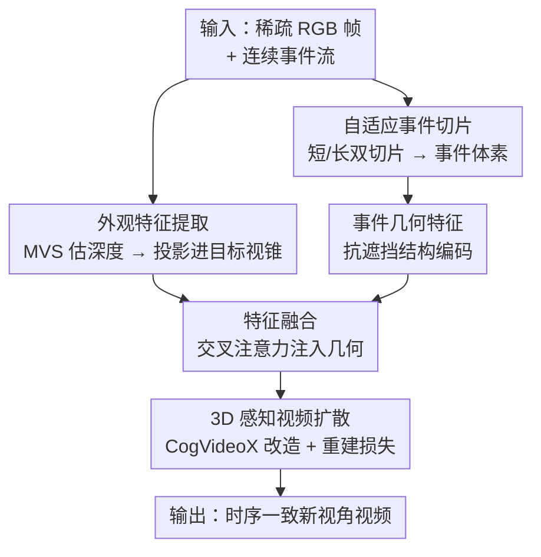

# EA3D: Event-Augmented 3D Diffusion for Generalizable Novel View Synthesis

**会议**: ICLR2026  
**OpenReview**: [https://openreview.net/forum?id=YwawhlWdtm](https://openreview.net/forum?id=YwawhlWdtm)  
**代码**: 待确认  
**领域**: 3D视觉 / 扩散模型  
**关键词**: 事件相机, 新视角合成, 视频扩散, 可泛化, 代价体  

## 一句话总结
EA3D 把事件相机的连续几何线索和稀疏 RGB 帧的外观线索，融合成视角相关的 3D 特征，再用一个 3D 感知的视频扩散模型（改造自 CogVideoX）解码成时序一致的新视角视频，从而在快速相机运动、大基线、跨场景设定下实现**无需逐场景优化**的可泛化新视角合成。

## 研究背景与动机
**领域现状**：新视角合成（NVS）目前主流靠 NeRF 和 3DGS，通过对单个场景做密集采样 + 逐场景优化，学出连续的辐射场或高斯表示，渲染质量很高。

**现有痛点**：这类方法在**快速相机运动**下会崩。一是快速运动让可用训练视角变少，重建欠约束，容易过拟合训练视角或收敛到平凡解；二是相邻帧间距大，违反了特征匹配赖以工作的平滑运动假设，导致 SfM 估出的相机位姿不可靠，进而拖垮整个优化。引入事件相机能缓解运动鲁棒性（事件流时序密集、低延迟、对快速运动和极端光照鲁棒），但现有「事件 + RGB」方法仍然是优化式的 3D 表示（E-NeRF、Event3DGS、EF-3DGS），换个新场景就要重新优化，**没有泛化能力**。

**核心矛盾**：泛化能力和事件几何先验，目前是「鱼与熊掌」。可泛化的 NVS 方法（从大规模多视角数据学先验）能跨场景，但**只吃 RGB**，在宽基线、快速运动下表现急剧退化；能用事件的方法又被逐场景优化锁死，跨不到新场景。

**本文目标**：做一个**既能利用事件几何先验、又能跨场景泛化、还不用逐场景优化**的 NVS 框架，支持沿任意（甚至和事件相机轨迹不对齐的）相机轨迹合成。

**切入角度**：作者注意到两种模态天然互补——事件流提供时序密集、抗遮挡的**几何**线索但缺颜色纹理，RGB 帧提供丰富**外观**但几何稀疏且在快速运动下不完整。如果能把两者在目标相机视锥内统一成一份「3D 感知特征」，就能把几何鲁棒性和外观真实感同时喂给一个生成式先验。

**核心 idea**：用一个可学习的「事件增强特征渲染器」把事件几何 + RGB 外观投影成目标视角的 3D 特征，再用一个条件视频扩散模型把这些 3D 特征解码成时序一致的新视角——把「逐场景优化的 3D 表示」换成「一次训练、到处泛化的生成式 3D 先验」。

## 方法详解

### 整体框架
EA3D 解决的是「给定稀疏 RGB 帧 + 中间这段连续事件流，沿一条新视角相机轨迹合成逼真且时序一致的新视角视频」。整条 pipeline 分两大件串联：先用 **EA-Renderer（事件增强特征渲染器）** 把两类输入投影成每个目标视锥的 3D 特征 $\{F_{3D}\}_{i=1}^N$，再用 **3D 感知视频扩散模型** 以这些 3D 特征为条件，迭代去噪解码出新视角序列 $\{I_i\}_{i=1}^N$。多视角的一般情形被自然拆解成若干「两视角子问题」：以两帧 $(I_{t_0}, I_{t_1})$ 和它们之间的事件流 $E(t_0,t_1)$ 为例处理。

EA-Renderer 内部又分三阶段：**外观特征提取**（用现成 MVS 模型估位姿/深度，把 RGB 投影进各目标视锥得外观特征）、**事件特征提取**（自适应切片把事件流编码成抗遮挡几何特征）、**特征融合**（交叉注意力把无位姿的事件特征注入有位姿的外观特征）。融合后的 3D 特征替换掉 CogVideoX 原本的图像条件，作为 3D 条件指导扩散解码。

### 关键设计

**1. EA-Renderer 的外观特征提取：把 RGB 锚到每个目标视锥**

事件流虽然几何鲁棒却完全没有颜色纹理，所以外观信息只能来自 RGB。作者用现成的多视角立体（MVS）模型先估出两帧 RGB 的相机参数和深度，然后把它们投影到新视角轨迹 $\{T_i\}_{i=1}^N$ 上每个目标视锥，得到一串视图投影 $\{P_i\}_{i=1}^N$，再过外观编码器 $E_{appr}$：$\{F_{appr}^i\}_{i=1}^N = E_{appr}(\{P_i\}_{i=1}^N)$。这一步借鉴了代价体（cost volume）式 NVS 的思路——不是直接生成，而是先把已知观测「搬」到目标相机视锥里建立外观先验。但因为输入帧间基线大、互有遮挡，单靠外观特征拿不到完整几何，这正是下一步要补的窟窿。

**2. 自适应事件切片：在非均匀事件流上稳定地抽几何**

事件流是异步、非均匀的——同样一段时间，运动剧烈处事件密、静止处事件稀，固定时间切片会让有的体素塞爆、有的空荡荡，几何信号不稳。作者改用**按事件数量自适应切片**：把 $E(t_0,t_1)$ 先切成 $N$ 个时间段，每段构造两个时间重叠的切片——含 $m$ 个事件的短切片保留短期场景信息，含 $2m$ 个事件的长切片捕捉更长时序上下文；每个切片的时长**动态拉伸直到攒够规定的事件数**，从而保证体素密度。$N$ 个短切片和 $N$ 个长切片沿通道维拼起来，得到时序增强的事件体素 $\{E_i\}_{i=1}^N$，再过事件编码器 $E_{event}$ 得 $F_{event} = E_{event}(\{E_i\}_{i=1}^N)$。消融显示去掉自适应切片会掉点（T&T 上 PSNR 23.50→22.96），说明「按量切片」比「按时切片」更能在快速运动下抽出干净几何。

**3. 交叉注意力特征融合：让无位姿的事件几何对齐到有位姿的外观上**

事件特征 $F_{event}$ 编码了结构连续性和抗遮挡几何，但事件流的精确位姿和深度很难拿到，没法像 RGB 那样直接投影进目标视锥；而且它本身又缺外观。作者用一层交叉注意力来「软对齐」：对轨迹上每个有位姿的外观特征 $F_{appr}^i$ 做 query，把整段事件特征 $F_{event}$ 作 key/value，算出 $\{F_{3D}\}_{i=1}^N = \{\mathrm{Attention}(Q(F_{appr}^i), K(F_{event}), V(F_{event}))\}_{i=1}^N$。这样几何先验不需要显式位姿就能被注意力「挑」到合适的位置，最终的 $F_{3D}$ 同时携带抗遮挡几何和外观，成为指导扩散的强 3D 先验。这一设计是「无位姿事件 + 有位姿外观」能拼起来的关键，消融里去掉几何特征（即去掉事件编码器和融合模块）在 2 视角设定下掉点最猛（T&T PSNR 23.50→18.87）。

**4. 3D 感知视频扩散：把 3D 特征当条件，借 CogVideoX 保时序一致**

要让多帧新视角彼此一致而不是各画各的，作者建模条件分布 $I \sim p(I \mid F_{3D})$，并用**视频**扩散模型（而非逐帧图像扩散）来强制 3D 一致性，底座选了 CogVideoX 的图生视频变体——它用带 3D 自注意力的 Diffusion Transformer，天生擅长时空连贯的图生视频。改造有两处巧思：一是把原来的图像条件特征直接**替换**成 EA-Renderer 渲出的 $F_{3D}$，并用新初始化的 patch embedding 把它和高斯噪声拼成 token 喂进 DiT；二是**复用 CogVideoX 的时空 VAE 编码器当外观编码器 $E_{appr}$**，既减小域差、又利用其时间压缩机制让外观特征数恰好降到 $\frac{N}{4}$，最终 $F_{3D}$ 形状为 $\frac{N}{4}\times\frac{H}{8}\times\frac{W}{8}\times C$，正好对齐 DiT 输入。复用预训练底座也让训练只跑 12,000 步就能收敛。

### 损失函数 / 训练策略
端到端训练，扩散损失 + 重建损失等权相加。扩散损失沿用 CogVideoX 的噪声调度：$L_{diffusion} = \mathbb{E}_{I,F_{3D},t,\epsilon}[\|\epsilon - \epsilon_\theta(I,t,F_{3D})\|_2^2]$。为稳定训练、加速收敛，额外加一个重建损失，约束 EA-Renderer 渲出的 $F_{3D}$ 逼近 VAE 编码器从真值新视角抽的特征 $E_{appr}(I)$：$L_{recon} = \|F_{3D} - E_{appr}(I)\|_2^2$。训练时联合优化事件编码器、特征融合模块、patch embedding 和 DiT 块；分辨率固定 $384\times672$，序列长 49 帧，事件切片量 $m$ 在 $[1\times10^5, 3\times10^5]$ 均匀采样以增强对事件流波动的鲁棒性；batch size 8、8 张 80GB GPU、学习率 $1\times10^{-5}$。配套还构建了 **Event-DL3DV** 数据集：真实多视角序列（DL3DV）+ 随机对比度阈值模拟的事件流 + 逐视角深度图，用来支撑大规模训练和泛化。

## 实验关键数据

### 主实验
在 in-the-wild 场景（DL3DV 140 个不重叠测试场景 + Tanks-and-Temples 10 场景）和真实事件数据（DSEC 7 个静态序列）上，对比优化式基线（E-NeRF、Event3DGS）和 RGB-only 可泛化基线（ViewCrafter、NVS-Solver），评测 2/4/6 视角输入。注意：优化式基线沿事件相机轨迹合成、且事件由真值序列直接模拟（与真值对齐），而 EA3D 用的事件流刻意**和真值新视角错位**，是更难更通用的设定。

| 数据集 | 设定 | 指标 | EA3D | 最强基线 |
|--------|------|------|------|----------|
| DL3DV | 2 Views | PSNR ↑ | **22.82** | 19.10 (ViewCrafter) |
| T&T | 2 Views | PSNR ↑ | **23.50** | 22.96 (E-NeRF) |
| DSEC(真实事件) | 2 Views | PSNR ↑ | **24.89** | 18.71 (ViewCrafter) |
| DSEC(真实事件) | 6 Views | PSNR ↑ | **26.87** | 23.25 (E-NeRF) |

在最具挑战的 2 视角宽基线设定下优势最大；4/6 视角下也持平或更优。真实事件数据上全指标全设定领先，说明从「模拟事件训练」到「真实事件推理」迁移得不错。

### 消融实验
在 T&T 和 DSEC 真实事件上、2 视角设定下消融：

| 配置 | T&T PSNR ↑ | 真实事件 PSNR ↑ | 说明 |
|------|-----------|----------------|------|
| Full model | 23.50 | 24.85 | 完整模型 |
| w/o Geometry Feature | 18.87 | 18.90 | 去事件编码器+融合，只喂外观，掉最狠 |
| w/o Reconstruction Loss | 20.39 | 19.82 | 去重建损失，收敛差、掉 3 分 |
| w/o Adaptive Slicing | 22.96 | 23.06 | 换固定时长切片，几何变脏 |

### 关键发现
- **几何特征贡献最大**：去掉事件几何（只剩外观）在 2 视角宽基线下 T&T PSNR 从 23.50 暴跌到 18.87，证实快速运动/大基线下外观特征几乎没有可见重叠，必须靠事件补几何。
- **随视角范围增大，事件几何越发关键**：把输入两帧间距拉到 1.5×~3×，全模型性能比「去几何」变体掉得慢得多——事件几何在外观重叠趋零时撑住了结构。
- **重建损失不只是锦上添花**：去掉后掉约 3 分，说明用 VAE 真值特征对齐 $F_{3D}$ 对稳定训练、加速收敛很重要。

## 亮点与洞察
- **「特征渲染 + 生成解码」的两段式很解耦**：EA-Renderer 负责把多模态观测搬进目标视锥建立 3D 先验，扩散模型负责把先验「补全成照片」，前者管几何对齐、后者管真实感和时序一致，职责清晰、各自可换。
- **用交叉注意力绕开事件位姿难题**：事件流位姿/深度难估是个老大难，作者不去硬估，而是让有位姿的外观当 query 去 attend 无位姿的事件几何，把对齐变成可学习的软匹配，这个 trick 可迁移到其它「一模态有位姿、一模态没有」的融合场景。
- **复用视频扩散底座的双重收益**：把 CogVideoX 的 VAE 同时当外观编码器，既压缩了特征数对齐 DiT、又减小域差让 12k 步就收敛——「条件特征和底座特征同源」是省训练的实用经验。
- **测试设定故意更难还更强**：EA3D 用错位事件流（不对齐真值），却在 2 视角下反超用对齐事件的优化式基线，说明它学到的是真·可泛化先验而非过拟合轨迹。

## 局限与展望
- **依赖现成 MVS 估外观位姿/深度**：外观分支的位姿和深度来自现成 MVS 模型，MVS 在极端快速运动/低纹理下若失准，外观投影会带偏，论文未深入分析这一上游误差传播。
- **训练事件靠模拟**：Event-DL3DV 的事件由 vid2e 配随机对比度阈值模拟，虽在 DSEC 真实事件上验证了迁移，但模拟-真实差距在更复杂光照/传感器下能否持续成立仍待观察。
- **分辨率与序列长度受限**：固定 $384\times672$、49 帧，更高分辨率或更长轨迹的扩展性、显存代价（附录另有 runtime/memory 分析）是实际部署要考虑的。
- **改进方向**：可探索把事件位姿估计也纳入端到端学习、或引入显式 3D 一致性约束进一步减少跨帧漂移。

## 相关工作与启发
- **vs E-NeRF / Event3DGS（优化式事件 NVS）**: 他们把事件融进逐场景的 NeRF/3DGS 优化，质量不错但换场景就要重训、且只能沿事件相机轨迹合成；EA3D 是一次训练、跨场景泛化、支持任意（错位）轨迹，2 视角宽基线下反超它们。
- **vs ViewCrafter / NVS-Solver（RGB-only 可泛化 NVS）**: 他们用视频扩散从稀疏 RGB 做可泛化合成，但完全不吃事件，宽基线快速运动下几何退化、出现结构扭曲；EA3D 补上事件几何，全设定一致领先。
- **vs 逐帧图像扩散 NVS（ZeroNVS / ReconFusion 等）**: 它们各帧独立生成、不建模帧间依赖，难保时序一致；EA3D 用带 3D 自注意力的视频扩散显式约束跨帧一致性。

## 评分
- 新颖性: ⭐⭐⭐⭐⭐ 首个事件流 + 稀疏 RGB 的可泛化新视角合成框架，「特征渲染 + 视频扩散」组合 + 自适应切片 + 交叉注意力融合都很贴题。
- 实验充分度: ⭐⭐⭐⭐ in-the-wild + 真实事件双轨评测、2/4/6 视角、关键消融齐全；故意用错位事件的更难设定加分，但仍偏静态场景。
- 写作质量: ⭐⭐⭐⭐ 方法分件清晰、图表完整、消融对应明确，公式与符号自洽。
- 价值: ⭐⭐⭐⭐ 把事件 NVS 从「逐场景优化」推进到「可泛化生成先验」，并附 Event-DL3DV 基准，对快速运动/大基线场景有实用价值。

<!-- RELATED:START -->

## 相关论文

- [\[ICLR 2026\] True Self-Supervised Novel View Synthesis is Transferable](true_self-supervised_novel_view_synthesis_is_transferable.md)
- [\[ICLR 2026\] Dynamic Novel View Synthesis in High Dynamic Range](dynamic_novel_view_synthesis_in_high_dynamic_range.md)
- [\[CVPR 2026\] Splatent: Splatting Diffusion Latents for Novel View Synthesis](../../CVPR2026/3d_vision/splatent_splatting_diffusion_latents_for_novel_view_synthesis.md)
- [\[CVPR 2025\] Novel View Synthesis with Pixel-Space Diffusion Models](../../CVPR2025/3d_vision/novel_view_synthesis_with_pixel-space_diffusion_models.md)
- [\[ICLR 2026\] CylinderSplat: 3D Gaussian Splatting with Cylindrical Triplanes for Panoramic Novel View Synthesis](cylindersplat_3d_gaussian_splatting_with_cylindrical_triplanes_for_panoramic_nov.md)

<!-- RELATED:END -->
