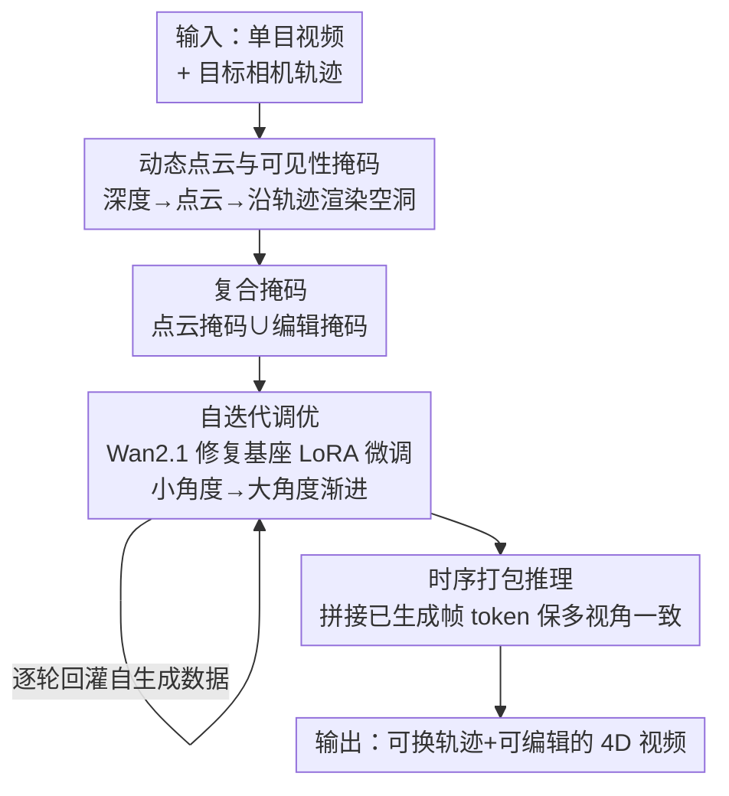

# EasyCreator: Empowering 4D Creation through Video Inpainting

**会议**: ICLR2026  
**OpenReview**: [https://openreview.net/forum?id=mU8Ubd8aNK](https://openreview.net/forum?id=mU8Ubd8aNK)  
**代码**: 待确认  
**领域**: 3D视觉 / 4D生成 / 视频扩散  
**关键词**: 4D视频生成, 视频修复, 动态点云, 相机轨迹控制, 多视角一致性

## 一句话总结
EasyCreator 把"从单目视频生成可换相机轨迹、可编辑内容的 4D 视频"这件事，重新表述成一个**视频修复（inpainting）任务**——用动态点云渲染出"换视角后看不到的空洞掩码"，再用一个强视频修复基座（Wan2.1）把空洞补全；配合复合掩码、自迭代调优和时序打包推理，在几乎不额外大规模训练的情况下，超过了一众相机重定向 SOTA。

## 研究背景与动机
**领域现状**：4D 视频生成（沿用户指定相机轨迹合成动态内容，做出推、拉、摇、子弹时间等电影感效果）近年很火。主流做法是把相机轨迹编码成 embedding（类似文本 prompt）塞进预训练视频生成基座，然后用多视角数据集、合成渲染或带相机位姿标注的单目视频做微调。

**现有痛点**：这类方法有三个硬伤——强依赖大规模训练数据；输入模态受限（一般只能吃图像或文本）；相机视角可控性差。最关键的是，它们**不支持视频输入**，无法把用户手里现成的单目视频转成连贯的 4D 表示。

**核心矛盾**：另一条"两阶段"路线（先用深度预测器把单目视频升成动态点云、沿目标轨迹渲染出带空洞的视频，再用视频修复填洞）思路对，但卡在第二步：**专门面向这种渲染空洞的视频修复模型几乎不存在**。现有做法只能拿通用的图/文生视频基座临时微调来当修复器，可它们本就不是为修复设计的，补出来的内容时序不连贯、不真实，而且通常不支持生成时做文本编辑，灵活性很差。

**切入角度**：作者注意到一个新出现的强视频修复基座 Wan2.1，在大规模数据上训过，本来很能补洞。但直接拿来补点云渲染产生的空洞却不行——这类掩码落在它训练分布之外。于是问题就变成了：**怎么用最小代价把一个通用视频修复基座"调"成会补 4D 空洞、还能顺手做编辑的模型**。

**核心 idea**：把 4D 生成彻底重构成一个**专门化的视频修复任务**，用"复合掩码 + 自迭代调优"喂给修复基座做轻量微调（单卡 A800、约 2 小时、LoRA），解锁它的 4D 重建潜力，同时不破坏其原有能力。

## 方法详解

### 整体框架
给定一段单目输入视频，EasyCreator 的目标是产出能换相机轨迹（zoom/tilt/pan）、还能改内容（加主体、改首帧）的 4D 视频。整条管线分两半：**训练侧**先把视频升成动态点云、用"双重投影"造出与原视频空间对齐的复合掩码，再用这些"残缺视频 + 掩码 → 干净视频"的配对去微调一个冻结的视频修复基座（Wan2.1，LoRA 微调）；为了扛住大角度相机运动，训练用**自迭代调优**——先学小角度，再用学到的模型生成更大角度的训练数据，逐步把视角拉开。**推理侧**用**时序打包**策略，把已经生成好的某条轨迹的若干帧 token 拼进下一条轨迹的输入里，靠基座自带的全局自注意力把重叠区域补一致，从而保证多视角之间的一致性。

### 关键设计

**1. 把 4D 生成重述为视频修复：动态点云 + 可见性掩码**

这是全文的根本动机。换相机视角后，单帧单目深度根本无法重建整个场景，渲染结果必然有遮挡/缺失区域——作者干脆把这些"洞"当作要补的目标，从而把 4D 生成接到一个成熟的视频修复基座上。具体地，对输入视频 $V=[I_0,\dots,I_{N-1}]$ 先用现成深度估计器（DepthCrafter）逐帧估深度 $D_i$，再用相机内参 $K$ 把每帧升成 3D 点云 $P_i=\phi([I_i,D_i],K)$；给定相机外参序列 $T=\{T_i\}$，用透视函数把点云投回成像平面 $I_i^a=\psi(P_i,K,T_i)$。投影时同步生成一张二值可见性掩码 $M\in\mathbb{R}^{N\times1\times H\times W}$：有合法投影的像素标 1，因相机运动落到原视野之外的标 0。这样 4D 生成就被翻译成"把 $M=0$ 的区域补全"这个标准修复问题。

**2. 复合掩码：让一次微调同时学会"补洞"和"编辑"**

直接拿可见性掩码做监督有个麻烦——渲染帧 $I_i^a$ 在遮挡区里没有真值内容，无法当 ground truth。作者用**双重投影（double reprojection）**绕开：把渲染视图 $V'$ 反投成新点云 $P'$，再用逆变换 $T^{-1}$ 重渲回原视角得到 $V''$，于是得到一对"带伪影的残缺视频 $V''$ + 标注伪影区的掩码 $M''$"，而**原始输入视频可直接当干净真值** $V_s$，二者共享同一条原相机轨迹。在此之上叠加两类掩码：**点云掩码**（上面这种几何空洞）、**编辑掩码**（训练时随机选一块区域生成掩码序列，首帧掩码置 0 表示"首帧当引导"，推理时改首帧即可把编辑内容传播到后续帧）、以及二者的**并集掩码**。训练时对每个样本**随机采样这三类掩码之一**，用标准 flow matching 损失预测干净视频 $V_s$。这样一来，同一次微调里基座既学会补几何空洞、又学会按首帧做内容编辑，无需为编辑单开一套模型。

**3. 自迭代调优：用模型自己生成的大角度数据，渐进扩视角**

朴素的视频修复扩散模型扛不住大角度（如 $>40°$）的空洞补全，原因有二：单视频+多掩码的微调泛化能力受限；现有修复模型缺乏稳健的 3D 感知。作者的解法是**角度渐进 + 自产数据**：先用小视角（如 $<30°$）生成若干 video-mask 对 $\{(V^{(k)},M^{(k)})\}$ 做 LoRA 一次性微调，$W^*_{\text{LoRA}}=\arg\min_W \mathcal{L}(V_k,M_k,\Delta W)$；载入该权重后用训好的小角度推出视频 $\tilde V$，再进入下一轮——每轮 $j$ 生成更大角度的残缺视频 $\tilde I^j_i=\psi(P^j_i,K,T^j_i)$，并以 $W^{(j)}_{\text{LoRA}}=W^{(j-1)}_{\text{LoRA}}+\eta\nabla_W \mathcal{L}_{\text{cycle}}(\tilde V^j,M^j,\Delta W)$ 累进更新，其中 $\mathcal{L}_{\text{cycle}}$ 是时空一致性 MSE。核心思想是**把上一阶段的输出当下一阶段的训练数据**，让模型在自己已经能补好的角度上踩着台阶往更大角度爬，从而在大相机运动下保住时序连贯。

**4. 时序打包推理：跨轨迹拼 token，保多视角一致**

训练完成后还有个推理期难题：不同相机轨迹各自独立修复，重叠区域会被补成不一致的内容。作者观察到两条轨迹 $T^a$、$T^b$ 渲染出的空洞视频存在重叠区（overlap mask），于是提出**时序打包**：先用 $T^a$ 跑出视频 $\tilde V^a$，按每帧修复面积选出 top-$K$ 帧 $F=\text{top-k-argmax}(S[\tilde V^a,M^a])$；在为 $T^b$ 推理时，把这些选中帧的 token 与 $T^b$ 的空洞视频 token 沿时间维拼接：$x_{\text{input}}=[\text{patchify}(E(F)),\text{patchify}(E(V^b))]_{\text{temporal}}$，其中 $E(\cdot)$ 是预训练 3D-VAE。妙处在于**不需要新增任何融合注意力层**——预训练修复基座的时空自注意力本就是在所有 token 上全局施加的，拼进来的"已生成帧"自然成为补全重叠区时的先验，把多视角之间的内容拉齐。

### 损失函数 / 训练策略
基座为开源 WAN-2.1 文生视频模型，用 rank=128 的 LoRA 微调；输入分辨率 $512\times512$、视频长度 81 帧，训练 2000 步，学习率 $1\times10^{-5}$、weight decay 0.1，单张 NVIDIA A800 约 2 小时。训练目标是标准 flow matching 修复损失（预测干净视频 $V_s$）；自迭代阶段叠加时空一致性 MSE $\mathcal{L}_{\text{cycle}}$。推理用 DPM solver、30 步采样、文本引导尺度 6.5，LoRA 权重固定为 0.7。

## 实验关键数据

### 主实验
在三套评测上对比 GCD、Trajectory-Attention、ReCamMaster、TrajectoryCrafter 等相机重定向/4D 合成 SOTA。

VBench 多维一致性（越高越好）：

| 指标 | TrajectoryCrafter | Ours |
|------|------|------|
| Subject Consis. | 0.8632 | **0.9026** |
| Background Consis. | 0.8674 | **0.8931** |
| Temporal Flicker. | 0.7925 | **0.8818** |
| Motion Smooth. | 0.8815 | **0.9242** |
| Overall Consis. | 0.2463 | **0.2915** |

视觉质量 / 相机精度 / 视角同步（关键列）：

| 指标 | 之前最好 | Ours |
|------|------|------|
| FID ↓ | 61.57 | **58.26** |
| FVD ↓ | 154.23 | **145.71** |
| RotErr ↓ | 1.43 | **1.37** |
| TransErr ↓ | 5.52 | **4.47** |
| FVD-V ↓ | 148.71 | **119.52** |
| CLIP-V ↑ | 88.53 | **89.87** |

Kubric-4D 低层指标上提升最显著：PSNR 从次优 15.82 跳到 **22.15**，LPIPS 从 0.532 降到 **0.381**，SSIM 0.487→**0.523**——说明在有真值的新视角合成上，EasyCreator 与 GT 的相似度大幅领先。

### 消融实验

| 配置 | FID ↓ | FVD ↓ | CLIP-V ↑ | 说明 |
|------|------|------|------|------|
| w/o composite mask | 78.27 | 153.28 | 85.25 | 去复合掩码后既补不好洞也做不了编辑 |
| w/o iterative tuning | 86.29 | 197.24 | 81.26 | 去自迭代，大角度时序崩、FID 最差 |
| w/o temporal pack | 62.46 | 168.91 | 84.71 | 去时序打包，多视角重叠区不一致 |
| **Ours** | **58.26** | **145.71** | **89.87** | 完整模型 |

### 关键发现
- **自迭代调优掉点最狠**：去掉后 FID 从 58.26 恶化到 86.29、FVD 涨到 197.24，且相机角度越大越糟——印证"基座缺 3D 感知、需用自产大角度数据渐进补课"的判断。
- **复合掩码是"能编辑"的开关**：去掉后无法同时完成 4D 生成与首帧编辑（如把"薯条"编到冰面上会失败）。
- **时序打包专治多视角不一致**：去掉后 CLIP-V 从 89.87 掉到 84.71，两条轨迹重叠区内容对不上。

## 亮点与洞察
- **问题重述的巧劲**：把"4D 生成"翻译成"补点云渲染空洞"，等于把一个缺数据缺模型的难任务，挂到了一个现成的强视频修复基座上——这是全文最"啊哈"的地方，省掉了大规模 4D 训练数据。
- **自产数据爬角度**：用上一轮模型生成下一轮的大角度训练样本，是一种很省的"课程式自举"，思路可迁移到任何"小扰动好学、大扰动难学"的生成微调。
- **零新增参数做多视角融合**：时序打包不加任何注意力层，纯靠基座全局时空自注意力把跨轨迹帧当先验——这个"白嫖预训练注意力"的 trick 很值得复用。

## 局限与展望
- **强依赖单目深度质量**：动态点云来自现成深度估计器，深度不准会直接污染掩码与几何，论文未深入讨论失败模式。
- **每段视频一次性微调**：单视频 + 多掩码的 one-shot tuning 范式意味着每个新视频都要单独调（约 2 小时/段），离"即开即用"的零样本还有距离。
- **大角度上限仍受限**：虽然自迭代缓解了 $>40°$ 的难题，但能爬到多大角度、何时崩，缺少系统的角度-质量曲线。
- **部分公式表述偏简**：自迭代的递推与 $\mathcal{L}_{\text{cycle}}$ 定义在正文里较粗，⚠️ 细节以原文/附录为准。

## 相关工作与启发
- **vs ReCamMaster / TrajectoryCrafter**：它们把相机轨迹编码进基座、在大规模视频数据上微调做相机重定向，且只关注"输入↔生成"的一致性；EasyCreator 改走"修复空洞"路线，训练数据需求小，并额外解决**多视角之间**的一致性。
- **vs GCD（4D 新视角合成）**：GCD 把隐式相机位姿 embedding 注入视频扩散，结果过平滑、视角错位；EasyCreator 在保真度和位姿精度上全面更好。
- **vs 通用视频修复**（非生成式像素传播 / 生成式 T2V 修复）：旧修复只做"视频内的内容补洞"；本文首次把视频修复解锁到 **4D 重建**，让它会补"换视角造成的几何空洞"。

## 评分
- 新颖性: ⭐⭐⭐⭐⭐ 把 4D 生成重述为视频修复并解锁修复基座，视角独到
- 实验充分度: ⭐⭐⭐⭐ 三套评测 + 三项消融到位，但缺角度-质量曲线与失败分析
- 写作质量: ⭐⭐⭐⭐ 故事线清晰，部分自迭代公式略简
- 价值: ⭐⭐⭐⭐⭐ 低成本（单卡 2h）把单目视频转 4D，实用性强

<!-- RELATED:START -->

## 相关论文

- [\[ICCV 2025\] Vivid4D: Improving 4D Reconstruction from Monocular Video by Video Inpainting](../../ICCV2025/3d_vision/vivid4d_improving_4d_reconstruction_from_monocular_video_by_video_inpainting.md)
- [\[ICLR 2026\] WorldTree: Towards 4D Dynamic Worlds from Monocular Video Using Tree-Chains](worldtree_towards_4d_dynamic_worlds_from_monocular_video_using_tree-chains.md)
- [\[ICLR 2026\] UFO-4D: Unposed Feedforward 4D Reconstruction from Two Images](ufo-4d_unposed_feedforward_4d_reconstruction_from_two_images.md)
- [\[CVPR 2026\] Vista4D: Video Reshooting with 4D Point Clouds](../../CVPR2026/3d_vision/vista4d_video_reshooting_with_4d_point_clouds.md)
- [\[ICLR 2026\] Uncertainty Matters in Dynamic Gaussian Splatting for Monocular 4D Reconstruction](uncertainty_matters_in_dynamic_gaussian_splatting_for_monocular_4d_reconstructio.md)

<!-- RELATED:END -->
