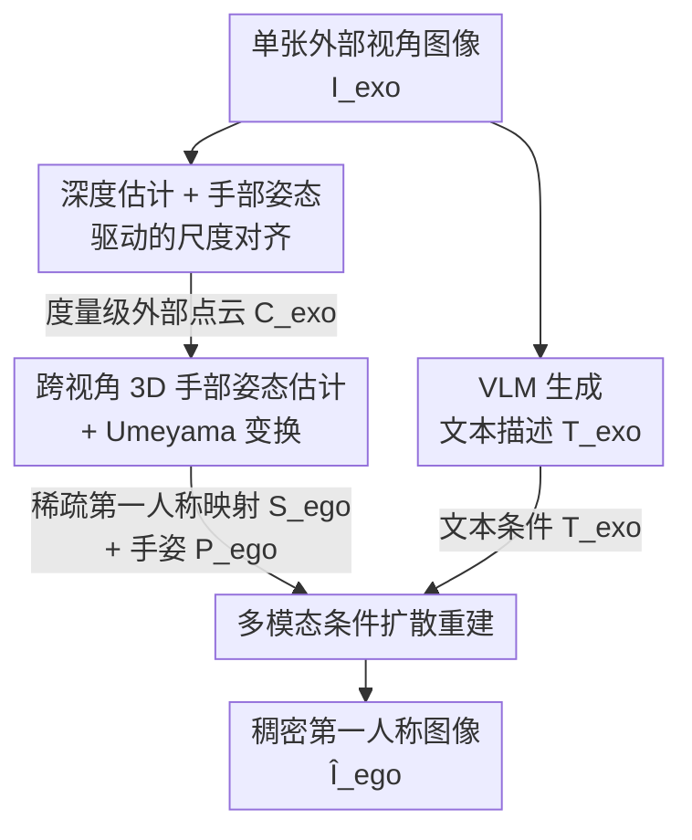

# EgoWorld: Translating Exocentric View to Egocentric View using Rich Exocentric Observations

**会议**: ICLR 2026  
**arXiv**: [2506.17896](https://arxiv.org/abs/2506.17896)  
**代码**: [有](https://redorangeyellowy.github.io/EgoWorld/)  
**领域**: 3D视觉  
**关键词**: 视角转换, 第三人称到第一人称, 扩散模型, 手物交互, 点云投影

## 一句话总结

EgoWorld 提出一种端到端的外部-第一人称视角转换框架：从单张第三人称图像中提取 3D 点云、手部姿态和文本描述三种互补观测，通过点云重投影获得稀疏第一人称 RGB 映射，再以扩散模型 inpainting 方式重建完整的第一人称高保真图像，在 H2O 等四个数据集的多种 unseen 设置下全面超越 SOTA。

## 研究背景与动机

**领域现状**：第一人称（egocentric）视觉在 AR/VR、机器人操作和教学视频等场景中至关重要，尤其对理解手物交互不可或缺。然而现实中绝大多数视频资源来自第三人称视角——头戴式相机和可穿戴设备的普及率远不如普通相机。因此，从第三人称图像自动生成第一人称视图是一个极具实用价值的研究问题。

**现有痛点**：已有的外部→第一人称视角转换方法存在严重的输入约束。Exo2Ego-V 需要多视角 360° 输入；4Diff 需要已知的相对相机位姿；EgoExo-Gen 需要初始第一人称参考帧和文本指令。最接近的工作 Exo2Ego 虽然只需要单张第三人称图像，但它依赖 2D 手部布局预测来建立结构变换——在遮挡、视角模糊和杂乱环境中，2D 布局预测极不可靠，导致泛化能力差。

**核心矛盾**：第三人称和第一人称视角之间存在巨大的几何与语义鸿沟。第三人称视角提供全局上下文但手物交互细节缺失；第一人称视角聚焦手-物体近距离细节但缺乏全局信息。这种差异导致大量遮挡、外观变化和不可见区域，仅靠 2D 对齐根本无法弥补。

**本文目标** (1) 如何在无需多视图或相机位姿先验的条件下，从单张第三人称图像获取足够的 3D 几何信息；(2) 如何将稀疏的重投影信息补全为稠密、语义一致的第一人称图像。

**切入角度**：作者观察到第三人称图像中蕴含丰富的 3D 信息——深度图可恢复场景几何，手部姿态可建立跨视角对应关系，文本可提供语义先验。将这三种互补观测统一为扩散模型的条件输入，就能把视角转换重新定义为一个多模态条件图像修复问题。

**核心 idea**：用 3D 点云重投影替代 2D 布局来获取稀疏结构先验，再结合手部姿态和文本描述作为多模态条件，驱动扩散模型完成从外部到第一人称视角的高保真图像重建。

## 方法详解

### 整体框架

EgoWorld 是一个两阶段管线。**阶段一 (Exocentric View Observation $\Phi_{exo}$)**：输入单张外部视角图像 $I_{exo}$，输出三个中间表示——稀疏第一人称 RGB 映射 $S_{ego}$、3D 第一人称手部姿态 $P_{ego}$ 和文本描述 $T_{exo}$。其中 $S_{ego}$ 由两步串联得到：先做**深度估计 + 手部姿态驱动的尺度对齐**拿到度量级外部点云，再做**跨视角 3D 手部姿态估计 + Umeyama 变换**把点云搬到第一人称视角并投影；$T_{exo}$ 则由一个 VLM 直接从外部图像描述场景与手物交互。**阶段二 (Egocentric View Reconstruction $\Phi_{ego}$)**：把这三个观测作为条件，做**多模态条件扩散重建**——利用预训练 Latent Diffusion Model (LDM) 的 inpainting 能力，从稀疏 RGB 映射补全出稠密的第一人称图像 $\hat{I}_{ego}$。整个流程无需多视角输入、无需已知相机位姿、无需第一人称参考帧。

### 关键设计

**1. 深度估计 + 手部姿态驱动的尺度对齐：用手当锚点，把单目深度从"相对"拉回"度量级"**

跨视角重投影需要度量级的 3D 几何，但从单张外部图像出发只能拿到相对深度。作者先用 off-the-shelf 单目深度估计器（DepthAnythingV2）从 $I_{exo}$ 得到相对深度图 $D_{exo}$，问题是单目深度有固有的尺度歧义——同一张深度图缩放任意倍都"看起来对"，无法直接拿去投影。解法是借助一个外部视角里几乎总是可见的部位：手。作者用手部姿态估计器（ACR）从外部图像提取 MANO mesh，得到度量级的 3D 外部手部姿态 $P_{exo}$ 及对应手部深度图 $D_{hand}$，在手部有效区域 $\Omega_{hand}$ 内取两者的中值比作为全局尺度因子：

$$s^* = \text{median}_{(u,v) \in \Omega_{hand}} \frac{D_{hand}(u,v)}{D_{exo}(u,v)}$$

把相对深度校准为度量深度 $D'_{exo} = s^* D_{exo}$，再结合 RGB 与外部相机内参 $K_{exo}$ 构建 RGBD 点云 $C_{exo} \in \mathbb{R}^{(H \times W) \times 6}$。手物交互场景里身体常被桌子遮挡，但手几乎总在画面中，MANO mesh 因此是个比其他几何约束更可靠、更稳定的度量级锚点。

**2. 跨视角 3D 手部姿态估计 + Umeyama 变换：直接预测第一人称手姿，求刚体变换把点云搬到头戴视角**

有了度量级外部点云，还差一步：怎么知道外部相机和第一人称相机之间的相对位姿？这正是 Exo2Ego 靠不可靠的 2D 布局来硬凑的地方。EgoWorld 的核心创新是首次训练了一个从外部图像直接预测第一人称 3D 手部姿态的模型 $\phi_{ego}$，结构却很简洁：ViT-224 骨干 + 2 层 MLP 回归器（768→512→126 维，对应 21 个关键点 × 3D × 双手）。拿到外部手姿 $P_{exo}$ 和预测出的第一人称手姿 $P_{ego}$ 这两组对应 3D 点后，用 Umeyama 算法求最优相似变换 $(s, \mathbf{R}, \mathbf{t})$，取逆得到 $X = (X_{ego \to exo})^{-1}$；把外部点云 $C_{exo}$ 经 $X$ 变换、再用第一人称内参 $K_{ego}$ 投影，就得到稀疏第一人称 RGB 映射 $S_{ego}$。选手而非身体作为跨视角对应点，仍是出于"手在外部视角更常可见"的考虑；消融也证实这里 ViT 骨干显著优于 CNN，因为跨视角推理高度依赖全局上下文，而非局部纹理。

**3. 多模态条件扩散重建：把视角转换重新定义为"已知部分像素、补全其余"的 inpainting**

点云重投影出的 $S_{ego}$ 是稀疏的——遮挡区域和外部视角根本看不到的区域都是空洞，必须靠强生成模型补全。作者把这件事直接套进预训练 LDM inpainting 的形式：稀疏映射 $S_{ego}$ 经 VAE 编码为 4 通道潜空间嵌入 $s_{ego}$；手部姿态 $P_{ego}$ 经 $K_{ego}$ 投影成 2D 姿态图后同样 VAE 编码、再经 1 层卷积降到 1 通道嵌入 $p_{ego}$；把 $s_{ego}$（4ch）、$p_{ego}$（1ch）与噪声嵌入 $z_t$（4ch）拼成 9 通道输入送进 U-Net。文本描述 $T_{exo}$（由 VLM 生成的场景与手物交互描述）经 CLIP 编码为 $c_{exo} \in \mathbb{R}^{77 \times 768}$，通过交叉注意力引导生成，推理时再用 Classifier-Free Guidance (CFG) 增强文本控制力度。这套设计里文本和姿态各管一摊、互补协同：文本管"生成什么"（物体种类、场景风格等语义与外观），姿态管"手放在哪"（手部几何配置），而稀疏映射本身锚住了场景的几何骨架。

### 损失函数 / 训练策略

- **手部姿态估计器 $\phi_{ego}$**：MSE loss（L2 回归），ViT-224 骨干 + 2 层 MLP，batch size 64，lr $1 \times 10^{-4}$，Adam 优化器，100 epochs（~20 小时）
- **扩散模型 $\epsilon_\theta$**：标准 LDM 去噪目标 $\mathcal{L} = \mathbb{E}\|\epsilon_t - \epsilon_\theta(z'_t, t, c_{exo})\|_2^2$，微调预训练 LDM inpainting 模型，batch size 3，lr $1 \times 10^{-5}$，AdamW，5 epochs（~10 小时）
- 推理采用 CFG（缩放因子 $w$），条件为文本嵌入 vs 无条件
- 全部在单张 NVIDIA RTX 4090 GPU 上完成训练，资源要求友好

## 实验关键数据

### 主实验：H2O 四种 unseen 场景

| 场景 | 方法 | FID ↓ | PSNR ↑ | SSIM ↑ | LPIPS ↓ | PA-MPJPE ↓ | CLIPScore ↑ |
|------|------|-------|--------|--------|---------|------------|-------------|
| Unseen Objects | pix2pixHD | 436.25 | 25.01 | 0.299 | 0.606 | 18.01 | 0.230 |
| Unseen Objects | CFLD | 59.62 | 25.92 | 0.431 | 0.454 | 7.997 | 0.266 |
| Unseen Objects | **EgoWorld** | **41.33** | **31.17** | **0.481** | **0.348** | **7.318** | **0.273** |
| Unseen Actions | CFLD | 50.95 | 28.53 | 0.432 | 0.459 | 8.120 | 0.270 |
| Unseen Actions | **EgoWorld** | **33.28** | **31.62** | **0.457** | **0.378** | **7.260** | **0.282** |
| Unseen Scenes | CFLD | 118.10 | 29.03 | 0.370 | 0.684 | 7.877 | 0.251 |
| Unseen Scenes | **EgoWorld** | **90.89** | **31.00** | **0.410** | **0.652** | **7.409** | **0.259** |
| Unseen Subjects | CFLD | 129.30 | 21.05 | 0.400 | 0.627 | 9.561 | 0.246 |
| Unseen Subjects | **EgoWorld** | **96.43** | **24.85** | **0.461** | **0.619** | **8.103** | **0.258** |

主要结论：相比最强 baseline CFLD（注意 CFLD 使用 ground-truth 2D 手部布局作为输入，是 Exo2Ego 的上界），EgoWorld 在所有 unseen 设置下全面超越。Unseen Objects 场景 FID 降低 30%（59.62→41.33）、PSNR 提升超过 5 dB；Unseen Actions 场景 FID 降低 35%。即使在最困难的 Unseen Scenes 场景，FID 仍降低 23%。

### 跨数据集泛化（Unseen Actions）

| 数据集 | 方法 | FID ↓ | PSNR ↑ | SSIM ↑ | LPIPS ↓ | PA-MPJPE ↓ | CLIPScore ↑ |
|--------|------|-------|--------|--------|---------|------------|-------------|
| TACO | CFLD | 61.36 | 28.77 | 0.401 | 0.503 | 7.908 | 0.272 |
| TACO | **EgoWorld** | **37.19** | **30.16** | **0.424** | **0.403** | **7.359** | **0.283** |
| Assembly101 | CFLD | 53.93 | 21.00 | 0.399 | 0.557 | 11.11 | 0.246 |
| Assembly101 | **EgoWorld** | **50.23** | **25.37** | **0.410** | **0.514** | **10.56** | **0.256** |
| Ego-Exo4D | CFLD | 70.48 | 21.58 | 0.361 | 0.598 | 15.01 | 0.267 |
| Ego-Exo4D | **EgoWorld** | **61.23** | **24.99** | **0.399** | **0.548** | **13.99** | **0.286** |

在三个额外数据集上 EgoWorld 全面超越 CFLD，尤其在 TACO 上 FID 降低约 39%，Ego-Exo4D 上 PSNR 提升超 3 dB。

### 消融实验：条件模态分析

| Pose | Text | FID ↓ | PSNR ↑ | SSIM ↑ | LPIPS ↓ | PA-MPJPE ↓ |
|------|------|-------|--------|--------|---------|------------|
| ✗ | ✗ | 56.12 | 27.05 | 0.446 | 0.445 | 7.802 |
| ✓ | ✗ | 55.02 | 27.54 | 0.445 | 0.412 | 7.801 |
| ✗ | ✓ | 44.24 | 28.57 | 0.457 | 0.382 | 7.745 |
| ✓ | ✓ | **41.33** | **31.17** | **0.481** | **0.348** | **7.318** |

### 重建骨干对比

| 骨干 | FID ↓ | PSNR ↑ | LPIPS ↓ | PA-MPJPE ↓ |
|------|-------|--------|---------|------------|
| MAE | 169.91 | 24.62 | 0.504 | 10.98 |
| MAT | 89.93 | 28.92 | 0.476 | 9.544 |
| MAT (Refined) | 68.63 | 29.75 | 0.451 | 8.256 |
| **LDM (EgoWorld)** | **41.33** | **31.17** | **0.348** | **7.318** |

### 关键发现

- **文本描述贡献最大**：单独加入文本使 FID 从 56.12 降至 44.24（降幅 21%），而单独加入 pose 仅使 FID 从 56.12 降至 55.02，改善微弱。这说明语义信息对物体和场景重建至关重要
- **多模态协同效应显著**：pose + text 同时使用时 PSNR 达到 31.17，比 text-only 额外提升 2.6 dB，比无条件提升 4.1 dB。文本控制"生成什么"，姿态控制"手放在哪"
- **几何-语义解耦**：即使提供错误的文本描述，模型仍保持正确的几何结构（如桌面倾斜角度），说明稀疏映射编码的几何先验和文本提供的语义先验各司其职
- **ViT 优于 CNN**：手部姿态估计器中 ViT 骨干显著优于 ResNet50 骨干（FID 42.32 vs 61.16），全局上下文对跨视角推理至关重要
- **对噪声输入鲁棒**：在手部遮挡或模糊的困难样本上，EgoWorld 性能仅轻微下降（FID 33.28→34.91），远优于其他 baseline 的退化程度
- **手部姿态表示形式影响小**：MANO mesh vs 关键点的最终性能几乎无差异（FID 33.21 vs 33.28），因为手部姿态信息与其他模态融合后被稀释

## 亮点与洞察

- **从 2D 到 3D 的范式升级**：此前 Exo2Ego 依赖 2D 手部布局预测作为结构变换的中介，存在遮挡下不可靠的根本性缺陷。EgoWorld 转而使用 3D 点云重投影获取稀疏结构先验，不仅更鲁棒，还天然包含了场景的 3D 几何信息，而非仅仅是手部位置
- **视角转换 = 条件图像修复**：将几何困难的跨视角合成问题巧妙转化为扩散模型擅长的 inpainting 问题。稀疏 RGB 映射提供了"已知像素"，扩散模型只需补全缺失区域，大幅降低了生成难度。这种问题转化思路可迁移到其他跨视角生成任务
- **首创跨视角手部姿态预测**：从第三人称图像直接预测第一人称 3D 手部姿态此前无人做过，但模型结构极其简洁（ViT + MLP），说明 ViT 的全局特征已经包含了足够的跨视角对应信息

## 局限与展望

- **误差累积风险**：整个管线依赖多个 off-the-shelf 模型（深度估计、手部姿态估计、VLM），它们的误差会逐级传播。尽管实验证明对噪声有一定鲁棒性，但在极端遮挡或非典型姿态下仍可能失败
- **静态图像限制**：当前方法仅处理单帧，未利用视频序列的时序信息。扩展到视频级第一人称合成需要额外的时序一致性机制（如 temporal attention），这是一个自然的后续方向
- **不可见区域依赖想象**：从外部视角完全不可见的区域（如书的内页、手掌正面）完全依赖扩散模型的"想象能力"，生成结果的真实性无法保证
- **相机内参估计**：管线需要外部和第一人称相机内参，当前从深度估计器推断，但在实际部署中可能引入额外误差

## 相关工作与启发

- **vs Exo2Ego**：同样处理单张外部→第一人称转换，但 Exo2Ego 用 2D 手部布局（受遮挡影响大），EgoWorld 用 3D 点云重投影（更鲁棒）。注意 CFLD 使用 GT 手部布局是 Exo2Ego 的上界，EgoWorld 仍全面超越
- **vs 4Diff**：同样利用点云做视角转换，但 4Diff 不使用手部姿态和文本条件。EgoWorld 的消融（Pose✗ Text✗ 行）可视为 4Diff 的近似，FID 56.12 远高于完整模型的 41.33，验证了多模态条件的必要性
- **vs EgoExo-Gen**：需要初始第一人称参考帧 + 文本指令 + 外部视频序列，限制性更强。EgoWorld 仅需一张外部图像

## 评分

- 新颖性: ⭐⭐⭐⭐ 3D 点云重投影替代 2D 布局的思路直觉且有效；首创跨视角手部姿态预测；但整体管线的每个模块（深度估计、Umeyama、LDM inpainting）都是已有技术的组合
- 实验充分度: ⭐⭐⭐⭐⭐ 四个数据集、四种 unseen 场景、六项指标、充分的消融（模态、骨干、姿态表示、噪声鲁棒性）、real-world 定性评估，实验设计非常完善
- 写作质量: ⭐⭐⭐⭐ 方法描述清晰，图表丰富；论文结构完整，动机阐述合理
- 价值: ⭐⭐⭐⭐ AR/VR、机器人和教学视频领域有直接应用价值；单张图像输入 + 单卡训练的低门槛使其易于部署

<!-- RELATED:START -->

## 相关论文

- [\[NeurIPS 2025\] Look and Tell: A Dataset for Multimodal Grounding Across Egocentric and Exocentric Views](../../NeurIPS2025/3d_vision/look_and_tell_a_dataset_for_multimodal_grounding_across_egocentric_and_exocentri.md)
- [\[ICLR 2026\] EgoNight: Towards Egocentric Vision Understanding at Night with a Challenging Benchmark](egonight_towards_egocentric_vision_understanding_at_night_with_a_challenging_ben.md)
- [\[ICLR 2026\] ReconViaGen: Towards Accurate Multi-view 3D Object Reconstruction via Generation](reconviagen_towards_accurate_multi-view_3d_object_reconstruction_via_generation.md)
- [\[ICLR 2026\] Aligned Novel View Image and Geometry Synthesis via Cross-modal Attention Instillation](aligned_novel_view_image_and_geometry_synthesis_via_cross-modal_attention_instil.md)
- [\[ICLR 2026\] Large Depth Completion Model from Sparse Observations](large_depth_completion_model_from_sparse_observations.md)

<!-- RELATED:END -->
