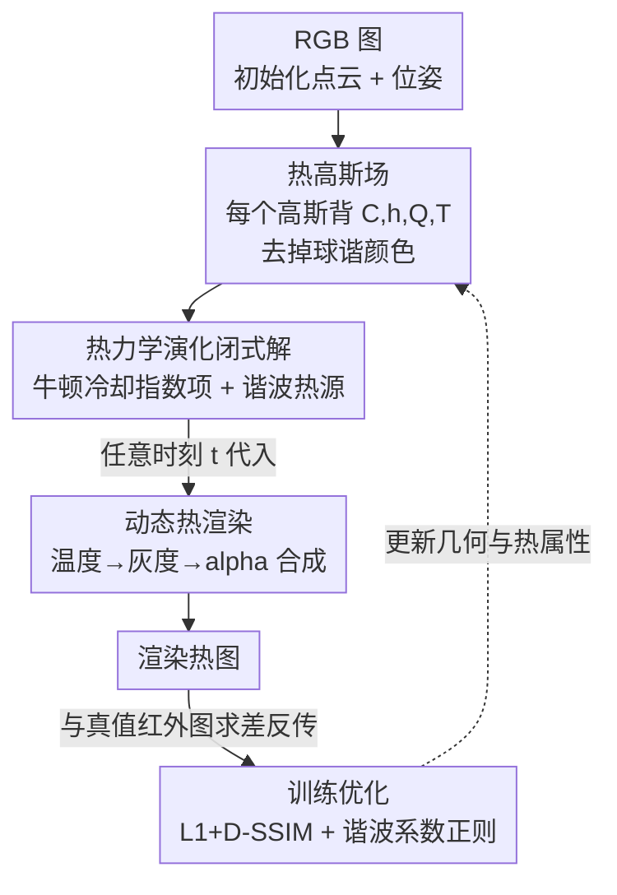

# ETGS: Explicit Thermodynamics Gaussian Splatting for Dynamic Thermal Reconstruction

**会议**: ICLR 2026  
**OpenReview**: [https://openreview.net/forum?id=P2Nw2LMkjH](https://openreview.net/forum?id=P2Nw2LMkjH)  
**代码**: https://github.com/jankin-wang/ETGS  
**领域**: 3D视觉  
**关键词**: 高斯泼溅, 热成像重建, 动态场景, 热力学建模, 闭式解

## 一句话总结
ETGS 把"每个高斯都遵守一阶传热 ODE"的显式热力学模型嵌进 3D Gaussian Splatting，给 ODE 推出任意时刻可直接求值的闭式解，从而以接近静态 3DGS 的训练/渲染效率重建随时间快速变化的动态热场景，在自建 RHD 数据集上平均 PSNR 比此前最好方法高约 5 dB。

## 研究背景与动机
**领域现状**：热成像是非接触测温手段，既给几何结构又给温度分布，把它和 3D 重建结合、做出"随时间演化的温度场景模型"是近年热点。早期工作分两步走（先用 RGB 建几何，再贴热图），后来 Thermal-NeRF / ThermoNeRF 把 NeRF 扩到红外，Thermal3D-GS / TGA-GS 把 3DGS 扩到热成像。

**现有痛点**：Thermal3D-GS、TGA-GS 这些都**只能重建静态热场景**，学到的只是场景的平均温度，无法刻画温度随时间变化的过程，因此做不了热力学分析。引入时间维度的方案各有短板：4DGS 用形变场建动态外观，但完全不考虑热物理过程；ThermalGS 用时间嵌入驱动温度演化，本质还是数据驱动、缺热力学一致性；NTR-Gaussian 虽然把热力学方程塞进高斯框架，但依赖隐式神经网络 + 数值积分推断，训练渲染都很慢（68 FPS、训练 1469 s）。

**核心矛盾**：动态热重建里"物理一致性"和"效率"互相打架——想要物理可信就得解热力学方程，而隐式网络 + 数值积分的解法既慢又会累积误差，把 3DGS 原本的高效优势全吃掉了。

**本文目标**：在不牺牲 3DGS 效率的前提下，给每个高斯一套物理可解释的温度状态，使它能在任意时刻、面对不等间隔甚至乱序的观测时间戳都准确给出温度。

**切入角度**：作者注意到一阶线性传热 ODE（牛顿冷却 + 热源激励）其实有**解析闭式解**。只要把热源用一组谐波基展开，温度对时间的演化就能写成一个解析表达式，任意时刻代入即得——根本不需要数值积分，也不需要隐式网络回归。

**核心 idea**：把"球谐颜色"换成"显式热物理参数"，让每个高斯背一组（等效热容、换热系数、热源谐波系数），用一阶传热 ODE 的闭式解直接算出它在任意 $t$ 的温度，再走标准 alpha 合成渲染成热图。

## 方法详解

### 整体框架
ETGS 要解决的是"如何让 3DGS 在保持高效的同时表达随时间演化的温度场"。它的做法是把光学属性从高斯里拿掉、换成热力学属性：先用 RGB 图初始化点云和相机位姿，再把每个高斯定义成一个携带等效热容 $C_i$、换热系数 $h_i$、热源激励 $Q_i(t)$、温度状态 $T_i(t)$ 的**热高斯**；温度状态不是自由学习的参数，而是由一阶传热 ODE 的闭式解给出——牛顿冷却的指数项负责趋向环境温度，谐波展开的热源项负责刻画周期/复杂的外部能量输入；任意时刻 $t$ 的温度求出后，线性映射成灰度，按标准 alpha 合成渲染成热图，再用渲染图和真值红外图的差异反传梯度，同时更新几何和热属性。

### 关键设计

**1. 热高斯场：把球谐颜色换成可解释的热物理参数**

静态 3DGS 里每个高斯是 $G_i=\{\mu_i,\Sigma_i,R_i,\alpha_i,f_i\}$，其中 $f_i$ 是球谐展开的颜色/辐射系数。但对热场景来说，决定热辐射的是温度，所以光学颜色既不够也是负担。ETGS 把高斯重定义为热高斯 $\tilde{G}_i=\{\mu_i,\Sigma_i,R_i,\alpha_i,C_i,h_i,Q_i(t),T_i(t)\}$：去掉球谐颜色，新增四个热属性——等效热容 $C_i$（表征温度变化的惯性，决定温度对外界刺激的响应快慢）、换热系数 $h_i$（高斯体与环境换热的速率）、热源激励 $Q_i(t)$（随时间输入的能量，用傅里叶基展开以刻画复杂/周期过程）、温度状态 $T_i(t)$。关键在于 $T_i(t)$ 不是自由参数，而是由后面的热力学模型解析求出，这样既保留了 3DGS 的显式可控性，又把"物理一致"写进了表示本身。

**2. 热力学演化的闭式解：一阶传热 ODE + 谐波热源，任意时刻直接求值**

这是全文核心。对第 $i$ 个热高斯，依据能量守恒写出一阶线性 ODE：$C_i \frac{dT_i(t)}{dt}=-h_i(T_i(t)-T_{env})+Q_i(t)$，定义时间常数 $\tau_i=C_i/h_i$ 后化为 $\frac{dT_i}{dt}=-\frac{1}{\tau_i}(T_i-T_{env})+\frac{1}{C_i}Q_i(t)$。用积分因子法解得 $T_i(t)=T_{env}+(T_{i,0}-T_{env})e^{-t/\tau_i}+\frac{1}{C_i}\int_0^t e^{-(t-s)/\tau_i}Q_i(s)\,ds$，前两项就是牛顿冷却（指数趋于环境温度），第三项是热源的卷积。为了把积分项也变成解析式，作者把热源在一个全局共享的频率网格上做谐波展开 $Q_i(t)=\sum_{k=1}^{K}A_{i,k}\sin(\omega_k t)+B_{i,k}\cos(\omega_k t)$，频率 $\omega_k$ 取自对数均匀网格 $\omega_k=\omega_{min}(\omega_{max}/\omega_{min})^{(k-1)/(K-1)}$（频率上下界和 $K$ 由采样时长、最小采样间隔与热力学先验联合确定）。代回后逐项积分即得每个高斯在任意 $t$ 的温度闭式解：

$$T_i(t)=T_{env}+(T_{i,0}-T_{env})e^{-t/\tau_i}+\sum_{k=1}^{K}\frac{\tau_i/C_i}{1+(\omega_k\tau_i)^2}\Big[A_{i,k}\big(\sin\omega_k t-\omega_k\tau_i\cos\omega_k t+\omega_k\tau_i e^{-t/\tau_i}\big)+B_{i,k}\big(\cos\omega_k t+\omega_k\tau_i\sin\omega_k t-e^{-t/\tau_i}\big)\Big]$$

这一步的价值在于：它把"求 $t$ 时刻温度"从一次数值积分/网络前向变成一次解析代入，因此**不会累积积分误差、天然适配不等间隔和乱序时间戳**，而且整个表达式对时间可微，可以直接塞进 3DGS 的可微渲染管线。这正是它比 NTR-Gaussian（隐式网络 + 数值积分）又快又准的根因。

**3. 动态热渲染：温度到灰度的线性映射 + 标准 alpha 合成**

求出温度后还得变成可渲染的像素。ETGS 用采集时测得的温度上下界 $[T_{min},T_{max}]$ 把温度线性归一化到灰度 $I_i(t)=\text{clip}\big(\frac{T_i(t)-T_{min}}{T_{max}-T_{min}},0,1\big)$，训练时用连续灰度参与可微损失，可视化时再映射成伪彩。渲染上完全沿用 3DGS 的沿光线 alpha 合成，只是把球谐颜色项换成 $I_i(t)$：$C=\sum_{i=1}^{N}Tr_i\alpha_i I_i(t)$。这样改动最小、最大程度复用了 3DGS 高效的光栅化，是它能保持接近静态 3DGS 渲染速度的原因。训练损失在原 3DGS 的 $L_1$ 和 $L_{D\text{-}SSIM}$ 之上加了一项对谐波系数的 L2 正则 $\lambda_{reg}\sum_{i,k}(A_{i,k}^2+B_{i,k}^2)$，防止热源参数无约束放大、避免长时间序列上出现非物理振荡。

**4. RHD 数据集：像素对齐的 RGB-IR 采集平台与快速热动态基准**

动态热重建缺数据，作者自建了 Rapid Heat Dynamics（RHD）数据集来支撑研究。硬件上设计了一套**像素级对齐的 RGB-IR 采集平台**：用 45° 角的镀膜玻璃（镀锌硫化物、银）做分光，可见光透射到正面 RGB 相机、红外光反射到侧面红外相机，实现同轴成像、零基线分光，由 Jetson Orin NX 同步打时间戳采集，标定后整体对齐误差 0.4869 像素（亚像素精度）。数据集含 10 个动态热场景、共 2363 视图、512×410 分辨率，覆盖冷却/升温/加热/热传递等典型热力学过程，材料涵盖金属、织物、有机物，温度跨度 −1.0°C 到 101.0°C，并提供毫秒级时间戳与像素对齐的 RGB/原始热图/伪彩热图。它为定量研究动态热场景提供了此前缺失的基准。

### 损失函数 / 训练策略
以 3DGS 为骨干，全部设置与原版一致，训练 30k 次迭代，正则权重 $\lambda_{reg}=1\times10^{-5}$。总损失 $L_{total}=(1-\lambda)L_1+\lambda L_{D\text{-}SSIM}+\lambda_{reg}\sum_{i,k}(A_{i,k}^2+B_{i,k}^2)$。用 RGB 图得到初始点云和相机位姿，训练用原始灰度热图作真值参与可微损失，可视化时再映射伪彩。

## 实验关键数据

### 主实验
RHD 上 10 个场景的平均结果（PSNR / SSIM / LPIPS），对比静态方法（3DGS、Mip-Splatting、Thermal3D-GS）和动态方法（4DGS、NTR-Gaussian）：

| 方法 | PSNR↑ | SSIM↑ | LPIPS↓ |
|------|-------|-------|--------|
| 3DGS | 32.16 | 0.978 | 0.078 |
| Mip-Splatting | 31.51 | 0.976 | 0.085 |
| Thermal3D-GS | 34.68 | 0.983 | 0.072 |
| 4DGS | 33.94 | 0.972 | 0.076 |
| NTR-Gaussian | 34.96 | 0.981 | 0.089 |
| **Ours** | **40.68** | **0.989** | **0.050** |

ETGS 在三项指标上全面领先，平均 PSNR 比次优的 NTR-Gaussian 高约 5.7 dB。静态方法只能学到平均温度、出现明显温度偏差；动态方法因隐式建模时间、难保时间一致性，在物体边缘出现伪影。

效率对比（全场景平均）：

| 方法 | 显存(MB)↓ | 训练时间(s)↓ | FPS↑ |
|------|-----------|--------------|------|
| 3DGS | 2429 | 166 | 557 |
| Thermal3D-GS | 3265 | 470 | 342 |
| 4DGS | 2290 | 1159 | 278 |
| NTR-Gaussian | 4439 | 1469 | 68 |
| **Ours** | **2391** | **197** | **458** |

ETGS 训练 197 s，接近静态 3DGS，比 4DGS / NTR-Gaussian 快约一个数量级；显存 2391 MB 也与静态方法相当——闭式解避免了重复的神经场求值，这是效率优势的来源。

### 消融实验
在 Cooling Checkboard 场景上分别去掉热源项 $Q$ 和正则项：

| 配置 | PSNR↑ | SSIM↑ | LPIPS↓ | 说明 |
|------|-------|-------|--------|------|
| Ours w/o Q | 43.70 | 0.986 | 0.055 | 去热源激励 |
| Ours w/o Regular | 42.58 | 0.982 | 0.064 | 去正则项 |
| Ours (Full) | 44.73 | 0.987 | 0.054 | 完整模型 |

频率数 $K$ 的影响（全场景平均 PSNR）：$K=8$ 为 40.57，$K=24$ 为 40.68，$K=64$ 为 40.95——增大 $K$ 仅微弱提升且很快饱和，$K>32$ 时 PSNR 提升 <0.2 dB，故主实验取 $K=24$。

### 关键发现
- **正则项比热源项掉得更多**：去掉正则 PSNR 从 44.73 掉到 42.58，去掉热源 $Q$ 掉到 43.70。去 $Q$ 后模型只剩牛顿指数衰减、缺外部驱动，会欠拟合、丢失细节和边缘；去正则后谐波系数不受约束，长时间序列上出现非物理振荡，渲染出现波动伪影。
- **谐波频率数 $K$ 不敏感**：8–16 个频率就足以捕捉主要频率成分，$K=24$ 在精度和算力间取得平衡，说明真实热过程的主导频率不多。
- **静态方法的根本缺陷被定位清楚**：静态模型只能学场景平均温度，故在温度随时间剧烈变化时出现系统性偏差，这是本文动态建模收益的来源。

## 亮点与洞察
- **把"求微分方程"变成"代入解析式"**：最巧的一手是用谐波基展开热源，让一阶传热 ODE 的卷积积分项也写成闭式，于是"任意时刻温度"是一次解析代入而非数值积分——既消除误差累积，又天然支持乱序/不等间隔采样，这正是它同时拿下精度和效率的关键。
- **用物理参数替换球谐颜色**：把每个高斯的"外观系数"换成"热物理状态（热容/换热系数/热源）"，改动极小却让表示自带物理一致性，且完全复用 3DGS 光栅化管线——这种"换属性不换框架"的思路可迁移到其他需要把物理过程嵌进高斯泼溅的任务（如形变、光照、流体）。
- **硬件分光做零基线 RGB-IR 对齐**：用镀膜玻璃 45° 分光实现同轴成像、亚像素对齐（0.4869 px），免去后期跨模态配准，是数据侧一个干净利落的工程亮点。

## 局限与展望
- **高斯间热传导是独立建模**：作者承认每个高斯的热力学演化是独立过程，高斯之间的热耦合只是通过重叠投影同一像素 + 红外密集监督**隐式**实现，并没有显式建模高斯间的热传导。显式建模会引入数十万高斯间的全局耦合、失去闭式解、反传成本剧增，留作未来方向。
- **只支持一阶线性热模型**：为了拿到闭式解，模型刻意选了"牛顿冷却 + 谐波热源"的一阶线性形式，无法表达温度相关的导热率、辐射耦合、多层材料界面、相变等非线性效应——这些通常需要解非线性 PDE，会破坏效率优势。
- **场景受控、热源静止**：RHD 目前是受控的动态场景，热源不移动；作者计划扩展到移动热源和更复杂（户外、异质材料、强辐射）的环境，并探索 RGB 与热监督联合。

## 相关工作与启发
- **vs NTR-Gaussian**：两者都把热力学方程引入高斯框架，但 NTR-Gaussian 靠隐式神经网络 + 数值积分推断，慢（68 FPS、训练 1469 s）且会累积积分误差；ETGS 用显式参数 + 闭式解，训练快约 7.5×、PSNR 高约 5 dB，是"显式闭式 vs 隐式数值"的直接对照。
- **vs 4DGS**：4DGS 用形变场建动态外观，只管几何和外观变化、不考虑热物理过程，因此在热场景里出现边缘伪影、时间一致性差；ETGS 把温度演化写成物理方程的解，保证了热力学一致性。
- **vs Thermal3D-GS / TGA-GS**：它们把 3DGS 引入热成像但只做静态重建，学到的是平均温度；ETGS 把时间维度通过 ODE 闭式解引入，能刻画快速升降温和细微热传递。

## 评分
- 新颖性: ⭐⭐⭐⭐⭐ 把一阶传热 ODE 的解析闭式解直接嵌进高斯泼溅，是动态热重建里"物理一致 + 高效"的新解法
- 实验充分度: ⭐⭐⭐⭐ 10 场景三指标全面领先 + 效率对比 + 三组消融，但消融仅在单场景、缺与更多动态热方法的横向比较
- 写作质量: ⭐⭐⭐⭐⭐ 推导清晰、框架图直观、动机到方法的逻辑链完整
- 价值: ⭐⭐⭐⭐⭐ 既给出高效动态热重建方法，又开源了像素对齐 RGB-IR 的 RHD 基准，对该方向有基础设施价值

<!-- RELATED:START -->

## 相关论文

- [\[CVPR 2026\] Learning Explicit Continuous Motion Representation for Dynamic Gaussian Splatting from Monocular Videos](../../CVPR2026/3d_vision/learning_explicit_continuous_motion_representation_for_dynamic_gaussian_splattin.md)
- [\[ICLR 2026\] Fracture-GS: Dynamic Fracture Simulation with Physics-Integrated Gaussian Splatting](fracture-gs_dynamic_fracture_simulation_with_physics-integrated_gaussian_splatti.md)
- [\[ICLR 2026\] Frequency-Aware Dynamic Gaussian Splatting](frequency-aware_dynamic_gaussian_splatting.md)
- [\[CVPR 2026\] AeroGS: Scale-Aware Gaussian Splatting for Pose-Free Dynamic UAV Scene Reconstruction](../../CVPR2026/3d_vision/aerogs_scale-aware_gaussian_splatting_for_pose-free_dynamic_uav_scene_reconstruc.md)
- [\[ICLR 2026\] Mango-GS: Enhancing Spatio-Temporal Consistency in Dynamic Scenes Reconstruction using Multi-Frame Node-Guided 4D Gaussian Splatting](mango-gs_enhancing_spatio-temporal_consistency_in_dynamic_scenes_reconstruction_.md)

<!-- RELATED:END -->
