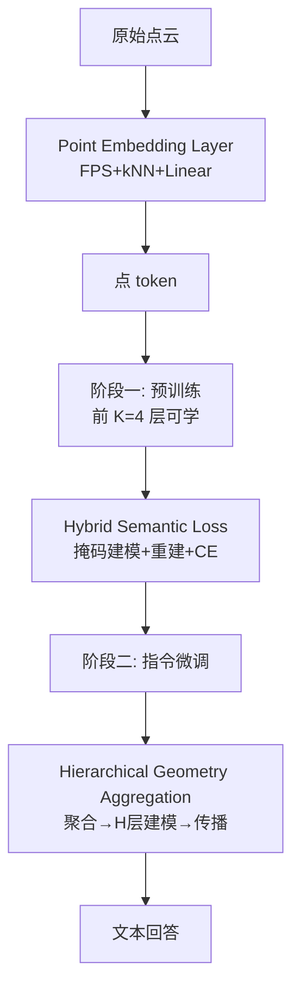

# Exploring the Potential of Encoder-free Architectures in 3D LMMs

**会议**: ICLR 2026  
**OpenReview**: [https://openreview.net/forum?id=22Hh0Vj5Dd](https://openreview.net/forum?id=22Hh0Vj5Dd)  
**代码**: [Ivan-Tang-3D/ENEL](https://github.com/Ivan-Tang-3D/ENEL)  
**领域**: 3D 视觉 / 3D 多模态大模型  
**关键词**: encoder-free、3D LMM、点云理解、自监督损失、几何聚合  

## 一句话总结
本文提出首个**无编码器（encoder-free）3D 大多模态模型 ENEL**，把原本由预训练 3D 编码器承担的「高层语义提取」和「局部几何归纳偏置」两件事直接交给 LLM 自己完成，7B 模型在分类/描述/VQA 上追平 PointLLM-PiSA-13B。

## 研究背景与动机
- **领域现状**：主流 3D LMM（PointLLM、ShapeLLM 等）都是 encoder-based 架构——先用 Point-BERT / I2P-MAE 等重量级预训练 3D 编码器把点云编成高层 embedding，再经投影层喂给 LLM。
- **现有痛点**：这套范式有两个长期顽疾。其一**点云分辨率受限（Point Cloud Resolution Limitation）**——3D 编码器在固定分辨率（如 8192 点）上预训练，推理时点数变化（4K/12K）就会丢失空间信息，captioning GPT-4 分数从 8K 的 ~44 掉到 16K 的 ~42、2K 的 ~33；其二**嵌入语义错位（Embedding Semantic Discrepancy）**——编码器用 MAE / 对比学习等自监督目标训练，提取的特征未必对齐 LLM 的语义需求，简单 MLP 投影层也补不全这层语义鸿沟。
- **核心矛盾**：编码器提供了现成知识，但它的固定分辨率与自监督先验恰恰成了天花板；要不要、能不能把编码器整个拿掉，让 LLM 自己当 3D 编码器？
- **本文目标**：在尽量不掉点的前提下移除 3D 编码器，系统回答两个关键问题——(1) 如何补偿编码器原本提取的高层 3D 语义？(2) 如何把局部几何归纳偏置注入到本无局部建模能力的 LLM 中？
- **核心 idea**：**【语义补偿】** 用「LLM-embedded Semantic Encoding + Hybrid Semantic Loss」在预训练阶段把高层语义压进 LLM 早期层；**【几何补偿】** 用「Hierarchical Geometry Aggregation」在指令微调阶段为 LLM 注入局部到全局的层级几何建模。

## 方法详解

### 整体框架
ENEL 以 PointLLM 为基线、Vicuna-7B 为底座，保留「预训练 + 指令微调」两阶段，但彻底删掉 3D 编码器。输入点云先经一个轻量 **Point Embedding Layer**（Point-PN 变体：FPS 下采样 + k-NN 局部聚合 + 线性层，3 层最佳）转成点 token，直接送入 LLM；并把 LLM 前 **K=4** 层解冻参与多模态对齐。两阶段各负责一个补偿任务：阶段一用 Hybrid Semantic Loss 灌高层语义，阶段二用 Hierarchical Geometry Aggregation 抓局部结构。

### 关键设计

**1. LLM-embedded Semantic Encoding：让早期层接管编码器角色。** 没有编码器，点云缺乏上下文建模，于是把「捕获全局交互、编码高层语义」这件事压给 LLM 自己——具体做法是解冻冻结 LLM 的前 $K$ 层，让 3D token 与文本 token 在共享语义空间里自然交互对齐（early fusion）。实验发现解冻 4 层、且预训练用较小学习率（$4\text{e-}4$ 而非默认 $2\text{e-}3$）能稳定早期层优化、效果最好；分类/描述 GPT-4 分从无编码器裸跑的 35.5/33.4 回升到 47.9/43.5。

**2. Hybrid Semantic Loss：为 encoder-free 量身定制的自监督损失。** 作者先逐一试了四类经典点云自监督损失——掩码建模（MSE 预测被 mask 的点 token）、重建（Chamfer 距离重建点 patch）、对比（几何变换正负对）、知识蒸馏（对齐 Uni3D-L 教师特征），发现掩码建模最强、对比最弱，且 KD/对比开销大收益小。据此提出混合损失：以掩码比 $r=30\%$ 随机 mask 点 token，**对被 mask 部分做掩码建模、对可见部分做重建**，两项与交叉熵各以系数 1 相加：
$$\mathcal{L}_{\text{mask}}=\frac{1}{Mr}\sum_{i=1}^{Mr}\lVert F_{\text{pre}_i}-F_{\text{gt}_i}\rVert_2^2,\quad \mathcal{L}_{\text{recon}}=\frac{1}{M}\sum_i\Big(\min_j\lVert a_i-b_j\rVert_2^2+\min_j\lVert b_i-a_j\rVert_2^2\Big)$$
关键洞见在于它利用了 encoder-free 架构的两个特性：点云的**置换不变性**让可学习 token 直接拼到可见 token 末尾、无需位置复原；以及 LLM 的**因果掩码**（区别于 3D 编码器的双向掩码）改变了可见/掩码 token 的信息流，让可见 token 学更难的目标、可学习 token 只做轻量重建。该损失把分类/描述推到 52.0/47.65。

**3. Hierarchical Geometry Aggregation：给 LLM 补上局部到全局的几何层级。** 标准 Transformer 每层 token 数与语义层级不变，缺少 3D 编码器那种 local-to-global 的归纳偏置。本设计在指令微调阶段从 LLM 第二层起，按点坐标用 **Dynamic Grid Sampling** 把 token 分组聚合，网格尺寸随聚合层累积放缩：
$$s_i=\alpha\cdot e^{\sum_{j=1}^{i}\beta_j},\quad \beta_j=\gamma\cdot\tanh(\theta_j)+\beta_{\text{ctr}},\quad s_i\in[0.02,1]\text{ m}$$
同一网格内的点做 **gated self-attention**（输出乘以零初始化的 $\tanh(\alpha)$ 自适应门控）后均值池化得到聚合 token；经 $l$ 次聚合、中间插 $H$ 层 LLM 做语义建模，再用 grid unpooling 把特征**传播**回原始点分布以保留细粒度。消融表明 $l=3$（约 1/8 采样率）、$H=2$、加 gated self-attention 最优，最终分类/描述达 55.55/51.03。

## 实验关键数据

### 主实验表格（Objaverse benchmark，GPT-4 评分）

| 模型 | Cap (GPT-4) | Cls Avg (GPT-4) | QA (GPT-4) |
|------|:----:|:----:|:----:|
| PointLLM-7B | 44.85 | 53.00 | 41.20 |
| PointLLM-13B | 48.15 | 54.00 | 46.60 |
| ShapeLLM-13B | 48.94 | 54.00 | 53.10 |
| PointLLM-PiSA-13B | 50.52 | 55.00 | 46.80 |
| **ENEL-7B** | **51.03** | **55.55** | 43.80 |
| **ENEL-7B\*** (Qwen2.5-7B + ShapeLLM 数据) | **57.91** | **61.00** | **55.20** |

ENEL-7B 在描述与分类上以 7B 规模超过/追平 13B 的 encoder-based SOTA；换用 Qwen2.5-7B 底座与 ShapeLLM 训练数据（标 \*）后进一步大涨。

### 消融实验表格

| 模块 | 配置 | Cls (Avg) | Cap |
|------|------|:----:|:----:|
| Token Embedding | 无编码器裸跑 | 35.50 | 33.37 |
| Token Embedding | +3 层 T.E.（最佳） | 45.55 | 41.36 |
| 自监督损失 | Hybrid Semantic Loss_feat | 52.00 | 47.65 |
| 几何聚合 | l=3 | 53.00 | 48.93 |
| 几何聚合 | H=2 | 54.25 | 49.56 |
| 几何聚合 | + gated Self-Attn.（最终） | 55.55 | 51.03 |

### 关键发现
- 点云自监督损失整体都对 encoder-free 有益；其中**掩码建模最有效、对比损失最差**，KD 开销大收益小——故 Hybrid Loss 选「掩码建模+重建」组合。
- 掩码比 30% 优于 60%（过高增加训练难度）；聚合层 $l$ 太少抓不到局部、太多又过度简化空间关系，$H$ 过大导致聚合信息过平滑。
- 注意力可视化显示 encoder-free 的点 token 对文本 token 有更强语义相关性，直接佐证「LLM 当编码器」缓解了语义错位。

## 亮点与洞察
- **首个系统性 encoder-free 3D LMM 研究**：不是单纯刷点，而是把「编码器到底做了什么、能否让 LLM 接管」拆成语义补偿 + 几何补偿两问，给出可复现的实证路径。
- **把架构特性变成损失设计的杠杆**：Hybrid Semantic Loss 显式利用点云置换不变性 + LLM 因果掩码，让「拼接可学习 token + 可见/掩码分工」成立，是对 2D encoder-free 思路的本质改造而非照搬。
- **7B 追平 13B**：在相同 PointLLM 训练数据下用更轻架构反超更大模型，说明编码器并非 3D 理解的必需品。

## 局限与展望
- 实验主要在**对象级点云**（Objaverse）上验证，未涉及场景级 3D 理解，可扩展性待证。
- Hierarchical Geometry Aggregation 引入网格尺寸调度、门控注意力等超参，需逐项消融调优，迁移到新数据集的鲁棒性未充分讨论。
- 最强结果依赖换底座（Qwen2.5-7B）与 ShapeLLM 数据，纯方法贡献与数据/底座增益的解耦还可更清晰。
- 仍依赖两阶段训练流程，端到端简化与更大规模扩展是自然的下一步。

## 相关工作与启发
- **2D encoder-free LMM**（EVE/EVEv2、SAIL、Mono-InternVL、Fuyu-8B）：用轻量随机初始化 token embedding 替代视觉编码器，本文借鉴其「去编码器」思路但指出 3D 需额外补几何与语义。
- **3D LMM**（PointLLM、ShapeLLM、MiniGPT-3D）：encoder-based 主流路线，本文作为对照与基线。
- **点云自监督**（Point-MAE、Point-BERT、Uni3D、Point-PN）：被复用为 token embedding 设计与候选自监督损失的来源。
- **启发**：当 LLM 足够强时，模态编码器的角色可以被「合适的损失设计 + 早期层解冻 + 显式几何归纳模块」逐步内化，这一思路或可推广到其它结构化模态（图、网格、轨迹）。

## 评分
- 新颖性: ⭐⭐⭐⭐ 首个 encoder-free 3D LMM，损失设计与几何聚合均有针对性创新。
- 实验充分度: ⭐⭐⭐⭐ 四类自监督损失、token 层数、可学习层、l/H/门控逐项消融扎实，但限于对象级。
- 写作质量: ⭐⭐⭐⭐ 以「两问驱动」组织全文，逻辑清晰、图表完备。
- 价值: ⭐⭐⭐⭐ 为 3D 多模态提供了去编码器的可行范式，7B 追平 13B 颇具说服力。

<!-- RELATED:START -->

## 相关论文

- [\[ICLR 2026\] Weight Space Representation Learning on Diverse NeRF Architectures](weight_space_representation_learning_on_diverse_nerf_architectures.md)
- [\[CVPR 2026\] VENI: Variational Encoder for Natural Illumination](../../CVPR2026/3d_vision/veni_variational_encoder_for_natural_illumination.md)
- [\[CVPR 2025\] 3D-LLaVA: Towards Generalist 3D LMMs with Omni Superpoint Transformer](../../CVPR2025/3d_vision/3d-llava_towards_generalist_3d_lmms_with_omni_superpoint_transformer.md)
- [\[ICCV 2025\] GaussianProperty: Integrating Physical Properties to 3D Gaussians with LMMs](../../ICCV2025/3d_vision/gaussianproperty_integrating_physical_properties_to_3d_gaussians_with_lmms.md)
- [\[CVPR 2025\] DUNE: Distilling a Universal Encoder from Heterogeneous 2D and 3D Teachers](../../CVPR2025/3d_vision/dune_distilling_a_universal_encoder_from_heterogeneous_2d_and_3d_teachers.md)

<!-- RELATED:END -->
