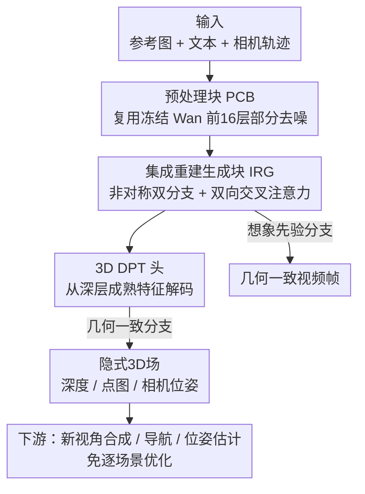

# FantasyWorld: Geometry-Consistent World Modeling via Unified Video and 3D Prediction

**会议**: ICLR 2026  
**OpenReview**: [https://openreview.net/forum?id=3q9vHEqsNx](https://openreview.net/forum?id=3q9vHEqsNx)  
**论文**: [Project Page](https://fantasy-amap.github.io/fantasy-world/)  
**代码**: 无（仅项目页）  
**领域**: 3D视觉 / 世界模型 / 视频生成  
**关键词**: 世界模型, 几何一致, 视频扩散, 前馈三维重建, 跨分支监督

## 一句话总结
FantasyWorld 在冻结的视频基础模型（Wan2.1）旁挂一条可训练的几何分支，让一次前向传播同时吐出相机条件下的视频帧和一个隐式 3D 场（深度/点图/相机位姿），并通过双向交叉注意力让几何约束视频、视频先验补全几何，在 WorldScore 的多视角一致性与风格一致性上超过近期几何一致基线。

## 研究背景与动机

**领域现状**：用视频扩散模型做 3D 世界生成是近期主流——把相机轨迹作为条件，生成多视角图像，让帧隐式编码场景的 3D 结构（ReconX、Gen3C、DimensionX、ViewCrafter 等）。同时另一条线是前馈 3D 基础模型（DUSt3R、Fast3R、VGGT），它们能在单次前向里直接预测点云/深度/相机，不需要逐场景重建。

**现有痛点**：作者指出三个具体问题。第一，纯视频生成模型的特征只活在视频域里，无法直接支持 3D 推理；想要显式 3D 时还得回去做 NeRF/3DGS 的逐场景优化，开销大。第二，视频"想象"和 3D"感知"在推理时只是弱耦合——像 Voyager 虽然同时预测 RGB 和深度，但两条流程基本各跑各的，不能互相强化。第三，把 3D 先验注入视频的常见做法（如 Geometry Forcing）要去微调视频基础模型本身，既贵又有损伤大模型生成创造力的风险。

**核心矛盾**：怎样在不牺牲视频模型创造力（不微调骨干）的前提下，给视频生成注入可靠的几何接地，并让几何与视频在推理时真正双向互助，而不是事后拼接。

**本文目标**：拆成三个子问题——(i) 不微调视频骨干就能产出可复用的 3D 一致特征；(ii) 让几何监督视频、视频先验正则化几何，做到紧耦合；(iii) 几何分支的隐式特征能直接服务于新视角合成、导航等下游任务，免逐任务适配。

**切入角度**：作者观察到去噪扩散不仅沿时间步揭示结构，也沿网络深度揭示结构——同一时间步下，越深的 WanDiT 层产出的空间结构越清晰。于是与其从 RGB 图像里预测深度，不如直接从视频 latent 里推断相机和 3D 信号，让几何与视频生成在同一个特征域里完成。

**核心 idea**：冻结视频骨干、外挂一条可训练几何分支，把骨干切成"预处理块（PCB）+ 集成重建生成块（IRG）"，用双向交叉注意力把视频想象与 3D 感知缝在一条前向里互相监督。

## 方法详解

### 整体框架

FantasyWorld 是一个统一的前馈模型：输入一张参考图、可选文本提示和一条目标相机轨迹，输出一段沿指定视角的视频，同时构建一个隐式 3D 表示。图像用 CLIP 编码、文本用 umT5、相机用 Wan 的 Plücker-ray 设计编码，三路信号共同条件化视频分支和几何分支。

整条管线分三段。前端是**预处理块 PCB**：复用 Wan2.1 前 16 层冻结的去噪器，把纯噪声 latent 先部分去噪成带几何线索的特征，保证几何分支不是从噪声起步。骨干主体是堆叠的 **IRG 块**：每块内部是一个非对称双分支——"想象先验分支"复用 Wan2.1 传播富外观的时空特征，"几何一致分支"把它们投影到几何对齐的隐空间，两支通过轻量 adapter 和双向交叉注意力耦合。最后输出两路：想象分支沿轨迹生成几何一致的视频帧；几何分支产出任务无关的 3D 特征，由定制 3D DPT 头解码成深度图、点图和相机位姿。整套设计支持新视角合成、位姿估计、深度预测等下游任务，全程不需要逐场景优化。

### 关键设计

**1. 预处理块 PCB：让几何分支从"有结构的 latent"而非纯噪声起步**

几何分支最怕的是直接吃高噪 latent——梯度方差大、训练早期被噪声主导，学不到稳定结构。作者基于"去噪沿时间步和网络深度双向推进"的观察（图 3 的 PCA 显示即使固定时间步，更深的 WanDiT 层结构也更清晰），复用 Wan2.1 前 16 层冻结去噪器把视频 latent 部分去噪，再喂给几何分支。这样几何分支的输入已经含有几何相关线索而非纯噪声，降低了梯度方差、避免训练初期被高噪 latent 拖垮，让几何分支专注于"精修结构"而不是"从噪声里捞结构"。本质上 PCB 是噪声初始化与几何感知处理之间的一座桥。

**2. IRG 块的非对称双分支 + 双向交叉注意力：让想象与几何在同一域里互相强化**

这是全文核心，直击"视频与 3D 弱耦合"的痛点。每个 IRG 块里，想象先验分支复用预训练 Wan2.1 骨干传外观时空特征，几何一致分支把这些特征投到几何对齐隐空间——关键区别于 VGGT 用 DINO 特征，这里几何直接桥接到 Wan latent，保证几何与视频生成在同一特征域里推断，避免特征错配。两支通过 MM-BiCrossAttention 双向耦合：对视频 token $X_v$ 和几何 token $X_g$，计算 $A = \mathrm{softmax}(Q_v K_g^\top / \sqrt{d_k})$，再用可学习门控更新

$$X_v^+ = X_v + \gamma_v A V_g, \qquad X_g^+ = X_g + \gamma_g A^\top V_v$$

几何到视频的更新强制 3D 一致性（约束多视角连贯），视频到几何的更新注入生成先验（补全遮挡区域、精修几何）。堆叠的 IRG 块就是"想象与结构收敛"的协作单元，让两者逐层共同增强。

**3. 反转重组的 3D DPT 头：从语义成熟的深层特征解码几何**

传统 DPT 重组（reassemble）习惯从早期编码层抽细粒度特征，但在扩散骨干里早期层被噪声主导。作者顺着 3.2 节"结构随深度涌现"的观察反转这个策略：不从早层捞细节，而是从晚期扩散块取特征——那里语义更强、去噪更成熟。把预测锚定在这些稳定特征上，能提升深度精度、稳定位姿估计、增强隐式 3D 场的一致性。这个头还做了与 WanVAE 视频帧对齐的时序解码，保证解出的几何和视频帧在时间上对齐。

**4. 两阶段训练：先桥接几何分支，再统一协同优化**

为了在冻结骨干的约束下稳定训练，作者分两阶段。**阶段一（Latent Bridging）**冻结整个 Wan2.1，只训几何分支：取 block 16 的隐特征，经一个轻量 transformer adapter 映射到几何对齐隐空间，再编解码出相机、深度、点图，监督为 $L_{geo} = \alpha L_{depth} + \beta L_{pmap} + \gamma L_{camera}$（深度遵循 Video Depth Anything、点图遵循 VGGT、相机用 Huber 惩罚）。**阶段二（Unified Co-Optimization）**从 block 16 起，在 24 个 transformer 块后各插一个双向交叉注意力 adapter，只微调这些轻量交互模块（双向交叉注意力 + 相机控制 adapter），骨干仍全冻；相机 adapter 改为只预测位移 $\beta_i$ 并加性注入 $f_i = f_{i-1} + \beta_i$（作用于前 40 块中的前 24 块）。总目标把标准扩散损失与几何监督相加：

$$L_{total} = \mathbb{E}_{z_0,\epsilon,t,c}\big[\|\epsilon_\theta(z_t,t,c)-\epsilon\|_2^2\big] + \lambda L_{geo}$$

权重 $\lambda$ 平衡视频生成与几何学习，使多视角连贯性与跨分支协同适配同时成立。冻结骨干 + 只训轻量交互模块，正是"不损伤视频模型创造力"这一目标的直接落地。

### 损失函数 / 训练策略
- 几何监督 $L_{geo}$：深度（Video Depth Anything）+ 点图（VGGT 式）+ 相机（Huber）的加权和。
- 总损失：扩散去噪损失 + $\lambda L_{geo}$。
- 优化器 AdamW，学习率 $10^{-5}$。阶段一 20,000 步、全局 batch 64，64 张 H20 跑 36 小时；阶段二用 81 帧、592×336 / 336×592 片段，10,000 步、全局 batch 112，112 张 H20 跑 144 小时，全程骨干冻结。
- 训练语料约 18 万视频片段，几何标签来自两类策略：RealEstate10K/ACID 用基于重建的管线生成多视角一致深度，DL3DV/WildRGB/ScanNet/TartanAir 用 Cut3R 提取几何标签。

## 实验关键数据

### 主实验

在 WorldScore 静态 photorealistic 子集（1,000 样本）上评测世界生成，并自建 Large 设置（100 个最高 90° 的大幅环绕/平移轨迹）测鲁棒性。FantasyWorld 在所有一致性指标（3D / Photo / Style Consist.）上最优，且样本间标准差最低（更稳）。

| 设置 | 方法 | 3D Consist.↑ | Photo Consist.↑ | Style Consist.↑ |
|------|------|------|------|------|
| Small | WonderWorld | 82.85 | 67.86 | 55.79 |
| Small | Uni3C | 78.59 | 85.48 | 88.32 |
| Small | Voyager | 56.00 | 80.68 | 72.89 |
| Small | AETHER | 79.84 | 58.68 | 72.09 |
| Small | **Ours w/ 3D** | **83.31** | **86.11** | **94.22** |
| Large | Uni3C | 73.95 | 46.78 | 71.43 |
| Large | WonderWorld | 63.70 | 3.22 | 35.95 |
| Large | **Ours w/ 3D** | **74.83** | **60.61** | **82.02** |

注：FantasyWorld 不直接优化 Camera Ctrl. / Content Align. 这类指令跟随指标（这些项分数不占优），因为它的重心是把几何感知嵌入视频特征、产出可复用 3D 表示，需要时可后接显式重建恢复相机可控性。

几何保真度上，用 3DGS 在 100 个 RealEstate10K 样本上重建并报 PSNR/SSIM/LPIPS：

| 方法 | 初始化 | PSNR↑ | SSIM↑ | LPIPS↓ |
|------|--------|-------|-------|--------|
| Ours w/o 3D | VGGT | 26.89 | 0.84 | 0.17 |
| Ours w/ 3D | VGGT | 28.24 | 0.86 | 0.14 |
| Ours w/ 3D | 自身前馈点云 | 26.54 | 0.85 | 0.19 |

同样 VGGT 初始化下加几何分支稳定提升 PSNR/SSIM 并降 LPIPS；用自身预测点云直接初始化虽略低于 VGGT，但仍有竞争力，说明几何分支无需外部监督也能产出有意义的 3D 结构。

### 消融实验

| 配置 | 3D Consist.(Small) | PSNR(3DGS) | 说明 |
|------|------|------|------|
| Full（w/ 3D） | 83.31 | 28.24 | 完整模型 |
| w/o 几何分支 + 双向交叉注意力 | 79.77 | 26.89 | 3D 一致性显著下降，重建质量也变弱 |

去掉几何分支和双向交叉注意力后，Photo/Style Consist. 下滑、3D Consist. 下降尤其明显，3DGS 重建 PSNR 也从 28.24 掉到 26.89——印证统一骨干与跨分支信息交换是收益来源。

### 关键发现
- 几何分支 + 双向交叉注意力贡献最大：去掉后多视角一致性掉得最狠，说明"几何约束视频"这条回路是多视角连贯的关键。
- 大相机运动（Large 设置）下优势更突出：基线在大视角偏移下崩坏（WonderWorld 撕裂/空洞、Uni3C/Voyager 首帧点云先验很快移出视野导致风格漂移与多视角错位、AETHER 内容低细节），FantasyWorld 因为隐式 3D 表示随视频演化而非静态先验，几何与外观跨时间都稳。
- 几何分支自身的点云已能独立支撑重建（即使没有 VGGT 初始化也有竞争力），说明它学到的是真·3D 结构而非依附外部监督。

## 亮点与洞察
- **"去噪沿深度推进"被反向利用**：常规 DPT 从早层取细节，本文反转——从语义成熟的晚期扩散块取几何特征，把一个被普遍忽视的扩散性质（深层结构更清晰）转化成几何精度的来源，思路很巧。
- **冻结骨干 + 外挂分支**避开了"微调视频大模型损伤创造力"的陷阱，只训轻量交互模块就拿到几何接地，工程性价比高（阶段二只调双向交叉注意力和相机 adapter）。
- **双向门控更新**（$\gamma_v, \gamma_g$ 可学习门控）让几何→视频、视频→几何两条信息流强度自适应，而不是固定权重硬拼，这种"互助"机制可迁移到任何想耦合两个异构分支的多任务场景。
- 几何分支输出"任务无关 3D 特征"、免逐场景优化，意味着同一前向结果能直接复用于新视角合成/导航——把生成与感知的产物统一成一种可复用表示。

## 局限与展望
- 在 Camera Ctrl. / Content Align. 等指令跟随/相机操控指标上不占优，作者承认重心不在此，需要时要靠后处理显式重建补回相机可控性——即纯前向产物的可控性仍有上限。
- 评测刻意只用 photorealistic 子集、排除 stylized（理由是风格化视频的 3D 一致性定义不清），所以在风格化/非真实场景下的几何一致表现是未知数。
- 强依赖 Wan2.1 这一特定骨干及其 Plücker-ray 相机设计，PCB 复用前 16 层、IRG 作用于前 24/40 块等都是与该骨干绑定的经验设置，迁移到别的视频基础模型需重新定位这些切分点。
- 几何标签本身是用 Cut3R / 重建管线"伪标注"出来的，标签噪声会传导到几何分支，真实几何精度受限于这些自动标注质量。

## 相关工作与启发
- **vs Geometry Forcing**: 它把视频中间表示对齐到冻结几何基础模型并**微调 VFM**，本文反过来冻结 VFM、只训外挂几何分支，避免损伤生成创造力且更省算力。
- **vs Voyager**: Voyager 联合预测 RGB + 深度并靠 cache/几何注入帧维持一致性，但视频与 3D 两条流程基本独立；本文用双向交叉注意力让两者在同一前向里真正双向互助。
- **vs VGGT**: 本文几何分支架构借鉴 VGGT 的前馈多属性预测，但把几何桥接到 Wan latent 而非 DINO 特征，保证几何与视频在同一域、避免特征错配。
- **vs WonderWorld / Uni3C**: 它们依赖首帧静态点云先验，大视角运动时先验移出视野即崩；本文的隐式 3D 表示随视频演化，故在 Large 设置下稳定性优势明显。

## 评分
- 新颖性: ⭐⭐⭐⭐ 把"去噪沿深度推进"反向用于几何解码、冻结骨干外挂几何分支双向耦合，组合新颖。
- 实验充分度: ⭐⭐⭐⭐ WorldScore + 3DGS 双维度评测、Small/Large 两种相机运动、几何分支消融齐备；但缺代码、排除风格化子集。
- 写作质量: ⭐⭐⭐⭐ 动机三点清晰、方法图文对照；部分实现细节推到附录。
- 价值: ⭐⭐⭐⭐ 统一视频想象与 3D 感知、产出免优化可复用 3D 特征，对世界模型/具身方向有实用价值。

<!-- RELATED:START -->

## 相关论文

- [\[ICLR 2026\] Unified 3D Scene Understanding Through Physical World Modeling](unified_3d_scene_understanding_through_physical_world_modeling.md)
- [\[ICLR 2026\] CHROMA: Consistent Harmonization of Multi-View Appearance via Bilateral Grid Prediction](chroma_consistent_harmonization_of_multi-view_appearance_via_bilateral_grid_pred.md)
- [\[ICLR 2026\] OmniWorld: A Multi-Domain and Multi-Modal Dataset for 4D World Modeling](omniworld_a_multi-domain_and_multi-modal_dataset_for_4d_world_modeling.md)
- [\[CVPR 2026\] Towards Realistic and Consistent Orbital Video Generation via 3D Foundation Priors](../../CVPR2026/3d_vision/orbital_video_3d_foundation_priors.md)
- [\[ICLR 2026\] Lyra: Generative 3D Scene Reconstruction via Video Diffusion Model Self-Distillation](lyra_generative_3d_scene_reconstruction_via_video_diffusion_model_self-distillat.md)

<!-- RELATED:END -->
