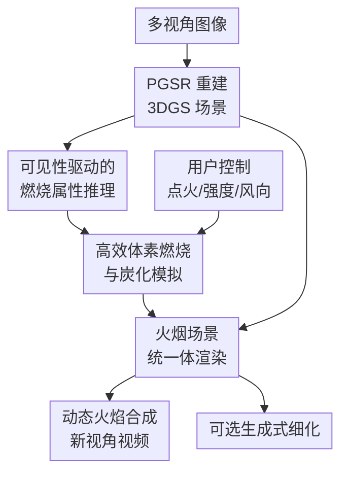

# FieryGS: In-the-Wild Fire Synthesis with Physics-Integrated Gaussian Splatting

**会议**: ICLR2026  
**OpenReview**: [https://openreview.net/forum?id=ziKFH7whvy](https://openreview.net/forum?id=ziKFH7whvy)  
**论文**: [Project Page](https://pku-vcl-geometry.github.io/FieryGS/)  
**代码**: 待发布  
**领域**: 3D视觉  
**关键词**: Gaussian Splatting, 火焰合成, 物理仿真, 材料推理, 体渲染  

## 一句话总结
FieryGS 把真实场景的 3D Gaussian Splatting 重建、MLLM 材料属性推理、可控燃烧仿真和统一体渲染接在一起，让用户能在野外采集的多视角场景中自动合成既像真火、又遵守材料与几何约束的动态火焰、烟雾和炭化效果。

## 研究背景与动机
**领域现状**：火焰合成长期有两条路线，一条是 CFD、Houdini、Blender 等基于物理或 VFX 的流程，另一条是近年的图像/视频生成模型直接把火加到画面里。
前者可以表达流体、温度、烟雾、炭化等物理过程，但需要专家手工建模几何、标注材料、调仿真参数，再把仿真结果和真实场景对齐。
后者使用门槛低，视觉上也能生成有冲击力的火焰，却往往会改掉原场景结构，也难以保证火从可燃材料开始、沿合理方向传播、随风和强度变化而变化。

**现有痛点**：真实场景里的火不是一张贴图，也不是一个孤立的粒子特效。
它依赖场景几何、物体材料、点火位置、空气流动和燃烧状态，并且还会反过来改变场景外观，例如让木头变黑、让塑料产生黑烟、让火光照亮周围表面。
传统 VFX/CFD 管线的问题在于这些信息几乎都要人工提供；视频生成模型的问题则在于它通常只学到视觉相关性，没有显式的物理状态和可控参数。

**核心矛盾**：真实世界对齐和物理可控之间存在缺口。
3DGS 已经能从多视角照片中高质量重建真实场景，但它本质上是外观表示，不知道哪个高斯点是木头、哪个是金属，也不知道哪里可以被点燃。
燃烧仿真知道如何更新速度、温度、反应坐标和炭化程度，却需要可用的几何与材料输入。
FieryGS 的核心任务就是把这两端接起来：用 3DGS 提供真实场景基底，用物理推理和仿真给它补上燃烧语义。

**本文目标**：论文要解决三个具体子问题。
第一，如何从 in-the-wild 多视角图像中得到既有几何又带燃烧属性的场景表示。
第二，如何在不过度牺牲效率的情况下模拟火焰传播、烟雾扩散和表面炭化。
第三，如何把火、烟、炭化后的 3DGS 以及火光照明统一渲染到同一张图里，并允许用户调点火位置、强度和风向。

**切入角度**：作者没有试图用一个生成模型端到端“画火”，而是把已有的物理知识拆成可接入 3DGS 的模块。
PGSR 负责提供更准确的几何和法线，SAM/SAGA/HDBSCAN 风格的 3D 高斯分割把场景切成材料一致的区域，MLLM 在最可见视角上判断材料和可燃性，体素网格承接燃烧仿真，最后再通过统一体渲染把仿真状态转成图像。
这种设计的好处是每一步都有可解释的物理含义，也能把用户控制变量直接映射到火焰行为。

**核心 idea**：用“3DGS 重建 + MLLM 材料推理 + 轻量燃烧仿真 + 统一体渲染”替代手工 VFX 管线，把真实场景里的可燃材料、火焰动力学和视觉合成放进同一个自动化流程。

## 方法详解
### 整体框架
FieryGS 的输入是同一场景的多视角图像，输出是任意视角下随时间变化的火焰、烟雾、炭化和火光效果。
整体流程先用 PGSR 重建带较好几何质量的 3DGS，再把高斯点分割成材料区域；每个区域从最可见视角渲染成图像后交给 GPT-4o 推理材料、可燃性和热扩散相关属性。
这些属性被投回 3D 高斯并转成体素占据网格，随后燃烧仿真在空气体素中更新火焰/烟雾状态，在可燃固体体素中更新温度和炭化程度，最终由统一渲染器把模拟火、烟、炭化场景和 3DGS 背景合成。

这里有几个重要边界需要分清。
PGSR、SAM 和 HDBSCAN 等步骤主要是脚手架，用来得到可被推理和仿真的 3D 场景。
真正属于 FieryGS 的贡献节点是三块：可见性驱动的燃烧属性推理、高效体素燃烧与炭化模拟、火烟场景统一体渲染。
用户控制不是后处理按钮，而是直接进入仿真方程，例如点火位置决定初始反应坐标，强度通过浮力和反应速率影响火焰高度与持续时间，风向则作为外力改变传播方向。
可选生成式细化只用于补高频视觉细节，不是论文物理一致性的核心来源。

### 关键设计
**1. 可见性驱动的燃烧属性推理：把 3DGS 从外观表示变成可燃材料场**

普通 3DGS 只记录高斯中心、协方差、不透明度和颜色，它能渲染真实场景，却不知道“这个高斯点是木头还是金属”。
FieryGS 先给每个 Gaussian 训练一个特征向量，把这些特征通过 3DGS alpha blending 渲染到 2D，再用多视角 SAM mask 做对比学习，使同一 3D 区域里的高斯点在特征空间更接近。
训练后用 HDBSCAN 聚类得到实例级 3D 区域，每个区域被假设为共享主要材料属性。

材料推理的关键不只是“把区域截图给 MLLM”，而是选择最可靠的观察视角。
真实场景中同一个物体可能被遮挡，若从错误视角看，只露出一小块或被背景混淆，GPT-4o 很容易误判材料。
论文用深度图统计目标区域中未遮挡 Gaussian 的数量，挑选目标区域可见性最高的视角，再给 MLLM 输入全局图、带 mask/box 的上下文图和局部裁剪图。
输出被限制成一个四元组：区域描述、材料类型、是否可燃、相对木材的热扩散率。
这一步让每个 3D 区域获得 material type、burnability、thermal diffusivity、smoke color 等属性，随后再直接赋给区域内所有高斯点。

这种设计解决的是燃烧仿真最缺的“场景初始化”问题。
传统 CFD/VFX 需要人工告诉系统哪里是木头、哪里是金属、哪里能烧；FieryGS 则从真实图像重建出的 3DGS 中自动推断这些信息。
论文还报告 MLLM 推理平均每个场景约 84 次 API 调用，平均成本约 0.55 美元，材料推理平均准确率约 89.31%，说明它在自动化和成本之间取得了可用平衡。

**2. 高效体素燃烧与炭化模拟：用轻量物理方程捕捉最影响观感的火焰状态**

拿到带材料属性的 3DGS 后，FieryGS 会构造占据网格：如果某个 voxel 与不透明度超过阈值的高斯重叠，就标为 occupied；若其中有可燃高斯，则进一步标为 combustible。
空气区域用于火焰和烟雾模拟，可燃固体区域用于热传导和炭化模拟。
这使仿真域天然贴合真实重建场景，而不是依赖手工建模的 CAD 或 VFX asset。

火焰部分采用不可压缩流体近似，更新速度场 $u$ 和反应坐标 $Y$：
$$
\frac{\partial u}{\partial t} + u \cdot \nabla u = -\frac{1}{\rho}\nabla p + f, \quad \nabla \cdot u = 0,
$$
$$
\frac{\partial Y}{\partial t} + u \cdot \nabla Y = -k.
$$
其中 $Y=1$ 表示正在燃烧，$Y=0$ 表示未燃烧。
初始时只有用户指定且被判定为可燃的点火体素被置为 $Y=1$。
外力 $f$ 包含浮力 $f_{buo}=\alpha(T-T_{air})z$ 和 vorticity confinement，用来产生上升与涡旋效果。
为了效率，温度 $T$ 不通过完整热传导 PDE 求解，而被近似成反应坐标 $Y$ 的二次函数；这会牺牲一部分物理细节，但保留了燃烧进度和火焰温度之间最影响视觉的关系。

炭化部分则在可燃固体体素上更新材料温度 $T_m$ 和相对炭质量 $M_c$。
论文使用简化热传导方程：
$$
\frac{\partial T_m}{\partial t}=\beta\nabla^2T_m + \gamma_m(T_{amb}^4-T_m^4)+S_{T_m}.
$$
当 $T_m$ 超过点火阈值 $T_{ign}$ 时，系统用近似项把温度钳到燃烧温度 $T_{burn}$，并通过 $\frac{\partial M_c}{\partial t}=\epsilon_c\xi(T_m)$ 累积炭化程度。
每个高斯点继承所在体素的 $M_c$，后续渲染时就能逐渐变暗。
作者有意识地省略质量损失、挥发物释放、隔热层形成等更复杂过程，因为这些过程成本高且依赖难以观测的内部材料参数；对视觉合成而言，火焰传播、烟雾和表面变黑才是更直接的感知信号。

**3. 火烟场景统一体渲染：把火、烟、炭化和 3DGS 放进同一个光线积分**

如果只把仿真得到的火焰贴到 3DGS 背景上，结果会像前景 overlay：烟雾不遮挡场景，火光不照亮物体，炭化也不会随材料状态变化。
FieryGS 的渲染器把 fire、smoke、charred 3DGS 和 Phong illumination 统一写进一个体渲染表达：
$$
L = L_{fire} + L_{smoke} + \hat{T}(L_{GS}+L_{phong}).
$$
这里 $L_{fire}$ 是沿射线累积的火焰自发光，$L_{smoke}$ 是烟雾贡献，$\hat{T}$ 是穿过火和烟后的剩余透射率，$L_{GS}$ 是带炭化颜色修正的 3DGS 辐射，$L_{phong}$ 是火焰对几何表面的直接照明。

火焰渲染把活跃燃烧区域视为黑体辐射源，利用 Planck 定律计算光谱辐射，再转到 RGB；烟雾在 $Y \leq Y_{smoke}$ 的区域出现，颜色由前面的材料推理决定，例如木头偏白烟，塑料偏黑烟。
炭化渲染对 $M_c \geq M_c^{dark}$ 的高斯点施加颜色缩放，让表面随炭化程度逐渐变暗。
火光照明则把高温体素看成体积光源，用 3DGS 渲染得到的 normal map 计算漫反射和高光项。
这种统一渲染让“火在空间里”、 “烟挡住背景”、 “火照亮桌面”、 “物体烧黑”这些现象发生在同一个组合里，而不是互相独立的后处理层。

**4. 可控参数接口与生成式细化：让用户编辑物理状态而不是只改提示词**

FieryGS 的可控性来自仿真变量本身。
用户点火时，系统只把被材料推理判定为可燃的目标体素设为 $Y=1$，因此不会把金属勺子一类不可燃对象当作火源。
火焰强度可以通过增大浮力系数 $\alpha$、减小反应速率 $k$ 来提高：前者让火焰更向上、更高，后者让可见火焰持续更久。
风向则作为外部风力加入速度场，能改变火焰和烟雾的传播方向。
此外，热扩散率 $\beta$、炭化速率 $\epsilon_c$ 等参数也可调，给用户提供比视频生成模型更明确的编辑接口。

论文还加入一个可选的 Wan2.1 生成式细化模块，用 SDEdit 风格把物理仿真视频编码到潜空间、加噪、再用首帧和文本条件去噪。
它的作用是补充高频火焰边缘、反射和复杂光照细节，不是替代物理仿真。
作者也明确指出这一步可能改变背景内容，且长视频的时间/3D 一致性仍不稳定，所以主方法的物理可信度仍应看仿真和统一渲染，而不是看生成模型“润色”后的外观。

### 一个完整示例
假设输入是一个厨房桌面场景，场景中有木盒、塑料积木、金属勺和陶瓷杯。
系统先用多视角图像重建出 3DGS，并为每个高斯点学习分割特征。
聚类后，木盒、积木、勺子、杯子和桌面成为若干 3D 区域。
对“杯子里露出的金属勺”这类容易误判的小区域，系统会选择遮挡最少、目标高斯点可见数量最多的视角，再让 GPT-4o 判断材料。
如果输出为“metal, unburnable”，这一区域即使靠近火源也不会被标成 combustible。

用户把点火位置放在木盒侧面后，对应可燃体素的 $Y$ 被置为 1。
随着仿真推进，反应坐标被速度场带动并逐步消耗，浮力让高温火焰向上，热扩散让相邻可燃材料升温。
木盒的 $M_c$ 逐渐增大，渲染时表面颜色变暗；若火蔓延到塑料积木，烟雾颜色会变黑，而木盒周围烟雾更偏白。
如果用户加一股向右风，速度场中新增外力会把火焰和烟雾推向右侧；如果用户提高强度，增大的 $\alpha$ 和减小的 $k$ 会让火焰更高、更持久。
最后统一渲染器在同一条射线上累计火焰自发光、烟雾遮挡、被炭化的 3DGS 背景和火光照明，于是得到随时间演化且新视角一致的燃烧视频。

### 损失函数 / 训练策略
FieryGS 中需要学习的部分主要在 3D Gaussian 分割特征上。
每个 Gaussian 被赋予一个可学习特征 $f_g \in \mathbb{R}^D$，通过标准 3DGS alpha blending 渲染成 2D feature map。
多视角图像上的 SAM mask 提供弱监督，系统采用 SAGA 式对比学习，让同一 mask 内像素的特征更接近、不同 mask 的特征更分离。
训练结束后，HDBSCAN 在特征空间做聚类，得到材料区域。

燃烧仿真本身不是神经网络训练，而是显式时间步进。
单个时间步包括四类操作：用 semi-Lagrangian 方法 advect 速度场和反应坐标；加入浮力、涡旋约束、风等外力并消耗 $Y$；用 Gauss-Seidel 解 pressure projection 保证 $\nabla \cdot u=0$；最后显式更新材料温度和炭化质量。
实现上作者使用 Taichi 从零写仿真，网格分辨率为 $256 \times 256 \times 256$，渲染部分使用 PyTorch，并采用先 128 个均匀采样点、再按 $Y$ 做 1024 个 importance samples 的 coarse-to-fine 体采样策略。

## 实验关键数据
### 主实验
论文在 6 个真实场景上评估，包括 iPhone 采集的 Firewood、Kitchen、Chair、Stool，以及 MipNeRF360 的 Garden 和 Tanks and Temples 的 Playground。
对比方法包括 AutoVFX、Runway-V2V 和 Instruct-GS2GS，分别代表自动 VFX 管线、商业视频到视频生成模型和文本驱动 3DGS 编辑。
主结果显示，FieryGS 在视觉质量、结构保持和用户偏好上都优于这些基线。

| 方法 | Aesthetic Quality↑ | Imaging Quality↑ | DINO Structure↓ | 主要含义 |
|------|--------------------|------------------|-----------------|----------|
| AutoVFX | 0.488 | 0.603 | 1.04 | 能接入物理引擎，但复杂真实场景中火焰外观不够真实，结构保持较差 |
| Runway-V2V | 0.605 | 0.701 | 0.68 | 火焰视觉强，但常改变背景几何和物体外观 |
| Instruct-GS2GS | 0.451 | 0.394 | 0.66 | 可编辑 3DGS，但多为静态粗糙修改，难以生成动态火焰 |
| FieryGS | 0.624 | 0.702 | 0.38 | 视觉质量最高，同时最好地保留原场景结构 |

| 对比基线 | 感知真实度-图像 FieryGS 胜率 | 感知真实度-视频 FieryGS 胜率 | 物理合理性-图像 FieryGS 胜率 | 物理合理性-视频 FieryGS 胜率 |
|----------|------------------------------|------------------------------|--------------------------------|--------------------------------|
| vs AutoVFX | 88.9% | 77.8% | 86.6% | 85.5% |
| vs Runway-V2V | 79.4% | 66.5% | 85.3% | 79.0% |
| vs Instruct-GS2GS | 85.5% | 63.0% | 83.2% | 84.5% |

定性比较也支持这些数字。
Runway-V2V 往往能生成漂亮火焰，但会把盘子变成桌面凹槽、把积木变成木块，且缺少从点火到扩散的过程。
AutoVFX 虽然有 Blender 物理引擎，但火焰和真实室内环境融合不足。
Instruct-GS2GS 更像静态全局编辑，缺少时间演化。
FieryGS 的优势在于火焰从指定位置开始，能逐渐扩散、产生烟、改变表面颜色，并且保持原始 3D 场景结构。

### 消融实验
论文没有以“去掉某个模块”的单一消融表为主，而是从材料推理、运行效率和可控性分析 FieryGS 的关键组件。
这些分析可以理解为方法可靠性的局部验证：若材料推理不准，火会烧错对象；若仿真/渲染太慢，交互式编辑不可用；若参数变化不产生语义一致的结果，可控性就只是名义上的。

| 分析项 | 关键指标 | 说明 |
|--------|----------|------|
| MLLM 材料推理成本 | 平均 84 次 API 调用/场景，约 0.55 美元/场景 | 用自动推理替代人工材料标注，成本较低 |
| MLLM 材料推理准确率 | 6 场景平均 89.31% | 大多数区域能正确判断材料，错误主要来自小物体、遮挡和重建伪影 |
| 仿真与渲染速度 | 平均 2.37 秒/帧，峰值显存低于 10GB | 明显快于 AutoVFX 的 4-10 分钟/帧量级 |
| 控制变量分析 | 点火位置、强度、风向产生一致变化 | 点火位置改变传播路径，增大强度让火更高更持久，风力能导向火焰和烟雾 |

| 场景 | Simulation (s/frame) | GS Render (s/frame) | Fire & Smoke Render (s/frame) | 总体观察 |
|------|----------------------|---------------------|-------------------------------|----------|
| Firewood | 1.27 | 0.010 | 0.75 | 小型可燃物场景，仿真和渲染都较快 |
| Kitchen | 2.56 | 0.0043 | 0.69 | 复杂室内场景仿真更慢，是主要耗时来源 |
| Playground | 1.34 | 0.013 | 1.37 | 火烟渲染耗时较高，和空间结构/采样相关 |
| 平均 | 1.52 | 0.012 | 0.84 | 总平均约 2.37 秒/帧 |

### 关键发现
- FieryGS 的最大优势不是单帧火焰更亮，而是同时做到结构保持、时间演化、材料相关烟雾和参数控制；DINO Structure 从 Runway-V2V 的 0.68 降到 0.38，说明它更少破坏原场景。
- 用户研究中 FieryGS 在物理合理性上的胜率普遍高于感知真实度，尤其相对 Runway-V2V 的视频物理合理性胜率达到 79.0%，说明物理仿真模块确实补上了生成模型常缺的燃烧逻辑。
- 材料推理仍是误差入口，但 89.31% 的平均准确率已经足以支撑多数场景的自动初始化；错误集中在遮挡、小目标和 3DGS 重建伪影，属于后续可用更强分割/多视角推理改进的问题。
- 可选生成式细化能提升高频视觉细节，但它可能改变背景和破坏长期一致性，因此不能替代物理仿真，只适合作为视觉增强层。

## 亮点与洞察
- FieryGS 最巧妙的地方是把“真实场景重建”和“燃烧物理”之间缺失的材料层补出来。
3DGS 提供几何和外观，MLLM 提供材料语义，体素仿真提供状态演化，这三者结合后才有可能让火焰不是贴图。
- 可见性驱动的材料推理很实用。
它没有盲目相信单张渲染，而是先根据深度图找目标区域最可见视角，这个小设计直接针对真实场景遮挡问题，也解释了为什么 MLLM 能在复杂 3DGS 场景里比较稳定地输出材料属性。
- 论文选择“视觉主导的简化物理”而不是完整 CFD，是一个务实取舍。
对于内容创作、AR/VR 和训练模拟来说，实时性、可控性和视觉可信度往往比精确预测每一克材料损失更重要。
- 统一体渲染的表达很适合迁移到其他 3DGS 物理编辑任务。
例如雨、雾、雪、爆炸烟尘、可见激光或蒸汽，都可以参考这种把动态体场、场景 3DGS 和光照项放进同一条射线积分的方式。
- FieryGS 也说明了 LLM/MLLM 在 3D 物理系统中的一种合理位置：它不负责直接生成最终视频，而是负责补全难以从几何重建中直接得到的语义/材料属性。
这种角色划分比“用提示词生成火”更可解释，也更容易和显式仿真结合。

## 局限与展望
- 论文为了效率没有模拟质量损失、热降解、收缩、破碎或塌陷。
这意味着一个木质物体可以变黑并冒烟，但不会因为燃烧而改变几何形状或断裂，对长期燃烧和结构破坏场景不够真实。
- 火焰和炭化模型仍然是简化版。
例如温度被近似为反应坐标的函数，炭化过程省略了挥发物释放和隔热层形成，这些都会限制精细物理预测能力。
- 方法更适合物体级、多物体场景，不适合森林火灾、建筑火灾这类大尺度灾害。
这类场景需要完全不同的火势传播模型、风场建模和多尺度网格策略。
- 3DGS 点分布不均会给体素化和体渲染带来伪影。
因为高斯点主要集中在表面，物体内部体素并不一定有均匀采样，后续如果能构造更稳定的体积占据或隐式材料场，仿真会更可靠。
- 材料推理错误会直接传递到燃烧行为。
如果 MLLM 把不可燃区域误判为可燃，或把塑料/木头烟色判断错误，后续仿真和渲染都会看起来不合理；未来可以引入多视角一致性检查、人工快速校正或材料不确定性传播。
- 生成式细化是一把双刃剑。
它能增强火焰纹理和反射，但也可能改变背景内容、破坏时间一致性；更理想的方向是开发受物理状态约束的局部视频细化模型。

## 相关工作与启发
- **vs 传统 CFD / VFX 工具**: 传统方法能提供较强物理基础，但需要手工几何、材料和参数配置；FieryGS 用 3DGS 重建和 MLLM 推理自动初始化场景，牺牲部分精细物理过程，换来真实场景可扩展性和低门槛控制。
- **vs AutoVFX**: AutoVFX 也试图把自然语言和物理特效接到真实视频/3D 场景中，但更多依赖 LLM 生成 Blender 脚本和内置物理；FieryGS 的差别在于把材料推理、燃烧状态和统一渲染直接嵌进 3DGS 表示，物理交互更连续。
- **vs Runway-V2V / 大视频模型**: 视频模型擅长生成视觉上强烈的火焰，却缺少场景结构保护和精确参数控制；FieryGS 的视觉上限可能受简化物理限制，但它能解释火为什么从这里烧、为什么往那个方向扩散、为什么这种材料产生这种烟。
- **vs Instruct-GS2GS**: Instruct-GS2GS 是文本驱动的 3DGS 外观编辑，适合静态或粗粒度修改；FieryGS 处理的是带时间状态的物理现象，因此必须显式维护速度、反应坐标、温度和炭化质量。
- **vs RainyGS / ClimateNeRF 等天气或环境合成**: 这些工作同样把物理现象接入神经场景表示，但火焰更依赖材料、可燃性和热传播；FieryGS 的启发是，对于更复杂的物理编辑，场景语义推理可能和方程求解同样关键。

## 评分
- 新颖性: ⭐⭐⭐⭐⭐ 这是少见的把 3DGS、MLLM 材料推理、燃烧仿真和统一渲染完整打通的 fire synthesis 框架，问题设定和系统整合都很新。
- 实验充分度: ⭐⭐⭐⭐☆ 覆盖 6 个真实场景、3 类基线、用户研究、成本/准确率/运行时分析，证据较完整；若有更标准的模块级消融会更强。
- 写作质量: ⭐⭐⭐⭐☆ 论文结构清楚，方法和实验叙述完整，公式与实现细节在附录中补足；但部分简化物理的影响还可以更量化。
- 价值: ⭐⭐⭐⭐⭐ 对 AR/VR、游戏、影视、安全训练和机器人感知数据增强都有直接启发，也为“3DGS + 物理仿真 + 语义推理”的系统路线提供了很好的样板。

<!-- RELATED:START -->

## 相关论文

- [\[ICLR 2026\] Fracture-GS: Dynamic Fracture Simulation with Physics-Integrated Gaussian Splatting](fracture-gs_dynamic_fracture_simulation_with_physics-integrated_gaussian_splatti.md)
- [\[ICLR 2026\] CylinderSplat: 3D Gaussian Splatting with Cylindrical Triplanes for Panoramic Novel View Synthesis](cylindersplat_3d_gaussian_splatting_with_cylindrical_triplanes_for_panoramic_nov.md)
- [\[ICLR 2026\] PAT3D: Physics-Augmented Text-to-3D Scene Generation](pat3d_physics-augmented_text-to-3d_scene_generation.md)
- [\[ICLR 2026\] G4Splat: Geometry-Guided Gaussian Splatting with Generative Prior](g4splat_geometry-guided_gaussian_splatting_with_generative_prior.md)
- [\[ICLR 2026\] Learning Physics-Grounded 4D Dynamics with Neural Gaussian Force Fields](learning_physics-grounded_4d_dynamics_with_neural_gaussian_force_fields.md)

<!-- RELATED:END -->
