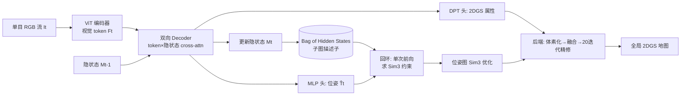

# Flash-Mono: Feed-Forward Accelerated Gaussian Splatting Monocular SLAM

**会议**: ICLR 2026  
**OpenReview**: [https://openreview.net/forum?id=nv3q3crc5D](https://openreview.net/forum?id=nv3q3crc5D)  
**代码**: [https://victkk.github.io/flash-mono](https://victkk.github.io/flash-mono)  
**领域**: 3D 视觉 / Gaussian Splatting SLAM  
**关键词**: 单目 SLAM, 2D Gaussian Splatting, 前馈重建, 循环 Transformer, 回环检测, Sim(3) 优化  

## 一句话总结
用一个循环前馈模型直接预测每帧相机位姿和像素对齐的 2D 高斯面元，把单目 GS-SLAM 从"每帧从零训练高斯"换成"预测+轻量精修"，在保证 SOTA 渲染与跟踪质量的同时实现约 10 倍提速。

## 研究背景与动机
**领域现状**：3D Gaussian Splatting 因可微渲染、高保真新视角合成，成为单目 SLAM 的热门地图表示。早期的 MonoGS 随机初始化高斯、靠每帧上百次迭代维持地图；后续工作（WildGS-SLAM、DepthGS）引入深度/光流先验初始化高斯几何属性。

**现有痛点**：这些方法有三个绕不开的瓶颈。其一，**Train-from-Scratch 范式**每个关键帧要几十到几百次迭代，单次迭代约 20ms，一帧就要约 1 秒，FPS 普遍只有约 1，远不够实时。其二，单帧几何先验（单目深度）天然尺度不一致，导致严重的多视图不一致与累积尺度漂移。其三，原始 3DGS 体素化基元缺乏表面约束，几何噪声大、易产生 floater。

**核心矛盾**：像 VGGT 这类前馈方法靠跨帧 cross-attention 拿到了优秀的多帧一致性，但它需要**一次性离线处理所有帧**，与 SLAM 的流式输入、低延迟位姿估计根本不兼容。如何把前馈的多帧一致性优势搬到在线增量场景，是核心难题。

**本文目标**：构建一个真正实时（10 FPS+）、全局一致的单目 GS-SLAM 系统。

**核心 idea**：**用循环前馈模型把"训练高斯"变成"预测高斯"**——每来一帧，模型基于隐状态增量预测位姿和像素对齐的 2DGS，后端只做轻量精修；同时把隐状态当作子图描述子复用，实现高效回环与 Sim(3) 全局优化；地图基元换成 2D 高斯面元以提升几何保真度。

## 方法详解

### 整体框架
Flash-Mono 由三个模块串成：**循环前馈前端**逐帧预测位姿与 2DGS 属性并更新隐状态；**基于隐状态的回环模块**在重访旧地时一次前向产生 Sim(3) 约束、做位姿图全局优化；**2DGS 建图后端**在独立线程把每帧预测体素化、融合、轻量精修成全局地图。为对抗循环模型的灾难性遗忘，输入流被切成若干 submap，每段隐状态重置，历史隐状态缓存进 "Bag of Hidden States" 供回环复用。

### 关键设计

**1. 循环前馈前端：把每帧拆成"位姿 + 像素级 2DGS + 隐状态"三件套**。模型 $f$ 接收当前帧 $I_t$ 与上一隐状态 $M_{t-1}$，联合输出 $\hat{T}_t, \hat{G}_t, M_t = f(I_t, M_{t-1})$，其中 $\hat{T}_t \in SE(3)$ 是相对首帧的位姿、$\hat{G}_t$ 是 $H\times W$ 像素对齐的 2DGS 面元（定义在当前相机系）、$M_t$ 把聚合信息传给下一时刻。架构上借鉴 CUT3R 与 Point3R 的有状态 Transformer：图像先经 ViT 编码成视觉 token $F_t$，两个互连 decoder 通过 cross-attention 在 $F_t$ 与持久隐状态 $M_{t-1}$ 间双向交换信息，一个可学习 pose token $z_t$ 随 $F_t$ 一起聚合几何线索用于位姿估计。最后两个 DPT 头解码出 2DGS 的均值与置信度 $\{\hat{\mu}_t, \hat{C}_t\}$ 及其余属性 $\{\hat{\sigma}_t, \hat{r}_t, \hat{s}_t, \hat{c}_t\}$，MLP 头从 $z'_t$ 回归位姿。训练用 DL3DV、ScanNet++ 等带 GT 深度/位姿的数据，损失是位姿、几何、渲染三项加权和 $L_{total} = \lambda_{pose}L_{pose} + \lambda_{geo}L_{geo} + L_{render}$，其中几何损失用置信度加权 $L_{geo} = \sum_t \sum_n (\hat{c}_{t,n}\cdot\|\hat{\mu}_{t,n}-\mu_{t,n}\|^2 - \alpha\log(\hat{c}_{t,n}))$，让模型自己学会哪些像素的几何更可信。

**2. Submap 切分对抗循环遗忘**。虽然模型理论上能处理任意长序列，但实测累积漂移随序列长度 $L$ 增大——这是循环模型灾难性遗忘的直接后果。于是把输入流切成更短的子序列（submap），每段隐状态重置，段内位姿都表达在该段首帧坐标系下。相邻 submap 间留一帧重叠，用这帧算出段间相对变换，把局部位姿链成连续轨迹；这帧的重叠同时提供一个显式段间对齐约束，后面进位姿图。消融显示 clip 长度 8 帧时 ATE 最低，太短缺时序上下文、太长（>16）又积累段内漂移。

**3. 隐状态即长期记忆，单次前向解回环**。这是本文最巧的设计：循环隐状态本身就是局部场景的紧凑几何/视觉摘要，把每个 submap 的末态隐状态 $M_a$ 缓存进 Bag of Hidden States。当外观检索触发回环候选（当前帧 $I_j$ vs 历史帧 $I_i$），就取出历史子图 $C_a$ 的隐状态 $M_a$，对当前帧做单次前向 $f(I_j, M_a)$——这等于"强迫模型用过去子图的坐标系来理解当前帧"，直接得到重定位位姿 $T^a_j$ 与点云 $P^a_j$。再拿它与当前增量跟踪得到的点云 $P^b_j$ 比对，二者来自同一图像、仅差一个尺度因子，于是最小二乘解尺度 $s^* = \arg\min_s \sum_k \|\mu^b_k - s\cdot\mu^a_k\|^2$，组合成完整 Sim(3) 回环约束 $H_{j\to i}$。位姿图含三类边——段内顺序约束、段间对齐约束、回环约束——在 sim(3) 李代数上用对数映射最小化残差 $T^{W*} = \arg\min \sum \|\log(H^{-1}_{j\to i}\cdot((T^W_i)^{-1}T^W_j))\|^2_\Omega$，由 GTSAM 求解。

**4. Predict-and-Refine 后端：体素化 + 20 次迭代精修**。后端拿全局优化后的位姿和前端预测的 2DGS，分四步建图。前端的逐像素 2DGS 常过密，先用自适应体素化把 $2\times2$ 基元块按属性平均合并（旋转用四元数一致性对齐后归一化），深度变化超阈值 $\tau_d$ 的块保留细节不合并；融合时先渲染当前地图、剔除高重建误差基元，再把新基元变换到世界系、只在重建不足区域（accumulation map 低于 $\tau_{accum}$）添加以避免冗余致密化。**关键加速点**：因为前端预测已是强先验，每帧只需对最近 K 个关键帧的局部区域精修 20 次迭代（对比 MonoGS/S3PO-GS 的 250 次，10 倍削减）。回环后地图校正也不重渲染，而是把 2DGS 刚性绑定到来源关键帧，位姿更新时算增量 $\Delta T = T_{new}T_{old}^{-1}$ 直接 warp 所有关联基元。

## 实验关键数据

### 主实验表格
ScanNetV1 + BundleFusion 跟踪精度（ATE RMSE，cm，越低越好，取代表性场景）：

| 方法 | Scan0054 | Scan0059 | Scan0106 | Bundle apt0 | Bundle copyroom |
|------|---------|---------|---------|---------|---------|
| ORB-SLAM3 | 243.26 | 90.67 | 178.13 | 87.37 | 27.60 |
| DROID-SLAM | 161.22 | 69.92 | 89.11 | 89.38 | 19.71 |
| MonoGS | 70.19 | 97.24 | 150.89 | 122.59 | 53.41 |
| S3PO-GS | 69.36 | 16.52 | 26.15 | 92.49 | 21.88 |
| MASt3R-SLAM | 13.25 | 10.89 | 15.83 | 9.65 | 9.28 |
| **Ours** | **11.69** | **8.89** | **10.83** | 11.44 | **7.34** |

渲染质量（部分场景，PSNR↑/LPIPS↓）：Flash-Mono 在 ScanNet0054 达 PSNR 21.73 / LPIPS 0.39（MonoGS 19.24/0.61，S3PO-GS 20.79/0.62），FPS 约 12.7（对手约 1）。Depth L1（m，越低越好）：Ours 0.34/0.21 vs MonoGS 1.19/1.20、S3PO-GS 0.52/0.85。

KITTI 室外（ATE RMSE，m）：Ours 在 00/05/06/07/08/28 上为 12.85/16.58/9.93/12.08/45.25/16.75，S3PO-GS 对应 32.49/34.76/16.43/fail/64.74/23.64，且 S3PO-GS 在 seq07 直接失败。

### 消融实验表格

| 消融项 | 设置 | 结果 |
|--------|------|------|
| 后端精修迭代 | 0 / 10 次 | PSNR 20.14 → 22.41 |
| Submap clip 长度 | 8 帧（最优） | ATE 0.106，过短/过长均变差 |
| 回环方式 | 隐状态 vs PnP+RANSAC vs 无 | 隐状态大幅领先 |
| 自适应体素化 | 1.35M → 0.56M 基元 | 减 58%，PSNR 仅 19.70→19.44 |

### 关键发现
前馈预测本身已有 PSNR 20.14 的强初值，仅 10 次精修就涨到 22.41，验证"预测+轻量精修"成立；隐状态回环显著优于传统 PnP+RANSAC，说明它生成的 Sim(3) 约束更准；submap 长度存在最优值，印证循环遗忘是真实约束。

## 亮点与洞察
- **范式转换最有价值**：从 Train-from-Scratch 到 Predict-and-Refine，10 倍提速不是工程调优而是把每帧的优化成本几乎搬空，直击 GS-SLAM 长期约 1 FPS 的根本瓶颈。
- **隐状态一物三用**：既是前馈预测的上下文载体、又是子图描述子、还是回环重定位的"坐标系记忆"，用一次前向就解出跨子图约束，避免传统回环重新匹配/重投影的开销。
- **巧解尺度模糊**：同一帧在历史隐状态和当前隐状态下的两份点云只差一个尺度，直接最小二乘出尺度因子凑成 Sim(3)，思路干净。

## 局限与展望
- submap 切分是对循环遗忘的工程补偿，clip 长度需调参（最优 8 帧），长序列鲁棒性仍受 RNN 记忆容量制约。
- KITTI 室外 seq08 的 ATE 仍高达 45.25m，对大尺度动态场景的泛化有限；动态物体未显式建模。
- 依赖大规模带 GT 深度/位姿数据训练前馈模型，对训练分布外场景（论文用 BundleFusion 做 out-of-domain）的迁移能力是隐患。
- 自适应体素化以小幅 PSNR 损失换内存，超大场景下地图规模与全局优化成本如何 scale 未充分讨论。

## 相关工作与启发
- **前馈 3D 基础模型线**：DUSt3R/MASt3R（图像对点图）→ Fast3R（并行多图）→ CUT3R/Point3R（循环、变长、流式）→ VGGT（大规模多任务），本文把 CUT3R 式有状态 Transformer 接进 SLAM 是自然延伸；VGGT-SLAM 在 SL(4) 流形优化位姿是平行思路。
- **单目 GS-SLAM 线**：MonoGS/PhotoSLAM（随机初始化+ORB-SLAM3）、SEGS-SLAM、DroidSplat、WildGS-SLAM/DepthGS/Dy3DGS（深度先验+不确定性）、S3PO-GS（尺度自洽点图做室外），本文用前馈预测取代它们的从零训练。
- **几何表示**：2DGS（Huang et al. 2024）的平面面元表面先验是本文几何保真度的来源。
- **启发**：循环模型的隐状态可被复用为"可寻址的场景记忆"，这一点对其他需要长期一致性的在线感知任务（建图、重定位、持续学习）都有借鉴价值。

## 评分
- 新颖性: ⭐⭐⭐⭐ 把前馈循环重建首次系统接入在线单目 GS-SLAM，隐状态做回环的设计很巧。
- 实验充分度: ⭐⭐⭐⭐ 室内 in/out-of-domain + 室外 KITTI 三套数据，跟踪/渲染/几何/效率全维度对比，消融到位。
- 写作质量: ⭐⭐⭐⭐ 三挑战→三模块对应清晰，pipeline 与公式表达完整。
- 价值: ⭐⭐⭐⭐ 10 倍提速直击 GS-SLAM 实时性痛点，对具身感知与实时重建有实际意义。

<!-- RELATED:START -->

## 相关论文

- [\[ICLR 2026\] ReSplat: Degradation-agnostic Feed-forward Gaussian Splatting via Self-guided Residual Diffusion](resplat_degradation-agnostic_feed-forward_gaussian_splatting_via_self-guided_res.md)
- [\[CVPR 2026\] Z-Order Transformer for Feed-Forward Gaussian Splatting](../../CVPR2026/3d_vision/z-order_transformer_for_feed-forward_gaussian_splatting.md)
- [\[CVPR 2026\] AnchorSplat: Feed-Forward 3D Gaussian Splatting with 3D Geometric Priors](../../CVPR2026/3d_vision/anchorsplat_feed-forward_3d_gaussian_splatting_with_3d_geometric_priors.md)
- [\[CVPR 2026\] SR3R: Rethinking Super-Resolution 3D Reconstruction With Feed-Forward Gaussian Splatting](../../CVPR2026/3d_vision/sr3r_rethinking_super-resolution_3d_reconstruction_with_feed-forward_gaussian_sp.md)
- [\[ICLR 2026\] Open-Set Semantic Gaussian Splatting SLAM with Expandable Representation](open-set_semantic_gaussian_splatting_slam_with_expandable_representation.md)

<!-- RELATED:END -->
