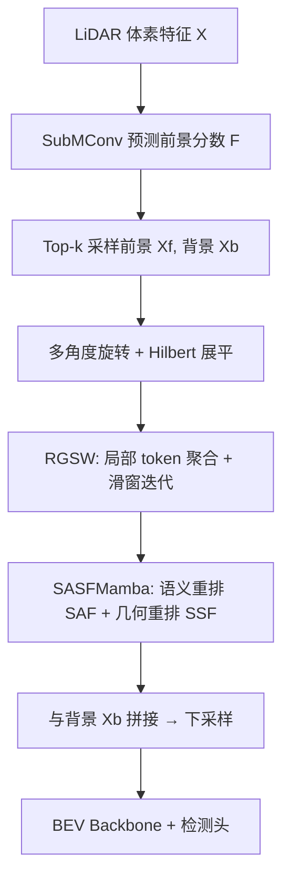

# Fore-Mamba3D: Mamba-based Foreground-Enhanced Encoding for 3D Object Detection

**会议**: ICLR 2026  
**OpenReview**: [https://openreview.net/forum?id=e4t1775UJ1](https://openreview.net/forum?id=e4t1775UJ1)  
**代码**: [https://github.com/pami-zwning/ForeMamba3D](https://github.com/pami-zwning/ForeMamba3D)  
**领域**: 3D 目标检测 / LiDAR 点云 / Mamba 状态空间模型  
**关键词**: Mamba, 前景编码, 状态空间模型, LiDAR 3D 检测, 线性建模, Hilbert 曲线  

## 一句话总结
把 Mamba 编码器从"扫描全场景体素"改成"只编码前景体素"，并用滑窗传播 + 语义/几何融合两套机制补回前景稀疏后丢失的长程依赖与上下文，在 nuScenes/KITTI/Waymo 上以更低 FLOPs 拿到 SOTA。

## 研究背景与动机
**领域现状**：LiDAR 3D 检测的主流骨干是稀疏卷积（SpCNN）和 Transformer，但前者对硬件不友好、后者复杂度是平方级，都难以满足实时部署。Mamba 这类线性建模方法以线性复杂度实现全局交互，被引入 3D 检测后分成两派：group-based（按 X/Y 轴把体素分组做线性建模，擅长局部）和 group-free（用 Hilbert/Z-order 空间填充曲线把全场景非空体素拍成一条序列，擅长全局）。

**现有痛点**：无论分组与否，现有 Mamba 方法都对**整条非空体素序列**做双向编码，而真正有信息量的前景体素只占很小一部分——在 nuScenes/KITTI 上背景体素约占 80%。对全场景编码既费算力又费显存，大量背景信息纯属冗余。

**核心矛盾**：直觉上"只编码前景"能省算力，但论文发现**直接把 vanilla Mamba 套在纯前景序列上反而掉点**。原因有二：(1) **响应衰减**——前景体素稀疏地散落在不同实例上，线性自回归模型按序列距离衰减，跨实例的远距离前景之间难以建立依赖；(2) **上下文受限**——前景采样不可能完美，丢失的结构信息让纯前景序列的上下文表征不足。

**本文目标**：在保留"只编码前景"算力优势的同时，解决响应衰减与上下文受限两大副作用。

**核心 idea**：**(1) 前景采样 + 多次旋转 Hilbert 展平** 保证前景序列的空间邻接性；**(2) 区域到全局滑窗（RGSW）** 用局部 token 聚合 + 滑窗迭代把局部信息传到全序列，缓解响应衰减；**(3) SASFMamba** 在状态变量里注入语义重排和几何重排，把因果、按距离衰减的线性编码改成非因果、语义/几何相关的编码。

## 方法详解

### 整体框架
Fore-Mamba3D 的 3D 骨干由 4 个 stage 串联，每个 stage 含一个**实例选择块**和一个下采样块。实例选择块是核心，依次完成：前景体素采样与展平 → RGSW 滑窗编码 → SASFMamba 语义/几何融合。骨干输出送入 BEV backbone 和检测头，前景分数和语义类别在训练时有专门的 focal loss 监督。

### 关键设计

**1. 前景采样 + 旋转 Hilbert 展平：让稀疏前景在序列里也保持邻接。** 给定体素特征 $X \in \mathbb{R}^{L\times H\times W\times D}$，先用一个 submanifold 卷积为每个非空体素预测前景分数 $F$，加位置编码后再稀疏卷积，按 $F$ 降序取 top-$k$（比例 $\alpha$，默认 0.2）作为前景特征 $X_f \in \mathbb{R}^{N\times D}$，其余记为背景 $X_b$。前景采样后用 Hilbert 曲线展平成 1D 序列，但 Hilbert 曲线存在"区域截断"——原 3D 坐标相邻的两个体素（如 $v_1, v_2$）在序列里可能离得很远，双向编码也救不回来。解法是把整个场景绕 Z 轴旋转多个角度 $\theta$ 再展平：坐标变换 $R(\theta, p) = (\lfloor x\cos\theta + y\sin\theta\rfloor, \lfloor y\cos\theta - x\sin\theta\rfloor, z)^T$，展平特征 $X_{f,\theta} = H(X_f, \{R(\theta,p)\})$。不同旋转角（默认 2 次，$\theta=0, \pi/2$）的编码结果求和过 MLP，再与背景拼接：$X' = \text{Cat}[\text{MLP}(\sum_{i=1}^{r}\text{Enc}(X_{f,\theta_i})), X_b]$。多视角旋转既缓解了截断，也提升了对视角变化的鲁棒性。

**2. 区域到全局滑窗 RGSW：用局部 token + 滑窗对抗响应衰减。** 前景跨实例稀疏分布会让 Mamba 的远距离依赖衰减。RGSW 先把 $N$ 长序列切成 $M$ 个 patch 并行处理，在每个 patch 末尾插入一个**局部 token** $T_i \in \mathbb{R}^D$，序列扩成 $\mathbb{R}^{M\times(N/M+1)\times D}$ 送进 SASFMamba。由于 Mamba 的自回归特性，编码后的局部 token $T_i'$ 天然聚合了整个 patch 的区域信息，再用余弦相似度把它加权传播回 patch 内每个体素：$x'_{i,j} = x'_{i,j} + \text{Sim}(x'_{i,j}, T_i')\times T_i'$。这解决了 patch 内部，但 patch 之间还没交互——于是用滑窗机制：把 $x'_i$ 的后半段和 $x'_{i+1}$ 的前半段拼成新 patch $x_i^s = \text{Cat}(x'_i[\tfrac{N}{2M}:], x'_{i+1}[:\tfrac{N}{2M}])$，再喂回 SASFMamba，重复 $t$ 次（默认 2 次，再多收益饱和）让信息跨 patch 传播。消融显示滑窗对大目标（车 +1.2%）更有效，局部 token 对小而稀疏的目标（行人 +0.93%、骑行者 +0.35%）更有效。

**3. SASFMamba 之语义辅助融合 SAF：按语义重排状态变量，跳出局部性偏置。** 标准 SSM 的状态 $h_i = \sum_{j\le i}\bar{A}^\times_{j:i}\bar{B}_j x_j$ 沿序列累积，距离越远转移矩阵连乘越小、依赖越弱。SAF 先用轻量 MLP 预测每个体素的语义类别 $S$，再把状态变量 $h$ 按预测类别**分组重排**（组内严格保留原相对顺序），让语义相似但原始位置很远的体素在序列里相邻；对重排后序列做一个有较大有效感受野的 1D 卷积聚合语义上下文，最后 reverse 回原顺序得到 $h'$。论文给了理论推导：重排后 $h'_i = \sum_{k\in K}\alpha_k h_{N_k(i)}$，展开后当前状态与远处输入 $x_j$ 的关联分 $M_{i,j} = \sum_{k\in K'_{i,j}}\alpha_k \bar{A}^\times_{j:N_k(i)}\bar{B}_j$，只要存在语义近邻的原始索引 $N_k(i) > j$，该项就非零，从而证明 SAF 能让当前状态有效捕获语义相似的远距离输入，克服线性编码器的局部性偏置。

**4. SASFMamba 之状态空间融合 SSF：把 1D 状态映回 3D 做几何卷积，补回空间结构。** 3D→1D 展平不可避免造成几何畸变。SSF 把 SAF 输出的状态 $h'$ 按原坐标映射回 3D 空间形成稀疏张量（L2S），沿不同轴用大核 dimension-wise 卷积做空间识别，再展平回序列（S2L）：$h'' = \text{S2L}(\text{DwConv}(\text{L2S}(h')))$。最后按 SSM 观测方程乘动态输出矩阵 $\bar{C}$ 得到输出 $x'$。SSF 与 SAF 同理，保证了非因果、几何相关的编码。训练用两个 focal loss $L_f, L_s$（$\gamma=2$）监督前景分数与语义类别，其中前景由原框沿 X/Y 扩 0.5 m、Z 扩 0.25 m 定义以保留边界模糊信息，总损失 $L = w(L_f+L_s) + L_{cls} + L_{reg}$（$w=2$）。

## 实验关键数据

### 主实验表格

**nuScenes**（无 CBGS，LiDAR-only）：

| 方法 | 发表 | mAP | NDS |
|------|------|-----|-----|
| Voxel-Mamba | NIPS24 | 67.5 | 71.9 |
| LION | NIPS24 | 68.0 | 72.1 |
| FSHNet | CVPR25 | 68.1 | 71.7 |
| **Fore-Mamba3D（val）** | – | **68.4** | **72.3** |
| LION（test） | NIPS24 | 69.8 | 73.9 |
| **Fore-Mamba3D（test）** | – | **70.1** | **74.0** |

**KITTI**（val, R11，按骨干类型对比，Mod 难度）：

| 方法 | 骨干 | Car | Ped. | Cyc. |
|------|------|-----|------|------|
| DSVT | Transformer | 77.8 | 59.7 | 66.7 |
| LION | Mamba | 78.3 | 60.2 | 68.6 |
| VoxelMamba | Mamba | 80.8 | 59.7 | 69.1 |
| **Fore-Mamba3D** | Mamba | **82.2** | **62.2** | **69.5** |

Waymo（20% 训练、全 val）：L2 mAP 71.9%，比 CenterPoint 基线高 **7.4%**，L1 全面超越此前方法。

### 消融实验表格

组件逐步叠加（KITTI val，Mod）：

| HF | RGSW | SAF | SSF | Car | Ped. | Cyc. |
|----|------|-----|-----|-----|------|------|
| ✓ | | | | 79.4 | 59.2 | 66.0 |
| ✓ | ✓ | | | 80.6 | 60.5 | 66.8 |
| ✓ | ✓ | ✓ | | 81.8 | 61.9 | 67.3 |
| ✓ | ✓ | | ✓ | 81.0 | 61.3 | 68.2 |
| ✓ | ✓ | ✓ | ✓ | **82.6** | **62.2** | **69.5** |

采样比例 $\alpha$ 与效率（vs LION）：

| $\alpha$ | nuScenes mAP/NDS | FLOPs(G)↓ | FPS |
|------|------|------|-----|
| 0.1 | 67.4 / 71.0 | 22.62 | 70 |
| **0.2** | **68.4 / 72.3** | 26.04 | 67 |
| 0.5 | 68.0 / 71.8 | 38.62 | 58 |
| 1.0 | 67.8 / 71.6 | 52.17 | 50 |
| LION | 68.0 / 72.1 | 46.24 | 52 |

### 关键发现
- **前景比例 0.2 最优**：恰好逼近真实前景分布，比例过低丢结构、过高引冗余；相比 LION 减 **43.7% FLOPs、增 23.9% FPS** 还涨点。
- **RGSW 两个分支分工互补**：滑窗利大目标、局部 token 利小目标，滑窗迭代 $t=2$ 后收益饱和。
- **SAF/SSF 缺一不可**：单独加各涨约 1%，两者同时加才到最佳，说明语义对齐与几何还原是正交的两类补偿。

## 亮点与洞察
- **直指 Mamba 3D 检测的真实冗余**：把"全场景非空体素编码"的隐藏浪费（80% 是背景）显式拆掉，是对 group-based/group-free 两派的统一反思。
- **诊断到位**：没有止步于"只编前景会掉点"的现象，而是归因到响应衰减 + 上下文受限两个具体机制，并针对性各开一刀（RGSW 治衰减、SASFMamba 治上下文）。
- **理论支撑非空洞**：SAF 的关联分非零性推导，把"语义重排为何能建立远距离依赖"讲成可验证的命题，而非纯经验。
- **效率-精度双赢**：在三大基准上拿 SOTA 的同时显著降 FLOPs，对实时部署有实际意义。

## 局限与展望
- **依赖前景分数预测质量**：采样准确度直接决定下游，分数预测在远距离/小目标上若失准，丢失的前景无法在后续补回，论文用扩框定义前景缓解但未根治。
- **多次旋转 Hilbert + 多次滑窗迭代引入额外开销**：虽然总体仍比全场景编码省，但旋转次数 $r$、迭代次数 $t$、采样比 $\alpha$ 都是需要逐数据集调的超参。
- **仅 LiDAR-only 单模态**：未验证多模态（图像+点云）下前景采样是否依然成立，跨传感器的前景一致性是开放问题。
- **Waymo 仅 20% 训练子集**：完整数据规模下的表现与排名仍待补充。

## 相关工作与启发
- **Mamba for 3D**：PointMamba（FPS 分组）、LION（大 group 交互）、Voxel-Mamba（group-free 双尺度 SSM）、MambaDETR（query 序列化）——本文是首个把"前景-only 编码"做进 Mamba 骨干的工作。
- **前景采样**：IA-SSD（实例感知下采样）、RBGNet（前景偏置采样 + 射线分组）、DSASA（FPS 系列平衡密度）——这些多在点级别选前景，本文迁到体素+线性编码场景，并补上稀疏前景下的表征保持机制。
- **启发**：稀疏选择性编码 + 序列重排是把线性模型从"按位置因果"改造成"按语义/几何相关"的通用范式，可迁移到点云分割、占用预测等同样面临前背景失衡的任务。

## 评分
- **新颖性**: ⭐⭐⭐⭐ 首次把前景-only 编码与 Mamba 骨干结合，并系统解决随之而来的响应衰减/上下文受限，问题切入与机制设计都新。
- **实验充分度**: ⭐⭐⭐⭐ 覆盖 nuScenes/KITTI/Waymo 三大基准 + 完整组件/比例/迭代消融，效率指标齐全；Waymo 仅 20% 子集略减一分。
- **写作质量**: ⭐⭐⭐⭐ 动机—诊断—对症的逻辑链清晰，SAF 配理论推导，图 2 框架完整。
- **价值**: ⭐⭐⭐⭐ 效率-精度双赢对实时 LiDAR 检测落地有直接价值，前景稀疏编码范式可外推。
