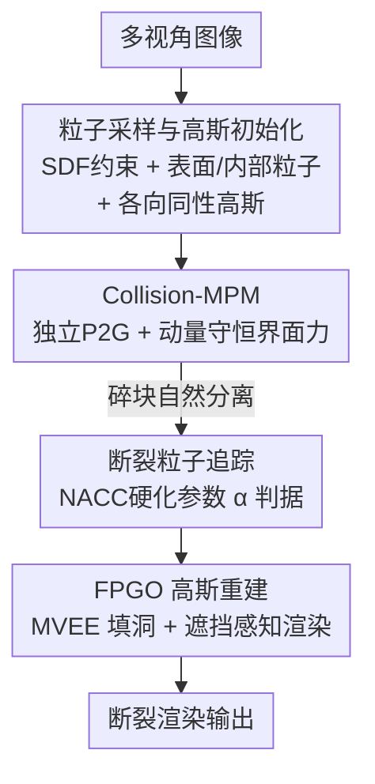

# Fracture-GS: Dynamic Fracture Simulation with Physics-Integrated Gaussian Splatting

**会议**: ICLR 2026  
**OpenReview**: [https://openreview.net/forum?id=zcAwK50ft0](https://openreview.net/forum?id=zcAwK50ft0)  
**代码**: 待确认  
**领域**: 3D视觉 / 高斯泼溅 / 物理仿真  
**关键词**: 高斯泼溅, 物质点法, 动态断裂, 碰撞仿真, 物理渲染

## 一句话总结
Fracture-GS 把"增强版碰撞物质点法 (Collision-MPM)"和"断裂感知的 3D 高斯连续体表示"统一进一条从多视角图像到渲染的管线，专门处理极端机械碰撞下的脆性断裂——既用动量守恒的界面力消除碎块之间的非物理粘连，又用 MVEE 高斯重建填补断裂界面的渲染空洞，在 PSNR/LPIPS/FID 和人评断裂保真度上都明显超过 PhysGaussian、GIC。

## 研究背景与动机
**领域现状**：把物理仿真和可微渲染缝在一起是近两年的热点。3D Gaussian Splatting (3DGS) 用一堆各向异性高斯核显式表示场景，渲染又快又可微；物质点法 (MPM) 则是图形学里模拟连续介质形变、断裂的主力数值方法。PhysGaussian（Xie et al., 2024）首次把 3D 高斯当作 MPM 的物质点直接仿真+渲染，GIC（Cai et al., 2024）借高斯可微性反推杨氏模量等物理参数，GASP 则给高斯嵌入逐点物理属性。这些工作让"仿真完不用再进 Houdini 渲染"成为可能。

**现有痛点**：但它们都只擅长**温和的弹性形变**，一到极端机械碰撞（高能脆性碎裂、多体撞击）就翻车，集中表现为两个硬伤——其一，MPM 仿真在碎块/异物接触界面出现**非物理粘连**：本该飞散分离的木屑会"黏"在茶壶表面；其二，断裂界面**渲染不出来**：碎裂让高斯粒子被拉开，相邻高斯的重叠区消失，渲染场出现断裂、空洞和伪影。

**核心矛盾**：根子在于现有方法把"碰撞"当成连续介质内部的普通应力来处理（MLS-MPM 把两个物体的粒子混在同一套网格速度里更新），界面处的动量交换缺乏显式约束，于是粘连；而渲染端又默认高斯粒子之间始终保持初始重叠关系，断裂一旦发生这个假设就破产。仿真侧的物理正确性和渲染侧的视觉连续性，在断裂这个场景下被同时打破。

**本文目标**：拆成两个具体子问题——(1) 让多体碰撞中断裂的碎块**物理上正确地分离**，不再粘连；(2) 在断裂面上**重建出连续可信的渲染**，无需任何后处理。

**切入角度**：作者注意到流固耦合里早有"碰撞力"概念（Yan et al., 2018）专门防止互相穿插与粘连；同时 NACC 本构模型里的硬化参数 $\alpha$ 天然能标记"哪些粒子已经塑性屈服、进入断裂状态"。把这两个现成钩子接进 MPM+3DGS 管线，就能同时治住两个硬伤。

**核心 idea**：用"动量守恒的界面碰撞力"替换 MLS-MPM 的混合网格更新来消除粘连，再用"硬化参数追踪断裂粒子 + MVEE 克隆高斯填补重叠空洞"来修复断裂面渲染。

## 方法详解

### 整体框架
Fracture-GS 是一条从**多视角图像**到**断裂渲染**的串行管线，分三大阶段：先把碰撞物体重建成带内外粒子的几何+高斯表示，再用增强的 Collision-MPM 跑极端碰撞仿真，最后把仿真出的断裂粒子做高斯属性重建并渲染。

第一阶段，用已有的隐式 3D 重建算法从多视角图像构建物体的 SDF（有符号距离函数），在 SDF 约束的体内**同时采样表面粒子和内部粒子**保证空间连贯，再用 3DGS 给表面粒子学习**各向同性**高斯属性。每个碰撞物体携带一整套属性 $\{m, V, F, C, v, x, \theta\}$（质量、体积、形变梯度、速度梯度、速度、位置、弹塑性参数），其中 $\theta$ 含杨氏模量 $E$、泊松比 $\gamma$、硬化追踪参数 $\alpha$、内聚系数 $\beta$、硬化因子 $\xi$。第二阶段，Collision-MPM 把两个物体的粒子**各自独立**传到网格，在网格更新后注入界面碰撞力，再回写粒子，使碎块自然分离。第三阶段，FPGO（断裂粒子高斯优化）借 NACC 的硬化参数逐帧识别断裂粒子，对每个断裂粒子用 MVEE 在它和邻居的重叠区生成新高斯替换原高斯，并配合遮挡感知采样输出渲染。

### 关键设计

**1. 粒子采样与高斯初始化：让仿真有体、渲染有皮**

要同时跑物理仿真和高斯渲染，必须解决"几何用什么粒子、渲染用什么高斯"的问题。如果只采表面粒子，物体内部是空的，碰撞碎裂时缺少体积支撑会塌陷；如果给每个粒子都学各向异性高斯，断裂时拉伸方向会产生不自然的拖影。作者的做法是：先从多视角图像重建 SDF 隐式表示体几何，在 $\text{SDF}\le 0$ 的约束域内**同时采样表面与内部粒子**——内部粒子参与 MPM 的连续介质仿真撑起体积，表面粒子额外用 3DGS 学习高斯属性负责外观。关键细节是表面高斯用**各向同性核**（而非 3DGS 默认的各向异性），这样在剧烈碰撞、粒子位置突变时高斯不会沿某个轴被异常拉长，为后续断裂渲染留下干净的初始条件。这一步把"可仿真的体"和"可渲染的皮"在同一组粒子上对齐，是整条物理-渲染管线能闭环的前提。

**2. Collision-MPM：用动量守恒界面力消除非物理粘连**

MLS-MPM 把所有物体的粒子投到**同一套**网格速度上更新，界面两侧的物质被隐式"焊死"，于是流体黏固体、碎块黏邻物。作者把流固耦合里防穿插的碰撞力（Yan et al., 2018）移植进来：两个物体 $P_a, P_b$ 的粒子**各自独立**做 P2G 和网格更新，在网格节点 $G_i$ 上分别算出归一化的质量分布方向 $\hat n_{ia}, \hat n_{ib}$，并据此定义界面法向倾向

$$n_{ia} = -n_{ib} = \frac{\hat n_{ia} - \hat n_{ib}}{\lVert \hat n_{ia} - \hat n_{ib}\rVert}$$

碰撞力只在两物体**真正相向靠近**时才激活，即满足 $(v_{ia}^{temp} - v_{ib}^{temp})\cdot n_{ia} > 0$。此时按碰撞过程的动量守恒计算节点碰撞力

$$f_i^c = \frac{p_{ia}^{temp} m_{ia}^n - p_{ib}^{temp} m_{ib}^n}{(m_{ia}^n + m_{ib}^n)\Delta t}, \qquad f_{ia}^c = -f_{ib}^c = \mu (f_i^c \cdot n_{ib}) n_{ib}$$

其中 $p^{temp}=m v^{temp}$ 是网格更新后的动量，$\mu$ 控制碰撞力强度，一对作用力大小相等方向相反 $f_{ia}^c=-f_{ib}^c$ 保证系统总动量守恒。最后把碰撞力加进各自的网格速度 $v_{ia}^{n+1}=v_{ia}^{temp}+\frac{f_{ia}^c}{m_{ia}^n}\Delta t$。因为两物体粒子始终在独立网格上、界面只通过这个**显式且守恒**的力交互，碎块就能像真实物理那样弹开而非粘连。实验里专门验证了碰撞前后系统总动量曲线保持恒定。

**3. FPGO 断裂粒子高斯优化：硬化参数追踪 + MVEE 填洞 + 遮挡感知渲染**

仿真层面碎块分开了，但如果直接拿初始学到的高斯去渲染，断裂界面会冒出大量伪影。原因是：考虑三个相邻高斯 $\{g_i,g_m,g_n\}$，断裂让 $g_i$ 相对 $g_m$ 位移，两者重叠区缩小甚至消失，渲染场的连续性被打断，于是出现裂缝和空洞。FPGO 用四步修这个洞。第一步**追踪**：直接复用 NACC 本构模型里的硬化参数 $\alpha$——当某粒子的 $\alpha$ 超过阈值就判定它已断裂（图示中变绿），无需额外裂纹检测。第二步**邻域分析**：对每个断裂粒子 $g_i$ 在半径 $d_c$ 内找仍完整的邻居 $\{g_m,g_n\}$，自适应搜索范围兼顾覆盖与效率。第三步**MVEE 高斯重建**：对 $g_i$ 与每个邻居的重叠区 $\Omega_{cross}$ 计算**最小体积包围椭球 (MVEE)**，生成两个新高斯 $g_{im}, g_{in}$ 替换原 $g_i$，

$$\{\mu_{new}, \Sigma_{new}\} = \text{MVEE}(\Omega_{cross}(g_i, g_j))$$

属性赋值遵循两条原则：不透明度 $\sigma$ 和颜色 $c$ 等光学属性直接从 $g_i$ 继承以保持视觉一致，空间参数（均值、协方差）则由 MVEE 重算去贴合断裂后的真实重叠几何。第四步**遮挡感知采样**：渲染时若一条像素射线穿过多个优化后的粒子 $(g_{im},g_{in})$，只让**最近**的那个参与着色，避免重复计数。这样断裂面上就长出一批物理可信的"过渡高斯"，既补上了视觉连续性，又不破坏碰撞区的力学正确性。

### 损失函数 / 训练策略
高斯属性初始化沿用标准 3DGS 的光度优化从输入图像学表面高斯（各向同性核）。物理仿真侧不训练，用 NACC（非关联流动的 Cam-Clay）本构模型，由四个塑性参数 $\alpha,\beta,\xi,M$ 控制塑性投影并在塑性阶段维持体积。FPGO 的高斯重建是仿真过程中逐帧的几何操作（MVEE 计算 + 属性继承），非梯度训练。物理参数（如各材质的 $E,\gamma$）当前为手动设置。

## 实验关键数据

### 主实验
测试三个物体：Ficus（叶/枝/陶盆异质材料）、Teapot（均质）、Table（桌面+桌腿异质）。因为动态断裂序列没有真值，采用自参考（self-referencing）方式计算图像质量指标，并加一项人评的断裂仿真保真度 FSF（10 人，1–5 分）。

| 方法 | PSNR ↑ | LPIPS ↓ | FID ↓ | FSF ↑ |
|------|--------|---------|-------|-------|
| PhysGaussian | 17.2 | 0.43 | 120.92 | 1.5 |
| GIC | 16.8 | 0.45 | 129.33 | 1.2 |
| **Fracture-GS (Ours)** | **21.1** | **0.29** | **90.75** | **3.5** |

对比方法都用相同的静态高斯重建、相同 NACC 本构、相同初始条件与材料参数，区别仅在它们用 MLS-MPM 且不含 FPGO。Fracture-GS 在四项指标上全面领先：PSNR +3.9、LPIPS 从 0.43 降到 0.29、人评断裂保真度从 1.5 提到 3.5。

### 消融实验

| 配置 | PSNR ↑ | LPIPS ↓ | FID ↓ | FSF ↑ | 说明 |
|------|--------|---------|-------|-------|------|
| Full (Ours) | 21.1 | 0.29 | 90.75 | 3.5 | 完整模型 |
| w/o FPGO | 17.0 | 0.45 | 123.63 | 1.5 | 去掉断裂高斯优化，断裂面渲染崩坏 |
| w/o C-MPM | 20.6 | 0.35 | 93.05 | 3.1 | 退回 MLS-MPM，出现非物理粘连 |

### 关键发现
- **FPGO 是渲染质量的命脉**：去掉 FPGO 后 PSNR 从 21.1 暴跌到 17.0、LPIPS 从 0.29 退回 0.45，几乎打回 baseline 水平——说明断裂界面的高斯空洞才是 GS-based 断裂渲染最大的瓶颈，MVEE 填洞带来的提升远超 Collision-MPM 单独贡献。
- **Collision-MPM 主治物理真实性**：去掉它（退回 MLS-MPM）指标下降相对温和（PSNR 20.6、FSF 3.1），但定性图里木屑会粘在茶壶表面；它的价值更多体现在物理合理性而非像素指标。
- **守恒律作为"单元测试"**：在无重力无摩擦环境下两物体对撞，系统总动量曲线全程恒定；能量演化分析也显示动能→弹性形变能→断裂耗散的传递平滑、总能量有界无爆炸，验证了数值稳定性。
- 作者坦言自家 FID 仍偏高，因为高斯修复依赖训练视角插值，无法重建被遮挡的隐藏区域。

## 亮点与洞察
- **把"防穿插的碰撞力"复用到"防粘连的断裂"**：原本流固耦合里 Yan et al. 用来防止互相穿透的界面力，被作者反向用来制造干净的分离边界，是一次漂亮的概念迁移——同一个动量守恒界面力，既能防穿插也能防粘连。
- **用现成的本构参数当断裂检测器**：不另起炉灶做裂纹追踪，而是直接读 NACC 本构里早就有的硬化参数 $\alpha$ 超阈值来判定断裂，几乎零额外成本，这种"物理量复用"思路可迁移到任何带塑性本构的仿真渲染管线。
- **MVEE 填洞是这篇最"啊哈"的点**：断裂渲染崩坏的本质是高斯重叠消失，作者不去硬学新高斯，而是几何地用最小包围椭球贴合残余重叠区生成过渡高斯，光学属性继承、空间属性重算，既便宜又物理可信，可直接迁移到任何会产生粒子分离的 GS 动态场景（如撕裂、爆破）。
- **各向同性核的选择**：在剧烈位移场景刻意放弃 3DGS 默认的各向异性，避免拖影伪影，是个容易被忽略但关键的工程判断。

## 局限与展望
- **算力与实时性**：作者承认复杂场景计算开销大，难以实时；计划用 GPU 优化和自适应时间步加速。
- **参数靠手调**：杨氏模量、泊松比等物理参数目前手动设置，缺乏自动估计；计划做基于学习的参数反演。
- **隐藏区域无法重建**：FPGO 依赖训练视角插值修复高斯，被遮挡的内部断面没有观测就补不出来，导致 FID 偏高；作者设想用 3D AI 纹理生成式 inpainting 补全。
- **评估方式间接**：没有断裂序列真值，只能用自参考指标 + 人评 FSF，说服力有限，作者也把"建立专门的断裂评估指标"列为后续工作。
- （自己补充）方法目前只在少数几个物体（Ficus/Teapot/Table）上验证，材料种类、碰撞构型的覆盖面还较窄，泛化到大规模复杂多体场景的稳定性待考。

## 相关工作与启发
- **vs PhysGaussian (Xie et al., 2024)**：PhysGaussian 首次把 3D 高斯接入 MPM 做受力仿真+渲染，但用 MLS-MPM 且不处理断裂，极端碰撞下既粘连又在断裂面出伪影；Fracture-GS 用 Collision-MPM 治粘连、FPGO 治断裂面，专攻 PhysGaussian 不碰的碎裂场景（PSNR 21.1 vs 17.2）。
- **vs GIC (Cai et al., 2024)**：GIC 本是从视频反推材料属性（杨氏模量、泊松比）的可微 MPM 框架，本文只取其前向仿真部分作对比；GIC 同样停留在温和形变，断裂保真度 FSF 仅 1.2，远低于本文 3.5。
- **vs PFF-MPM / NACC (Wolper et al., 2019)**：本文直接采用 Wolper 的 NACC 本构和硬化追踪判据做断裂识别，相当于站在其断裂物理之上，新增的是与高斯渲染的耦合（FPGO）和多体碰撞的界面力（Collision-MPM）。
- **启发**：这条"现有隐式重建 + 物理仿真本构 + 高斯渲染修复"的三段式管线是一种可复制的范式——凡是涉及粒子分离/拓扑变化导致高斯重叠失效的动态渲染（撕布、爆裂、流体飞溅），都可以借鉴"硬化/状态参数追踪 + MVEE 几何重建"的修复思路。

## 评分
- 新颖性: ⭐⭐⭐⭐ 把碰撞力防粘连、硬化参数检测断裂、MVEE 高斯填洞三件现成钩子组合成针对"极端碰撞断裂"的完整管线，单点都不算全新但组合解决了一个明确没人做好的问题。
- 实验充分度: ⭐⭐⭐ 消融清晰、有动量/能量守恒验证，但测试物体偏少、缺真值只能自参考指标 + 人评，作者自己也承认评估方式间接。
- 写作质量: ⭐⭐⭐⭐ 动机—痛点—方案链条清楚，公式与图示（质量分布、断裂追踪、FPGO 填洞）配合到位，方法可复现性较好。
- 价值: ⭐⭐⭐⭐ 给"仿真即渲染"补上了断裂这一长期缺失的场景，对 VFX、虚拟样机有实用价值，MVEE 填洞思路有外溢潜力。

<!-- RELATED:START -->

## 相关论文

- [\[ICLR 2026\] MoE-GS: Mixture of Experts for Dynamic Gaussian Splatting](moe-gs_mixture_of_experts_for_dynamic_gaussian_splatting.md)
- [\[CVPR 2026\] Disco-GS: Gaussian Splatting in Dynamic Color Lighting](../../CVPR2026/3d_vision/disco-gs_gaussian_splatting_in_dynamic_color_lighting.md)
- [\[ICLR 2026\] ODE-GS: Latent ODEs for Dynamic Scene Extrapolation with 3D Gaussian Splatting](ode-gs_latent_odes_for_dynamic_scene_extrapolation_with_3d_gaussian_splatting.md)
- [\[ICLR 2026\] Frequency-Aware Dynamic Gaussian Splatting](frequency-aware_dynamic_gaussian_splatting.md)
- [\[ICLR 2026\] Mobile-GS: Real-time Gaussian Splatting for Mobile Devices](mobile-gs_real-time_gaussian_splatting_for_mobile_devices.md)

<!-- RELATED:END -->
