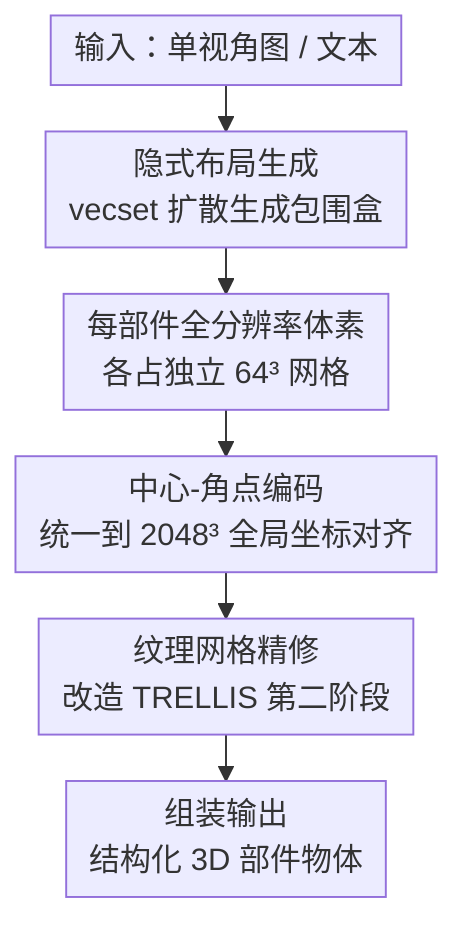

# FullPart: Generating each 3D Part at Full Resolution

**会议**: ICLR 2026  
**OpenReview**: [https://openreview.net/forum?id=QlRlE7a1p4](https://openreview.net/forum?id=QlRlE7a1p4)  
**论文**: [项目页](https://fullpart3d.github.io)  
**代码**: https://github.com/ (见 https://fullpart3d.github.io)  
**领域**: 3D视觉  
**关键词**: 部件级3D生成, 体素表示, 布局生成, 扩散模型, 3D数据集

## 一句话总结
FullPart 把"先用隐式 vecset 扩散生成包围盒布局、再让每个部件在自己独立的全分辨率体素网格里生成细节"这两套范式拼到一起，配合中心-角点编码解决不同尺寸部件拼接时的尺度错位，并发布了迄今最大的人工标注 3D 部件数据集 PartVerse-XL（40K 物体 / 320K 部件），在部件级 3D 生成上取得 SOTA。

## 研究背景与动机

**领域现状**：部件级（part-based）3D 生成对纹理映射、动画、物理仿真、细粒度编辑都很关键。目前主流做法分两派：一派用隐式表示（PartCrafter 等），每个部件对应一组 latent token、由共享模型联合生成；另一派用显式体素（OmniPart），先用包围盒定义部件布局，再在框内生成体素结构。

**现有痛点**：隐式派受限于解码 part vecset 时的查询分辨率，几何细节不足，也无法精确建模空间映射，做纹理生成和精确编辑都吃力；显式派虽然擅长布局建模，但难以生成精细细节、且在部件复杂连接时难以维持全局连贯。

**核心矛盾**：两派有一个共同的致命缺陷——它们都强迫所有部件共享一个全局表示空间。在共享的 $N\times N\times N$ 全局体素网格里，一个小而复杂的部件（比如机器人头部、细椅子腿）只能占到极少数体素，有效分辨率被压得极低，细节自然崩坏。

**本文目标**：让每个部件——哪怕很小——都能在足够高的分辨率下生成精细细节，同时保持部件之间的全局连贯，并把它装进一个能处理图像/文本条件输入的统一框架里。

**切入角度**：作者提出两个观察：(i) 隐式表示虽然不擅长精细部件细节，但很适合生成"只含包围盒、不含几何细节"的布局；(ii) 显式表示应该给每个部件分配一块独立的全分辨率空间，否则小部件就会只占几个体素。

**核心 idea**：用隐式 vecset 扩散先出布局（包围盒），再让每个部件在自己专属的全分辨率体素网格里独立生成——"each 3D part at full resolution"，取两派之长、补两派之短。

## 方法详解

### 整体框架
FullPart 的目标是：给定一张单视角 RGB 图或一段文本，生成一个由 $K$ 个语义部件组成的结构化 3D 物体 $O=\{o_i\}_{i=1}^{K}$，每个部件都是带几何与拓扑的纹理网格。它走的是一条三阶段串行管线：先用**隐式 vecset 扩散生成包围盒布局**（box 里几乎没有几何细节，正是隐式扩散最擅长的活）；再把每个 box 切成独立的 $N^3$ 网格、用**显式体素在全分辨率下生成粗结构**；最后**精修成带纹理的网格**并组装。这条管线的关键转折在于第二阶段：每个部件都被归一化到自己的 $[-1,1]^3$ 标准空间里生成，从而无论部件大小都吃满整张网格的分辨率。但"各算各的全分辨率"会带来一个新麻烦——不同部件的 token 代表的真实空间尺度不一样，直接做注意力会尺度错位，于是引入**中心-角点编码**把所有部件的位置统一到一个超高分辨率全局坐标系里对齐。

### 关键设计

**1. 隐式布局生成：把包围盒当 mesh，借基础模型的几何先验出布局**

这一步针对的痛点是"怎么稳定地生成一组合理的部件包围盒"。作者没有把 box 当成抽象的几何参数（中心+尺寸）去回归，而是把每个 box $b_k$ 表示成一个最小三角网格——一个 8 顶点、12 面的立方体 mesh，整组 box 拼起来就像 Minecraft 那种"积木块"粗模型。这样做的好处是：box mesh 和 vecset 扩散模型的隐空间是对齐的，可以直接复用基础模型（TripoSG 的 VAE）的强先验。每个 box 经 VAE 编码成 $M$ 个 latent token $T_k=\mathrm{VAE_{enc}}(b_k)$，再注入 box ID 嵌入 $\tilde t_k = t_k + e_{id}(k)$ 让网络区分不同 box。同时保留原 vecset 扩散模型的一个全局分支（ID=0）预测整体物体结构，为布局提供语义引导。DiT 用混合注意力：**Intra-Part Attention** 只在单个 box 的 token 内做自注意力（管局部特性），**Inter-Part Attention** 跨所有 box token 做自注意力（管全局结构关系）。推理时采样 $T_{all}=[T_0,T_1,\dots,T_{K'}]$ 再解码回 box mesh，并对解码后重算包围盒、用 IoU 过滤掉变形严重的 box，得到干净布局。

**2. 每部件全分辨率体素网格：让小部件也吃满分辨率**

这是全文最核心的设计，直击"共享全局网格让小部件只占几个体素"这个根本矛盾。与其让所有部件共享一个全局 $N^3$ 体素网格，FullPart 把每个部件归一化到标准空间 $[-1,1]^3$、在它自己专属的 $N\times N\times N$（实现里 $N=64$）网格里生成占据栅格 $V_k\in\{0,1\}^{N^3}$。归一化保证哪怕很小的部件也能用满整张网格的分辨率，彻底绕开共享网格的分辨率瓶颈。这一阶段同样基于预训练 3D 生成器（TRELLIS），用稀疏体素结构化 latent $C=\{c_i\mid c_i=(f_i,p_i)\}$ 表示，$p_i$ 是体素位置、$f_i$ 编码局部几何与外观，条件（图/文本）通过 cross-attention 注入。代价是：各部件各自全分辨率后，不同 box 区域的 token 代表的真实空间尺度不同（大部件一个体素对应的绝对尺寸可能是小部件的好几倍），跨部件交换信息时会 token 错位——这正是下一个设计要解决的。

**3. 中心-角点编码：把不同尺度的部件 token 拉回同一把"全局尺子"上**

承接上一个设计留下的尺度错位问题。直接对尺度不一的部件 token 做注意力会算错，拼接时在重叠区产生伪影。作者的解法是给每个体素显式注入它在全局空间里的绝对空间范围。对部件 $k$ 归一化网格里位置 $u=(x,y,z)$ 的体素，计算它在全局物体空间的 8 个角点 $\{u_g^i = T(u^i,b_k)\}_{i=0}^{7}$（$T(\cdot,b_k)$ 是用 box $b_k$ 把局部坐标变换到全局坐标），再把全局空间划成一张超高分辨率网格 $2048\times2048\times2048$，取 8 个角点和中心的整数坐标。这样不同体素虽然代表不同空间范围，但它们的角点/中心坐标都落在同一个超高分辨率全局坐标系里，可以直接用预训练的位置编码层来编码。最终把一个中心 + 八个角点的位置嵌入加到每个 token 上：

$$t_u^k = e_{pos}(\lfloor u_g\rfloor) + \sum_{i=0}^{7} e_{pos}(\lfloor u_g^i\rfloor) + e_{id}(k)$$

其中 $e_{pos}$ 是位置编码层、$e_{id}$ 注入部件 ID。每个 token 由此"知道"自己在全局体素网格里真实占多大、在哪，扩散就能学会把不同部件平滑缝合。一个巧妙之处：预训练模型的位置编码只在 $64^3$ 低分辨率下训过，但已有研究表明位置编码能在微调时有效外推，所以这套机制无需改动预训练模型架构、能最大化复用基础先验，也让微调更容易。

**4. PartVerse-XL：用人工标注补上可靠部件数据的缺口**

部件级生成长期受制于数据——现有 3D 数据集要么没有部件标注、要么有标注的物体极少、要么标注质量差（艺术家建模留下的元数据常不完整、语义不一致，比如有人把物体表皮单独当一个部件）。FullPart 从 Objaverse-XL 选了 40K 物体，构建出迄今最大的人工标注部件数据集 PartVerse-XL：320K 个语义一致、带纹理的部件，覆盖 200+ 类别，每个部件还配描述性 caption。构建走两阶段：先用融合几何先验（mesh 连通性、UV 缝）与 SAM-2/Samesh 语义线索的自动预分割，**故意过分割**以便人工修正；再由标注员在 Blender 工具里合并/拆分组件、保证语义清晰与结构对称、丢弃低质资产。caption 则渲染部件与整体的多视角图、选可见性重叠最大的视角、叠包围盒喂给 VLM 生成（如"附在咖啡杯右侧的圆柱形金属手柄"）。消融显示，仅用元数据标注训练会产出语义错误的部件，人工标注才能得到连贯、功能合理的部件。

### 损失函数 / 训练策略
三个阶段都用 Conditional Flow Matching（CFM）目标训练：对某阶段的 token 表示 $x$，目标为 $\mathcal{L}_{cfm}(\theta)=\mathbb{E}_{x_0,\epsilon,t}\big[\lVert v_\theta(x,t)-(\epsilon-x_0)\rVert_2^2\big]$，$v_\theta$ 预测向量场。在 8 张 A100 上分三阶段顺序训练：布局生成器训 96 小时（batch 64）；粗体素生成与网格精修各训 144 小时（batch 8），后两阶段复用预训练 TRELLIS 权重。部件数上限 $K_{max}=30$，全部用 $64^3$ 独立全分辨率网格；推理时用 NMS（IoU 阈值 0.7）去掉冗余 box。

## 实验关键数据

### 主实验
在 PartVerse-XL 测试集（100 个手选未训练物体）上评估全局保真度 F-Score（阈值 0.1）、全局 chamfer 距离 CD、相同布局下的部件 chamfer 距离 Part-CD、以及 3D 语义对齐 ULIP-Score：

| 方法 | F-Score ↑ | CD ↓ | Part-CD ↓ | ULIP ↑ |
|------|-----------|------|-----------|--------|
| TRELLIS | 0.71 | 0.16 | - | 0.21 |
| HoloPart | 0.68 | 0.21 | - | 0.15 |
| PartCrafter | 0.63 | 0.42 | - | 0.13 |
| OmniPart | 0.77 | 0.15 | 0.42 | 0.22 |
| **FullPart (Ours)** | **0.81** | **0.11** | **0.36** | **0.24** |

FullPart 在全局和部件两级指标上全面领先。Part-CD 对前三种方法不适用，因为它们没有"以包围盒为条件生成部件"的能力。定性上，相比 PartCrafter 因隐式 token 纠缠产生碎裂部件、OmniPart 在细小部件（如细椅子腿）上出现体素化伪影，FullPart 靠每部件全分辨率网格保留了精细细节；与单体生成器 TRELLIS、Direct3D-S2 相比，后者受全局网格稀疏所限、细粒度区域（如机器人头部）细节大量丢失。

### 消融实验
| 配置 | 现象 | 说明 |
|------|------|------|
| Full model | 部件连贯、细节均匀 | 完整模型 |
| w/o 中心-角点编码（仅中心坐标） | 部件交互建模失败（如椅子腿错位） | 显式的位置+尺度信息对建模部件间空间关系是必要的 |
| w/o 人工标注（仅用元数据） | 部件语义错误 | 元数据噪声大，人工标注才得到功能合理的部件 |
| w/o 每部件全分辨率（共享全局网格） | 小部件细节严重退化 | 小部件只占少量体素，分辨率不足 |

### 关键发现
- **每部件全分辨率网格是性能主来源**：共享全局网格下小部件只占少数体素、细节崩坏，而独立网格让所有部件无论相对大小都维持一致分辨率，这是 FullPart 相对 OmniPart 等显式方法的核心增益。
- **中心-角点编码是"让独立网格能拼回去"的关键**：去掉它仅保留中心坐标，模型就无法把不同尺度部件对齐，拼接处出现错位伪影——可见独立全分辨率与连贯性这对矛盾是靠这层编码调和的。
- **数据质量与方法同等重要**：仅靠元数据标注会直接产出语义错误部件，说明这条赛道上"可靠的人工部件标注"本身就是一项硬贡献。
- **支持交互式编辑**：通过增删/拉伸布局 box 即可编辑对应部件，未改动部件直接注入其干净 latent token 跳过采样，实现高效局部更新（如给步枪加配件、拉长枪管）。

## 亮点与洞察
- **"隐式管布局、显式管细节"的分工很干净**：把两派各自最擅长的环节拆开用——隐式扩散对无几何细节的 box 布局得心应手，显式全分辨率体素对部件细节得心应手，避免了让一种表示硬扛所有事。
- **归一化 + 中心-角点编码这套组合拳很巧**：归一化让每个部件"独享满分辨率"，但归一化会丢掉真实尺度信息；中心-角点编码再把真实尺度以全局坐标的形式补回 token，二者一进一出刚好闭环，且不改预训练架构、最大化复用基础先验。
- **用超高分辨率（$2048^3$）全局坐标系当统一标尺**很聪明：与其改注意力机制去适配不同尺度，不如把所有部件的位置都映射到一把够细的全局尺子上，问题就退化成普通的位置编码（还能靠 RoPE 式外推从 $64^3$ 训练态推到高分辨率）。
- **数据贡献可迁移**：PartVerse-XL 的"自动过分割 + 人工合并修正 + VLM 配 caption"流程，对任何需要部件级语义标注的 3D 任务都可复用。

## 局限与展望
- **依赖布局阶段的质量**：整条管线是先出 box 再填细节，若布局阶段把部件切错或漏掉，后续全分辨率生成也救不回来；文中靠 IoU/NMS 过滤畸形 box，但布局错误的上限传导没有被根本解决。
- **部件数上限被钳到 30**：$K_{max}=30$ 对部件极多的复杂装配体（如机械结构）可能不够，超过上限的部件如何处理未充分讨论。
- **训练成本高**：三阶段共需 8×A100 跑约 96+144+144 小时，且每个部件独立全分辨率会随部件数增加推理开销，实时/大批量场景的可扩展性存疑。
- **精修阶段训练用每部件独立渲染、推理只用单张全局图**，这种训练-推理条件不一致是否在重遮挡场景留有 gap，正文未给量化分析。

## 相关工作与启发
- **vs PartCrafter（隐式派）**：它让每个部件对应一组独立 latent token、共享模型联合生成，端到端简洁但受查询分辨率限制、细节不足且 token 纠缠易碎裂；FullPart 用显式全分辨率体素替代隐式 token 来出细节，仅在布局阶段保留隐式。
- **vs OmniPart（显式派）**：两者都用包围盒定义布局，但 OmniPart 让所有 box 共享一个全局体素网格、小部件被压成几个体素；FullPart 给每个部件独立全分辨率网格 + 中心-角点编码，正是它在 Part-CD（0.36 vs 0.42）和小部件细节上领先的原因。
- **vs TRELLIS（单体生成）**：FullPart 直接在 TRELLIS 上扩展，把单体全分辨率生成能力"搬"到部件级，复用其稀疏体素与精修阶段，但通过部件分解突破了单体方法的全局网格稀疏瓶颈。

## 评分
- 新颖性: ⭐⭐⭐⭐⭐ "每部件独立全分辨率 + 中心-角点编码统一尺度"是对部件级生成根本瓶颈的干净解法
- 实验充分度: ⭐⭐⭐⭐ 主实验+三项消融到位，但仅 100 物体测试集、缺更大规模与失败案例量化
- 写作质量: ⭐⭐⭐⭐⭐ 动机—观察—方法逻辑链清晰，框架图与公式表达到位
- 价值: ⭐⭐⭐⭐⭐ 方法 SOTA，外加 320K 部件的 PartVerse-XL 数据集，对社区有持续价值

<!-- RELATED:START -->

## 相关论文

- [\[ICLR 2026\] HoloPart: Generative 3D Part Amodal Segmentation](holopart_generative_3d_part_amodal_segmentation.md)
- [\[ICLR 2026\] Part-X-MLLM: Part-aware 3D Multimodal Large Language Model](part-x-mllm_part-aware_3d_multimodal_large_language_model.md)
- [\[ICLR 2026\] pySpatial: Generating 3D Visual Programs for Zero-Shot Spatial Reasoning](pyspatial_generating_3d_visual_programs_for_zero-shot_spatial_reasoning.md)
- [\[ICLR 2026\] Quartet of Diffusions: Structure-Aware Point Cloud Generation through Part and Symmetry Guidance](quartet_of_diffusions_structure-aware_point_cloud_generation_through_part_and_sy.md)
- [\[ICCV 2025\] From One to More: Contextual Part Latents for 3D Generation](../../ICCV2025/3d_vision/from_one_to_more_contextual_part_latents_for_3d_generation.md)

<!-- RELATED:END -->
