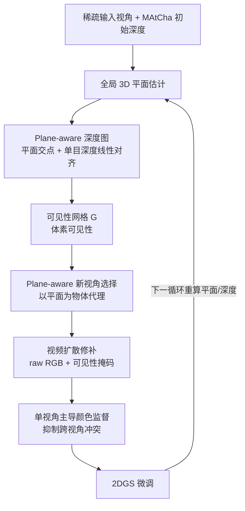

# G4Splat: Geometry-Guided Gaussian Splatting with Generative Prior

**会议**: ICLR 2026  
**OpenReview**: [https://openreview.net/forum?id=kdPmsMVhZf](https://openreview.net/forum?id=kdPmsMVhZf)  
**项目主页**: [https://dali-jack.github.io/g4splat-web/](https://dali-jack.github.io/g4splat-web/)  
**代码**: 待确认  
**领域**: 3D 视觉 / 稀疏视角场景重建  
**关键词**: Gaussian Splatting, 稀疏视角重建, 生成先验, 平面几何, 视频扩散修补  

## 一句话总结
G4Splat 主张"准确几何是用好生成先验的前提"，先用人造场景中普遍存在的平面结构推出尺度准确的 plane-aware 深度，再把这套几何贯穿到可见性估计、新视角选择和视频扩散修补全流程，从而在观测区和未观测区都拿到几何与外观双优的稀疏视角场景重建。

## 研究背景与动机
**领域现状**：3DGS/2DGS 在密集视角下能做出照片级新视角合成，但稀疏视角下几何与光度监督都不够，质量明显退化。一类方法靠深度正则缓解，另一类更激进——直接借预训练扩散模型的生成知识去"脑补"看不见的区域。

**现有痛点**：本文把现有生成式重建的失败归结为两点。其一，**缺乏可靠几何监督**——单目深度估计存在尺度歧义，连观测区都重建不好，更别说作为修补未观测区的几何基础；匹配类方法（如 MASt3R/MAtCha 的 chart alignment）在视角不重叠区域容易出错。其二，**缺乏抑制多视角不一致的机制**——扩散模型生成的图像跨视角并不一致，直接拿来监督会引发严重的"形状—外观歧义"（shape–appearance ambiguity），导致几何被污染。

**核心矛盾**：想用生成先验补全未观测区，却又被生成结果的几何不可靠和跨视角不一致反噬，越补越歪。

**本文目标**：在观测区和未观测区同时给出准确、跨视角一致的几何监督，并把几何信号注入整个生成修补管线，实现高质量的"任意视角"场景补全。

**核心 idea**：**[平面即几何锚点]** 利用人造环境符合 Manhattan world 假设、平面结构普遍存在的特性——3D 平面能从局部深度观测可靠估计并外推到整张表面，从而在非重叠/未观测区也能给出尺度准确的深度；**[几何贯穿生成全流程]** 把这套平面几何同时用于可见性网格、新视角选择和视频扩散的颜色监督，而不只是当一个额外的深度损失。

## 方法详解

### 整体框架
G4Splat 以 2DGS + MAtCha（chart alignment 得到初始尺度深度）为骨架，分两阶段训练：初始化阶段先建可靠几何，第二阶段进入"几何引导生成训练循环"。每个循环里先从所有训练视角抽取全局 3D 平面、算出 plane-aware 深度，再据此构建可见性网格、选择 plane-aware 新视角、用视频扩散修补不可见区域，把补全的视角并入训练集后微调高斯，如此迭代（实验用三轮）。

### 关键设计

**1. Plane-aware 几何建模：把平面当作可外推的尺度锚点。** 先做逐视角 2D 平面提取——假设平面区域法向一致、几何平滑、语义相近，于是对单目/深度梯度得到的法向图做 K-means 聚类得到朝向一致的区域，再用 SAM 实例掩码过滤，保留同一实例标签且超过尺寸阈值的块作为有效 2D 平面掩码。接着做全局 3D 平面估计：逐视角 2D 掩码往往过分割且跨视角不一致，于是借场景点云把法向相近、3D 点集空间重叠充分的局部平面合并成全局平面 $\Phi_k: n_k^\top x + d_k = 0$；为鲁棒，只取被至少两视角观测到的高置信点 $P_k^{\text{conf}}$ 用 RANSAC 拟合 $\min_{n_k,d_k}\sum_{p\in P_k^{\text{conf}}}(n_k^\top p + d_k)^2,\ \text{s.t.}\ \|n_k\|=1$。有了全局平面后提取 plane-aware 深度：平面像素 $u$ 直接用射线与平面求交得 $D_v^i(u)=\frac{-n_{k_i}^\top o_v - d_{k_i}}{n_{k_i}^\top r_v(u)}$；非平面但可见区保留 MAtCha 深度；非平面且不可见区用单目深度 $\hat D_v$ 经平面区域的最小二乘线性对齐到绝对尺度 $D_v(u)=a_v\hat D_v(u)+b_v$。关键优势是平面允许**深度外推**——即便视角不重叠，整张平面也能从局部观测可靠延伸出去，直接缓解了 MAtCha 在非重叠区的明显错误。

**2. 几何引导的可见性：用可见性网格替代有噪的 alpha 掩码。** 现有方法靠 alpha map 推修补掩码，常在本应可见的区域出错，污染修补。G4Splat 改用尺度准确的 plane-aware 深度建一个体素可见性网格 $G$：先由全部训练视角深度定出场景 3D 边界并离散成体素，每个体素中心投影到各训练视角、落入有效深度范围即标记可见（至少一个视角可见即 visible=1），全部体素并行判定。渲染新视角可见性时，沿每像素射线到渲染深度处均匀采 $Q$ 个点，最近邻插值取网格可见值，最终 $V_v(u)=\prod_{q=1}^{Q} v_q$——即射线上所有采样点都可见，该像素才判为可见。这给视频扩散提供了比 alpha 掩码干净得多的修补区域。

**3. Plane-aware 新视角选择 + 单视角主导监督：从源头压住多视角不一致。** 朴素的"绕场景中心椭圆轨迹"只能给局部覆盖，修补结果拼回去会留接缝。G4Splat 把全局 3D 平面当作物体代理，对每个平面以其质心为 look-at 目标，在可见网格中心里搜相机位姿，目标三选：最大化平面点覆盖、最小化到平面距离、鼓励视线方向与平面法向对齐，从而保证选出的视角能完整覆盖物体、给修补足够上下文。修补本身用预训练视频扩散模型，以输入图像为参考、$\{\tilde I_v, V_v\}$ 为输入联合修补所有视角。即便联合推理，生成结果仍有跨视角不一致，于是监督时**每个区域主要只信一个视角的颜色**：平面区域选对该平面观测最完整的视角，非平面区域选它首次可见的那个视角，以此最大限度减少 cross-view conflict 带来的形状—外观歧义。

整个训练沿用 MAtCha 的总损失 $L_{\text{total}}=L_{\text{rgb}}+L_{\text{reg}}+L_{\text{struct}}$，但把 chart 深度替换/增强为 plane-aware 深度，引入更强的几何约束。

## 实验关键数据

### 主实验表格（5 输入视角，部分数据集，↓越低越好/↑越高越好）

| 数据集 | 方法 | CD↓ | F-Score↑ | NC↑ | PSNR↑ | SSIM↑ | LPIPS↓ |
|--------|------|-----|----------|-----|-------|-------|--------|
| Replica | 2DGS | 14.64 | 48.01 | 74.14 | 18.43 | 0.735 | 0.306 |
| Replica | MAtCha | 10.12 | 60.90 | 79.33 | 17.81 | 0.752 | 0.228 |
| Replica | GenFusion | 13.05 | 41.60 | 69.33 | 20.14 | 0.801 | 0.258 |
| Replica | Difix3D+ | 13.71 | 43.11 | 65.34 | 19.42 | 0.779 | 0.231 |
| Replica | **Ours** | **6.61** | **65.14** | **83.98** | **23.90** | **0.836** | **0.199** |
| ScanNet++ | MAtCha | 11.55 | 62.98 | 73.61 | 13.58 | 0.677 | 0.351 |
| ScanNet++ | GenFusion | 10.68 | 47.15 | 66.27 | 16.12 | 0.726 | 0.347 |

在 Replica、ScanNet++、DeepBlending、Mip-NeRF 360 四个数据集上，几何（CD/F-Score/NC）与外观（PSNR/SSIM/LPIPS）指标一致领先，未观测区提升尤为明显。

### 消融实验表格（Replica，GP=生成先验 / PM=平面几何建模 / PP=几何引导生成管线）

| GP | PM | PP | CD↓ | F-Score↑ | NC↑ | PSNR↑ | SSIM↑ | LPIPS↓ |
|----|----|----|-----|----------|-----|-------|-------|--------|
| × | × | × | 10.60 | 59.17 | 79.95 | 17.85 | 0.751 | 0.228 |
| ✓ | × | × | 9.46 | 56.99 | 77.58 | 19.63 | 0.740 | 0.295 |
| × | ✓ | × | 8.73 | 64.96 | 80.55 | 17.63 | 0.752 | 0.219 |
| ✓ | ✓ | × | 7.56 | 62.36 | 80.89 | 21.88 | 0.810 | 0.221 |
| ✓ | ✓ | ✓ | **6.61** | **65.14** | **83.98** | **23.90** | **0.836** | **0.199** |

### 关键发现
- 只加生成先验（GP）会让几何变差（F-Score 59.17→56.99、LPIPS 升），印证了"没有可靠几何，生成先验反而帮倒忙"的核心论点。
- 平面几何建模（PM）单独就把 CD 从 10.60 降到 8.73、F-Score 升到 64.96，几何收益最大；再叠加几何引导生成管线（PP）把外观指标进一步拉满（PSNR 21.88→23.90）。
- 方法天然支持单视角输入和无位姿（unposed）视频（如 YouTube 视频），室内外都能泛化；运行时间与基线相当（Table 4），并未因多轮生成循环显著变慢。

## 亮点与洞察
- **观点鲜明且被实验背书**：明确提出"准确几何是用好生成先验的前提"，并用 GP-only 反而掉点的消融把这个观点钉死，而非泛泛而谈。
- **平面的"可外推性"用得很巧**：匹配类方法在非重叠区失效，而平面能从局部观测拟合后外推整张表面，这正好补上稀疏视角下未观测区缺监督的短板。
- **几何不是当损失项加，而是贯穿全流程**：从可见性网格、新视角选择到颜色监督，几何信号在生成管线的每一步都在压制多视角不一致，是系统性设计而非单点 trick。

## 局限与展望
- 强依赖 Manhattan world / 平面普遍存在的假设，平面稀少或大量曲面/无结构的复杂场景（如自然户外、植被密集场景）可能退化，论文也在附录 D 讨论了 failure case。
- 平面提取串联了 SAM、单目法向/深度估计、视频扩散等多个预训练模型，整体管线偏重，且最终质量受这些上游模型质量制约。
- 三轮生成训练循环虽与基线时间相当，但属于迭代式优化，循环数与收敛性需要人工设定，自适应停止仍有空间。

## 相关工作与启发
- **几何骨架**：建立在 2DGS（把 3D 高斯压成 2D 盘）与 MAtCha（chart alignment + MASt3R-SfM 得尺度深度）之上，针对其"非重叠区出错"做平面外推改进。
- **生成式补全对照组**：See3D、GenFusion、Difix3D+、GuidedVD 等代表了"直接用扩散先验补未观测区"的路线，本文证明在它们之上加可靠几何能同时救几何与外观。
- **启发**：对任何"借生成模型脑补缺失内容"的 3D 任务，先把几何尺度和跨视角一致性钉牢，再让生成模型在可靠几何约束下工作，往往比直接信任生成结果更稳——平面这类强先验结构是低成本拿到尺度锚点的好抓手。

## 评分
- 新颖性: ⭐⭐⭐⭐ 把平面几何系统性地贯穿到生成修补全流程，并用"几何是生成先验前提"的观点统领，思路清晰且有反直觉的消融支撑。
- 实验充分度: ⭐⭐⭐⭐ 四数据集、几何+外观双指标、清晰的三因子消融，外加单视角/unposed 视频泛化和运行时间对比，覆盖较全。
- 写作质量: ⭐⭐⭐⭐ 论点—痛点—方法对应明确，图 3 的中间结果可视化（AM vs VM、NNV vs PNV）直观说明了每个设计要解决什么。
- 价值: ⭐⭐⭐⭐ 稀疏视角/任意视角室内外重建的实用性强，平面外推 + 几何引导生成的范式对相关任务有较好借鉴意义。

<!-- RELATED:START -->

## 相关论文

- [\[CVPR 2026\] GIFSplat: Generative Prior-Guided Iterative Feed-Forward 3D Gaussian Splatting from Sparse Views](../../CVPR2026/3d_vision/gifsplat_generative_prior-guided_iterative_feed-forward_3d_gaussian_splatting_fr.md)
- [\[ICLR 2026\] Generative Human Geometry Distribution](generative_human_geometry_distribution.md)
- [\[CVPR 2026\] P2GS: Physical Prior-guided Gaussian Splatting for Photometrically Consistent Urban Reconstruction](../../CVPR2026/3d_vision/p2gs_physical_prior-guided_gaussian_splatting_for_photometrically_consistent_urb.md)
- [\[ICLR 2026\] From Tokens to Nodes: Semantic-Guided Motion Control for Dynamic 3D Gaussian Splatting](from_tokens_to_nodes_semantic-guided_motion_control_for_dynamic_3d_gaussian_spla.md)
- [\[ICLR 2026\] ReSplat: Degradation-agnostic Feed-forward Gaussian Splatting via Self-guided Residual Diffusion](resplat_degradation-agnostic_feed-forward_gaussian_splatting_via_self-guided_res.md)

<!-- RELATED:END -->
