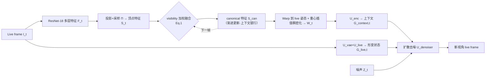

# GenFusion: Feed-forward Human Performance Capture via Progressive Canonical Space Updates

**会议**: ICLR 2026  
**OpenReview**: [https://openreview.net/forum?id=HlsFKjrHSw](https://openreview.net/forum?id=HlsFKjrHSw)  
**代码**: 待确认  
**领域**: 3D 视觉 / 人体表演捕捉 / 单目新视角合成  
**关键词**: 人体表演捕捉, 单目视频, 渐进式 canonical 空间, 概率回归, 扩散模型, 前馈方法  

## 一句话总结
GenFusion 把单目 RGB 视频流逐帧累积进一个不断"补全"的 canonical 特征空间作为时序上下文，再用扩散式概率回归把这份上下文 warp 回当前帧并渲染新视角，从而在只有侧视输入时也能合成出与历史观测一致的正面细节，且比确定性回归更锐利。

## 研究背景与动机
- **领域现状**：从稀疏甚至单目视图做人体表演捕捉（novel view synthesis of a performer）是 3D 人体重建的核心难题。逐帧（per-frame）前馈方法靠像素对齐特征做泛化重建，但单帧观测天然不完整。
- **现有痛点**：单帧方法分两类，各有硬伤——确定性回归方法（SHERF、GHG、NHP）用 ℓ1/MSE 监督，在历史帧与当前帧姿态错位时会被像素级惩罚逼着"取平均"，抑制高频细节，输出发糊；概率/生成方法（Champ、AniGS、LHM、SiFU）单帧看着锐利，但不接历史，会幻觉出与过去观测无关的细节（比如把蓝衬衫渲染成别的图案）。
- **核心矛盾**：单目流里每帧只看到人体的一部分，要补全不可见区域必须利用时序历史；但简单聚合历史又会遇到"历史姿态 vs 当前姿态形变不一致"，确定性监督一惩罚错位就糊掉，生成式监督不约束就乱编。**既要时序上下文、又要锐利、又要与历史一致**三者难以兼得。
- **本文目标**：从单目 RGB 流前馈渲染 performer 的高保真新视角，使合成结果既扎根于历史观测、又贴合当前帧的形变状态。
- **核心 idea**：**【渐进式 canonical 上下文 + 概率回归】** 维护一个随每帧 visibility 加权更新的 canonical 特征空间当"上下文银行"，再把渲染建模成扩散概率回归——用感知层面而非像素层面的监督，让模型能在姿态/几何错位时仍调用 canonical 里的语义线索（纹理、图案），并在毫无历史观测的区域也能合理 hallucinate。

## 方法详解

### 整体框架
给定单目视频、逐帧拟合好的 SMPL-X 模板和相机参数，GenFusion 分三步循环处理：每来一帧 live frame，先抽特征并沿 SMPL-X 顶点对齐、按 visibility 融进共享 canonical 特征空间（时序累积）；再把 canonical 特征 warp 回当前 live 姿态并稠密化成 2D 上下文图；最后用扩散去噪网络以"canonical 上下文 + 当前形变状态"为条件，从噪声中合成目标相机下的新视角。SMPL-X 只用来建立跨帧 4D 对应做时序对齐，并非贡献点。

### 关键设计
**1. 沿 SMPL-X 顶点对齐的层级特征提取：把图像信息钉到模板表面。** 对当前 live frame $I_t$ 用 ResNet-18 前三层抽多尺度特征图 $F_t$（分辨率降到 1/2、1/4、1/8），既保留纹理这种细粒度细节、又保留区域级语义；ResNet 的感受野还能让顶点编码到衣服、头发等延伸出 SMPL-X 表面的上下文。随后把 SMPL-X 顶点 $X_t$ 用输入相机参数 $C_{input}$ 投影到 2D（$\text{Proj}$），再双线性采样得到顶点对齐特征集 $S_t = \Pi(F_t, \text{Proj}(X_t, C_{input})) \in \mathbb{R}^{M\times L}$（$M$ 个顶点，$L{=}256$ 通道）。这一步把任意帧的观测统一锚定到同一套模板顶点上，是后续跨帧融合的前提。

**2. visibility 加权的渐进式 canonical 更新：让"上下文银行"越攒越全。** Canonical 特征集 $S_{can}$ 初始化为零，并配一张可见频次图 $V_{can}\in\mathbb{R}^{M\times 1}$ 记录每个顶点被看到的累计次数。每来一帧，按可见频次对历史特征和当前特征做加权平均：
$$S_{can} = \frac{(S_t \cdot V_t) + (S_{can}\cdot V_{can})}{\max(V_t + V_{can},\,1)},\qquad V_{can}\leftarrow V_{can}+V_t.$$
这套规则让看得越多的顶点权重越稳，同时把新观测平滑融入，使 canonical 空间随时间逐步补全。即使当前帧看不到某区域（如正面被遮），canonical 里仍存着过去看到过的外观，充当渲染时的上下文来源——这正是它能"在侧视输入下补出正面条纹衬衫"的关键。

**3. Warp + 重心插值把稀疏 canonical 变稠密 live 上下文。** 渲染当前帧时，先用当前 SMPL-X 顶点 $X_t$ 把 $S_{can}$ warp 到 live 姿态，再投影到目标新视角相机 $C_{novel}$。但 $S_{can}$ 是稀疏的顶点级表示，于是用重心插值把顶点特征渲成稠密 2D 特征图：$W_t = \text{Interpolate}(\text{Warp}(S_{can}, X_t), C_{novel})$。$W_t$ 承载了从 $S_{can}$ 聚合来的丰富时序上下文，作为后续重建的稠密底图。这一步绕开了传统方法需要为单目动态非刚体优化 SE(3) warp 的困难，改成"先补全 canonical、再插值渲出 live"。

**4. 扩散式概率回归：用感知监督化解"历史 vs 当前"的形变冲突。** 确定性像素监督在历史姿态与当前姿态错位时会惩罚高频细节、逼出模糊平均。GenFusion 改用扩散模型（基于现成的预训练 VAE 与 Stable Diffusion，强调的是 canonical 上下文设计而非生成架构创新）：把稠密上下文 $W_t$ 经含卷积与自注意力的 $U_{enc}$ 编码成 $G_{context,t}=U_{enc}(W_t)$；同时把当前帧形变状态编码成 $G_{live,t}=U_{live}(U_{vae}(I_t))$；去噪网络以二者及噪声 latent 为条件预测噪声：
$$\mathcal{L}=\mathbb{E}\big[\|\epsilon - U_{denoiser}(Z_t, G_{context,t}, G_{live,t}, i)\|^2\big],\quad Z_t=\alpha_t Z+\sigma_t\epsilon.$$
感知层面的监督不强求逐像素对齐，让模型敢于调用 canonical 里语义相关的纹理/图案，即便姿态几何有错位；其概率性还能在毫无历史的区域合理生成。训练时输入参考帧加 $N{=}10$ 个前序帧，时间步长 $K\in\{1,5,10\}$ 随机采样以丰富时序上下文；推理用连续帧（$K{=}1$）逐帧更新 $S_{can}$，仅 $T{=}10$ 步扩散。

## 实验关键数据

### 主实验表格
4D-Dress 同域泛化（LPIPS-VGG ×1000，↓ 越低越好；FVD 衡量与历史一致性）：

| 方法 | 可泛化 | 时序上下文 | 合成目标 | PSNR↑ | LPIPS-VGG↓ | FVD↓ |
|------|--------|-----------|----------|-------|-----------|------|
| GauHuman（逐主体优化） | ✗ | ✗ | 确定性 | 23.19 | 83.34 | 500.8 |
| Champ | ✓ | ✗ | 概率 | 19.37 | 98.61 | 254.5 |
| SHERF | ✓ | ✗ | 确定性 | 21.86 | 86.34 | 735.3 |
| GHG | ✓ | ✗ | 确定性 | 24.50 | 75.60 | 502.93 |
| NHP | ✓ | ✗ | 确定性 | 24.72 | 96.26 | 630.0 |
| **Ours** | ✓ | ✓ | 概率 | **25.07** | **62.97** | **176.7** |

MVHumanNet 跨数据集泛化：

| 方法 | PSNR↑ | LPIPS-VGG↓ | FVD↓ |
|------|-------|-----------|------|
| Champ | 21.06 | 97.61 | 674.1 |
| NHP | 22.25 | 131.91 | 1321.4 |
| **Ours** | 21.25 | **87.85** | **436.9** |

GenFusion 在感知指标（LPIPS）和时序一致性（FVD）上全面领先：4D-Dress 上 FVD 从次优的 Champ 254.5 降到 176.7，LPIPS 62.97 远好于所有 baseline。Champ 单帧 PSNR 反而最低，印证"单帧锐利但不接历史"。

### 消融实验表格
4D-Dress 消融（验证三大组件）：

| 变体 | 时序上下文 | 合成目标 | PSNR↑ | LPIPS-VGG↓ | FVD↓ |
|------|-----------|----------|-------|-----------|------|
| (a) 无时序上下文（仅当前帧 normal map） | 无 | 概率 | 25.03 | 63.34 | 177.4 |
| (b) 无特征上下文（用原始 RGB 值） | 有 | 概率 | 24.37 | 64.51 | 191.9 |
| (c) 无概率目标（确定性像素 MSE） | 有 | 确定性 | 25.23 | 95.70 | 572.3 |
| (d) 完整方法 | 有 | 概率 | 25.07 | 62.97 | 176.7 |

### 关键发现
- **概率目标是锐利的关键**：变体 (c) 用确定性 MSE，PSNR 甚至最高（25.23），但 LPIPS 暴涨到 95.70、FVD 到 572.3——再次证明像素指标高 ≠ 视觉好，确定性监督会糊掉高频。
- **时序上下文保证一致性**：去掉时序 (a) 帧级质量尚可，但遮挡区会编出与历史不符的图案，FVD 略升。
- **编码特征优于原始 RGB**：变体 (b) 用原始 RGB 当上下文，LPIPS/FVD 都退化，说明 ResNet 编码特征带来的空间丰富度对补全遮挡细节有用。
- **泛化性强**：TikTok in-the-wild（无 GT）定性结果显示，从背视输入能补出与历史一致的正面细节（如粉色蝴蝶结），而 Champ/AniGS/LHM 编出无关细节。

## 亮点与洞察
- **"渐进补全 canonical + 概率渲染"的组合拳很自然**：把"人转一圈逐渐看全"的直觉直接编码进系统——canonical 空间负责攒信息、概率回归负责在错位时仍能用这些信息，两者缺一不可。
- **诚实的贡献定位**：作者反复声明 SMPL-X、扩散模型、概率渲染本身都不是创新点，核心贡献是"精心设计的 canonical 上下文能让现成扩散模型显著提升合成质量"，这种把已有部件重新编排出价值的思路值得借鉴。
- **FVD 当一致性度量很贴切**：用单视角序列帧算 FVD 来量化"与历史观测对齐"，比单纯 PSNR/LPIPS 更能暴露生成式方法"乱编"的问题。
- **visibility 加权融合简洁有效**：Eq.1 一个加权平均就实现了稳健的历史/当前权衡，无需复杂记忆网络。

## 局限与展望
- **强依赖 SMPL-X 拟合质量**：4D 对应完全建立在模板拟合上，松散衣物、复杂姿态下若 SMPL-X 拟合差，对齐与 warp 都会受影响。
- **逐帧串行 + 扩散推理**：canonical 需逐帧更新、每帧还要 10 步扩散，对真正实时 live streaming 的延迟未充分讨论。
- **PSNR 不占优**：方法本质牺牲了像素级精度换感知与一致性，在看重 PSNR 的场景未必合适。
- **未观测区域仍是"合理 hallucinate"**：完全没见过的区域只能靠生成先验编，不保证真实，长时间遮挡区可能漂移。
- **展望**：把 canonical 更新做成可在线遗忘/纠错的记忆、引入几何一致性约束减少模板依赖、压缩扩散步数以逼近实时，都是自然方向。

## 相关工作与启发
- **vs 优化类方法**（Habermann 等 LiveCap/DeepCap、GauHuman）：质量高但需逐主体优化、依赖预捕模板，无法泛化新主体；GenFusion 前馈泛化是其主要卖点。
- **vs 逐帧确定性前馈**（PIFu 系、SHERF、GHG）：靠像素对齐特征，单目复杂姿态下无法 hallucinate 不可见区域，取平均发糊。
- **vs 时序确定性**（NHP）：同样用模板聚合时序，但确定性监督导致模糊；GenFusion 把监督换成概率回归正是对 NHP 痛点的直接回应。
- **vs 逐帧概率/生成**（Champ、AniGS、LHM、SiFU）：生成质量好但无时序记忆、与历史不一致；本文用 canonical 上下文给生成模型"接地"。
- **启发**：在任何"观测随时间逐渐完整 + 单步监督会被错位惩罚"的流式重建任务（如动态场景、手部/物体捕捉）里，"渐进上下文银行 + 感知层概率监督"都是值得迁移的范式。

## 评分
- **新颖性**: ⭐⭐⭐⭐ — 单个部件（SMPL-X/扩散）都不新，但"渐进式 visibility 加权 canonical 上下文 + 概率回归"这套组合并明确诊断确定性监督在时序错位下的失效，定位清晰、思路自然。
- **实验充分度**: ⭐⭐⭐⭐ — 同域(4D-Dress)、跨数据集(MVHumanNet)、in-the-wild(TikTok) 三档泛化 + 三组件完整消融，对比覆盖确定性/概率/逐主体三类 baseline，FVD 一致性度量到位；可惜 MVHumanNet 上 PSNR 不占优、效率/实时性分析偏少。
- **写作质量**: ⭐⭐⭐⭐ — 动机用"看芭蕾舞者"类比讲得很直观，多处诚实声明非贡献点，方法与失败分析（确定性为何糊）逻辑清楚。
- **价值**: ⭐⭐⭐⭐ — 为单目人体表演捕捉给出一条"时序一致 + 高保真"的实用前馈路线，canonical 上下文 + 概率渲染的范式对流式 3D 重建有较广借鉴意义。

<!-- RELATED:START -->

## 相关论文

- [\[CVPR 2026\] UniSH: Unifying Scene and Human Reconstruction in a Feed-Forward Pass](../../CVPR2026/3d_vision/unish_unifying_scene_and_human_reconstruction_in_a_feed-forward_pass.md)
- [\[ICLR 2026\] Flash-Mono: Feed-Forward Accelerated Gaussian Splatting Monocular SLAM](flash-mono_feed-forward_accelerated_gaussian_splatting_monocular_slam.md)
- [\[ICLR 2026\] ReSplat: Degradation-agnostic Feed-forward Gaussian Splatting via Self-guided Residual Diffusion](resplat_degradation-agnostic_feed-forward_gaussian_splatting_via_self-guided_res.md)
- [\[ICLR 2026\] Splat and Distill: Augmenting Teachers with Feed-Forward 3D Reconstruction for 3D-Aware Distillation](splat_and_distill_augmenting_teachers_with_feed-forward_3d_reconstruction_for_3d.md)
- [\[ICLR 2026\] A Scene is Worth a Thousand Features: Feed-Forward Camera Localization from a Collection of Image Features](a_scene_is_worth_a_thousand_features_feed-forward_camera_localization_from_a_col.md)

<!-- RELATED:END -->
