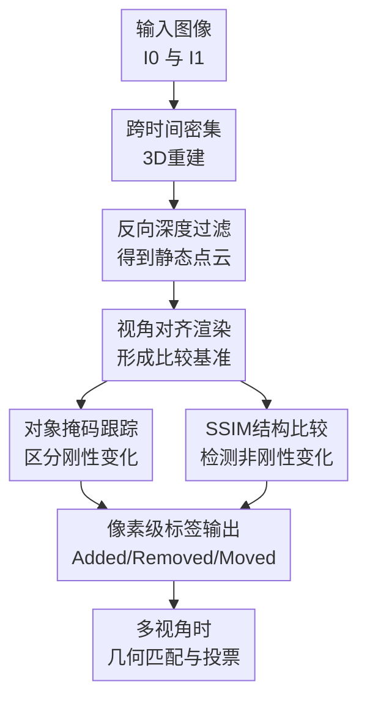

# GOLDILOCS: General Object-Level Detection and Labeling of Changes in Scenes

**会议**: ICLR2026  
**OpenReview**: [https://openreview.net/forum?id=qbCceo3FBE](https://openreview.net/forum?id=qbCceo3FBE)  
**代码**: 待发布  
**领域**: 3D视觉  
**关键词**: 场景变化检测, 3D重建, 对象级变化, 零样本检测, 多视角一致性  

## 一句话总结
GOLDILOCS 把跨时间场景变化检测重新表述为“静态 3D 重建假设被破坏在哪里”的问题，用 MASt3R 的密集重建、深度冲突过滤、SAM2 掩码跟踪和 SSIM 结构差异，在零训练条件下同时检测并标注 added、removed、moved、warped 等对象级变化。

## 研究背景与动机
**领域现状**：场景变化检测（Scene Change Detection, SCD）通常给定同一场景在 $T_0$ 与 $T_1$ 的图像，输出哪些区域发生了有意义变化。早期深度方法多把它当作二值分割或语义分割来做，需要在特定数据集上训练；近期零样本方法开始借助 SAM、SAM2、DEVA 等基础模型来降低标注依赖；另一路 3D 方法则用 NeRF 或 3D Gaussian Splatting 建模场景，再比较不同时间的渲染结果。

**现有痛点**：2D 方法最难处理的是视角差异。两张图里同一个桌子、椅子或街景物体只要拍摄角度不同，像素差异就会很大，纯图像差分容易把视角变化误当作真实变化。相反，3D 方法虽然能显式处理视角，却往往要求 $T_0$ 和 $T_1$ 都有多张图、相机轨迹较规整，并且需要耗时重建，无法退化到“一张旧图 + 一张新图”的常见输入。

**核心矛盾**：变化检测需要既能抵抗拍摄视角变化，又不能要求强约束采集条件。旧方法通常把 viewpoint difference 看成干扰：2D 方法试图对齐它，3D 方法要求用大量视图消化它。GOLDILOCS 的关键反转是：如果跨时间图像仍有足够 3D 重叠，视角差异本身可以提供几何约束；真正变化的对象会让静态场景重建产生冲突。

**本文目标**：作者要解决的不是简单“哪些像素不同”，而是更细的对象级语义变化：某个对象是否被移除、是否新增、是否移动，以及是否在原地发生非刚性形变。方法还需要在无标注、无相机标定、输入可为图像对或多视角图像集的情况下工作。

**切入角度**：论文从多视图立体重建的静态假设出发：如果两张跨时间图像中某个区域属于不变背景或静态物体，它应该能被统一到一个一致的 3D 结构里；如果一个物体被拿走、放入或移动，重建模型为了解释两张图就会在该区域产生深度冲突、投影不一致或无法跟踪的对象掩码。

**核心 idea**：用“跨时间 3D 重建中的几何不一致”替代“跨图像像素差分”，先重建出只包含共同静态部分的 canonical scene，再用对象掩码传播和结构相似度比较把变化区域解释成具体的对象级标签。

## 方法详解

### 整体框架
GOLDILOCS 的输入可以是一对 RGB 图像 $I_0, I_1$，分别来自时间 $T_0, T_1$；也可以扩展到两个时间点的多视角图像集合。它先用密集 stereo 3D reconstruction 估计两张图的相机参数和点云，再通过反向深度测试删除跨时间不一致的几何，得到一个只保留静态共同部分的干净点云 $P^*$。之后，方法把原始点云和干净点云渲染到目标视角，借助 SAM2 的分割与跟踪能力判断哪些对象掩码从“原始渲染”到“干净渲染”消失、又能否在目标图中被重新找到，从而区分 removed、added 与 moved；对仍在同一位置但内部结构改变的对象，则用 SSIM 热力图检测 warped。

这张图里的贡献节点和后面的关键设计一一对应：先用跨时间 3D 重建拿到点图与相机，再用反向深度过滤构造不含变化物的静态参考，随后通过视角对齐渲染把 3D 判断重新落回 2D 图像空间，最后用对象掩码跟踪与 SSIM 分别处理刚性对象变化和非刚性形变。多视角输入不是另起一套方法，而是在每个目标视角上选择几何匹配最好的参考视角跑 pairwise pipeline，再通过跨视角投票稳定最终标签。

### 关键设计
**1. 跨时间密集 3D 重建：把视角差异从噪声变成约束**

GOLDILOCS 的第一步不是直接比较 $I_0$ 和 $I_1$ 的像素，而是用 MASt3R 从两张未标定图像中估计密集 3D 点图 $P_0, P_1 \in \mathbb{R}^{H \times W \times 3}$ 以及投影矩阵 $C_0, C_1 \in \mathbb{R}^{3 \times 4}$。其中 $C_i = K_i[R_i|t_i]$，同时包含相机内参和外参。这样，原本难以处理的“两个时间点拍摄角度不同”被转化为可投影、可重渲染、可检查深度一致性的几何关系。

这个设计的意义在于，它没有要求用户提前提供相机标定，也没有要求每个时间点都有完整多视角扫描。MASt3R 这类基础重建模型能在 image-pair setting 下输出相对稠密的几何和相机姿态，GOLDILOCS 便把后续变化检测建立在这些几何量之上。对 SCD 来说，这比单纯用 2D feature matching 更稳，因为真实变化对象通常无法同时满足两个时间点的静态重建假设，而背景和未变化物体则应当在 3D 中保持一致。

**2. 反向深度过滤：用几何冲突剥离变化物和遮挡物**

论文最核心的一步是 depth-aware pointcloud cleaning。给定来自图像 $I_i$ 的世界点 $p \in P_i$，把它投影到另一个视角 $I_j$ 中，得到像素坐标和相机深度：$(u, v, z_{i \to j}) = C_j p$。同时，重建过程也给出目标视角自己的深度图 $D_j$。如果某个点满足 $z_{i \to j} < D_j(u, v)$，它在目标视角中会落在该视角观测表面的前方，说明它更像是一个跨时间不一致的遮挡物或变化物，而不是两张图共享的静态结构。

GOLDILOCS 因此定义干净点图 $P_i^{Clean} \subseteq P_i$，只保留不会与对侧视角发生上述深度冲突的点。把 $P_0^{Clean}$ 与 $P_1^{Clean}$ 合并成 $P^*$ 后，得到的是一个 canonical static reconstruction：它主要由两张图共同支持的最远可见表面组成。直观地说，如果 $T_0$ 有一个杯子挡住桌面，而 $T_1$ 中杯子被拿走了，那么杯子点投到 $T_1$ 视角时会在桌面深度前方形成冲突，因而被过滤掉；剩下的桌面则成为干净参考。这个参考不是为了最终展示好看的 3D 模型，而是为了制造一个“不含刚性变化对象”的对照物。

**3. 视角对齐渲染：把 3D 静态参考变成可比较的 2D 证据**

仅有干净点云还不够，因为数据集标注和对象分割通常都在某个 2D 目标视角中定义。GOLDILOCS 将点图 $P_i$ 或干净点云 $P^*$ 用相机 $C_j$ 渲染成图像 $R_{i,j}$ 或 $R^*_{j}$。例如 $R_{0,1}$ 表示“把 $T_0$ 的几何和颜色放到 $I_1$ 的视角看”，而 $R^*_{1}$ 表示“从 $I_1$ 视角看干净静态场景”。这样，算法可以在同一个视角下比较原始对象、静态参考和真实目标图，而不必让两个原始图像强行像素对齐。

这个设计把变化解释分成两层：3D 层负责判断哪些几何能被跨时间共同解释，2D 层负责把这些差异组织成对象掩码和最终标签。相比 NeRF/3DGS 类方法需要为每个场景优化显式表示，GOLDILOCS 的点云渲染更轻量；相比 2D 方法，$R_{0,1}$ 和 $R^*_1$ 已经处在目标视角下，视角差异对后续分割和跟踪的干扰被显著降低。

**4. 对象掩码跟踪与 SSIM：把变化区域解释成 added、removed、moved、warped**

在刚性变化上，GOLDILOCS 用 SAM2 生成和传播对象掩码。以检测 $T_0$ 中存在、到 $T_1$ 后消失或移动的对象为例，方法先在 $R_{0,1}$ 上分割对象，得到 $M_{R_{0,1}}$，再尝试把这些掩码跟踪到干净渲染 $R^*_{1}$。如果某个掩码无法从原始渲染跟踪到干净静态参考，它就是变化候选：$M^{Changed}_{R_{0,1}} = M_{R_{0,1}} \setminus Track(M_{R_{0,1}}, R_{0,1} \to R^*_{1})$。接着，把这些候选继续跟踪到真实目标图 $I_1$；能在 $I_1$ 中找到对应对象的被认为是 moved，找不到的被认为是 removed。新增对象则反向处理：从 $I_1$ 的掩码出发，无法跟踪到 $R^*_1$ 的是变化候选，若又能在 $R_{0,1}$ 找到对应物则是 moved，否则是 added。

为了避免把不可见区域误判成变化，方法还对所有跟踪掩码做 visibility-aware filtering：如果掩码大面积落在 $R_{0,1}$ 的空洞、遮挡或视野外区域，就丢弃，因为那里没有足够证据确认对象真的被移除或新增。对非刚性变化，GOLDILOCS 不再依赖“对象是否换了位置”，而是比较 $R_{0,1}$ 与 $I_1$ 的 SSIM dissimilarity map。对每个静态对象掩码计算平均结构差异，若其分数比所有掩码的均值高出一个标准差以上，就标为 warped。最后像素级标签按 Warped > Moved > Removed > Added 的优先级堆叠，避免重叠掩码互相覆盖时产生含混输出。

### 一个完整示例
假设 $T_0$ 中桌上有一个马克杯，$T_1$ 中马克杯被移到另一侧，同时桌布被揉皱。MASt3R 会先为两张图估计点图和相机；当 $T_0$ 的杯子点投到 $T_1$ 视角时，它们无法和 $T_1$ 中原位置的桌面深度一致，于是在反向深度过滤中被删除。合并后的 $P^*$ 更像是一个“没有旧位置杯子”的静态桌面参考。

接着，GOLDILOCS 把 $T_0$ 的点图渲染到 $T_1$ 视角得到 $R_{0,1}$，在这个渲染上分割出杯子掩码。这个掩码无法跟踪到 $R^*_1$，说明旧位置的杯子不是静态背景；但它能被继续跟踪到真实 $I_1$ 中的新位置，因此被标成 moved，而不是 removed。与此同时，桌布仍在同一大致空间位置，掩码不会因为深度冲突被剔除；但 $R_{0,1}$ 与 $I_1$ 在桌布区域的 SSIM 结构差异显著偏高，于是桌布被标成 warped。

这个例子也说明了方法的保守性：如果旧杯子位置在 $I_1$ 中刚好被另一个物体遮挡，掩码会因为落在不可见区域而被过滤，方法不会轻易断言 removed。论文的变化 taxonomy 明确把这种 occluded 或 out-of-frame 的情形视为 unclassifiable，而不是强行给变化标签。

### 损失函数 / 训练策略
GOLDILOCS 本身是 training-free pipeline，没有为 SCD 任务训练新的网络，也没有端到端损失函数。主要“可调”的部分来自基础模型和过滤阈值：MASt3R 用固定重建参数产生点图、深度和相机；SAM2 的 automatic mask generator 有 `points_per_side`、`pred_iou_thresh`、`stability_score_thresh`、`crop_n_layers` 等参数；可见性过滤使用阈值 $\alpha$，表示预测掩码必须有足够比例落在互相可见区域中。

多视角扩展中，每个 $I_1^i$ 会先和 $I_0$ 集合中的候选图像计算几何匹配分数，分数定义为 3D stereo reconstruction model 找到的对应点数量。每个目标视角只选择 top-1 的 $I_0^j$ 运行 pairwise pipeline，然后把不同 $T_1$ 视角的预测通过 3D 点投影建立 correspondence map。对一个 segment $s$，每个视角都给它投一票，最终标签取多数 vote；平票时按固定类别优先级解决。这一策略不改变核心检测逻辑，但能在多图输入时显著减少偶然假阳性。

## 实验关键数据

### 主实验
论文在 ChangeSim、VL-CMU-CD、RC-3D、3DGS-CD、NeRFCD 等数据集上评估，覆盖真实/仿真、室内/室外、pairwise/multi-view、binary/multi-class 等设置。最重要的是，GOLDILOCS 是 zero-shot 方法，不使用这些数据集的训练标注；在多视角数据集上，它还不需要额外 $T_1$ 辅助图像。

| 数据集 | 设置与指标 | 本文 | 代表性基线 | 结论 |
|--------|------------|------|------------|------|
| ChangeSim | binary mIoU | 64.9 | C-3PO 59.6 / ZSSCD 57.2 | 零样本仍超过监督或零样本基线 |
| ChangeSim | multi-class mIoU | 33.6 | C-3PO 27.8 / ZSSCD 26.7 | added、removed、replaced 均更强，rotated/moved 仍难 |
| 3DGS-CD | F1 / IoU | 97.72 / 95.30 | 3DGS-CD 97.51 / 95.16 | 无额外 $T_1$ 辅助图仍略优 |
| NeRFCD | F1 / IoU | 91.97 / 87.62 | C-NeRF 88.89 / 80.83 / Gaussian Difference 91.90 / 85.74 | 更少视图和更短运行时间下达到最好 IoU |
| VL-CMU-CD | F1 | 61.8 | ZSSCD 51.6 / C-3PO 80.0 | 零样本中最好，但仍低于强监督 in-domain 方法 |
| RC-3D | mAP | 0.53 | CYWS-3D RGB-D 0.50 | 仅 RGB、零训练超过 RGB-D 监督基线 |

在 ChangeSim 的细分类结果中，本文 binary changed IoU 为 37.3、unchanged IoU 为 92.5，multi-class 上 added 25.4、removed 20.9、moved 7.7、replaced 21.4、unchanged 92.5。moved 类偏低主要来自 ChangeSim 的 rotated 类：许多物体只是轻微旋转或倾倒，空间位移不明显，在低分辨率和小目标尺度下不容易被几何流程识别成移动。

多视角结果也显示出方法的实用优势。3DGS-CD 基线需要 4 张额外 $T_1$ 图像参与重建和推理，GOLDILOCS 的 Auxiliary T1 Images 为 0，却在平均 F1 和 IoU 上略高。NeRFCD 的 C-NeRF、D-NeRF、Gaussian Difference 通常需要十几到上百张辅助图和重建优化，GOLDILOCS 在 0 张额外 $T_1$ 图像下仍取得最高 IoU。

### 消融实验
| 配置 | 关键指标 | 说明 |
|------|---------|------|
| Ours w/o 3D reconstruction | ChangeSim multi-class mIoU 24.3 | 去掉 3D 重建和 novel-view synthesis 后整体大幅下降 |
| Ours | ChangeSim multi-class mIoU 33.5 | 完整几何流程带来 +9.2 mIoU，约 27.5% 相对提升 |
| Ours w/o cross-view voting | 3DGS-CD Bench IoU 59.57 / Desk IoU 64.42 | 多视角时召回接近满分但假阳性很多 |
| Ours + cross-view voting | 3DGS-CD Bench IoU 95.44 / Desk IoU 96.67 | 投票显著提升 precision 和对象一致性 |
| 10 reconstruction steps | ChangeSim 上接近最终 mIoU 的 90% | 仅用完整优化步数的 5% 仍保留大部分性能 |
| VL-CMU-CD SAM2 阈值 0.8/0.8 | F1fg 61.8 | 比 0.7/0.7 更精确，比 0.9/0.9 更保留召回 |

### 关键发现
- 3D 重建不是装饰模块，而是 removed 和 moved 类的关键来源。去掉 3D reconstruction 后，ChangeSim removed IoU 从 21.1 降到 11.2，moved IoU 从 7.6 降到 2.7，说明仅靠 2D 分割/跟踪很难判断对象是在旧位置消失、被遮挡，还是视角导致不可见。
- 跨视角投票主要解决 precision，而不是 recall。没有 voting 时，Bench、Desk 等场景 recall 几乎 100%，但 precision 只有 59.57 或 64.42；加入 voting 后 precision 提升到 95% 以上，说明几何一致投票能过滤只在单个视角中偶然出现的噪声掩码。
- 运行效率是本文相对 NeRF/3DGS 重建方法的一个硬优势。在 NeRFCD 的 Potting 场景中，C-NeRF 总计约 1056 分钟，Gaussian Difference 约 148.2 分钟，GOLDILOCS 约 10.6 分钟，主要节省来自避免场景级 NeRF/4D Gaussian 优化。
- 方法在粗标注数据集上可能“看起来吃亏”。VL-CMU-CD 的 ground truth 是粗多边形且存在漏标，GOLDILOCS 输出精细对象掩码时，某些真实小变化反而会被评价协议当成假阳性。

## 亮点与洞察
- 最漂亮的洞察是把 SCD 中常被视为麻烦的 viewpoint difference 改写成 3D 证据。只要两个时间点有足够重叠，视角差异不再只是配准误差来源，而是帮助判断哪些点无法同时解释两个观测的约束。
- 反向深度过滤把“变化对象”从一个语义问题先变成几何可检验问题。$z_{i \to j} < D_j(u,v)$ 这样的条件很朴素，却能自然对应遮挡物、移除物、新增物和移动物造成的跨时间冲突。
- 论文没有训练专用 SCD 网络，而是把 MASt3R、SAM2、SSIM 组合成一个可解释的 modular pipeline。每个模块的失败模式也相对清楚：重建失败会影响几何证据，分割失败会影响对象边界，SSIM 易受光照和纹理干扰。
- 对象级 taxonomy 比普通 binary change mask 更接近真实应用需求。维护机器人、室内扫描更新、工业场景巡检等任务不仅要知道“哪里变了”，还要知道东西是新增、消失、移动还是变形。
- 多视角扩展的 top-1 几何匹配加 cross-view voting 很实用。它没有要求所有视角一起做复杂优化，而是复用 pairwise pipeline，再用 3D correspondence 把多个预测协调起来，工程上更容易扩展。

## 局限与展望
- 方法依赖基础模型的质量。MASt3R 若在低纹理、强反光、运动模糊或极小重叠视角下重建不稳，后续的深度过滤和渲染基准都会受影响；SAM2 若把阴影、反光、纹理图案当作对象，也会产生对象级假阳性。
- warped 检测仍比较启发式。用每个静态掩码的平均 SSIM dissimilarity，并以“高于均值一个标准差”为阈值，容易受到光照变化、局部纹理、渲染伪影影响。更稳的做法可能是引入 learned perceptual metric、局部几何形变估计，或把 SSIM 与点云局部法向/曲率变化结合。
- 当前标签优先级会压制嵌套变化。论文按 Warped > Moved > Removed > Added 堆叠掩码，如果键盘整体移动且其中一个键帽被移除，最终可能只标出键盘 moved，而不会单独保留键帽 removed。
- 方法对不可见区域采取保守策略，这是合理但也限制召回。若一个对象在 $T_1$ 中被遮挡或出画，GOLDILOCS 不把它标成 removed；这避免了无证据推断，却也意味着在监控或巡检场景中需要更多视角来消除不确定性。
- 参数仍需按数据集特性设置。SAM2 采样密度、质量阈值和 $\alpha$ 可见性过滤与图像分辨率、目标大小、场景深度相关，虽然不训练模型，但并非完全免调参。

## 相关工作与启发
- **vs ZSSCD**: ZSSCD 同样是 zero-shot，并使用 SAM2/DEVA 等基础模型做分割和跟踪，但主要停留在 2D image-pair/video-pair 设定。GOLDILOCS 的区别是把变化先放进 3D 重建和视角对齐中解释，因此在视角差异明显、场景非配准时更有优势。
- **vs C-NeRF / Gaussian Difference**: 这些方法显式构建跨时间 3D 表示，适合多视角场景并能从任意视角分析变化，但通常需要大量图像和耗时优化。GOLDILOCS 用 dense stereo reconstruction 和点云渲染替代场景级优化，可以从图像对起步，速度也快得多。
- **vs 3DGS-CD**: 3DGS-CD 基于 3D Gaussian Splatting 做变化检测，需要额外 $T_1$ 图像参与重建；GOLDILOCS 在 3DGS-CD 数据集上不使用辅助 $T_1$ 图像，仍达到略高的平均 F1/IoU，说明轻量几何推理在对象级变化上已经足够强。
- **vs CYWS-3D / RC-3D 相关方法**: CYWS-3D 通过训练和 RGB-D 输入增强 3D 感知，GOLDILOCS 则只用 RGB 和零样本基础模型，仍在 RC-3D 上达到更高 mAP。这提示未来很多“需要深度/标注”的变化检测任务，可能可以由强基础 3D correspondence 模型重新定义。
- 这篇论文对其他任务的启发是：当任务中的“语义差异”其实会破坏某种物理或几何一致性时，可以先找一致性约束，再让基础模型做语义解释。类似思路可迁移到异常检测、机器人场景记忆更新、室内数字孪生维护和多时相遥感变化理解。

## 评分
- 新颖性: ⭐⭐⭐⭐⭐ 把跨时间 SCD 明确转成 3D reconstruction consistency 问题，并能从图像对扩展到多视角，问题重述很有启发性。
- 实验充分度: ⭐⭐⭐⭐☆ 覆盖多个真实/仿真、pairwise/multi-view 数据集，并有关键消融；但 warped 类更多依赖定性展示，细粒度非刚性评估还不够系统。
- 写作质量: ⭐⭐⭐⭐☆ 方法链条清楚，taxonomy 和 pipeline 图帮助很大；部分参数选择和边界案例解释仍散在 appendix，需要读者来回对照。
- 价值: ⭐⭐⭐⭐⭐ 对零样本场景变化检测、机器人场景更新和 3D 视觉基础模型组合都有实际价值，尤其适合没有训练集、相机未标定、输入视角不规整的场景。

<!-- RELATED:START -->

## 相关论文

- [\[CVPR 2026\] Zoo3D: Zero-Shot 3D Object Detection at Scene Level](../../CVPR2026/3d_vision/zoo3d_zero-shot_3d_object_detection_at_scene_level.md)
- [\[CVPR 2026\] Changes in Real Time: Online Scene Change Detection with Multi-View Fusion](../../CVPR2026/3d_vision/changes_in_real_time_online_scene_change_detection_with_multi-view_fusion.md)
- [\[CVPR 2026\] ChronoGS: Disentangling Invariants and Changes in Multi-Period Scenes](../../CVPR2026/3d_vision/chronogs_disentangling_invariants_and_changes_in_multi-period_scenes.md)
- [\[ECCV 2024\] Dual-level Adaptive Self-Labeling for Novel Class Discovery in Point Cloud Segmentation](../../ECCV2024/3d_vision/dual-level_adaptive_self-labeling_for_novel_class_discovery_in_point_cloud_segme.md)
- [\[ICCV 2025\] Unified Category-Level Object Detection and Pose Estimation from RGB Images using 3D Prototypes](../../ICCV2025/3d_vision/unified_category-level_object_detection_and_pose_estimation_from_rgb_images_usin.md)

<!-- RELATED:END -->
