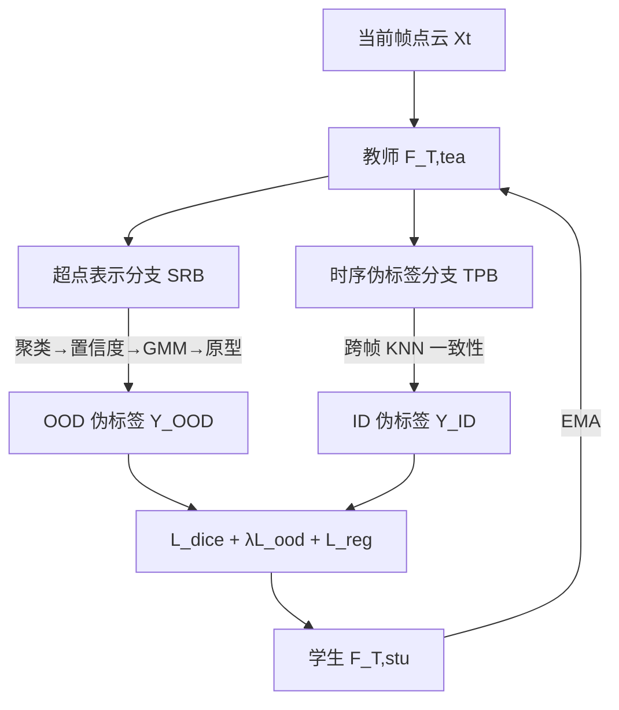

# GOOD: Geometry-guided Out-of-Distribution Modeling for Open-set Test-time Adaptation in Point Cloud Semantic Segmentation

**会议**: ICLR 2026  
**OpenReview**: [https://openreview.net/forum?id=HyNWlZd4iO](https://openreview.net/forum?id=HyNWlZd4iO)  
**代码**: 待确认  
**领域**: 3D 视觉 / 点云语义分割 / 测试时自适应  
**关键词**: 开放集测试时自适应, 点云语义分割, OOD 检测, 超点, 几何先验, mean-teacher  

## 一句话总结
把开放集测试时自适应（OSTTA）从「逐点」搬到「几何连通的超点」粒度上做，用超点纯度+熵的置信度配 GMM 区分 ID/OOD，再加超点 ID 原型纠错，解决 3D 点云里 ID 点压倒性多、OOD 点稀疏甚至缺席导致的严重类别失衡。

## 研究背景与动机
- **领域现状**：测试时自适应（TTA）能在部署阶段用无标注目标数据在线更新模型，缓解协变量漂移。但绝大多数 TTA 只管已知类的分布差异，忽略了**语义漂移**——目标域里冒出训练时没见过的新类别。在自动驾驶这类安全攸关场景里，把未知动态物体（自行车、骑车人）误判成静止植被会引发严重事故。
- **现有痛点**：2D 图像上已有开放集测试时自适应（OSTTA）方法，但直接搬到 3D 点云语义分割效果很差。原因有二：(1) 2D 方法基于**实例级**处理，丢掉了 3D 关键的几何先验和空间关联；(2) 它们普遍假设有**充足的 OOD 样本**来辅助区分 ID/OOD。
- **核心矛盾**：3D 点云里 ID 点（道路、植被、建筑）数量压倒性地多，OOD 点（行人、自行车）极其稀疏甚至整帧缺席。逐点的 OSTTA 方法在这种极端失衡下会把大量 ID 点误判为 OOD，反而拖垮分割性能——实验中 +WCEM 把 FPR95 直接打到 100.0。
- **本文目标**：首次系统研究 3D 点云语义分割的开放集测试时自适应（OSTTA-3DSeg），在严重 ID-OOD 失衡下既能准确分割已知类，又能可靠拒识未知类。
- **核心 idea**：**从点级识别转向超点级识别**。把空间几何上连通的点聚成超点，识别任务从「单个点」变成「超点」，天然缓解了点的数量失衡；再用几何/时序一致性产生可靠的置信度与伪标签。

## 方法详解

### 整体框架
GOOD 建立在 mean-teacher EMA 自训练框架上：教师模型生成伪标签，学生模型据此在线优化，学生再通过 EMA 反向更新教师。教师侧包含两条分支——**超点表示分支（SRB）**负责把点聚成超点并区分 ID/OOD，**时序伪标签分支（TPB）**靠跨帧一致性给 ID 类生成稳定伪标签；外加一个时序特征正则项。三者产生的 OOD 伪标签、ID 伪标签共同驱动 Dice 损失 + OOD 熵损失 + 正则损失完成测试时优化。

### 关键设计

**1. 超点聚类：把失衡从点级降到超点级。** 户外 LiDAR 与室内场景不同，去掉地面后物体往往天然分离，这给「先粗分割再识别」提供了几何依据。GOOD 用三步无学习流程构造超点：先用自车位姿把当前帧和历史帧对齐叠加成更稠密的点云、改善物体结构连续性；再用 RANSAC 估计并去除地面（为应对地面坡度变化，把点云切成小区域分别拟合）；最后对剩余点跑 DBSCAN，它无需预设簇数、能识别任意形状簇且对噪声鲁棒，正好契合复杂户外 LiDAR。聚类后识别任务从 $N$ 个点降到 $K$ 个超点，极端的 ID-OOD 数量失衡被直接拉平。

**2. 超点置信度 + GMM：区分 ID/OOD 超点。** 直觉是 ID 超点内部的几何与时序一致性高于 OOD 超点。先定义**超点纯度** $C^{pur}_k = 1 - \frac{1}{\log C}\sum_{c=1}^{C} P_{k,c}\log P_{k,c}$，其中 $P_{k,c}=\frac{1}{N_k}\sum_{j\in N_k}\hat{y}_{j,c}$ 是超点内 one-hot 标签的归一化分布，衡量超点内类别的同质程度。但当多数点只是「微弱偏好」某类时纯度会失真，于是再引入**超点熵** $C^{ent}_k$——把纯度里的 $\mathbb{1}_c(\arg\max)$ 换成 softmax 的软版本，刻画分布不确定性。最终置信度 $C^{sup}_k = C^{ent}_k \cdot C^{pur}_k$ 在开/闭集间取得平衡。观察到 $C^{sup}_k$ 呈双峰分布，用两分量 GMM $G(x)=\pi(x)\mathcal{N}(x|\mu_{ID},\sigma^2_{ID})+(1-\pi(x))\mathcal{N}(x|\mu_{OOD},\sigma^2_{OOD})$ 建模，大均值分量为 ID、小均值为 OOD，并丢弃中间混杂区，仅把低于 $\mu_{OOD}$ 的判为 OOD、高于 $\mu_{ID}$ 的判为 ID。

**3. 超点 ID 原型：纠正 OOD 缺席时的过分割。** GMM 只用分类器 logit、忽略了嵌入特征，且其「软硬划分」会**强迫每帧都同时含 ID 和 OOD 超点**——当某帧本来没有 OOD 时这会把 ID 区域过度切成 OOD，反伤性能。关键观察是：OOD 超点识别会反复横跳，而 ID 超点更稳定可靠。于是为每个 ID 类维护原型 $\rho^t_c = \frac{1}{N_c}\sum_k z^t_k$（ID 超点嵌入的质心），并用 EMA 增量更新 $\hat{\rho}^t_c = \alpha\hat{\rho}^{t-1}_c + (1-\alpha)\rho^t_c$（$\alpha=0.99$）。再拿被 GMM 判为 OOD 的超点和 ID 原型算余弦相似度纠错：$\hat{s}_k = \text{ID}$ 若 $\text{sim}(z^t_k,\hat{\rho}^t_c)\ge\tau$，否则 OOD。这一步把误判回 ID 的超点救回来，专治 OOD 稀疏/缺席的极端情形。

**4. 时序伪标签 + 特征正则：给 ID 类生成稳定监督。** 已有 TTA-3DSeg 只看单帧给 ID 伪标签，浪费了连续帧上下文。TPB 把当前帧和历史 $w$ 帧都投影到全局坐标系，对每个点用 K-NN 找时序邻域并聚合出邻域标签 $\hat{y}^{t,Ne}_i$（式 4），**只在当前预测与时序邻域预测一致时才赋 ID 伪标签** $\hat{y}^t_{i,ID}=y^{t,Ne}_i\ \text{s.t.}\ \hat{y}^t_i=\hat{y}^{t,Ne}_i$，再从中扣掉与 OOD 伪标签重叠的区域。EMA 师生结构既显式强制点云的时序一致、又隐式稳住模型本身，且不需额外阈值超参。配套的时序正则 $L_{reg}$ 用双向负余弦距离约束相邻帧对应点特征一致。最终目标 $L_{final}=L_{dice}+L_{reg}+\lambda L_{ood}$，其中 OOD 熵损失 $L_{ood}=-\frac{1}{\|S_{OOD}\|}\sum_{x\in S_{OOD}}H(F_{T,stu}(x))$ 监督 OOD 超点。

## 实验关键数据

### 主实验（Synth4D → SemanticKITTI，节选）

| 方法 | mIoU(↑) | AUROC(↑) | FPR95(↓) |
|------|---------|----------|----------|
| Source | 40.26 | 65.80 | 78.39 |
| GIPSO | +2.08 | 64.47 | 80.40 |
| GIPSO+UniEnt | +1.17 | 64.90 | 82.27 |
| GIPSO+WCEM | +2.16 | 53.01 | 100.0 |
| **GIPSO+GOOD** | **+4.88** | **74.76** | **73.30** |
| HGL | +2.90 | 64.40 | 79.82 |
| HGL+WCEM | +3.38 | 59.07 | 100.0 |
| **HGL+GOOD** | **+5.31** | **75.31** | **71.31** |

GOOD 接在 HGL 上相比 HGL 单独使用，mIoU/AUROC/FPR95 分别提升 1.93%、8.99%、7.91%。对比鲜明的是，直接套 2D 的 +UniEnt/+WCEM 普遍把 AUROC 拉低、FPR95 推到 100.0（即所有 ID 点都被误判成 OOD），印证了「逐点 OSTTA 在 3D 失衡下崩溃」的动机。

### 跨数据集泛化（Synth4D → nuScenes，节选）

| 方法 | mIoU(↑) | AUROC(↑) | FPR95(↓) |
|------|---------|----------|----------|
| Source | 35.59 | 60.44 | 76.97 |
| GIPSO | +0.48 | 58.66 | 78.75 |
| GIPSO+WCEM | +1.01 | 57.80 | 83.51 |
| **GIPSO+GOOD** | **+1.67** | **62.95** | **73.25** |
| HGL | +0.51 | 57.67 | 82.01 |
| **HGL+GOOD** | **+2.62** | **62.20** | **74.82** |

在 nuScenes 这种更稀疏的真实数据上，2D OSTTA 方法几乎一致让 AUROC 跌破 baseline，而 GOOD 是唯一同时把 mIoU、AUROC 抬高、FPR95 压低的方法。

### 关键发现
- 即插即用：GOOD 接到 GIPSO 和 HGL 两种 TTA-3DSeg 骨架上都能稳定大幅提升，说明它是与现有 TTA 正交的开放集增强模块。
- 超点粒度是开放集 3D OSTTA 的胜负手——逐点方法的 FPR95 频繁触顶 100.0，而超点方法把它压到 71～73。
- 论文在 SynLiDAR → SemanticKITTI（18 类细粒度）等共四个 benchmark 上验证，结论一致。

## 亮点与洞察
- **问题定义首创**：首次把开放集测试时自适应引入 3D 点云语义分割（OSTTA-3DSeg），并精准点出「ID 压倒性多、OOD 稀疏甚至缺席」这一 3D 独有矛盾，是 2D OSTTA 方法集体失效的根因。
- **粒度迁移的巧思**：把识别任务从点级抬到几何连通的超点级，用纯无学习的「叠帧→去地面→DBSCAN」就把极端类别失衡拉平，简单且不增训练成本。
- **对 GMM 失效模式的针对性补丁**：超点 ID 原型直击「GMM 强迫每帧都有 OOD」的过分割问题，用「ID 比 OOD 稳定」这一经验观察设计纠错，专治 OOD 缺席。

## 局限与展望
- **强依赖可靠自车位姿**：超点叠帧和时序伪标签都假设有可靠的 ego-pose 做对齐，论文也承认位姿有噪声时性能会退化（细节放在附录），这对位姿估计不准的场景是隐患。
- **超参与启发式较多**：RANSAC 子区域划分、DBSCAN 参数、GMM 阈值 $\mu_{ID}/\mu_{OOD}$、原型相似度阈值 $\tau$、EMA 系数等都需经验设定，跨域迁移时鲁棒性待考。
- **仅限户外 LiDAR**：方法立足于「去地面后物体天然分离」的户外假设，室内稠密场景或非 LiDAR 模态未必适用。
- **绝对 AUROC 仍有限**：最好结果 AUROC 约 75，FPR95 约 71，离实际安全部署的开放集可靠性仍有差距。

## 相关工作与启发
- **TTA-3DSeg**：GIPSO 首个面向 3D 分割的 TTA，按置信度排序生成逐类伪标签并用额外网络传播；HGL 用局部-全局伪标签策略平衡精度与效率。GOOD 与它们正交，作为开放集增强即插即用。
- **2D OSTTA**：UniEnt、WCEM 等在图像上做在线 OOD 检测，但实例级处理 + 充足 OOD 假设令其在 3D 失衡下崩溃——本文是反面教材的最佳注脚。
- **OOD 检测**：传统靠置信度度量（MSP、energy）和辅助 OOD 数据，GOOD 把这些思路升级到超点级几何置信度。
- **启发**：对极端类别失衡的开放集问题，「换识别粒度」往往比「调损失/调阈值」更治本；几何先验在 3D 任务里是缓解失衡的免费午餐。

## 评分
- **新颖性**: ⭐⭐⭐⭐ 首次提出并系统求解 OSTTA-3DSeg，超点粒度迁移 + ID 原型纠错的组合切中 3D 开放集的真正痛点。
- **实验充分度**: ⭐⭐⭐⭐ 四个 benchmark、两种骨架、与多种 2D/3D 方法对比，对比 baseline FPR95 触顶的现象很有说服力；但缺更大规模或真实路测数据。
- **写作质量**: ⭐⭐⭐⭐ 动机图清晰、方法分支拆解明确、公式完整，逻辑自洽易读。
- **价值**: ⭐⭐⭐⭐ 自动驾驶安全攸关场景的刚需问题，即插即用属性让其落地门槛低。

<!-- RELATED:START -->

## 相关论文

- [\[ICLR 2026\] Open-Set Semantic Gaussian Splatting SLAM with Expandable Representation](open-set_semantic_gaussian_splatting_slam_with_expandable_representation.md)
- [\[ICLR 2026\] Test-Time Optimization of 3D Point Cloud LLM via Manifold-Aware In-Context Guidance and Refinement](test-time_optimization_of_3d_point_cloud_llm_via_manifold-aware_in-context_guida.md)
- [\[ICLR 2026\] SpaceControl: Introducing Test-Time Spatial Control to 3D Generative Modeling](spacecontrol_introducing_test-time_spatial_control_to_3d_generative_modeling.md)
- [\[ICCV 2025\] A Unified Interpretation of Training-Time Out-of-Distribution Detection](../../ICCV2025/3d_vision/a_unified_interpretation_of_training-time_out-of-distribution_detection.md)
- [\[ICLR 2026\] Generative Human Geometry Distribution](generative_human_geometry_distribution.md)

<!-- RELATED:END -->
