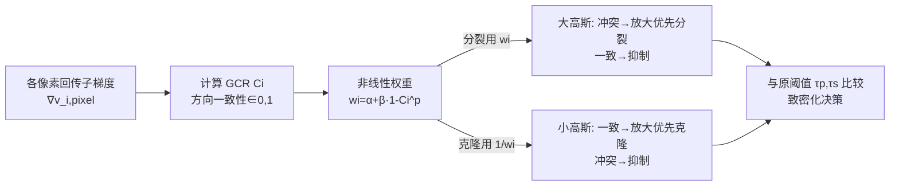

# Gradient-Direction-Aware Density Control for 3D Gaussian Splatting

**会议**: ICLR 2026  
**代码**: https://github.com/zzcqz/GDAGS  
**领域**: 3D 视觉 / 新视角合成 / 3D Gaussian Splatting  
**关键词**: 3D Gaussian Splatting, 自适应密度控制, 梯度方向, 过重建, 过密化, 新视角合成  

## 一句话总结
GDAGS 指出 3DGS 密度控制只看视空间梯度的"模长"而忽略了"方向"，提出梯度一致性比 GCR 与一条非线性动态加权规则，在分裂时优先处理方向冲突的大高斯、在克隆时优先处理方向一致的小高斯，从而同时缓解过重建与过密化，在更省显存的前提下拿到相当或更好的渲染质量。

## 研究背景与动机
**领域现状**：3D Gaussian Splatting（3DGS）用一组可学习的各向异性高斯椭球显式表达场景，配合自适应密度控制（达到梯度阈值就分裂大高斯、克隆小高斯）实现了实时高保真新视角合成，速度比 NeRF 快两个数量级。密度控制是 3DGS 质量的命门。

**现有痛点**：3DGS 的致密化判据只用视空间位置梯度的范数 $\nabla_{\mu_i}L$ 与阈值比较。但范数本身受梯度方向影响——同一个高斯覆盖很多像素，各像素回传的子梯度方向一致时会相互叠加放大范数、方向冲突时会相互抵消缩小范数。这带来两个相反的病症：(1) **过重建**——一个覆盖大片区域的大高斯，因为各像素子梯度方向冲突、合成范数被压到阈值以下而无法分裂，渲染出现局部模糊；(2) **过密化**——方向一致的区域梯度持续被放大，不断触发冗余的分裂/克隆，产生大量多余高斯，显存暴涨。

**核心矛盾**：现有补丁顾此失彼。AbsGS 强行把所有子梯度取绝对值（逼成正向）来消除方向冲突，确实缓解了过重建，但等于无差别放大了噪声/离群区域的梯度，触发大量不必要分裂，把过密化推得更严重；Pixel-GS 用像素覆盖数加权梯度提升空间自适应性，却完全没考虑方向信息，仍会在"梯度大但方向一致"的区域过度致密，显存和帧率代价高。**真正缺的是把"梯度方向"显式拆出来当作决策信号，而不是任凭它隐式扰动范数。**

**本文目标**：设计一个同时把梯度方向与梯度模长纳入致密化判据的密度控制框架，做到——分裂时只对方向冲突（真正欠重建）的大高斯放行、压住方向一致的；克隆时反过来只对方向一致的小高斯放行、压住方向冲突的，从而一并解决过重建与过密化并构建紧凑表达。

**核心 idea**：**先量化方向一致性（GCR），再用一条对方向冲突敏感、对方向一致强抑制的非线性权重去重标定梯度范数，并按分裂/克隆采用相反的加权策略。**

## 方法详解

### 整体框架
GDAGS 不改 3DGS 的高斯参数化与可微光栅化，只替换密度控制中"用什么量去和阈值比较"这一步。三步走：先对每个高斯计算梯度一致性比 GCR，度量它在所有视角各像素子梯度的方向一致程度；再把 GCR 喂进一条非线性动态权重函数得到逐高斯权重；最后用该权重重标定视空间梯度范数，得到新的决策度量去和原阈值比较来决定分裂/克隆。关键在于：分裂用权重 $w_i$、克隆用其倒数 $1/w_i$，让同一套 GCR 在两种操作上产生方向相反的偏好。

### 关键设计

**1. 梯度一致性比 GCR：把方向从模长里剥离出来。** 对每个在 $V$ 个视角被观测到的高斯 $i$，定义 $C_i=\dfrac{\lVert\sum_{\text{pixel}}\nabla^v_{i,\text{pixel}}\rVert_2}{\sum_{\text{pixel}}\lVert\nabla^v_{i,\text{pixel}}\rVert_2+\epsilon}$，其中 $\nabla^v_{i,\text{pixel}}\in\mathbb{R}^2$ 是该高斯在视角 $v$ 投影到每个像素上的子梯度分量。分母是"不分方向、把所有像素梯度模长直接相加"的总活动量，分子是"先矢量求和再取模"的净方向对齐量。由 Cauchy-Schwarz 不等式 $0\le\lVert\sum\nabla\rVert_2\le\sum\lVert\nabla\rVert_2$，$C_i$ 被严格控制在 $[0,1]$，且天然把幅值因素约掉、只反映方向一致性：$C_i\to1$ 表示各像素梯度方向高度一致（叠加放大），$C_i\to0$ 表示方向冲突（相互抵消）。这一步正是把 3DGS 隐式混在范数里的"方向"显式量化出来，作为后续加权的唯一依据。

**2. 非线性动态权重：对方向冲突敏感、对方向一致强抑制。** 直接用 GCR 做线性加权表达力不够——既压不死高一致性高斯的冗余致密化，又对临界方向冲突不够敏感。作者设计 $w_i=\alpha+\beta\cdot(1-C_i)^p$：$\alpha$ 是基础抑制因子（分裂时压方向一致者、克隆时压方向冲突者），$\beta$ 是放大因子，$(1-C_i)^p$ 这条幂律项让权重在 $C_i$ 低（方向冲突）时对 $C_i$ 的变化远比线性敏感，从而把真正需要细分、几何复杂的大高斯精准挑出来放大；而高 $C_i$ 时幂律快速衰减，把已经对齐的高斯权重压到很小，避免无谓分裂/克隆。重标定后的梯度范数 $\tilde\nabla_{\mu_i}L=w_i\cdot\nabla_{\mu_i}L$ 替换原范数进入所有致密化判据。论文实现取 $\alpha=0.8,\ \beta=25,\ p=15$。

**3. 分裂/克隆相反加权：同一信号、两种诉求。** 分裂针对大高斯，直接用 $w_i$：低 GCR（方向冲突，往往是欠重建的大高斯）被放大、优先碎裂以补几何细节，高 GCR 被抑制。克隆针对小高斯，改用倒数策略 $1/w_i$：高 GCR 的克隆能沿梯度方向平滑传播、有效填补结构，被放行；低 GCR 的克隆只会在局部原地堆积、毫无位移意义，被压住。这条"分裂喜冲突、克隆喜一致"的非对称设计，是 GDAGS 能同时按下过重建和过密化两个开关的核心。此外引入超参 $p$（兼任陡度与参与致密化的高斯数量调节），在性能与效率间做间接平衡，敏感性分析显示 $p$ 对渲染质量与显存的影响比 $\beta$ 更大。

## 实验关键数据

数据集：Mip-NeRF360 全部 9 个室内外场景、Tanks&Temples 的 Train/Truck、Deep Blending 的 drJohnson/playroom，共 13 个真实场景；单张 RTX 4090（24GB）；训练设置沿用 3DGS（每 100 次迭代致密化，15k 停止致密化，30k 训完）。

### 主实验表格（Mem 为存储高斯参数的显存）

| 数据集 | 方法 | SSIM↑ | PSNR↑ | LPIPS↓ | Mem↓ |
|---|---|---|---|---|---|
| Mip-NeRF360 | 3DGS | 0.815 | 27.21 | 0.214 | 734MB |
| | Pixel-GS | 0.832 | 27.72 | 0.178 | 1.2GB |
| | AbsGS | 0.820 | 27.49 | 0.191 | 728MB |
| | **GDAGS** | **0.839** | **28.02** | **0.145** | 515MB |
| Tanks&Temples | 3DGS | 0.841 | 23.14 | 0.183 | 411MB |
| | Pixel-GS | 0.853 | 23.74 | 0.150 | 1.05GB |
| | Taming 3DGS | 0.851 | **24.04** | 0.170 | 411MB |
| | **GDAGS** | **0.854** | 23.79 | 0.165 | 226MB |
| Deep Blending | 3DGS | 0.903 | 29.41 | 0.243 | 676MB |
| | AbsGS | 0.902 | 29.67 | 0.236 | 444MB |
| | **GDAGS** | 0.905 | 29.70 | **0.235** | 388MB |

要点：在 Mip-NeRF360 上 GDAGS 三项指标全面第一，LPIPS 从 3DGS 的 0.214 降到 0.145（提升明显），显存比 Pixel-GS 省一半以上（515MB vs 1.2GB）。三套数据集上普遍以 **Pixel-GS 的 20%–50% 显存**拿到相当或更好的质量。

### 消融实验表格（Mip-NeRF360）

| 方法 | SSIM↑ | PSNR↑ | LPIPS↓ | Mem↓ |
|---|---|---|---|---|
| 3DGS | 0.815 | 27.21 | 0.214 | 734MB |
| GDAGS-L（线性权重 $w_i=2-C_i$） | 0.814 | 27.55 | 0.248 | 713MB |
| GDAGS-S（仅分裂加权） | 0.819 | 27.52 | 0.240 | 441MB |
| GDAGS-C（仅克隆加权） | 0.812 | 27.46 | 0.217 | 615MB |
| **GDAGS（完整）** | **0.839** | **28.02** | **0.145** | 515MB |

### 关键发现
- **分裂加权（GDAGS-S）主要提 SSIM/LPIPS 并显著省显存**（734MB→441MB），印证它在压过密化；**克隆加权（GDAGS-C）主要提 PSNR 但显存反增**，因为补结构会多生高斯；二者合一才达到性能与效率的最优平衡。
- **非线性权重明显优于线性版（GDAGS-L）**：线性版 LPIPS 反而恶化到 0.248，说明把方向一致性翻译成控制信号必须用对方向冲突敏感的非线性映射。
- 超参敏感性显示 $p$ 比 $\beta$ 对质量与显存影响更大，是调节"性能-效率"折中的主旋钮。

## 亮点与洞察
- **诊断精准**：把 3DGS 密度控制的两个对立病症（过重建 vs 过密化）统一归因到"判据只用梯度模长、方向被隐式吞掉"，并指出 AbsGS/Pixel-GS 各自的偏科，逻辑闭环漂亮。
- **GCR 设计巧**：用 Cauchy-Schwarz 把方向一致性归一化到 $[0,1]$ 且天然剥离幅值，一个无量纲标量就把"方向"从范数里干净地拆出来，几乎零额外参数。
- **非对称加权**：同一个 GCR，分裂用 $w_i$、克隆用 $1/w_i$，让一套信号服务两个相反诉求，是真正同时按下两个开关的关键，而不是只修一头。
- **省显存是硬卖点**：在质量持平甚至更好的前提下显存大幅低于 Pixel-GS，对落地部署友好。

## 局限与展望
- **GCR 依赖充分梯度信息的假设**：方法明确假定大多数高斯能在多视角各像素获得足够梯度，弱纹理/稀疏观测/遮挡严重区域 GCR 估计可能失真，论文未深入讨论这种退化情形。
- **超参偏多且需调**：$\alpha,\beta,p$ 三个超参（尤其 $p=15$ 偏大）对结果影响显著，跨场景是否稳健、能否自适应未充分验证。
- **质量并非全维度 SOTA**：在 Tanks&Temples/Deep Blending 上 PSNR 略逊于 Taming 3DGS/AbsGS，卖点更偏"质量-显存折中"而非纯质量碾压。
- **逐像素子梯度求 GCR 的额外开销**：训练期对每像素累加子梯度统计带来的计算/显存代价、对训练速度的影响未给出量化。

## 相关工作与启发
- **与 AbsGS 的关系**：AbsGS 把子梯度取绝对值"消方向冲突"，GDAGS 反其道——不消方向而是显式利用方向，证明"保留并区分方向"比"抹平方向"更对症。
- **与 Pixel-GS 的关系**：Pixel-GS 按像素覆盖加权属于"幅值/空间"视角，GDAGS 补上了正交的"方向"视角，二者思路可互补。
- **更广的密度控制谱系**（GOF 复合梯度度量、PixelGS、ReAct-GS 重要性重激活、PSRGS 几何-纹理耦合等）都在改致密化判据；GDAGS 的启发是：**任何基于"梯度范数 vs 阈值"的自适应机制，都值得先问一句方向是否被范数悄悄篡改了。**
- 这种"把被范数/标量隐式吞掉的结构信息显式拆出来再做决策"的思路，可迁移到其它依赖梯度幅值触发的自适应结构（如可变形网格细分、点云上采样、稀疏化剪枝）。

## 评分
- **新颖性**: ⭐⭐⭐⭐ — "梯度方向被范数隐式吞掉"这一诊断与 GCR+非对称非线性加权的解法切口清晰、此前未被显式利用，虽属 3DGS 密度控制的渐进改进但角度新。
- **实验充分度**: ⭐⭐⭐⭐ — 13 场景三数据集、对比 NeRF/3DGS 多类基线、含分裂/克隆/线性三组消融与 $p,\beta$ 敏感性；略欠训练开销量化与弱纹理退化分析。
- **写作质量**: ⭐⭐⭐⭐ — 问题归因、图 1/图 2 的机制示意与公式推导自洽清楚，易读。
- **价值**: ⭐⭐⭐⭐ — 在显著省显存的同时拿到相当或更好质量，对 3DGS 实际部署有直接价值，且方法几乎即插即用。

<!-- RELATED:START -->

## 相关论文

- [\[ECCV 2024\] Pixel-GS: Density Control with Pixel-aware Gradient for 3D Gaussian Splatting](../../ECCV2024/3d_vision/pixel-gs_density_control_with_pixel-aware_gradient_for_3d_gaussian_splatting.md)
- [\[NeurIPS 2025\] DC4GS: Directional Consistency-Driven Adaptive Density Control for 3D Gaussian Splatting](../../NeurIPS2025/3d_vision/dc4gs_directional_consistency-driven_adaptive_density_control_for_3d_gaussian_sp.md)
- [\[ICLR 2026\] Horseshoe Splatting: Handling Structural Sparsity for Uncertainty-Aware Gaussian-Splatting Radiance Field Rendering](horseshoe_splatting_handling_structural_sparsity_for_uncertainty-aware_gaussian-.md)
- [\[ICLR 2026\] From Tokens to Nodes: Semantic-Guided Motion Control for Dynamic 3D Gaussian Splatting](from_tokens_to_nodes_semantic-guided_motion_control_for_dynamic_3d_gaussian_spla.md)
- [\[ICLR 2026\] SMAGA: Secondary Motion-Aware 3D Clothed Gaussian Avatars from Monocular Videos](smaga_secondary_motion-aware_3d_clothed_gaussian_avatars_from_monocular_videos.md)

<!-- RELATED:END -->
