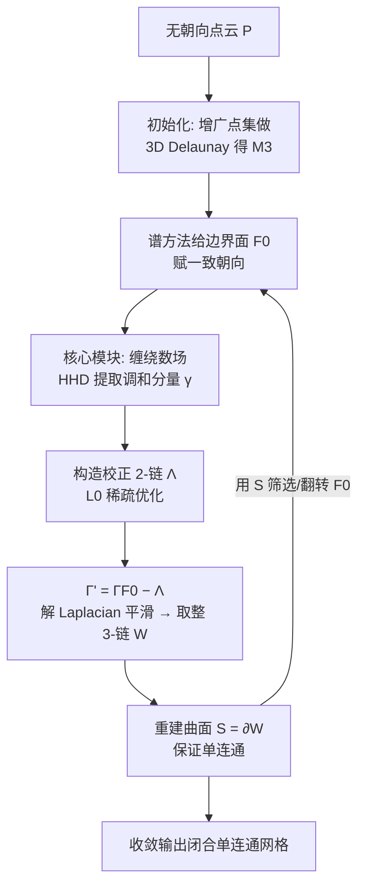

# Guaranteed Simply Connected Mesh Reconstruction from an Unorganized Point Cloud

**会议**: ICLR 2026  
**OpenReview**: [https://openreview.net/forum?id=jjEnTBsffi](https://openreview.net/forum?id=jjEnTBsffi)  
**代码**: 待确认  
**领域**: 3D 视觉 / 表面重建  
**关键词**: 表面重建, 点云, 缠绕数场, Helmholtz-Hodge 分解, 拓扑控制, 单连通  

## 一句话总结
从带噪点云重建闭合三角网格，并通过 Helmholtz-Hodge 分解从代数上**保证**重建曲面单连通（同胚于二维球面），填补了既有方法无法做拓扑控制的空白。

## 研究背景与动机
**领域现状**：从带噪点云重建 3D 网格是计算机图形学的基础问题，已有方法分两类——计算几何方法（Delaunay/Voronoi 类）在干净点云上有理论保证；隐式函数+Marching Cubes 方法（Poisson、DeepSDF、SIREN、IPSR、SAL/SALD）几何保真度强。

**现有痛点**：所有方法都只追求几何贴合，**没有任何方法能保证重建结果的拓扑结构**。在器官、血管这类必须单连通（path-connected 且无非平凡环路）的医学场景里，主流方法会产出多个断开的连通分量和大量虚假"手柄"(spurious handles)——论文 Figure 1 里 CrossSDF 重建肺血管得到了 6 个连通分量。计算几何方法虽有保证但遇到 outlier 就崩，隐式方法则完全不控拓扑。

**核心矛盾**：拓扑约束本质是组合问题（combinatorial），直接在网格上枚举/修复手柄计算代价极高，无法和高保真重建优化统一起来。

**本文目标**：在保持 SOTA 几何精度的同时，**从构造上**（by construction，而非概率或启发式近似）保证输出闭合、单连通、流形的网格，且对 outlier 鲁棒。

**核心 idea**：**把缠绕数场范式从「2D 曲面上的 1D 曲线」推广到「3D 空间中的 2D 曲面」**。关键观察是——曲面的全部拓扑特征都编码在其缠绕数场 1-form 的 HHD（Helmholtz-Hodge 分解）**调和分量** $\gamma$ 中，而 Hodge 同构定理告诉我们调和 1-form 空间严格同构于一阶上同调群 $H^1$（拓扑手柄的代数生成元）。因此**只要用一次线性求解把 $\gamma$ 消掉，就把组合的拓扑约束转化进了高效的线性域**，强制 $H^1$ 平凡即得单连通。

## 方法详解

### 整体框架
方法核心是一个鲁棒模块：输入一个 3D 三角剖分中带朝向的三角面集合，输出一个边界逼近这些输入面、且体积单连通的网格。整条管线分两阶段——**初始化阶段**对点云做 Delaunay 三角剖分并用谱方法赋予初始朝向；**交替重建阶段**反复调用核心模块得到重建，再用重建结果回过头去筛选、翻转输入三角面，从而逐步剔除 outlier，通常 1–4 轮收敛。

### 关键设计

**1. 缠绕数场的 HHD 表示与拓扑提取：把"有没有手柄"变成一次线性分解。** 对一个嵌入 $\mathbb{R}^3$ 的有朝向曲面 $S$，其缠绕数场 $u:\mathbb{R}^3\to\mathbb{Z}_{\ge0}$ 在 $S$ 处跳变、其余分片常值。取离散 1-form $\omega=Du$（顶点标量场经离散梯度映到边上），HHD 把任意 1-form 唯一正交分解为 $\omega=d_0\alpha+\delta_2\beta+\gamma$，其中 $d_0\alpha$ 无旋、$\delta_2\beta$ 无散、调和分量 $\gamma$ 既无旋又无散。$\gamma$ 正是 $\omega$ 的 de Rham 上同调类，同构于域的非平凡一阶同调——它充当输入 $F_0$ 隐式定义的所有非边界 2-cycle 的对偶表示。为了能从输入直接算出 $\gamma$，论文用约化坐标 $u^T_v=(u_0)_v+c^T_v$ 表示场（$c$ 沿四面体路径累积跳变信息），并定义 $\omega_{ij}=\overline{u_i-u_j}+\bar\omega_{ij}$；由于 $\omega$ 与可从输入直接拿到的 $\bar\omega$ 只差一个恰当形 $du$，二者调和分量相同，于是无需知道 $u$ 本身即可提取 $\gamma$。

**2. L0 稀疏校正 2-链：从代数保证落地到鲁棒的离散曲面。** 光有 $\gamma$ 只确定了校正曲面的一个同调类（减去任意 3-链 $W$ 的边界仍是合法解），存在歧义。论文用每四面体势能 $\sigma_T$ 参数化校正链 $\Lambda_{T_1T_2}:=\sigma_{T_1}-\sigma_{T_2}$，在一致性约束 $(D\sigma)_{ij}=\gamma_{ij}$ 下，最小化按面积加权的 $L_0$ 范数 $\min_{\sigma_T}\sum_{f\in F}\mathrm{Area}(f)|\Lambda_f|_0$。选 $L_0$ 而非 Feng et al. 的线性规划有两重考虑：稀疏惩罚在 $F_0$ 含 outlier 时更鲁棒（自然把 outlier 三角面当成稀疏校正去掉），且可用迭代重加权最小二乘（IRLS）高效求解，权重按 $w_{T_1T_2}=\epsilon^2/(\epsilon^2+(\sigma^\star_{T_1}-\sigma^\star_{T_2})^2)$ 反复更新直到收敛，规模上远比解 LP 友好。最终用"干净"2-链 $\Gamma'=\Gamma_{F_0}-\Lambda$ 再解一次 Laplacian $Lw_0=b'$ 平滑，取整得 3-链 $W$，曲面 $S=\partial_3 W$ 作为连通体的边界天然同调于零，**由构造保证单连通**。

**3. 谱方法初始化三角面朝向：把组合定向问题松弛成最小特征向量。** HHD 框架要求输入是一致定向的三角剖分，但无组织点云没有 inside/outside 标签（经典的法向一致定向难题）。论文给每个面 $f\in F_0$ 配指示变量 $x_f\in\{-1,1\}$，把调和分量写成 $\gamma=Ax$，目标是找使 $\gamma$ 消失的朝向 $x$。由于 $x$ 是整数向量、直接最小化 $\|Ax\|$ 不可行，论文松弛为实值并最小化瑞利商 $\frac{\|Ax\|^2}{\|x\|^2}$，其最优解 $x^\star=u_1(A^\top A)$ 即 $A^\top A$ 最小特征值对应的特征向量，再按符号取整为 $\{-1,1\}$。算子 $A=(I-d_0 L^\dagger\delta_1-\delta_2 L_2^\dagger d_1)B$ 由 $\omega=Bx$ 和 HHD 投影组合而成（$L^\dagger$ 为伪逆），用 Lanczos 算法求最小特征向量，每次迭代解六个稀疏线性系统。

**4. 交替重建剔除 outlier：单次优化不够，迭代收紧 inlier 集。** 核心模块输出网格 $M^2$ 后会诱导一个优化后的有朝向面集 $F^\star\subset F$，更新 $F_0\leftarrow F_0\cap F^\star$ 再次调用模块。这个交替过程让校正曲面 $\Lambda$ 逐轮精炼 inlier 集 $F_0$，渐进剔除所有 outlier，直到 $F^\star$ 稳定（典型 1–4 轮）。消融显示单次优化无法识别全部 outlier，交替是处理高 outlier 比例的关键。

工程上，作者把共轭梯度（CG）及其几何多重网格预条件子融进单个持久化 GPU kernel，用 CUTLASS 在 NVIDIA GH200 上优化稀疏矩阵运算，10 万点云上单次求解 Eq.(16) 仅 0.13 毫秒。

## 实验关键数据

### 主实验：3D 医学重建（CrossSDF 基准，6 个模型，Align/NonAlign 两种切片朝向）
指标 CD×100、HD×100、连通分量数 CC（越接近 GT 越好）。

| 方法 | CD（均势） | HD（均势） | CC 是否对 |
|------|-----------|-----------|----------|
| CrossSDF | 较优（最接近竞品） | 较优 | 否（如 Heart 出 68/176 个分量）|
| OReX | 差 | 差 | 否（数百~上千分量）|
| Screened Poisson | 中 | 中 | 否 |
| POCO | 差 | 差 | 否 |
| Neural-IMLS | 差 | 差 | 拓扑次优（部分 NA）|
| **Ours** | **最优** | **最优** | **唯一全部匹配 GT** |

相比最接近的几何竞品 CrossSDF，本文 **CD 降 15.8%、HD 降 9.62%**，且是**唯一**正确重建出 GT 连通分量数的方法（含需先按解剖分割成 3 段的 Coronaries）。

### 合成形状鲁棒性（Stanford Bunny 加噪+outlier，#inliers+#outliers）
对比 Screened Poisson、SALD。

| 方法 | 高 outlier 下 CC | 几何保真 |
|------|-----------------|---------|
| Screened Poisson | 失控（如 1K+200 出 176 分量）| 需干净输入 |
| SALD | 严重失控（数百~两千分量）| 需干净输入 |
| **Ours** | **全场景恒为 1** | 高保真，鲁棒 |

### 消融实验（2D）

| 配置 | 结果 |
|------|------|
| 完整方法 | 正确重建 |
| 去掉初始朝向 | 完全失败，inlier 边被错误剪除且难以恢复 |
| 去掉鲁棒优化（L0→L1） | 出现非光滑伪影 |
| 去掉交替优化 | 单次 pass 无法剔除全部 outlier |

### 关键发现
- 拓扑保证不靠后处理修补，而是由 $S=\partial W$ 的构造天然成立——这是其它方法做不到的根本差异。
- 鲁棒性来自 $L_0$ 稀疏校正：outlier 被当成稀疏修正项自然剔除，因此无需干净输入。
- 三个组件缺一不可：初始朝向给几何正确性兜底、$L_0$ 给鲁棒性、交替给彻底剔噪。

## 亮点与洞察
- **拓扑控制从组合域搬进线性域**：用 Hodge 同构定理把"是否有手柄"等价为"调和 1-form 是否为零"，一次线性求解即可消除，避开了昂贵的组合拓扑修复。这是把纯数学定理直接变成可保证算法的漂亮案例。
- **缠绕数场从 1D 升到 2D 的非平凡推广**：Feng et al. (2023) 处理曲面上曲线，本文推广到 3D 中曲面，并解决了"无组织点云没有定向"这一额外难题（谱方法初始化 + 交替精炼）。
- **保证性 + SOTA 几何精度并存**：以往"有保证"的计算几何方法精度/鲁棒性差，本文证明二者可兼得。
- **算法-系统协同设计**：融合 CG+多重网格的持久化 GPU kernel 使大规模稀疏求解达到亚毫秒级，让迭代框架在实际数据上可用。

## 局限与展望
- **假设 inlier 精确**：inlier 直接作为重建网格顶点，适合 LiDAR/CT 的白噪声或椒盐噪声，但**对高斯噪声不友好**——作者建议改为沿四面体边放置顶点（类 Marching Tetrahedron）并平滑 $w$，作为未来工作。
- **只保证单连通拓扑**：当前框架专注闭合、单连通形状；多分量需先验分割（如 Coronaries 预分 3 段、单连通假设需外部 clustering）。作者计划通过控制 HHD 调和分量 $\gamma$ 来扩展到任意拓扑。
- **依赖谱初始化质量**：消融显示初始朝向错误会导致完全失败且难恢复，谱方法在极端退化情形的稳健性有待考察。
- **生成式延伸**：作者提出可用该可控拓扑表示来学习带拓扑控制的 3D 形状生成模型，是有潜力的方向。

## 相关工作与启发
- **缠绕数场谱系**：Jacobson et al. (2013) 提出缠绕数场，近来被用于法向定向（Xu 2023、Liu 2025）；Feng et al. (2023) 用 HHD 捕捉曲面上曲线拓扑——本文是其在 3D 曲面上的直接推广与升级。
- **无朝向重建**：IPSR（启发本文交替方案）、SAL/SALD 处理无朝向点云但不控拓扑；本文用类 IPSR 的交替机制同时做定向精炼和剔噪。
- **计算几何 vs 隐式**：本文归属计算几何类（从 Delaunay 出发）但靠 $L_0$ 鲁棒优化解决了该类方法对 outlier 敏感的老问题；最相关的 Kolluri et al. (2004) 谱方法不保证单连通。
- **启发**：把"难以直接优化的离散/组合约束"通过合适的代数同构（这里是 Hodge 同构）转化为线性谱问题，是一个可迁移到其它带结构约束重建/生成任务的范式。

## 评分
- **新颖性**: ⭐⭐⭐⭐⭐ 首个从代数构造上保证单连通重建的方法，把缠绕数场从 1D 曲线推广到 3D 曲面并用 Hodge 同构把拓扑约束线性化，思路原创且数学优雅。
- **实验充分度**: ⭐⭐⭐⭐ 真实医学+合成基准、5 个强 baseline、CD/HD/CC 三指标、含 2D 消融与高 outlier 鲁棒性测试，较全面；但消融在 2D 进行、连通分量数较多场景需外部分割略有取巧。
- **写作质量**: ⭐⭐⭐⭐ 数学推导清晰、动机与构造逻辑紧凑、图示到位；HHD/谱构造对非图形学背景读者门槛偏高。
- **价值**: ⭐⭐⭐⭐⭐ 解决器官/血管等医学重建对单连通拓扑的刚需，"保证性"是无可替代的实用价值，并为可控拓扑生成打开方向。

<!-- RELATED:START -->

## 相关论文

- [\[ICLR 2026\] Mesh Splatting for End-to-end Multiview Surface Reconstruction](mesh_splatting_for_end-to-end_multiview_surface_reconstruction.md)
- [\[ICLR 2026\] Spiking Discrepancy Transformer for Point Cloud Analysis](spiking_discrepancy_transformer_for_point_cloud_analysis.md)
- [\[ICLR 2026\] Point-Focused Attention Meets Context-Scan State Space: Robust Biological Visual Perception for Point Cloud Representation](point-focused_attention_meets_context-scan_state_space_robust_biological_visual_.md)
- [\[ICLR 2026\] RayI2P: Learning Rays for Image-to-Point Cloud Registration](rayi2p_learning_rays_for_image-to-point_cloud_registration.md)
- [\[ICLR 2026\] MoGen: Detailed Neuronal Morphology Generation via Point Cloud Flow Matching](mogen_detailed_neuronal_morphology_generation_via_point_cloud_flow_matching.md)

<!-- RELATED:END -->
