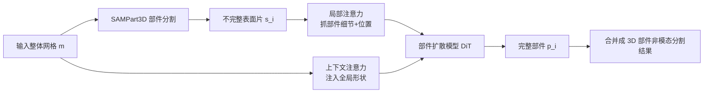

# HoloPart: Generative 3D Part Amodal Segmentation

**会议**: ICLR 2026  
**OpenReview**: [https://openreview.net/forum?id=2VsBJwefDC](https://openreview.net/forum?id=2VsBJwefDC)  
**代码**: 待确认  
**领域**: 3D 视觉 / 3D 生成 / 部件分割  
**关键词**: 3D part amodal segmentation, shape completion, diffusion model, 3D 生成先验, context-aware attention  

## 一句话总结
HoloPart 把 2D 的"非模态分割"(amodal segmentation)概念引入 3D，提出"3D 部件非模态分割"新任务——把一个整体网格拆成**几何完整**的语义部件(而非破碎的表面片)，并用一个带局部注意力 + 全局形状上下文注意力的扩散模型做部件形状补全来实现它。

## 研究背景与动机
- **领域现状**：3D 部件分割(part segmentation)把网格/点云的顶点按语义分组，对 photogrammetry 或 3D 生成模型产出的"一体式"网格特别有用。2D 领域多年来已有大量非模态分割(amodal segmentation)工作去推断被遮挡部分，但 3D 形状上几乎没人做。
- **现有痛点**：现有 3D 部件分割只能切出**表面片(surface patch)**——切出来的部件是破碎、被遮挡截断的，缺了被其他部件挡住的那部分几何。这对感知任务够用，但对内容创作(几何编辑、动画绑定、材质赋予)远远不够，因为这些应用要求每个部件有**完整的实体几何**。
- **核心矛盾**：把非模态思想搬到 3D 有三个非平凡难点同时存在——(1) 推断被遮挡的 3D 几何；(2) 补全后的部件要和整体形状保持几何 + 语义一致；(3) 在部件标注数据极度稀缺的情况下还要泛化到各种物体类别和部件类型。端到端学这个任务很难。
- **本文目标**：正式定义"3D 部件非模态分割"任务，并给出一个实用、有效的解法，把整体形状分解成完整语义部件。
- **核心 idea**：**[解耦两阶段]** 不端到端硬学，而是拆成"已有的部件分割 + 新提的部件形状补全"两阶段；**[借生成先验补遮挡]** 用大规模通用 3D 形状预训练得到强生成先验，再用少量"部件-整体"配对数据微调，让模型不是"填洞"而是依据形状先验生成合理完整几何；**[双注意力平衡局部与全局]** 用局部注意力抓部件细节、上下文注意力注入全局形状信息，保证补全件既精细又和整体一致。

## 方法详解

### 整体框架
HoloPart 是一条两阶段流水线。**第一阶段**用现成的 SAMPart3D 把输入网格 $m$ 切成若干(可能被遮挡的)表面部件片 $\{s_1,\dots,s_n\}$；**第二阶段**(核心贡献)对每个不完整片 $s_i$ 用扩散模型补全成完整部件 $p_i$，要求满足完整性、几何一致性、语义一致性三个约束。补全模型先在 18 万张通用 3D 形状上预训练出生成先验，再用"部件-整体"配对数据微调成"部件扩散模型"，微调时注入两种条件注意力(局部 + 上下文)。

### 关键设计

**1. 对象级预训练 + 整流流扩散：先攒一身 3D 形状先验。** 由于带完整部件标注的 3D 数据极稀缺，作者先在大规模整体形状上预训练一个 3D 生成模型，让它学到可泛化的形状表示和部件间语义对应。几何用 3DShape2VecSet / CLAY 那套 VAE 压缩：编码器把输入点云 $X\in\mathbb{R}^{N\times3}$ 经最远点采样得到 $X_0=\mathrm{FPS}(X)$ 后做交叉注意力编码成隐向量 $z=E(X)=\mathrm{CrossAttn}(\mathrm{PosEmb}(X_0),\mathrm{PosEmb}(X))$，解码器再以查询点 $q$ 预测占据(occupancy)。扩散部分用 DiT 块搭去噪网络 $v_\theta$，采用整流流(Rectified Flow)在压缩隐空间里把高斯噪声映射到 3D 形状分布，前向过程是原形状与噪声的线性插值 $z_t=(1-t)z_0+t\epsilon$，训练目标为流匹配损失 $\mathbb{E}\big[\|v_\theta(z_t,t,g)-(\epsilon-z_0)\|_2^2\big]$，其中 $g$ 是 3D 形状渲染图得到的图像条件特征。这一步给后面的部件补全提供了关键的"形状常识"。

**2. 上下文感知注意力(context-aware attention)：让补全件和整体形状对齐。** 部件补全最大的风险是"各补各的"——单独把某个部件补完整、却和整机的比例/朝向/接缝对不上。为此作者把不完整部件片先和整体形状做交叉注意力来获取上下文：$c_o=\mathcal{C}(S_0,X)=\mathrm{CrossAttn}(\mathrm{PosEmb}(S_0),\mathrm{PosEmb}(X\#\#M))$，其中 $X$ 是整体形状的采样点云、$M$ 是把分割区域高亮出来的二值掩码、$\#\#$ 表示拼接、$S_0$ 是部件片经 FPS 的子采样。这样模型在补全时始终"看得见"整机的全局结构，知道这个部件该长成什么样、接口在哪。论文可视化(图 12)显示：去掉上下文注意力后，各部件缺乏全局引导，补出来的结果互相不一致、质量明显下降。

**3. 局部注意力(local attention):抓部件细节与位置映射。** 光有全局还不够,部件本身的精细几何也得保住。作者把不完整部件片归一化到 $[-1,1]$ 后,再和它自身子采样点云做交叉注意力 $c_l=\mathcal{C}(S_0,S)=\mathrm{CrossAttn}(\mathrm{PosEmb}(S_0),\mathrm{PosEmb}(S))$,让模型既学到局部细节又学到部件在归一化空间里的新位置映射。$c_o$ 和 $c_l$ 两路条件随后通过交叉注意力分别注入部件扩散模型——上下文注意力负责"和整体一致",局部注意力负责"细节够精、位置对",二者互补,这正是把 object 级先验稳稳适配到 part 级补全的关键。

**4. 数据创建流水线:从无标注海量形状里造"部件-整体"配对。** 部件标注稀缺是硬约束。ABO 有部件真值可直接用;Objaverse 80 万模型无部件标注、还混着大量扫描件和低质模型,作者先过滤掉扫描件、按 Mesh Count Restriction / 连通分量分析 / 体积分布优化等规则从中选出 18 万高质量形状。造配对时:先把各组件合并成完整网格,从多角度发射射线判定每个面的可见性、删掉不可见面来模拟遮挡;对非水密网格则算无符号距离场(UDF)再用 marching cubes 得到处理后的网格;对每个独立部件做同样处理得到完整部件网格;最后按最近部件面给整体网格每个面分配标签,得到表面分割掩码 $\{s_i\}$。这条流水线把"补全"问题转成了可大规模自监督训练的形式。

## 实验关键数据

### 主实验(ABO 数据集,3D 部件非模态分割)
对比 PatchComplete(P/C)、DiffComplete(D/C)、Finetune-VAE(F/V)与本文 Ours,指标为 Chamfer Distance↓ / IoU↑ / F1↑ / Success↑(instance mean):

| 方法 | Chamfer ↓ | IoU ↑ | F1 ↑ | Success ↑ |
|---|---|---|---|---|
| PatchComplete | 0.122 | 0.159 | 0.259 | 0.822 |
| DiffComplete | 0.087 | 0.235 | 0.371 | 0.824 |
| Finetune-VAE | 0.037 | 0.565 | 0.689 | 0.976 |
| **Ours (w/o Context-attn)** | 0.036 | 0.733 | 0.816 | 0.987 |
| **Ours (with Context-attn)** | **0.026** | **0.764** | **0.843** | **0.994** |

完整版在所有指标上大幅领先最强基线 DiffComplete(IoU 0.764 vs 0.235、F1 0.843 vs 0.371)。

### 跨数据集泛化(3DCoMPaT++,2.5D mask 输入)

| 方法 | Chamfer ↓ | IoU ↑ | F1 ↑ | Success ↑ |
|---|---|---|---|---|
| PatchComplete | 0.278 | 0.245 | 0.312 | 0.835 |
| DiffComplete | 0.146 | 0.401 | 0.485 | 0.935 |
| SDFusion | 0.255 | 0.246 | 0.321 | 0.884 |
| **Ours** | **0.088** | **0.558** | **0.641** | **0.995** |

### 消融实验(PartObjaverse-Tiny,Chamfer↓,Overall + 部分类别)

| 方法 | Overall | Human | Daily | Buildings | Plants |
|---|---|---|---|---|---|
| Finetune-VAE | 0.064 | 0.064 | 0.075 | 0.064 | 0.049 |
| Ours w/o Local | 0.057 | 0.061 | 0.051 | 0.047 | 0.045 |
| Ours w/o Context | 0.055 | 0.059 | 0.044 | 0.047 | 0.042 |
| **Ours (full)** | **0.034** | **0.034** | **0.032** | **0.032** | **0.029** |

### 关键发现
- **两个注意力都不可或缺**:去掉局部注意力或上下文注意力 Chamfer 都从 0.034 退到 0.055~0.057,完整版在所有类别上最优,验证局部细节与全局一致缺一不可。
- **生成先验 >> 直接补全**:Finetune-VAE(直接拿 VAE 补)已经远好于 PatchComplete/DiffComplete,说明强 3D 生成先验是关键;在此基础上加双注意力又把性能再推一大截。
- **泛化稳健**:在跨域的 3DCoMPaT++ 上以 2.5D mask 输入仍 99.5% 成功率、IoU 0.558,远超基线,显示方法不依赖特定数据分布。

## 亮点与洞察
- **任务定义本身是贡献**:把"非模态分割"这个 2D 成熟概念正式引入 3D,并配两个新基准(ABO、PartObjaverse-Tiny),开了一个有清晰应用价值(几何编辑/动画/材质)的新方向。
- **"补全 = 生成,不是填洞"**:用预训练生成先验 + 少量配对微调,绕开了"端到端学 + 数据稀缺"的死结,是数据受限场景下迁移大模型先验的范式样例。
- **局部 vs 全局的显式解耦**:两路条件注意力分别管"细节精度"和"整体一致",可视化和消融都很干净地证明了各自作用。
- **自监督造数据**:用射线可见性 + UDF/marching cubes 从无标注海量形状里自动造"部件-整体"配对,把标注瓶颈转成工程化流水线。

## 局限与展望
- **依赖输入掩码质量**:HoloPart 的结果受第一阶段表面分割掩码影响,不合理或低质的掩码会导致补全不完整——这是两阶段方案的固有软肋。
- **作者展望**:用 HoloPart 大批量生成"部件感知"的 3D 形状,反过来去训练原生的部件感知生成模型,从而摆脱对外部分割的依赖。
- **(笔者补充)** 当前是逐部件独立补全再合并,部件间接缝/装配一致性主要靠上下文注意力隐式保证,缺少显式的部件间约束;且整体仍是两阶段非端到端,误差会沿流水线累积。

## 相关工作与启发
- **2D 非模态分割**(Ehsani 2018、Kar 2015、Ke 2021、Ozguroglu 2024):本文的思想源头,启发了把"推断被遮挡部分"搬到 3D。
- **3D 形状补全**(PatchComplete、DiffComplete、SDFusion):前作多在补**整个物体**、面对大缺失或复杂部件结构时吃力,也不处理"在整体里补单个部件并保持一致"的问题,正是本文的差异点。
- **3D 生成与表示**(3DShape2VecSet、CLAY、整流流/DiT、SAMPart3D):提供了 VAE 压缩、扩散骨干和分割前端,本文把它们组装并适配到部件补全。
- **启发**:在标注稀缺的子任务上,"大模型生成先验 + 小数据适配 + 任务特定条件注入"是一条通用且高性价比的路线,可迁移到其它需要补全/推断缺失结构的 3D 任务。

## 评分
- **新颖性**: ⭐⭐⭐⭐⭐ 正式提出 3D 部件非模态分割新任务并给出可行解,任务定义 + 方法 + 基准成套,开辟新方向。
- **实验充分度**: ⭐⭐⭐⭐ 两个新基准 + 跨域 3DCoMPaT++ + 完整消融,指标全面领先;但缺与端到端方案的对比、部件间一致性的定量评估。
- **写作质量**: ⭐⭐⭐⭐ 动机—难点—方法—验证逻辑清晰,图示(pipeline、消融可视化)到位,公式表述规范。
- **价值**: ⭐⭐⭐⭐⭐ 直接服务 3D 内容创作(几何编辑、动画、材质),实用性强,且为部件感知生成提供了数据/方法基础。

<!-- RELATED:START -->

## 相关论文

- [\[ICLR 2026\] PartSAM: A Scalable Promptable Part Segmentation Model Trained on Native 3D Data](partsam_a_scalable_promptable_part_segmentation_model_trained_on_native_3d_data.md)
- [\[ECCV 2024\] 3×2: 3D Object Part Segmentation by 2D Semantic Correspondences](../../ECCV2024/3d_vision/3x2_3d_object_part_segmentation_by_2d_semantic_correspondenc.md)
- [\[ICLR 2026\] Part-X-MLLM: Part-aware 3D Multimodal Large Language Model](part-x-mllm_part-aware_3d_multimodal_large_language_model.md)
- [\[CVPR 2026\] GeoSAM2: Unleashing the Power of SAM2 for 3D Part Segmentation](../../CVPR2026/3d_vision/geosam2_unleashing_the_power_of_sam2_for_3d_part_segmentation.md)
- [\[ICLR 2026\] NOVA3R: Non-pixel-aligned Visual Transformer for Amodal 3D Reconstruction](nova3r_non-pixel-aligned_visual_transformer_for_amodal_3d_reconstruction.md)

<!-- RELATED:END -->
