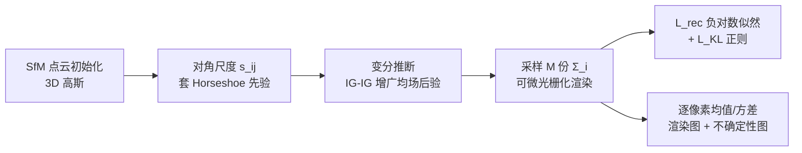

# Horseshoe Splatting: Handling Structural Sparsity for Uncertainty-Aware Gaussian-Splatting Radiance Field Rendering

**会议**: ICLR 2026  
**OpenReview**: [https://openreview.net/forum?id=NHuyk9KsG6](https://openreview.net/forum?id=NHuyk9KsG6)  
**代码**: [https://github.com/HKU-MedAI/Horseshoe-Splatting](https://github.com/HKU-MedAI/Horseshoe-Splatting)  
**领域**: 3D 视觉 / 神经渲染 / 贝叶斯不确定性  
**关键词**: 3D Gaussian Splatting, Horseshoe 先验, 变分推断, 不确定性估计, 结构稀疏  

## 一句话总结
给 3DGS 每个高斯的协方差尺度套上一个全局-局部 Horseshoe 收缩先验，用变分推断把"自动剪掉噪声方向 + 输出像素级不确定性"一并解决，既匹配 SOTA 渲染质量又给出可标定的不确定性图。

## 研究背景与动机
- **领域现状**：NeRF 给出高保真新视角合成但慢，3DGS 用显式各向异性高斯 + 可微光栅化做到了实时高质量渲染，已成主流表示。
- **现有痛点**：主流 3DGS 是**确定性**的，不提供任何置信度，而在稀疏视角、遮挡、分布外内容下置信度恰恰最关键；同时现有管线不显式编码协方差里的**结构稀疏性**（逐轴方差、轴间相关），导致被噪声主导的方向得不到充分正则。
- **核心矛盾**：已有的不确定性变体（语义/后验方差、深度不确定性场、Fisher 信息等）要么开销大、要么只刻画场景层面的歧义，**没有人直接对每个 splat 的协方差结构施加层次先验**——既无法选择性压制虚假方差，也给不出与渲染图像一致的后验不确定性。
- **本文目标**：把贝叶斯推断真正塞进 3DGS，用一个能同时做到"近零强收缩 + 重尾保护"的先验，统一处理协方差结构稀疏和可标定不确定性，且几乎不牺牲速度。
- **核心 idea**：**[结构稀疏先验]** 在协方差的尺度参数上放全局-局部 Horseshoe 先验——其零点尖峰把无关方向激进收缩、重尾保留显著各向异性结构，恰好契合 3DGS 椭圆 footprint 的形成方式；**[变分可解]** 用镜像 Horseshoe 逆 Gamma 增广的因子化变分族拟合，使蒙特卡洛渲染和像素级后验不确定性成为近乎免费的副产品。

## 方法详解

### 整体框架
保留原始 3DGS 表示（位置 $\mu_i$、不透明度 $\alpha_i$、SH 颜色 $c_i$、协方差 $\Sigma_i = R_i S_i S_i^\top R_i^\top$），只把对角尺度矩阵 $S_i=\mathrm{diag}(s_{i1},s_{i2},s_{i3})$ 上的尺度变成随机变量，并施加全局-局部 Horseshoe 先验。训练时用一个镜像逆 Gamma 增广的均场变分后验拟合，损失 = 蒙特卡洛重建负对数似然 + KL 正则；推理时祖先采样若干份尺度、各渲染一遍，逐像素求均值/方差得到渲染图和不确定性图。

### 关键设计

**1. 协方差尺度上的全局-局部 Horseshoe 先验：让收缩"看方向行事"。** 对每个 splat $i$、每个轴 $j$ 的对角尺度 $s_{ij}$，引入轴级全局收缩 $\theta_j$ 与局部收缩 $\lambda_{ij}$，建模为 $s_{ij}\mid\lambda_{ij},\theta_j \sim \mathcal{N}(\beta_{ij},\,\sigma_{ij}^2\theta_j^2\lambda_{ij}^2)$，其中 $\beta_{ij}$ 是可学习均值、$\sigma_{ij}=\mathrm{softplus}(\rho_{ij})$。两个收缩量取半 Cauchy 先验 $\lambda_{ij}\sim C^+(0,1)$、$\theta_j\sim C^+(0,b)$，从而获得 Horseshoe 标志性的"零点尖峰 + 重尾"：尖峰把噪声主导的轴向激进压到接近零（相当于自动剪枝冗余 splat），重尾保证数据支持的强各向异性方向几乎不被收缩。这样做的好处是收缩强度由数据自适应决定，而非全局一刀切——直接呼应了 3DGS 屏幕空间椭圆 footprint 的几何，把"沿无关轴的噪声"和"沿信号轴的尖锐结构"区分对待。

**2. 镜像逆 Gamma 增广的均场变分推断：让贝叶斯推断变得可训练。** 半 Cauchy 先验直接推断不可行，本文借助经典的 IG-IG（逆 Gamma 套逆 Gamma）增广把它展开成 $\lambda_{ij}^2\mid\nu_{ij}\sim\mathrm{IG}(1/2,1/\nu_{ij})$、$\nu_{ij}\sim\mathrm{IG}(1/2,1)$（$\theta_j^2$ 同理），于是整个层次都由共轭友好的逆 Gamma 因子构成。变分族刻意**镜像这一增广结构**，对 $s,\lambda^2,\nu,\theta^2,\xi$ 各取独立因子 $q(s,\dots)=\prod q_{\mathcal{N}}(s_{ij})\prod q_{\mathrm{IG}}(\lambda_{ij}^2)\cdots$。ELBO 中高斯先验项有闭式期望（用到 $\mathbb{E}\log X=\log\beta-\psi(\alpha)$、$\mathbb{E}[1/X]=\alpha/\beta$ 这些逆 Gamma 恒等式），$s_{ij}$ 用重参数化 $s_{ij}=\beta_{ij}+\sigma_{ij}\varepsilon$ 采样，IG 因子之间的 KL 解析、梯度低方差。整体可直接用 SGD 联合优化，无需额外辅助方差网络。

**3. 与重建损失耦合 + 祖先采样的不确定性估计：让"渲染"和"测不确定"共用一条管线。** 总损失把变分目标和 3DGS 重建拼起来：$L_{\text{total}}=L_{\text{rec}}+L_{\text{KL}}$，其中重建项是变分后验下的期望负对数似然 $L_{\text{rec}}\approx-\frac{1}{M}\sum_m\sum_u \ln f_{\mathcal{N}}(I_u\mid \hat I_u^{(m)},\sigma_u^2)$，$\hat I_u^{(m)}$ 用从 $q$ 采样的 $\Sigma_i^{(m)}$ 渲染、$\sigma$ 经 $\sigma=\log(1+e^\rho)$ 重参数；KL 项的先验部分天然充当"自动缩放因子"平衡 Horseshoe 正则强度。训练完成后**不依赖任何额外方差参数**，而是沿 Horseshoe 层次祖先采样：抽 $\theta_j^{2(m)},\lambda_{ij}^{2(m)},\varepsilon_{ij}^{(m)}$，得 $s_{ij}^{(m)}=\beta_{ij}+\sigma_{ij}\theta_j^{(m)}\lambda_{ij}^{(m)}\varepsilon_{ij}^{(m)}$，组装 $\Sigma_i^{(m)}$ 各渲染一遍，逐像素的预测均值/方差/可信区间就给出标定良好的不确定性图，整条流程仍保持 3DGS 的实时性。此外作者还证明了在非线性观测模型 + 局部 Lipschitz 渲染器下，尺度后验以近极小极大速率收缩并经 Lipschitz 传递到图像空间，给"误差与不确定性随数据递减"提供了理论背书。

## 实验关键数据

### 主实验（LF / LLFF 数据集，新视角合成 + 不确定性质量）

| 数据集 | 方法 | PSNR↑ | SSIM↑ | LPIPS↓ | AUSE↓ | NLL↓ |
|---|---|---|---|---|---|---|
| LF | FisherRF | 29.13 | 0.927 | 0.076 | 0.54 | 7.02 |
| LF | Variational 3DGS | 27.39 | 0.914 | 0.101 | 0.26 | -0.30 |
| LF | Ensemble GS (×10) | 27.64 | 0.902 | 0.088 | 0.29 | -0.34 |
| LF | **Horseshoe (Ours)** | **30.05** | **0.947** | **0.064** | **0.25** | **-0.74** |
| LLFF | FisherRF | 25.34 | 0.849 | 0.125 | 0.51 | 7.05 |
| LLFF | Variational 3DGS | 23.97 | 0.806 | 0.172 | 0.32 | 0.23 |
| LLFF | **Horseshoe (Ours)** | **25.86** | **0.864** | **0.110** | 0.31 | **0.14** |

- 深度不确定性（AUSE-MAE，LF）平均 **0.18** 为 SOTA，basket 场景 0.10 较次优提升 23%。
- 推理速度：每视角 **0.03s**，约比 Ensemble GS 快 9×，也快于 FisherRF（0.12s）与 Variational 3DGS（0.06s）。

### 消融实验（先验类型对比）

| 数据集 | 先验 | PSNR↑ | SSIM↑ | AUSE↓ | NLL↓ |
|---|---|---|---|---|---|
| LF | Laplace | 30.04 | 0.942 | 0.37 | 10.58 |
| LF | Gaussian | 30.01 | 0.941 | 0.38 | 9.15 |
| LF | **Horseshoe** | **30.05** | **0.947** | **0.25** | **-0.74** |
| LLFF | Laplace | 25.74 | 0.860 | 0.42 | 8.22 |
| LLFF | **Horseshoe** | **25.86** | **0.864** | **0.31** | **0.14** |

- 三种先验的 PSNR/SSIM 几乎持平，但 Horseshoe 的 AUSE/NLL 大幅领先，说明**重尾 + 零点尖峰才是不确定性标定的关键**，渲染质量并非靠先验拉开。
- 主动视角选择（LLFF，从 10% 视角迭代加到 30%）：Horseshoe 取得 PSNR 26.23 / SSIM 0.87 / LPIPS 0.104，显著优于 FisherRF（23.37）等，验证标定良好的不确定性能挑出最有信息量的视角。

### 关键发现
- 结构稀疏先验能在**不损失视觉保真**的前提下显著改善不确定性标定（NLL 从正值甚至 7+ 降到负值）。
- FisherRF 重建好但不确定性差，因为其基于 Hessian/深度的近似无法很好迁移到 RGB 空间，产生噪声化、无信息的不确定性图。

## 亮点与洞察
- **把统计学的 Horseshoe 收缩先验"搬"到 3DGS 协方差尺度上**，是个干净且贴合几何的 idea：屏幕空间椭圆 footprint 天然适合逐轴稀疏建模。
- 不确定性是变分推断的**免费副产品**而非外挂模块，祖先采样复用同一渲染器，既不加辅助网络也不破坏实时性。
- 有理论保证（尺度后验近极小极大收缩 + 经 Lipschitz 传到图像空间），把经验方法和统计理论接上。
- 消融把"渲染质量"和"不确定性标定"解耦得很清楚：先验主要影响后者。

## 局限与展望
- 仅在 LF（8 场景）和 LLFF（8 前向场景）这类**相对小规模、稀疏视角**的数据集上验证，缺少大规模无界场景（如 Mip-NeRF 360）和动态场景的考察。
- Horseshoe 只放在**对角尺度**上（文中提到可扩展到低秩成对分量但未充分展开），轴间相关的结构稀疏建模仍偏轻。
- 蒙特卡洛仅用 10 个样本，渲染速度虽快但不确定性精度与样本数的权衡未系统分析。
- 理论分析依赖局部线性化、局部 Lipschitz 等假设，与真实可微光栅化的差距值得进一步刻画。

## 相关工作与启发
- **NeRF / 3DGS 新视角合成**：从 NeRF 的隐式体函数到 3DGS 的显式各向异性高斯 + 可微光栅化，本文站在 3DGS 之上扩展。
- **渲染不确定性估计**：NeRF 侧有贝叶斯（S-NeRF）、后验（Bayes' Ray）、归一化流（CF-NeRF）、集成等；3DGS 侧有 FisherRF（Fisher 信息）、Variational 3DGS、Ensemble GS——本文区别在于直接对协方差结构施加层次先验。
- **收缩先验稀疏化**：全局-局部收缩家族（Horseshoe 为代表）以"零点尖峰 + 重尾"实现自适应稀疏，本文首次把它系统用于 3DGS 的稀疏性问题。
- **启发**：把成熟的贝叶斯收缩工具迁移到显式 3D 表示，是"统一稀疏正则 + 不确定性"的一条通用思路，可推广到点云、网格等其他显式表示的参数收缩。

## 评分
- **新颖性**: ⭐⭐⭐⭐ 把 Horseshoe 全局-局部收缩先验首次系统引入 3DGS 协方差尺度，角度新颖且贴合几何，配套理论分析。
- **实验充分度**: ⭐⭐⭐ 在新视角合成、不确定性标定、主动视角选择、推理速度多维度验证且消融清晰，但数据集规模偏小、缺无界/动态场景。
- **写作质量**: ⭐⭐⭐⭐ 动机—方法—理论—实验逻辑顺畅，公式与框架图到位，先验消融把质量与标定解耦讲得明白。
- **价值**: ⭐⭐⭐⭐ 在几乎不牺牲速度和保真的前提下给 3DGS 提供可标定不确定性，对主动学习、机器人建图等下游有实用价值。

<!-- RELATED:START -->

## 相关论文

- [\[ICLR 2026\] Augmented Radiance Field: A General Framework for Enhanced Gaussian Splatting](augmented_radiance_field_a_general_framework_for_enhanced_gaussian_splatting.md)
- [\[CVPR 2025\] 3D Convex Splatting: Radiance Field Rendering with 3D Smooth Convexes](../../CVPR2025/3d_vision/3d_convex_splatting_radiance_field_rendering_with_3d_smooth_convexes.md)
- [\[ICLR 2026\] Uncertainty-Aware 3D Reconstruction for Dynamic Underwater Scenes](uncertainty-aware_3d_reconstruction_for_dynamic_underwater_scenes.md)
- [\[ICLR 2026\] Gradient-Direction-Aware Density Control for 3D Gaussian Splatting](gradient-direction-aware_density_control_for_3d_gaussian_splatting.md)
- [\[ICLR 2026\] Station2Radar: Query-Conditioned Gaussian Splatting for Precipitation Field](station2radar_query_conditioned_gaussian_splatting_for_precipitation_field.md)

<!-- RELATED:END -->
