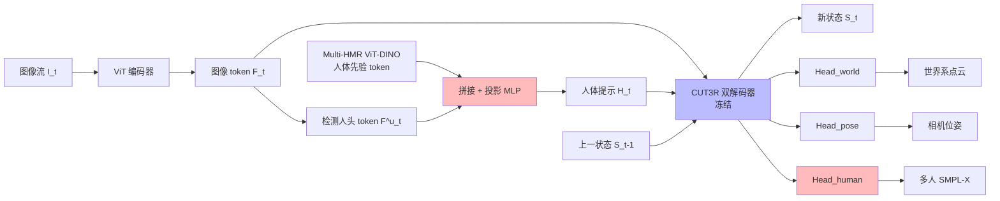

# Human3R: Everyone Everywhere All at Once

**会议**: ICLR 2026  
**OpenReview**: [https://openreview.net/forum?id=y7duXr0JXF](https://openreview.net/forum?id=y7duXr0JXF)  
**代码**: [fanegg.github.io/Human3R](https://fanegg.github.io/Human3R)  
**领域**: 3D 视觉 / 人体-场景 4D 重建  
**关键词**: 人体网格恢复, 全局人体运动估计, 4D 重建基础模型, CUT3R, 视觉提示微调, 在线前馈重建  

## 一句话总结
Human3R 把在线 4D 重建基础模型 CUT3R 冻住、只用视觉提示微调插入「人体提示」，就能在单次前馈中同时吐出多人 SMPL-X 网格（everyone）、稠密场景点云（everywhere）和相机轨迹（all-at-once），15 FPS、8 GB 显存、单卡一天训练即达 SOTA。

## 研究背景与动机
- **领域现状**：从单目视频在世界坐标系里重建「全局人体运动 + 周围 3D 场景 + 相机轨迹」是 AR/VR、具身导航、人形策略学习的基础需求。已有路线要么靠学习到的运动先验直接估全局人体运动，要么用 SLAM 估全局相机再把 HMR 恢复的局部人体网格变换到世界系；近期工作进一步尝试联合重建人、场景、相机。
- **现有痛点**：主流管线是**多阶段/多模型/多次裁剪**——先分别重建场景和人，再在接触约束下迭代优化，整条流程动辄数小时；多人场景还得先跑现成的人体检测+跟踪把每个人裁出来再喂单人回归器，速度随人数线性退化。此外严重依赖一堆现成模块（度量深度估计、通用 3D 重建拿点云、相机位姿/内参），阻碍实时在线、端到端学习和长序列扩展。
- **核心矛盾**：要做这样一个统一模型，最缺的就是**带可靠标注（全局人体运动+3D 场景+相机位姿）的大规模视频数据**——真实数据集规模小，合成数据集（如 BEDLAM）场景变化又有限。从零训练既没数据也没算力。
- **本文目标**：用**一个模型、一个阶段、一次前馈、一卡一天**的代价，从随手拍的单目视频在线恢复多人世界坐标系网格 + 稠密场景 + 相机，彻底去掉检测/跟踪/深度/SLAM/迭代优化等重依赖。
- **核心 idea**：**复用 4D 重建基础模型的强时空先验，最小化微调读出人体**。CUT3R 已经在大规模点云上学到了既懂场景（everywhere）又懂人（everyone）的持久状态先验；Human3R 不去显式从点云里抠人，而是**冻结整个 CUT3R 骨干、用视觉提示微调（VPT）只插入少量人体相关参数**，直接把多人 SMPL-X 从状态里读出来，从而既省数据又省参数。

## 方法详解

### 整体框架
在每个时刻 $t$，给定输入图像 $I_t$，模型要同时估计：多人 SMPL-X 网格 $\{M^n_t\}$（世界系，每个 10,475 顶点）、相机外参 $T_t$ 与内参 $C_t$、规范点云 $X_t$。Human3R 建立在 CUT3R 之上：图像经 ViT tokenizer 编码为图像 token，与一个固定大小的**持久状态** $S_{t-1}$ 双向交互、增量更新出 $S_t$，并由稠密预测头读出相机系/世界系点云、由 MLP 读出相机位姿。Human3R 在此之上检测「人头 token」、拼接来自 Multi-HMR 的人体先验、投影成**人体提示（human prompt）**插入解码器输入空间，让其自注意图像 token 聚合全身信息、交叉注意场景状态获得场景感知，最后由人体头读出 SMPL-X 参数。全流程只微调人体相关层，其余全部冻结。

### 关键设计

**1. 把「人头 token」当作判别性人体查询的视觉提示微调（VPT）**：标准 VPT 是往输入空间塞随机初始化的可学 token，信息量低。Human3R 的关键改造是**用检测到的人头 token 作为提示来源**——头是人体上最具判别性的关键点。对每个 patch $(i,j)$，用一个 MLP+sigmoid 算置信度 $s_{i,j}=\sigma(\mathrm{MLP_{head}}(F_{i,j}))$，按阈值 $\tau$ 收集头 token，再经投影 MLP 变成人体提示 $H_t$ 插入解码器：

$$H_t = \mathrm{Head_{projection}}(F^u_t), \quad [F'_t, z'_t, H'_t], S_t = \mathrm{Decoders}([F_t, z, H_t], S_{t-1}), \quad Y_t = \mathrm{Head_{human}}(H'_t)$$

其中只有投影 MLP 和人体 MLP 可学，解码器全冻。这些人体提示作为「人体 ID 查询」：自注意图像 token 聚合全身空间信息、交叉注意场景状态从 3D 场景上下文里取出时序一致的 SMPL-X 参数。这样既不破坏 CUT3R 的时空先验，又让人体估计天然带场景感知——文中还发现微调后**场景重建反而更好**，印证人-场景联合推理的互利。

**2. 注入 Multi-HMR 人体先验弥补场景模型的「人体盲区」**：CUT3R 在场景为主的数据上训练，缺细粒度人体先验，直接读出来的姿态/体型不够准。于是再挂一个**冻结的 Multi-HMR ViT-DINO 编码器**（它在人体数据上充分微调过 DINO），用同样的索引 $\{u\}^n$ 取出对应位置的人体特征 $F^u_{HMR}$，与 CUT3R 头 token 沿通道拼接后再投影：$H = \mathrm{Head_{projection}}(F^u \oplus F^u_{HMR})$。这相当于把「懂场景的状态」和「懂人的先验」在 token 层面缝合，消融显示去掉先验后 W-MPJPE 从 268 暴涨到 808。

**3. 训练-free 的人体分割与跟踪**：分割上对每个 token 过 MLP+sigmoid+pixel-shuffle 生成像素对齐的人体掩码；跟踪则把精炼后的人体 token $H'$（同时编码身份与参数）当判别特征做**特征匹配**——维护一个人体 token tracklet 记忆库，用 pairwise L2 距离 $D_{m,n}=\|H'_m - H'_n\|_2$ 构造代价矩阵，加 dustbin 行列处理未匹配项，再用 Sinkhorn 算法解最优传输得到软分配矩阵。整套跟踪不需额外训练。

**4. 测试时序列长度自适应（TTT3R + 状态重置）**：模型只用 4 帧序列训练，但 RNN 式状态在长序列上会遗忘早期帧导致性能崩。Human3R 引入 TTT3R，把状态 $S$ 当「快权重」用梯度下降在线更新 $S_t = S_{t-1} - \beta_t \nabla(S_{t-1}, F_t, z, H_t)$，用注意力值的空间平均作为闭式更新规则做在线联想召回；并进一步提出**每 100 帧重置一次状态**、用全局相机位姿作线索对齐各块，从而把上千帧的长序列稳住（消融里 TTT3R 让 W-MPJPE 从 292 降到 268）。

## 实验关键数据

### 主实验表格

局部人体网格恢复（3DPW / EMDB-1，mm，越低越好）：

| 类别 | 方法 | 免裁剪 | 免检测 | 免内参 | 3DPW PA-MPJPE | EMDB-1 MPJPE | EMDB-1 PVE |
|------|------|:---:|:---:|:---:|:---:|:---:|:---:|
| 多阶段 | NLF | ✗ | ✗ | ✗ | 37.3 | 69.6 | 82.4 |
| 多阶段 | PromptHMR | ✓ | ✗ | ✗ | 36.6 | 71.7 | 84.5 |
| 一阶段 | BEV | ✓ | ✓ | ✓ | 46.9 | 112.2 | 133.4 |
| 一阶段 | Multi-HMR | ✓ | ✓ | ✗ | 45.9 | 81.6 | 95.7 |
| 一阶段 | **Human3R** | ✓ | ✓ | ✓ | **44.1** | **73.9** | **86.0** |

在同为「免裁剪+免检测+免内参」的一阶段设定下全面超过 BEV/Multi-HMR，EMDB-1 上 MPJPE/PVE 约 10% 提升。

全局人体运动估计（EMDB-2 / RICH，mm 与 %）：

| 设定 | 方法 | EMDB-2 W-MPJPE ↓ | EMDB-2 RTE ↓ | RICH W-MPJPE ↓ | RICH RTE ↓ |
|------|------|:---:|:---:|:---:|:---:|
| 离线 | JOSH | 174.7 | 1.3 | 132.5 | 3.0 |
| 在线 | WHAM | 354.8 | 6.0 | 196.1 | 4.5 |
| 在线 | JOSH3R | 661.7 | 13.1 | - | - |
| 在线 | **Human3R** | **267.9** | **2.2** | **184.9** | **3.3** |

相比同为在线的 WHAM，EMDB-2 上 W-MPJPE 降约 20%、RTE 降约 60%，且 Human3R 是唯一同时输出场景几何 + 相机位姿的方法。

### 消融实验表格

EMDB-2 上各组件消融（W-MPJPE / RTE）：

| 配置 | WA-MPJPE ↓ | W-MPJPE ↓ | RTE ↓ |
|------|:---:|:---:|:---:|
| Human3R w/o Prior（去人体先验） | 221.2 | 808.4 | 2.2 |
| Human3R w/ ViT-L/896（完整） | 112.2 | 267.9 | 2.2 |
| Naive（CUT3R+Multi-HMR）w/ TTT3R | 401.3 | 1173.9 | 12.2 |
| Human3R w/o TTT3R | 124.3 | 292.3 | 2.5 |
| Human3R w/ TTT3R | 112.2 | 267.9 | 2.2 |

人体先验是命门（去掉后 W-MPJPE 翻 3 倍）；TTT3R 锦上添花；而朴素拼接 CUT3R+Multi-HMR 远不如 Human3R 的提示微调式融合。

### 关键发现
- **效率惊人**：在 BEDLAM 上单卡 48GB GPU 训一天即达 SOTA，推理 15 FPS（RTX 4090）、8 GB 显存，线性复杂度，支持上千帧（远超 4 帧训练长度）。
- **互利**：为人体重建微调后，相机位姿（TUM-D）和度量深度（Bonn）也比原 CUT3R/TTT3R 更准，证明人-场景联合推理双赢。
- **内参鲁棒**：Multi-HMR 对图像长宽比敏感，Human3R 借助度量尺度场景上下文在无内参时也稳定，能从任意网图恢复一致 3D 人体。
- **拥挤泛化**：仅用 1-10 人合成数据训练，却能在 >10 人真实拥挤场景下一次前馈重建（bottom-up，速度与人数无关）。

## 亮点与洞察
- **「读出」而非「分离」的范式转换**：不把人从场景点云里抠出来，而是把 4D 基础模型的持久状态当成一个既懂场景又懂人的隐空间，用提示直接读多人 SMPL-X——这把「检测→裁剪→单人回归→对齐」的多阶段管线整体折叠成一次前馈。
- **VPT 的精妙改造**：用语义明确的「人头 token」替代随机可学 token 作提示来源，既给了空间锚点又零额外检测器，是冻结大模型做下游结构化输出的优雅范式。
- **冻结基础模型 + 极小微调**的数据/参数效率，对「没有大规模标注 4D 数据」这一根本约束给出了务实解法。

## 局限与展望
- **依赖头部可见**：以头作判别关键点，头被遮挡或多人共占同一头 token 时会失败；可引入像素对齐的身体点定位器缓解。
- **只重建裸 SMPL 代理**：不建模衣物/外观；未来可用锚定在 SMPL 上的 3DGS 做更完整的外观重建。
- **在线精度上限**：作为实时在线方法，精度仍可作为优化式方法的初始化进一步提升（以算力换精度）。
- **可扩展到其他动态实体**：同样的时空线索原则可推广到动物、车辆等带 6D 姿态的运动物体。

## 相关工作与启发
- **基础模型**：CUT3R（递归 4D 重建）是骨干，TTT3R 提供测试时状态更新，Multi-HMR 提供 bottom-up 多人先验，SMPL-X 是人体表示——本文本质是把这几块用「提示微调」缝成一个统一前馈系统。
- **对比 JOSH3R/JOSH**：JOSH3R 虽也在线联合输出人-场景-相机，但仍依赖相机系人体网格、检测、分割，且精度掉一半；Human3R 把这些依赖全部去掉。
- **启发**：当某任务缺大规模标注数据时，与其从头训，不如找一个已编码相关先验的基础模型、冻结它、用结构化提示读出目标输出——这套「最小微调读出」思路可迁移到其他「在大模型隐状态里读结构化估计」的任务。

## 评分
- **新颖性**: ⭐⭐⭐⭐⭐ 用 VPT + 人头 token 提示把 4D 基础模型「读」成多人世界系网格 + 场景 + 相机的统一前馈，范式新颖且优雅。
- **实验充分度**: ⭐⭐⭐⭐ 覆盖局部/全局人体、相机位姿、视频深度四类任务与拥挤泛化、内参鲁棒等分析，消融到位；拥挤场景仅定性、缺多人量化基准是客观短板。
- **写作质量**: ⭐⭐⭐⭐⭐ everyone/everywhere/all-at-once 主线清晰，方法图与公式配合好，动机与互利论证有说服力。
- **价值**: ⭐⭐⭐⭐⭐ 15 FPS/8 GB/单卡一天的极致效率 + SOTA 性能，作为简单强基线对 AR/VR、具身导航、人形策略学习有直接落地价值。

<!-- RELATED:START -->

## 相关论文

- [\[ECCV 2024\] Track Everything Everywhere Fast and Robustly](../../ECCV2024/3d_vision/track_everything_everywhere_fast_and_robustly.md)
- [\[NeurIPS 2025\] Every Camera Effect, Every Time, All at Once: 4D Gaussian Ray Tracing for Physics-based Camera Effect Data Generation](../../NeurIPS2025/3d_vision/every_camera_effect_every_time_all_at_once_4d_gaussian_ray_tracing_for_physics-b.md)
- [\[ICLR 2026\] All That Glitters Is Not Gold: Key-Secured 3D Secrets within 3D Gaussian Splatting](all_that_glitters_is_not_gold_key-secured_3d_secrets_within_3d_gaussian_splattin.md)
- [\[CVPR 2026\] Random Wins All: Rethinking Grouping Strategies for Vision Tokens](../../CVPR2026/3d_vision/random_wins_all_rethinking_grouping_strategies_for_vision_tokens.md)
- [\[CVPR 2025\] One Diffusion to Generate Them All](../../CVPR2025/3d_vision/one_diffusion_to_generate_them_all.md)

<!-- RELATED:END -->
