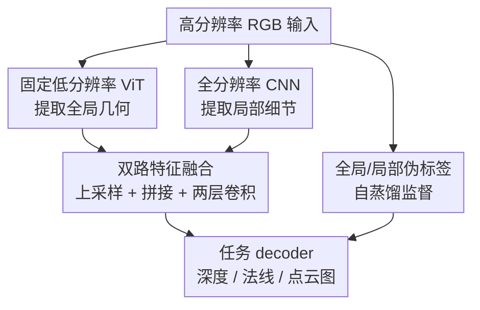

# Hyden: A Hybrid Dual-Path Encoder for Monocular Geometry of High-resolution Images

**会议**: ICLR2026  
**OpenReview**: [https://openreview.net/forum?id=2eL6yXLCh8](https://openreview.net/forum?id=2eL6yXLCh8)  
**代码**: 无  
**领域**: 3D视觉  
**关键词**: 单目几何估计, 高分辨率深度, 点云图, 表面法线, 自蒸馏

## 一句话总结
Hyden 用低分辨率 ViT 抓全局几何、全分辨率 CNN 补局部细节，并通过全图与局部裁剪伪标签自蒸馏，把 DepthAnything-v2 和 MoGe2 这类单目几何模型升级到高分辨率输入下更快、更锐利、更准确的版本。

## 研究背景与动机
**领域现状**：单目几何估计已经从传统的单数据集训练，发展到 MiDaS、DepthAnything、Metric3D、MoGe2 这类零样本几何基础模型。它们能从一张 RGB 图像预测相对深度、度量深度、点云图或表面法线，在机器人、自动驾驶、AR/MR 和三维重建里都是底层能力。

**现有痛点**：这些模型多数在 $518 \times 518$ 或类似低分辨率上训练和推理。面对 2K、4K 甚至更高分辨率图像时，直接缩小输入会抹掉细边界、薄结构和纹理转折；直接把 ViT 推到全分辨率又会让 token 数暴涨，计算量和显存都难以承受。另一类 patch / tile 方法虽然保留局部细节，但需要多次裁剪、融合和边界修补，容易慢，也容易产生块状伪影。

**核心矛盾**：高分辨率几何需要同时满足两件事：一方面要有全局上下文，否则局部纹理很容易被解释错；另一方面要保留原图像素级细节，否则边界和局部曲面会变钝。纯 ViT 全分辨率推理太贵，纯低分辨率推理又丢细节，现成高分辨率真值监督也稀缺，这就是本文要处理的三重约束。

**本文目标**：作者希望把已有强教师模型，例如 DepthAnything-v2 和 MoGe2，变成适合高分辨率输入的学生模型。目标不是重新发明一个全新几何头，而是保留教师模型的全局几何能力，同时在原始分辨率上恢复更清晰的深度边界、法线变化和点云细节，并显著降低 2K / 4K 推理延迟。

**切入角度**：论文观察到 CNN 的卷积计算随图像面积近似线性增长，而 ViT 的注意力计算对 token 数更敏感。于是把二者分工：ViT 只看固定低分辨率图像，负责场景级几何关系；CNN 直接看原图，负责高频边缘和局部纹理。监督上则利用已有模型自己给未标注高分辨率图片生成伪标签，用全图伪标签保几何一致性，用局部裁剪伪标签补细节。

**核心 idea**：用“固定低分辨率 ViT + 全分辨率 CNN”的双路编码器替代原模型编码器，并用全局/局部双伪标签自蒸馏，让单目几何模型在多百万像素输入上同时保住全局准确性、局部锐度和推理速度。

## 方法详解

### 整体框架
Hyden 的输入是一张高分辨率 RGB 图像，输出可以是相对深度、度量点云图或表面法线，具体取决于接到哪个下游 decoder。它把编码器拆成两条路径：低分辨率 ViT 分支接收缩放到 $S \times S$ 的整图，$S=518$，高分辨率 CNN 分支接收原图；随后把 ViT 特征上采样到 CNN 特征尺度，与 CNN 特征拼接并通过轻量融合层，最后送入 DepthAnything-v2 或 MoGe2 的任务 decoder。

训练时，作者不需要真实高分辨率深度或法线标注，而是用冻结教师模型 $T$ 给未标注高分辨率图像生成两类伪标签。全图缩放到 $518 \times 518$ 得到 global pseudo-label，保证整体几何尺度和场景结构；多个 $518 \times 518$ 局部 crop 得到 local pseudo-label，再映射回原图区域，提供更锐利的边界监督。学生模型只训练 CNN 分支、特征融合层和 decoder，ViT 分支保持冻结。

这张图里真正的贡献节点是三块：固定低分辨率 ViT 与全分辨率 CNN 的分工，双路特征融合，以及全局/局部伪标签自蒸馏。输入、输出和任务 decoder 是承接已有模型的脚手架，本文的重点在于如何让已有 decoder 得到既有全局语义又有原图细节的特征。

### 关键设计
**1. 双路编码：把全局几何和局部细节交给不同计算路径**

高分辨率单目几何最容易卡在“看全图太贵、只看局部又不准”这件事上。Hyden 的 ViT 分支始终只处理统一缩放到 $518 \times 518$ 的整图，因此注意力计算不会随着输入从 2K 增到 4K 而爆炸；这个分支保留来自 DepthAnything-v2 或 MoGe2 等强模型的全局表示，负责判断房间结构、道路消失点、物体前后关系这类需要大感受野的几何信息。

CNN 分支则直接吃原始分辨率图像，用 ResNet-like 的层级下采样结构提取边缘、纹理和局部形状变化。卷积的开销随像素数线性增长，虽然图像越大仍然更贵，但比把所有高分辨率 patch 都送进 ViT 更可控。这样一来，Hyden 不是简单地“加一个 refinement head”，而是在编码阶段就让全局上下文和局部高频信息各走适合自己的路径。

**2. 轻量融合：用上采样后的 ViT 特征给 CNN 细节补全局参照**

两条路径如果只在 decoder 末端相加，很容易出现一个问题：CNN 看见细节但不知道这些细节属于哪个整体结构，ViT 知道整体但空间分辨率太粗。Hyden 的做法是把目标 ViT feature map 通过双线性插值上采样到对应 CNN 特征尺度，再与 CNN feature map 拼接，经过两层轻量卷积融合。实验里，两层 CNN fusion 比 MLP fusion 或单层 CNN fusion 更好，说明这里确实需要一点局部空间混合，而不是只做通道投影。

这个融合逻辑会根据基模型略微调整。DepthAnything-v2 使用多个中间 ViT 特征，因此 Hyden 在对应层级分别融合 CNN 特征；MoGe2 使用聚合后的 ViT 特征，因此 Hyden 先把多尺度 CNN 特征上采样并拼接成聚合 CNN 表示，再与聚合 ViT 表示融合。对于全局级特征，论文还会对 CNN map 做 average pooling，并与 ViT 的 CLS token 拼接，保证 decoder 需要的全局向量也能获得高分辨率路径的信息。

**3. 全局/局部自蒸馏：用同一个教师同时提供结构正确性和边界锐度**

高分辨率真实监督难拿，尤其是密集深度、点云图和表面法线很容易稀疏、噪声大或只覆盖特定设备域。Hyden 选择用已有强模型生成伪标签，但不是只对整图低分辨率预测做蒸馏。对一张高分辨率图像 $I \in \mathbb{R}^{H \times W \times 3}$，教师模型先在缩放后的整图上产生 $y_g^T = T(\downarrow_S(I))$，这类标签保留场景整体布局；再对第 $k$ 个高分辨率裁剪区域 $\Omega_k$ 取 $518 \times 518$ resize crop，得到 $y_k^T = T(\mathrm{rcrop}_k(I))$，这类标签保留局部边缘和小物体结构。

训练学生 $F_\theta$ 时，global loss 把学生原生分辨率输出 $y=F_\theta(I)$ 下采样到 $S \times S$ 后与 $y_g^T$ 比较；local crop loss 则把每个 crop 的教师标签注入回原图区域 $\Omega_k$，只在对应 mask 上约束学生的高分辨率预测。这样，全局监督不会因为局部 crop 的尺度/偏移差异而破坏整体几何，局部监督也不会因为整图下采样而丢掉锐利边界。

**4. 冻结 ViT、只训练新增路径：把高分辨率能力作为可插拔升级而不是重训大模型**

Hyden 的训练策略很克制：ViT 分支冻结，只优化 CNN encoder、fusion layer 和任务 decoder。原因是 ViT 仍然看到与教师一致的低分辨率输入，它承担的全局语义角色没有变；真正新增的是原图细节路径和融合方式。这样做降低了训练不稳定性，也让 Hyden 可以比较自然地接到不同基模型上。

论文用同一思路分别构建 Hyden-DA2 和 Hyden-MoGe2。前者面向相对深度，后者同时覆盖表面法线、度量深度和 metric point map。额外 CNN encoder 只增加约 10M 参数，但在 2K 和 4K 分辨率下能明显降低端到端延迟，因为最贵的 ViT 不再随分辨率扩大。

### 一个完整示例
假设输入是一张 $4004 \times 4004$ 的室内图片，里面有桌腿、椅背和墙角这类细结构。传统低分辨率几何模型会先把图缩到 $518 \times 518$，桌腿边界和椅背缝隙在缩放后变得很模糊，输出的深度或法线容易“糊成一片”。如果直接让 MoGe2 在接近原图的分辨率上跑 ViT，token 数会极大，论文里的 4K 示例中 MoGe2 延迟可到 4404ms。

Hyden-MoGe2 的流程是：ViT 分支仍看 $518 \times 518$ 整图，判断墙面、地面、家具之间的大尺度几何关系；CNN 分支在 $4004 \times 4004$ 原图上提取桌腿边缘、物体轮廓和纹理转折；融合层把 ViT 的全局特征上采样并和 CNN 特征拼接；decoder 最后输出高分辨率 point map 或 normal map。训练时，教师的整图伪标签告诉学生“这张图整体的深度关系应该是什么”，四个局部 crop 伪标签告诉学生“桌腿附近的边界应该怎么收紧”。最终得到的输出既不只是局部锐化，也不是单纯低分辨率插值，而是全局结构和局部细节一起被约束。

### 损失函数 / 训练策略
论文沿用基模型的任务损失，把它们同时用于 global 和 local 监督。对相对深度，先对预测深度 $d$ 与教师深度 $\tilde d$ 在有效像素集合 $M$ 上做尺度和位移对齐：

$$
a^\star, b^\star = \arg\min_{a,b} \frac{1}{|M|}\sum_{p\in M}(a d_p + b - \tilde d_p)^2
$$

再计算对齐后的鲁棒误差。对表面法线，使用余弦形式的角度误差：

$$
\ell_{normal}(n, \tilde n; M)=\frac{1}{|M|}\sum_{p\in M}(1-\langle n_p, \tilde n_p\rangle)
$$

对 point map，MoGe2 分支使用 affine-invariant point map loss，并对全局尺度预测加 log-scale 监督。论文把这些任务损失统称为 $\ell_{task}$，然后定义：

$$
L_{global}=\ell_{task}(\downarrow_S(y), y_g^T; M_g)
$$

$$
L_{local}=\frac{1}{K}\sum_{k=1}^{K}\ell_{task}(y, \uparrow_{\Omega_k}(y_k^T); M_k)
$$

最终目标是：

$$
L_{total}=\lambda_g L_{global}+\lambda_\ell L_{local}
$$

实验中 $\lambda_g=\lambda_\ell=1$，每张图使用 4 个 local crops。训练数据来自 5000 万张公开爬取的 web 图像，统一 resize 到 $2072 \times 2072$；训练 300k iterations，batch size 192，使用 64 张 NVIDIA H100，AdamW 优化器，CNN encoder 学习率 $1e^{-5}$，fusion 和 decoder 学习率 $1e^{-6}$，学习率调度为 polynomial scheduler。

## 实验关键数据

### 主实验
论文把 Hyden-DA2 和 Hyden-MoGe2 放在多个零样本几何任务上评估，包括相对深度、无 GT 内参的度量深度、metric point map、surface normal 和 boundary sharpness。下面只保留最能说明结论的聚合结果。

| 任务 / 模型 | 2K 推理延迟 | 聚合指标 | 相对基线变化 | 结论 |
|-------------|-------------|----------|--------------|------|
| DA2 | 408.1 ms | 相对深度 Avg. Rank 4.6 | 基线 | 强低分辨率教师，但 2K 延迟较高 |
| Hyden-DA2 | 100.7 ms | 相对深度 Avg. Rank 3.9 | 延迟约降到 1/4，排名更好 | 双路编码能保留 DA2 准确性并提速 |
| MoGe2 | 476.8 ms | 相对深度 Avg. Rank 2.0 | 基线 | 准确但高分辨率推理贵 |
| Hyden-MoGe2 | 171.6 ms | 相对深度 Avg. Rank 1.3 | 约 2.8x 更快，排名更好 | 本文最强配置，高分辨率准确性最好 |
| DepthPro | 341.3 ms* | 相对深度 Avg. Rank 4.3 | 固定 1536 输入 | 边界锐，但分辨率受模型约束 |
| FlashDepth | 98.9 ms | 相对深度 Avg. Rank 6.7 | 速度快但准确性弱 | 轻量化带来明显精度代价 |

| 任务 / 模型 | 延迟 | NYUv2 | iBims-1 | ScanNet | vkitti | Avg. Rank |
|-------------|------|--------|---------|---------|-------|-----------|
| DSINE | 149.4 ms | 17.1 | 18.0 | 16.9 | 30.2 | 4.0 |
| Metric3Dv2 | 606.7 ms | 15.9 | 15.4 | 11.4* | 29.6 | 2.3 |
| MoGe2 | 438.2 ms | 15.6 | 16.0 | 13.7 | 27.3 | 2.5 |
| Hyden-MoGe2 | 127.4 ms | 14.6 | 14.8 | 13.0 | 27.0 | 1.2 |

表面法线表里的数值是 mean angular error，越低越好。Hyden-MoGe2 在四个 normal benchmark 上都优于 MoGe2，并且延迟从 438.2ms 降到 127.4ms。Metric3Dv2 在 ScanNet 上标了 in-domain，因为它训练数据包含 ScanNet，因此直接比较时要注意训练集覆盖差异。

### 消融实验
| 配置 | iBims-1 F1 / R | Sintel F1 / R | HAMMER F1 / R | Spring F1 / R | 说明 |
|------|----------------|---------------|---------------|---------------|------|
| Hyden-DA2 w/o local crop loss | 11.8 / 18.4 | 27.9 / 38.2 | 7.8 / 13.1 | 14.7 / 13.8 | 只有全局低分辨率监督，边界锐度不足 |
| Hyden-DA2 w/ 2 crops | 14.4 / 20.9 | 31.8 / 40.5 | 8.7 / 16.8 | 15.5 / 14.7 | 局部监督明显提升锐度 |
| Hyden-DA2 w/ 4 crops | 15.8 / 21.3 | 33.1 / 46.0 | 10.7 / 19.3 | 15.9 / 16.8 | 论文采用的折中方案 |
| Hyden-DA2 w/ 8 crops | 16.1 / 22.2 | 32.3 / 45.7 | 10.3 / 18.9 | 17.1 / 18.5 | 局部更多但收益不稳定，标注成本更高 |

| 配置 | NYUv2 Rel | KITTI Rel | ETH3D Rel | HAMMER Rel | 说明 |
|------|-----------|-----------|------------|------------|------|
| 训练分辨率 518-1036 | 5.14 | 8.83 | 5.27 | 7.10 | 高分辨率测试时训练尺度不够 |
| 训练分辨率 518-2072 | 4.60 | 7.63 | 5.12 | 5.44 | 匹配 2K 测试后准确性更好 |
| MLP Fusion | 4.72 | 7.92 | 5.31 | 5.93 | 通道融合不足以最好地恢复局部结构 |
| 1-layer CNN Fusion | 4.63 | 7.88 | 5.22 | 5.87 | 有空间混合但表达力仍有限 |
| 2-layer CNN Fusion | 4.60 | 7.63 | 5.12 | 5.44 | 最终采用，效果最好 |

### 关键发现
- local crop loss 是边界锐度的关键来源。没有它时，Hyden-DA2 在 iBims-1 上 F1 只有 11.8；加入 4 个 crops 后提升到 15.8，在 HAMMER 上 F1 从 7.8 提到 10.7，说明全图伪标签不足以教会高分辨率细节。
- 混合分辨率训练不能省。训练最高只到 1036 时，HAMMER Rel 为 7.10；扩展到 2072 后降到 5.44，说明学生必须在接近测试尺度的输入上学会融合 CNN 细节。
- Hyden-MoGe2 是整体最强版本。它在相对深度、metric depth、metric point map 的平均排名都达到 1.3，并在 surface normal 上达到 Avg. Rank 1.2，同时比原 MoGe2 快约 3x。
- 速度收益来自架构而不是简单降分辨率。ViT 分支固定低分辨率，CNN 分支线性扩展，所以 4K 下 Hyden 仍能保留高分辨率输入的细节，而不是退回低分辨率推理。

## 亮点与洞察
- Hyden 的聪明之处在于没有把 ViT 和 CNN 当成谁替代谁，而是按计算特性重新分工。ViT 负责“知道整个场景是什么”，CNN 负责“看清原图边界在哪里”，这比单纯加后处理模块更根本。
- 全局/局部伪标签的组合很实用。全图标签解决 scale、shift 和整体结构，局部 crop 标签解决边界锐度；这其实把高分辨率监督拆成了两个低成本来源。
- 论文展示了一个可复用的“升级已有基础模型”的路线：冻结原全局编码路径，插入一个高分辨率局部路径，再用教师模型自蒸馏。类似思路可以迁移到语义分割、单目法线、反射属性估计等密集预测任务。
- 消融结果比较有说服力，因为它同时验证了 local crop loss、训练分辨率和 fusion 结构。尤其是 4 crops 与 8 crops 的对比说明作者不是简单堆更多 crop，而是在标注成本和性能之间找折中。

## 局限与展望
- 训练成本仍然很高。虽然推理端省了大量 ViT 计算，但训练使用 5000 万张图、64 张 H100 和 300k iterations，这对普通研究团队并不轻量。
- 监督质量受教师上限约束。Hyden 本质上是在高分辨率上蒸馏已有模型，如果教师在某些开放域场景里系统性错误，学生也可能继承这种错误，只是边界更锐利。
- local crop 伪标签存在尺度和位移不一致问题。论文通过与 global label 的组合缓解了这个问题，但对于强透视、重复纹理或非刚体结构，局部 crop 的几何解释仍可能和整图上下文冲突。
- 论文主要证明了 depth、normal 和 point map，未来可以看 Hyden 是否能扩展到更复杂的几何任务，例如开放词汇 3D scene understanding、dense correspondence 或视频几何估计。
- 当前架构依赖已有强 ViT 教师和 decoder。若基模型本身不是 ViT-heavy 架构，或者 decoder 对多尺度特征接口不同，迁移成本可能会更高。

## 相关工作与启发
- **vs DepthAnything-v2**: DA2 是强相对深度基础模型，但高分辨率输入下 ViT 推理成本高，低分辨率输入又损失细节。Hyden-DA2 保留 DA2 的全局能力，用 CNN 路径补全分辨率细节，并在 2K 上把延迟从 408.1ms 降到 100.7ms。
- **vs MoGe2**: MoGe2 能统一预测点云图、深度和法线，是更强的几何基线。Hyden-MoGe2 的价值在于把 MoGe2 的高分辨率推理从昂贵 ViT 计算中解放出来，同时在平均排名上进一步超过原模型。
- **vs DepthPro / PatchFusion / PatchRefiner**: 这些方法更偏向高分辨率 patch 或 refinement 路线，能增强局部细节，但常有额外融合成本和块状边界风险。Hyden 不把高分辨率当后处理问题，而是在编码器里直接建立全局-局部双路径。
- **vs FlashDepth**: FlashDepth 也追求 2K 实时或低延迟，但表格里准确性明显落后。Hyden 的启发是，高速并不一定要牺牲强教师的表达能力，可以通过固定 ViT 分辨率和自蒸馏把计算预算花在更合适的地方。

## 评分
- 新颖性: ⭐⭐⭐⭐☆ 双路 CNN/ViT 不是全新概念，但把它系统用于高分辨率单目几何并配套全局/局部自蒸馏，问题切得很准。
- 实验充分度: ⭐⭐⭐⭐⭐ 覆盖 depth、metric point map、surface normal、boundary sharpness 和多组消融，数据集跨度也比较大。
- 写作质量: ⭐⭐⭐⭐☆ 主线清楚，架构和训练图解释到位；部分 task-specific loss 依赖基模型原文，读者需要结合 DA2 / MoGe2 才能完全复现。
- 价值: ⭐⭐⭐⭐⭐ 对高分辨率单目几何非常实用，尤其适合需要 2K/4K 输入、同时关心延迟和边界质量的 AR、机器人和三维感知系统。

<!-- RELATED:START -->

## 相关论文

- [\[CVPR 2026\] GHPT: Real-Time Relightable Gaussian Splatting using Hybrid Path Tracing](../../CVPR2026/3d_vision/ghpt_real-time_relightable_gaussian_splatting_using_hybrid_path_tracing.md)
- [\[ICCV 2025\] One Look is Enough: Seamless Patchwise Refinement for Zero-Shot Monocular Depth Estimation on High-Resolution Images](../../ICCV2025/3d_vision/one_look_is_enough_seamless_patchwise_refinement_for_zero-shot_monocular_depth_e.md)
- [\[AAAI 2026\] SmartSplat: Feature-Smart Gaussians for Scalable Compression of Ultra-High-Resolution Images](../../AAAI2026/3d_vision/smartsplat_feature-smart_gaussians_for_scalable_compression_of_ultra-high-resolu.md)
- [\[ECCV 2024\] High-Resolution and Few-shot View Synthesis from Asymmetric Dual-Lens Inputs](../../ECCV2024/3d_vision/high-resolution_and_few-shot_view_synthesis_from_asymmetric_dual-lens_inputs.md)
- [\[CVPR 2026\] Any Resolution Any Geometry: From Multi-View To Multi-Patch](../../CVPR2026/3d_vision/any_resolution_any_geometry_from_multi-view_to_multi-patch.md)

<!-- RELATED:END -->
