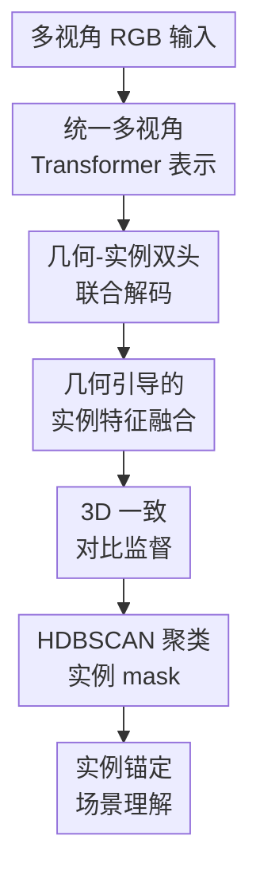

# IGGT: Instance-Grounded Geometry Transformer for Semantic 3D Reconstruction

**会议**: ICLR 2026  
**OpenReview**: [https://openreview.net/forum?id=swiL18PmUV](https://openreview.net/forum?id=swiL18PmUV)  
**代码**: https://github.com/lifuguan/IGGT_official  
**领域**: 3D视觉  
**关键词**: 语义3D重建, 多视图实例匹配, 开放词汇分割, 3D一致性, 实例级场景理解  

## 一句话总结
IGGT 用一个多视角 Geometry Transformer 同时预测相机、深度、点图和实例级特征，并通过 3D 一致对比学习把几何重建与实例语义绑在同一表示里，从而在语义 3D 重建、多视图实例匹配和开放词汇场景理解上取得更稳定的结果。

## 研究背景与动机
**领域现状**：语义 3D 重建通常被拆成两条线：一条线做几何，用 SfM、MVS、DUSt3R、VGGT 这类方法从多视角图像恢复相机、深度和点云；另一条线做语义，用 2D 分割模型或 VLM 给图像区域赋予类别，再把语义提升到 3D。

**现有痛点**：这种先重建再理解的流水线很容易把前一阶段误差传给后一阶段。几何模型只关心点的位置和深度，不知道同一个沙发、椅子或柜子在多视角里应该保持同一个实例身份；语义模型又通常停留在 2D 类别层面，遇到同类多个实例或大视角变化时容易混淆。

**核心矛盾**：3D 几何需要保留细粒度结构，语义理解需要稳定的对象身份。直接把 3D 特征硬对齐到某个语言模型的高层语义空间，会让表示过度依赖该 VLM，也可能损伤几何细节；但完全分开训练，又无法让实例身份反过来约束几何一致性。

**本文目标**：作者想要一个从多张 RGB 图像直接输出几何和实例表示的统一模型：它既能像 VGGT 一样做 feed-forward 3D reconstruction，又能在 2D / 3D 中区分同一类别下的不同对象，并把这些实例 mask 交给任意 VLM 或 LMM 做开放词汇查询与场景 grounding。

**切入角度**：论文没有把语言特征作为唯一监督，而是先让模型学会 3D 一致的实例聚类场。实例 mask 是比类别标签更底层、也更可迁移的桥梁：同一个 mask 可以接 OpenSeg 做语义分割，也可以接 Qwen2.5-VL / GPT-4o 做问题回答。

**核心 idea**：用实例级 3D 一致特征替代固定 VLM 对齐，把几何重建和对象身份聚类一起训练，再用实例 mask 作为通用接口连接下游视觉语言模型。

## 方法详解

### 整体框架
IGGT 的输入是同一场景的 $N$ 张 RGB 图像，输出包括每个视角的相机参数、深度图、点图以及 8 维实例特征图。整体流程可以理解为：先用大规模多视角 Transformer 得到统一 token，再由几何头和实例头并行解码，最后用 3D 一致对比损失让同一物体跨视角聚在一起、不同物体分开。

训练完成后，IGGT 不直接绑定某个语言模型。它先用 HDBSCAN 把多视角实例特征聚成 3D 一致的实例 mask，再把这些 mask 作为提示或 pooling 区域交给 OpenSeg、CLIP、LSeg、Qwen2.5-VL 等模型，完成开放词汇分割、实例跟踪和 QA 场景 grounding。

### 关键设计
**1. 统一多视角 Transformer 表示：让几何和实例从同一套场景 token 出发**

IGGT 沿用 VGGT 的思路构建约 1B 参数的统一 Transformer。每张图像先经过 DINOv2 提取 patch token，再拼接一个可学习的 camera token，让模型能在输入视角数量不固定的情况下仍然感知相机相关信息。随后 24 个 intra-view self-attention 和 global-view cross-attention block 共同建模局部纹理与跨视角关系。

这个设计的关键不是简单扩大模型，而是把几何与实例理解放到同一个 scene-level 表示里。模型预测的是 $F:\{I_i\}_{i=1}^N \mapsto (t_i,D_i,P_i,S_i)_{i=1}^N$，其中 $t_i$ 是相机参数，$D_i$ 是深度，$P_i$ 是点图，$S_i$ 是实例级特征。这样，实例头看到的不是孤立 2D 图像特征，而是已经被多视角几何关系调制过的统一 token。

**2. 几何-实例双头联合解码：把对象身份和空间结构一起预测**

模型在统一 token 之后分成 Geometry Head 和 Instance Head。Geometry Head 继承 VGGT 的相机预测、深度预测和点图预测模块，用 DPT-like 上采样结构从 token 中恢复多尺度几何特征 $F_i^{pt}$；Instance Head 也使用类似 DPT 的 dense prediction 结构，生成多尺度实例特征 $F_i^{ins}$。

这种双头结构解决的是语义 3D 重建里的一个常见断裂：几何网络通常不知道实例边界在哪里，分割网络又不知道边界在 3D 中是否跨视角一致。IGGT 让两者共享前面的 Transformer 表示，并在训练时同时优化几何损失和实例对比损失，因此实例身份可以利用几何上下文，几何表示也会受到对象一致性的间接约束。

**3. 几何引导的实例特征融合：用 window-shifted cross attention 给实例头补空间细节**

如果实例头只从语义 token 解码，容易得到类别可分但边界粗糙的特征。论文加入 cross-modal fusion block，让实例特征作为 query，几何特征作为 key/value，通过滑动窗口 cross attention 注入像素级空间结构：$\hat{F}_{i,l}^{ins}=F_{i,l}^{ins}+F_{win}(Q=F_{i,l}^{ins},K=F_{i,l}^{pt},V=F_{i,l}^{pt})$。

这里使用窗口注意力而不是全局注意力，是因为 dense feature 的空间分辨率高，全局 cross attention 代价会很大。窗口加 shift 的方式能在局部边界、物体轮廓和相邻区域之间传递几何信息，同时保持计算可控。消融里的 PCA 可视化也说明，没有这个 fusion，实例头在椅子边缘等高频区域更难收敛。

**4. 3D 一致对比监督与实例锚定接口：先学稳定对象，再连接任意 VLM / LMM**

IGGT 的实例特征不是直接对齐文本，而是用 3D-consistent instance masks 做对比学习。对采样像素集合 $P$，同一 3D 实例的像素特征被拉近，不同实例的特征在 margin $M$ 内被推开：$L_{mvc}=\lambda_{pull}\sum_{m(p_i)=m(p_j)}d(f_{p_i},f_{p_j})+\lambda_{push}\sum_{m(p_i)\ne m(p_j)}\max(0,M-d(f_{p_i},f_{p_j}))$。

这个损失把“同一个物体在不同视角中仍然是同一个物体”变成了训练信号。它比类别级语义更细，因为同一类别的两把椅子应该在特征空间里保持可分；它也比 2D 跟踪更稳，因为监督来自跨视角一致的 3D instance ID。最终总损失为 $L_{overall}=L_{pose}+L_{depth}+L_{pmap}+L_{mvc}$，几何和实例两种目标被放在一个训练过程中共同优化。

训练好的 IGGT 先通过 HDBSCAN 将多视角实例特征聚成 $K$ 个实例簇，并把簇标签重投影回各视角得到一致的 2D instance masks。做开放词汇分割时，这些 mask 可以作为区域先验，对 OpenSeg / CLIP / LSeg 特征做 mask pooling，再给每个实例分配文本类别。

做 QA scene grounding 时，方法会把同一实例在多视角中的区域高亮给 LMM，并用 yes/no 问题判断这个实例是否满足自然语言查询，最后合并所有 positive mask。这样，IGGT 本体负责稳定的空间解析，语言模型负责语义命名和复杂关系推理；两者通过实例 mask 连接，后续可以替换更强的 VLM / LMM，而不用重新训练整个 3D 模型。

### 一个完整示例
假设输入是一个室内场景的 10 张图，用户想找“靠近水槽的白色篮子”。传统流程可能先重建点云，再跑 2D 分割，再把类别投到 3D；如果视角中水槽只露出一部分，或同类篮子有多个，就容易把对象身份搞混。

IGGT 会先为 10 张图预测深度、点图和每个像素的实例特征。HDBSCAN 将这些特征聚成若干实例簇，比如篮子、水槽、柜子、椅子分别得到跨视角一致的 mask。随后系统把每个候选实例的多视角红色高亮图交给 Qwen2.5-VL，逐个询问“这些高亮区域是否对应靠近水槽的白色篮子，只回答 yes/no”。得到 positive response 的实例被合并为最终 2D / 3D grounding 结果。

这个例子里的关键是，语言模型不需要自己在多视角里追踪物体。它只需要判断已经由 IGGT 稳定分离出来的实例是否符合查询，空间一致性由 IGGT 的实例特征和聚类保证。

### 损失函数 / 训练策略
数据方面，作者构建了 InsScene-15K，包含约 15K 个场景和总计约 200M 张图像级数据来源，覆盖合成、web-captured video 和 RGB-D scan 三类场景。合成数据直接使用渲染得到的实例 mask；RE10K 这类视频数据用 SAM / SAM2 从初始帧生成 mask 并沿时间传播，出现未覆盖区域时重新选 keyframe 发现新物体；ScanNet++ 这类 RGB-D 数据先把 3D 标注投影到 2D，再用 SAM2 proposal 对边界进行细化并保持 ID 一致。

训练时模型从 VGGT 权重初始化，在 InsScene-15K 上用 8 张 NVIDIA A800 训练 2 天。优化器为 AdamW，backbone 学习率 $1\times10^{-6}$，几何头和实例头学习率 $1\times10^{-5}$。每个 batch 从随机场景采样 1 到 12 帧，总计 24 张图像；对比损失中作者设置 $\lambda_{pull}=2.0$、$\lambda_{push}=1.0$、$M=1.0$（原文训练细节处有一个 $\lambda_{pull}$ 重复书写，按公式语义这里理解为 pull/push 两项权重）。

## 实验关键数据

### 主实验
论文主要在 ScanNet 和 ScanNet++ 上评估三类能力：多视图实例匹配、几何重建、2D / 3D 开放词汇语义分割。IGGT 是表中少数同时具备 reconstruction、understanding 和 matching 的方法，并且在实例匹配与语义分割上优势明显。

| 数据集 | 指标 | 本文 IGGT | 之前强基线 | 提升 / 说明 |
|--------|------|-----------|------------|-------------|
| ScanNet | T-mIoU↑ | 69.41 | SAM2*: 53.74 | +15.67，跨视角实例匹配更稳 |
| ScanNet | T-SR↑ | 98.66 | SAM2*: 71.25 | +27.41，几乎所有视角都能跟住目标 |
| ScanNet | Abs. Rel↓ | 1.90 | VGGT: 1.84 | 几何精度基本持平，略低于 VGGT |
| ScanNet | 2D mIoU↑ | 60.46 | LSeg: 58.11 | +2.35，开放词汇分割更好 |
| ScanNet | 3D mIoU↑ | 39.68 | LSM-MV: 35.37 | +4.31，3D 语义一致性更强 |
| ScanNet++ | T-mIoU↑ | 73.02 | SAM2*: 44.16 | +28.86，大视角变化下优势更明显 |
| ScanNet++ | T-SR↑ | 98.90 | SAM2*: 57.89 | +41.01，实例不易丢失 |
| ScanNet++ | Abs. Rel↓ | 2.61 | VGGT: 2.75 | +0.14，几何也略优于 VGGT |
| ScanNet++ | 2D mIoU↑ | 31.31 | Feature-3DGS: 22.47 | +8.84，语义分割提升明显 |
| ScanNet++ | 3D mIoU↑ | 20.14 | LSM-MV: 15.17 | +4.97，3D 语义点云更干净 |

### 消融实验
作者补充了对比监督权重、VLM 接入和类无关实例分割的分析。整体结论是：实例对比损失不能太弱，否则聚类不可分；也不能太强，否则会压过几何监督。

| 配置 | 关键指标 | 说明 |
|------|----------|------|
| $\lambda=0.1$ | ScanNet++ 2D mIoU 20.63，3D mIoU 13.89，$\tau$ 85.35 | 对比监督太弱，实例特征不够可分，mask 质量明显下降 |
| $\lambda=0.5$ | 2D mIoU 31.07，3D mIoU 19.79，$\tau$ 85.43 | 接近完整设置，训练较稳 |
| $\lambda=1$ | 2D mIoU 31.31，3D mIoU 20.14，$\tau$ 85.66 | 论文主设置，几何和理解较均衡 |
| $\lambda=2$ | 2D mIoU 31.86，3D mIoU 20.01，$\tau$ 85.19 | 语义略升，几何仍可接受 |
| $\lambda=10$ | 2D mIoU 32.60，3D mIoU 15.18，$\tau$ 79.38 | 语义目标过强，几何质量受损 |
| Ours w/ LSeg | ScanNet mIoU 60.46，ScanNet++ mIoU 22.72 | 在 ScanNet 背景类上较强 |
| Ours w/ CLIP | ScanNet mIoU 49.36，ScanNet++ mIoU 21.52 | 文本对齐强，复杂类别案例更有优势 |
| Ours w/ OpenSeg | ScanNet mIoU 58.12，ScanNet++ mIoU 31.31 | 在 ScanNet++ 上最好，说明 mask 接口可换 VLM |
| Ours class-agnostic | AP 12.25，AP50 24.93，AP25 47.55，时间 2.52 min | 明显快于 VGGT+SAI3D，精度接近但仍低于其 AP |

### 关键发现
- 多视图实例匹配是 IGGT 最突出的结果：ScanNet++ 上 T-SR 从 SAM2* 的 57.89 提到 98.90，说明 3D 一致实例特征比纯 2D video tracking 更能处理大相机运动。
- 几何重建没有因为加入实例语义而明显退化：ScanNet 上 Abs. Rel 与 VGGT 接近，ScanNet++ 上甚至略好，说明联合训练至少没有破坏基础几何能力。
- 开放词汇分割的收益主要来自实例 mask 的空间先验：同一个对象区域先被稳定聚合，再做 VLM pooling，比逐像素语言特征直接投影更抗视角缺失和边界噪声。
- 类无关 3D instance segmentation 中，IGGT 比 VGGT+Graph Cut 快约 8 分钟，并接近 VGGT+SAI3D 的效果，但 AP50 仍有差距，说明聚类后处理还不是最精细的边界方案。
- OOD 可视化覆盖 ETH3D、Waymo、低光照、机器人和 egocentric 数据，展示了不错的泛化；但 fisheye egocentric 场景仍会因相机内参复杂导致几何重建困难。

## 亮点与洞察
- **把实例身份当作几何与语义之间的中间层**：论文没有急着把 3D 特征压到语言空间，而是先学习跨视角一致的 object instance。这个中间层很实用，因为实例既依赖几何，又可以被语言模型命名和推理。
- **统一模型不是只做多任务拼盘**：几何头、实例头、cross-modal fusion 和对比损失形成了比较清晰的闭环。实例特征借几何边界变细，几何训练也在对象级一致性约束下获得额外结构信号。
- **mask-as-interface 的设计很可复用**：未来接入更强 VLM / LMM 时，IGGT 不必重新对齐某个文本 embedding。只要下游模型能看图、看 mask 或做区域特征 pooling，就能利用 IGGT 的空间解析结果。
- **InsScene-15K 是方法成立的重要基础**：这篇论文的模型创新和数据工程绑得很紧。没有 3D-consistent instance masks，仅靠普通 2D mask 或类别标签，很难训练出同一实例跨视角聚合的特征场。

## 局限与展望
- 作者承认当前实例 mask 依赖无监督聚类后处理，边界精度还不能和 SAM2 这类专门分割模型相比。后续可以把 DETR-style instance head 或更强的 mask decoder 接入端到端训练。
- 实验中的定量评估场景数量相对有限：ScanNet / ScanNet++ 各随机选 10 个 scene、每个 scene 8 到 10 张图，虽然任务覆盖广，但大规模真实部署下的稳定性还需要更多统计。
- QA grounding 依赖外部 LMM 的判断能力和提示格式，实例 mask 解决了空间一致性，但复杂语言关系、计数和遮挡推理仍可能受 LMM 偏差影响。
- HDBSCAN 聚类带来额外后处理时间，10 图场景最终约 2.52 分钟，明显快于 per-scene optimization，但还不是实时系统。若用于机器人闭环，需要更快的聚类或直接预测实例 ID。
- OOD fisheye 结果暴露了相机模型泛化问题。未来可以加入鱼眼 / 全景 / 动态场景数据，或者显式建模更复杂的相机内参。

## 相关工作与启发
- **vs VGGT**: VGGT 擅长从多视角图像直接预测相机、深度和点图，但主要是几何 foundation model；IGGT 在 VGGT 风格 backbone 上加入实例头、几何-实例融合和 3D 一致对比监督，让输出能直接服务语义理解。
- **vs LSM / Uni3R**: 这类方法尝试把空间模型和特定 VLM 对齐，能做语义 3D 但容易受绑定模型能力限制。IGGT 不把核心 3D 表示锁死到单一语言空间，而是用实例 mask 作为可替换接口。
- **vs SAM2 / SpaTracker+SAM**: SAM2 更擅长 2D mask 质量，SpaTracker 提供跟踪点，但它们缺少显式的 3D 场景一致表示。IGGT 的优势是大视角变化和多实例环境中的跨视角 ID 稳定性。
- **vs NeRF-DFF / Feature-3DGS / LangSplat**: 这些方法通常需要 per-scene optimization 或较密集视角，语义特征附着在重建过程之后。IGGT 是 feed-forward 模型，更适合快速处理新场景，但在最终视觉质量和边界精度上仍有提升空间。

## 评分
- 新颖性: ⭐⭐⭐⭐⭐ 用实例级 3D 一致特征作为几何与语言之间的桥梁，比直接 VLM 对齐更灵活。
- 实验充分度: ⭐⭐⭐⭐ 覆盖 matching、reconstruction、open-vocab segmentation、QA grounding、OOD 和消融，但主 benchmark 场景规模偏小。
- 写作质量: ⭐⭐⭐⭐ 方法链条清楚，图表丰富；个别训练超参描述有小笔误，需要读者结合公式理解。
- 价值: ⭐⭐⭐⭐⭐ 对语义 3D reconstruction、机器人场景理解和开放词汇 3D grounding 都有直接参考价值。

<!-- RELATED:START -->

## 相关论文

- [\[ICLR 2026\] Quantized Visual Geometry Grounded Transformer](quantized_visual_geometry_grounded_transformer.md)
- [\[CVPR 2026\] GGPT: Geometry-Grounded Point Transformer](../../CVPR2026/3d_vision/ggpt_geometry_grounded_point_transformer.md)
- [\[ICLR 2026\] Streaming Visual Geometry Transformer](streaming_visual_geometry_transformer.md)
- [\[ICLR 2026\] FastVGGT: Fast Visual Geometry Transformer](fastvggt_fast_visual_geometry_transformer.md)
- [\[CVPR 2025\] VGGT: Visual Geometry Grounded Transformer](../../CVPR2025/3d_vision/vggt_visual_geometry_grounded_transformer.md)

<!-- RELATED:END -->
