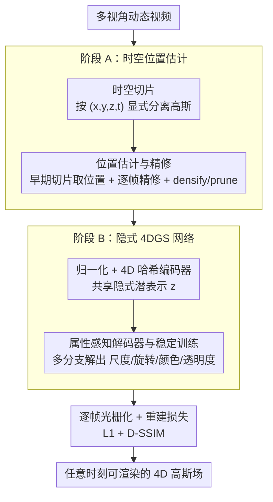

# Implicit 4D Gaussian Splatting for Fast Motion with Large Inter-Frame Displacements

**会议**: ICLR 2026  
**OpenReview**: [https://openreview.net/forum?id=MWtXs60n38](https://openreview.net/forum?id=MWtXs60n38)  
**代码**: 待确认  
**领域**: 3D视觉 / 动态场景重建 / 4D Gaussian Splatting  
**关键词**: 4D高斯泼溅、动态场景重建、大位移快速运动、隐式神经网络、时空切片

## 一句话总结
SPIN-4DGS 把快速运动下"高斯属性学不好导致动态物体糊掉/消失"的问题，重构成"先按 $(x,y,z,t)$ 显式切片拿到可靠的时空位置、再用一个轻量前馈网络从位置直接解码出尺度/旋转/颜色/透明度"，在 CMU Panoptic Sports 六个体育场景上平均 PSNR 比最强基线高 1.4–1.7 dB，篮球场景超 D3DGS +1.83 dB。

## 研究背景与动机
**领域现状**：4D 高斯泼溅（4DGS）是近两年动态场景重建的主流框架，渲染快、画质高。它有两条主线：一是**显式 4D 参数化**（如 Realtime-4DGS、4D-Rotor），把空间和时间统一成一个连续 4D 高斯场，按时间切片渲染；二是**形变（deformable）方法**（如 4DGaussian、Grid4D），先在静态正则空间（canonical space）放好高斯，再学随时间的位移形变。两者在小位移场景（Neu3D 等）上都已经做得很好。

**现有痛点**：一旦运动变快、相邻帧之间位移变大（如 Panoptic Sports 里飞速移动的篮球、网球拍），这两类方法都会糊掉甚至让物体"凭空消失"。形变方法的问题在于：快速物体在正则空间里根本没被分配到初始高斯，于是后续形变里它一直"看不见"。显式方法早期还能大致跟上位置，但训练后期颜色、透明度、尺度、旋转这些**属性会快速崩塌**，画面急剧退化（论文图 2 显示 15K→30K 迭代反而更糟）。

**核心矛盾**：作者点破了崩塌的根因——**位置其实学得够准，崩的是属性**。重建损失被大量背景高斯主导，背景静止好拟合，而处在新位置的快速运动高斯重建误差天然更大，优化于是偏向"把背景拟合好"，动态物体被牺牲掉。雪上加霜的是，单个 4D 高斯要同时解释所有时间戳，但光栅化是逐帧做的，为某一帧调好参数会让其它帧变差——这种**跨帧干扰**（cross-frame interference）让动态区域很难保持时间一致性。

**本文目标**：在不引入分割掩码等外部监督的前提下，解决"快速大位移物体的高斯属性学不好"这一核心失败模式。子问题拆成两块：(1) 怎么拿到覆盖整条运动轨迹、且彼此不相互干扰的高斯位置；(2) 怎么在这些位置上稳定、省内存地学出属性。

**切入角度**：既然位置可靠、属性易崩，那就**别再去建模时间位移**，转而把显式时空位置 $(x,y,z,t)$ 当作输入，直接"喂"给网络去预测属性。把不同时刻的高斯按时空位置显式分开，跨帧干扰自然消失。

**核心 idea**：用一个轻量前馈隐式网络，从显式收集到的时空位置直接解码高斯属性，取代"逐高斯显式存属性 + 学时间位移"的老范式——即 Spatiotemporal Position Implicit Network for 4DGS（SPIN-4DGS）。

## 方法详解

### 整体框架
SPIN-4DGS 输入是多视角动态视频，输出是任意时刻可渲染的 4D 高斯场，整条管线分两个串行阶段。**阶段 A（时空位置估计）**：先借一个现成显式基线（Realtime-4DGS）在**训练早期**沿时间轴切片，拿到每帧的高斯位置集 $\{u_t\}$，再用逐帧光栅化损失对位置做精修（densify 显著点、prune 冗余点），得到一组固定的、按 $(x,y,z,t)$ 彼此分离的可靠位置。**阶段 B（隐式 4DGS 网络）**：把精修后的位置 $(\mu,t)$ 归一化后送进一个 4D 哈希编码器得到共享潜表示 $z$，再由一个属性感知的多分支解码器分别解出尺度、旋转、球谐颜色、透明度；最后逐帧光栅化渲染、用标准 3DGS 重建损失端到端训练。关键在于：属性不再逐高斯显式存储，而是**隐式地存在网络参数里**，因此在海量时空位置上仍然省内存，而且网络对所有高斯学到的是一个**共享的隐式表示**，天然带来时空一致性。

### 关键设计

**1. 时空切片：把高斯按 $(x,y,z,t)$ 显式分离，斩断跨帧干扰**

这是整套方法的概念地基，直接针对"单个 4D 高斯要同时解释所有时间戳、但光栅化逐帧做"导致的跨帧干扰。老做法把覆盖整条轨迹的高斯在统一 4D 空间里**联合优化**，于是为某帧降损失的更新会让该高斯在其它帧变差，监督信号被互相削弱、收敛慢、显存大。SPIN-4DGS 反其道而行——在每个时间步**独立**构造高斯集合，用 $(x,y,z,t)$ 把它们显式分开，并在每帧滤掉无关点。形式上把位置和颜色写成时间轴的显式函数 $u_t=f_\theta(x,y,z,t)$、$c_t=g_\phi(x,y,z,t)$，$t\in\{0,\dots,T\}$。这样每帧的优化只聚焦于该时刻真正相关的高斯，互不打架，属性学习因此变得可靠——消融里这一步把 PSNR 从 27.48 抬到 28.96、训练时间从 1h20m 砍到 25m、显存从 18GB 降到 9GB（见表 3），是"既提质又降本"的关键。

**2. 时空位置估计与精修：先借显式基线早期切片，再逐帧精修**

切片要有"切的对象"，这一步负责低成本地拿到覆盖完整运动轨迹的高质量位置集。作者并不从头训一个位置网络，而是直接拿公开的 Realtime-4DGS 在**训练早期**（实测 15K 迭代即可）沿时间轴切片得到初始位置——关键洞察是位置本来就比属性好学，所以无需把基线训到底（消融显示 30K 迭代反而比 15K 略差，长时间优化纯属浪费）。拿到初始位置后，再用对应颜色按帧做光栅化损失精修 $u_t\leftarrow\mathrm{Refine}(u_t,c_t;t)$，在显著区域 densify、对冗余点 prune，把背景杂点清掉、把更新集中到快速物体上。精修迭代从 0.5K 增到 2K，PSNR 稳步从 29.86 升到 30.05（表 2b）。精修后位置被**固定**下来作为阶段 B 的显式输入。

**3. 归一化 + 4D 哈希编码器：用共享隐式表示省内存又保一致性**

这一步解决"在海量时空位置上显式存属性内存爆炸"的痛点。原始 3D 位置 $u\in\mathbb{R}^3$ 是无界的，作者先按 Mip-NeRF 的场景收缩把坐标压进有限球再映到 $[0,1]^3$：$\mathrm{contract}(\mu)=\mu$（$\|\mu\|\le 1$）或 $(2-\frac{1}{\|\mu\|})\frac{\mu}{\|\mu\|}$（$\|\mu\|>1$），并令 $\bar\mu=\frac14\mathrm{contract}(\mu)+\frac12$；时间也归一化 $t_{\text{norm}}=\frac{t-t_{\min}}{t_{\max}-t_{\min}}$，拼成 4D 输入 $\tilde x=[\bar\mu^\top,t_{\text{norm}}]^\top\in[0,1]^4$。随后把 Instant-NGP 的多分辨率哈希网格从 3D 直接扩到 4D（加一根时间轴），编码出潜向量 $z=f_{\text{enc}}(\tilde x)\in\mathbb{R}^{LF}$（$L$ 个哈希层、每层 $F$ 通道，拼接而成）。相比低秩分解（如平面分解）随高斯数增长会损表达力、还要额外管理每层哈希，作者直接用 4D 哈希编码。属性此时**隐式地存在网络参数里**而非逐高斯，所有高斯共享同一套表示，既省内存又自带时空一致性——这也是 SPIN-4DGS 存储 1261 MB 就能超过 D3DGS（1994 MB）的来源。归一化的重要性在消融里极其明显：不归一化时 PSNR 仅 19.17，加上归一化直接跳到 29.89（表 5）。

**4. 属性感知解码器与稳定训练：每个属性单独一个头，靠初始化把训练摁稳**

拿到共享潜向量 $z$ 后，用**多分支解码器**分别预测四类属性——尺度、旋转、球谐颜色、透明度，每个属性各用一个三层 MLP 独立的头：$(\hat s,\hat r,\widehat{sh},\hat o)=(f_{\text{scale}}(z),f_{\text{rot}}(z),f_{\text{sh}}(z),f_{\text{opacity}}(z))$，再经属性专属激活变到合法区间 $(s,r,sh,o)=(\exp(\hat s),\frac{\hat r}{\|\hat r\|_2},\widehat{sh},\sigma(\hat o))$。从位置直接回归这些敏感属性很容易训飞，所以一组针对性的稳定化设计是这一节的灵魂：尺度头在反传时把 pre-scale 裁到 $\le 20$ 防梯度爆炸、末层 bias 初始化为 $-5$（即 $\exp(-5)\approx 0.0067$）从小尺度起步；旋转头末层 bias 设成 $(1,0,0,0)$，让初始四元数接近单位元、从稳定结构渐进学旋转；透明度头 bias 设为 $\mathrm{logit}(0.1)\approx-2.197$，从近透明起步、只在需要处升不透明度；颜色头不做特殊初始化以保留 SH 渲染所需的高维表达。激活上全程用 GELU 而非 ReLU。这些看似零碎，但消融显示从 ReLU 换 GELU 把 PSNR 从 29.89 推到 30.05（表 5），是把"位置→属性"直接回归这件事真正训得稳的工程关键。

### 损失函数 / 训练策略
图像逐帧光栅化后，用标准 3DGS 重建损失端到端优化：

$$L = (1-\lambda)\, L_1 + \lambda\, L_{\text{D-SSIM}}, \quad \lambda = 0.2$$

编码器与解码器各参数组用**分离学习率**（属性敏感、统一学习率易不稳）：编码器 $8\times10^{-3}$；解码器颜色 $1\times10^{-3}$、尺度 $3\times10^{-4}$、旋转 $3\times10^{-5}$、透明度 $8\times10^{-4}$；位置沿用 3DGS 学习率。Adam + 线性 warmup + 余弦衰减（衰减到 $1\times10^{-7}$）。隐藏维 64，编码器 $L=16$ 层、$F=4$、哈希表 $2^{21}$。默认 40K 迭代、batch size 3，单张 RTX 4090（24GB）。

## 实验关键数据

### 主实验
数据集为 CMU Panoptic Sports 六个体育场景（juggle / basketball / boxes / football / softball / tennis），30 FPS × 5s（每场景 150 帧），31 相机、$640\times360$、四个固定测试相机评测。指标 PSNR / SSIM / LPIPS / FPS / Storage。

| 方法 | 类别 | 平均 PSNR↑ | 平均 SSIM↑ | FPS↑ | Storage(MB)↓ |
|------|------|-----------|-----------|------|------|
| Grid4D | Deformable | 27.06 | 0.91 | 146 | 333 |
| 4DGaussian | Deformable | 27.53 | 0.91 | 40 | 62 |
| MoDec-GS | Deformable | 27.23 | 0.92 | 62 | 34 |
| TC3DGS | 外部监督 | 27.88 | 0.89 | 890 | 49 |
| D3DGS | 外部监督 | 28.70 | 0.91 | 760 | 1994 |
| 4D-Rotor-Gaussians | Explicit | 27.16 | 0.91 | 100 | 94 |
| Realtime-4DGS | Explicit | 28.38 | 0.93 | 197 | 1293 |
| **SPIN-4DGS（本文）** | Implicit | **30.11** | **0.93** | 104 | 1261 |

六个场景 PSNR 全部最优，平均超最强显式基线 Realtime-4DGS +1.73 dB、超外部监督基线 D3DGS +1.41 dB；篮球场景超 D3DGS +1.83 dB，网球超 Realtime-4DGS +1.64 dB。值得注意的是它**不用任何分割等外部监督**，却超过了用外部监督的 D3DGS/TC3DGS，且存储（1261 MB）比 D3DGS（1994 MB）更小、FPS（104）远高于同为网络型的 4DGaussian（40）和 MoDec-GS（62）。

### 消融实验

| 配置 | 关键指标 | 说明 |
|------|---------|------|
| 早期训练 15K / 30K（表 2a） | PSNR 29.57 / 29.39 | 位置无需久训，15K 即可、30K 反降且耗时 ×3 |
| 精修 0.5K → 2K（表 2b） | PSNR 29.86 → 30.05 | 适度精修稳步提升 |
| w/o 时空切片（表 3） | 27.48 / 0.89，1h20m，18GB | 联合优化跨帧干扰，又慢又费显存 |
| w/ 时空切片（表 3） | 28.96 / 0.92，25m，9GB | 显式分离后既提质又大幅降本 |
| 隐式网络：ReLU + 固定位置（表 5） | PSNR 18.64 | 起点很差 |
| + 可训练位置（表 5） | PSNR 19.17 | 单独开放位置仅微增 |
| + 输入归一化（表 5） | PSNR 29.89 | 归一化是决定性一步，暴涨 +10.7 dB |
| + GELU 激活（表 5） | PSNR 30.05 | 换 GELU 再提 +0.16 |
| 复用 D3DGS 位置 + 本文属性（表 4） | 网球 30.51 / 0.95 | D3DGS 原 28.11/0.91，即插即用涨 |

### 关键发现
- **属性才是瓶颈，不是位置**：消融里复用强基线（D3DGS / Realtime-4DGS）的位置、只用本文网络重学属性，仍一致涨点（D3DGS 在网球 28.11→30.51），说明"高质量位置 + 好的属性学习"才是关键，且本框架对底层位置估计器即插即用。
- **归一化是网络能否收敛的开关**：表 5 里不做输入位置归一化，PSNR 只有 19.17；加上归一化直接到 29.89，是单点贡献最大的设计。
- **切片同时提质 + 降本**：表 3 表明显式时空切片把训练时间和显存近乎砍半，同时还涨 PSNR，几乎没有 trade-off。
- **快速小物体场景增益最大**：篮球、网球这类有飞速小物体的场景增益最显著（+1.83 / +1.64 dB），正对应基线最容易"丢物体"的情形。

## 亮点与洞察
- **问题诊断比方法本身更漂亮**：作者把"动态物体消失"精准归因到"位置准、属性崩 + 背景主导损失 + 逐帧光栅化导致跨帧干扰"，方法是顺着诊断长出来的，而非堆 trick——这种"先讲清失败模式再对症下药"的写法值得借鉴。
- **把"建模时间位移"换成"从位置直接解码属性"**：这是范式级的转向。形变/显式方法都在显式建模时间动态，本文反而把时空位置当输入、用隐式网络解码属性，绕开了时间位移建模的全部坑。
- **隐式存储天然省内存又保一致性**：属性存在网络参数而非逐高斯，海量时空位置下仍省内存，且共享表示自带时空一致——一个设计同时拿下内存和一致性两个目标。
- **可即插即用增强已有 4DGS**：表 4 显示它能直接复用任意基线的位置、只换属性学习就涨点，这让它更像一个"4DGS 属性学习插件"而不只是一个孤立模型，迁移价值高。
- **一组朴素但关键的解码器初始化**：尺度从 $\exp(-5)$、旋转从单位四元数、透明度从 $\mathrm{logit}(0.1)$ 起步，这套"从保守状态渐进学"的初始化对"位置直接回归属性"这类敏感任务很有迁移性。

## 局限与展望
- **依赖外部位置估计器**：阶段 A 借 Realtime-4DGS 取初始位置，方法本身不端到端，位置质量上限受所借基线影响（虽然表 4 证明它对不同来源都鲁棒）。
- **只在 CMU Panoptic Sports 验证**：实验全集中在多视角体育场景（31 相机、固定机位），对单目/稀疏视角、真实户外、长序列等更难设定的泛化尚未验证。
- **存储仍偏大**：1261 MB 虽小于 D3DGS，但远高于 4DGaussian（62 MB）、MoDec-GS（34 MB）这类轻量形变法，端侧/移动场景仍有压缩空间。
- **改进思路**：把位置估计与属性网络真正端到端联合、或引入轨迹先验减少对外部基线的依赖；用哈希表更激进压缩或量化进一步降存储；扩展到单目/稀疏视角的快速运动。

## 相关工作与启发
- **vs 形变方法（4DGaussian / Grid4D / MoDec-GS）**：它们在静态正则空间初始化高斯再学时间位移，快速物体常在正则化阶段就被漏掉、后续形变里一直"看不见"；本文不建正则空间、不学位移，直接按 $(x,y,z,t)$ 显式分离 + 隐式解码属性，专门救回快速大位移物体。
- **vs 显式 4D 参数化（Realtime-4DGS / 4D-Rotor）**：它们把空间时间统一成连续 4D 场按时间切片，但单个 4D 高斯要解释所有时间戳、逐帧光栅化造成跨帧干扰使属性后期崩塌；本文沿用其"早期切片取位置"的优点，却把属性学习从显式存储改成隐式前馈，避开了属性崩塌。
- **vs 外部监督方法（D3DGS / TC3DGS）**：它们靠分割掩码等外部监督处理大位移，训练成本和存储都高（D3DGS 1994 MB）；本文不用任何外部监督，仅从原始视频就超过它们，且能复用它们的位置进一步涨点。
- **启发**：当某子量（位置）已学得够准、另一子量（属性）易崩时，与其继续在统一空间联合优化，不如**冻结好学的、把难学的交给一个共享隐式网络从前者直接解码**——这一"显式位置 + 隐式属性"的解耦思路，可迁移到其它"几何稳、外观/材质难学"的神经渲染任务。

## 评分
- 新颖性: ⭐⭐⭐⭐⭐ 把 4DGS 失败模式重诊断为"属性崩塌"，并用"显式位置→隐式解码属性"取代时间位移建模，是范式级转向
- 实验充分度: ⭐⭐⭐⭐ 六场景 + 五组消融 + 即插即用验证扎实，但只在一个多视角体育数据集上测，泛化面偏窄
- 写作质量: ⭐⭐⭐⭐⭐ 失败模式分析清晰、动机一路推到方法、消融定位到每个组件贡献
- 价值: ⭐⭐⭐⭐ 快速大位移动态重建实用增益明显，且能作为插件增强已有 4DGS；存储偏大略限端侧落地

<!-- RELATED:START -->

## 相关论文

- [\[AAAI 2026\] Sparse4DGS: 4D Gaussian Splatting for Sparse-Frame Dynamic Scene Reconstruction](../../AAAI2026/3d_vision/sparse4dgs_4d_gaussian_splatting_for_sparse-frame_dynamic_scene_reconstruction.md)
- [\[CVPR 2026\] CaT-GS: Efficient 3DGS Rendering for Large-Scale Scenes with Inter-frame Caching and Tile Scheduling](../../CVPR2026/3d_vision/cat-gs_efficient_3dgs_rendering_for_large-scale_scenes_with_inter-frame_caching_.md)
- [\[ICLR 2026\] Mango-GS: Enhancing Spatio-Temporal Consistency in Dynamic Scenes Reconstruction using Multi-Frame Node-Guided 4D Gaussian Splatting](mango-gs_enhancing_spatio-temporal_consistency_in_dynamic_scenes_reconstruction_.md)
- [\[ICLR 2026\] FastAvatar: Towards Unified and Fast 3D Avatar Reconstruction with Large Gaussian Reconstruction Transformers](fastavatar_towards_unified_and_fast_3d_avatar_reconstruction_with_large_gaussian.md)
- [\[ICLR 2026\] Signal Structure-Aware Gaussian Splatting for Large-Scale Scene Reconstruction](signal_structure-aware_gaussian_splatting_for_large-scale_scene_reconstruction.md)

<!-- RELATED:END -->
