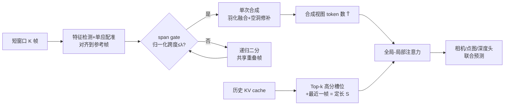

# IncVGGT: Incremental VGGT for Memory-Bounded Long-Range 3D Reconstruction

**会议**: ICLR 2026  
**OpenReview**: [https://openreview.net/forum?id=CezA1eLa1Y](https://openreview.net/forum?id=CezA1eLa1Y)  
**代码**: 待确认  
**领域**: 3D 视觉 / 前馈三维重建 / 长序列流式推理  
**关键词**: VGGT, 流式 3D 重建, KV Cache 剪枝, 图像配准与拼接, 显存受限, 边缘部署  

## 一句话总结
IncVGGT 在**完全免训练**的前提下，用「输入端配准合成 + 历史端 Top-k 缓存剪枝」两个正交模块改造 VGGT/StreamVGGT，把注意力的二次增长压成近乎常数级，从而在 80GB GPU 上处理 1 万帧仍不爆显存，相比 StreamVGGT 在 500 帧上算子数减少 58.5×、显存降 9×、能耗降 25.7×、推理快 4.9×，且精度基本持平。

## 研究背景与动机
- **领域现状**：以 VGGT 为代表的前馈 Transformer 三维重建可以一次前向同时预测深度、位姿、点图和轨迹，无需逐场景优化，在多视角基准上达到 SOTA；StreamVGGT 进一步引入因果注意力 + KV cache，把 VGGT 改造成可在线流式处理的版本，是当前长序列 4D 重建的 SOTA。
- **现有痛点**：VGGT 的全局自注意力随 token 总数 **二次增长**，24GB GPU 只能跑几十帧、80GB 也撑不过 300 帧；StreamVGGT 虽然流式，但缓存「所有历史 key/value」，cache 与延迟随帧数线性膨胀，7–800 帧后显存就突破 80GB，长视频上效率急剧退化。
- **核心矛盾**：真实长视频（VR/AR、机器人、自动驾驶）天然存在大量冗余，但现有方法在**每一步都付出全 token 代价**、并**无差别保留全部历史**，把冗余原封不动地搬进了算力和显存预算。
- **本文目标**：在不重新训练、不破坏前馈特性的前提下，让 Transformer 三维重建能在严格显存/算力约束下稳定跑「任意长」序列。
- **核心 idea**：**【冗余感知双轴压缩】**——把视频流的冗余拆成两个正交方向：**输入端冗余**（相邻帧反复覆盖同一区域）用配准合成在 tokenize 前折叠掉重叠像素；**历史端冗余**（多数缓存 KV 对下一步贡献甚微）用按相关性而非序列长度的 Top-k 剪枝把缓存压成定长。最终把稠密的「所有 token × 所有历史」换成稀疏的「少量 token × 少量槽位」。

## 方法详解

### 整体框架
IncVGGT 是对 StreamVGGT 推理路径的**免训练改造**（直接用官方权重）：输入侧先把一个短窗口的 $K$ 帧通过特征配准对齐到参考域、按 span gate 决定整合或递归二分，融合成紧凑的「合成视图」再 tokenize，使进入注意力的 token 数 $\tilde{T}$ 与「合成后的支撑面积」而非原始帧数成正比；历史侧把全局注意力的 KV cache 限制为「Top-k 高分槽位 + 最近一帧」共 $S=k{+}1$ 个定长槽位。两者合起来把每层每步的稠密代价 $O(B H L^2 d_h)$ 降到 $O(B H \tilde{T} S d_h)$，其中 $\tilde{T}\cdot S \ll L^2$。

### 关键设计

**1. 输入端配准合成（Registration-based Redundancy Reduction）：在 tokenize 前折叠重叠像素。** 相邻帧的像素级重叠会让 Transformer 把同一区域反复 tokenize，因此本文在注意力之前先把窗口内 $K$ 帧拼成一张合成视图。具体先选 $I_0$ 为参考帧，用 ORB/SIFT 提局部特征、kNN 匹配并经 ratio test + 交叉校验保留高置信对应，再以 DLT+RANSAC 估计相邻帧单应 $H_{i\to i-1}$；通过累乘 $H_{i\to0}=H_{1\to0}H_{2\to1}\cdots H_{i\to i-1}$ 把所有帧增量地映射到参考域。单应虽无法完全建模强 3D 视差，但对短时间窗口足够，且天然支持流式增量对齐而无需回头重算早期帧。

**2. 带限 warping + 归一化跨度的递归二分（span gate）：自适应决定「合一张还是拆两半」。** 直接把所有 warp 帧投到全局画布会让画布无界膨胀、外推过度。本文把合成限制在以参考支撑为中心的窄竖直带内（加全局平移保证坐标非负），从而界定画布尺寸、抑制无支撑边缘。是否一次合成由归一化跨度判定：令 $S_i=H_{i\to0}(\Omega_i)$ 为帧 $i$ 的 warp 支撑、$W_0$ 为参考帧宽度，跨度为各支撑并集在 x 轴投影宽度除以单帧宽 $\mathrm{span}=B_x\!\big(\bigcup_i S_i\big)/W_0$。若 $\mathrm{span}\le\lambda$ 则视点连贯、单次合成；否则把窗口二分成两个共享中间帧的子窗递归处理，重叠帧充当对齐锚点保证可拼接性。

**3. 融合与空洞修补：让合成视图的 token 网格稳定可批处理。** 通过 span gate 后，用 mask 感知的距离变换羽化把多帧融合：对每个 warp 计算有效性掩码并赋予向内部平滑增大的权重，归一化累加 $\hat{I}(x)=\big(\sum_i W_i(x)\tilde{I}_i(x)\big)/\big(\sum_i W_i(x)+\delta\big)$ 抑制接缝且不引入光晕；后到帧覆盖先到帧以模拟流式输入、填补小残缺。残余空洞用轻量清理：裁剪持续无支撑的水平边缘、用小半径 inpaint 填补全零严格空洞，并可裁到参考帧高度以规整 token 网格、提升批处理效率。

**4. 全局-局部 KV cache 剪枝（Global-Local Cache Pruning）：把增长缓存压成定长。** 朴素流式把所有历史 KV 都存下来，单步代价 $O(B H p L_{hist} d_h)$ 随缓存线性膨胀，800 帧就在 A100 上爆 80GB。由于真实 3D 视频帧间强连续，第 $t$ 步高分槽位很可能在 $t{+}1$ 仍被复用——本文据此先算注意力 $A_t=\mathrm{softmax}(Q_t K_{1:L_{hist}}^\top/\sqrt{d_h})$，沿 query/head 归约得到每个 key 的相关性向量 $s^{(t)}$，在处理下一帧前预选 $S_{t+1}=\mathrm{TopK}(s^{(t)},k)\cup\{\text{最近一帧}\}$，把注意力限制在这 $k{+}1$ 个槽位上 $O_{t+1}=\mathrm{softmax}(Q_{t+1}K_{S_{t+1}}^\top/\sqrt{d_h})V_{S_{t+1}}$。这样每步打分代价 $O(B H (k{+}1) d_h)$、KV 占用 $O((k{+}1)d_h)$ 都与序列长度无关；保留「最近一帧」是为了捕捉突变场景，避免只看高分历史而漏掉新内容。

## 实验关键数据

实验环境：单张 A100 (80GB)，图像高固定 518px，10 帧滑窗、Top-$k=5$ 历史帧、多视角选 Top-20 相机 token，直接用 StreamVGGT 官方权重。

### 主实验表格

推理总时间（秒，OOM 为爆显存）：

| 帧数 | 5 | 50 | 100 | 300 | 500 | 1k | 10k |
|---|---|---|---|---|---|---|---|
| Ours (Inc) | 0.57 | 4.17 | 8.20 | 25.50 | 38.12 | 82.00 | 797.31 |
| StreamVGGT | 0.50 | 7.23 | 20.09 | 136.72 | 185.11 | OOM | OOM |
| VGGT | 0.51 | 2.37 | 5.78 | 36.32 | OOM | OOM | OOM |

视频深度精度（Sintel / Bonn / KITTI，Abs Rel↓ 与 δ<1.25↑）：

| 方法 | 类型 | Sintel AbsRel | Bonn AbsRel | KITTI AbsRel |
|---|---|---|---|---|
| VGGT | Dense-view | 0.298 | 0.057 | 0.061 |
| StreamVGGT | Streaming | 0.328 | 0.059 | 0.173 |
| Ours (Inc) | Streaming | 0.341 | 0.064 | 0.176 |
| CUT3R | Streaming | 0.421 | 0.078 | 0.118 |

多视角重建（7Scenes / NRGBD，中位 Acc↓）：Ours 0.0266 / 0.0516，StreamVGGT 0.0241 / 0.0520，差距均在 0.3% 内。

### 消融实验表格

注意力算子数（KITTI，单位 k）：

| 帧数 | VGGT | StreamVGGT | Ours (Inc) |
|---|---|---|---|
| 100 | 951.58 | 548.13 | 27.39 |
| 300 | 7956.14 | 4299.78 | 126.33 |
| 500 | OOM | 11591.97 | 198.88 |

能耗（焦耳，300 帧）：Ours 811 J vs VGGT 8079 J vs StreamVGGT 23516 J，约一个数量级差距，且随帧数继续拉大；平均功率 135.7W 也低于 153.8W/178.3W。

### 关键发现
- **延迟近乎常数化**：从 10→300 帧，Ours 每帧延迟反而从 ~104ms 微降到 ~85ms，而 StreamVGGT 从 106ms 飙到 455ms——增量设计成功阻断了「每帧延迟随序列增长」。
- **显存近乎水平线**：Ours 在 1k 帧仍 <9GB、每步增量稳定在 2–3GB；VGGT 300 帧破 60GB、StreamVGGT 1k 帧破 78GB 后崩溃。
- **精度几乎无损**：相对 StreamVGGT 各项差距通常在 1–3% 内，换来一两个数量级的效率收益。

## 亮点与洞察
- **免训练、架构无关**：纯推理路径改造，直接复用 StreamVGGT 权重，意味着随 VGGT 系基座升级即插即用，工程落地成本极低。
- **冗余的「双轴」拆解干净利落**：把输入冗余（像素重叠）和历史冗余（无用 KV）正交分离，分别用经典 CV（配准拼接）和 LLM 推理常用技巧（KV 剪枝）解决，思路简洁且可解释。
- **复杂度推导清晰**：$\tilde{T}\cdot S \ll L^2$ 一句话点明为何能把二次压成近常数，且每个模块都给出了与序列长度无关的复杂度界。

## 局限与展望
- **依赖帧间高重叠假设**：当重叠率很低或骤降（大视角变化、弱纹理）时，单应配准的稳定性会下降，是方法的天然 trade-off。
- **单应近似无法建模强 3D 视差**：短窗口够用，但长基线/强视差场景下合成视图可能引入几何误差。
- **精度略逊于稠密 VGGT**：在能跑得动的短序列上，非流式 VGGT 仍是精度上限；本文换的是「可扩展性」而非「更高精度」。
- 作者讨论了 finetuning 模式但选择不做，认为已接近精度上限、且免训练更通用——后续若针对剪枝/合成做轻量微调，或可进一步缩小与稠密基线的差距。

## 相关工作与启发
- **VGGT / StreamVGGT**：本文直接的基座与最强对手，分别代表「稠密但不可扩展」与「流式但缓存膨胀」两端。
- **VGGT-Long**：用分块 + 块间对齐做公里级离线重建，但需后处理对齐、面向离线；IncVGGT 主打在线、定长缓存。
- **DUSt3R/MASt3R/CUT3R/Spann3R/Point3R**：前馈点图/流式重建路线，缺乏对时序冗余的系统利用。
- **启发**：把大模型推理里的 **KV cache 剪枝（StreamingLLM/Top-k 注意力）** 迁移到三维重建的历史压缩，以及用**经典图像拼接**做 token 级去冗余，是「免训练提效」的一条很有性价比的范式，值得推广到视频理解、4D 重建等其他长序列前馈任务。

## 评分
- **新颖性**: ⭐⭐⭐⭐ — 模块本身（配准拼接、Top-k KV 剪枝）都不算全新，但把二者正交组合、免训练地解决 VGGT 长序列显存瓶颈，工程切入点很巧。
- **实验充分度**: ⭐⭐⭐⭐ — 覆盖延迟/显存/算子数/能耗/功率多维效率指标，且在多个深度与重建基准上验证精度无损，10k 帧极端规模很有说服力；偏弱在缺少对 $k$、$\lambda$ 等超参的系统消融。
- **写作质量**: ⭐⭐⭐⭐ — 双轴冗余的 motivation 清晰，复杂度推导与图示（Fig.1/2/4）到位，易读。
- **价值**: ⭐⭐⭐⭐ — 直击边缘/资源受限部署的真实痛点，免训练 + 即插即用，对长视频 3D/4D 感知落地有直接实用价值。

<!-- RELATED:START -->

## 相关论文

- [\[CVPR 2026\] Long-SCOPE: Fully Sparse Long-Range Cooperative 3D Perception](../../CVPR2026/3d_vision/long_scope_fully_sparse_long_range_cooperative_3d_perception.md)
- [\[CVPR 2025\] FrameVGGT: Frame Evidence Rolling Memory for streaming VGGT](../../CVPR2025/3d_vision/framevggt_frame_evidence_rolling_memory_for_streaming_vggt.md)
- [\[ICLR 2026\] PAGE-4D: VGGT-4D Perception via Disentangled Pose and Geometry Estimation](page-4d_vggt-4d_perception_via_disentangled_pose_and_geometry_estimation.md)
- [\[ICLR 2026\] MEGS2: Memory-Efficient Gaussian Splatting via Spherical Gaussians and Unified Pruning](megs2_memory-efficient_gaussian_splatting_via_spherical_gaussians_and_unified_pr.md)
- [\[CVPR 2026\] VGGT-Det: Mining VGGT Internal Priors for Sensor-Geometry-Free Multi-View Indoor 3D Object Detection](../../CVPR2026/3d_vision/vggt-det_mining_vggt_internal_priors_for_sensor-geometry-free_multi-view_indoor_.md)

<!-- RELATED:END -->
