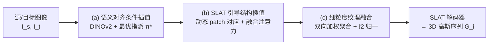

# Interp3D: Correspondence-aware Interpolation for Generative Textured 3D Morphing

**会议**: ICLR 2026  
**OpenReview**: [https://openreview.net/forum?id=au6cziMtGM](https://openreview.net/forum?id=au6cziMtGM)  
**代码**: [https://github.com/xiaolul2/Interp3D](https://github.com/xiaolul2/Interp3D)  
**领域**: 3D 视觉 / 生成式 3D 形变  
**关键词**: textured 3D morphing, training-free, correspondence-aware interpolation, TRELLIS, SLAT, generative prior  

## 一句话总结
Interp3D 提出一个免训练框架，借助 TRELLIS 的 3D 生成先验，把"语义对齐→结构对齐→纹理对齐"的渐进式三阶段对应关系注入扩散生成过程，从而在两个带纹理 3D 资产之间生成结构连贯、外观合理、过渡平滑的形变序列。

## 研究背景与动机
- **领域现状**：带纹理 3D 形变（textured 3D morphing）希望在两个 3D 资产间生成平滑过渡序列，既要保结构连贯又要保细粒度外观，对动画、编辑、影视特效（角色/生物进化）有实用价值。
- **现有痛点**：传统几何形变方法直接在点云/网格上建立显式对应并求形变轨迹，但依赖严格拓扑一致和顶点对应，只能做**纯形状插值、忽略纹理**，遇到拓扑差异就匹配模糊、形变不自然；而把 2D 插值策略搬到 3D 的生成式方法本质是"2D-native"——要么先在图像空间形变再驱动 3D（视角不一致、误差累积），要么把 2D 策略硬套到 3D 生成器（忽略结构对应，难处理尺度/拓扑变化），结果常出现语义错位、结构坍塌、纹理模糊。
- **核心矛盾**：生成先验能造出细腻外观，但缺乏可靠的 3D 对应关系；而几何对应可靠却不会生成纹理。**二者结合并不平凡**——结构和语义鸿沟会让对应关系不稳定（比如 Mario 的头可能错配到 Bread 的肚子）。
- **本文目标**：在训练-free 前提下，联合保证几何一致、纹理对齐与过渡鲁棒性，生成兼具结构保真和纹理连贯的形变轨迹。
- **核心 idea**：**[渐进式三阶段对齐]** 把对应关系拆成由粗到细的三层——语义对齐当"高层规划者"建立概念地图（保证头对头），结构对齐在匹配部件间正则化形变（处理大形状差距、避免坍塌），纹理对齐在对齐结构上做材质迁移与细节重合成（避免模糊混色或纹理跳变）。三者都构建在 TRELLIS 的结构化潜空间（SLAT）这一 3D 生成先验之上。

## 方法详解

### 整体框架
给定源/目标图像提示 $I_s, I_t$，目标是生成长度为 $L$ 的带纹理 3D 序列 $S=\{G_i\}_{i=0}^{L-1}$。Interp3D 以预训练 TRELLIS 为 3D 扩散先验（两阶段：Stage-1 生成体素结构、Stage-2 生成纹理感知的 SLAT 特征，再由 SLAT 解码器映射为 3D 高斯），并在生成过程中渐进注入三层对应关系：(a) 在 2D 条件层做语义对齐插值，(b) 在结构生成阶段做 SLAT 引导的结构插值，(c) 在外观层做细粒度纹理融合。

### 关键设计

**1. 语义对齐条件插值：先把"头对头"的概念地图建好。** 朴素的条件空间插值在 2D 有效，但在 3D 生成里会忽略语义对应、导致特征混淆。Interp3D 用 DINOv2 提取源/目标的 patch 级嵌入 $c_s=\{c_{s,j}\}_{j=1}^M$、$c_t=\{c_{t,k}\}_{k=1}^M$，把对应估计建成一个一一指派问题，按 patch 间余弦相似度求最优置换 $\pi^\star = \arg\max_{\pi\in P_M}\sum_{j,k}\frac{\langle c_{s,j}, c_{t,\pi(k)}\rangle}{\|c_{s,j}\|\|c_{t,\pi(k)}\|}$。按 $\pi^\star$ 重排目标嵌入后，再做 token 级凸组合插值 $c_i=(1-\alpha_i)\{c_{s,j}\}+\alpha_i\{c_{t,\pi^\star(k)}\}$，让每个 patch 平滑地朝它的语义对应物演化，从源头消除类别级错配，给后续形变轨迹提供可靠引导。

**2. SLAT 引导的结构插值：用 3D 潜特征建动态对应、做融合注意力。** 条件插值只携带单视角 2D 语义，难以捕捉中间 3D 结构所需的空间对应，于是引入源/目标生成过程中的 SLAT 特征作为几何引导。其一是**动态 patch 对应**：由于去噪是粗到细的过程（早期恢复全局布局、后期细化细节），方法把稀疏 SLAT 特征致密化并投影到与结构阶段 KV 图同分辨率的栅格，按去噪步 $t$ 的边长 $s_t$ 划分 patch（共 $G=\lceil N/s_t\rceil^3$ 块），只保留相似度高于阈值 $\tau_0$ 的 patch 对参与指派 $\pi^\star=\arg\max_\pi\sum_{p,q}\mathrm{sim}(f^{SLAT}_{s,p}, f^{SLAT}_{t,\pi^\star(q)})$，未匹配 patch 保持原置换；随去噪推进 $s_t$ 指数递减，实现"早期粗对齐、后期细对齐"。其二是**融合注意力插值**：用对应得到的置换矩阵 $P_\pi$ 把目标几何 KV 重排为 $\hat K^{geo}_t, \hat V^{geo}_t \leftarrow P_{\pi^\star}(K^{geo}_t, V^{geo}_t)$，再把对齐后的源/目标 KV 拼接进自注意力，做外插式融合 $Q_i\leftarrow(1-\alpha_i)\,\mathrm{SelfAttn}(Q_i,[K^{geo}_s,K^{geo}_i],[V^{geo}_s,V^{geo}_i])+\alpha_i\,\mathrm{SelfAttn}(Q_i,[\hat K^{geo}_t,K^{geo}_i],[\hat V^{geo}_t,V^{geo}_i])$，让每个 query 既整合来自源/目标的对齐结构信息，又保留自身的空间线索，得到结构连贯的中间几何。

**3. 细粒度纹理融合：跨不同体素数做双向加权聚合而非线性混色。** 源/目标 3D 物体结构差异会导致活跃体素数不同，直接插值或把纹理硬绑到体素易造成色彩失真和模糊。方法对每个中间 token $K^{tex}_{i,v}$ 分别在源、目标里检索最相似的对应 token，$m^*=\arg\max_m \mathrm{sim}(K^{tex}_{i,v}, K^{tex}_{s,m})$、$n^*=\arg\max_n \mathrm{sim}(K^{tex}_{i,v}, K^{tex}_{t,n})$，然后做带自身项的加权聚合并施加 ℓ2 归一以防幅值漂移：$K^{tex}_{i,v}\leftarrow\frac{\|K^{tex}_{i,v}\|}{\|\tilde K^{tex}_{i,v}\|}\tilde K^{tex}_{i,v}$，其中 $\tilde K^{tex}_{i,v}=(1-\alpha_i)K^{tex}_{s,m^*}+\alpha_i K^{tex}_{t,n^*}+K^{tex}_{i,v}$。value token 同理更新。保留自身特征项让中间状态不坍塌到任一端点、也不退化为简单线性混色，从而在不同体素分辨率下实现连贯纹理对齐。

## 实验关键数据

### 主实验表格
在自建 Interp3DData（57 对，easy/mid/hard 各 19 对，7 帧序列）上以 FID / PPL / LPIPS 评估（越低越好）：

| 方法 | FID↓(Avg) | PPL↓(Avg) | LPIPS↓(Avg) |
|------|-----------|-----------|-------------|
| MorphFlow | 104.88 | 2.89 | 0.151 |
| DiffMorpher | 169.54 | 4.42 | 0.128 |
| FreeMorph | 124.57 | 5.61 | 0.166 |
| AID-I | 87.88 | 3.20 | 0.112 |
| AID-O | 81.03 | 2.92 | 0.102 |
| **Interp3D (Ours)** | **78.97** | **2.47** | **0.086** |

用户研究（30 名志愿者）整体偏好度：

| 方法 | Fidelity↑ | Smoothness↑ | Plausibility↑ | Overall↑ |
|------|-----------|-------------|---------------|----------|
| DiffMorpher | 2.35% | 1.57% | 1.96% | 1.96% |
| FreeMorph | 9.02% | 12.16% | 10.20% | 10.46% |
| AID-O | 16.86% | 12.94% | 18.43% | 16.08% |
| MorphFlow | 17.65% | 23.14% | 11.37% | 17.39% |
| **Interp3D (Ours)** | **54.12%** | **50.20%** | **58.04%** | **54.12%** |

### 消融实验表格
逐步叠加三阶段组件（Average）：

| 配置 | FID↓ | PPL↓ | LPIPS↓ |
|------|------|------|--------|
| Initial Condition Interp. | 85.55 | 3.25 | 0.113 |
| + Semantic Align. | 83.51 | 2.99 | 0.105 |
| + Structure Interp. | 81.62 | 2.83 | 0.098 |
| + Texture Fusion | **78.97** | **2.47** | **0.086** |

### 关键发现
- 三阶段每一层都带来一致提升：语义对齐对 easy 案例 FID 降幅最大（约 -4.06），证明建立有意义对应的价值；结构插值进一步提保真；纹理融合对 hard 案例增益最明显（PPL +0.59、LPIPS +0.024）。
- MorphFlow 的 PPL/LPIPS 反常偏低，是因为纹理变化被弱化、输出过度简化，而非真正平滑；DiffMorpher/FreeMorph 把 2D 形变结果喂进 3D 时不一致，PPL 高达 4.42/5.61。
- 用户研究中 Interp3D 各维度偏好度均超 50%，远高于次优的 MorphFlow（17.39%）。
- 整套方法 training-free，在单张 RTX A5000 上即可运行（TRELLIS 25 步去噪，栅格 $N=64$，SLAT 维度 $C=8$）。

## 亮点与洞察
- **把"对应关系"系统性地解耦成语义/结构/纹理三层**，对应到 TRELLIS 两阶段生成的不同层级（条件空间→结构 KV→纹理 token），是这篇最干净的设计直觉——不同层级用不同粒度的匹配（patch 指派、动态栅格、token 检索）。
- **动态 patch 对应随去噪步收缩 patch 尺寸**，把"扩散粗到细"的时间结构和"对应粗到细"对齐，是一个轻巧但贴合生成机理的细节。
- **纹理融合保留自身特征项 + ℓ2 归一**，巧妙绕开了源/目标体素数不等导致无法直接 2D 插值的难题，同时避免坍塌与幅值漂移。
- 全程免训练、单卡可跑，并配套构建了分难度的 Interp3DData 基准，可复现性与实用性都不错。

## 局限与展望
- 强依赖 TRELLIS 的 SLAT 表征与生成质量，先验本身的失真或类别覆盖不足会直接传导到形变结果。
- 评测规模偏小（57 对、30 名志愿者），FID 用渲染视图估计，难度分级主要靠人工判定，泛化性证据有限。
- 语义对应基于 DINOv2 patch 相似度的一一指派，遇到源/目标语义部件数量/结构差异极大的情形可能仍不稳定。
- 纹理融合靠相似度检索最近邻 token，对高度重复或低纹理区域的鲁棒性、以及材质语义（如金属/布料）是否真正迁移正确，论文讨论较少。
- 仅做两资产间形变，多目标/可控属性形变、与动画/编辑下游的端到端集成可作为延伸方向。

## 相关工作与启发
- **传统几何形变**（manifold/deformation-field、MorphFlow 基于 NeRF 的最优传输体积插值）保证视角一致但偏形状、忽略纹理，是本文要超越的旧范式。
- **2D 生成形变**（AID 的注意力插值、IMPUS/DiffMorpher 的 LoRA 文本嵌入细化、FreeMorph 的免调 slerp）提供了注意力/条件插值的工具，本文把"融合注意力"思路升级为带 SLAT 对应的 3D 版本。
- **3D 生成先验**（TRELLIS 的结构化潜空间 SLAT）是整套方法的地基，启发点在于：当生成器提供了可解码的结构化潜表征时，可以直接在潜空间里建立可靠 3D 对应，而无需显式网格匹配。
- 对做生成式 3D 编辑/插值的研究者，"把对应关系按生成阶段分层注入"是一个可迁移的范式，可推广到形变之外的可控生成任务。

## 评分
- **新颖性**: ⭐⭐⭐⭐ — 首批针对带纹理 3D 形变、将渐进对应对齐系统性注入 3D 生成先验的免训练框架，三层解耦设计清晰且贴合 TRELLIS 机理。
- **实验充分度**: ⭐⭐⭐ — 主实验+消融+用户研究覆盖较全，逐组件增益清楚；但基准规模偏小、baseline 多为改造而来、缺乏更大规模与更多先验骨干的验证。
- **写作质量**: ⭐⭐⭐⭐ — 动机叙事（Mario→Bread 的三层对齐类比）直观，方法与公式组织清晰，图示充分。
- **价值**: ⭐⭐⭐⭐ — 免训练、单卡可跑、附带基准，对动画/编辑/特效有实际落地潜力，且"分层注入对应"的范式对生成式 3D 社区有启发。

<!-- RELATED:START -->

## 相关论文

- [\[ICCV 2025\] Textured 3D Regenerative Morphing with 3D Diffusion Prior](../../ICCV2025/3d_vision/textured_3d_regenerative_morphing_with_3d_diffusion_prior.md)
- [\[ICLR 2026\] Parameterization-Based Dataset Distillation of 3D Point Clouds through Learnable Shape Morphing](parameterization-based_dataset_distillation_of_3d_point_clouds_through_learnable.md)
- [\[ICLR 2026\] SpatialHand: Generative Object Manipulation from 3D Perspective](spatialhand_generative_object_manipulation_from_3d_prespective.md)
- [\[ICLR 2026\] HoloPart: Generative 3D Part Amodal Segmentation](holopart_generative_3d_part_amodal_segmentation.md)
- [\[ICLR 2026\] Generative Human Geometry Distribution](generative_human_geometry_distribution.md)

<!-- RELATED:END -->
