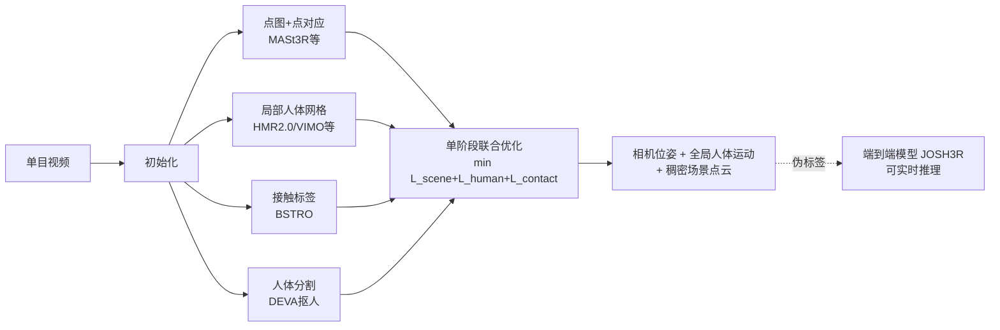

# Joint Optimization for 4D Human-Scene Reconstruction in the Wild

**会议**: ICLR 2026  
**OpenReview**: [https://openreview.net/forum?id=7eLE4mfEpz](https://openreview.net/forum?id=7eLE4mfEpz)  
**代码**: [https://vail-ucla.github.io/JOSH/](https://vail-ucla.github.io/JOSH/)  
**领域**: 3D 视觉 / 4D 人体-场景重建  
**关键词**: 4D 重建, 全局人体运动估计, 稠密场景重建, 人-场景接触约束, 联合优化, 单目视频  

## 一句话总结
JOSH 提出用「人-场景接触」作为桥梁，把相机位姿、全局人体运动和稠密场景点云放进**单阶段联合优化**，从网络上随手拍的单目视频里同时重建出物理一致的 4D 人-场景交互；并进一步用 JOSH 给 20 小时网络视频打伪标签，训练出可实时推理的端到端模型 JOSH3R。

## 研究背景与动机

**领域现状**：要理解人怎么和环境互动（行人怎么过马路、人怎么坐长椅爬楼梯），需要同时拿到人体运动、场景几何和相机轨迹。一类做法是在受控环境里先用多视角 RGBD/激光扫描预扫场景，再把人体运动拟合进去（PROX、RICH 那条线），数据采集成本高、覆盖的交互场景单调；另一类做法是从随手拍的网络视频里恢复全局人体运动（WHAM、TRAM 等），但它们普遍只重建人、不管场景，运动失去了环境的支撑和语义。

**现有痛点**：少数尝试 4D 人-场景重建的工作（SynCHMR、Luvizon 等）走的是**分阶段串行**路线——先估相机、再重建场景、最后单独优化人体运动。这种割裂忽略了相机、人、场景三者本可以**相互refine**的关系：人脚踩在哪里其实给了场景的尺度和深度线索，场景几何又反过来约束人的全局位置。串行流程下，人和场景的接触细节对不上，重建出来经常出现脚穿进地面、脚悬空的物理不合理结果。多数方法还只重建单人，多人之间在同一世界坐标下的一致性也没保证。

**核心矛盾**：4D 人-场景重建本质是一个**三方互相耦合**的问题（相机↔人↔场景），但主流方法用串行分解把耦合切断，导致尺度漂移、接触穿模、多人不一致。

**本文目标**：从单目野外视频里，同时恢复所有人的全局运动、稠密场景点云和相机参数，且保证人-场景接触在物理上成立、结果落在公制尺度上。

**核心 idea（接触即约束 + 单阶段联合优化）**：**人-场景接触是最自然的交互形式，它能提供把人、场景、相机三者绑在一起的几何约束**。JOSH 不再串行求解，而是把所有参数塞进**一个**梯度优化里，用两个接触损失（接触应贴合、接触应静止）引导整个系统收敛到一致且物理合理的重建。

## 方法详解

### 整体框架

JOSH（Joint Optimization of Scene Geometry and Human Motion）分两步：先用现成模型做**初始化**，再把所有参数放进**单阶段联合优化**。初始化阶段从视频里拿到四样东西——稠密场景点图与帧间点对应（来自 MASt3R/MonST3R/DROID-SLAM 等）、局部人体网格（来自 HMR2.0/WHAM/VIMO 等 SMPL 估计器）、逐顶点接触标签（来自接触预测模型 BSTRO）、以及单目深度先验（ZoeDepth）。关键的一步是先用视频分割模型 DEVA 把运动的人从画面里抠掉，只用背景点云做场景重建，避免动态人体污染依赖静态假设的几何匹配。优化阶段把相机内参 $K^t$、外参 $P^t$、每帧尺度 $\sigma^t$、深度图 $Z^t$ 和所有人的局部 SMPL 参数 $\Theta_c^t$ 一起当作变量，用一个总损失同时更新。

### 关键设计

**1. 接触场景损失 $L_{c1}$：把人的接触点和场景接触点拉到一起，并锚定公制尺度。** 这是整套方法的物理 grounding 来源。对每个预测的人体接触顶点 $x_h^t$（要求它可见，投影落在非人体 mask 区域 $1-M^t$ 内以避免深度歧义），JOSH 在背景场景点云里搜投影距离最近的点作为对应场景接触点 $x_s^t = \arg\min_{x^t\in \tilde X^t}|\pi(K^t,x^t)-\pi(K^t,x_h^t)|_2$，再用单目深度先验过滤掉深度差太大的错误对应。得到接触对应集 $D$ 后，损失直接约束二者在 3D 空间贴合：

$$L_{c1}=\sum_{(x_h^t,x_s^t)\in D}\rho(x_h^t-\sigma^t x_s^t)$$

由于人体先验损失里 SMPL 参数本身带公制信息，这个接触损失实际上把场景的尺度 $\sigma^t$、深度图、相机位姿一起拽向正确的公制刻度——消融里 $L_{c1}$ 一旦去掉，脚悬空率从 2.9% 暴涨到 92.9%，ATE 从 3.21 飙到 22.47，说明它是把整个系统从尺度漂移里拉回来的关键锚。注意接触顶点 $x_h^t$ 在优化中不断更新，所以对应的场景点 $x_s^t$ 每轮迭代都要重新搜。

**2. 接触静止损失 $L_{c2}$：维持接触的身体部位在相邻帧间不滑动。** 接触不仅意味着贴合，还意味着「当某顶点在连续帧都保持接触时，它相对场景应该是静止的」（脚踩地时不该滑）。JOSH 检查相邻帧是否同一顶点持续接触，得到集合 $E$，约束人体接触点和对应场景接触点在两帧之间都保持静止：

$$L_{c2}=\sum_{(x_h^i,x_h^j)\in E}\big(\rho(P^i x_h^i-\sigma^j P^j x_s^j)+\rho(P^j x_h^j-\sigma^i P^i x_s^i)\big)$$

这一项专门治脚部滑动——消融显示加上它后 foot sliding 从 68.2mm 降到 28.2mm，是物理可信度的直接贡献者。

**3. 单阶段总损失：场景重建 + 人体先验 + 接触约束三者同优化。** 总损失是三块相加：场景重建损失 $L_{scene}$（背景静态点的 3D 对应损失 + 2D 重投影损失）、人体先验损失 $L_{human}$（时序平滑 + SMPL 参数贴近初值 + 2D 关键点重投影正则）、以及核心的接触损失 $L_{contact}=w_{c1}L_{c1}+w_{c2}L_{c2}$：

$$L=L_{scene}+L_{human}+L_{contact}$$

所有参数 $\{K^t,P^t,\sigma^t,Z^t,\Theta_c^t\}$ 在**一个梯度优化器里同时更新**，这正是 JOSH 区别于 SynCHMR 那类串行方法的本质——三方不再有先后顺序、彼此可以持续互相修正。

**4. 联合优化焦距：把焦距和人体根深度绑定更新，治野外视频无内参的硬伤。** 网络视频通常没有相机内参，前人只能拿对角线像素长当固定焦距 $f$。但人体网格估计器输出的根深度 $t_z$ 与焦距成正比，焦距估错就会让人体运动产生无法挽回的误差。JOSH 把 $f$ 也加进优化变量，并在每轮迭代里令 SMPL 局部平移的深度分量 $t_z' = \frac{f}{f_{init}}t_z$ 随焦距同步缩放，保证深度调整和焦距更新一致。消融显示在没有真值内参的野外设定下，联合优化焦距能把 W-MPJPE 从 1220.7 降到 1053.4，FFR 从 15.2% 降到 6.8%。

**5. JOSH3R：把 JOSH 当标注机，蒸馏出可实时推理的端到端模型。** 优化方法虽准但慢（JOSH3 仅 0.8 FPS），且野外视频缺真值标注。JOSH 强到能直接给约 20 小时网络视频打全局运动伪标签，作者据此训练端到端模型 JOSH3R——在 MASt3R 几何骨干上加一个轻量「人体轨迹头」，直接预测相邻帧间的相对人体变换 $\Delta T_c^i$，再通过累乘 $T_g^t=\prod_{i=1}^{t-1}\Delta T_c^i\cdot T_c^1$ 无需优化地递推出全局运动和相机位姿，把推理拉到 15.4 FPS 的实时级别（精度换速度）。

## 实验关键数据

数据集：SLOPER4D（主，6 序列，LiDAR 标注全局运动/场景/相机）、EMDB-2（25 序列，仅人体运动+相机）、RICH（40 序列，仅人体运动+预扫场景）。指标涵盖人体运动（WA-MPJPE / W-MPJPE / RTE%）、场景（AbsRel / δ<1.25 / ATE / Chamfer Distance）、物理可信度（Jitter / Foot Sliding / Foot Floating Rate）。

### 主实验：4D 人-场景重建（SLOPER4D，对比串行基线 SynCHMR⋆）

| 方法 | 初始化(人/场景) | WA-MPJPE↓ | W-MPJPE↓ | ATE↓ | CD↓ | Jitter↓ | FS↓ | FFR%↓ |
|------|------|------|------|------|------|------|------|------|
| SynCHMR⋆ | HMR2.0 / DROID-SLAM | 233.2 | 1125.4 | 17.47 | 17.76 | 123.9 | 67.4 | 9.0 |
| JOSH1 | HMR2.0 / DROID-SLAM | 206.3 | 1094.2 | 17.18 | 16.84 | **7.6** | 56.9 | 3.3 |
| JOSH2 | WHAM / MonST3R | 210.4 | 994.3 | 14.53 | 9.09 | 7.8 | 45.3 | 2.1 |
| JOSH3 | VIMO / MASt3R | **120.0** | **438.3** | **3.21** | **5.31** | 7.1 | **28.2** | 2.9 |

同初始化下 JOSH1 全面超过 SynCHMR⋆，Jitter 从 123.9 骤降到 7.6；换更强初始化的 JOSH3 比 SynCHMR⋆的 WA-MPJPE 降 46.6%、CD 降 70.1%。在 EMDB 上 JOSH3 以 W-MPJPE 174.7 创下全局人体运动估计的新 SOTA（SLAHMR 776.1 → JOSH1 372.3；TRAM 222.4 → JOSH3 174.7）。

### 消融实验（SLOPER4D，基于 JOSH3 变体）

| 变体 | W-MPJPE↓ | RTE%↓ | AbsRel↓ | ATE↓ | FS↓ | FFR%↓ |
|------|------|------|------|------|------|------|
| −$L_{c1}$（去接触场景损失） | 1361.4 | 4.7 | 0.49 | 22.47 | 47.3 | 92.9 |
| −opt $\Theta_c$（不优化人体） | 486.4 | 1.8 | 0.17 | 3.28 | 35.6 | 3.2 |
| −$L_{c2}$（去接触静止损失） | 448.3 | 1.9 | 0.18 | 3.26 | 68.2 | 3.2 |
| **JOSH3（完整）** | **438.3** | 1.8 | 0.17 | **3.21** | **28.2** | **2.9** |
| 固定内参 | 1220.7 | 5.5 | 0.60 | 19.89 | 71.3 | 15.2 |
| 优化内参 | 1053.4 | 4.6 | 0.47 | 16.91 | 68.3 | 6.8 |

### 关键发现
- **$L_{c1}$ 是尺度锚**：去掉它 FFR 从 2.9% 崩到 92.9%、ATE 从 3.21 到 22.47，证明接触场景损失负责把整个系统拉到正确公制尺度。
- **联合优化人体确实有增益**：相比只优化场景+相机，再优化 $\Theta_c$ 让 W-MPJPE 从 486.4 改善到 438.3。
- **$L_{c2}$ 专治脚滑**：foot sliding 68.2 → 28.2。
- **野外要优化焦距**：无真值内参时优化焦距比固定焦距全面更好。
- **伪标签训练反超真值训练**：JOSH3R 用 JOSH 标注的网络视频训练，比用 EMDB 真值训练的 WA-MPJPE 改善 59.2%，且推理达 15.4 FPS（vs JOSH3 的 0.8 FPS），实现精度-速度权衡。

## 亮点与洞察
- **把「接触」从被动结果变成主动约束**：以往接触是重建完之后顺便检查的物理性，JOSH 反过来用接触对应作为驱动整个优化的核心信号，思路很顺也很 elegant。
- **单阶段联合优化的工程价值**：相比串行流程，让相机/人/场景在同一损失里持续互相修正，直接换来尺度一致和接触合理，消融把每一项的贡献量化得很干净。
- **框架的通用性**：JOSH 不绑定特定初始化器，HMR2.0/WHAM/VIMO ×  DROID-SLAM/MonST3R/MASt3R 都能插，意味着它能随上游模型进步而免费变强。
- **优化→蒸馏的闭环**：用慢而准的优化方法当大规模自动标注机，再蒸馏出快模型，是利用海量无标注网络视频的实用范式。

## 局限与展望
- **优化速度慢**：JOSH3 仅 0.8 FPS，实时只能靠精度打折的 JOSH3R（其精度明显落后于 JOSH3，如 EMDB W-MPJPE 174.7 → 661.7）。
- **重度依赖初始化质量**：接触标签、深度、点对应、人体网格都来自现成模型，初始化错误（尤其接触标签）会传导进优化。
- **接触搜索是启发式**：最近邻 + 深度先验过滤对脚/手接触有效，但对复杂或遮挡接触可能找错对应。
- **静态背景假设**：依赖 DEVA 抠人和背景静态假设，场景中其它动态物体仍是隐患。
- **展望**：更强的初始化模型可直接提升 JOSH；接触搜索可学习化；JOSH3R 的精度-速度差距还有压缩空间。

## 相关工作与启发
- **受控环境人-场景交互**：PROX、RICH、Jiang et al. 等先扫场景再拟合人，数据成本高、交互单调——JOSH 用野外视频绕开了预扫需求。
- **全局人体运动估计**：SLAHMR、WHAM、TRAM/VIMO 等只重建人不管场景；JOSH 把它们当初始化并用场景反哺，刷新 SOTA。
- **稠密场景重建**：DROID-SLAM、MonST3R、MASt3R 提供几何初始化，JOSH 在其上叠加人体接触约束实现公制重建。
- **启发**：「用物理交互约束把多个本应耦合却被工程拆开的子任务重新联合求解」是个可迁移的思路，例如手-物交互、多智能体场景重建都可借鉴这套「接触即约束 + 单阶段联合优化 + 优化蒸馏快模型」的范式。

## 评分
- **新颖性**: ⭐⭐⭐⭐ —— 单阶段联合优化 + 接触损失作为核心驱动信号的组合很清晰，虽然各部件（SMPL、点图、接触预测）都来自现成工作，但把它们统一进一个互相 refine 的优化框架并量化每项贡献，是扎实的概念贡献。
- **实验充分度**: ⭐⭐⭐⭐ —— 三数据集、多初始化变体、细致消融、效率分析、伪标签蒸馏闭环都覆盖了，证据链完整；略欠多人场景的定量评估。
- **写作质量**: ⭐⭐⭐⭐ —— 动机-方法-实验逻辑顺畅，公式和损失定义清楚，图示到位。
- **价值**: ⭐⭐⭐⭐ —— 直接刷新全局人体运动 SOTA，且打开了用海量网络视频做可扩展训练的路径，对 4D 人-场景重建和具身/自动驾驶下游有实际意义。

<!-- RELATED:START -->

## 相关论文

- [\[CVPR 2026\] EmbodMocap: In-the-Wild 4D Human-Scene Reconstruction for Embodied Agents](../../CVPR2026/3d_vision/embodmocap_in-the-wild_4d_human-scene_reconstruction_for_embodied_agents.md)
- [\[CVPR 2026\] CARI4D: Category Agnostic 4D Reconstruction of Human-Object Interaction](../../CVPR2026/3d_vision/cari4d_category_agnostic_4d_reconstruction_of_human_object_interaction.md)
- [\[CVPR 2026\] 4D Primitive-Mâché: Glueing Primitives for Persistent 4D Scene Reconstruction](../../CVPR2026/3d_vision/4d_primitive-mache_glueing_primitives_for_persistent_4d_scene_reconstruction.md)
- [\[ICLR 2026\] UFO-4D: Unposed Feedforward 4D Reconstruction from Two Images](ufo-4d_unposed_feedforward_4d_reconstruction_from_two_images.md)
- [\[ICLR 2026\] A Step to Decouple Optimization in 3DGS](a_step_to_decouple_optimization_in_3dgs.md)

<!-- RELATED:END -->
