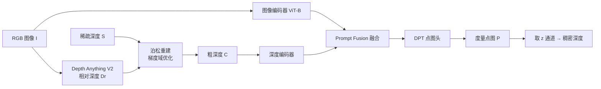

# Large Depth Completion Model from Sparse Observations

**会议**: ICLR 2026  
**OpenReview**: [https://openreview.net/forum?id=I9o2OkPwCX](https://openreview.net/forum?id=I9o2OkPwCX)  
**代码**: [https://pkqbajng.github.io/ldcm/](https://pkqbajng.github.io/ldcm/)（Project Page）  
**领域**: 3D 视觉 / 深度补全 / 点图估计  
**关键词**: 深度补全, 点图回归, 单目深度基础模型, 泊松重建, 度量尺度, 零样本泛化  

## 一句话总结
LDCM 用一个"不堆复杂模块"的极简框架做稀疏深度补全：前端用泊松重建把单目深度基础模型的相对深度和稀疏观测对齐成度量一致的粗深度，后端把传统深度回归头换成逐像素 3D 点图回归头，从而在六个 benchmark 的零样本深度补全与点图估计上全面刷到 SOTA。

## 研究背景与动机
- **领域现状**：深度补全要从一张 RGB 图 + 稀疏深度（LiDAR、SfM 关键点、低成本深度相机）恢复稠密度量深度。传统方法（空间传播网络 SPN 系列、2D-3D 联合方法）在 NYUv2、KITTI 这类单域数据上表现很好。近期顺着基础模型的东风，prompt-based 方法（PromptDA、MarigoldDC、PriorDA）把稀疏深度当作条件信号去 prompt 单目深度/扩散基础模型，引导预测走向度量尺度。
- **现有痛点**：这些方法本质上把深度补全当成**深度恢复任务**——模型学的是在稀疏观测条件下插值或去噪深度值，偏好局部平滑和纹理感知补全，但缺乏显式的 3D 几何推理。一旦遇到严重的域偏移、或高度不规则的稀疏图（SfM 点云那种密度不均、大片缺失），就力不从心。
- **核心矛盾**：稀疏先验本身分布五花八门（随机点、关键点、LiDAR 线扫），现有对齐策略要么太粗（全局仿射假设全图统一 scale/shift，无法恢复逐像素度量值），要么太脆（局部加权线性回归 LWLR 对稀疏密度和分布极其敏感，极稀疏下甚至不如全局对齐）。同时把任务设成深度恢复，监督信号本身就没有把 3D 结构讲清楚。
- **本文目标**：造一个简单、有效、鲁棒的大深度补全模型，在高度稀疏且不规则的观测下也能输出度量准确的稠密深度，而且能零样本泛化到未见数据分布。
- **核心 idea**：**问题不在于网络要多复杂，而在于"输入预处理"和"训练目标"两端的重构**——① 用泊松重建在梯度域把基础模型的相对深度结构和稀疏点的度量锚点融合成高质量粗深度；② 把输出从深度图改成相机坐标系下的逐像素点图，让网络直接学 3D 场景结构而非逐像素深度修复，顺带摆脱对相机内参的依赖。

## 方法详解

### 整体框架
给定 RGB 图 $I \in \mathbb{R}^{H\times W\times 3}$ 和稀疏深度图 $S \in \mathbb{R}^{H\times W}$，LDCM 预测相机坐标系下的度量点图 $P \in \mathbb{R}^{H\times W\times 3}$，最终稠密深度直接取点图的 z 通道。整条管线分两段：第一段用单目深度基础模型（DepthAnythingV2-S）+ 泊松重建生成度量一致的粗深度图 $C$；第二段用 ViT-B（DINOv2 预训练）双编码器深度补全网络吃下图像 $I$ 和粗深度 $C$，回归出最终点图 $P$。

### 关键设计

**1. 泊松粗深度对齐：把基础模型的相对深度"锚"进度量空间**。直接插值稀疏点会因缺乏几何先验而产生严重伪影，而全局仿射对齐假设全图统一尺度无法恢复逐像素度量、LWLR 又对稀疏分布过敏。LDCM 把对齐重写成一个梯度域重建问题：希望生成的粗深度 $C$ 既贴合相对深度 $D_r$ 的几何结构，又在观测点上保留稀疏值 $S$，即最小化

$$C = \arg\min_{D} \left( \sum_i \lVert \nabla\log D_i - G_i \rVert^2 + \lambda \sum_{i\in\Omega}(D_i - S_i)^2 \right),$$

其中 $\Omega$ 是有效稀疏点集合，$\lambda$ 平衡两项。这里的巧思在于目标梯度场 $G$ 的构造：朴素取 $G=\nabla\log D_r$ 会忽略相对深度未知的 scale/shift 而在度量空间错位。作者先用全局仿射 $(\alpha,\beta)=\arg\min\sum_{i\in\Omega}(S_i-\alpha' (D_r)_i-\beta')^2$ 对齐 $D_r$ 与 $S$，定义 $\gamma=\beta/\alpha$，再设 $G=\nabla\log(D_r+\gamma)$。这个偏移 $\gamma$ 来自训练时相对深度由度量真值经仿射 $D_r=(D^*-\beta)/\alpha$ 得到的事实，能把梯度结构对齐到度量尺度。最终式 (4) 用共轭梯度法求解，每个稀疏点都是一个全局能量锚点，其影响通过梯度场的结构约束传播到整张图——这正是它在极稀疏下仍鲁棒的根源。

**2. 点图回归头替换深度回归头：让网络直接学 3D 结构**。深度补全网络用双编码器分别从粗深度 $C$ 和 RGB 图抽特征，经 Prompt Fusion block 融合。关键改动在输出端：不再回归深度图，而是用点图头直接预测逐像素 3D 坐标 $P$。深度图本质是和相机内参绑定的 2.5D 表示，点图则显式建模 3D 结构——让网络整体性地学场景几何而非逐像素深度修复。这个端到端表述还有副产物：模型天然输出度量尺度 3D 点图，不需要相机内参，能直接部署到未标定环境。消融（Table 5）证实点图表示比"深度图"或"深度+ray map"都更优，REL 从 0.026 降到 0.022、点图 RELp 从 0.067 降到 0.045。

**3. 三项互补的点图损失：全局结构 + 局部细节 + 表面法向**。在预测点图 $P$ 和真值 $\hat P$ 上施加 $L = L_{global} + \lambda_{local}L_{local} + \lambda_{normal}L_{normal}$。全局项用逆深度加权的 L1 强制整体结构一致 $L_{global}=\sum_{i\in M}\frac{1}{\hat D_i}\lVert P_i-\hat P_i\rVert_1$；局部项采样锚点并在 3D 空间定义球形邻域 $S_j$，在邻域内做同样的加权 L1，鼓励与图像视角无关的局部一致性；法向项 $L_{normal}=\sum_{i\in M}\arccos\!\big(\frac{N_i^\top \hat N_i}{\lVert N_i\rVert\lVert\hat N_i\rVert}\big)$ 约束从点图估计的表面法向对齐，促进表面平滑。三者从不同尺度共同把 3D 几何结构监督到位。

## 实验关键数据

训练用 11 个公开 RGB-D 数据集约 270 万样本，16 张 H20 GPU 训练约 6 天，200K 迭代，全局 batch 128。稀疏输入按 OMNI-DC 协议合成（含噪随机采样、SIFT/ORB 关键点、LiDAR 线扫模拟 64/32/16/8 线）。

### 主实验：零样本深度补全（Table 1，平均 REL↓）

| 方法 | KITTI | iBims-1 | DIODE 室内 | DIODE 室外 | ETH3D | 平均 |
|------|-------|---------|-----------|-----------|-------|------|
| OMNI-DC | 0.042 | 0.018 | 0.022 | 0.049 | 0.016 | 0.029 |
| PriorDA | 0.044 | 0.018 | 0.012 | 0.051 | 0.017 | 0.028 |
| SPNet | 0.041 | 0.016 | 0.028 | 0.048 | 0.019 | 0.030 |
| **LDCM (Ours)** | **0.026** | **0.012** | **0.008** | **0.031** | **0.008** | **0.017** |

平均 REL 0.017，相比次优的 PriorDA(0.028)/OMNI-DC(0.029) 大幅领先，且五个数据集全部排名第一。

### 点图估计（Table 2，平均，零样本）

| 方法 | MAEp↓ | RMSEp↓ | RELp↓ | δp₁↑ |
|------|-------|--------|-------|------|
| OMNI-DC | 0.629 | 0.996 | 0.075 | 0.950 |
| PriorDA | 0.622 | 0.971 | 0.071 | 0.961 |
| SPNet | 0.624 | 1.092 | 0.075 | 0.952 |
| **LDCM (Ours)** | **0.404** | **0.743** | **0.042** | **0.991** |

仿射不变点图估计（Table 3）平均 RELp 0.037，也超过 VGGT/MoGe V2/WorldMirror 等纯相对几何方法，说明引入度量监督并没有牺牲相对几何精度。

### 消融实验
**粗深度对齐策略（Table 4，REL↓）**：

| 配置 | 粗深度平均 | 最终预测平均 |
|------|-----------|------------|
| 仅稀疏点 | - | 0.029 |
| 全局对齐 | 0.087 | 0.024 |
| LWLR | 0.088 | 0.025 |
| 泊松 w/o 全局对齐 | 0.147 | - |
| **泊松（完整）** | **0.059** | **0.022** |

**输出表示（Table 5）**：SI-Log 深度 REL 0.026 → 点图 0.022；点图估计 RELp 0.067 → 0.045。

### 关键发现
- 泊松对齐在极稀疏下显著优于全局/LWLR，且**全局对齐这一步不可省**（去掉后粗深度 REL 从 0.059 恶化到 0.147）；LWLR 在极稀疏时甚至不如简单的全局对齐。
- 点图输出表示比深度图、深度+ray map 都更能提供有效的 3D 结构指导。
- 在极端稀疏下仍保持高精度，零样本泛化能力强——这正是"重构输入与目标"而非"堆模块"带来的红利。

## 亮点与洞察
- **范式转变**：把深度补全从"深度恢复"重新定义为"3D 点图估计"，一句话的改动却让监督信号从 2.5D 升级到显式 3D，附带摆脱相机内参依赖。这是全文最值钱的观点。
- **泊松重建的复用很妙**：经典的梯度域泊松编辑被借来融合"基础模型的相对结构"和"稀疏点的度量锚点"，比仿射/LWLR 都更稳，且自带"稀疏点影响全图传播"的好性质。
- **极简主义有效性证明**：不设计任何花哨模块（双编码器 + Prompt Fusion + DPT 头都是现成件），靠输入预处理 + 训练目标两端发力就拿下六个 benchmark SOTA，对"模块军备竞赛"是一记反思。

## 局限与展望
- 依赖单目深度基础模型（DepthAnythingV2）的质量，粗深度上限受其相对深度精度制约；基础模型在某些极端场景失效时，泊松对齐的几何先验也会被污染。
- 泊松重建需共轭梯度迭代求解，作为前置步骤会引入额外推理开销，文中未给出端到端的延迟/吞吐数据。
- 训练规模较大（270 万样本、16×H20、6 天），复现成本不低；点图损失中 $\lambda_{local}$、$\lambda_{normal}$ 等超参的敏感性未充分展开。
- 与并发工作 MapAnything 的边界（同样从图像+先验估计度量几何）值得进一步对比厘清。

## 相关工作与启发
- **深度补全**：从 SPN 系列（CSPN、NLSPN）到 2D-3D 联合方法，再到 prompt-based 的 PromptDA、MarigoldDC、PriorDA、TestPromptDC，主线是不断借助基础模型增强泛化；LDCM 指出它们共有的"深度恢复"局限。
- **单目深度基础模型**：DepthAnything V1/V2、UniDepth、Marigold 等提供可泛化几何先验，被下游 stereo（FoundationStereo）、深度超分（DuCos）、深度补全（PriorDA 的 LWLR 对齐）广泛复用；LDCM 用泊松对齐替换 LWLR。
- **几何估计基础模型**：DUSt3R/MASt3R/VGGT/MoGe 的点图表示证明了显式 3D 建模的潜力，LDCM 把点图表示首次系统引入深度补全任务，是跨领域迁移的范例。
- **启发**：当一个任务长期被某种输出表示（深度图）锁定时，换一个更贴近物理本质的表示（点图）+ 一个更几何一致的输入预处理，往往比继续堆模块更能突破天花板。

## 评分
- **新颖性**: ⭐⭐⭐⭐ 泊松对齐复用 + 点图头替换深度头，单看每件都不算全新，但组合到深度补全任务并系统验证"输入/目标两端重构 > 堆模块"的观点很有说服力。
- **实验充分度**: ⭐⭐⭐⭐⭐ 六个 benchmark、三类稀疏模式、深度补全/点图/仿射不变点图三套评测，外加对齐策略与输出表示的细致消融，覆盖全面且全面领先。
- **写作质量**: ⭐⭐⭐⭐ 动机—方法—实验逻辑清晰，泊松公式推导（$\gamma$ 偏移的来由）讲得明白；个别处理细节（延迟开销、超参敏感性）略欠。
- **价值**: ⭐⭐⭐⭐⭐ 零样本度量深度补全直接服务机器人/自动驾驶/AR，SOTA 且摆脱内参依赖，实用价值高，范式启发性强。

<!-- RELATED:START -->

## 相关论文

- [\[ICLR 2026\] ORCaS: Unsupervised Depth Completion via Occluded Region Completion as Supervision](orcas_unsupervised_depth_completion_via_occluded_region_completion_as_supervisio.md)
- [\[CVPR 2026\] Dense Metric Depth Completion from Sparse Direct Time-of-Flight Sensors](../../CVPR2026/3d_vision/dense_metric_depth_completion_from_sparse_direct_time-of-flight_sensors.md)
- [\[CVPR 2026\] Zero-Shot Depth Completion with Vision-Language Model](../../CVPR2026/3d_vision/zero-shot_depth_completion_with_vision-language_model.md)
- [\[CVPR 2026\] PatchScene: Patch-based Voxel Diffusion Model for Large-Scale Scene Completion](../../CVPR2026/3d_vision/patchscene_patch-based_voxel_diffusion_model_for_large-scale_scene_completion.md)
- [\[ICCV 2025\] Omni-DC: Highly Robust Depth Completion with Multiresolution Depth Integration](../../ICCV2025/3d_vision/omni-dc_highly_robust_depth_completion_with_multiresolution_depth_integration.md)

<!-- RELATED:END -->
