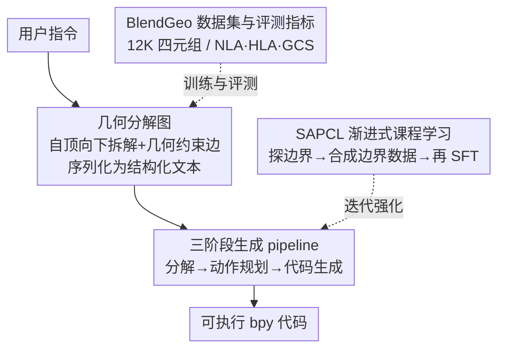

# Learning Hierarchical and Geometry-Aware Graph Representations for Text-to-CAD

**会议**: ICLR 2026  
**OpenReview**: [https://openreview.net/forum?id=oKMomThD6n](https://openreview.net/forum?id=oKMomThD6n)  
**代码**: https://github.com/SCUT-MMPR/Graph-CAD  
**领域**: 3D视觉 / CAD生成 / 代码生成  
**关键词**: Text-to-CAD, 几何分解图, 中间表示, 课程学习, 几何约束

## 一句话总结
Graph-CAD 把"文本→CAD 代码"这个长程任务拆成三段，先让 LLM 生成一张**显式表达装配层级与几何约束的分解图**作为中间表示，再依次规划动作、生成 bpy 代码，并配一套结构感知的渐进式课程学习不断逼近模型能力边界，在 CADBench 上的几何约束满足率（GCS）从端到端的 ~0.40 拉到 0.90。

## 研究背景与动机
**领域现状**：Text-to-CAD 想把自然语言指令直接变成可执行的 CAD 程序（如 Blender 的 bpy 代码），降低专业设计门槛。主流做法（Text2CAD、CADLLM、BlenderLLM）都是用 Transformer/LLM 把文本**端到端**直接解码成参数化程序代码。

**现有痛点**：CAD 生成是典型的**长程（long-horizon）任务**——一个复杂装配体要翻译成一长串互相依赖的操作。端到端解码把整个设计过程"压平"成一条线性 token 序列，既没有显式的装配层级，也没有显式的零件间几何约束。结果是解码器要在一个巨大的搜索空间里盲走，早期一个小错误（比如某个零件尺寸或位置定偏了）会沿序列层层传播，最终让整个复杂装配体作废。这类方法在单零件物体上还行，一到多零件设计就频繁崩。

**核心矛盾**：复杂装配既要**全局结构一致**（最终装配体符合用户意图），又要**严格满足局部几何依赖**（每一步操作的接触、对齐、相对朝向都正确）。扁平的代码序列同时承载这两类信息，约束信息被隐式埋在 token 流里，模型很难既顾全局又守局部，错误自然累积。

**本文目标**：给长程生成插入一个能显式承载"装配层级 + 几何约束"的中间表示，把一步到位的难题切成几个可控的子阶段，从而剪掉搜索空间、提升几何保真度和约束满足率；同时解决零件数/约束密度变大时模型泛化不动的问题。

**切入角度**：作者观察到 CAD 装配天然是**层级化**的——一个产品可以自顶向下递归拆成部件、子部件，直到能用基本算子（bpy primitive）实现的原子组件；零件之间的空间关系本质上是一组**几何约束**（对齐、贴合、偏移）。这种结构用图来表达再自然不过：节点 = 多层级的零件/组件，边 = 它们之间的显式几何约束。

**核心 idea**：不把文本直接映射到代码，而是先学一张**层级化、几何感知的分解图**当中间表示，让模型"先想清楚结构和约束，再生成代码"。

## 方法详解

### 整体框架
Graph-CAD 是一个三阶段串行框架，每个阶段由一个独立的、基于 LLM 的模块负责，把"用户指令 → 可执行 bpy 代码"拆成三跳：**几何分解（Geometry Decomposition）→ 动作规划（Action Planning）→ 代码生成（Code Generation）**。

- **Stage 1 几何分解**：几何分解模型接收用户指令，按两条原则构造分解图——① 自顶向下递归拆解（从完整产品一路拆到能用 bpy 原语实现的原子组件，形成多层级节点）；② 建立几何约束（把零件间空间关系编码成边）。最后把这张图序列化成一段**结构化文本**（逐层列出节点和约束边，如 `Align(XYZ) Door.back_face to Body.front_face`）。
- **Stage 2 动作规划**：动作规划模型利用分解图里的节点特征和几何约束，决定一个最优的**图遍历顺序**，把非线性的图转成一条线性的 CAD 操作序列（先建哪个零件、再对齐到哪个面、最后组装成什么）。
- **Stage 3 代码生成**：代码生成模型把规划好的操作序列翻译成可执行的 bpy 代码。

这套设计的训练侧由 **SAPCL（结构感知渐进式课程学习）** 包裹：它在"用全量数据微调三个模块"和"探测模型能力边界、合成边界难度新数据"之间交替迭代，专门强化复杂高约束装配的图预测能力。三个生成模块都用 Qwen3-8B 做骨干 + LoRA（rank 64）微调。

### 关键设计

**1. 层级化、几何感知的分解图：把隐式约束变成显式的中间表示**

这是全文的地基，直接针对"扁平代码序列把装配层级和几何约束都埋成隐式 token、导致搜索空间爆炸、误差累积"这个痛点。作者定义的分解图 $G=(V,E)$ 中，节点 $V$ 是多层级的零件/组件（如 `microwave_oven` → `Door` + `Body` → `Door_window`/`Control_panel`/...），通过**自顶向下递归拆解**得到，递归终点是能被 bpy 原语（Cuboid、Disc、boolean_subtract 等）直接实现的原子组件；边 $E$ 编码零件间的**显式几何约束**，如 `Align(XYZ) Turntable.bottom_face to Body_shell.bottom_face; offset(0,0,0.056)`。这张图最终被序列化成结构化文本（分层列出节点定义和约束链），作为后续阶段的条件输入。

它有效的关键在于：把"该有哪些零件、它们怎么嵌套、谁对齐到谁"这些结构先验从代码 token 流里**抽出来显式声明**，相当于先画好装配蓝图再施工。后续解码只需在这张图约束下走，搜索空间被大幅剪枝，全局一致性和局部几何依赖都更容易守住。表 1 显示，即便不做任务微调、只给通用 LLM 两样例 few-shot 提示走这套图中介流程，GCS 也能大涨（GPT-5 在 Wild 上 0.40→0.58），说明收益来自范式本身而非特定训练。

**2. 三阶段解耦的生成 pipeline：把"图→代码"的跨度再切一刀**

光有图还不够——从一张非线性的图到一段线性可执行代码，中间还有"该按什么顺序建零件、怎么把图的拓扑摊平成步骤"的鸿沟。作者没让一个模型从图直接吐代码，而是再插一个**动作规划**阶段：动作规划模型读图的节点和约束，决定图遍历顺序，产出一条显式的 CAD 操作序列（如"先建 Panel_base → 建 Control_buttons 并对齐到 Panel_base 前面 → 组装成 Control_panel → ..."），再交给代码生成模型逐步翻译成 bpy。

三个阶段各由专用 LLM 模块负责，职责单一。消融（表 3）证明这一刀切得值：去掉动作规划（w/o Action Planning，直接图→代码）后，指令遵循（Inst.）和语法错误率（Esyntax）明显变差——Wild 的 Esyntax 从 4.5% 涨到 11.0%，说明"把非线性图显式规划成线性程序"这一步对生成可执行代码至关重要。而去掉图分解（w/o Graph Decom.，直接指令→动作序列）虽比端到端好，但仍远低于完整模型，反过来印证了分解图捕捉结构关系的不可替代性。

**3. SAPCL 结构感知渐进式课程学习：主动探到能力边界再喂边界难题**

随着零件数和约束密度上升，复杂高约束设计的误差更容易复合，而配对数据稀缺让模型泛化不动。SAPCL 针对的就是这个"越复杂越学不会"的瓶颈，核心思路是**先测出模型当前能稳定解到哪一档难度，再精准合成卡在这条边界上的新数据**去拓宽它。机制在两个模块间交替迭代：**SFT**（用全量数据微调三个模块，得到本轮基线模型）和 **SAPCE（结构感知渐进课程探索）**。

SAPCE 的流程是：先从训练集采种子样例（优先采样本少的类别保证多样性）；对每个种子，用一个 LLM 实现的 **Problem Generator** 基于原指令和分解图合成三档难度变体——Easy（改尺寸/纹理等简单属性）、Intermediate（改局部几何结构）、Advanced（迁移到结构相似或功能相关的不同品类）；微调后的模型按难度升序去解这些变体，一个**多模态 Discriminator** 自动判对错，找出每个种子上模型能稳定搞定的最高难度档，所有种子汇总即模型当前的**能力边界**；随后 **Boundary Data Generation** 在边界及略超出处合成新训练样本（如模型在 Intermediate 通关，就生成 Intermediate 和 Advanced 两档新数据，辅助 LLM 用原样例做 one-shot 加速），经校验后并入训练集供下一轮 SFT。整套循环重复 4 轮，模型逐步学会更复杂的结构。表 2 显示 SAPCL 相对纯 SFT 在 GCS 上 Sim 0.7830→0.9018、Wild 0.8025→0.8943，OOD 的 Inst. 也涨 10.82%，说明边界聚焦的数据增广确实把泛化往复杂装配方向推。

**4. BlendGeo 数据集与图保真度评测指标：补齐图中介范式的训练与评估基建**

此前没有把自然语言指令和图结构几何分解配对的数据集，作者用人机协同流程构建了 **BlendGeo**——12K 个四元组（用户指令、序列化为结构化文本的几何分解图、动作序列、可执行 bpy 代码），指令覆盖 1.4K 物体品类（取自 BlendNet）。标注流程是 LLM 按结构化提示先产初稿四元组，VLM 评视觉-语义对齐，再由专业工业设计师确认或全面修订图/序列/代码。同一流程也用来标注 CADBench 评测集。

为评估中间表示本身的质量，作者新提了两个图保真度指标：**节点级准确率 NLA**（是否生成了正确的零件节点集合）和**层级级准确率 HLA**（零件的层级结构/边是否正确）；外加结构完整性指标 **GCS（几何约束满足率）**，衡量最终装配里零件是否满足预定义的接触、对齐、相对朝向等几何关系。这套指标让"任意图中介 Text-to-CAD 方法"都有了可量化的中间表示评估手段，而不只是看最终渲染图。

### 一个例子：生成一台微波炉
用户指令"做一个微波炉：门上有稍大的透明窗、矩形机身、右侧控制面板、内部转盘"。Stage 1 几何分解递归拆出：`microwave_oven` → `Door`(=`Door_window`+`Control_panel`) + `Body`(=`Body_shell`+`Turntable`)，并写出约束边，如门背面对齐机身正面、转盘底面对齐机身壳底面并偏移 0.056m；序列化成分层结构化文本。Stage 2 动作规划把这张图摊平成有序步骤：先建 Panel_base→建按键并对齐→组装成 Control_panel→建 Door_window→把控制面板右面对齐窗左面→组装成 Door→……。Stage 3 代码生成逐步翻译成 bpy（`add_cube`、`boolean_union`、按面中心做 `location` 偏移对齐）。读者能看到：约束信息（"右面对齐左面"）在图里就被钉死，到代码阶段只是机械执行，而不是让解码器自己猜空间关系。

## 实验关键数据

### 主实验
在 CADBench 上评测，分 CADBench-Sim（分布内指令）和 CADBench-Wild（分布外指令）。指标：Attr.（属性）、Spat.（空间关系）、Inst.（指令遵循）、Avg.（前三者均值，VLM 打分）、Esyntax（语法错误率）、CLIP（文本-形状语义对齐）、GCS（几何约束满足率）。

| 方法 | Sim Avg.↑ | Sim Esyntax↓ | Sim GCS↑ | Wild Avg.↑ | Wild Esyntax↓ | Wild GCS↑ |
|------|-----------|--------------|----------|------------|---------------|-----------|
| BlenderLLM | 0.5832 | 2.4% | 0.5513 | 0.5909 | 5.3% | 0.4983 |
| GPT-5（端到端） | 0.6203 | 2.8% | 0.3846 | 0.6515 | 5.5% | 0.4017 |
| Claude-opus-4-1（端到端） | 0.6662 | 7.4% | 0.4932 | 0.6687 | 14.5% | 0.5062 |
| Graph-CAD (SFT) | 0.6431 | 2.2% | 0.7830 | 0.6692 | 4.5% | 0.8025 |
| **Graph-CAD (SAPCL)** | **0.6883** | **2.0%** | **0.9018** | **0.7114** | **2.5%** | **0.8943** |

Graph-CAD (SAPCL) 在所有指标上最优，GCS 领先尤其悬殊（Wild 0.89 vs 端到端 0.40 量级），且语法错误率压到最低（Sim 2.0% / Wild 2.5%）。OOD（Wild）上的强表现说明图中介范式学到了更可泛化的解法。

### 消融实验

三阶段 pipeline 消融（SFT 设定，表 3）：

| 配置 | Sim Avg.↑ | Sim Esyntax↓ | Sim GCS↑ | Wild Esyntax↓ | Wild GCS↑ | 推理耗时(s)↓ |
|------|-----------|--------------|----------|---------------|-----------|--------------|
| End-to-end | 0.5573 | 5.8% | 0.6923 | 8.0% | 0.7012 | 64.9 |
| w/o Graph Decom. | 0.6166 | 5.0% | 0.7268 | 6.5% | 0.7207 | 79.5 |
| w/o Action Planning | 0.5874 | 6.4% | 0.7545 | 11.0% | 0.7451 | 91.8 |
| **Graph-CAD (SFT)** | **0.6431** | **2.2%** | **0.7830** | **4.5%** | **0.8025** | 104.8 |

SAPCL 课程设计消融（图 6）：与 Only SFT、w/o Hierarchical Difficulty（仅随机改写指令扩充、不分难度，仿 BlenderLLM 自改进）相比，在每轮数据量对齐的条件下，SAPCL 在 Avg./NLA/HLA/GCS 四条曲线随迭代轮次都持续领先，能力边界（图 6e）逐轮把更多种子从 Fail/Easy 推到 Interm./Adv.。

### 关键发现
- **GCS 是最大受益项**：图中介范式对"几何约束满足"的提升远大于对视觉指标的提升，印证了显式约束建模正是端到端方法的命门；即便零训练、给通用 LLM few-shot 走三阶段，GCS 也能大涨。
- **两个中间表示缺一不可**：去掉图分解或去掉动作规划都明显掉点——前者伤结构表达力，后者尤其伤指令遵循和代码可执行性（Esyntax 飙升），说明"图→序列→代码"两次切分各自承担不同职责。
- **结构换准确性，代价是时间**：三阶段把单样本推理时间从端到端的 64.9s 抬到 104.8s，作者把它定位为可接受的"适度增加"，换来的是 GCS 和可执行性的大幅改善。
- **课程要分难度才有用**：仅随机改写指令扩数据（w/o Hierarchical Difficulty）收益有限，必须按 Easy/Interm./Adv. 分档并瞄准能力边界，才把复杂高约束装配的泛化推上去。

## 亮点与洞察
- **用"图"给长程代码生成插一层装配蓝图**：把 CAD 装配天然的层级 + 约束结构显式化为图中间表示，本质是在用领域结构先验剪枝搜索空间——这套"先结构、后代码"的思路可迁移到任何带强结构约束的长程生成（如电路布局、机器人任务规划、UI 代码）。
- **能力边界自适应的课程学习**：SAPCL 不是预设固定难度曲线，而是用 Discriminator 实测每个种子的能力边界、再合成卡边界的新数据，等于让模型"哪不会补哪"。这种 boundary-focused 数据增广在配对数据稀缺时特别值钱。
- **图中介范式自带可评估的中间产物**：NLA/HLA 让人能直接评"图对不对"，而不只看最终渲染——这把一个黑箱长程任务拆出了可诊断的中间检查点，便于定位错误发生在分解、规划还是代码阶段。

## 局限与展望
- **推理成本上升**：三阶段串行 + 每阶段独立 LLM 调用，单样本耗时约为端到端的 1.6 倍，实时/批量场景下成本不可忽视。
- **依赖强标注与强判别器**：BlendGeo 由 LLM+VLM+专业设计师协同标注，SAPCL 的难度判定也依赖多模态 Discriminator 的可靠性；判别器误判会直接污染边界数据合成与课程方向。
- **约束类型有限**：GCS 衡量的是接触、对齐、相对朝向这类几何约束，对更复杂的参数化/功能性约束（运动副、可动部件）覆盖如何，正文未充分展开。
- **改进思路**：可探索三阶段的联合优化或共享骨干以摊薄推理成本；把分解图扩到带运动/物理约束的图，向可仿真装配体延伸。

## 相关工作与启发
- **vs Text2CAD / CADLLM**: 它们用 Transformer 把文本直接映射到参数化程序，本文先生成几何分解图当中间表示再分阶段落地；本文优势是显式建模装配层级与几何约束、在多零件复杂装配上鲁棒性强（Text2CAD 在 CADBench 上 Avg. 仅 0.19 量级）。
- **vs BlenderLLM**: BlenderLLM 用 LLM + 自改进循环精炼命令序列，仍是端到端范式且自改进只随机改写、不分难度；本文的 SAPCL 引入分档难度变体 + 能力边界探测，针对性强化高约束装配，GCS 大幅领先。
- **vs CoT / 视觉反馈类规划增强（Guan/Badagabettu 等）**: 这些是 planner 层的增强，没有显式的结构模型，复杂装配上误差照样累积；本文把"结构"做成可学习、可评估的图表示，是范式级而非提示级的改动。

## 评分
- 新颖性: ⭐⭐⭐⭐⭐ 首次把"层级+几何约束的分解图"作为可学习中间表示引入 Text-to-CAD，并配能力边界自适应课程学习。
- 实验充分度: ⭐⭐⭐⭐ Sim/Wild 双设定、多 baseline、三阶段与课程双重消融齐全；约束类型与更大规模泛化的边界可再补。
- 写作质量: ⭐⭐⭐⭐ 框架与图示清晰，微波炉贯穿例子帮助理解；部分指标定义放在附录。
- 价值: ⭐⭐⭐⭐⭐ GCS 从 ~0.40 拉到 0.90，且为图中介 CAD 生成提供了数据集与评测基建，方法论可迁移到其他结构化长程生成任务。

<!-- RELATED:START -->

## 相关论文

- [\[CVPR 2026\] Velox: Learning Representations of 4D Geometry and Appearance](../../CVPR2026/3d_vision/velox_learning_representations_of_4d_geometry_and_appearance.md)
- [\[ICLR 2026\] DreamCS: Geometry-Aware Text-to-3D Generation with Unpaired 3D Reward Supervision](dreamcs_geometry-aware_text-to-3d_generation_with_unpaired_3d_reward_supervision.md)
- [\[CVPR 2026\] Learning Hierarchical Hyperbolic Mixture Model for Part-aware 3D Generation](../../CVPR2026/3d_vision/learning_hierarchical_hyperbolic_mixture_model_for_part-aware_3d_generation.md)
- [\[ICLR 2026\] $\pi^3$: Permutation-Equivariant Visual Geometry Learning](pi3_permutation-equivariant_visual_geometry_learning.md)
- [\[AAAI 2026\] Graph Smoothing for Enhanced Local Geometry Learning in Point Cloud Analysis](../../AAAI2026/3d_vision/graph_smoothing_for_enhanced_local_geometry_learning_in_point_cloud_analysis.md)

<!-- RELATED:END -->
